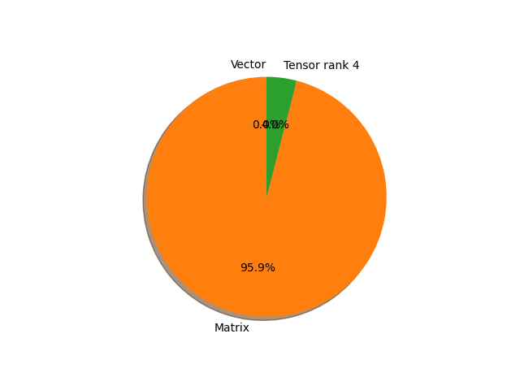

# alexnet parameter information

**Number of layers: [ 16 ]**

**Number of parameters: [ 61.10M ]**

**Proportional of each form** (%)

| Vector | Matrix | Tensor rank 4 | 
|  --- | --- | --- |
| 50.00 | 18.75 | 31.25 | 

**Proportional of parameters by form** (%)

| Vector | Matrix | Tensor rank 4 | 
|  --- | --- | --- |
| 0.02 | 95.94 | 4.04 | 

**Layer information**

| Name | Shape | Squeezed shape | Number of parameters | Form |
| --- | --- | --- | --- | --- |
| features.0.weight | (64, 3, 11, 11) | (64, 3, 11, 11) | 23232 | Tensor rank 4 |
| features.0.bias | (64,) | (64,) | 64 | Vector |
| features.3.weight | (192, 64, 5, 5) | (192, 64, 5, 5) | 307200 | Tensor rank 4 |
| features.3.bias | (192,) | (192,) | 192 | Vector |
| features.6.weight | (384, 192, 3, 3) | (384, 192, 3, 3) | 663552 | Tensor rank 4 |
| features.6.bias | (384,) | (384,) | 384 | Vector |
| features.8.weight | (256, 384, 3, 3) | (256, 384, 3, 3) | 884736 | Tensor rank 4 |
| features.8.bias | (256,) | (256,) | 256 | Vector |
| features.10.weight | (256, 256, 3, 3) | (256, 256, 3, 3) | 589824 | Tensor rank 4 |
| features.10.bias | (256,) | (256,) | 256 | Vector |
| classifier.1.weight | (4096, 9216) | (4096, 9216) | 37748736 | Matrix |
| classifier.1.bias | (4096,) | (4096,) | 4096 | Vector |
| classifier.4.weight | (4096, 4096) | (4096, 4096) | 16777216 | Matrix |
| classifier.4.bias | (4096,) | (4096,) | 4096 | Vector |
| classifier.6.weight | (1000, 4096) | (1000, 4096) | 4096000 | Matrix |
| classifier.6.bias | (1000,) | (1000,) | 1000 | Vector |

