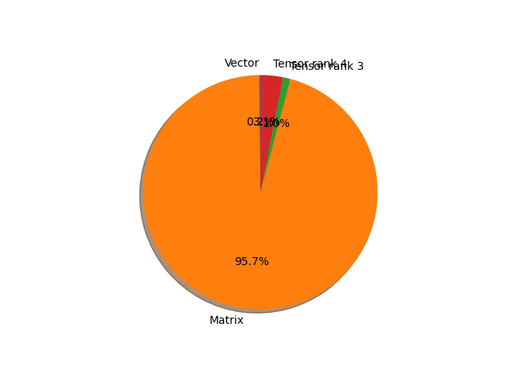

# convnext_base parameter information

**Number of layers: [ 344 ]**

**Number of parameters: [ 88.59M ]**

**Proportional of each form** (%)

| Vector | Matrix | Tensor rank 3 | Tensor rank 4 | 
|  --- | --- | --- | --- |
| 67.15 | 21.22 | 10.47 | 1.16 | 

**Proportional of parameters by form** (%)

| Vector | Matrix | Tensor rank 3 | Tensor rank 4 | 
|  --- | --- | --- | --- |
| 0.19 | 95.70 | 1.00 | 3.11 | 

**Layer information**

| Name | Shape | Squeezed shape | Number of parameters | Form |
| --- | --- | --- | --- | --- |
| features.0.0.weight | (128, 3, 4, 4) | (128, 3, 4, 4) | 6144 | Tensor rank 4 |
| features.0.0.bias | (128,) | (128,) | 128 | Vector |
| features.0.1.weight | (128,) | (128,) | 128 | Vector |
| features.0.1.bias | (128,) | (128,) | 128 | Vector |
| features.1.0.layer_scale | (128, 1, 1) | (128,) | 128 | Vector |
| features.1.0.block.0.weight | (128, 1, 7, 7) | (128, 7, 7) | 6272 | Tensor rank 3 |
| features.1.0.block.0.bias | (128,) | (128,) | 128 | Vector |
| features.1.0.block.2.weight | (128,) | (128,) | 128 | Vector |
| features.1.0.block.2.bias | (128,) | (128,) | 128 | Vector |
| features.1.0.block.3.weight | (512, 128) | (512, 128) | 65536 | Matrix |
| features.1.0.block.3.bias | (512,) | (512,) | 512 | Vector |
| features.1.0.block.5.weight | (128, 512) | (128, 512) | 65536 | Matrix |
| features.1.0.block.5.bias | (128,) | (128,) | 128 | Vector |
| features.1.1.layer_scale | (128, 1, 1) | (128,) | 128 | Vector |
| features.1.1.block.0.weight | (128, 1, 7, 7) | (128, 7, 7) | 6272 | Tensor rank 3 |
| features.1.1.block.0.bias | (128,) | (128,) | 128 | Vector |
| features.1.1.block.2.weight | (128,) | (128,) | 128 | Vector |
| features.1.1.block.2.bias | (128,) | (128,) | 128 | Vector |
| features.1.1.block.3.weight | (512, 128) | (512, 128) | 65536 | Matrix |
| features.1.1.block.3.bias | (512,) | (512,) | 512 | Vector |
| features.1.1.block.5.weight | (128, 512) | (128, 512) | 65536 | Matrix |
| features.1.1.block.5.bias | (128,) | (128,) | 128 | Vector |
| features.1.2.layer_scale | (128, 1, 1) | (128,) | 128 | Vector |
| features.1.2.block.0.weight | (128, 1, 7, 7) | (128, 7, 7) | 6272 | Tensor rank 3 |
| features.1.2.block.0.bias | (128,) | (128,) | 128 | Vector |
| features.1.2.block.2.weight | (128,) | (128,) | 128 | Vector |
| features.1.2.block.2.bias | (128,) | (128,) | 128 | Vector |
| features.1.2.block.3.weight | (512, 128) | (512, 128) | 65536 | Matrix |
| features.1.2.block.3.bias | (512,) | (512,) | 512 | Vector |
| features.1.2.block.5.weight | (128, 512) | (128, 512) | 65536 | Matrix |
| features.1.2.block.5.bias | (128,) | (128,) | 128 | Vector |
| features.2.0.weight | (128,) | (128,) | 128 | Vector |
| features.2.0.bias | (128,) | (128,) | 128 | Vector |
| features.2.1.weight | (256, 128, 2, 2) | (256, 128, 2, 2) | 131072 | Tensor rank 4 |
| features.2.1.bias | (256,) | (256,) | 256 | Vector |
| features.3.0.layer_scale | (256, 1, 1) | (256,) | 256 | Vector |
| features.3.0.block.0.weight | (256, 1, 7, 7) | (256, 7, 7) | 12544 | Tensor rank 3 |
| features.3.0.block.0.bias | (256,) | (256,) | 256 | Vector |
| features.3.0.block.2.weight | (256,) | (256,) | 256 | Vector |
| features.3.0.block.2.bias | (256,) | (256,) | 256 | Vector |
| features.3.0.block.3.weight | (1024, 256) | (1024, 256) | 262144 | Matrix |
| features.3.0.block.3.bias | (1024,) | (1024,) | 1024 | Vector |
| features.3.0.block.5.weight | (256, 1024) | (256, 1024) | 262144 | Matrix |
| features.3.0.block.5.bias | (256,) | (256,) | 256 | Vector |
| features.3.1.layer_scale | (256, 1, 1) | (256,) | 256 | Vector |
| features.3.1.block.0.weight | (256, 1, 7, 7) | (256, 7, 7) | 12544 | Tensor rank 3 |
| features.3.1.block.0.bias | (256,) | (256,) | 256 | Vector |
| features.3.1.block.2.weight | (256,) | (256,) | 256 | Vector |
| features.3.1.block.2.bias | (256,) | (256,) | 256 | Vector |
| features.3.1.block.3.weight | (1024, 256) | (1024, 256) | 262144 | Matrix |
| features.3.1.block.3.bias | (1024,) | (1024,) | 1024 | Vector |
| features.3.1.block.5.weight | (256, 1024) | (256, 1024) | 262144 | Matrix |
| features.3.1.block.5.bias | (256,) | (256,) | 256 | Vector |
| features.3.2.layer_scale | (256, 1, 1) | (256,) | 256 | Vector |
| features.3.2.block.0.weight | (256, 1, 7, 7) | (256, 7, 7) | 12544 | Tensor rank 3 |
| features.3.2.block.0.bias | (256,) | (256,) | 256 | Vector |
| features.3.2.block.2.weight | (256,) | (256,) | 256 | Vector |
| features.3.2.block.2.bias | (256,) | (256,) | 256 | Vector |
| features.3.2.block.3.weight | (1024, 256) | (1024, 256) | 262144 | Matrix |
| features.3.2.block.3.bias | (1024,) | (1024,) | 1024 | Vector |
| features.3.2.block.5.weight | (256, 1024) | (256, 1024) | 262144 | Matrix |
| features.3.2.block.5.bias | (256,) | (256,) | 256 | Vector |
| features.4.0.weight | (256,) | (256,) | 256 | Vector |
| features.4.0.bias | (256,) | (256,) | 256 | Vector |
| features.4.1.weight | (512, 256, 2, 2) | (512, 256, 2, 2) | 524288 | Tensor rank 4 |
| features.4.1.bias | (512,) | (512,) | 512 | Vector |
| features.5.0.layer_scale | (512, 1, 1) | (512,) | 512 | Vector |
| features.5.0.block.0.weight | (512, 1, 7, 7) | (512, 7, 7) | 25088 | Tensor rank 3 |
| features.5.0.block.0.bias | (512,) | (512,) | 512 | Vector |
| features.5.0.block.2.weight | (512,) | (512,) | 512 | Vector |
| features.5.0.block.2.bias | (512,) | (512,) | 512 | Vector |
| features.5.0.block.3.weight | (2048, 512) | (2048, 512) | 1048576 | Matrix |
| features.5.0.block.3.bias | (2048,) | (2048,) | 2048 | Vector |
| features.5.0.block.5.weight | (512, 2048) | (512, 2048) | 1048576 | Matrix |
| features.5.0.block.5.bias | (512,) | (512,) | 512 | Vector |
| features.5.1.layer_scale | (512, 1, 1) | (512,) | 512 | Vector |
| features.5.1.block.0.weight | (512, 1, 7, 7) | (512, 7, 7) | 25088 | Tensor rank 3 |
| features.5.1.block.0.bias | (512,) | (512,) | 512 | Vector |
| features.5.1.block.2.weight | (512,) | (512,) | 512 | Vector |
| features.5.1.block.2.bias | (512,) | (512,) | 512 | Vector |
| features.5.1.block.3.weight | (2048, 512) | (2048, 512) | 1048576 | Matrix |
| features.5.1.block.3.bias | (2048,) | (2048,) | 2048 | Vector |
| features.5.1.block.5.weight | (512, 2048) | (512, 2048) | 1048576 | Matrix |
| features.5.1.block.5.bias | (512,) | (512,) | 512 | Vector |
| features.5.2.layer_scale | (512, 1, 1) | (512,) | 512 | Vector |
| features.5.2.block.0.weight | (512, 1, 7, 7) | (512, 7, 7) | 25088 | Tensor rank 3 |
| features.5.2.block.0.bias | (512,) | (512,) | 512 | Vector |
| features.5.2.block.2.weight | (512,) | (512,) | 512 | Vector |
| features.5.2.block.2.bias | (512,) | (512,) | 512 | Vector |
| features.5.2.block.3.weight | (2048, 512) | (2048, 512) | 1048576 | Matrix |
| features.5.2.block.3.bias | (2048,) | (2048,) | 2048 | Vector |
| features.5.2.block.5.weight | (512, 2048) | (512, 2048) | 1048576 | Matrix |
| features.5.2.block.5.bias | (512,) | (512,) | 512 | Vector |
| features.5.3.layer_scale | (512, 1, 1) | (512,) | 512 | Vector |
| features.5.3.block.0.weight | (512, 1, 7, 7) | (512, 7, 7) | 25088 | Tensor rank 3 |
| features.5.3.block.0.bias | (512,) | (512,) | 512 | Vector |
| features.5.3.block.2.weight | (512,) | (512,) | 512 | Vector |
| features.5.3.block.2.bias | (512,) | (512,) | 512 | Vector |
| features.5.3.block.3.weight | (2048, 512) | (2048, 512) | 1048576 | Matrix |
| features.5.3.block.3.bias | (2048,) | (2048,) | 2048 | Vector |
| features.5.3.block.5.weight | (512, 2048) | (512, 2048) | 1048576 | Matrix |
| features.5.3.block.5.bias | (512,) | (512,) | 512 | Vector |
| features.5.4.layer_scale | (512, 1, 1) | (512,) | 512 | Vector |
| features.5.4.block.0.weight | (512, 1, 7, 7) | (512, 7, 7) | 25088 | Tensor rank 3 |
| features.5.4.block.0.bias | (512,) | (512,) | 512 | Vector |
| features.5.4.block.2.weight | (512,) | (512,) | 512 | Vector |
| features.5.4.block.2.bias | (512,) | (512,) | 512 | Vector |
| features.5.4.block.3.weight | (2048, 512) | (2048, 512) | 1048576 | Matrix |
| features.5.4.block.3.bias | (2048,) | (2048,) | 2048 | Vector |
| features.5.4.block.5.weight | (512, 2048) | (512, 2048) | 1048576 | Matrix |
| features.5.4.block.5.bias | (512,) | (512,) | 512 | Vector |
| features.5.5.layer_scale | (512, 1, 1) | (512,) | 512 | Vector |
| features.5.5.block.0.weight | (512, 1, 7, 7) | (512, 7, 7) | 25088 | Tensor rank 3 |
| features.5.5.block.0.bias | (512,) | (512,) | 512 | Vector |
| features.5.5.block.2.weight | (512,) | (512,) | 512 | Vector |
| features.5.5.block.2.bias | (512,) | (512,) | 512 | Vector |
| features.5.5.block.3.weight | (2048, 512) | (2048, 512) | 1048576 | Matrix |
| features.5.5.block.3.bias | (2048,) | (2048,) | 2048 | Vector |
| features.5.5.block.5.weight | (512, 2048) | (512, 2048) | 1048576 | Matrix |
| features.5.5.block.5.bias | (512,) | (512,) | 512 | Vector |
| features.5.6.layer_scale | (512, 1, 1) | (512,) | 512 | Vector |
| features.5.6.block.0.weight | (512, 1, 7, 7) | (512, 7, 7) | 25088 | Tensor rank 3 |
| features.5.6.block.0.bias | (512,) | (512,) | 512 | Vector |
| features.5.6.block.2.weight | (512,) | (512,) | 512 | Vector |
| features.5.6.block.2.bias | (512,) | (512,) | 512 | Vector |
| features.5.6.block.3.weight | (2048, 512) | (2048, 512) | 1048576 | Matrix |
| features.5.6.block.3.bias | (2048,) | (2048,) | 2048 | Vector |
| features.5.6.block.5.weight | (512, 2048) | (512, 2048) | 1048576 | Matrix |
| features.5.6.block.5.bias | (512,) | (512,) | 512 | Vector |
| features.5.7.layer_scale | (512, 1, 1) | (512,) | 512 | Vector |
| features.5.7.block.0.weight | (512, 1, 7, 7) | (512, 7, 7) | 25088 | Tensor rank 3 |
| features.5.7.block.0.bias | (512,) | (512,) | 512 | Vector |
| features.5.7.block.2.weight | (512,) | (512,) | 512 | Vector |
| features.5.7.block.2.bias | (512,) | (512,) | 512 | Vector |
| features.5.7.block.3.weight | (2048, 512) | (2048, 512) | 1048576 | Matrix |
| features.5.7.block.3.bias | (2048,) | (2048,) | 2048 | Vector |
| features.5.7.block.5.weight | (512, 2048) | (512, 2048) | 1048576 | Matrix |
| features.5.7.block.5.bias | (512,) | (512,) | 512 | Vector |
| features.5.8.layer_scale | (512, 1, 1) | (512,) | 512 | Vector |
| features.5.8.block.0.weight | (512, 1, 7, 7) | (512, 7, 7) | 25088 | Tensor rank 3 |
| features.5.8.block.0.bias | (512,) | (512,) | 512 | Vector |
| features.5.8.block.2.weight | (512,) | (512,) | 512 | Vector |
| features.5.8.block.2.bias | (512,) | (512,) | 512 | Vector |
| features.5.8.block.3.weight | (2048, 512) | (2048, 512) | 1048576 | Matrix |
| features.5.8.block.3.bias | (2048,) | (2048,) | 2048 | Vector |
| features.5.8.block.5.weight | (512, 2048) | (512, 2048) | 1048576 | Matrix |
| features.5.8.block.5.bias | (512,) | (512,) | 512 | Vector |
| features.5.9.layer_scale | (512, 1, 1) | (512,) | 512 | Vector |
| features.5.9.block.0.weight | (512, 1, 7, 7) | (512, 7, 7) | 25088 | Tensor rank 3 |
| features.5.9.block.0.bias | (512,) | (512,) | 512 | Vector |
| features.5.9.block.2.weight | (512,) | (512,) | 512 | Vector |
| features.5.9.block.2.bias | (512,) | (512,) | 512 | Vector |
| features.5.9.block.3.weight | (2048, 512) | (2048, 512) | 1048576 | Matrix |
| features.5.9.block.3.bias | (2048,) | (2048,) | 2048 | Vector |
| features.5.9.block.5.weight | (512, 2048) | (512, 2048) | 1048576 | Matrix |
| features.5.9.block.5.bias | (512,) | (512,) | 512 | Vector |
| features.5.10.layer_scale | (512, 1, 1) | (512,) | 512 | Vector |
| features.5.10.block.0.weight | (512, 1, 7, 7) | (512, 7, 7) | 25088 | Tensor rank 3 |
| features.5.10.block.0.bias | (512,) | (512,) | 512 | Vector |
| features.5.10.block.2.weight | (512,) | (512,) | 512 | Vector |
| features.5.10.block.2.bias | (512,) | (512,) | 512 | Vector |
| features.5.10.block.3.weight | (2048, 512) | (2048, 512) | 1048576 | Matrix |
| features.5.10.block.3.bias | (2048,) | (2048,) | 2048 | Vector |
| features.5.10.block.5.weight | (512, 2048) | (512, 2048) | 1048576 | Matrix |
| features.5.10.block.5.bias | (512,) | (512,) | 512 | Vector |
| features.5.11.layer_scale | (512, 1, 1) | (512,) | 512 | Vector |
| features.5.11.block.0.weight | (512, 1, 7, 7) | (512, 7, 7) | 25088 | Tensor rank 3 |
| features.5.11.block.0.bias | (512,) | (512,) | 512 | Vector |
| features.5.11.block.2.weight | (512,) | (512,) | 512 | Vector |
| features.5.11.block.2.bias | (512,) | (512,) | 512 | Vector |
| features.5.11.block.3.weight | (2048, 512) | (2048, 512) | 1048576 | Matrix |
| features.5.11.block.3.bias | (2048,) | (2048,) | 2048 | Vector |
| features.5.11.block.5.weight | (512, 2048) | (512, 2048) | 1048576 | Matrix |
| features.5.11.block.5.bias | (512,) | (512,) | 512 | Vector |
| features.5.12.layer_scale | (512, 1, 1) | (512,) | 512 | Vector |
| features.5.12.block.0.weight | (512, 1, 7, 7) | (512, 7, 7) | 25088 | Tensor rank 3 |
| features.5.12.block.0.bias | (512,) | (512,) | 512 | Vector |
| features.5.12.block.2.weight | (512,) | (512,) | 512 | Vector |
| features.5.12.block.2.bias | (512,) | (512,) | 512 | Vector |
| features.5.12.block.3.weight | (2048, 512) | (2048, 512) | 1048576 | Matrix |
| features.5.12.block.3.bias | (2048,) | (2048,) | 2048 | Vector |
| features.5.12.block.5.weight | (512, 2048) | (512, 2048) | 1048576 | Matrix |
| features.5.12.block.5.bias | (512,) | (512,) | 512 | Vector |
| features.5.13.layer_scale | (512, 1, 1) | (512,) | 512 | Vector |
| features.5.13.block.0.weight | (512, 1, 7, 7) | (512, 7, 7) | 25088 | Tensor rank 3 |
| features.5.13.block.0.bias | (512,) | (512,) | 512 | Vector |
| features.5.13.block.2.weight | (512,) | (512,) | 512 | Vector |
| features.5.13.block.2.bias | (512,) | (512,) | 512 | Vector |
| features.5.13.block.3.weight | (2048, 512) | (2048, 512) | 1048576 | Matrix |
| features.5.13.block.3.bias | (2048,) | (2048,) | 2048 | Vector |
| features.5.13.block.5.weight | (512, 2048) | (512, 2048) | 1048576 | Matrix |
| features.5.13.block.5.bias | (512,) | (512,) | 512 | Vector |
| features.5.14.layer_scale | (512, 1, 1) | (512,) | 512 | Vector |
| features.5.14.block.0.weight | (512, 1, 7, 7) | (512, 7, 7) | 25088 | Tensor rank 3 |
| features.5.14.block.0.bias | (512,) | (512,) | 512 | Vector |
| features.5.14.block.2.weight | (512,) | (512,) | 512 | Vector |
| features.5.14.block.2.bias | (512,) | (512,) | 512 | Vector |
| features.5.14.block.3.weight | (2048, 512) | (2048, 512) | 1048576 | Matrix |
| features.5.14.block.3.bias | (2048,) | (2048,) | 2048 | Vector |
| features.5.14.block.5.weight | (512, 2048) | (512, 2048) | 1048576 | Matrix |
| features.5.14.block.5.bias | (512,) | (512,) | 512 | Vector |
| features.5.15.layer_scale | (512, 1, 1) | (512,) | 512 | Vector |
| features.5.15.block.0.weight | (512, 1, 7, 7) | (512, 7, 7) | 25088 | Tensor rank 3 |
| features.5.15.block.0.bias | (512,) | (512,) | 512 | Vector |
| features.5.15.block.2.weight | (512,) | (512,) | 512 | Vector |
| features.5.15.block.2.bias | (512,) | (512,) | 512 | Vector |
| features.5.15.block.3.weight | (2048, 512) | (2048, 512) | 1048576 | Matrix |
| features.5.15.block.3.bias | (2048,) | (2048,) | 2048 | Vector |
| features.5.15.block.5.weight | (512, 2048) | (512, 2048) | 1048576 | Matrix |
| features.5.15.block.5.bias | (512,) | (512,) | 512 | Vector |
| features.5.16.layer_scale | (512, 1, 1) | (512,) | 512 | Vector |
| features.5.16.block.0.weight | (512, 1, 7, 7) | (512, 7, 7) | 25088 | Tensor rank 3 |
| features.5.16.block.0.bias | (512,) | (512,) | 512 | Vector |
| features.5.16.block.2.weight | (512,) | (512,) | 512 | Vector |
| features.5.16.block.2.bias | (512,) | (512,) | 512 | Vector |
| features.5.16.block.3.weight | (2048, 512) | (2048, 512) | 1048576 | Matrix |
| features.5.16.block.3.bias | (2048,) | (2048,) | 2048 | Vector |
| features.5.16.block.5.weight | (512, 2048) | (512, 2048) | 1048576 | Matrix |
| features.5.16.block.5.bias | (512,) | (512,) | 512 | Vector |
| features.5.17.layer_scale | (512, 1, 1) | (512,) | 512 | Vector |
| features.5.17.block.0.weight | (512, 1, 7, 7) | (512, 7, 7) | 25088 | Tensor rank 3 |
| features.5.17.block.0.bias | (512,) | (512,) | 512 | Vector |
| features.5.17.block.2.weight | (512,) | (512,) | 512 | Vector |
| features.5.17.block.2.bias | (512,) | (512,) | 512 | Vector |
| features.5.17.block.3.weight | (2048, 512) | (2048, 512) | 1048576 | Matrix |
| features.5.17.block.3.bias | (2048,) | (2048,) | 2048 | Vector |
| features.5.17.block.5.weight | (512, 2048) | (512, 2048) | 1048576 | Matrix |
| features.5.17.block.5.bias | (512,) | (512,) | 512 | Vector |
| features.5.18.layer_scale | (512, 1, 1) | (512,) | 512 | Vector |
| features.5.18.block.0.weight | (512, 1, 7, 7) | (512, 7, 7) | 25088 | Tensor rank 3 |
| features.5.18.block.0.bias | (512,) | (512,) | 512 | Vector |
| features.5.18.block.2.weight | (512,) | (512,) | 512 | Vector |
| features.5.18.block.2.bias | (512,) | (512,) | 512 | Vector |
| features.5.18.block.3.weight | (2048, 512) | (2048, 512) | 1048576 | Matrix |
| features.5.18.block.3.bias | (2048,) | (2048,) | 2048 | Vector |
| features.5.18.block.5.weight | (512, 2048) | (512, 2048) | 1048576 | Matrix |
| features.5.18.block.5.bias | (512,) | (512,) | 512 | Vector |
| features.5.19.layer_scale | (512, 1, 1) | (512,) | 512 | Vector |
| features.5.19.block.0.weight | (512, 1, 7, 7) | (512, 7, 7) | 25088 | Tensor rank 3 |
| features.5.19.block.0.bias | (512,) | (512,) | 512 | Vector |
| features.5.19.block.2.weight | (512,) | (512,) | 512 | Vector |
| features.5.19.block.2.bias | (512,) | (512,) | 512 | Vector |
| features.5.19.block.3.weight | (2048, 512) | (2048, 512) | 1048576 | Matrix |
| features.5.19.block.3.bias | (2048,) | (2048,) | 2048 | Vector |
| features.5.19.block.5.weight | (512, 2048) | (512, 2048) | 1048576 | Matrix |
| features.5.19.block.5.bias | (512,) | (512,) | 512 | Vector |
| features.5.20.layer_scale | (512, 1, 1) | (512,) | 512 | Vector |
| features.5.20.block.0.weight | (512, 1, 7, 7) | (512, 7, 7) | 25088 | Tensor rank 3 |
| features.5.20.block.0.bias | (512,) | (512,) | 512 | Vector |
| features.5.20.block.2.weight | (512,) | (512,) | 512 | Vector |
| features.5.20.block.2.bias | (512,) | (512,) | 512 | Vector |
| features.5.20.block.3.weight | (2048, 512) | (2048, 512) | 1048576 | Matrix |
| features.5.20.block.3.bias | (2048,) | (2048,) | 2048 | Vector |
| features.5.20.block.5.weight | (512, 2048) | (512, 2048) | 1048576 | Matrix |
| features.5.20.block.5.bias | (512,) | (512,) | 512 | Vector |
| features.5.21.layer_scale | (512, 1, 1) | (512,) | 512 | Vector |
| features.5.21.block.0.weight | (512, 1, 7, 7) | (512, 7, 7) | 25088 | Tensor rank 3 |
| features.5.21.block.0.bias | (512,) | (512,) | 512 | Vector |
| features.5.21.block.2.weight | (512,) | (512,) | 512 | Vector |
| features.5.21.block.2.bias | (512,) | (512,) | 512 | Vector |
| features.5.21.block.3.weight | (2048, 512) | (2048, 512) | 1048576 | Matrix |
| features.5.21.block.3.bias | (2048,) | (2048,) | 2048 | Vector |
| features.5.21.block.5.weight | (512, 2048) | (512, 2048) | 1048576 | Matrix |
| features.5.21.block.5.bias | (512,) | (512,) | 512 | Vector |
| features.5.22.layer_scale | (512, 1, 1) | (512,) | 512 | Vector |
| features.5.22.block.0.weight | (512, 1, 7, 7) | (512, 7, 7) | 25088 | Tensor rank 3 |
| features.5.22.block.0.bias | (512,) | (512,) | 512 | Vector |
| features.5.22.block.2.weight | (512,) | (512,) | 512 | Vector |
| features.5.22.block.2.bias | (512,) | (512,) | 512 | Vector |
| features.5.22.block.3.weight | (2048, 512) | (2048, 512) | 1048576 | Matrix |
| features.5.22.block.3.bias | (2048,) | (2048,) | 2048 | Vector |
| features.5.22.block.5.weight | (512, 2048) | (512, 2048) | 1048576 | Matrix |
| features.5.22.block.5.bias | (512,) | (512,) | 512 | Vector |
| features.5.23.layer_scale | (512, 1, 1) | (512,) | 512 | Vector |
| features.5.23.block.0.weight | (512, 1, 7, 7) | (512, 7, 7) | 25088 | Tensor rank 3 |
| features.5.23.block.0.bias | (512,) | (512,) | 512 | Vector |
| features.5.23.block.2.weight | (512,) | (512,) | 512 | Vector |
| features.5.23.block.2.bias | (512,) | (512,) | 512 | Vector |
| features.5.23.block.3.weight | (2048, 512) | (2048, 512) | 1048576 | Matrix |
| features.5.23.block.3.bias | (2048,) | (2048,) | 2048 | Vector |
| features.5.23.block.5.weight | (512, 2048) | (512, 2048) | 1048576 | Matrix |
| features.5.23.block.5.bias | (512,) | (512,) | 512 | Vector |
| features.5.24.layer_scale | (512, 1, 1) | (512,) | 512 | Vector |
| features.5.24.block.0.weight | (512, 1, 7, 7) | (512, 7, 7) | 25088 | Tensor rank 3 |
| features.5.24.block.0.bias | (512,) | (512,) | 512 | Vector |
| features.5.24.block.2.weight | (512,) | (512,) | 512 | Vector |
| features.5.24.block.2.bias | (512,) | (512,) | 512 | Vector |
| features.5.24.block.3.weight | (2048, 512) | (2048, 512) | 1048576 | Matrix |
| features.5.24.block.3.bias | (2048,) | (2048,) | 2048 | Vector |
| features.5.24.block.5.weight | (512, 2048) | (512, 2048) | 1048576 | Matrix |
| features.5.24.block.5.bias | (512,) | (512,) | 512 | Vector |
| features.5.25.layer_scale | (512, 1, 1) | (512,) | 512 | Vector |
| features.5.25.block.0.weight | (512, 1, 7, 7) | (512, 7, 7) | 25088 | Tensor rank 3 |
| features.5.25.block.0.bias | (512,) | (512,) | 512 | Vector |
| features.5.25.block.2.weight | (512,) | (512,) | 512 | Vector |
| features.5.25.block.2.bias | (512,) | (512,) | 512 | Vector |
| features.5.25.block.3.weight | (2048, 512) | (2048, 512) | 1048576 | Matrix |
| features.5.25.block.3.bias | (2048,) | (2048,) | 2048 | Vector |
| features.5.25.block.5.weight | (512, 2048) | (512, 2048) | 1048576 | Matrix |
| features.5.25.block.5.bias | (512,) | (512,) | 512 | Vector |
| features.5.26.layer_scale | (512, 1, 1) | (512,) | 512 | Vector |
| features.5.26.block.0.weight | (512, 1, 7, 7) | (512, 7, 7) | 25088 | Tensor rank 3 |
| features.5.26.block.0.bias | (512,) | (512,) | 512 | Vector |
| features.5.26.block.2.weight | (512,) | (512,) | 512 | Vector |
| features.5.26.block.2.bias | (512,) | (512,) | 512 | Vector |
| features.5.26.block.3.weight | (2048, 512) | (2048, 512) | 1048576 | Matrix |
| features.5.26.block.3.bias | (2048,) | (2048,) | 2048 | Vector |
| features.5.26.block.5.weight | (512, 2048) | (512, 2048) | 1048576 | Matrix |
| features.5.26.block.5.bias | (512,) | (512,) | 512 | Vector |
| features.6.0.weight | (512,) | (512,) | 512 | Vector |
| features.6.0.bias | (512,) | (512,) | 512 | Vector |
| features.6.1.weight | (1024, 512, 2, 2) | (1024, 512, 2, 2) | 2097152 | Tensor rank 4 |
| features.6.1.bias | (1024,) | (1024,) | 1024 | Vector |
| features.7.0.layer_scale | (1024, 1, 1) | (1024,) | 1024 | Vector |
| features.7.0.block.0.weight | (1024, 1, 7, 7) | (1024, 7, 7) | 50176 | Tensor rank 3 |
| features.7.0.block.0.bias | (1024,) | (1024,) | 1024 | Vector |
| features.7.0.block.2.weight | (1024,) | (1024,) | 1024 | Vector |
| features.7.0.block.2.bias | (1024,) | (1024,) | 1024 | Vector |
| features.7.0.block.3.weight | (4096, 1024) | (4096, 1024) | 4194304 | Matrix |
| features.7.0.block.3.bias | (4096,) | (4096,) | 4096 | Vector |
| features.7.0.block.5.weight | (1024, 4096) | (1024, 4096) | 4194304 | Matrix |
| features.7.0.block.5.bias | (1024,) | (1024,) | 1024 | Vector |
| features.7.1.layer_scale | (1024, 1, 1) | (1024,) | 1024 | Vector |
| features.7.1.block.0.weight | (1024, 1, 7, 7) | (1024, 7, 7) | 50176 | Tensor rank 3 |
| features.7.1.block.0.bias | (1024,) | (1024,) | 1024 | Vector |
| features.7.1.block.2.weight | (1024,) | (1024,) | 1024 | Vector |
| features.7.1.block.2.bias | (1024,) | (1024,) | 1024 | Vector |
| features.7.1.block.3.weight | (4096, 1024) | (4096, 1024) | 4194304 | Matrix |
| features.7.1.block.3.bias | (4096,) | (4096,) | 4096 | Vector |
| features.7.1.block.5.weight | (1024, 4096) | (1024, 4096) | 4194304 | Matrix |
| features.7.1.block.5.bias | (1024,) | (1024,) | 1024 | Vector |
| features.7.2.layer_scale | (1024, 1, 1) | (1024,) | 1024 | Vector |
| features.7.2.block.0.weight | (1024, 1, 7, 7) | (1024, 7, 7) | 50176 | Tensor rank 3 |
| features.7.2.block.0.bias | (1024,) | (1024,) | 1024 | Vector |
| features.7.2.block.2.weight | (1024,) | (1024,) | 1024 | Vector |
| features.7.2.block.2.bias | (1024,) | (1024,) | 1024 | Vector |
| features.7.2.block.3.weight | (4096, 1024) | (4096, 1024) | 4194304 | Matrix |
| features.7.2.block.3.bias | (4096,) | (4096,) | 4096 | Vector |
| features.7.2.block.5.weight | (1024, 4096) | (1024, 4096) | 4194304 | Matrix |
| features.7.2.block.5.bias | (1024,) | (1024,) | 1024 | Vector |
| classifier.0.weight | (1024,) | (1024,) | 1024 | Vector |
| classifier.0.bias | (1024,) | (1024,) | 1024 | Vector |
| classifier.2.weight | (1000, 1024) | (1000, 1024) | 1024000 | Matrix |
| classifier.2.bias | (1000,) | (1000,) | 1000 | Vector |

