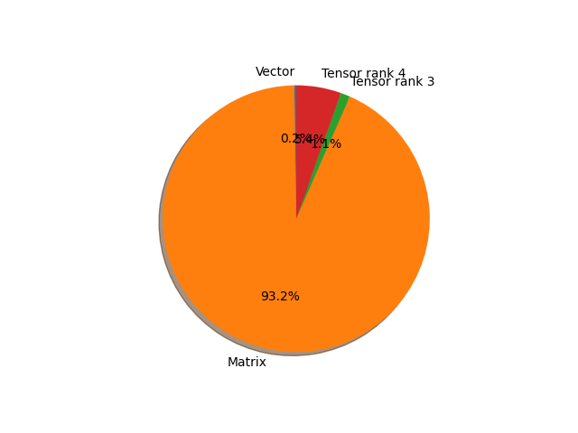

# convnext_tiny parameter information

**Number of layers: [ 182 ]**

**Number of parameters: [ 28.59M ]**

**Proportional of each form** (%)

| Vector | Matrix | Tensor rank 3 | Tensor rank 4 | 
|  --- | --- | --- | --- |
| 67.58 | 20.33 | 9.89 | 2.20 | 

**Proportional of parameters by form** (%)

| Vector | Matrix | Tensor rank 3 | Tensor rank 4 | 
|  --- | --- | --- | --- |
| 0.23 | 93.21 | 1.14 | 5.43 | 

**Layer information**

| Name | Shape | Squeezed shape | Number of parameters | Form |
| --- | --- | --- | --- | --- |
| features.0.0.weight | (96, 3, 4, 4) | (96, 3, 4, 4) | 4608 | Tensor rank 4 |
| features.0.0.bias | (96,) | (96,) | 96 | Vector |
| features.0.1.weight | (96,) | (96,) | 96 | Vector |
| features.0.1.bias | (96,) | (96,) | 96 | Vector |
| features.1.0.layer_scale | (96, 1, 1) | (96,) | 96 | Vector |
| features.1.0.block.0.weight | (96, 1, 7, 7) | (96, 7, 7) | 4704 | Tensor rank 3 |
| features.1.0.block.0.bias | (96,) | (96,) | 96 | Vector |
| features.1.0.block.2.weight | (96,) | (96,) | 96 | Vector |
| features.1.0.block.2.bias | (96,) | (96,) | 96 | Vector |
| features.1.0.block.3.weight | (384, 96) | (384, 96) | 36864 | Matrix |
| features.1.0.block.3.bias | (384,) | (384,) | 384 | Vector |
| features.1.0.block.5.weight | (96, 384) | (96, 384) | 36864 | Matrix |
| features.1.0.block.5.bias | (96,) | (96,) | 96 | Vector |
| features.1.1.layer_scale | (96, 1, 1) | (96,) | 96 | Vector |
| features.1.1.block.0.weight | (96, 1, 7, 7) | (96, 7, 7) | 4704 | Tensor rank 3 |
| features.1.1.block.0.bias | (96,) | (96,) | 96 | Vector |
| features.1.1.block.2.weight | (96,) | (96,) | 96 | Vector |
| features.1.1.block.2.bias | (96,) | (96,) | 96 | Vector |
| features.1.1.block.3.weight | (384, 96) | (384, 96) | 36864 | Matrix |
| features.1.1.block.3.bias | (384,) | (384,) | 384 | Vector |
| features.1.1.block.5.weight | (96, 384) | (96, 384) | 36864 | Matrix |
| features.1.1.block.5.bias | (96,) | (96,) | 96 | Vector |
| features.1.2.layer_scale | (96, 1, 1) | (96,) | 96 | Vector |
| features.1.2.block.0.weight | (96, 1, 7, 7) | (96, 7, 7) | 4704 | Tensor rank 3 |
| features.1.2.block.0.bias | (96,) | (96,) | 96 | Vector |
| features.1.2.block.2.weight | (96,) | (96,) | 96 | Vector |
| features.1.2.block.2.bias | (96,) | (96,) | 96 | Vector |
| features.1.2.block.3.weight | (384, 96) | (384, 96) | 36864 | Matrix |
| features.1.2.block.3.bias | (384,) | (384,) | 384 | Vector |
| features.1.2.block.5.weight | (96, 384) | (96, 384) | 36864 | Matrix |
| features.1.2.block.5.bias | (96,) | (96,) | 96 | Vector |
| features.2.0.weight | (96,) | (96,) | 96 | Vector |
| features.2.0.bias | (96,) | (96,) | 96 | Vector |
| features.2.1.weight | (192, 96, 2, 2) | (192, 96, 2, 2) | 73728 | Tensor rank 4 |
| features.2.1.bias | (192,) | (192,) | 192 | Vector |
| features.3.0.layer_scale | (192, 1, 1) | (192,) | 192 | Vector |
| features.3.0.block.0.weight | (192, 1, 7, 7) | (192, 7, 7) | 9408 | Tensor rank 3 |
| features.3.0.block.0.bias | (192,) | (192,) | 192 | Vector |
| features.3.0.block.2.weight | (192,) | (192,) | 192 | Vector |
| features.3.0.block.2.bias | (192,) | (192,) | 192 | Vector |
| features.3.0.block.3.weight | (768, 192) | (768, 192) | 147456 | Matrix |
| features.3.0.block.3.bias | (768,) | (768,) | 768 | Vector |
| features.3.0.block.5.weight | (192, 768) | (192, 768) | 147456 | Matrix |
| features.3.0.block.5.bias | (192,) | (192,) | 192 | Vector |
| features.3.1.layer_scale | (192, 1, 1) | (192,) | 192 | Vector |
| features.3.1.block.0.weight | (192, 1, 7, 7) | (192, 7, 7) | 9408 | Tensor rank 3 |
| features.3.1.block.0.bias | (192,) | (192,) | 192 | Vector |
| features.3.1.block.2.weight | (192,) | (192,) | 192 | Vector |
| features.3.1.block.2.bias | (192,) | (192,) | 192 | Vector |
| features.3.1.block.3.weight | (768, 192) | (768, 192) | 147456 | Matrix |
| features.3.1.block.3.bias | (768,) | (768,) | 768 | Vector |
| features.3.1.block.5.weight | (192, 768) | (192, 768) | 147456 | Matrix |
| features.3.1.block.5.bias | (192,) | (192,) | 192 | Vector |
| features.3.2.layer_scale | (192, 1, 1) | (192,) | 192 | Vector |
| features.3.2.block.0.weight | (192, 1, 7, 7) | (192, 7, 7) | 9408 | Tensor rank 3 |
| features.3.2.block.0.bias | (192,) | (192,) | 192 | Vector |
| features.3.2.block.2.weight | (192,) | (192,) | 192 | Vector |
| features.3.2.block.2.bias | (192,) | (192,) | 192 | Vector |
| features.3.2.block.3.weight | (768, 192) | (768, 192) | 147456 | Matrix |
| features.3.2.block.3.bias | (768,) | (768,) | 768 | Vector |
| features.3.2.block.5.weight | (192, 768) | (192, 768) | 147456 | Matrix |
| features.3.2.block.5.bias | (192,) | (192,) | 192 | Vector |
| features.4.0.weight | (192,) | (192,) | 192 | Vector |
| features.4.0.bias | (192,) | (192,) | 192 | Vector |
| features.4.1.weight | (384, 192, 2, 2) | (384, 192, 2, 2) | 294912 | Tensor rank 4 |
| features.4.1.bias | (384,) | (384,) | 384 | Vector |
| features.5.0.layer_scale | (384, 1, 1) | (384,) | 384 | Vector |
| features.5.0.block.0.weight | (384, 1, 7, 7) | (384, 7, 7) | 18816 | Tensor rank 3 |
| features.5.0.block.0.bias | (384,) | (384,) | 384 | Vector |
| features.5.0.block.2.weight | (384,) | (384,) | 384 | Vector |
| features.5.0.block.2.bias | (384,) | (384,) | 384 | Vector |
| features.5.0.block.3.weight | (1536, 384) | (1536, 384) | 589824 | Matrix |
| features.5.0.block.3.bias | (1536,) | (1536,) | 1536 | Vector |
| features.5.0.block.5.weight | (384, 1536) | (384, 1536) | 589824 | Matrix |
| features.5.0.block.5.bias | (384,) | (384,) | 384 | Vector |
| features.5.1.layer_scale | (384, 1, 1) | (384,) | 384 | Vector |
| features.5.1.block.0.weight | (384, 1, 7, 7) | (384, 7, 7) | 18816 | Tensor rank 3 |
| features.5.1.block.0.bias | (384,) | (384,) | 384 | Vector |
| features.5.1.block.2.weight | (384,) | (384,) | 384 | Vector |
| features.5.1.block.2.bias | (384,) | (384,) | 384 | Vector |
| features.5.1.block.3.weight | (1536, 384) | (1536, 384) | 589824 | Matrix |
| features.5.1.block.3.bias | (1536,) | (1536,) | 1536 | Vector |
| features.5.1.block.5.weight | (384, 1536) | (384, 1536) | 589824 | Matrix |
| features.5.1.block.5.bias | (384,) | (384,) | 384 | Vector |
| features.5.2.layer_scale | (384, 1, 1) | (384,) | 384 | Vector |
| features.5.2.block.0.weight | (384, 1, 7, 7) | (384, 7, 7) | 18816 | Tensor rank 3 |
| features.5.2.block.0.bias | (384,) | (384,) | 384 | Vector |
| features.5.2.block.2.weight | (384,) | (384,) | 384 | Vector |
| features.5.2.block.2.bias | (384,) | (384,) | 384 | Vector |
| features.5.2.block.3.weight | (1536, 384) | (1536, 384) | 589824 | Matrix |
| features.5.2.block.3.bias | (1536,) | (1536,) | 1536 | Vector |
| features.5.2.block.5.weight | (384, 1536) | (384, 1536) | 589824 | Matrix |
| features.5.2.block.5.bias | (384,) | (384,) | 384 | Vector |
| features.5.3.layer_scale | (384, 1, 1) | (384,) | 384 | Vector |
| features.5.3.block.0.weight | (384, 1, 7, 7) | (384, 7, 7) | 18816 | Tensor rank 3 |
| features.5.3.block.0.bias | (384,) | (384,) | 384 | Vector |
| features.5.3.block.2.weight | (384,) | (384,) | 384 | Vector |
| features.5.3.block.2.bias | (384,) | (384,) | 384 | Vector |
| features.5.3.block.3.weight | (1536, 384) | (1536, 384) | 589824 | Matrix |
| features.5.3.block.3.bias | (1536,) | (1536,) | 1536 | Vector |
| features.5.3.block.5.weight | (384, 1536) | (384, 1536) | 589824 | Matrix |
| features.5.3.block.5.bias | (384,) | (384,) | 384 | Vector |
| features.5.4.layer_scale | (384, 1, 1) | (384,) | 384 | Vector |
| features.5.4.block.0.weight | (384, 1, 7, 7) | (384, 7, 7) | 18816 | Tensor rank 3 |
| features.5.4.block.0.bias | (384,) | (384,) | 384 | Vector |
| features.5.4.block.2.weight | (384,) | (384,) | 384 | Vector |
| features.5.4.block.2.bias | (384,) | (384,) | 384 | Vector |
| features.5.4.block.3.weight | (1536, 384) | (1536, 384) | 589824 | Matrix |
| features.5.4.block.3.bias | (1536,) | (1536,) | 1536 | Vector |
| features.5.4.block.5.weight | (384, 1536) | (384, 1536) | 589824 | Matrix |
| features.5.4.block.5.bias | (384,) | (384,) | 384 | Vector |
| features.5.5.layer_scale | (384, 1, 1) | (384,) | 384 | Vector |
| features.5.5.block.0.weight | (384, 1, 7, 7) | (384, 7, 7) | 18816 | Tensor rank 3 |
| features.5.5.block.0.bias | (384,) | (384,) | 384 | Vector |
| features.5.5.block.2.weight | (384,) | (384,) | 384 | Vector |
| features.5.5.block.2.bias | (384,) | (384,) | 384 | Vector |
| features.5.5.block.3.weight | (1536, 384) | (1536, 384) | 589824 | Matrix |
| features.5.5.block.3.bias | (1536,) | (1536,) | 1536 | Vector |
| features.5.5.block.5.weight | (384, 1536) | (384, 1536) | 589824 | Matrix |
| features.5.5.block.5.bias | (384,) | (384,) | 384 | Vector |
| features.5.6.layer_scale | (384, 1, 1) | (384,) | 384 | Vector |
| features.5.6.block.0.weight | (384, 1, 7, 7) | (384, 7, 7) | 18816 | Tensor rank 3 |
| features.5.6.block.0.bias | (384,) | (384,) | 384 | Vector |
| features.5.6.block.2.weight | (384,) | (384,) | 384 | Vector |
| features.5.6.block.2.bias | (384,) | (384,) | 384 | Vector |
| features.5.6.block.3.weight | (1536, 384) | (1536, 384) | 589824 | Matrix |
| features.5.6.block.3.bias | (1536,) | (1536,) | 1536 | Vector |
| features.5.6.block.5.weight | (384, 1536) | (384, 1536) | 589824 | Matrix |
| features.5.6.block.5.bias | (384,) | (384,) | 384 | Vector |
| features.5.7.layer_scale | (384, 1, 1) | (384,) | 384 | Vector |
| features.5.7.block.0.weight | (384, 1, 7, 7) | (384, 7, 7) | 18816 | Tensor rank 3 |
| features.5.7.block.0.bias | (384,) | (384,) | 384 | Vector |
| features.5.7.block.2.weight | (384,) | (384,) | 384 | Vector |
| features.5.7.block.2.bias | (384,) | (384,) | 384 | Vector |
| features.5.7.block.3.weight | (1536, 384) | (1536, 384) | 589824 | Matrix |
| features.5.7.block.3.bias | (1536,) | (1536,) | 1536 | Vector |
| features.5.7.block.5.weight | (384, 1536) | (384, 1536) | 589824 | Matrix |
| features.5.7.block.5.bias | (384,) | (384,) | 384 | Vector |
| features.5.8.layer_scale | (384, 1, 1) | (384,) | 384 | Vector |
| features.5.8.block.0.weight | (384, 1, 7, 7) | (384, 7, 7) | 18816 | Tensor rank 3 |
| features.5.8.block.0.bias | (384,) | (384,) | 384 | Vector |
| features.5.8.block.2.weight | (384,) | (384,) | 384 | Vector |
| features.5.8.block.2.bias | (384,) | (384,) | 384 | Vector |
| features.5.8.block.3.weight | (1536, 384) | (1536, 384) | 589824 | Matrix |
| features.5.8.block.3.bias | (1536,) | (1536,) | 1536 | Vector |
| features.5.8.block.5.weight | (384, 1536) | (384, 1536) | 589824 | Matrix |
| features.5.8.block.5.bias | (384,) | (384,) | 384 | Vector |
| features.6.0.weight | (384,) | (384,) | 384 | Vector |
| features.6.0.bias | (384,) | (384,) | 384 | Vector |
| features.6.1.weight | (768, 384, 2, 2) | (768, 384, 2, 2) | 1179648 | Tensor rank 4 |
| features.6.1.bias | (768,) | (768,) | 768 | Vector |
| features.7.0.layer_scale | (768, 1, 1) | (768,) | 768 | Vector |
| features.7.0.block.0.weight | (768, 1, 7, 7) | (768, 7, 7) | 37632 | Tensor rank 3 |
| features.7.0.block.0.bias | (768,) | (768,) | 768 | Vector |
| features.7.0.block.2.weight | (768,) | (768,) | 768 | Vector |
| features.7.0.block.2.bias | (768,) | (768,) | 768 | Vector |
| features.7.0.block.3.weight | (3072, 768) | (3072, 768) | 2359296 | Matrix |
| features.7.0.block.3.bias | (3072,) | (3072,) | 3072 | Vector |
| features.7.0.block.5.weight | (768, 3072) | (768, 3072) | 2359296 | Matrix |
| features.7.0.block.5.bias | (768,) | (768,) | 768 | Vector |
| features.7.1.layer_scale | (768, 1, 1) | (768,) | 768 | Vector |
| features.7.1.block.0.weight | (768, 1, 7, 7) | (768, 7, 7) | 37632 | Tensor rank 3 |
| features.7.1.block.0.bias | (768,) | (768,) | 768 | Vector |
| features.7.1.block.2.weight | (768,) | (768,) | 768 | Vector |
| features.7.1.block.2.bias | (768,) | (768,) | 768 | Vector |
| features.7.1.block.3.weight | (3072, 768) | (3072, 768) | 2359296 | Matrix |
| features.7.1.block.3.bias | (3072,) | (3072,) | 3072 | Vector |
| features.7.1.block.5.weight | (768, 3072) | (768, 3072) | 2359296 | Matrix |
| features.7.1.block.5.bias | (768,) | (768,) | 768 | Vector |
| features.7.2.layer_scale | (768, 1, 1) | (768,) | 768 | Vector |
| features.7.2.block.0.weight | (768, 1, 7, 7) | (768, 7, 7) | 37632 | Tensor rank 3 |
| features.7.2.block.0.bias | (768,) | (768,) | 768 | Vector |
| features.7.2.block.2.weight | (768,) | (768,) | 768 | Vector |
| features.7.2.block.2.bias | (768,) | (768,) | 768 | Vector |
| features.7.2.block.3.weight | (3072, 768) | (3072, 768) | 2359296 | Matrix |
| features.7.2.block.3.bias | (3072,) | (3072,) | 3072 | Vector |
| features.7.2.block.5.weight | (768, 3072) | (768, 3072) | 2359296 | Matrix |
| features.7.2.block.5.bias | (768,) | (768,) | 768 | Vector |
| classifier.0.weight | (768,) | (768,) | 768 | Vector |
| classifier.0.bias | (768,) | (768,) | 768 | Vector |
| classifier.2.weight | (1000, 768) | (1000, 768) | 768000 | Matrix |
| classifier.2.bias | (1000,) | (1000,) | 1000 | Vector |

