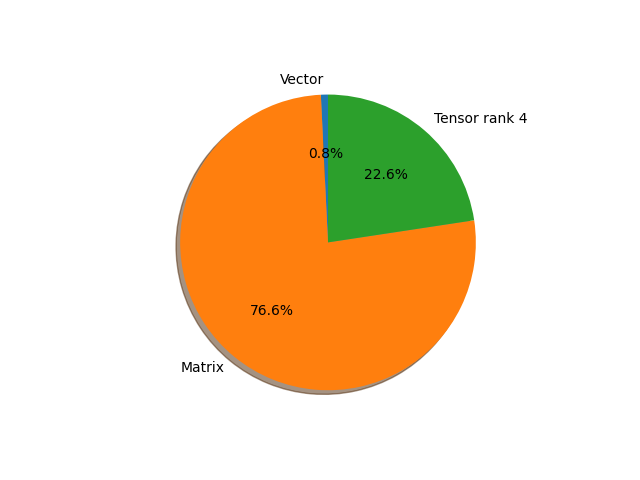

# densenet161 parameter information

**Number of layers: [ 484 ]**

**Number of parameters: [ 28.68M ]**

**Proportional of each form** (%)

| Vector | Matrix | Tensor rank 4 | 
|  --- | --- | --- |
| 66.74 | 16.94 | 16.32 | 
**Proportional of parameters by form** (%)

| Vector | Matrix | Tensor rank 4 | 
|  --- | --- | --- |
| 0.77 | 76.62 | 22.61 | 

**Layer information**

| Name | Shape | Squeezed shape | Number of parameters | Form |
| --- | --- | --- | --- | --- |
| features.conv0.weight | (96, 3, 7, 7) | (96, 3, 7, 7) | 14112 | Tensor rank 4 |
| features.norm0.weight | (96,) | (96,) | 96 | Vector |
| features.norm0.bias | (96,) | (96,) | 96 | Vector |
| features.denseblock1.denselayer1.norm1.weight | (96,) | (96,) | 96 | Vector |
| features.denseblock1.denselayer1.norm1.bias | (96,) | (96,) | 96 | Vector |
| features.denseblock1.denselayer1.conv1.weight | (192, 96, 1, 1) | (192, 96) | 18432 | Matrix |
| features.denseblock1.denselayer1.norm2.weight | (192,) | (192,) | 192 | Vector |
| features.denseblock1.denselayer1.norm2.bias | (192,) | (192,) | 192 | Vector |
| features.denseblock1.denselayer1.conv2.weight | (48, 192, 3, 3) | (48, 192, 3, 3) | 82944 | Tensor rank 4 |
| features.denseblock1.denselayer2.norm1.weight | (144,) | (144,) | 144 | Vector |
| features.denseblock1.denselayer2.norm1.bias | (144,) | (144,) | 144 | Vector |
| features.denseblock1.denselayer2.conv1.weight | (192, 144, 1, 1) | (192, 144) | 27648 | Matrix |
| features.denseblock1.denselayer2.norm2.weight | (192,) | (192,) | 192 | Vector |
| features.denseblock1.denselayer2.norm2.bias | (192,) | (192,) | 192 | Vector |
| features.denseblock1.denselayer2.conv2.weight | (48, 192, 3, 3) | (48, 192, 3, 3) | 82944 | Tensor rank 4 |
| features.denseblock1.denselayer3.norm1.weight | (192,) | (192,) | 192 | Vector |
| features.denseblock1.denselayer3.norm1.bias | (192,) | (192,) | 192 | Vector |
| features.denseblock1.denselayer3.conv1.weight | (192, 192, 1, 1) | (192, 192) | 36864 | Matrix |
| features.denseblock1.denselayer3.norm2.weight | (192,) | (192,) | 192 | Vector |
| features.denseblock1.denselayer3.norm2.bias | (192,) | (192,) | 192 | Vector |
| features.denseblock1.denselayer3.conv2.weight | (48, 192, 3, 3) | (48, 192, 3, 3) | 82944 | Tensor rank 4 |
| features.denseblock1.denselayer4.norm1.weight | (240,) | (240,) | 240 | Vector |
| features.denseblock1.denselayer4.norm1.bias | (240,) | (240,) | 240 | Vector |
| features.denseblock1.denselayer4.conv1.weight | (192, 240, 1, 1) | (192, 240) | 46080 | Matrix |
| features.denseblock1.denselayer4.norm2.weight | (192,) | (192,) | 192 | Vector |
| features.denseblock1.denselayer4.norm2.bias | (192,) | (192,) | 192 | Vector |
| features.denseblock1.denselayer4.conv2.weight | (48, 192, 3, 3) | (48, 192, 3, 3) | 82944 | Tensor rank 4 |
| features.denseblock1.denselayer5.norm1.weight | (288,) | (288,) | 288 | Vector |
| features.denseblock1.denselayer5.norm1.bias | (288,) | (288,) | 288 | Vector |
| features.denseblock1.denselayer5.conv1.weight | (192, 288, 1, 1) | (192, 288) | 55296 | Matrix |
| features.denseblock1.denselayer5.norm2.weight | (192,) | (192,) | 192 | Vector |
| features.denseblock1.denselayer5.norm2.bias | (192,) | (192,) | 192 | Vector |
| features.denseblock1.denselayer5.conv2.weight | (48, 192, 3, 3) | (48, 192, 3, 3) | 82944 | Tensor rank 4 |
| features.denseblock1.denselayer6.norm1.weight | (336,) | (336,) | 336 | Vector |
| features.denseblock1.denselayer6.norm1.bias | (336,) | (336,) | 336 | Vector |
| features.denseblock1.denselayer6.conv1.weight | (192, 336, 1, 1) | (192, 336) | 64512 | Matrix |
| features.denseblock1.denselayer6.norm2.weight | (192,) | (192,) | 192 | Vector |
| features.denseblock1.denselayer6.norm2.bias | (192,) | (192,) | 192 | Vector |
| features.denseblock1.denselayer6.conv2.weight | (48, 192, 3, 3) | (48, 192, 3, 3) | 82944 | Tensor rank 4 |
| features.transition1.norm.weight | (384,) | (384,) | 384 | Vector |
| features.transition1.norm.bias | (384,) | (384,) | 384 | Vector |
| features.transition1.conv.weight | (192, 384, 1, 1) | (192, 384) | 73728 | Matrix |
| features.denseblock2.denselayer1.norm1.weight | (192,) | (192,) | 192 | Vector |
| features.denseblock2.denselayer1.norm1.bias | (192,) | (192,) | 192 | Vector |
| features.denseblock2.denselayer1.conv1.weight | (192, 192, 1, 1) | (192, 192) | 36864 | Matrix |
| features.denseblock2.denselayer1.norm2.weight | (192,) | (192,) | 192 | Vector |
| features.denseblock2.denselayer1.norm2.bias | (192,) | (192,) | 192 | Vector |
| features.denseblock2.denselayer1.conv2.weight | (48, 192, 3, 3) | (48, 192, 3, 3) | 82944 | Tensor rank 4 |
| features.denseblock2.denselayer2.norm1.weight | (240,) | (240,) | 240 | Vector |
| features.denseblock2.denselayer2.norm1.bias | (240,) | (240,) | 240 | Vector |
| features.denseblock2.denselayer2.conv1.weight | (192, 240, 1, 1) | (192, 240) | 46080 | Matrix |
| features.denseblock2.denselayer2.norm2.weight | (192,) | (192,) | 192 | Vector |
| features.denseblock2.denselayer2.norm2.bias | (192,) | (192,) | 192 | Vector |
| features.denseblock2.denselayer2.conv2.weight | (48, 192, 3, 3) | (48, 192, 3, 3) | 82944 | Tensor rank 4 |
| features.denseblock2.denselayer3.norm1.weight | (288,) | (288,) | 288 | Vector |
| features.denseblock2.denselayer3.norm1.bias | (288,) | (288,) | 288 | Vector |
| features.denseblock2.denselayer3.conv1.weight | (192, 288, 1, 1) | (192, 288) | 55296 | Matrix |
| features.denseblock2.denselayer3.norm2.weight | (192,) | (192,) | 192 | Vector |
| features.denseblock2.denselayer3.norm2.bias | (192,) | (192,) | 192 | Vector |
| features.denseblock2.denselayer3.conv2.weight | (48, 192, 3, 3) | (48, 192, 3, 3) | 82944 | Tensor rank 4 |
| features.denseblock2.denselayer4.norm1.weight | (336,) | (336,) | 336 | Vector |
| features.denseblock2.denselayer4.norm1.bias | (336,) | (336,) | 336 | Vector |
| features.denseblock2.denselayer4.conv1.weight | (192, 336, 1, 1) | (192, 336) | 64512 | Matrix |
| features.denseblock2.denselayer4.norm2.weight | (192,) | (192,) | 192 | Vector |
| features.denseblock2.denselayer4.norm2.bias | (192,) | (192,) | 192 | Vector |
| features.denseblock2.denselayer4.conv2.weight | (48, 192, 3, 3) | (48, 192, 3, 3) | 82944 | Tensor rank 4 |
| features.denseblock2.denselayer5.norm1.weight | (384,) | (384,) | 384 | Vector |
| features.denseblock2.denselayer5.norm1.bias | (384,) | (384,) | 384 | Vector |
| features.denseblock2.denselayer5.conv1.weight | (192, 384, 1, 1) | (192, 384) | 73728 | Matrix |
| features.denseblock2.denselayer5.norm2.weight | (192,) | (192,) | 192 | Vector |
| features.denseblock2.denselayer5.norm2.bias | (192,) | (192,) | 192 | Vector |
| features.denseblock2.denselayer5.conv2.weight | (48, 192, 3, 3) | (48, 192, 3, 3) | 82944 | Tensor rank 4 |
| features.denseblock2.denselayer6.norm1.weight | (432,) | (432,) | 432 | Vector |
| features.denseblock2.denselayer6.norm1.bias | (432,) | (432,) | 432 | Vector |
| features.denseblock2.denselayer6.conv1.weight | (192, 432, 1, 1) | (192, 432) | 82944 | Matrix |
| features.denseblock2.denselayer6.norm2.weight | (192,) | (192,) | 192 | Vector |
| features.denseblock2.denselayer6.norm2.bias | (192,) | (192,) | 192 | Vector |
| features.denseblock2.denselayer6.conv2.weight | (48, 192, 3, 3) | (48, 192, 3, 3) | 82944 | Tensor rank 4 |
| features.denseblock2.denselayer7.norm1.weight | (480,) | (480,) | 480 | Vector |
| features.denseblock2.denselayer7.norm1.bias | (480,) | (480,) | 480 | Vector |
| features.denseblock2.denselayer7.conv1.weight | (192, 480, 1, 1) | (192, 480) | 92160 | Matrix |
| features.denseblock2.denselayer7.norm2.weight | (192,) | (192,) | 192 | Vector |
| features.denseblock2.denselayer7.norm2.bias | (192,) | (192,) | 192 | Vector |
| features.denseblock2.denselayer7.conv2.weight | (48, 192, 3, 3) | (48, 192, 3, 3) | 82944 | Tensor rank 4 |
| features.denseblock2.denselayer8.norm1.weight | (528,) | (528,) | 528 | Vector |
| features.denseblock2.denselayer8.norm1.bias | (528,) | (528,) | 528 | Vector |
| features.denseblock2.denselayer8.conv1.weight | (192, 528, 1, 1) | (192, 528) | 101376 | Matrix |
| features.denseblock2.denselayer8.norm2.weight | (192,) | (192,) | 192 | Vector |
| features.denseblock2.denselayer8.norm2.bias | (192,) | (192,) | 192 | Vector |
| features.denseblock2.denselayer8.conv2.weight | (48, 192, 3, 3) | (48, 192, 3, 3) | 82944 | Tensor rank 4 |
| features.denseblock2.denselayer9.norm1.weight | (576,) | (576,) | 576 | Vector |
| features.denseblock2.denselayer9.norm1.bias | (576,) | (576,) | 576 | Vector |
| features.denseblock2.denselayer9.conv1.weight | (192, 576, 1, 1) | (192, 576) | 110592 | Matrix |
| features.denseblock2.denselayer9.norm2.weight | (192,) | (192,) | 192 | Vector |
| features.denseblock2.denselayer9.norm2.bias | (192,) | (192,) | 192 | Vector |
| features.denseblock2.denselayer9.conv2.weight | (48, 192, 3, 3) | (48, 192, 3, 3) | 82944 | Tensor rank 4 |
| features.denseblock2.denselayer10.norm1.weight | (624,) | (624,) | 624 | Vector |
| features.denseblock2.denselayer10.norm1.bias | (624,) | (624,) | 624 | Vector |
| features.denseblock2.denselayer10.conv1.weight | (192, 624, 1, 1) | (192, 624) | 119808 | Matrix |
| features.denseblock2.denselayer10.norm2.weight | (192,) | (192,) | 192 | Vector |
| features.denseblock2.denselayer10.norm2.bias | (192,) | (192,) | 192 | Vector |
| features.denseblock2.denselayer10.conv2.weight | (48, 192, 3, 3) | (48, 192, 3, 3) | 82944 | Tensor rank 4 |
| features.denseblock2.denselayer11.norm1.weight | (672,) | (672,) | 672 | Vector |
| features.denseblock2.denselayer11.norm1.bias | (672,) | (672,) | 672 | Vector |
| features.denseblock2.denselayer11.conv1.weight | (192, 672, 1, 1) | (192, 672) | 129024 | Matrix |
| features.denseblock2.denselayer11.norm2.weight | (192,) | (192,) | 192 | Vector |
| features.denseblock2.denselayer11.norm2.bias | (192,) | (192,) | 192 | Vector |
| features.denseblock2.denselayer11.conv2.weight | (48, 192, 3, 3) | (48, 192, 3, 3) | 82944 | Tensor rank 4 |
| features.denseblock2.denselayer12.norm1.weight | (720,) | (720,) | 720 | Vector |
| features.denseblock2.denselayer12.norm1.bias | (720,) | (720,) | 720 | Vector |
| features.denseblock2.denselayer12.conv1.weight | (192, 720, 1, 1) | (192, 720) | 138240 | Matrix |
| features.denseblock2.denselayer12.norm2.weight | (192,) | (192,) | 192 | Vector |
| features.denseblock2.denselayer12.norm2.bias | (192,) | (192,) | 192 | Vector |
| features.denseblock2.denselayer12.conv2.weight | (48, 192, 3, 3) | (48, 192, 3, 3) | 82944 | Tensor rank 4 |
| features.transition2.norm.weight | (768,) | (768,) | 768 | Vector |
| features.transition2.norm.bias | (768,) | (768,) | 768 | Vector |
| features.transition2.conv.weight | (384, 768, 1, 1) | (384, 768) | 294912 | Matrix |
| features.denseblock3.denselayer1.norm1.weight | (384,) | (384,) | 384 | Vector |
| features.denseblock3.denselayer1.norm1.bias | (384,) | (384,) | 384 | Vector |
| features.denseblock3.denselayer1.conv1.weight | (192, 384, 1, 1) | (192, 384) | 73728 | Matrix |
| features.denseblock3.denselayer1.norm2.weight | (192,) | (192,) | 192 | Vector |
| features.denseblock3.denselayer1.norm2.bias | (192,) | (192,) | 192 | Vector |
| features.denseblock3.denselayer1.conv2.weight | (48, 192, 3, 3) | (48, 192, 3, 3) | 82944 | Tensor rank 4 |
| features.denseblock3.denselayer2.norm1.weight | (432,) | (432,) | 432 | Vector |
| features.denseblock3.denselayer2.norm1.bias | (432,) | (432,) | 432 | Vector |
| features.denseblock3.denselayer2.conv1.weight | (192, 432, 1, 1) | (192, 432) | 82944 | Matrix |
| features.denseblock3.denselayer2.norm2.weight | (192,) | (192,) | 192 | Vector |
| features.denseblock3.denselayer2.norm2.bias | (192,) | (192,) | 192 | Vector |
| features.denseblock3.denselayer2.conv2.weight | (48, 192, 3, 3) | (48, 192, 3, 3) | 82944 | Tensor rank 4 |
| features.denseblock3.denselayer3.norm1.weight | (480,) | (480,) | 480 | Vector |
| features.denseblock3.denselayer3.norm1.bias | (480,) | (480,) | 480 | Vector |
| features.denseblock3.denselayer3.conv1.weight | (192, 480, 1, 1) | (192, 480) | 92160 | Matrix |
| features.denseblock3.denselayer3.norm2.weight | (192,) | (192,) | 192 | Vector |
| features.denseblock3.denselayer3.norm2.bias | (192,) | (192,) | 192 | Vector |
| features.denseblock3.denselayer3.conv2.weight | (48, 192, 3, 3) | (48, 192, 3, 3) | 82944 | Tensor rank 4 |
| features.denseblock3.denselayer4.norm1.weight | (528,) | (528,) | 528 | Vector |
| features.denseblock3.denselayer4.norm1.bias | (528,) | (528,) | 528 | Vector |
| features.denseblock3.denselayer4.conv1.weight | (192, 528, 1, 1) | (192, 528) | 101376 | Matrix |
| features.denseblock3.denselayer4.norm2.weight | (192,) | (192,) | 192 | Vector |
| features.denseblock3.denselayer4.norm2.bias | (192,) | (192,) | 192 | Vector |
| features.denseblock3.denselayer4.conv2.weight | (48, 192, 3, 3) | (48, 192, 3, 3) | 82944 | Tensor rank 4 |
| features.denseblock3.denselayer5.norm1.weight | (576,) | (576,) | 576 | Vector |
| features.denseblock3.denselayer5.norm1.bias | (576,) | (576,) | 576 | Vector |
| features.denseblock3.denselayer5.conv1.weight | (192, 576, 1, 1) | (192, 576) | 110592 | Matrix |
| features.denseblock3.denselayer5.norm2.weight | (192,) | (192,) | 192 | Vector |
| features.denseblock3.denselayer5.norm2.bias | (192,) | (192,) | 192 | Vector |
| features.denseblock3.denselayer5.conv2.weight | (48, 192, 3, 3) | (48, 192, 3, 3) | 82944 | Tensor rank 4 |
| features.denseblock3.denselayer6.norm1.weight | (624,) | (624,) | 624 | Vector |
| features.denseblock3.denselayer6.norm1.bias | (624,) | (624,) | 624 | Vector |
| features.denseblock3.denselayer6.conv1.weight | (192, 624, 1, 1) | (192, 624) | 119808 | Matrix |
| features.denseblock3.denselayer6.norm2.weight | (192,) | (192,) | 192 | Vector |
| features.denseblock3.denselayer6.norm2.bias | (192,) | (192,) | 192 | Vector |
| features.denseblock3.denselayer6.conv2.weight | (48, 192, 3, 3) | (48, 192, 3, 3) | 82944 | Tensor rank 4 |
| features.denseblock3.denselayer7.norm1.weight | (672,) | (672,) | 672 | Vector |
| features.denseblock3.denselayer7.norm1.bias | (672,) | (672,) | 672 | Vector |
| features.denseblock3.denselayer7.conv1.weight | (192, 672, 1, 1) | (192, 672) | 129024 | Matrix |
| features.denseblock3.denselayer7.norm2.weight | (192,) | (192,) | 192 | Vector |
| features.denseblock3.denselayer7.norm2.bias | (192,) | (192,) | 192 | Vector |
| features.denseblock3.denselayer7.conv2.weight | (48, 192, 3, 3) | (48, 192, 3, 3) | 82944 | Tensor rank 4 |
| features.denseblock3.denselayer8.norm1.weight | (720,) | (720,) | 720 | Vector |
| features.denseblock3.denselayer8.norm1.bias | (720,) | (720,) | 720 | Vector |
| features.denseblock3.denselayer8.conv1.weight | (192, 720, 1, 1) | (192, 720) | 138240 | Matrix |
| features.denseblock3.denselayer8.norm2.weight | (192,) | (192,) | 192 | Vector |
| features.denseblock3.denselayer8.norm2.bias | (192,) | (192,) | 192 | Vector |
| features.denseblock3.denselayer8.conv2.weight | (48, 192, 3, 3) | (48, 192, 3, 3) | 82944 | Tensor rank 4 |
| features.denseblock3.denselayer9.norm1.weight | (768,) | (768,) | 768 | Vector |
| features.denseblock3.denselayer9.norm1.bias | (768,) | (768,) | 768 | Vector |
| features.denseblock3.denselayer9.conv1.weight | (192, 768, 1, 1) | (192, 768) | 147456 | Matrix |
| features.denseblock3.denselayer9.norm2.weight | (192,) | (192,) | 192 | Vector |
| features.denseblock3.denselayer9.norm2.bias | (192,) | (192,) | 192 | Vector |
| features.denseblock3.denselayer9.conv2.weight | (48, 192, 3, 3) | (48, 192, 3, 3) | 82944 | Tensor rank 4 |
| features.denseblock3.denselayer10.norm1.weight | (816,) | (816,) | 816 | Vector |
| features.denseblock3.denselayer10.norm1.bias | (816,) | (816,) | 816 | Vector |
| features.denseblock3.denselayer10.conv1.weight | (192, 816, 1, 1) | (192, 816) | 156672 | Matrix |
| features.denseblock3.denselayer10.norm2.weight | (192,) | (192,) | 192 | Vector |
| features.denseblock3.denselayer10.norm2.bias | (192,) | (192,) | 192 | Vector |
| features.denseblock3.denselayer10.conv2.weight | (48, 192, 3, 3) | (48, 192, 3, 3) | 82944 | Tensor rank 4 |
| features.denseblock3.denselayer11.norm1.weight | (864,) | (864,) | 864 | Vector |
| features.denseblock3.denselayer11.norm1.bias | (864,) | (864,) | 864 | Vector |
| features.denseblock3.denselayer11.conv1.weight | (192, 864, 1, 1) | (192, 864) | 165888 | Matrix |
| features.denseblock3.denselayer11.norm2.weight | (192,) | (192,) | 192 | Vector |
| features.denseblock3.denselayer11.norm2.bias | (192,) | (192,) | 192 | Vector |
| features.denseblock3.denselayer11.conv2.weight | (48, 192, 3, 3) | (48, 192, 3, 3) | 82944 | Tensor rank 4 |
| features.denseblock3.denselayer12.norm1.weight | (912,) | (912,) | 912 | Vector |
| features.denseblock3.denselayer12.norm1.bias | (912,) | (912,) | 912 | Vector |
| features.denseblock3.denselayer12.conv1.weight | (192, 912, 1, 1) | (192, 912) | 175104 | Matrix |
| features.denseblock3.denselayer12.norm2.weight | (192,) | (192,) | 192 | Vector |
| features.denseblock3.denselayer12.norm2.bias | (192,) | (192,) | 192 | Vector |
| features.denseblock3.denselayer12.conv2.weight | (48, 192, 3, 3) | (48, 192, 3, 3) | 82944 | Tensor rank 4 |
| features.denseblock3.denselayer13.norm1.weight | (960,) | (960,) | 960 | Vector |
| features.denseblock3.denselayer13.norm1.bias | (960,) | (960,) | 960 | Vector |
| features.denseblock3.denselayer13.conv1.weight | (192, 960, 1, 1) | (192, 960) | 184320 | Matrix |
| features.denseblock3.denselayer13.norm2.weight | (192,) | (192,) | 192 | Vector |
| features.denseblock3.denselayer13.norm2.bias | (192,) | (192,) | 192 | Vector |
| features.denseblock3.denselayer13.conv2.weight | (48, 192, 3, 3) | (48, 192, 3, 3) | 82944 | Tensor rank 4 |
| features.denseblock3.denselayer14.norm1.weight | (1008,) | (1008,) | 1008 | Vector |
| features.denseblock3.denselayer14.norm1.bias | (1008,) | (1008,) | 1008 | Vector |
| features.denseblock3.denselayer14.conv1.weight | (192, 1008, 1, 1) | (192, 1008) | 193536 | Matrix |
| features.denseblock3.denselayer14.norm2.weight | (192,) | (192,) | 192 | Vector |
| features.denseblock3.denselayer14.norm2.bias | (192,) | (192,) | 192 | Vector |
| features.denseblock3.denselayer14.conv2.weight | (48, 192, 3, 3) | (48, 192, 3, 3) | 82944 | Tensor rank 4 |
| features.denseblock3.denselayer15.norm1.weight | (1056,) | (1056,) | 1056 | Vector |
| features.denseblock3.denselayer15.norm1.bias | (1056,) | (1056,) | 1056 | Vector |
| features.denseblock3.denselayer15.conv1.weight | (192, 1056, 1, 1) | (192, 1056) | 202752 | Matrix |
| features.denseblock3.denselayer15.norm2.weight | (192,) | (192,) | 192 | Vector |
| features.denseblock3.denselayer15.norm2.bias | (192,) | (192,) | 192 | Vector |
| features.denseblock3.denselayer15.conv2.weight | (48, 192, 3, 3) | (48, 192, 3, 3) | 82944 | Tensor rank 4 |
| features.denseblock3.denselayer16.norm1.weight | (1104,) | (1104,) | 1104 | Vector |
| features.denseblock3.denselayer16.norm1.bias | (1104,) | (1104,) | 1104 | Vector |
| features.denseblock3.denselayer16.conv1.weight | (192, 1104, 1, 1) | (192, 1104) | 211968 | Matrix |
| features.denseblock3.denselayer16.norm2.weight | (192,) | (192,) | 192 | Vector |
| features.denseblock3.denselayer16.norm2.bias | (192,) | (192,) | 192 | Vector |
| features.denseblock3.denselayer16.conv2.weight | (48, 192, 3, 3) | (48, 192, 3, 3) | 82944 | Tensor rank 4 |
| features.denseblock3.denselayer17.norm1.weight | (1152,) | (1152,) | 1152 | Vector |
| features.denseblock3.denselayer17.norm1.bias | (1152,) | (1152,) | 1152 | Vector |
| features.denseblock3.denselayer17.conv1.weight | (192, 1152, 1, 1) | (192, 1152) | 221184 | Matrix |
| features.denseblock3.denselayer17.norm2.weight | (192,) | (192,) | 192 | Vector |
| features.denseblock3.denselayer17.norm2.bias | (192,) | (192,) | 192 | Vector |
| features.denseblock3.denselayer17.conv2.weight | (48, 192, 3, 3) | (48, 192, 3, 3) | 82944 | Tensor rank 4 |
| features.denseblock3.denselayer18.norm1.weight | (1200,) | (1200,) | 1200 | Vector |
| features.denseblock3.denselayer18.norm1.bias | (1200,) | (1200,) | 1200 | Vector |
| features.denseblock3.denselayer18.conv1.weight | (192, 1200, 1, 1) | (192, 1200) | 230400 | Matrix |
| features.denseblock3.denselayer18.norm2.weight | (192,) | (192,) | 192 | Vector |
| features.denseblock3.denselayer18.norm2.bias | (192,) | (192,) | 192 | Vector |
| features.denseblock3.denselayer18.conv2.weight | (48, 192, 3, 3) | (48, 192, 3, 3) | 82944 | Tensor rank 4 |
| features.denseblock3.denselayer19.norm1.weight | (1248,) | (1248,) | 1248 | Vector |
| features.denseblock3.denselayer19.norm1.bias | (1248,) | (1248,) | 1248 | Vector |
| features.denseblock3.denselayer19.conv1.weight | (192, 1248, 1, 1) | (192, 1248) | 239616 | Matrix |
| features.denseblock3.denselayer19.norm2.weight | (192,) | (192,) | 192 | Vector |
| features.denseblock3.denselayer19.norm2.bias | (192,) | (192,) | 192 | Vector |
| features.denseblock3.denselayer19.conv2.weight | (48, 192, 3, 3) | (48, 192, 3, 3) | 82944 | Tensor rank 4 |
| features.denseblock3.denselayer20.norm1.weight | (1296,) | (1296,) | 1296 | Vector |
| features.denseblock3.denselayer20.norm1.bias | (1296,) | (1296,) | 1296 | Vector |
| features.denseblock3.denselayer20.conv1.weight | (192, 1296, 1, 1) | (192, 1296) | 248832 | Matrix |
| features.denseblock3.denselayer20.norm2.weight | (192,) | (192,) | 192 | Vector |
| features.denseblock3.denselayer20.norm2.bias | (192,) | (192,) | 192 | Vector |
| features.denseblock3.denselayer20.conv2.weight | (48, 192, 3, 3) | (48, 192, 3, 3) | 82944 | Tensor rank 4 |
| features.denseblock3.denselayer21.norm1.weight | (1344,) | (1344,) | 1344 | Vector |
| features.denseblock3.denselayer21.norm1.bias | (1344,) | (1344,) | 1344 | Vector |
| features.denseblock3.denselayer21.conv1.weight | (192, 1344, 1, 1) | (192, 1344) | 258048 | Matrix |
| features.denseblock3.denselayer21.norm2.weight | (192,) | (192,) | 192 | Vector |
| features.denseblock3.denselayer21.norm2.bias | (192,) | (192,) | 192 | Vector |
| features.denseblock3.denselayer21.conv2.weight | (48, 192, 3, 3) | (48, 192, 3, 3) | 82944 | Tensor rank 4 |
| features.denseblock3.denselayer22.norm1.weight | (1392,) | (1392,) | 1392 | Vector |
| features.denseblock3.denselayer22.norm1.bias | (1392,) | (1392,) | 1392 | Vector |
| features.denseblock3.denselayer22.conv1.weight | (192, 1392, 1, 1) | (192, 1392) | 267264 | Matrix |
| features.denseblock3.denselayer22.norm2.weight | (192,) | (192,) | 192 | Vector |
| features.denseblock3.denselayer22.norm2.bias | (192,) | (192,) | 192 | Vector |
| features.denseblock3.denselayer22.conv2.weight | (48, 192, 3, 3) | (48, 192, 3, 3) | 82944 | Tensor rank 4 |
| features.denseblock3.denselayer23.norm1.weight | (1440,) | (1440,) | 1440 | Vector |
| features.denseblock3.denselayer23.norm1.bias | (1440,) | (1440,) | 1440 | Vector |
| features.denseblock3.denselayer23.conv1.weight | (192, 1440, 1, 1) | (192, 1440) | 276480 | Matrix |
| features.denseblock3.denselayer23.norm2.weight | (192,) | (192,) | 192 | Vector |
| features.denseblock3.denselayer23.norm2.bias | (192,) | (192,) | 192 | Vector |
| features.denseblock3.denselayer23.conv2.weight | (48, 192, 3, 3) | (48, 192, 3, 3) | 82944 | Tensor rank 4 |
| features.denseblock3.denselayer24.norm1.weight | (1488,) | (1488,) | 1488 | Vector |
| features.denseblock3.denselayer24.norm1.bias | (1488,) | (1488,) | 1488 | Vector |
| features.denseblock3.denselayer24.conv1.weight | (192, 1488, 1, 1) | (192, 1488) | 285696 | Matrix |
| features.denseblock3.denselayer24.norm2.weight | (192,) | (192,) | 192 | Vector |
| features.denseblock3.denselayer24.norm2.bias | (192,) | (192,) | 192 | Vector |
| features.denseblock3.denselayer24.conv2.weight | (48, 192, 3, 3) | (48, 192, 3, 3) | 82944 | Tensor rank 4 |
| features.denseblock3.denselayer25.norm1.weight | (1536,) | (1536,) | 1536 | Vector |
| features.denseblock3.denselayer25.norm1.bias | (1536,) | (1536,) | 1536 | Vector |
| features.denseblock3.denselayer25.conv1.weight | (192, 1536, 1, 1) | (192, 1536) | 294912 | Matrix |
| features.denseblock3.denselayer25.norm2.weight | (192,) | (192,) | 192 | Vector |
| features.denseblock3.denselayer25.norm2.bias | (192,) | (192,) | 192 | Vector |
| features.denseblock3.denselayer25.conv2.weight | (48, 192, 3, 3) | (48, 192, 3, 3) | 82944 | Tensor rank 4 |
| features.denseblock3.denselayer26.norm1.weight | (1584,) | (1584,) | 1584 | Vector |
| features.denseblock3.denselayer26.norm1.bias | (1584,) | (1584,) | 1584 | Vector |
| features.denseblock3.denselayer26.conv1.weight | (192, 1584, 1, 1) | (192, 1584) | 304128 | Matrix |
| features.denseblock3.denselayer26.norm2.weight | (192,) | (192,) | 192 | Vector |
| features.denseblock3.denselayer26.norm2.bias | (192,) | (192,) | 192 | Vector |
| features.denseblock3.denselayer26.conv2.weight | (48, 192, 3, 3) | (48, 192, 3, 3) | 82944 | Tensor rank 4 |
| features.denseblock3.denselayer27.norm1.weight | (1632,) | (1632,) | 1632 | Vector |
| features.denseblock3.denselayer27.norm1.bias | (1632,) | (1632,) | 1632 | Vector |
| features.denseblock3.denselayer27.conv1.weight | (192, 1632, 1, 1) | (192, 1632) | 313344 | Matrix |
| features.denseblock3.denselayer27.norm2.weight | (192,) | (192,) | 192 | Vector |
| features.denseblock3.denselayer27.norm2.bias | (192,) | (192,) | 192 | Vector |
| features.denseblock3.denselayer27.conv2.weight | (48, 192, 3, 3) | (48, 192, 3, 3) | 82944 | Tensor rank 4 |
| features.denseblock3.denselayer28.norm1.weight | (1680,) | (1680,) | 1680 | Vector |
| features.denseblock3.denselayer28.norm1.bias | (1680,) | (1680,) | 1680 | Vector |
| features.denseblock3.denselayer28.conv1.weight | (192, 1680, 1, 1) | (192, 1680) | 322560 | Matrix |
| features.denseblock3.denselayer28.norm2.weight | (192,) | (192,) | 192 | Vector |
| features.denseblock3.denselayer28.norm2.bias | (192,) | (192,) | 192 | Vector |
| features.denseblock3.denselayer28.conv2.weight | (48, 192, 3, 3) | (48, 192, 3, 3) | 82944 | Tensor rank 4 |
| features.denseblock3.denselayer29.norm1.weight | (1728,) | (1728,) | 1728 | Vector |
| features.denseblock3.denselayer29.norm1.bias | (1728,) | (1728,) | 1728 | Vector |
| features.denseblock3.denselayer29.conv1.weight | (192, 1728, 1, 1) | (192, 1728) | 331776 | Matrix |
| features.denseblock3.denselayer29.norm2.weight | (192,) | (192,) | 192 | Vector |
| features.denseblock3.denselayer29.norm2.bias | (192,) | (192,) | 192 | Vector |
| features.denseblock3.denselayer29.conv2.weight | (48, 192, 3, 3) | (48, 192, 3, 3) | 82944 | Tensor rank 4 |
| features.denseblock3.denselayer30.norm1.weight | (1776,) | (1776,) | 1776 | Vector |
| features.denseblock3.denselayer30.norm1.bias | (1776,) | (1776,) | 1776 | Vector |
| features.denseblock3.denselayer30.conv1.weight | (192, 1776, 1, 1) | (192, 1776) | 340992 | Matrix |
| features.denseblock3.denselayer30.norm2.weight | (192,) | (192,) | 192 | Vector |
| features.denseblock3.denselayer30.norm2.bias | (192,) | (192,) | 192 | Vector |
| features.denseblock3.denselayer30.conv2.weight | (48, 192, 3, 3) | (48, 192, 3, 3) | 82944 | Tensor rank 4 |
| features.denseblock3.denselayer31.norm1.weight | (1824,) | (1824,) | 1824 | Vector |
| features.denseblock3.denselayer31.norm1.bias | (1824,) | (1824,) | 1824 | Vector |
| features.denseblock3.denselayer31.conv1.weight | (192, 1824, 1, 1) | (192, 1824) | 350208 | Matrix |
| features.denseblock3.denselayer31.norm2.weight | (192,) | (192,) | 192 | Vector |
| features.denseblock3.denselayer31.norm2.bias | (192,) | (192,) | 192 | Vector |
| features.denseblock3.denselayer31.conv2.weight | (48, 192, 3, 3) | (48, 192, 3, 3) | 82944 | Tensor rank 4 |
| features.denseblock3.denselayer32.norm1.weight | (1872,) | (1872,) | 1872 | Vector |
| features.denseblock3.denselayer32.norm1.bias | (1872,) | (1872,) | 1872 | Vector |
| features.denseblock3.denselayer32.conv1.weight | (192, 1872, 1, 1) | (192, 1872) | 359424 | Matrix |
| features.denseblock3.denselayer32.norm2.weight | (192,) | (192,) | 192 | Vector |
| features.denseblock3.denselayer32.norm2.bias | (192,) | (192,) | 192 | Vector |
| features.denseblock3.denselayer32.conv2.weight | (48, 192, 3, 3) | (48, 192, 3, 3) | 82944 | Tensor rank 4 |
| features.denseblock3.denselayer33.norm1.weight | (1920,) | (1920,) | 1920 | Vector |
| features.denseblock3.denselayer33.norm1.bias | (1920,) | (1920,) | 1920 | Vector |
| features.denseblock3.denselayer33.conv1.weight | (192, 1920, 1, 1) | (192, 1920) | 368640 | Matrix |
| features.denseblock3.denselayer33.norm2.weight | (192,) | (192,) | 192 | Vector |
| features.denseblock3.denselayer33.norm2.bias | (192,) | (192,) | 192 | Vector |
| features.denseblock3.denselayer33.conv2.weight | (48, 192, 3, 3) | (48, 192, 3, 3) | 82944 | Tensor rank 4 |
| features.denseblock3.denselayer34.norm1.weight | (1968,) | (1968,) | 1968 | Vector |
| features.denseblock3.denselayer34.norm1.bias | (1968,) | (1968,) | 1968 | Vector |
| features.denseblock3.denselayer34.conv1.weight | (192, 1968, 1, 1) | (192, 1968) | 377856 | Matrix |
| features.denseblock3.denselayer34.norm2.weight | (192,) | (192,) | 192 | Vector |
| features.denseblock3.denselayer34.norm2.bias | (192,) | (192,) | 192 | Vector |
| features.denseblock3.denselayer34.conv2.weight | (48, 192, 3, 3) | (48, 192, 3, 3) | 82944 | Tensor rank 4 |
| features.denseblock3.denselayer35.norm1.weight | (2016,) | (2016,) | 2016 | Vector |
| features.denseblock3.denselayer35.norm1.bias | (2016,) | (2016,) | 2016 | Vector |
| features.denseblock3.denselayer35.conv1.weight | (192, 2016, 1, 1) | (192, 2016) | 387072 | Matrix |
| features.denseblock3.denselayer35.norm2.weight | (192,) | (192,) | 192 | Vector |
| features.denseblock3.denselayer35.norm2.bias | (192,) | (192,) | 192 | Vector |
| features.denseblock3.denselayer35.conv2.weight | (48, 192, 3, 3) | (48, 192, 3, 3) | 82944 | Tensor rank 4 |
| features.denseblock3.denselayer36.norm1.weight | (2064,) | (2064,) | 2064 | Vector |
| features.denseblock3.denselayer36.norm1.bias | (2064,) | (2064,) | 2064 | Vector |
| features.denseblock3.denselayer36.conv1.weight | (192, 2064, 1, 1) | (192, 2064) | 396288 | Matrix |
| features.denseblock3.denselayer36.norm2.weight | (192,) | (192,) | 192 | Vector |
| features.denseblock3.denselayer36.norm2.bias | (192,) | (192,) | 192 | Vector |
| features.denseblock3.denselayer36.conv2.weight | (48, 192, 3, 3) | (48, 192, 3, 3) | 82944 | Tensor rank 4 |
| features.transition3.norm.weight | (2112,) | (2112,) | 2112 | Vector |
| features.transition3.norm.bias | (2112,) | (2112,) | 2112 | Vector |
| features.transition3.conv.weight | (1056, 2112, 1, 1) | (1056, 2112) | 2230272 | Matrix |
| features.denseblock4.denselayer1.norm1.weight | (1056,) | (1056,) | 1056 | Vector |
| features.denseblock4.denselayer1.norm1.bias | (1056,) | (1056,) | 1056 | Vector |
| features.denseblock4.denselayer1.conv1.weight | (192, 1056, 1, 1) | (192, 1056) | 202752 | Matrix |
| features.denseblock4.denselayer1.norm2.weight | (192,) | (192,) | 192 | Vector |
| features.denseblock4.denselayer1.norm2.bias | (192,) | (192,) | 192 | Vector |
| features.denseblock4.denselayer1.conv2.weight | (48, 192, 3, 3) | (48, 192, 3, 3) | 82944 | Tensor rank 4 |
| features.denseblock4.denselayer2.norm1.weight | (1104,) | (1104,) | 1104 | Vector |
| features.denseblock4.denselayer2.norm1.bias | (1104,) | (1104,) | 1104 | Vector |
| features.denseblock4.denselayer2.conv1.weight | (192, 1104, 1, 1) | (192, 1104) | 211968 | Matrix |
| features.denseblock4.denselayer2.norm2.weight | (192,) | (192,) | 192 | Vector |
| features.denseblock4.denselayer2.norm2.bias | (192,) | (192,) | 192 | Vector |
| features.denseblock4.denselayer2.conv2.weight | (48, 192, 3, 3) | (48, 192, 3, 3) | 82944 | Tensor rank 4 |
| features.denseblock4.denselayer3.norm1.weight | (1152,) | (1152,) | 1152 | Vector |
| features.denseblock4.denselayer3.norm1.bias | (1152,) | (1152,) | 1152 | Vector |
| features.denseblock4.denselayer3.conv1.weight | (192, 1152, 1, 1) | (192, 1152) | 221184 | Matrix |
| features.denseblock4.denselayer3.norm2.weight | (192,) | (192,) | 192 | Vector |
| features.denseblock4.denselayer3.norm2.bias | (192,) | (192,) | 192 | Vector |
| features.denseblock4.denselayer3.conv2.weight | (48, 192, 3, 3) | (48, 192, 3, 3) | 82944 | Tensor rank 4 |
| features.denseblock4.denselayer4.norm1.weight | (1200,) | (1200,) | 1200 | Vector |
| features.denseblock4.denselayer4.norm1.bias | (1200,) | (1200,) | 1200 | Vector |
| features.denseblock4.denselayer4.conv1.weight | (192, 1200, 1, 1) | (192, 1200) | 230400 | Matrix |
| features.denseblock4.denselayer4.norm2.weight | (192,) | (192,) | 192 | Vector |
| features.denseblock4.denselayer4.norm2.bias | (192,) | (192,) | 192 | Vector |
| features.denseblock4.denselayer4.conv2.weight | (48, 192, 3, 3) | (48, 192, 3, 3) | 82944 | Tensor rank 4 |
| features.denseblock4.denselayer5.norm1.weight | (1248,) | (1248,) | 1248 | Vector |
| features.denseblock4.denselayer5.norm1.bias | (1248,) | (1248,) | 1248 | Vector |
| features.denseblock4.denselayer5.conv1.weight | (192, 1248, 1, 1) | (192, 1248) | 239616 | Matrix |
| features.denseblock4.denselayer5.norm2.weight | (192,) | (192,) | 192 | Vector |
| features.denseblock4.denselayer5.norm2.bias | (192,) | (192,) | 192 | Vector |
| features.denseblock4.denselayer5.conv2.weight | (48, 192, 3, 3) | (48, 192, 3, 3) | 82944 | Tensor rank 4 |
| features.denseblock4.denselayer6.norm1.weight | (1296,) | (1296,) | 1296 | Vector |
| features.denseblock4.denselayer6.norm1.bias | (1296,) | (1296,) | 1296 | Vector |
| features.denseblock4.denselayer6.conv1.weight | (192, 1296, 1, 1) | (192, 1296) | 248832 | Matrix |
| features.denseblock4.denselayer6.norm2.weight | (192,) | (192,) | 192 | Vector |
| features.denseblock4.denselayer6.norm2.bias | (192,) | (192,) | 192 | Vector |
| features.denseblock4.denselayer6.conv2.weight | (48, 192, 3, 3) | (48, 192, 3, 3) | 82944 | Tensor rank 4 |
| features.denseblock4.denselayer7.norm1.weight | (1344,) | (1344,) | 1344 | Vector |
| features.denseblock4.denselayer7.norm1.bias | (1344,) | (1344,) | 1344 | Vector |
| features.denseblock4.denselayer7.conv1.weight | (192, 1344, 1, 1) | (192, 1344) | 258048 | Matrix |
| features.denseblock4.denselayer7.norm2.weight | (192,) | (192,) | 192 | Vector |
| features.denseblock4.denselayer7.norm2.bias | (192,) | (192,) | 192 | Vector |
| features.denseblock4.denselayer7.conv2.weight | (48, 192, 3, 3) | (48, 192, 3, 3) | 82944 | Tensor rank 4 |
| features.denseblock4.denselayer8.norm1.weight | (1392,) | (1392,) | 1392 | Vector |
| features.denseblock4.denselayer8.norm1.bias | (1392,) | (1392,) | 1392 | Vector |
| features.denseblock4.denselayer8.conv1.weight | (192, 1392, 1, 1) | (192, 1392) | 267264 | Matrix |
| features.denseblock4.denselayer8.norm2.weight | (192,) | (192,) | 192 | Vector |
| features.denseblock4.denselayer8.norm2.bias | (192,) | (192,) | 192 | Vector |
| features.denseblock4.denselayer8.conv2.weight | (48, 192, 3, 3) | (48, 192, 3, 3) | 82944 | Tensor rank 4 |
| features.denseblock4.denselayer9.norm1.weight | (1440,) | (1440,) | 1440 | Vector |
| features.denseblock4.denselayer9.norm1.bias | (1440,) | (1440,) | 1440 | Vector |
| features.denseblock4.denselayer9.conv1.weight | (192, 1440, 1, 1) | (192, 1440) | 276480 | Matrix |
| features.denseblock4.denselayer9.norm2.weight | (192,) | (192,) | 192 | Vector |
| features.denseblock4.denselayer9.norm2.bias | (192,) | (192,) | 192 | Vector |
| features.denseblock4.denselayer9.conv2.weight | (48, 192, 3, 3) | (48, 192, 3, 3) | 82944 | Tensor rank 4 |
| features.denseblock4.denselayer10.norm1.weight | (1488,) | (1488,) | 1488 | Vector |
| features.denseblock4.denselayer10.norm1.bias | (1488,) | (1488,) | 1488 | Vector |
| features.denseblock4.denselayer10.conv1.weight | (192, 1488, 1, 1) | (192, 1488) | 285696 | Matrix |
| features.denseblock4.denselayer10.norm2.weight | (192,) | (192,) | 192 | Vector |
| features.denseblock4.denselayer10.norm2.bias | (192,) | (192,) | 192 | Vector |
| features.denseblock4.denselayer10.conv2.weight | (48, 192, 3, 3) | (48, 192, 3, 3) | 82944 | Tensor rank 4 |
| features.denseblock4.denselayer11.norm1.weight | (1536,) | (1536,) | 1536 | Vector |
| features.denseblock4.denselayer11.norm1.bias | (1536,) | (1536,) | 1536 | Vector |
| features.denseblock4.denselayer11.conv1.weight | (192, 1536, 1, 1) | (192, 1536) | 294912 | Matrix |
| features.denseblock4.denselayer11.norm2.weight | (192,) | (192,) | 192 | Vector |
| features.denseblock4.denselayer11.norm2.bias | (192,) | (192,) | 192 | Vector |
| features.denseblock4.denselayer11.conv2.weight | (48, 192, 3, 3) | (48, 192, 3, 3) | 82944 | Tensor rank 4 |
| features.denseblock4.denselayer12.norm1.weight | (1584,) | (1584,) | 1584 | Vector |
| features.denseblock4.denselayer12.norm1.bias | (1584,) | (1584,) | 1584 | Vector |
| features.denseblock4.denselayer12.conv1.weight | (192, 1584, 1, 1) | (192, 1584) | 304128 | Matrix |
| features.denseblock4.denselayer12.norm2.weight | (192,) | (192,) | 192 | Vector |
| features.denseblock4.denselayer12.norm2.bias | (192,) | (192,) | 192 | Vector |
| features.denseblock4.denselayer12.conv2.weight | (48, 192, 3, 3) | (48, 192, 3, 3) | 82944 | Tensor rank 4 |
| features.denseblock4.denselayer13.norm1.weight | (1632,) | (1632,) | 1632 | Vector |
| features.denseblock4.denselayer13.norm1.bias | (1632,) | (1632,) | 1632 | Vector |
| features.denseblock4.denselayer13.conv1.weight | (192, 1632, 1, 1) | (192, 1632) | 313344 | Matrix |
| features.denseblock4.denselayer13.norm2.weight | (192,) | (192,) | 192 | Vector |
| features.denseblock4.denselayer13.norm2.bias | (192,) | (192,) | 192 | Vector |
| features.denseblock4.denselayer13.conv2.weight | (48, 192, 3, 3) | (48, 192, 3, 3) | 82944 | Tensor rank 4 |
| features.denseblock4.denselayer14.norm1.weight | (1680,) | (1680,) | 1680 | Vector |
| features.denseblock4.denselayer14.norm1.bias | (1680,) | (1680,) | 1680 | Vector |
| features.denseblock4.denselayer14.conv1.weight | (192, 1680, 1, 1) | (192, 1680) | 322560 | Matrix |
| features.denseblock4.denselayer14.norm2.weight | (192,) | (192,) | 192 | Vector |
| features.denseblock4.denselayer14.norm2.bias | (192,) | (192,) | 192 | Vector |
| features.denseblock4.denselayer14.conv2.weight | (48, 192, 3, 3) | (48, 192, 3, 3) | 82944 | Tensor rank 4 |
| features.denseblock4.denselayer15.norm1.weight | (1728,) | (1728,) | 1728 | Vector |
| features.denseblock4.denselayer15.norm1.bias | (1728,) | (1728,) | 1728 | Vector |
| features.denseblock4.denselayer15.conv1.weight | (192, 1728, 1, 1) | (192, 1728) | 331776 | Matrix |
| features.denseblock4.denselayer15.norm2.weight | (192,) | (192,) | 192 | Vector |
| features.denseblock4.denselayer15.norm2.bias | (192,) | (192,) | 192 | Vector |
| features.denseblock4.denselayer15.conv2.weight | (48, 192, 3, 3) | (48, 192, 3, 3) | 82944 | Tensor rank 4 |
| features.denseblock4.denselayer16.norm1.weight | (1776,) | (1776,) | 1776 | Vector |
| features.denseblock4.denselayer16.norm1.bias | (1776,) | (1776,) | 1776 | Vector |
| features.denseblock4.denselayer16.conv1.weight | (192, 1776, 1, 1) | (192, 1776) | 340992 | Matrix |
| features.denseblock4.denselayer16.norm2.weight | (192,) | (192,) | 192 | Vector |
| features.denseblock4.denselayer16.norm2.bias | (192,) | (192,) | 192 | Vector |
| features.denseblock4.denselayer16.conv2.weight | (48, 192, 3, 3) | (48, 192, 3, 3) | 82944 | Tensor rank 4 |
| features.denseblock4.denselayer17.norm1.weight | (1824,) | (1824,) | 1824 | Vector |
| features.denseblock4.denselayer17.norm1.bias | (1824,) | (1824,) | 1824 | Vector |
| features.denseblock4.denselayer17.conv1.weight | (192, 1824, 1, 1) | (192, 1824) | 350208 | Matrix |
| features.denseblock4.denselayer17.norm2.weight | (192,) | (192,) | 192 | Vector |
| features.denseblock4.denselayer17.norm2.bias | (192,) | (192,) | 192 | Vector |
| features.denseblock4.denselayer17.conv2.weight | (48, 192, 3, 3) | (48, 192, 3, 3) | 82944 | Tensor rank 4 |
| features.denseblock4.denselayer18.norm1.weight | (1872,) | (1872,) | 1872 | Vector |
| features.denseblock4.denselayer18.norm1.bias | (1872,) | (1872,) | 1872 | Vector |
| features.denseblock4.denselayer18.conv1.weight | (192, 1872, 1, 1) | (192, 1872) | 359424 | Matrix |
| features.denseblock4.denselayer18.norm2.weight | (192,) | (192,) | 192 | Vector |
| features.denseblock4.denselayer18.norm2.bias | (192,) | (192,) | 192 | Vector |
| features.denseblock4.denselayer18.conv2.weight | (48, 192, 3, 3) | (48, 192, 3, 3) | 82944 | Tensor rank 4 |
| features.denseblock4.denselayer19.norm1.weight | (1920,) | (1920,) | 1920 | Vector |
| features.denseblock4.denselayer19.norm1.bias | (1920,) | (1920,) | 1920 | Vector |
| features.denseblock4.denselayer19.conv1.weight | (192, 1920, 1, 1) | (192, 1920) | 368640 | Matrix |
| features.denseblock4.denselayer19.norm2.weight | (192,) | (192,) | 192 | Vector |
| features.denseblock4.denselayer19.norm2.bias | (192,) | (192,) | 192 | Vector |
| features.denseblock4.denselayer19.conv2.weight | (48, 192, 3, 3) | (48, 192, 3, 3) | 82944 | Tensor rank 4 |
| features.denseblock4.denselayer20.norm1.weight | (1968,) | (1968,) | 1968 | Vector |
| features.denseblock4.denselayer20.norm1.bias | (1968,) | (1968,) | 1968 | Vector |
| features.denseblock4.denselayer20.conv1.weight | (192, 1968, 1, 1) | (192, 1968) | 377856 | Matrix |
| features.denseblock4.denselayer20.norm2.weight | (192,) | (192,) | 192 | Vector |
| features.denseblock4.denselayer20.norm2.bias | (192,) | (192,) | 192 | Vector |
| features.denseblock4.denselayer20.conv2.weight | (48, 192, 3, 3) | (48, 192, 3, 3) | 82944 | Tensor rank 4 |
| features.denseblock4.denselayer21.norm1.weight | (2016,) | (2016,) | 2016 | Vector |
| features.denseblock4.denselayer21.norm1.bias | (2016,) | (2016,) | 2016 | Vector |
| features.denseblock4.denselayer21.conv1.weight | (192, 2016, 1, 1) | (192, 2016) | 387072 | Matrix |
| features.denseblock4.denselayer21.norm2.weight | (192,) | (192,) | 192 | Vector |
| features.denseblock4.denselayer21.norm2.bias | (192,) | (192,) | 192 | Vector |
| features.denseblock4.denselayer21.conv2.weight | (48, 192, 3, 3) | (48, 192, 3, 3) | 82944 | Tensor rank 4 |
| features.denseblock4.denselayer22.norm1.weight | (2064,) | (2064,) | 2064 | Vector |
| features.denseblock4.denselayer22.norm1.bias | (2064,) | (2064,) | 2064 | Vector |
| features.denseblock4.denselayer22.conv1.weight | (192, 2064, 1, 1) | (192, 2064) | 396288 | Matrix |
| features.denseblock4.denselayer22.norm2.weight | (192,) | (192,) | 192 | Vector |
| features.denseblock4.denselayer22.norm2.bias | (192,) | (192,) | 192 | Vector |
| features.denseblock4.denselayer22.conv2.weight | (48, 192, 3, 3) | (48, 192, 3, 3) | 82944 | Tensor rank 4 |
| features.denseblock4.denselayer23.norm1.weight | (2112,) | (2112,) | 2112 | Vector |
| features.denseblock4.denselayer23.norm1.bias | (2112,) | (2112,) | 2112 | Vector |
| features.denseblock4.denselayer23.conv1.weight | (192, 2112, 1, 1) | (192, 2112) | 405504 | Matrix |
| features.denseblock4.denselayer23.norm2.weight | (192,) | (192,) | 192 | Vector |
| features.denseblock4.denselayer23.norm2.bias | (192,) | (192,) | 192 | Vector |
| features.denseblock4.denselayer23.conv2.weight | (48, 192, 3, 3) | (48, 192, 3, 3) | 82944 | Tensor rank 4 |
| features.denseblock4.denselayer24.norm1.weight | (2160,) | (2160,) | 2160 | Vector |
| features.denseblock4.denselayer24.norm1.bias | (2160,) | (2160,) | 2160 | Vector |
| features.denseblock4.denselayer24.conv1.weight | (192, 2160, 1, 1) | (192, 2160) | 414720 | Matrix |
| features.denseblock4.denselayer24.norm2.weight | (192,) | (192,) | 192 | Vector |
| features.denseblock4.denselayer24.norm2.bias | (192,) | (192,) | 192 | Vector |
| features.denseblock4.denselayer24.conv2.weight | (48, 192, 3, 3) | (48, 192, 3, 3) | 82944 | Tensor rank 4 |
| features.norm5.weight | (2208,) | (2208,) | 2208 | Vector |
| features.norm5.bias | (2208,) | (2208,) | 2208 | Vector |
| classifier.weight | (1000, 2208) | (1000, 2208) | 2208000 | Matrix |
| classifier.bias | (1000,) | (1000,) | 1000 | Vector |

