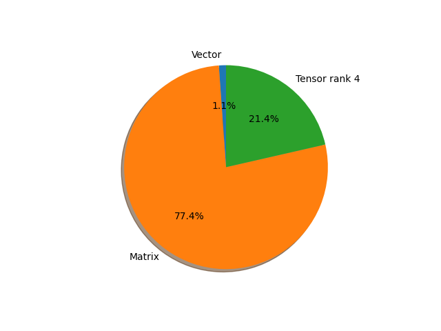

# densenet169 parameter information

**Number of layers: [ 508 ]**

**Number of parameters: [ 14.15M ]**

**Proportional of each form** (%)

| Vector | Matrix | Tensor rank 4 | 
|  --- | --- | --- |
| 66.73 | 16.93 | 16.34 | 
**Proportional of parameters by form** (%)

| Vector | Matrix | Tensor rank 4 | 
|  --- | --- | --- |
| 1.13 | 77.44 | 21.43 | 

**Layer information**

| Name | Shape | Squeezed shape | Number of parameters | Form |
| --- | --- | --- | --- | --- |
| features.conv0.weight | (64, 3, 7, 7) | (64, 3, 7, 7) | 9408 | Tensor rank 4 |
| features.norm0.weight | (64,) | (64,) | 64 | Vector |
| features.norm0.bias | (64,) | (64,) | 64 | Vector |
| features.denseblock1.denselayer1.norm1.weight | (64,) | (64,) | 64 | Vector |
| features.denseblock1.denselayer1.norm1.bias | (64,) | (64,) | 64 | Vector |
| features.denseblock1.denselayer1.conv1.weight | (128, 64, 1, 1) | (128, 64) | 8192 | Matrix |
| features.denseblock1.denselayer1.norm2.weight | (128,) | (128,) | 128 | Vector |
| features.denseblock1.denselayer1.norm2.bias | (128,) | (128,) | 128 | Vector |
| features.denseblock1.denselayer1.conv2.weight | (32, 128, 3, 3) | (32, 128, 3, 3) | 36864 | Tensor rank 4 |
| features.denseblock1.denselayer2.norm1.weight | (96,) | (96,) | 96 | Vector |
| features.denseblock1.denselayer2.norm1.bias | (96,) | (96,) | 96 | Vector |
| features.denseblock1.denselayer2.conv1.weight | (128, 96, 1, 1) | (128, 96) | 12288 | Matrix |
| features.denseblock1.denselayer2.norm2.weight | (128,) | (128,) | 128 | Vector |
| features.denseblock1.denselayer2.norm2.bias | (128,) | (128,) | 128 | Vector |
| features.denseblock1.denselayer2.conv2.weight | (32, 128, 3, 3) | (32, 128, 3, 3) | 36864 | Tensor rank 4 |
| features.denseblock1.denselayer3.norm1.weight | (128,) | (128,) | 128 | Vector |
| features.denseblock1.denselayer3.norm1.bias | (128,) | (128,) | 128 | Vector |
| features.denseblock1.denselayer3.conv1.weight | (128, 128, 1, 1) | (128, 128) | 16384 | Matrix |
| features.denseblock1.denselayer3.norm2.weight | (128,) | (128,) | 128 | Vector |
| features.denseblock1.denselayer3.norm2.bias | (128,) | (128,) | 128 | Vector |
| features.denseblock1.denselayer3.conv2.weight | (32, 128, 3, 3) | (32, 128, 3, 3) | 36864 | Tensor rank 4 |
| features.denseblock1.denselayer4.norm1.weight | (160,) | (160,) | 160 | Vector |
| features.denseblock1.denselayer4.norm1.bias | (160,) | (160,) | 160 | Vector |
| features.denseblock1.denselayer4.conv1.weight | (128, 160, 1, 1) | (128, 160) | 20480 | Matrix |
| features.denseblock1.denselayer4.norm2.weight | (128,) | (128,) | 128 | Vector |
| features.denseblock1.denselayer4.norm2.bias | (128,) | (128,) | 128 | Vector |
| features.denseblock1.denselayer4.conv2.weight | (32, 128, 3, 3) | (32, 128, 3, 3) | 36864 | Tensor rank 4 |
| features.denseblock1.denselayer5.norm1.weight | (192,) | (192,) | 192 | Vector |
| features.denseblock1.denselayer5.norm1.bias | (192,) | (192,) | 192 | Vector |
| features.denseblock1.denselayer5.conv1.weight | (128, 192, 1, 1) | (128, 192) | 24576 | Matrix |
| features.denseblock1.denselayer5.norm2.weight | (128,) | (128,) | 128 | Vector |
| features.denseblock1.denselayer5.norm2.bias | (128,) | (128,) | 128 | Vector |
| features.denseblock1.denselayer5.conv2.weight | (32, 128, 3, 3) | (32, 128, 3, 3) | 36864 | Tensor rank 4 |
| features.denseblock1.denselayer6.norm1.weight | (224,) | (224,) | 224 | Vector |
| features.denseblock1.denselayer6.norm1.bias | (224,) | (224,) | 224 | Vector |
| features.denseblock1.denselayer6.conv1.weight | (128, 224, 1, 1) | (128, 224) | 28672 | Matrix |
| features.denseblock1.denselayer6.norm2.weight | (128,) | (128,) | 128 | Vector |
| features.denseblock1.denselayer6.norm2.bias | (128,) | (128,) | 128 | Vector |
| features.denseblock1.denselayer6.conv2.weight | (32, 128, 3, 3) | (32, 128, 3, 3) | 36864 | Tensor rank 4 |
| features.transition1.norm.weight | (256,) | (256,) | 256 | Vector |
| features.transition1.norm.bias | (256,) | (256,) | 256 | Vector |
| features.transition1.conv.weight | (128, 256, 1, 1) | (128, 256) | 32768 | Matrix |
| features.denseblock2.denselayer1.norm1.weight | (128,) | (128,) | 128 | Vector |
| features.denseblock2.denselayer1.norm1.bias | (128,) | (128,) | 128 | Vector |
| features.denseblock2.denselayer1.conv1.weight | (128, 128, 1, 1) | (128, 128) | 16384 | Matrix |
| features.denseblock2.denselayer1.norm2.weight | (128,) | (128,) | 128 | Vector |
| features.denseblock2.denselayer1.norm2.bias | (128,) | (128,) | 128 | Vector |
| features.denseblock2.denselayer1.conv2.weight | (32, 128, 3, 3) | (32, 128, 3, 3) | 36864 | Tensor rank 4 |
| features.denseblock2.denselayer2.norm1.weight | (160,) | (160,) | 160 | Vector |
| features.denseblock2.denselayer2.norm1.bias | (160,) | (160,) | 160 | Vector |
| features.denseblock2.denselayer2.conv1.weight | (128, 160, 1, 1) | (128, 160) | 20480 | Matrix |
| features.denseblock2.denselayer2.norm2.weight | (128,) | (128,) | 128 | Vector |
| features.denseblock2.denselayer2.norm2.bias | (128,) | (128,) | 128 | Vector |
| features.denseblock2.denselayer2.conv2.weight | (32, 128, 3, 3) | (32, 128, 3, 3) | 36864 | Tensor rank 4 |
| features.denseblock2.denselayer3.norm1.weight | (192,) | (192,) | 192 | Vector |
| features.denseblock2.denselayer3.norm1.bias | (192,) | (192,) | 192 | Vector |
| features.denseblock2.denselayer3.conv1.weight | (128, 192, 1, 1) | (128, 192) | 24576 | Matrix |
| features.denseblock2.denselayer3.norm2.weight | (128,) | (128,) | 128 | Vector |
| features.denseblock2.denselayer3.norm2.bias | (128,) | (128,) | 128 | Vector |
| features.denseblock2.denselayer3.conv2.weight | (32, 128, 3, 3) | (32, 128, 3, 3) | 36864 | Tensor rank 4 |
| features.denseblock2.denselayer4.norm1.weight | (224,) | (224,) | 224 | Vector |
| features.denseblock2.denselayer4.norm1.bias | (224,) | (224,) | 224 | Vector |
| features.denseblock2.denselayer4.conv1.weight | (128, 224, 1, 1) | (128, 224) | 28672 | Matrix |
| features.denseblock2.denselayer4.norm2.weight | (128,) | (128,) | 128 | Vector |
| features.denseblock2.denselayer4.norm2.bias | (128,) | (128,) | 128 | Vector |
| features.denseblock2.denselayer4.conv2.weight | (32, 128, 3, 3) | (32, 128, 3, 3) | 36864 | Tensor rank 4 |
| features.denseblock2.denselayer5.norm1.weight | (256,) | (256,) | 256 | Vector |
| features.denseblock2.denselayer5.norm1.bias | (256,) | (256,) | 256 | Vector |
| features.denseblock2.denselayer5.conv1.weight | (128, 256, 1, 1) | (128, 256) | 32768 | Matrix |
| features.denseblock2.denselayer5.norm2.weight | (128,) | (128,) | 128 | Vector |
| features.denseblock2.denselayer5.norm2.bias | (128,) | (128,) | 128 | Vector |
| features.denseblock2.denselayer5.conv2.weight | (32, 128, 3, 3) | (32, 128, 3, 3) | 36864 | Tensor rank 4 |
| features.denseblock2.denselayer6.norm1.weight | (288,) | (288,) | 288 | Vector |
| features.denseblock2.denselayer6.norm1.bias | (288,) | (288,) | 288 | Vector |
| features.denseblock2.denselayer6.conv1.weight | (128, 288, 1, 1) | (128, 288) | 36864 | Matrix |
| features.denseblock2.denselayer6.norm2.weight | (128,) | (128,) | 128 | Vector |
| features.denseblock2.denselayer6.norm2.bias | (128,) | (128,) | 128 | Vector |
| features.denseblock2.denselayer6.conv2.weight | (32, 128, 3, 3) | (32, 128, 3, 3) | 36864 | Tensor rank 4 |
| features.denseblock2.denselayer7.norm1.weight | (320,) | (320,) | 320 | Vector |
| features.denseblock2.denselayer7.norm1.bias | (320,) | (320,) | 320 | Vector |
| features.denseblock2.denselayer7.conv1.weight | (128, 320, 1, 1) | (128, 320) | 40960 | Matrix |
| features.denseblock2.denselayer7.norm2.weight | (128,) | (128,) | 128 | Vector |
| features.denseblock2.denselayer7.norm2.bias | (128,) | (128,) | 128 | Vector |
| features.denseblock2.denselayer7.conv2.weight | (32, 128, 3, 3) | (32, 128, 3, 3) | 36864 | Tensor rank 4 |
| features.denseblock2.denselayer8.norm1.weight | (352,) | (352,) | 352 | Vector |
| features.denseblock2.denselayer8.norm1.bias | (352,) | (352,) | 352 | Vector |
| features.denseblock2.denselayer8.conv1.weight | (128, 352, 1, 1) | (128, 352) | 45056 | Matrix |
| features.denseblock2.denselayer8.norm2.weight | (128,) | (128,) | 128 | Vector |
| features.denseblock2.denselayer8.norm2.bias | (128,) | (128,) | 128 | Vector |
| features.denseblock2.denselayer8.conv2.weight | (32, 128, 3, 3) | (32, 128, 3, 3) | 36864 | Tensor rank 4 |
| features.denseblock2.denselayer9.norm1.weight | (384,) | (384,) | 384 | Vector |
| features.denseblock2.denselayer9.norm1.bias | (384,) | (384,) | 384 | Vector |
| features.denseblock2.denselayer9.conv1.weight | (128, 384, 1, 1) | (128, 384) | 49152 | Matrix |
| features.denseblock2.denselayer9.norm2.weight | (128,) | (128,) | 128 | Vector |
| features.denseblock2.denselayer9.norm2.bias | (128,) | (128,) | 128 | Vector |
| features.denseblock2.denselayer9.conv2.weight | (32, 128, 3, 3) | (32, 128, 3, 3) | 36864 | Tensor rank 4 |
| features.denseblock2.denselayer10.norm1.weight | (416,) | (416,) | 416 | Vector |
| features.denseblock2.denselayer10.norm1.bias | (416,) | (416,) | 416 | Vector |
| features.denseblock2.denselayer10.conv1.weight | (128, 416, 1, 1) | (128, 416) | 53248 | Matrix |
| features.denseblock2.denselayer10.norm2.weight | (128,) | (128,) | 128 | Vector |
| features.denseblock2.denselayer10.norm2.bias | (128,) | (128,) | 128 | Vector |
| features.denseblock2.denselayer10.conv2.weight | (32, 128, 3, 3) | (32, 128, 3, 3) | 36864 | Tensor rank 4 |
| features.denseblock2.denselayer11.norm1.weight | (448,) | (448,) | 448 | Vector |
| features.denseblock2.denselayer11.norm1.bias | (448,) | (448,) | 448 | Vector |
| features.denseblock2.denselayer11.conv1.weight | (128, 448, 1, 1) | (128, 448) | 57344 | Matrix |
| features.denseblock2.denselayer11.norm2.weight | (128,) | (128,) | 128 | Vector |
| features.denseblock2.denselayer11.norm2.bias | (128,) | (128,) | 128 | Vector |
| features.denseblock2.denselayer11.conv2.weight | (32, 128, 3, 3) | (32, 128, 3, 3) | 36864 | Tensor rank 4 |
| features.denseblock2.denselayer12.norm1.weight | (480,) | (480,) | 480 | Vector |
| features.denseblock2.denselayer12.norm1.bias | (480,) | (480,) | 480 | Vector |
| features.denseblock2.denselayer12.conv1.weight | (128, 480, 1, 1) | (128, 480) | 61440 | Matrix |
| features.denseblock2.denselayer12.norm2.weight | (128,) | (128,) | 128 | Vector |
| features.denseblock2.denselayer12.norm2.bias | (128,) | (128,) | 128 | Vector |
| features.denseblock2.denselayer12.conv2.weight | (32, 128, 3, 3) | (32, 128, 3, 3) | 36864 | Tensor rank 4 |
| features.transition2.norm.weight | (512,) | (512,) | 512 | Vector |
| features.transition2.norm.bias | (512,) | (512,) | 512 | Vector |
| features.transition2.conv.weight | (256, 512, 1, 1) | (256, 512) | 131072 | Matrix |
| features.denseblock3.denselayer1.norm1.weight | (256,) | (256,) | 256 | Vector |
| features.denseblock3.denselayer1.norm1.bias | (256,) | (256,) | 256 | Vector |
| features.denseblock3.denselayer1.conv1.weight | (128, 256, 1, 1) | (128, 256) | 32768 | Matrix |
| features.denseblock3.denselayer1.norm2.weight | (128,) | (128,) | 128 | Vector |
| features.denseblock3.denselayer1.norm2.bias | (128,) | (128,) | 128 | Vector |
| features.denseblock3.denselayer1.conv2.weight | (32, 128, 3, 3) | (32, 128, 3, 3) | 36864 | Tensor rank 4 |
| features.denseblock3.denselayer2.norm1.weight | (288,) | (288,) | 288 | Vector |
| features.denseblock3.denselayer2.norm1.bias | (288,) | (288,) | 288 | Vector |
| features.denseblock3.denselayer2.conv1.weight | (128, 288, 1, 1) | (128, 288) | 36864 | Matrix |
| features.denseblock3.denselayer2.norm2.weight | (128,) | (128,) | 128 | Vector |
| features.denseblock3.denselayer2.norm2.bias | (128,) | (128,) | 128 | Vector |
| features.denseblock3.denselayer2.conv2.weight | (32, 128, 3, 3) | (32, 128, 3, 3) | 36864 | Tensor rank 4 |
| features.denseblock3.denselayer3.norm1.weight | (320,) | (320,) | 320 | Vector |
| features.denseblock3.denselayer3.norm1.bias | (320,) | (320,) | 320 | Vector |
| features.denseblock3.denselayer3.conv1.weight | (128, 320, 1, 1) | (128, 320) | 40960 | Matrix |
| features.denseblock3.denselayer3.norm2.weight | (128,) | (128,) | 128 | Vector |
| features.denseblock3.denselayer3.norm2.bias | (128,) | (128,) | 128 | Vector |
| features.denseblock3.denselayer3.conv2.weight | (32, 128, 3, 3) | (32, 128, 3, 3) | 36864 | Tensor rank 4 |
| features.denseblock3.denselayer4.norm1.weight | (352,) | (352,) | 352 | Vector |
| features.denseblock3.denselayer4.norm1.bias | (352,) | (352,) | 352 | Vector |
| features.denseblock3.denselayer4.conv1.weight | (128, 352, 1, 1) | (128, 352) | 45056 | Matrix |
| features.denseblock3.denselayer4.norm2.weight | (128,) | (128,) | 128 | Vector |
| features.denseblock3.denselayer4.norm2.bias | (128,) | (128,) | 128 | Vector |
| features.denseblock3.denselayer4.conv2.weight | (32, 128, 3, 3) | (32, 128, 3, 3) | 36864 | Tensor rank 4 |
| features.denseblock3.denselayer5.norm1.weight | (384,) | (384,) | 384 | Vector |
| features.denseblock3.denselayer5.norm1.bias | (384,) | (384,) | 384 | Vector |
| features.denseblock3.denselayer5.conv1.weight | (128, 384, 1, 1) | (128, 384) | 49152 | Matrix |
| features.denseblock3.denselayer5.norm2.weight | (128,) | (128,) | 128 | Vector |
| features.denseblock3.denselayer5.norm2.bias | (128,) | (128,) | 128 | Vector |
| features.denseblock3.denselayer5.conv2.weight | (32, 128, 3, 3) | (32, 128, 3, 3) | 36864 | Tensor rank 4 |
| features.denseblock3.denselayer6.norm1.weight | (416,) | (416,) | 416 | Vector |
| features.denseblock3.denselayer6.norm1.bias | (416,) | (416,) | 416 | Vector |
| features.denseblock3.denselayer6.conv1.weight | (128, 416, 1, 1) | (128, 416) | 53248 | Matrix |
| features.denseblock3.denselayer6.norm2.weight | (128,) | (128,) | 128 | Vector |
| features.denseblock3.denselayer6.norm2.bias | (128,) | (128,) | 128 | Vector |
| features.denseblock3.denselayer6.conv2.weight | (32, 128, 3, 3) | (32, 128, 3, 3) | 36864 | Tensor rank 4 |
| features.denseblock3.denselayer7.norm1.weight | (448,) | (448,) | 448 | Vector |
| features.denseblock3.denselayer7.norm1.bias | (448,) | (448,) | 448 | Vector |
| features.denseblock3.denselayer7.conv1.weight | (128, 448, 1, 1) | (128, 448) | 57344 | Matrix |
| features.denseblock3.denselayer7.norm2.weight | (128,) | (128,) | 128 | Vector |
| features.denseblock3.denselayer7.norm2.bias | (128,) | (128,) | 128 | Vector |
| features.denseblock3.denselayer7.conv2.weight | (32, 128, 3, 3) | (32, 128, 3, 3) | 36864 | Tensor rank 4 |
| features.denseblock3.denselayer8.norm1.weight | (480,) | (480,) | 480 | Vector |
| features.denseblock3.denselayer8.norm1.bias | (480,) | (480,) | 480 | Vector |
| features.denseblock3.denselayer8.conv1.weight | (128, 480, 1, 1) | (128, 480) | 61440 | Matrix |
| features.denseblock3.denselayer8.norm2.weight | (128,) | (128,) | 128 | Vector |
| features.denseblock3.denselayer8.norm2.bias | (128,) | (128,) | 128 | Vector |
| features.denseblock3.denselayer8.conv2.weight | (32, 128, 3, 3) | (32, 128, 3, 3) | 36864 | Tensor rank 4 |
| features.denseblock3.denselayer9.norm1.weight | (512,) | (512,) | 512 | Vector |
| features.denseblock3.denselayer9.norm1.bias | (512,) | (512,) | 512 | Vector |
| features.denseblock3.denselayer9.conv1.weight | (128, 512, 1, 1) | (128, 512) | 65536 | Matrix |
| features.denseblock3.denselayer9.norm2.weight | (128,) | (128,) | 128 | Vector |
| features.denseblock3.denselayer9.norm2.bias | (128,) | (128,) | 128 | Vector |
| features.denseblock3.denselayer9.conv2.weight | (32, 128, 3, 3) | (32, 128, 3, 3) | 36864 | Tensor rank 4 |
| features.denseblock3.denselayer10.norm1.weight | (544,) | (544,) | 544 | Vector |
| features.denseblock3.denselayer10.norm1.bias | (544,) | (544,) | 544 | Vector |
| features.denseblock3.denselayer10.conv1.weight | (128, 544, 1, 1) | (128, 544) | 69632 | Matrix |
| features.denseblock3.denselayer10.norm2.weight | (128,) | (128,) | 128 | Vector |
| features.denseblock3.denselayer10.norm2.bias | (128,) | (128,) | 128 | Vector |
| features.denseblock3.denselayer10.conv2.weight | (32, 128, 3, 3) | (32, 128, 3, 3) | 36864 | Tensor rank 4 |
| features.denseblock3.denselayer11.norm1.weight | (576,) | (576,) | 576 | Vector |
| features.denseblock3.denselayer11.norm1.bias | (576,) | (576,) | 576 | Vector |
| features.denseblock3.denselayer11.conv1.weight | (128, 576, 1, 1) | (128, 576) | 73728 | Matrix |
| features.denseblock3.denselayer11.norm2.weight | (128,) | (128,) | 128 | Vector |
| features.denseblock3.denselayer11.norm2.bias | (128,) | (128,) | 128 | Vector |
| features.denseblock3.denselayer11.conv2.weight | (32, 128, 3, 3) | (32, 128, 3, 3) | 36864 | Tensor rank 4 |
| features.denseblock3.denselayer12.norm1.weight | (608,) | (608,) | 608 | Vector |
| features.denseblock3.denselayer12.norm1.bias | (608,) | (608,) | 608 | Vector |
| features.denseblock3.denselayer12.conv1.weight | (128, 608, 1, 1) | (128, 608) | 77824 | Matrix |
| features.denseblock3.denselayer12.norm2.weight | (128,) | (128,) | 128 | Vector |
| features.denseblock3.denselayer12.norm2.bias | (128,) | (128,) | 128 | Vector |
| features.denseblock3.denselayer12.conv2.weight | (32, 128, 3, 3) | (32, 128, 3, 3) | 36864 | Tensor rank 4 |
| features.denseblock3.denselayer13.norm1.weight | (640,) | (640,) | 640 | Vector |
| features.denseblock3.denselayer13.norm1.bias | (640,) | (640,) | 640 | Vector |
| features.denseblock3.denselayer13.conv1.weight | (128, 640, 1, 1) | (128, 640) | 81920 | Matrix |
| features.denseblock3.denselayer13.norm2.weight | (128,) | (128,) | 128 | Vector |
| features.denseblock3.denselayer13.norm2.bias | (128,) | (128,) | 128 | Vector |
| features.denseblock3.denselayer13.conv2.weight | (32, 128, 3, 3) | (32, 128, 3, 3) | 36864 | Tensor rank 4 |
| features.denseblock3.denselayer14.norm1.weight | (672,) | (672,) | 672 | Vector |
| features.denseblock3.denselayer14.norm1.bias | (672,) | (672,) | 672 | Vector |
| features.denseblock3.denselayer14.conv1.weight | (128, 672, 1, 1) | (128, 672) | 86016 | Matrix |
| features.denseblock3.denselayer14.norm2.weight | (128,) | (128,) | 128 | Vector |
| features.denseblock3.denselayer14.norm2.bias | (128,) | (128,) | 128 | Vector |
| features.denseblock3.denselayer14.conv2.weight | (32, 128, 3, 3) | (32, 128, 3, 3) | 36864 | Tensor rank 4 |
| features.denseblock3.denselayer15.norm1.weight | (704,) | (704,) | 704 | Vector |
| features.denseblock3.denselayer15.norm1.bias | (704,) | (704,) | 704 | Vector |
| features.denseblock3.denselayer15.conv1.weight | (128, 704, 1, 1) | (128, 704) | 90112 | Matrix |
| features.denseblock3.denselayer15.norm2.weight | (128,) | (128,) | 128 | Vector |
| features.denseblock3.denselayer15.norm2.bias | (128,) | (128,) | 128 | Vector |
| features.denseblock3.denselayer15.conv2.weight | (32, 128, 3, 3) | (32, 128, 3, 3) | 36864 | Tensor rank 4 |
| features.denseblock3.denselayer16.norm1.weight | (736,) | (736,) | 736 | Vector |
| features.denseblock3.denselayer16.norm1.bias | (736,) | (736,) | 736 | Vector |
| features.denseblock3.denselayer16.conv1.weight | (128, 736, 1, 1) | (128, 736) | 94208 | Matrix |
| features.denseblock3.denselayer16.norm2.weight | (128,) | (128,) | 128 | Vector |
| features.denseblock3.denselayer16.norm2.bias | (128,) | (128,) | 128 | Vector |
| features.denseblock3.denselayer16.conv2.weight | (32, 128, 3, 3) | (32, 128, 3, 3) | 36864 | Tensor rank 4 |
| features.denseblock3.denselayer17.norm1.weight | (768,) | (768,) | 768 | Vector |
| features.denseblock3.denselayer17.norm1.bias | (768,) | (768,) | 768 | Vector |
| features.denseblock3.denselayer17.conv1.weight | (128, 768, 1, 1) | (128, 768) | 98304 | Matrix |
| features.denseblock3.denselayer17.norm2.weight | (128,) | (128,) | 128 | Vector |
| features.denseblock3.denselayer17.norm2.bias | (128,) | (128,) | 128 | Vector |
| features.denseblock3.denselayer17.conv2.weight | (32, 128, 3, 3) | (32, 128, 3, 3) | 36864 | Tensor rank 4 |
| features.denseblock3.denselayer18.norm1.weight | (800,) | (800,) | 800 | Vector |
| features.denseblock3.denselayer18.norm1.bias | (800,) | (800,) | 800 | Vector |
| features.denseblock3.denselayer18.conv1.weight | (128, 800, 1, 1) | (128, 800) | 102400 | Matrix |
| features.denseblock3.denselayer18.norm2.weight | (128,) | (128,) | 128 | Vector |
| features.denseblock3.denselayer18.norm2.bias | (128,) | (128,) | 128 | Vector |
| features.denseblock3.denselayer18.conv2.weight | (32, 128, 3, 3) | (32, 128, 3, 3) | 36864 | Tensor rank 4 |
| features.denseblock3.denselayer19.norm1.weight | (832,) | (832,) | 832 | Vector |
| features.denseblock3.denselayer19.norm1.bias | (832,) | (832,) | 832 | Vector |
| features.denseblock3.denselayer19.conv1.weight | (128, 832, 1, 1) | (128, 832) | 106496 | Matrix |
| features.denseblock3.denselayer19.norm2.weight | (128,) | (128,) | 128 | Vector |
| features.denseblock3.denselayer19.norm2.bias | (128,) | (128,) | 128 | Vector |
| features.denseblock3.denselayer19.conv2.weight | (32, 128, 3, 3) | (32, 128, 3, 3) | 36864 | Tensor rank 4 |
| features.denseblock3.denselayer20.norm1.weight | (864,) | (864,) | 864 | Vector |
| features.denseblock3.denselayer20.norm1.bias | (864,) | (864,) | 864 | Vector |
| features.denseblock3.denselayer20.conv1.weight | (128, 864, 1, 1) | (128, 864) | 110592 | Matrix |
| features.denseblock3.denselayer20.norm2.weight | (128,) | (128,) | 128 | Vector |
| features.denseblock3.denselayer20.norm2.bias | (128,) | (128,) | 128 | Vector |
| features.denseblock3.denselayer20.conv2.weight | (32, 128, 3, 3) | (32, 128, 3, 3) | 36864 | Tensor rank 4 |
| features.denseblock3.denselayer21.norm1.weight | (896,) | (896,) | 896 | Vector |
| features.denseblock3.denselayer21.norm1.bias | (896,) | (896,) | 896 | Vector |
| features.denseblock3.denselayer21.conv1.weight | (128, 896, 1, 1) | (128, 896) | 114688 | Matrix |
| features.denseblock3.denselayer21.norm2.weight | (128,) | (128,) | 128 | Vector |
| features.denseblock3.denselayer21.norm2.bias | (128,) | (128,) | 128 | Vector |
| features.denseblock3.denselayer21.conv2.weight | (32, 128, 3, 3) | (32, 128, 3, 3) | 36864 | Tensor rank 4 |
| features.denseblock3.denselayer22.norm1.weight | (928,) | (928,) | 928 | Vector |
| features.denseblock3.denselayer22.norm1.bias | (928,) | (928,) | 928 | Vector |
| features.denseblock3.denselayer22.conv1.weight | (128, 928, 1, 1) | (128, 928) | 118784 | Matrix |
| features.denseblock3.denselayer22.norm2.weight | (128,) | (128,) | 128 | Vector |
| features.denseblock3.denselayer22.norm2.bias | (128,) | (128,) | 128 | Vector |
| features.denseblock3.denselayer22.conv2.weight | (32, 128, 3, 3) | (32, 128, 3, 3) | 36864 | Tensor rank 4 |
| features.denseblock3.denselayer23.norm1.weight | (960,) | (960,) | 960 | Vector |
| features.denseblock3.denselayer23.norm1.bias | (960,) | (960,) | 960 | Vector |
| features.denseblock3.denselayer23.conv1.weight | (128, 960, 1, 1) | (128, 960) | 122880 | Matrix |
| features.denseblock3.denselayer23.norm2.weight | (128,) | (128,) | 128 | Vector |
| features.denseblock3.denselayer23.norm2.bias | (128,) | (128,) | 128 | Vector |
| features.denseblock3.denselayer23.conv2.weight | (32, 128, 3, 3) | (32, 128, 3, 3) | 36864 | Tensor rank 4 |
| features.denseblock3.denselayer24.norm1.weight | (992,) | (992,) | 992 | Vector |
| features.denseblock3.denselayer24.norm1.bias | (992,) | (992,) | 992 | Vector |
| features.denseblock3.denselayer24.conv1.weight | (128, 992, 1, 1) | (128, 992) | 126976 | Matrix |
| features.denseblock3.denselayer24.norm2.weight | (128,) | (128,) | 128 | Vector |
| features.denseblock3.denselayer24.norm2.bias | (128,) | (128,) | 128 | Vector |
| features.denseblock3.denselayer24.conv2.weight | (32, 128, 3, 3) | (32, 128, 3, 3) | 36864 | Tensor rank 4 |
| features.denseblock3.denselayer25.norm1.weight | (1024,) | (1024,) | 1024 | Vector |
| features.denseblock3.denselayer25.norm1.bias | (1024,) | (1024,) | 1024 | Vector |
| features.denseblock3.denselayer25.conv1.weight | (128, 1024, 1, 1) | (128, 1024) | 131072 | Matrix |
| features.denseblock3.denselayer25.norm2.weight | (128,) | (128,) | 128 | Vector |
| features.denseblock3.denselayer25.norm2.bias | (128,) | (128,) | 128 | Vector |
| features.denseblock3.denselayer25.conv2.weight | (32, 128, 3, 3) | (32, 128, 3, 3) | 36864 | Tensor rank 4 |
| features.denseblock3.denselayer26.norm1.weight | (1056,) | (1056,) | 1056 | Vector |
| features.denseblock3.denselayer26.norm1.bias | (1056,) | (1056,) | 1056 | Vector |
| features.denseblock3.denselayer26.conv1.weight | (128, 1056, 1, 1) | (128, 1056) | 135168 | Matrix |
| features.denseblock3.denselayer26.norm2.weight | (128,) | (128,) | 128 | Vector |
| features.denseblock3.denselayer26.norm2.bias | (128,) | (128,) | 128 | Vector |
| features.denseblock3.denselayer26.conv2.weight | (32, 128, 3, 3) | (32, 128, 3, 3) | 36864 | Tensor rank 4 |
| features.denseblock3.denselayer27.norm1.weight | (1088,) | (1088,) | 1088 | Vector |
| features.denseblock3.denselayer27.norm1.bias | (1088,) | (1088,) | 1088 | Vector |
| features.denseblock3.denselayer27.conv1.weight | (128, 1088, 1, 1) | (128, 1088) | 139264 | Matrix |
| features.denseblock3.denselayer27.norm2.weight | (128,) | (128,) | 128 | Vector |
| features.denseblock3.denselayer27.norm2.bias | (128,) | (128,) | 128 | Vector |
| features.denseblock3.denselayer27.conv2.weight | (32, 128, 3, 3) | (32, 128, 3, 3) | 36864 | Tensor rank 4 |
| features.denseblock3.denselayer28.norm1.weight | (1120,) | (1120,) | 1120 | Vector |
| features.denseblock3.denselayer28.norm1.bias | (1120,) | (1120,) | 1120 | Vector |
| features.denseblock3.denselayer28.conv1.weight | (128, 1120, 1, 1) | (128, 1120) | 143360 | Matrix |
| features.denseblock3.denselayer28.norm2.weight | (128,) | (128,) | 128 | Vector |
| features.denseblock3.denselayer28.norm2.bias | (128,) | (128,) | 128 | Vector |
| features.denseblock3.denselayer28.conv2.weight | (32, 128, 3, 3) | (32, 128, 3, 3) | 36864 | Tensor rank 4 |
| features.denseblock3.denselayer29.norm1.weight | (1152,) | (1152,) | 1152 | Vector |
| features.denseblock3.denselayer29.norm1.bias | (1152,) | (1152,) | 1152 | Vector |
| features.denseblock3.denselayer29.conv1.weight | (128, 1152, 1, 1) | (128, 1152) | 147456 | Matrix |
| features.denseblock3.denselayer29.norm2.weight | (128,) | (128,) | 128 | Vector |
| features.denseblock3.denselayer29.norm2.bias | (128,) | (128,) | 128 | Vector |
| features.denseblock3.denselayer29.conv2.weight | (32, 128, 3, 3) | (32, 128, 3, 3) | 36864 | Tensor rank 4 |
| features.denseblock3.denselayer30.norm1.weight | (1184,) | (1184,) | 1184 | Vector |
| features.denseblock3.denselayer30.norm1.bias | (1184,) | (1184,) | 1184 | Vector |
| features.denseblock3.denselayer30.conv1.weight | (128, 1184, 1, 1) | (128, 1184) | 151552 | Matrix |
| features.denseblock3.denselayer30.norm2.weight | (128,) | (128,) | 128 | Vector |
| features.denseblock3.denselayer30.norm2.bias | (128,) | (128,) | 128 | Vector |
| features.denseblock3.denselayer30.conv2.weight | (32, 128, 3, 3) | (32, 128, 3, 3) | 36864 | Tensor rank 4 |
| features.denseblock3.denselayer31.norm1.weight | (1216,) | (1216,) | 1216 | Vector |
| features.denseblock3.denselayer31.norm1.bias | (1216,) | (1216,) | 1216 | Vector |
| features.denseblock3.denselayer31.conv1.weight | (128, 1216, 1, 1) | (128, 1216) | 155648 | Matrix |
| features.denseblock3.denselayer31.norm2.weight | (128,) | (128,) | 128 | Vector |
| features.denseblock3.denselayer31.norm2.bias | (128,) | (128,) | 128 | Vector |
| features.denseblock3.denselayer31.conv2.weight | (32, 128, 3, 3) | (32, 128, 3, 3) | 36864 | Tensor rank 4 |
| features.denseblock3.denselayer32.norm1.weight | (1248,) | (1248,) | 1248 | Vector |
| features.denseblock3.denselayer32.norm1.bias | (1248,) | (1248,) | 1248 | Vector |
| features.denseblock3.denselayer32.conv1.weight | (128, 1248, 1, 1) | (128, 1248) | 159744 | Matrix |
| features.denseblock3.denselayer32.norm2.weight | (128,) | (128,) | 128 | Vector |
| features.denseblock3.denselayer32.norm2.bias | (128,) | (128,) | 128 | Vector |
| features.denseblock3.denselayer32.conv2.weight | (32, 128, 3, 3) | (32, 128, 3, 3) | 36864 | Tensor rank 4 |
| features.transition3.norm.weight | (1280,) | (1280,) | 1280 | Vector |
| features.transition3.norm.bias | (1280,) | (1280,) | 1280 | Vector |
| features.transition3.conv.weight | (640, 1280, 1, 1) | (640, 1280) | 819200 | Matrix |
| features.denseblock4.denselayer1.norm1.weight | (640,) | (640,) | 640 | Vector |
| features.denseblock4.denselayer1.norm1.bias | (640,) | (640,) | 640 | Vector |
| features.denseblock4.denselayer1.conv1.weight | (128, 640, 1, 1) | (128, 640) | 81920 | Matrix |
| features.denseblock4.denselayer1.norm2.weight | (128,) | (128,) | 128 | Vector |
| features.denseblock4.denselayer1.norm2.bias | (128,) | (128,) | 128 | Vector |
| features.denseblock4.denselayer1.conv2.weight | (32, 128, 3, 3) | (32, 128, 3, 3) | 36864 | Tensor rank 4 |
| features.denseblock4.denselayer2.norm1.weight | (672,) | (672,) | 672 | Vector |
| features.denseblock4.denselayer2.norm1.bias | (672,) | (672,) | 672 | Vector |
| features.denseblock4.denselayer2.conv1.weight | (128, 672, 1, 1) | (128, 672) | 86016 | Matrix |
| features.denseblock4.denselayer2.norm2.weight | (128,) | (128,) | 128 | Vector |
| features.denseblock4.denselayer2.norm2.bias | (128,) | (128,) | 128 | Vector |
| features.denseblock4.denselayer2.conv2.weight | (32, 128, 3, 3) | (32, 128, 3, 3) | 36864 | Tensor rank 4 |
| features.denseblock4.denselayer3.norm1.weight | (704,) | (704,) | 704 | Vector |
| features.denseblock4.denselayer3.norm1.bias | (704,) | (704,) | 704 | Vector |
| features.denseblock4.denselayer3.conv1.weight | (128, 704, 1, 1) | (128, 704) | 90112 | Matrix |
| features.denseblock4.denselayer3.norm2.weight | (128,) | (128,) | 128 | Vector |
| features.denseblock4.denselayer3.norm2.bias | (128,) | (128,) | 128 | Vector |
| features.denseblock4.denselayer3.conv2.weight | (32, 128, 3, 3) | (32, 128, 3, 3) | 36864 | Tensor rank 4 |
| features.denseblock4.denselayer4.norm1.weight | (736,) | (736,) | 736 | Vector |
| features.denseblock4.denselayer4.norm1.bias | (736,) | (736,) | 736 | Vector |
| features.denseblock4.denselayer4.conv1.weight | (128, 736, 1, 1) | (128, 736) | 94208 | Matrix |
| features.denseblock4.denselayer4.norm2.weight | (128,) | (128,) | 128 | Vector |
| features.denseblock4.denselayer4.norm2.bias | (128,) | (128,) | 128 | Vector |
| features.denseblock4.denselayer4.conv2.weight | (32, 128, 3, 3) | (32, 128, 3, 3) | 36864 | Tensor rank 4 |
| features.denseblock4.denselayer5.norm1.weight | (768,) | (768,) | 768 | Vector |
| features.denseblock4.denselayer5.norm1.bias | (768,) | (768,) | 768 | Vector |
| features.denseblock4.denselayer5.conv1.weight | (128, 768, 1, 1) | (128, 768) | 98304 | Matrix |
| features.denseblock4.denselayer5.norm2.weight | (128,) | (128,) | 128 | Vector |
| features.denseblock4.denselayer5.norm2.bias | (128,) | (128,) | 128 | Vector |
| features.denseblock4.denselayer5.conv2.weight | (32, 128, 3, 3) | (32, 128, 3, 3) | 36864 | Tensor rank 4 |
| features.denseblock4.denselayer6.norm1.weight | (800,) | (800,) | 800 | Vector |
| features.denseblock4.denselayer6.norm1.bias | (800,) | (800,) | 800 | Vector |
| features.denseblock4.denselayer6.conv1.weight | (128, 800, 1, 1) | (128, 800) | 102400 | Matrix |
| features.denseblock4.denselayer6.norm2.weight | (128,) | (128,) | 128 | Vector |
| features.denseblock4.denselayer6.norm2.bias | (128,) | (128,) | 128 | Vector |
| features.denseblock4.denselayer6.conv2.weight | (32, 128, 3, 3) | (32, 128, 3, 3) | 36864 | Tensor rank 4 |
| features.denseblock4.denselayer7.norm1.weight | (832,) | (832,) | 832 | Vector |
| features.denseblock4.denselayer7.norm1.bias | (832,) | (832,) | 832 | Vector |
| features.denseblock4.denselayer7.conv1.weight | (128, 832, 1, 1) | (128, 832) | 106496 | Matrix |
| features.denseblock4.denselayer7.norm2.weight | (128,) | (128,) | 128 | Vector |
| features.denseblock4.denselayer7.norm2.bias | (128,) | (128,) | 128 | Vector |
| features.denseblock4.denselayer7.conv2.weight | (32, 128, 3, 3) | (32, 128, 3, 3) | 36864 | Tensor rank 4 |
| features.denseblock4.denselayer8.norm1.weight | (864,) | (864,) | 864 | Vector |
| features.denseblock4.denselayer8.norm1.bias | (864,) | (864,) | 864 | Vector |
| features.denseblock4.denselayer8.conv1.weight | (128, 864, 1, 1) | (128, 864) | 110592 | Matrix |
| features.denseblock4.denselayer8.norm2.weight | (128,) | (128,) | 128 | Vector |
| features.denseblock4.denselayer8.norm2.bias | (128,) | (128,) | 128 | Vector |
| features.denseblock4.denselayer8.conv2.weight | (32, 128, 3, 3) | (32, 128, 3, 3) | 36864 | Tensor rank 4 |
| features.denseblock4.denselayer9.norm1.weight | (896,) | (896,) | 896 | Vector |
| features.denseblock4.denselayer9.norm1.bias | (896,) | (896,) | 896 | Vector |
| features.denseblock4.denselayer9.conv1.weight | (128, 896, 1, 1) | (128, 896) | 114688 | Matrix |
| features.denseblock4.denselayer9.norm2.weight | (128,) | (128,) | 128 | Vector |
| features.denseblock4.denselayer9.norm2.bias | (128,) | (128,) | 128 | Vector |
| features.denseblock4.denselayer9.conv2.weight | (32, 128, 3, 3) | (32, 128, 3, 3) | 36864 | Tensor rank 4 |
| features.denseblock4.denselayer10.norm1.weight | (928,) | (928,) | 928 | Vector |
| features.denseblock4.denselayer10.norm1.bias | (928,) | (928,) | 928 | Vector |
| features.denseblock4.denselayer10.conv1.weight | (128, 928, 1, 1) | (128, 928) | 118784 | Matrix |
| features.denseblock4.denselayer10.norm2.weight | (128,) | (128,) | 128 | Vector |
| features.denseblock4.denselayer10.norm2.bias | (128,) | (128,) | 128 | Vector |
| features.denseblock4.denselayer10.conv2.weight | (32, 128, 3, 3) | (32, 128, 3, 3) | 36864 | Tensor rank 4 |
| features.denseblock4.denselayer11.norm1.weight | (960,) | (960,) | 960 | Vector |
| features.denseblock4.denselayer11.norm1.bias | (960,) | (960,) | 960 | Vector |
| features.denseblock4.denselayer11.conv1.weight | (128, 960, 1, 1) | (128, 960) | 122880 | Matrix |
| features.denseblock4.denselayer11.norm2.weight | (128,) | (128,) | 128 | Vector |
| features.denseblock4.denselayer11.norm2.bias | (128,) | (128,) | 128 | Vector |
| features.denseblock4.denselayer11.conv2.weight | (32, 128, 3, 3) | (32, 128, 3, 3) | 36864 | Tensor rank 4 |
| features.denseblock4.denselayer12.norm1.weight | (992,) | (992,) | 992 | Vector |
| features.denseblock4.denselayer12.norm1.bias | (992,) | (992,) | 992 | Vector |
| features.denseblock4.denselayer12.conv1.weight | (128, 992, 1, 1) | (128, 992) | 126976 | Matrix |
| features.denseblock4.denselayer12.norm2.weight | (128,) | (128,) | 128 | Vector |
| features.denseblock4.denselayer12.norm2.bias | (128,) | (128,) | 128 | Vector |
| features.denseblock4.denselayer12.conv2.weight | (32, 128, 3, 3) | (32, 128, 3, 3) | 36864 | Tensor rank 4 |
| features.denseblock4.denselayer13.norm1.weight | (1024,) | (1024,) | 1024 | Vector |
| features.denseblock4.denselayer13.norm1.bias | (1024,) | (1024,) | 1024 | Vector |
| features.denseblock4.denselayer13.conv1.weight | (128, 1024, 1, 1) | (128, 1024) | 131072 | Matrix |
| features.denseblock4.denselayer13.norm2.weight | (128,) | (128,) | 128 | Vector |
| features.denseblock4.denselayer13.norm2.bias | (128,) | (128,) | 128 | Vector |
| features.denseblock4.denselayer13.conv2.weight | (32, 128, 3, 3) | (32, 128, 3, 3) | 36864 | Tensor rank 4 |
| features.denseblock4.denselayer14.norm1.weight | (1056,) | (1056,) | 1056 | Vector |
| features.denseblock4.denselayer14.norm1.bias | (1056,) | (1056,) | 1056 | Vector |
| features.denseblock4.denselayer14.conv1.weight | (128, 1056, 1, 1) | (128, 1056) | 135168 | Matrix |
| features.denseblock4.denselayer14.norm2.weight | (128,) | (128,) | 128 | Vector |
| features.denseblock4.denselayer14.norm2.bias | (128,) | (128,) | 128 | Vector |
| features.denseblock4.denselayer14.conv2.weight | (32, 128, 3, 3) | (32, 128, 3, 3) | 36864 | Tensor rank 4 |
| features.denseblock4.denselayer15.norm1.weight | (1088,) | (1088,) | 1088 | Vector |
| features.denseblock4.denselayer15.norm1.bias | (1088,) | (1088,) | 1088 | Vector |
| features.denseblock4.denselayer15.conv1.weight | (128, 1088, 1, 1) | (128, 1088) | 139264 | Matrix |
| features.denseblock4.denselayer15.norm2.weight | (128,) | (128,) | 128 | Vector |
| features.denseblock4.denselayer15.norm2.bias | (128,) | (128,) | 128 | Vector |
| features.denseblock4.denselayer15.conv2.weight | (32, 128, 3, 3) | (32, 128, 3, 3) | 36864 | Tensor rank 4 |
| features.denseblock4.denselayer16.norm1.weight | (1120,) | (1120,) | 1120 | Vector |
| features.denseblock4.denselayer16.norm1.bias | (1120,) | (1120,) | 1120 | Vector |
| features.denseblock4.denselayer16.conv1.weight | (128, 1120, 1, 1) | (128, 1120) | 143360 | Matrix |
| features.denseblock4.denselayer16.norm2.weight | (128,) | (128,) | 128 | Vector |
| features.denseblock4.denselayer16.norm2.bias | (128,) | (128,) | 128 | Vector |
| features.denseblock4.denselayer16.conv2.weight | (32, 128, 3, 3) | (32, 128, 3, 3) | 36864 | Tensor rank 4 |
| features.denseblock4.denselayer17.norm1.weight | (1152,) | (1152,) | 1152 | Vector |
| features.denseblock4.denselayer17.norm1.bias | (1152,) | (1152,) | 1152 | Vector |
| features.denseblock4.denselayer17.conv1.weight | (128, 1152, 1, 1) | (128, 1152) | 147456 | Matrix |
| features.denseblock4.denselayer17.norm2.weight | (128,) | (128,) | 128 | Vector |
| features.denseblock4.denselayer17.norm2.bias | (128,) | (128,) | 128 | Vector |
| features.denseblock4.denselayer17.conv2.weight | (32, 128, 3, 3) | (32, 128, 3, 3) | 36864 | Tensor rank 4 |
| features.denseblock4.denselayer18.norm1.weight | (1184,) | (1184,) | 1184 | Vector |
| features.denseblock4.denselayer18.norm1.bias | (1184,) | (1184,) | 1184 | Vector |
| features.denseblock4.denselayer18.conv1.weight | (128, 1184, 1, 1) | (128, 1184) | 151552 | Matrix |
| features.denseblock4.denselayer18.norm2.weight | (128,) | (128,) | 128 | Vector |
| features.denseblock4.denselayer18.norm2.bias | (128,) | (128,) | 128 | Vector |
| features.denseblock4.denselayer18.conv2.weight | (32, 128, 3, 3) | (32, 128, 3, 3) | 36864 | Tensor rank 4 |
| features.denseblock4.denselayer19.norm1.weight | (1216,) | (1216,) | 1216 | Vector |
| features.denseblock4.denselayer19.norm1.bias | (1216,) | (1216,) | 1216 | Vector |
| features.denseblock4.denselayer19.conv1.weight | (128, 1216, 1, 1) | (128, 1216) | 155648 | Matrix |
| features.denseblock4.denselayer19.norm2.weight | (128,) | (128,) | 128 | Vector |
| features.denseblock4.denselayer19.norm2.bias | (128,) | (128,) | 128 | Vector |
| features.denseblock4.denselayer19.conv2.weight | (32, 128, 3, 3) | (32, 128, 3, 3) | 36864 | Tensor rank 4 |
| features.denseblock4.denselayer20.norm1.weight | (1248,) | (1248,) | 1248 | Vector |
| features.denseblock4.denselayer20.norm1.bias | (1248,) | (1248,) | 1248 | Vector |
| features.denseblock4.denselayer20.conv1.weight | (128, 1248, 1, 1) | (128, 1248) | 159744 | Matrix |
| features.denseblock4.denselayer20.norm2.weight | (128,) | (128,) | 128 | Vector |
| features.denseblock4.denselayer20.norm2.bias | (128,) | (128,) | 128 | Vector |
| features.denseblock4.denselayer20.conv2.weight | (32, 128, 3, 3) | (32, 128, 3, 3) | 36864 | Tensor rank 4 |
| features.denseblock4.denselayer21.norm1.weight | (1280,) | (1280,) | 1280 | Vector |
| features.denseblock4.denselayer21.norm1.bias | (1280,) | (1280,) | 1280 | Vector |
| features.denseblock4.denselayer21.conv1.weight | (128, 1280, 1, 1) | (128, 1280) | 163840 | Matrix |
| features.denseblock4.denselayer21.norm2.weight | (128,) | (128,) | 128 | Vector |
| features.denseblock4.denselayer21.norm2.bias | (128,) | (128,) | 128 | Vector |
| features.denseblock4.denselayer21.conv2.weight | (32, 128, 3, 3) | (32, 128, 3, 3) | 36864 | Tensor rank 4 |
| features.denseblock4.denselayer22.norm1.weight | (1312,) | (1312,) | 1312 | Vector |
| features.denseblock4.denselayer22.norm1.bias | (1312,) | (1312,) | 1312 | Vector |
| features.denseblock4.denselayer22.conv1.weight | (128, 1312, 1, 1) | (128, 1312) | 167936 | Matrix |
| features.denseblock4.denselayer22.norm2.weight | (128,) | (128,) | 128 | Vector |
| features.denseblock4.denselayer22.norm2.bias | (128,) | (128,) | 128 | Vector |
| features.denseblock4.denselayer22.conv2.weight | (32, 128, 3, 3) | (32, 128, 3, 3) | 36864 | Tensor rank 4 |
| features.denseblock4.denselayer23.norm1.weight | (1344,) | (1344,) | 1344 | Vector |
| features.denseblock4.denselayer23.norm1.bias | (1344,) | (1344,) | 1344 | Vector |
| features.denseblock4.denselayer23.conv1.weight | (128, 1344, 1, 1) | (128, 1344) | 172032 | Matrix |
| features.denseblock4.denselayer23.norm2.weight | (128,) | (128,) | 128 | Vector |
| features.denseblock4.denselayer23.norm2.bias | (128,) | (128,) | 128 | Vector |
| features.denseblock4.denselayer23.conv2.weight | (32, 128, 3, 3) | (32, 128, 3, 3) | 36864 | Tensor rank 4 |
| features.denseblock4.denselayer24.norm1.weight | (1376,) | (1376,) | 1376 | Vector |
| features.denseblock4.denselayer24.norm1.bias | (1376,) | (1376,) | 1376 | Vector |
| features.denseblock4.denselayer24.conv1.weight | (128, 1376, 1, 1) | (128, 1376) | 176128 | Matrix |
| features.denseblock4.denselayer24.norm2.weight | (128,) | (128,) | 128 | Vector |
| features.denseblock4.denselayer24.norm2.bias | (128,) | (128,) | 128 | Vector |
| features.denseblock4.denselayer24.conv2.weight | (32, 128, 3, 3) | (32, 128, 3, 3) | 36864 | Tensor rank 4 |
| features.denseblock4.denselayer25.norm1.weight | (1408,) | (1408,) | 1408 | Vector |
| features.denseblock4.denselayer25.norm1.bias | (1408,) | (1408,) | 1408 | Vector |
| features.denseblock4.denselayer25.conv1.weight | (128, 1408, 1, 1) | (128, 1408) | 180224 | Matrix |
| features.denseblock4.denselayer25.norm2.weight | (128,) | (128,) | 128 | Vector |
| features.denseblock4.denselayer25.norm2.bias | (128,) | (128,) | 128 | Vector |
| features.denseblock4.denselayer25.conv2.weight | (32, 128, 3, 3) | (32, 128, 3, 3) | 36864 | Tensor rank 4 |
| features.denseblock4.denselayer26.norm1.weight | (1440,) | (1440,) | 1440 | Vector |
| features.denseblock4.denselayer26.norm1.bias | (1440,) | (1440,) | 1440 | Vector |
| features.denseblock4.denselayer26.conv1.weight | (128, 1440, 1, 1) | (128, 1440) | 184320 | Matrix |
| features.denseblock4.denselayer26.norm2.weight | (128,) | (128,) | 128 | Vector |
| features.denseblock4.denselayer26.norm2.bias | (128,) | (128,) | 128 | Vector |
| features.denseblock4.denselayer26.conv2.weight | (32, 128, 3, 3) | (32, 128, 3, 3) | 36864 | Tensor rank 4 |
| features.denseblock4.denselayer27.norm1.weight | (1472,) | (1472,) | 1472 | Vector |
| features.denseblock4.denselayer27.norm1.bias | (1472,) | (1472,) | 1472 | Vector |
| features.denseblock4.denselayer27.conv1.weight | (128, 1472, 1, 1) | (128, 1472) | 188416 | Matrix |
| features.denseblock4.denselayer27.norm2.weight | (128,) | (128,) | 128 | Vector |
| features.denseblock4.denselayer27.norm2.bias | (128,) | (128,) | 128 | Vector |
| features.denseblock4.denselayer27.conv2.weight | (32, 128, 3, 3) | (32, 128, 3, 3) | 36864 | Tensor rank 4 |
| features.denseblock4.denselayer28.norm1.weight | (1504,) | (1504,) | 1504 | Vector |
| features.denseblock4.denselayer28.norm1.bias | (1504,) | (1504,) | 1504 | Vector |
| features.denseblock4.denselayer28.conv1.weight | (128, 1504, 1, 1) | (128, 1504) | 192512 | Matrix |
| features.denseblock4.denselayer28.norm2.weight | (128,) | (128,) | 128 | Vector |
| features.denseblock4.denselayer28.norm2.bias | (128,) | (128,) | 128 | Vector |
| features.denseblock4.denselayer28.conv2.weight | (32, 128, 3, 3) | (32, 128, 3, 3) | 36864 | Tensor rank 4 |
| features.denseblock4.denselayer29.norm1.weight | (1536,) | (1536,) | 1536 | Vector |
| features.denseblock4.denselayer29.norm1.bias | (1536,) | (1536,) | 1536 | Vector |
| features.denseblock4.denselayer29.conv1.weight | (128, 1536, 1, 1) | (128, 1536) | 196608 | Matrix |
| features.denseblock4.denselayer29.norm2.weight | (128,) | (128,) | 128 | Vector |
| features.denseblock4.denselayer29.norm2.bias | (128,) | (128,) | 128 | Vector |
| features.denseblock4.denselayer29.conv2.weight | (32, 128, 3, 3) | (32, 128, 3, 3) | 36864 | Tensor rank 4 |
| features.denseblock4.denselayer30.norm1.weight | (1568,) | (1568,) | 1568 | Vector |
| features.denseblock4.denselayer30.norm1.bias | (1568,) | (1568,) | 1568 | Vector |
| features.denseblock4.denselayer30.conv1.weight | (128, 1568, 1, 1) | (128, 1568) | 200704 | Matrix |
| features.denseblock4.denselayer30.norm2.weight | (128,) | (128,) | 128 | Vector |
| features.denseblock4.denselayer30.norm2.bias | (128,) | (128,) | 128 | Vector |
| features.denseblock4.denselayer30.conv2.weight | (32, 128, 3, 3) | (32, 128, 3, 3) | 36864 | Tensor rank 4 |
| features.denseblock4.denselayer31.norm1.weight | (1600,) | (1600,) | 1600 | Vector |
| features.denseblock4.denselayer31.norm1.bias | (1600,) | (1600,) | 1600 | Vector |
| features.denseblock4.denselayer31.conv1.weight | (128, 1600, 1, 1) | (128, 1600) | 204800 | Matrix |
| features.denseblock4.denselayer31.norm2.weight | (128,) | (128,) | 128 | Vector |
| features.denseblock4.denselayer31.norm2.bias | (128,) | (128,) | 128 | Vector |
| features.denseblock4.denselayer31.conv2.weight | (32, 128, 3, 3) | (32, 128, 3, 3) | 36864 | Tensor rank 4 |
| features.denseblock4.denselayer32.norm1.weight | (1632,) | (1632,) | 1632 | Vector |
| features.denseblock4.denselayer32.norm1.bias | (1632,) | (1632,) | 1632 | Vector |
| features.denseblock4.denselayer32.conv1.weight | (128, 1632, 1, 1) | (128, 1632) | 208896 | Matrix |
| features.denseblock4.denselayer32.norm2.weight | (128,) | (128,) | 128 | Vector |
| features.denseblock4.denselayer32.norm2.bias | (128,) | (128,) | 128 | Vector |
| features.denseblock4.denselayer32.conv2.weight | (32, 128, 3, 3) | (32, 128, 3, 3) | 36864 | Tensor rank 4 |
| features.norm5.weight | (1664,) | (1664,) | 1664 | Vector |
| features.norm5.bias | (1664,) | (1664,) | 1664 | Vector |
| classifier.weight | (1000, 1664) | (1000, 1664) | 1664000 | Matrix |
| classifier.bias | (1000,) | (1000,) | 1000 | Vector |

