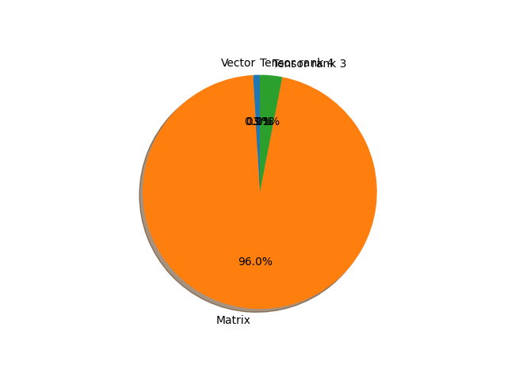

# efficientnet_b2 parameter information

**Number of layers: [ 301 ]**

**Number of parameters: [ 9.11M ]**

**Proportional of each form** (%)

| Vector | Matrix | Tensor rank 3 | Tensor rank 4 | 
|  --- | --- | --- | --- |
| 61.46 | 30.56 | 7.64 | 0.33 | 

**Proportional of parameters by form** (%)

| Vector | Matrix | Tensor rank 3 | Tensor rank 4 | 
|  --- | --- | --- | --- |
| 0.92 | 96.01 | 3.06 | 0.01 | 

**Layer information**

| Name | Shape | Squeezed shape | Number of parameters | Form |
| --- | --- | --- | --- | --- |
| features.0.0.weight | (32, 3, 3, 3) | (32, 3, 3, 3) | 864 | Tensor rank 4 |
| features.0.1.weight | (32,) | (32,) | 32 | Vector |
| features.0.1.bias | (32,) | (32,) | 32 | Vector |
| features.1.0.block.0.0.weight | (32, 1, 3, 3) | (32, 3, 3) | 288 | Tensor rank 3 |
| features.1.0.block.0.1.weight | (32,) | (32,) | 32 | Vector |
| features.1.0.block.0.1.bias | (32,) | (32,) | 32 | Vector |
| features.1.0.block.1.fc1.weight | (8, 32, 1, 1) | (8, 32) | 256 | Matrix |
| features.1.0.block.1.fc1.bias | (8,) | (8,) | 8 | Vector |
| features.1.0.block.1.fc2.weight | (32, 8, 1, 1) | (32, 8) | 256 | Matrix |
| features.1.0.block.1.fc2.bias | (32,) | (32,) | 32 | Vector |
| features.1.0.block.2.0.weight | (16, 32, 1, 1) | (16, 32) | 512 | Matrix |
| features.1.0.block.2.1.weight | (16,) | (16,) | 16 | Vector |
| features.1.0.block.2.1.bias | (16,) | (16,) | 16 | Vector |
| features.1.1.block.0.0.weight | (16, 1, 3, 3) | (16, 3, 3) | 144 | Tensor rank 3 |
| features.1.1.block.0.1.weight | (16,) | (16,) | 16 | Vector |
| features.1.1.block.0.1.bias | (16,) | (16,) | 16 | Vector |
| features.1.1.block.1.fc1.weight | (4, 16, 1, 1) | (4, 16) | 64 | Matrix |
| features.1.1.block.1.fc1.bias | (4,) | (4,) | 4 | Vector |
| features.1.1.block.1.fc2.weight | (16, 4, 1, 1) | (16, 4) | 64 | Matrix |
| features.1.1.block.1.fc2.bias | (16,) | (16,) | 16 | Vector |
| features.1.1.block.2.0.weight | (16, 16, 1, 1) | (16, 16) | 256 | Matrix |
| features.1.1.block.2.1.weight | (16,) | (16,) | 16 | Vector |
| features.1.1.block.2.1.bias | (16,) | (16,) | 16 | Vector |
| features.2.0.block.0.0.weight | (96, 16, 1, 1) | (96, 16) | 1536 | Matrix |
| features.2.0.block.0.1.weight | (96,) | (96,) | 96 | Vector |
| features.2.0.block.0.1.bias | (96,) | (96,) | 96 | Vector |
| features.2.0.block.1.0.weight | (96, 1, 3, 3) | (96, 3, 3) | 864 | Tensor rank 3 |
| features.2.0.block.1.1.weight | (96,) | (96,) | 96 | Vector |
| features.2.0.block.1.1.bias | (96,) | (96,) | 96 | Vector |
| features.2.0.block.2.fc1.weight | (4, 96, 1, 1) | (4, 96) | 384 | Matrix |
| features.2.0.block.2.fc1.bias | (4,) | (4,) | 4 | Vector |
| features.2.0.block.2.fc2.weight | (96, 4, 1, 1) | (96, 4) | 384 | Matrix |
| features.2.0.block.2.fc2.bias | (96,) | (96,) | 96 | Vector |
| features.2.0.block.3.0.weight | (24, 96, 1, 1) | (24, 96) | 2304 | Matrix |
| features.2.0.block.3.1.weight | (24,) | (24,) | 24 | Vector |
| features.2.0.block.3.1.bias | (24,) | (24,) | 24 | Vector |
| features.2.1.block.0.0.weight | (144, 24, 1, 1) | (144, 24) | 3456 | Matrix |
| features.2.1.block.0.1.weight | (144,) | (144,) | 144 | Vector |
| features.2.1.block.0.1.bias | (144,) | (144,) | 144 | Vector |
| features.2.1.block.1.0.weight | (144, 1, 3, 3) | (144, 3, 3) | 1296 | Tensor rank 3 |
| features.2.1.block.1.1.weight | (144,) | (144,) | 144 | Vector |
| features.2.1.block.1.1.bias | (144,) | (144,) | 144 | Vector |
| features.2.1.block.2.fc1.weight | (6, 144, 1, 1) | (6, 144) | 864 | Matrix |
| features.2.1.block.2.fc1.bias | (6,) | (6,) | 6 | Vector |
| features.2.1.block.2.fc2.weight | (144, 6, 1, 1) | (144, 6) | 864 | Matrix |
| features.2.1.block.2.fc2.bias | (144,) | (144,) | 144 | Vector |
| features.2.1.block.3.0.weight | (24, 144, 1, 1) | (24, 144) | 3456 | Matrix |
| features.2.1.block.3.1.weight | (24,) | (24,) | 24 | Vector |
| features.2.1.block.3.1.bias | (24,) | (24,) | 24 | Vector |
| features.2.2.block.0.0.weight | (144, 24, 1, 1) | (144, 24) | 3456 | Matrix |
| features.2.2.block.0.1.weight | (144,) | (144,) | 144 | Vector |
| features.2.2.block.0.1.bias | (144,) | (144,) | 144 | Vector |
| features.2.2.block.1.0.weight | (144, 1, 3, 3) | (144, 3, 3) | 1296 | Tensor rank 3 |
| features.2.2.block.1.1.weight | (144,) | (144,) | 144 | Vector |
| features.2.2.block.1.1.bias | (144,) | (144,) | 144 | Vector |
| features.2.2.block.2.fc1.weight | (6, 144, 1, 1) | (6, 144) | 864 | Matrix |
| features.2.2.block.2.fc1.bias | (6,) | (6,) | 6 | Vector |
| features.2.2.block.2.fc2.weight | (144, 6, 1, 1) | (144, 6) | 864 | Matrix |
| features.2.2.block.2.fc2.bias | (144,) | (144,) | 144 | Vector |
| features.2.2.block.3.0.weight | (24, 144, 1, 1) | (24, 144) | 3456 | Matrix |
| features.2.2.block.3.1.weight | (24,) | (24,) | 24 | Vector |
| features.2.2.block.3.1.bias | (24,) | (24,) | 24 | Vector |
| features.3.0.block.0.0.weight | (144, 24, 1, 1) | (144, 24) | 3456 | Matrix |
| features.3.0.block.0.1.weight | (144,) | (144,) | 144 | Vector |
| features.3.0.block.0.1.bias | (144,) | (144,) | 144 | Vector |
| features.3.0.block.1.0.weight | (144, 1, 5, 5) | (144, 5, 5) | 3600 | Tensor rank 3 |
| features.3.0.block.1.1.weight | (144,) | (144,) | 144 | Vector |
| features.3.0.block.1.1.bias | (144,) | (144,) | 144 | Vector |
| features.3.0.block.2.fc1.weight | (6, 144, 1, 1) | (6, 144) | 864 | Matrix |
| features.3.0.block.2.fc1.bias | (6,) | (6,) | 6 | Vector |
| features.3.0.block.2.fc2.weight | (144, 6, 1, 1) | (144, 6) | 864 | Matrix |
| features.3.0.block.2.fc2.bias | (144,) | (144,) | 144 | Vector |
| features.3.0.block.3.0.weight | (48, 144, 1, 1) | (48, 144) | 6912 | Matrix |
| features.3.0.block.3.1.weight | (48,) | (48,) | 48 | Vector |
| features.3.0.block.3.1.bias | (48,) | (48,) | 48 | Vector |
| features.3.1.block.0.0.weight | (288, 48, 1, 1) | (288, 48) | 13824 | Matrix |
| features.3.1.block.0.1.weight | (288,) | (288,) | 288 | Vector |
| features.3.1.block.0.1.bias | (288,) | (288,) | 288 | Vector |
| features.3.1.block.1.0.weight | (288, 1, 5, 5) | (288, 5, 5) | 7200 | Tensor rank 3 |
| features.3.1.block.1.1.weight | (288,) | (288,) | 288 | Vector |
| features.3.1.block.1.1.bias | (288,) | (288,) | 288 | Vector |
| features.3.1.block.2.fc1.weight | (12, 288, 1, 1) | (12, 288) | 3456 | Matrix |
| features.3.1.block.2.fc1.bias | (12,) | (12,) | 12 | Vector |
| features.3.1.block.2.fc2.weight | (288, 12, 1, 1) | (288, 12) | 3456 | Matrix |
| features.3.1.block.2.fc2.bias | (288,) | (288,) | 288 | Vector |
| features.3.1.block.3.0.weight | (48, 288, 1, 1) | (48, 288) | 13824 | Matrix |
| features.3.1.block.3.1.weight | (48,) | (48,) | 48 | Vector |
| features.3.1.block.3.1.bias | (48,) | (48,) | 48 | Vector |
| features.3.2.block.0.0.weight | (288, 48, 1, 1) | (288, 48) | 13824 | Matrix |
| features.3.2.block.0.1.weight | (288,) | (288,) | 288 | Vector |
| features.3.2.block.0.1.bias | (288,) | (288,) | 288 | Vector |
| features.3.2.block.1.0.weight | (288, 1, 5, 5) | (288, 5, 5) | 7200 | Tensor rank 3 |
| features.3.2.block.1.1.weight | (288,) | (288,) | 288 | Vector |
| features.3.2.block.1.1.bias | (288,) | (288,) | 288 | Vector |
| features.3.2.block.2.fc1.weight | (12, 288, 1, 1) | (12, 288) | 3456 | Matrix |
| features.3.2.block.2.fc1.bias | (12,) | (12,) | 12 | Vector |
| features.3.2.block.2.fc2.weight | (288, 12, 1, 1) | (288, 12) | 3456 | Matrix |
| features.3.2.block.2.fc2.bias | (288,) | (288,) | 288 | Vector |
| features.3.2.block.3.0.weight | (48, 288, 1, 1) | (48, 288) | 13824 | Matrix |
| features.3.2.block.3.1.weight | (48,) | (48,) | 48 | Vector |
| features.3.2.block.3.1.bias | (48,) | (48,) | 48 | Vector |
| features.4.0.block.0.0.weight | (288, 48, 1, 1) | (288, 48) | 13824 | Matrix |
| features.4.0.block.0.1.weight | (288,) | (288,) | 288 | Vector |
| features.4.0.block.0.1.bias | (288,) | (288,) | 288 | Vector |
| features.4.0.block.1.0.weight | (288, 1, 3, 3) | (288, 3, 3) | 2592 | Tensor rank 3 |
| features.4.0.block.1.1.weight | (288,) | (288,) | 288 | Vector |
| features.4.0.block.1.1.bias | (288,) | (288,) | 288 | Vector |
| features.4.0.block.2.fc1.weight | (12, 288, 1, 1) | (12, 288) | 3456 | Matrix |
| features.4.0.block.2.fc1.bias | (12,) | (12,) | 12 | Vector |
| features.4.0.block.2.fc2.weight | (288, 12, 1, 1) | (288, 12) | 3456 | Matrix |
| features.4.0.block.2.fc2.bias | (288,) | (288,) | 288 | Vector |
| features.4.0.block.3.0.weight | (88, 288, 1, 1) | (88, 288) | 25344 | Matrix |
| features.4.0.block.3.1.weight | (88,) | (88,) | 88 | Vector |
| features.4.0.block.3.1.bias | (88,) | (88,) | 88 | Vector |
| features.4.1.block.0.0.weight | (528, 88, 1, 1) | (528, 88) | 46464 | Matrix |
| features.4.1.block.0.1.weight | (528,) | (528,) | 528 | Vector |
| features.4.1.block.0.1.bias | (528,) | (528,) | 528 | Vector |
| features.4.1.block.1.0.weight | (528, 1, 3, 3) | (528, 3, 3) | 4752 | Tensor rank 3 |
| features.4.1.block.1.1.weight | (528,) | (528,) | 528 | Vector |
| features.4.1.block.1.1.bias | (528,) | (528,) | 528 | Vector |
| features.4.1.block.2.fc1.weight | (22, 528, 1, 1) | (22, 528) | 11616 | Matrix |
| features.4.1.block.2.fc1.bias | (22,) | (22,) | 22 | Vector |
| features.4.1.block.2.fc2.weight | (528, 22, 1, 1) | (528, 22) | 11616 | Matrix |
| features.4.1.block.2.fc2.bias | (528,) | (528,) | 528 | Vector |
| features.4.1.block.3.0.weight | (88, 528, 1, 1) | (88, 528) | 46464 | Matrix |
| features.4.1.block.3.1.weight | (88,) | (88,) | 88 | Vector |
| features.4.1.block.3.1.bias | (88,) | (88,) | 88 | Vector |
| features.4.2.block.0.0.weight | (528, 88, 1, 1) | (528, 88) | 46464 | Matrix |
| features.4.2.block.0.1.weight | (528,) | (528,) | 528 | Vector |
| features.4.2.block.0.1.bias | (528,) | (528,) | 528 | Vector |
| features.4.2.block.1.0.weight | (528, 1, 3, 3) | (528, 3, 3) | 4752 | Tensor rank 3 |
| features.4.2.block.1.1.weight | (528,) | (528,) | 528 | Vector |
| features.4.2.block.1.1.bias | (528,) | (528,) | 528 | Vector |
| features.4.2.block.2.fc1.weight | (22, 528, 1, 1) | (22, 528) | 11616 | Matrix |
| features.4.2.block.2.fc1.bias | (22,) | (22,) | 22 | Vector |
| features.4.2.block.2.fc2.weight | (528, 22, 1, 1) | (528, 22) | 11616 | Matrix |
| features.4.2.block.2.fc2.bias | (528,) | (528,) | 528 | Vector |
| features.4.2.block.3.0.weight | (88, 528, 1, 1) | (88, 528) | 46464 | Matrix |
| features.4.2.block.3.1.weight | (88,) | (88,) | 88 | Vector |
| features.4.2.block.3.1.bias | (88,) | (88,) | 88 | Vector |
| features.4.3.block.0.0.weight | (528, 88, 1, 1) | (528, 88) | 46464 | Matrix |
| features.4.3.block.0.1.weight | (528,) | (528,) | 528 | Vector |
| features.4.3.block.0.1.bias | (528,) | (528,) | 528 | Vector |
| features.4.3.block.1.0.weight | (528, 1, 3, 3) | (528, 3, 3) | 4752 | Tensor rank 3 |
| features.4.3.block.1.1.weight | (528,) | (528,) | 528 | Vector |
| features.4.3.block.1.1.bias | (528,) | (528,) | 528 | Vector |
| features.4.3.block.2.fc1.weight | (22, 528, 1, 1) | (22, 528) | 11616 | Matrix |
| features.4.3.block.2.fc1.bias | (22,) | (22,) | 22 | Vector |
| features.4.3.block.2.fc2.weight | (528, 22, 1, 1) | (528, 22) | 11616 | Matrix |
| features.4.3.block.2.fc2.bias | (528,) | (528,) | 528 | Vector |
| features.4.3.block.3.0.weight | (88, 528, 1, 1) | (88, 528) | 46464 | Matrix |
| features.4.3.block.3.1.weight | (88,) | (88,) | 88 | Vector |
| features.4.3.block.3.1.bias | (88,) | (88,) | 88 | Vector |
| features.5.0.block.0.0.weight | (528, 88, 1, 1) | (528, 88) | 46464 | Matrix |
| features.5.0.block.0.1.weight | (528,) | (528,) | 528 | Vector |
| features.5.0.block.0.1.bias | (528,) | (528,) | 528 | Vector |
| features.5.0.block.1.0.weight | (528, 1, 5, 5) | (528, 5, 5) | 13200 | Tensor rank 3 |
| features.5.0.block.1.1.weight | (528,) | (528,) | 528 | Vector |
| features.5.0.block.1.1.bias | (528,) | (528,) | 528 | Vector |
| features.5.0.block.2.fc1.weight | (22, 528, 1, 1) | (22, 528) | 11616 | Matrix |
| features.5.0.block.2.fc1.bias | (22,) | (22,) | 22 | Vector |
| features.5.0.block.2.fc2.weight | (528, 22, 1, 1) | (528, 22) | 11616 | Matrix |
| features.5.0.block.2.fc2.bias | (528,) | (528,) | 528 | Vector |
| features.5.0.block.3.0.weight | (120, 528, 1, 1) | (120, 528) | 63360 | Matrix |
| features.5.0.block.3.1.weight | (120,) | (120,) | 120 | Vector |
| features.5.0.block.3.1.bias | (120,) | (120,) | 120 | Vector |
| features.5.1.block.0.0.weight | (720, 120, 1, 1) | (720, 120) | 86400 | Matrix |
| features.5.1.block.0.1.weight | (720,) | (720,) | 720 | Vector |
| features.5.1.block.0.1.bias | (720,) | (720,) | 720 | Vector |
| features.5.1.block.1.0.weight | (720, 1, 5, 5) | (720, 5, 5) | 18000 | Tensor rank 3 |
| features.5.1.block.1.1.weight | (720,) | (720,) | 720 | Vector |
| features.5.1.block.1.1.bias | (720,) | (720,) | 720 | Vector |
| features.5.1.block.2.fc1.weight | (30, 720, 1, 1) | (30, 720) | 21600 | Matrix |
| features.5.1.block.2.fc1.bias | (30,) | (30,) | 30 | Vector |
| features.5.1.block.2.fc2.weight | (720, 30, 1, 1) | (720, 30) | 21600 | Matrix |
| features.5.1.block.2.fc2.bias | (720,) | (720,) | 720 | Vector |
| features.5.1.block.3.0.weight | (120, 720, 1, 1) | (120, 720) | 86400 | Matrix |
| features.5.1.block.3.1.weight | (120,) | (120,) | 120 | Vector |
| features.5.1.block.3.1.bias | (120,) | (120,) | 120 | Vector |
| features.5.2.block.0.0.weight | (720, 120, 1, 1) | (720, 120) | 86400 | Matrix |
| features.5.2.block.0.1.weight | (720,) | (720,) | 720 | Vector |
| features.5.2.block.0.1.bias | (720,) | (720,) | 720 | Vector |
| features.5.2.block.1.0.weight | (720, 1, 5, 5) | (720, 5, 5) | 18000 | Tensor rank 3 |
| features.5.2.block.1.1.weight | (720,) | (720,) | 720 | Vector |
| features.5.2.block.1.1.bias | (720,) | (720,) | 720 | Vector |
| features.5.2.block.2.fc1.weight | (30, 720, 1, 1) | (30, 720) | 21600 | Matrix |
| features.5.2.block.2.fc1.bias | (30,) | (30,) | 30 | Vector |
| features.5.2.block.2.fc2.weight | (720, 30, 1, 1) | (720, 30) | 21600 | Matrix |
| features.5.2.block.2.fc2.bias | (720,) | (720,) | 720 | Vector |
| features.5.2.block.3.0.weight | (120, 720, 1, 1) | (120, 720) | 86400 | Matrix |
| features.5.2.block.3.1.weight | (120,) | (120,) | 120 | Vector |
| features.5.2.block.3.1.bias | (120,) | (120,) | 120 | Vector |
| features.5.3.block.0.0.weight | (720, 120, 1, 1) | (720, 120) | 86400 | Matrix |
| features.5.3.block.0.1.weight | (720,) | (720,) | 720 | Vector |
| features.5.3.block.0.1.bias | (720,) | (720,) | 720 | Vector |
| features.5.3.block.1.0.weight | (720, 1, 5, 5) | (720, 5, 5) | 18000 | Tensor rank 3 |
| features.5.3.block.1.1.weight | (720,) | (720,) | 720 | Vector |
| features.5.3.block.1.1.bias | (720,) | (720,) | 720 | Vector |
| features.5.3.block.2.fc1.weight | (30, 720, 1, 1) | (30, 720) | 21600 | Matrix |
| features.5.3.block.2.fc1.bias | (30,) | (30,) | 30 | Vector |
| features.5.3.block.2.fc2.weight | (720, 30, 1, 1) | (720, 30) | 21600 | Matrix |
| features.5.3.block.2.fc2.bias | (720,) | (720,) | 720 | Vector |
| features.5.3.block.3.0.weight | (120, 720, 1, 1) | (120, 720) | 86400 | Matrix |
| features.5.3.block.3.1.weight | (120,) | (120,) | 120 | Vector |
| features.5.3.block.3.1.bias | (120,) | (120,) | 120 | Vector |
| features.6.0.block.0.0.weight | (720, 120, 1, 1) | (720, 120) | 86400 | Matrix |
| features.6.0.block.0.1.weight | (720,) | (720,) | 720 | Vector |
| features.6.0.block.0.1.bias | (720,) | (720,) | 720 | Vector |
| features.6.0.block.1.0.weight | (720, 1, 5, 5) | (720, 5, 5) | 18000 | Tensor rank 3 |
| features.6.0.block.1.1.weight | (720,) | (720,) | 720 | Vector |
| features.6.0.block.1.1.bias | (720,) | (720,) | 720 | Vector |
| features.6.0.block.2.fc1.weight | (30, 720, 1, 1) | (30, 720) | 21600 | Matrix |
| features.6.0.block.2.fc1.bias | (30,) | (30,) | 30 | Vector |
| features.6.0.block.2.fc2.weight | (720, 30, 1, 1) | (720, 30) | 21600 | Matrix |
| features.6.0.block.2.fc2.bias | (720,) | (720,) | 720 | Vector |
| features.6.0.block.3.0.weight | (208, 720, 1, 1) | (208, 720) | 149760 | Matrix |
| features.6.0.block.3.1.weight | (208,) | (208,) | 208 | Vector |
| features.6.0.block.3.1.bias | (208,) | (208,) | 208 | Vector |
| features.6.1.block.0.0.weight | (1248, 208, 1, 1) | (1248, 208) | 259584 | Matrix |
| features.6.1.block.0.1.weight | (1248,) | (1248,) | 1248 | Vector |
| features.6.1.block.0.1.bias | (1248,) | (1248,) | 1248 | Vector |
| features.6.1.block.1.0.weight | (1248, 1, 5, 5) | (1248, 5, 5) | 31200 | Tensor rank 3 |
| features.6.1.block.1.1.weight | (1248,) | (1248,) | 1248 | Vector |
| features.6.1.block.1.1.bias | (1248,) | (1248,) | 1248 | Vector |
| features.6.1.block.2.fc1.weight | (52, 1248, 1, 1) | (52, 1248) | 64896 | Matrix |
| features.6.1.block.2.fc1.bias | (52,) | (52,) | 52 | Vector |
| features.6.1.block.2.fc2.weight | (1248, 52, 1, 1) | (1248, 52) | 64896 | Matrix |
| features.6.1.block.2.fc2.bias | (1248,) | (1248,) | 1248 | Vector |
| features.6.1.block.3.0.weight | (208, 1248, 1, 1) | (208, 1248) | 259584 | Matrix |
| features.6.1.block.3.1.weight | (208,) | (208,) | 208 | Vector |
| features.6.1.block.3.1.bias | (208,) | (208,) | 208 | Vector |
| features.6.2.block.0.0.weight | (1248, 208, 1, 1) | (1248, 208) | 259584 | Matrix |
| features.6.2.block.0.1.weight | (1248,) | (1248,) | 1248 | Vector |
| features.6.2.block.0.1.bias | (1248,) | (1248,) | 1248 | Vector |
| features.6.2.block.1.0.weight | (1248, 1, 5, 5) | (1248, 5, 5) | 31200 | Tensor rank 3 |
| features.6.2.block.1.1.weight | (1248,) | (1248,) | 1248 | Vector |
| features.6.2.block.1.1.bias | (1248,) | (1248,) | 1248 | Vector |
| features.6.2.block.2.fc1.weight | (52, 1248, 1, 1) | (52, 1248) | 64896 | Matrix |
| features.6.2.block.2.fc1.bias | (52,) | (52,) | 52 | Vector |
| features.6.2.block.2.fc2.weight | (1248, 52, 1, 1) | (1248, 52) | 64896 | Matrix |
| features.6.2.block.2.fc2.bias | (1248,) | (1248,) | 1248 | Vector |
| features.6.2.block.3.0.weight | (208, 1248, 1, 1) | (208, 1248) | 259584 | Matrix |
| features.6.2.block.3.1.weight | (208,) | (208,) | 208 | Vector |
| features.6.2.block.3.1.bias | (208,) | (208,) | 208 | Vector |
| features.6.3.block.0.0.weight | (1248, 208, 1, 1) | (1248, 208) | 259584 | Matrix |
| features.6.3.block.0.1.weight | (1248,) | (1248,) | 1248 | Vector |
| features.6.3.block.0.1.bias | (1248,) | (1248,) | 1248 | Vector |
| features.6.3.block.1.0.weight | (1248, 1, 5, 5) | (1248, 5, 5) | 31200 | Tensor rank 3 |
| features.6.3.block.1.1.weight | (1248,) | (1248,) | 1248 | Vector |
| features.6.3.block.1.1.bias | (1248,) | (1248,) | 1248 | Vector |
| features.6.3.block.2.fc1.weight | (52, 1248, 1, 1) | (52, 1248) | 64896 | Matrix |
| features.6.3.block.2.fc1.bias | (52,) | (52,) | 52 | Vector |
| features.6.3.block.2.fc2.weight | (1248, 52, 1, 1) | (1248, 52) | 64896 | Matrix |
| features.6.3.block.2.fc2.bias | (1248,) | (1248,) | 1248 | Vector |
| features.6.3.block.3.0.weight | (208, 1248, 1, 1) | (208, 1248) | 259584 | Matrix |
| features.6.3.block.3.1.weight | (208,) | (208,) | 208 | Vector |
| features.6.3.block.3.1.bias | (208,) | (208,) | 208 | Vector |
| features.6.4.block.0.0.weight | (1248, 208, 1, 1) | (1248, 208) | 259584 | Matrix |
| features.6.4.block.0.1.weight | (1248,) | (1248,) | 1248 | Vector |
| features.6.4.block.0.1.bias | (1248,) | (1248,) | 1248 | Vector |
| features.6.4.block.1.0.weight | (1248, 1, 5, 5) | (1248, 5, 5) | 31200 | Tensor rank 3 |
| features.6.4.block.1.1.weight | (1248,) | (1248,) | 1248 | Vector |
| features.6.4.block.1.1.bias | (1248,) | (1248,) | 1248 | Vector |
| features.6.4.block.2.fc1.weight | (52, 1248, 1, 1) | (52, 1248) | 64896 | Matrix |
| features.6.4.block.2.fc1.bias | (52,) | (52,) | 52 | Vector |
| features.6.4.block.2.fc2.weight | (1248, 52, 1, 1) | (1248, 52) | 64896 | Matrix |
| features.6.4.block.2.fc2.bias | (1248,) | (1248,) | 1248 | Vector |
| features.6.4.block.3.0.weight | (208, 1248, 1, 1) | (208, 1248) | 259584 | Matrix |
| features.6.4.block.3.1.weight | (208,) | (208,) | 208 | Vector |
| features.6.4.block.3.1.bias | (208,) | (208,) | 208 | Vector |
| features.7.0.block.0.0.weight | (1248, 208, 1, 1) | (1248, 208) | 259584 | Matrix |
| features.7.0.block.0.1.weight | (1248,) | (1248,) | 1248 | Vector |
| features.7.0.block.0.1.bias | (1248,) | (1248,) | 1248 | Vector |
| features.7.0.block.1.0.weight | (1248, 1, 3, 3) | (1248, 3, 3) | 11232 | Tensor rank 3 |
| features.7.0.block.1.1.weight | (1248,) | (1248,) | 1248 | Vector |
| features.7.0.block.1.1.bias | (1248,) | (1248,) | 1248 | Vector |
| features.7.0.block.2.fc1.weight | (52, 1248, 1, 1) | (52, 1248) | 64896 | Matrix |
| features.7.0.block.2.fc1.bias | (52,) | (52,) | 52 | Vector |
| features.7.0.block.2.fc2.weight | (1248, 52, 1, 1) | (1248, 52) | 64896 | Matrix |
| features.7.0.block.2.fc2.bias | (1248,) | (1248,) | 1248 | Vector |
| features.7.0.block.3.0.weight | (352, 1248, 1, 1) | (352, 1248) | 439296 | Matrix |
| features.7.0.block.3.1.weight | (352,) | (352,) | 352 | Vector |
| features.7.0.block.3.1.bias | (352,) | (352,) | 352 | Vector |
| features.7.1.block.0.0.weight | (2112, 352, 1, 1) | (2112, 352) | 743424 | Matrix |
| features.7.1.block.0.1.weight | (2112,) | (2112,) | 2112 | Vector |
| features.7.1.block.0.1.bias | (2112,) | (2112,) | 2112 | Vector |
| features.7.1.block.1.0.weight | (2112, 1, 3, 3) | (2112, 3, 3) | 19008 | Tensor rank 3 |
| features.7.1.block.1.1.weight | (2112,) | (2112,) | 2112 | Vector |
| features.7.1.block.1.1.bias | (2112,) | (2112,) | 2112 | Vector |
| features.7.1.block.2.fc1.weight | (88, 2112, 1, 1) | (88, 2112) | 185856 | Matrix |
| features.7.1.block.2.fc1.bias | (88,) | (88,) | 88 | Vector |
| features.7.1.block.2.fc2.weight | (2112, 88, 1, 1) | (2112, 88) | 185856 | Matrix |
| features.7.1.block.2.fc2.bias | (2112,) | (2112,) | 2112 | Vector |
| features.7.1.block.3.0.weight | (352, 2112, 1, 1) | (352, 2112) | 743424 | Matrix |
| features.7.1.block.3.1.weight | (352,) | (352,) | 352 | Vector |
| features.7.1.block.3.1.bias | (352,) | (352,) | 352 | Vector |
| features.8.0.weight | (1408, 352, 1, 1) | (1408, 352) | 495616 | Matrix |
| features.8.1.weight | (1408,) | (1408,) | 1408 | Vector |
| features.8.1.bias | (1408,) | (1408,) | 1408 | Vector |
| classifier.1.weight | (1000, 1408) | (1000, 1408) | 1408000 | Matrix |
| classifier.1.bias | (1000,) | (1000,) | 1000 | Vector |

