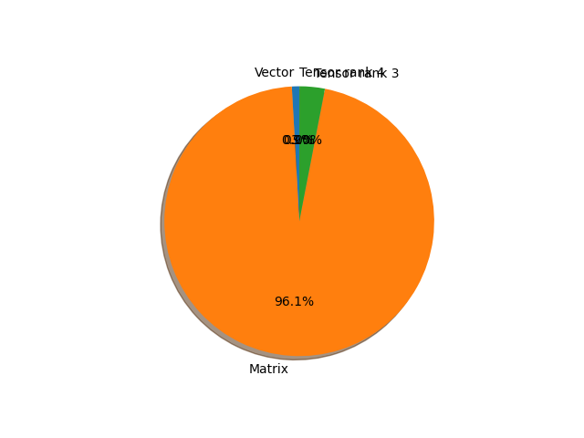

# efficientnet_b3 parameter information

**Number of layers: [ 340 ]**

**Number of parameters: [ 12.23M ]**

**Proportional of each form** (%)

| Vector | Matrix | Tensor rank 3 | Tensor rank 4 | 
|  --- | --- | --- | --- |
| 61.47 | 30.59 | 7.65 | 0.29 | 

**Proportional of parameters by form** (%)

| Vector | Matrix | Tensor rank 3 | Tensor rank 4 | 
|  --- | --- | --- | --- |
| 0.89 | 96.07 | 3.04 | 0.01 | 

**Layer information**

| Name | Shape | Squeezed shape | Number of parameters | Form |
| --- | --- | --- | --- | --- |
| features.0.0.weight | (40, 3, 3, 3) | (40, 3, 3, 3) | 1080 | Tensor rank 4 |
| features.0.1.weight | (40,) | (40,) | 40 | Vector |
| features.0.1.bias | (40,) | (40,) | 40 | Vector |
| features.1.0.block.0.0.weight | (40, 1, 3, 3) | (40, 3, 3) | 360 | Tensor rank 3 |
| features.1.0.block.0.1.weight | (40,) | (40,) | 40 | Vector |
| features.1.0.block.0.1.bias | (40,) | (40,) | 40 | Vector |
| features.1.0.block.1.fc1.weight | (10, 40, 1, 1) | (10, 40) | 400 | Matrix |
| features.1.0.block.1.fc1.bias | (10,) | (10,) | 10 | Vector |
| features.1.0.block.1.fc2.weight | (40, 10, 1, 1) | (40, 10) | 400 | Matrix |
| features.1.0.block.1.fc2.bias | (40,) | (40,) | 40 | Vector |
| features.1.0.block.2.0.weight | (24, 40, 1, 1) | (24, 40) | 960 | Matrix |
| features.1.0.block.2.1.weight | (24,) | (24,) | 24 | Vector |
| features.1.0.block.2.1.bias | (24,) | (24,) | 24 | Vector |
| features.1.1.block.0.0.weight | (24, 1, 3, 3) | (24, 3, 3) | 216 | Tensor rank 3 |
| features.1.1.block.0.1.weight | (24,) | (24,) | 24 | Vector |
| features.1.1.block.0.1.bias | (24,) | (24,) | 24 | Vector |
| features.1.1.block.1.fc1.weight | (6, 24, 1, 1) | (6, 24) | 144 | Matrix |
| features.1.1.block.1.fc1.bias | (6,) | (6,) | 6 | Vector |
| features.1.1.block.1.fc2.weight | (24, 6, 1, 1) | (24, 6) | 144 | Matrix |
| features.1.1.block.1.fc2.bias | (24,) | (24,) | 24 | Vector |
| features.1.1.block.2.0.weight | (24, 24, 1, 1) | (24, 24) | 576 | Matrix |
| features.1.1.block.2.1.weight | (24,) | (24,) | 24 | Vector |
| features.1.1.block.2.1.bias | (24,) | (24,) | 24 | Vector |
| features.2.0.block.0.0.weight | (144, 24, 1, 1) | (144, 24) | 3456 | Matrix |
| features.2.0.block.0.1.weight | (144,) | (144,) | 144 | Vector |
| features.2.0.block.0.1.bias | (144,) | (144,) | 144 | Vector |
| features.2.0.block.1.0.weight | (144, 1, 3, 3) | (144, 3, 3) | 1296 | Tensor rank 3 |
| features.2.0.block.1.1.weight | (144,) | (144,) | 144 | Vector |
| features.2.0.block.1.1.bias | (144,) | (144,) | 144 | Vector |
| features.2.0.block.2.fc1.weight | (6, 144, 1, 1) | (6, 144) | 864 | Matrix |
| features.2.0.block.2.fc1.bias | (6,) | (6,) | 6 | Vector |
| features.2.0.block.2.fc2.weight | (144, 6, 1, 1) | (144, 6) | 864 | Matrix |
| features.2.0.block.2.fc2.bias | (144,) | (144,) | 144 | Vector |
| features.2.0.block.3.0.weight | (32, 144, 1, 1) | (32, 144) | 4608 | Matrix |
| features.2.0.block.3.1.weight | (32,) | (32,) | 32 | Vector |
| features.2.0.block.3.1.bias | (32,) | (32,) | 32 | Vector |
| features.2.1.block.0.0.weight | (192, 32, 1, 1) | (192, 32) | 6144 | Matrix |
| features.2.1.block.0.1.weight | (192,) | (192,) | 192 | Vector |
| features.2.1.block.0.1.bias | (192,) | (192,) | 192 | Vector |
| features.2.1.block.1.0.weight | (192, 1, 3, 3) | (192, 3, 3) | 1728 | Tensor rank 3 |
| features.2.1.block.1.1.weight | (192,) | (192,) | 192 | Vector |
| features.2.1.block.1.1.bias | (192,) | (192,) | 192 | Vector |
| features.2.1.block.2.fc1.weight | (8, 192, 1, 1) | (8, 192) | 1536 | Matrix |
| features.2.1.block.2.fc1.bias | (8,) | (8,) | 8 | Vector |
| features.2.1.block.2.fc2.weight | (192, 8, 1, 1) | (192, 8) | 1536 | Matrix |
| features.2.1.block.2.fc2.bias | (192,) | (192,) | 192 | Vector |
| features.2.1.block.3.0.weight | (32, 192, 1, 1) | (32, 192) | 6144 | Matrix |
| features.2.1.block.3.1.weight | (32,) | (32,) | 32 | Vector |
| features.2.1.block.3.1.bias | (32,) | (32,) | 32 | Vector |
| features.2.2.block.0.0.weight | (192, 32, 1, 1) | (192, 32) | 6144 | Matrix |
| features.2.2.block.0.1.weight | (192,) | (192,) | 192 | Vector |
| features.2.2.block.0.1.bias | (192,) | (192,) | 192 | Vector |
| features.2.2.block.1.0.weight | (192, 1, 3, 3) | (192, 3, 3) | 1728 | Tensor rank 3 |
| features.2.2.block.1.1.weight | (192,) | (192,) | 192 | Vector |
| features.2.2.block.1.1.bias | (192,) | (192,) | 192 | Vector |
| features.2.2.block.2.fc1.weight | (8, 192, 1, 1) | (8, 192) | 1536 | Matrix |
| features.2.2.block.2.fc1.bias | (8,) | (8,) | 8 | Vector |
| features.2.2.block.2.fc2.weight | (192, 8, 1, 1) | (192, 8) | 1536 | Matrix |
| features.2.2.block.2.fc2.bias | (192,) | (192,) | 192 | Vector |
| features.2.2.block.3.0.weight | (32, 192, 1, 1) | (32, 192) | 6144 | Matrix |
| features.2.2.block.3.1.weight | (32,) | (32,) | 32 | Vector |
| features.2.2.block.3.1.bias | (32,) | (32,) | 32 | Vector |
| features.3.0.block.0.0.weight | (192, 32, 1, 1) | (192, 32) | 6144 | Matrix |
| features.3.0.block.0.1.weight | (192,) | (192,) | 192 | Vector |
| features.3.0.block.0.1.bias | (192,) | (192,) | 192 | Vector |
| features.3.0.block.1.0.weight | (192, 1, 5, 5) | (192, 5, 5) | 4800 | Tensor rank 3 |
| features.3.0.block.1.1.weight | (192,) | (192,) | 192 | Vector |
| features.3.0.block.1.1.bias | (192,) | (192,) | 192 | Vector |
| features.3.0.block.2.fc1.weight | (8, 192, 1, 1) | (8, 192) | 1536 | Matrix |
| features.3.0.block.2.fc1.bias | (8,) | (8,) | 8 | Vector |
| features.3.0.block.2.fc2.weight | (192, 8, 1, 1) | (192, 8) | 1536 | Matrix |
| features.3.0.block.2.fc2.bias | (192,) | (192,) | 192 | Vector |
| features.3.0.block.3.0.weight | (48, 192, 1, 1) | (48, 192) | 9216 | Matrix |
| features.3.0.block.3.1.weight | (48,) | (48,) | 48 | Vector |
| features.3.0.block.3.1.bias | (48,) | (48,) | 48 | Vector |
| features.3.1.block.0.0.weight | (288, 48, 1, 1) | (288, 48) | 13824 | Matrix |
| features.3.1.block.0.1.weight | (288,) | (288,) | 288 | Vector |
| features.3.1.block.0.1.bias | (288,) | (288,) | 288 | Vector |
| features.3.1.block.1.0.weight | (288, 1, 5, 5) | (288, 5, 5) | 7200 | Tensor rank 3 |
| features.3.1.block.1.1.weight | (288,) | (288,) | 288 | Vector |
| features.3.1.block.1.1.bias | (288,) | (288,) | 288 | Vector |
| features.3.1.block.2.fc1.weight | (12, 288, 1, 1) | (12, 288) | 3456 | Matrix |
| features.3.1.block.2.fc1.bias | (12,) | (12,) | 12 | Vector |
| features.3.1.block.2.fc2.weight | (288, 12, 1, 1) | (288, 12) | 3456 | Matrix |
| features.3.1.block.2.fc2.bias | (288,) | (288,) | 288 | Vector |
| features.3.1.block.3.0.weight | (48, 288, 1, 1) | (48, 288) | 13824 | Matrix |
| features.3.1.block.3.1.weight | (48,) | (48,) | 48 | Vector |
| features.3.1.block.3.1.bias | (48,) | (48,) | 48 | Vector |
| features.3.2.block.0.0.weight | (288, 48, 1, 1) | (288, 48) | 13824 | Matrix |
| features.3.2.block.0.1.weight | (288,) | (288,) | 288 | Vector |
| features.3.2.block.0.1.bias | (288,) | (288,) | 288 | Vector |
| features.3.2.block.1.0.weight | (288, 1, 5, 5) | (288, 5, 5) | 7200 | Tensor rank 3 |
| features.3.2.block.1.1.weight | (288,) | (288,) | 288 | Vector |
| features.3.2.block.1.1.bias | (288,) | (288,) | 288 | Vector |
| features.3.2.block.2.fc1.weight | (12, 288, 1, 1) | (12, 288) | 3456 | Matrix |
| features.3.2.block.2.fc1.bias | (12,) | (12,) | 12 | Vector |
| features.3.2.block.2.fc2.weight | (288, 12, 1, 1) | (288, 12) | 3456 | Matrix |
| features.3.2.block.2.fc2.bias | (288,) | (288,) | 288 | Vector |
| features.3.2.block.3.0.weight | (48, 288, 1, 1) | (48, 288) | 13824 | Matrix |
| features.3.2.block.3.1.weight | (48,) | (48,) | 48 | Vector |
| features.3.2.block.3.1.bias | (48,) | (48,) | 48 | Vector |
| features.4.0.block.0.0.weight | (288, 48, 1, 1) | (288, 48) | 13824 | Matrix |
| features.4.0.block.0.1.weight | (288,) | (288,) | 288 | Vector |
| features.4.0.block.0.1.bias | (288,) | (288,) | 288 | Vector |
| features.4.0.block.1.0.weight | (288, 1, 3, 3) | (288, 3, 3) | 2592 | Tensor rank 3 |
| features.4.0.block.1.1.weight | (288,) | (288,) | 288 | Vector |
| features.4.0.block.1.1.bias | (288,) | (288,) | 288 | Vector |
| features.4.0.block.2.fc1.weight | (12, 288, 1, 1) | (12, 288) | 3456 | Matrix |
| features.4.0.block.2.fc1.bias | (12,) | (12,) | 12 | Vector |
| features.4.0.block.2.fc2.weight | (288, 12, 1, 1) | (288, 12) | 3456 | Matrix |
| features.4.0.block.2.fc2.bias | (288,) | (288,) | 288 | Vector |
| features.4.0.block.3.0.weight | (96, 288, 1, 1) | (96, 288) | 27648 | Matrix |
| features.4.0.block.3.1.weight | (96,) | (96,) | 96 | Vector |
| features.4.0.block.3.1.bias | (96,) | (96,) | 96 | Vector |
| features.4.1.block.0.0.weight | (576, 96, 1, 1) | (576, 96) | 55296 | Matrix |
| features.4.1.block.0.1.weight | (576,) | (576,) | 576 | Vector |
| features.4.1.block.0.1.bias | (576,) | (576,) | 576 | Vector |
| features.4.1.block.1.0.weight | (576, 1, 3, 3) | (576, 3, 3) | 5184 | Tensor rank 3 |
| features.4.1.block.1.1.weight | (576,) | (576,) | 576 | Vector |
| features.4.1.block.1.1.bias | (576,) | (576,) | 576 | Vector |
| features.4.1.block.2.fc1.weight | (24, 576, 1, 1) | (24, 576) | 13824 | Matrix |
| features.4.1.block.2.fc1.bias | (24,) | (24,) | 24 | Vector |
| features.4.1.block.2.fc2.weight | (576, 24, 1, 1) | (576, 24) | 13824 | Matrix |
| features.4.1.block.2.fc2.bias | (576,) | (576,) | 576 | Vector |
| features.4.1.block.3.0.weight | (96, 576, 1, 1) | (96, 576) | 55296 | Matrix |
| features.4.1.block.3.1.weight | (96,) | (96,) | 96 | Vector |
| features.4.1.block.3.1.bias | (96,) | (96,) | 96 | Vector |
| features.4.2.block.0.0.weight | (576, 96, 1, 1) | (576, 96) | 55296 | Matrix |
| features.4.2.block.0.1.weight | (576,) | (576,) | 576 | Vector |
| features.4.2.block.0.1.bias | (576,) | (576,) | 576 | Vector |
| features.4.2.block.1.0.weight | (576, 1, 3, 3) | (576, 3, 3) | 5184 | Tensor rank 3 |
| features.4.2.block.1.1.weight | (576,) | (576,) | 576 | Vector |
| features.4.2.block.1.1.bias | (576,) | (576,) | 576 | Vector |
| features.4.2.block.2.fc1.weight | (24, 576, 1, 1) | (24, 576) | 13824 | Matrix |
| features.4.2.block.2.fc1.bias | (24,) | (24,) | 24 | Vector |
| features.4.2.block.2.fc2.weight | (576, 24, 1, 1) | (576, 24) | 13824 | Matrix |
| features.4.2.block.2.fc2.bias | (576,) | (576,) | 576 | Vector |
| features.4.2.block.3.0.weight | (96, 576, 1, 1) | (96, 576) | 55296 | Matrix |
| features.4.2.block.3.1.weight | (96,) | (96,) | 96 | Vector |
| features.4.2.block.3.1.bias | (96,) | (96,) | 96 | Vector |
| features.4.3.block.0.0.weight | (576, 96, 1, 1) | (576, 96) | 55296 | Matrix |
| features.4.3.block.0.1.weight | (576,) | (576,) | 576 | Vector |
| features.4.3.block.0.1.bias | (576,) | (576,) | 576 | Vector |
| features.4.3.block.1.0.weight | (576, 1, 3, 3) | (576, 3, 3) | 5184 | Tensor rank 3 |
| features.4.3.block.1.1.weight | (576,) | (576,) | 576 | Vector |
| features.4.3.block.1.1.bias | (576,) | (576,) | 576 | Vector |
| features.4.3.block.2.fc1.weight | (24, 576, 1, 1) | (24, 576) | 13824 | Matrix |
| features.4.3.block.2.fc1.bias | (24,) | (24,) | 24 | Vector |
| features.4.3.block.2.fc2.weight | (576, 24, 1, 1) | (576, 24) | 13824 | Matrix |
| features.4.3.block.2.fc2.bias | (576,) | (576,) | 576 | Vector |
| features.4.3.block.3.0.weight | (96, 576, 1, 1) | (96, 576) | 55296 | Matrix |
| features.4.3.block.3.1.weight | (96,) | (96,) | 96 | Vector |
| features.4.3.block.3.1.bias | (96,) | (96,) | 96 | Vector |
| features.4.4.block.0.0.weight | (576, 96, 1, 1) | (576, 96) | 55296 | Matrix |
| features.4.4.block.0.1.weight | (576,) | (576,) | 576 | Vector |
| features.4.4.block.0.1.bias | (576,) | (576,) | 576 | Vector |
| features.4.4.block.1.0.weight | (576, 1, 3, 3) | (576, 3, 3) | 5184 | Tensor rank 3 |
| features.4.4.block.1.1.weight | (576,) | (576,) | 576 | Vector |
| features.4.4.block.1.1.bias | (576,) | (576,) | 576 | Vector |
| features.4.4.block.2.fc1.weight | (24, 576, 1, 1) | (24, 576) | 13824 | Matrix |
| features.4.4.block.2.fc1.bias | (24,) | (24,) | 24 | Vector |
| features.4.4.block.2.fc2.weight | (576, 24, 1, 1) | (576, 24) | 13824 | Matrix |
| features.4.4.block.2.fc2.bias | (576,) | (576,) | 576 | Vector |
| features.4.4.block.3.0.weight | (96, 576, 1, 1) | (96, 576) | 55296 | Matrix |
| features.4.4.block.3.1.weight | (96,) | (96,) | 96 | Vector |
| features.4.4.block.3.1.bias | (96,) | (96,) | 96 | Vector |
| features.5.0.block.0.0.weight | (576, 96, 1, 1) | (576, 96) | 55296 | Matrix |
| features.5.0.block.0.1.weight | (576,) | (576,) | 576 | Vector |
| features.5.0.block.0.1.bias | (576,) | (576,) | 576 | Vector |
| features.5.0.block.1.0.weight | (576, 1, 5, 5) | (576, 5, 5) | 14400 | Tensor rank 3 |
| features.5.0.block.1.1.weight | (576,) | (576,) | 576 | Vector |
| features.5.0.block.1.1.bias | (576,) | (576,) | 576 | Vector |
| features.5.0.block.2.fc1.weight | (24, 576, 1, 1) | (24, 576) | 13824 | Matrix |
| features.5.0.block.2.fc1.bias | (24,) | (24,) | 24 | Vector |
| features.5.0.block.2.fc2.weight | (576, 24, 1, 1) | (576, 24) | 13824 | Matrix |
| features.5.0.block.2.fc2.bias | (576,) | (576,) | 576 | Vector |
| features.5.0.block.3.0.weight | (136, 576, 1, 1) | (136, 576) | 78336 | Matrix |
| features.5.0.block.3.1.weight | (136,) | (136,) | 136 | Vector |
| features.5.0.block.3.1.bias | (136,) | (136,) | 136 | Vector |
| features.5.1.block.0.0.weight | (816, 136, 1, 1) | (816, 136) | 110976 | Matrix |
| features.5.1.block.0.1.weight | (816,) | (816,) | 816 | Vector |
| features.5.1.block.0.1.bias | (816,) | (816,) | 816 | Vector |
| features.5.1.block.1.0.weight | (816, 1, 5, 5) | (816, 5, 5) | 20400 | Tensor rank 3 |
| features.5.1.block.1.1.weight | (816,) | (816,) | 816 | Vector |
| features.5.1.block.1.1.bias | (816,) | (816,) | 816 | Vector |
| features.5.1.block.2.fc1.weight | (34, 816, 1, 1) | (34, 816) | 27744 | Matrix |
| features.5.1.block.2.fc1.bias | (34,) | (34,) | 34 | Vector |
| features.5.1.block.2.fc2.weight | (816, 34, 1, 1) | (816, 34) | 27744 | Matrix |
| features.5.1.block.2.fc2.bias | (816,) | (816,) | 816 | Vector |
| features.5.1.block.3.0.weight | (136, 816, 1, 1) | (136, 816) | 110976 | Matrix |
| features.5.1.block.3.1.weight | (136,) | (136,) | 136 | Vector |
| features.5.1.block.3.1.bias | (136,) | (136,) | 136 | Vector |
| features.5.2.block.0.0.weight | (816, 136, 1, 1) | (816, 136) | 110976 | Matrix |
| features.5.2.block.0.1.weight | (816,) | (816,) | 816 | Vector |
| features.5.2.block.0.1.bias | (816,) | (816,) | 816 | Vector |
| features.5.2.block.1.0.weight | (816, 1, 5, 5) | (816, 5, 5) | 20400 | Tensor rank 3 |
| features.5.2.block.1.1.weight | (816,) | (816,) | 816 | Vector |
| features.5.2.block.1.1.bias | (816,) | (816,) | 816 | Vector |
| features.5.2.block.2.fc1.weight | (34, 816, 1, 1) | (34, 816) | 27744 | Matrix |
| features.5.2.block.2.fc1.bias | (34,) | (34,) | 34 | Vector |
| features.5.2.block.2.fc2.weight | (816, 34, 1, 1) | (816, 34) | 27744 | Matrix |
| features.5.2.block.2.fc2.bias | (816,) | (816,) | 816 | Vector |
| features.5.2.block.3.0.weight | (136, 816, 1, 1) | (136, 816) | 110976 | Matrix |
| features.5.2.block.3.1.weight | (136,) | (136,) | 136 | Vector |
| features.5.2.block.3.1.bias | (136,) | (136,) | 136 | Vector |
| features.5.3.block.0.0.weight | (816, 136, 1, 1) | (816, 136) | 110976 | Matrix |
| features.5.3.block.0.1.weight | (816,) | (816,) | 816 | Vector |
| features.5.3.block.0.1.bias | (816,) | (816,) | 816 | Vector |
| features.5.3.block.1.0.weight | (816, 1, 5, 5) | (816, 5, 5) | 20400 | Tensor rank 3 |
| features.5.3.block.1.1.weight | (816,) | (816,) | 816 | Vector |
| features.5.3.block.1.1.bias | (816,) | (816,) | 816 | Vector |
| features.5.3.block.2.fc1.weight | (34, 816, 1, 1) | (34, 816) | 27744 | Matrix |
| features.5.3.block.2.fc1.bias | (34,) | (34,) | 34 | Vector |
| features.5.3.block.2.fc2.weight | (816, 34, 1, 1) | (816, 34) | 27744 | Matrix |
| features.5.3.block.2.fc2.bias | (816,) | (816,) | 816 | Vector |
| features.5.3.block.3.0.weight | (136, 816, 1, 1) | (136, 816) | 110976 | Matrix |
| features.5.3.block.3.1.weight | (136,) | (136,) | 136 | Vector |
| features.5.3.block.3.1.bias | (136,) | (136,) | 136 | Vector |
| features.5.4.block.0.0.weight | (816, 136, 1, 1) | (816, 136) | 110976 | Matrix |
| features.5.4.block.0.1.weight | (816,) | (816,) | 816 | Vector |
| features.5.4.block.0.1.bias | (816,) | (816,) | 816 | Vector |
| features.5.4.block.1.0.weight | (816, 1, 5, 5) | (816, 5, 5) | 20400 | Tensor rank 3 |
| features.5.4.block.1.1.weight | (816,) | (816,) | 816 | Vector |
| features.5.4.block.1.1.bias | (816,) | (816,) | 816 | Vector |
| features.5.4.block.2.fc1.weight | (34, 816, 1, 1) | (34, 816) | 27744 | Matrix |
| features.5.4.block.2.fc1.bias | (34,) | (34,) | 34 | Vector |
| features.5.4.block.2.fc2.weight | (816, 34, 1, 1) | (816, 34) | 27744 | Matrix |
| features.5.4.block.2.fc2.bias | (816,) | (816,) | 816 | Vector |
| features.5.4.block.3.0.weight | (136, 816, 1, 1) | (136, 816) | 110976 | Matrix |
| features.5.4.block.3.1.weight | (136,) | (136,) | 136 | Vector |
| features.5.4.block.3.1.bias | (136,) | (136,) | 136 | Vector |
| features.6.0.block.0.0.weight | (816, 136, 1, 1) | (816, 136) | 110976 | Matrix |
| features.6.0.block.0.1.weight | (816,) | (816,) | 816 | Vector |
| features.6.0.block.0.1.bias | (816,) | (816,) | 816 | Vector |
| features.6.0.block.1.0.weight | (816, 1, 5, 5) | (816, 5, 5) | 20400 | Tensor rank 3 |
| features.6.0.block.1.1.weight | (816,) | (816,) | 816 | Vector |
| features.6.0.block.1.1.bias | (816,) | (816,) | 816 | Vector |
| features.6.0.block.2.fc1.weight | (34, 816, 1, 1) | (34, 816) | 27744 | Matrix |
| features.6.0.block.2.fc1.bias | (34,) | (34,) | 34 | Vector |
| features.6.0.block.2.fc2.weight | (816, 34, 1, 1) | (816, 34) | 27744 | Matrix |
| features.6.0.block.2.fc2.bias | (816,) | (816,) | 816 | Vector |
| features.6.0.block.3.0.weight | (232, 816, 1, 1) | (232, 816) | 189312 | Matrix |
| features.6.0.block.3.1.weight | (232,) | (232,) | 232 | Vector |
| features.6.0.block.3.1.bias | (232,) | (232,) | 232 | Vector |
| features.6.1.block.0.0.weight | (1392, 232, 1, 1) | (1392, 232) | 322944 | Matrix |
| features.6.1.block.0.1.weight | (1392,) | (1392,) | 1392 | Vector |
| features.6.1.block.0.1.bias | (1392,) | (1392,) | 1392 | Vector |
| features.6.1.block.1.0.weight | (1392, 1, 5, 5) | (1392, 5, 5) | 34800 | Tensor rank 3 |
| features.6.1.block.1.1.weight | (1392,) | (1392,) | 1392 | Vector |
| features.6.1.block.1.1.bias | (1392,) | (1392,) | 1392 | Vector |
| features.6.1.block.2.fc1.weight | (58, 1392, 1, 1) | (58, 1392) | 80736 | Matrix |
| features.6.1.block.2.fc1.bias | (58,) | (58,) | 58 | Vector |
| features.6.1.block.2.fc2.weight | (1392, 58, 1, 1) | (1392, 58) | 80736 | Matrix |
| features.6.1.block.2.fc2.bias | (1392,) | (1392,) | 1392 | Vector |
| features.6.1.block.3.0.weight | (232, 1392, 1, 1) | (232, 1392) | 322944 | Matrix |
| features.6.1.block.3.1.weight | (232,) | (232,) | 232 | Vector |
| features.6.1.block.3.1.bias | (232,) | (232,) | 232 | Vector |
| features.6.2.block.0.0.weight | (1392, 232, 1, 1) | (1392, 232) | 322944 | Matrix |
| features.6.2.block.0.1.weight | (1392,) | (1392,) | 1392 | Vector |
| features.6.2.block.0.1.bias | (1392,) | (1392,) | 1392 | Vector |
| features.6.2.block.1.0.weight | (1392, 1, 5, 5) | (1392, 5, 5) | 34800 | Tensor rank 3 |
| features.6.2.block.1.1.weight | (1392,) | (1392,) | 1392 | Vector |
| features.6.2.block.1.1.bias | (1392,) | (1392,) | 1392 | Vector |
| features.6.2.block.2.fc1.weight | (58, 1392, 1, 1) | (58, 1392) | 80736 | Matrix |
| features.6.2.block.2.fc1.bias | (58,) | (58,) | 58 | Vector |
| features.6.2.block.2.fc2.weight | (1392, 58, 1, 1) | (1392, 58) | 80736 | Matrix |
| features.6.2.block.2.fc2.bias | (1392,) | (1392,) | 1392 | Vector |
| features.6.2.block.3.0.weight | (232, 1392, 1, 1) | (232, 1392) | 322944 | Matrix |
| features.6.2.block.3.1.weight | (232,) | (232,) | 232 | Vector |
| features.6.2.block.3.1.bias | (232,) | (232,) | 232 | Vector |
| features.6.3.block.0.0.weight | (1392, 232, 1, 1) | (1392, 232) | 322944 | Matrix |
| features.6.3.block.0.1.weight | (1392,) | (1392,) | 1392 | Vector |
| features.6.3.block.0.1.bias | (1392,) | (1392,) | 1392 | Vector |
| features.6.3.block.1.0.weight | (1392, 1, 5, 5) | (1392, 5, 5) | 34800 | Tensor rank 3 |
| features.6.3.block.1.1.weight | (1392,) | (1392,) | 1392 | Vector |
| features.6.3.block.1.1.bias | (1392,) | (1392,) | 1392 | Vector |
| features.6.3.block.2.fc1.weight | (58, 1392, 1, 1) | (58, 1392) | 80736 | Matrix |
| features.6.3.block.2.fc1.bias | (58,) | (58,) | 58 | Vector |
| features.6.3.block.2.fc2.weight | (1392, 58, 1, 1) | (1392, 58) | 80736 | Matrix |
| features.6.3.block.2.fc2.bias | (1392,) | (1392,) | 1392 | Vector |
| features.6.3.block.3.0.weight | (232, 1392, 1, 1) | (232, 1392) | 322944 | Matrix |
| features.6.3.block.3.1.weight | (232,) | (232,) | 232 | Vector |
| features.6.3.block.3.1.bias | (232,) | (232,) | 232 | Vector |
| features.6.4.block.0.0.weight | (1392, 232, 1, 1) | (1392, 232) | 322944 | Matrix |
| features.6.4.block.0.1.weight | (1392,) | (1392,) | 1392 | Vector |
| features.6.4.block.0.1.bias | (1392,) | (1392,) | 1392 | Vector |
| features.6.4.block.1.0.weight | (1392, 1, 5, 5) | (1392, 5, 5) | 34800 | Tensor rank 3 |
| features.6.4.block.1.1.weight | (1392,) | (1392,) | 1392 | Vector |
| features.6.4.block.1.1.bias | (1392,) | (1392,) | 1392 | Vector |
| features.6.4.block.2.fc1.weight | (58, 1392, 1, 1) | (58, 1392) | 80736 | Matrix |
| features.6.4.block.2.fc1.bias | (58,) | (58,) | 58 | Vector |
| features.6.4.block.2.fc2.weight | (1392, 58, 1, 1) | (1392, 58) | 80736 | Matrix |
| features.6.4.block.2.fc2.bias | (1392,) | (1392,) | 1392 | Vector |
| features.6.4.block.3.0.weight | (232, 1392, 1, 1) | (232, 1392) | 322944 | Matrix |
| features.6.4.block.3.1.weight | (232,) | (232,) | 232 | Vector |
| features.6.4.block.3.1.bias | (232,) | (232,) | 232 | Vector |
| features.6.5.block.0.0.weight | (1392, 232, 1, 1) | (1392, 232) | 322944 | Matrix |
| features.6.5.block.0.1.weight | (1392,) | (1392,) | 1392 | Vector |
| features.6.5.block.0.1.bias | (1392,) | (1392,) | 1392 | Vector |
| features.6.5.block.1.0.weight | (1392, 1, 5, 5) | (1392, 5, 5) | 34800 | Tensor rank 3 |
| features.6.5.block.1.1.weight | (1392,) | (1392,) | 1392 | Vector |
| features.6.5.block.1.1.bias | (1392,) | (1392,) | 1392 | Vector |
| features.6.5.block.2.fc1.weight | (58, 1392, 1, 1) | (58, 1392) | 80736 | Matrix |
| features.6.5.block.2.fc1.bias | (58,) | (58,) | 58 | Vector |
| features.6.5.block.2.fc2.weight | (1392, 58, 1, 1) | (1392, 58) | 80736 | Matrix |
| features.6.5.block.2.fc2.bias | (1392,) | (1392,) | 1392 | Vector |
| features.6.5.block.3.0.weight | (232, 1392, 1, 1) | (232, 1392) | 322944 | Matrix |
| features.6.5.block.3.1.weight | (232,) | (232,) | 232 | Vector |
| features.6.5.block.3.1.bias | (232,) | (232,) | 232 | Vector |
| features.7.0.block.0.0.weight | (1392, 232, 1, 1) | (1392, 232) | 322944 | Matrix |
| features.7.0.block.0.1.weight | (1392,) | (1392,) | 1392 | Vector |
| features.7.0.block.0.1.bias | (1392,) | (1392,) | 1392 | Vector |
| features.7.0.block.1.0.weight | (1392, 1, 3, 3) | (1392, 3, 3) | 12528 | Tensor rank 3 |
| features.7.0.block.1.1.weight | (1392,) | (1392,) | 1392 | Vector |
| features.7.0.block.1.1.bias | (1392,) | (1392,) | 1392 | Vector |
| features.7.0.block.2.fc1.weight | (58, 1392, 1, 1) | (58, 1392) | 80736 | Matrix |
| features.7.0.block.2.fc1.bias | (58,) | (58,) | 58 | Vector |
| features.7.0.block.2.fc2.weight | (1392, 58, 1, 1) | (1392, 58) | 80736 | Matrix |
| features.7.0.block.2.fc2.bias | (1392,) | (1392,) | 1392 | Vector |
| features.7.0.block.3.0.weight | (384, 1392, 1, 1) | (384, 1392) | 534528 | Matrix |
| features.7.0.block.3.1.weight | (384,) | (384,) | 384 | Vector |
| features.7.0.block.3.1.bias | (384,) | (384,) | 384 | Vector |
| features.7.1.block.0.0.weight | (2304, 384, 1, 1) | (2304, 384) | 884736 | Matrix |
| features.7.1.block.0.1.weight | (2304,) | (2304,) | 2304 | Vector |
| features.7.1.block.0.1.bias | (2304,) | (2304,) | 2304 | Vector |
| features.7.1.block.1.0.weight | (2304, 1, 3, 3) | (2304, 3, 3) | 20736 | Tensor rank 3 |
| features.7.1.block.1.1.weight | (2304,) | (2304,) | 2304 | Vector |
| features.7.1.block.1.1.bias | (2304,) | (2304,) | 2304 | Vector |
| features.7.1.block.2.fc1.weight | (96, 2304, 1, 1) | (96, 2304) | 221184 | Matrix |
| features.7.1.block.2.fc1.bias | (96,) | (96,) | 96 | Vector |
| features.7.1.block.2.fc2.weight | (2304, 96, 1, 1) | (2304, 96) | 221184 | Matrix |
| features.7.1.block.2.fc2.bias | (2304,) | (2304,) | 2304 | Vector |
| features.7.1.block.3.0.weight | (384, 2304, 1, 1) | (384, 2304) | 884736 | Matrix |
| features.7.1.block.3.1.weight | (384,) | (384,) | 384 | Vector |
| features.7.1.block.3.1.bias | (384,) | (384,) | 384 | Vector |
| features.8.0.weight | (1536, 384, 1, 1) | (1536, 384) | 589824 | Matrix |
| features.8.1.weight | (1536,) | (1536,) | 1536 | Vector |
| features.8.1.bias | (1536,) | (1536,) | 1536 | Vector |
| classifier.1.weight | (1000, 1536) | (1000, 1536) | 1536000 | Matrix |
| classifier.1.bias | (1000,) | (1000,) | 1000 | Vector |

