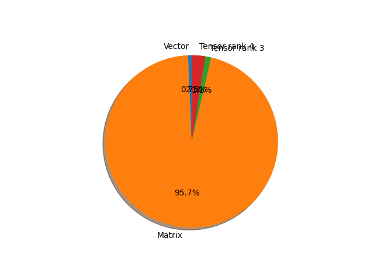

# efficientnet_v2_m parameter information

**Number of layers: [ 649 ]**

**Number of parameters: [ 54.14M ]**

**Proportional of each form** (%)

| Vector | Matrix | Tensor rank 3 | Tensor rank 4 | 
|  --- | --- | --- | --- |
| 62.10 | 28.97 | 6.78 | 2.16 | 

**Proportional of parameters by form** (%)

| Vector | Matrix | Tensor rank 3 | Tensor rank 4 | 
|  --- | --- | --- | --- |
| 0.67 | 95.72 | 1.08 | 2.54 | 

**Layer information**

| Name | Shape | Squeezed shape | Number of parameters | Form |
| --- | --- | --- | --- | --- |
| features.0.0.weight | (24, 3, 3, 3) | (24, 3, 3, 3) | 648 | Tensor rank 4 |
| features.0.1.weight | (24,) | (24,) | 24 | Vector |
| features.0.1.bias | (24,) | (24,) | 24 | Vector |
| features.1.0.block.0.0.weight | (24, 24, 3, 3) | (24, 24, 3, 3) | 5184 | Tensor rank 4 |
| features.1.0.block.0.1.weight | (24,) | (24,) | 24 | Vector |
| features.1.0.block.0.1.bias | (24,) | (24,) | 24 | Vector |
| features.1.1.block.0.0.weight | (24, 24, 3, 3) | (24, 24, 3, 3) | 5184 | Tensor rank 4 |
| features.1.1.block.0.1.weight | (24,) | (24,) | 24 | Vector |
| features.1.1.block.0.1.bias | (24,) | (24,) | 24 | Vector |
| features.1.2.block.0.0.weight | (24, 24, 3, 3) | (24, 24, 3, 3) | 5184 | Tensor rank 4 |
| features.1.2.block.0.1.weight | (24,) | (24,) | 24 | Vector |
| features.1.2.block.0.1.bias | (24,) | (24,) | 24 | Vector |
| features.2.0.block.0.0.weight | (96, 24, 3, 3) | (96, 24, 3, 3) | 20736 | Tensor rank 4 |
| features.2.0.block.0.1.weight | (96,) | (96,) | 96 | Vector |
| features.2.0.block.0.1.bias | (96,) | (96,) | 96 | Vector |
| features.2.0.block.1.0.weight | (48, 96, 1, 1) | (48, 96) | 4608 | Matrix |
| features.2.0.block.1.1.weight | (48,) | (48,) | 48 | Vector |
| features.2.0.block.1.1.bias | (48,) | (48,) | 48 | Vector |
| features.2.1.block.0.0.weight | (192, 48, 3, 3) | (192, 48, 3, 3) | 82944 | Tensor rank 4 |
| features.2.1.block.0.1.weight | (192,) | (192,) | 192 | Vector |
| features.2.1.block.0.1.bias | (192,) | (192,) | 192 | Vector |
| features.2.1.block.1.0.weight | (48, 192, 1, 1) | (48, 192) | 9216 | Matrix |
| features.2.1.block.1.1.weight | (48,) | (48,) | 48 | Vector |
| features.2.1.block.1.1.bias | (48,) | (48,) | 48 | Vector |
| features.2.2.block.0.0.weight | (192, 48, 3, 3) | (192, 48, 3, 3) | 82944 | Tensor rank 4 |
| features.2.2.block.0.1.weight | (192,) | (192,) | 192 | Vector |
| features.2.2.block.0.1.bias | (192,) | (192,) | 192 | Vector |
| features.2.2.block.1.0.weight | (48, 192, 1, 1) | (48, 192) | 9216 | Matrix |
| features.2.2.block.1.1.weight | (48,) | (48,) | 48 | Vector |
| features.2.2.block.1.1.bias | (48,) | (48,) | 48 | Vector |
| features.2.3.block.0.0.weight | (192, 48, 3, 3) | (192, 48, 3, 3) | 82944 | Tensor rank 4 |
| features.2.3.block.0.1.weight | (192,) | (192,) | 192 | Vector |
| features.2.3.block.0.1.bias | (192,) | (192,) | 192 | Vector |
| features.2.3.block.1.0.weight | (48, 192, 1, 1) | (48, 192) | 9216 | Matrix |
| features.2.3.block.1.1.weight | (48,) | (48,) | 48 | Vector |
| features.2.3.block.1.1.bias | (48,) | (48,) | 48 | Vector |
| features.2.4.block.0.0.weight | (192, 48, 3, 3) | (192, 48, 3, 3) | 82944 | Tensor rank 4 |
| features.2.4.block.0.1.weight | (192,) | (192,) | 192 | Vector |
| features.2.4.block.0.1.bias | (192,) | (192,) | 192 | Vector |
| features.2.4.block.1.0.weight | (48, 192, 1, 1) | (48, 192) | 9216 | Matrix |
| features.2.4.block.1.1.weight | (48,) | (48,) | 48 | Vector |
| features.2.4.block.1.1.bias | (48,) | (48,) | 48 | Vector |
| features.3.0.block.0.0.weight | (192, 48, 3, 3) | (192, 48, 3, 3) | 82944 | Tensor rank 4 |
| features.3.0.block.0.1.weight | (192,) | (192,) | 192 | Vector |
| features.3.0.block.0.1.bias | (192,) | (192,) | 192 | Vector |
| features.3.0.block.1.0.weight | (80, 192, 1, 1) | (80, 192) | 15360 | Matrix |
| features.3.0.block.1.1.weight | (80,) | (80,) | 80 | Vector |
| features.3.0.block.1.1.bias | (80,) | (80,) | 80 | Vector |
| features.3.1.block.0.0.weight | (320, 80, 3, 3) | (320, 80, 3, 3) | 230400 | Tensor rank 4 |
| features.3.1.block.0.1.weight | (320,) | (320,) | 320 | Vector |
| features.3.1.block.0.1.bias | (320,) | (320,) | 320 | Vector |
| features.3.1.block.1.0.weight | (80, 320, 1, 1) | (80, 320) | 25600 | Matrix |
| features.3.1.block.1.1.weight | (80,) | (80,) | 80 | Vector |
| features.3.1.block.1.1.bias | (80,) | (80,) | 80 | Vector |
| features.3.2.block.0.0.weight | (320, 80, 3, 3) | (320, 80, 3, 3) | 230400 | Tensor rank 4 |
| features.3.2.block.0.1.weight | (320,) | (320,) | 320 | Vector |
| features.3.2.block.0.1.bias | (320,) | (320,) | 320 | Vector |
| features.3.2.block.1.0.weight | (80, 320, 1, 1) | (80, 320) | 25600 | Matrix |
| features.3.2.block.1.1.weight | (80,) | (80,) | 80 | Vector |
| features.3.2.block.1.1.bias | (80,) | (80,) | 80 | Vector |
| features.3.3.block.0.0.weight | (320, 80, 3, 3) | (320, 80, 3, 3) | 230400 | Tensor rank 4 |
| features.3.3.block.0.1.weight | (320,) | (320,) | 320 | Vector |
| features.3.3.block.0.1.bias | (320,) | (320,) | 320 | Vector |
| features.3.3.block.1.0.weight | (80, 320, 1, 1) | (80, 320) | 25600 | Matrix |
| features.3.3.block.1.1.weight | (80,) | (80,) | 80 | Vector |
| features.3.3.block.1.1.bias | (80,) | (80,) | 80 | Vector |
| features.3.4.block.0.0.weight | (320, 80, 3, 3) | (320, 80, 3, 3) | 230400 | Tensor rank 4 |
| features.3.4.block.0.1.weight | (320,) | (320,) | 320 | Vector |
| features.3.4.block.0.1.bias | (320,) | (320,) | 320 | Vector |
| features.3.4.block.1.0.weight | (80, 320, 1, 1) | (80, 320) | 25600 | Matrix |
| features.3.4.block.1.1.weight | (80,) | (80,) | 80 | Vector |
| features.3.4.block.1.1.bias | (80,) | (80,) | 80 | Vector |
| features.4.0.block.0.0.weight | (320, 80, 1, 1) | (320, 80) | 25600 | Matrix |
| features.4.0.block.0.1.weight | (320,) | (320,) | 320 | Vector |
| features.4.0.block.0.1.bias | (320,) | (320,) | 320 | Vector |
| features.4.0.block.1.0.weight | (320, 1, 3, 3) | (320, 3, 3) | 2880 | Tensor rank 3 |
| features.4.0.block.1.1.weight | (320,) | (320,) | 320 | Vector |
| features.4.0.block.1.1.bias | (320,) | (320,) | 320 | Vector |
| features.4.0.block.2.fc1.weight | (20, 320, 1, 1) | (20, 320) | 6400 | Matrix |
| features.4.0.block.2.fc1.bias | (20,) | (20,) | 20 | Vector |
| features.4.0.block.2.fc2.weight | (320, 20, 1, 1) | (320, 20) | 6400 | Matrix |
| features.4.0.block.2.fc2.bias | (320,) | (320,) | 320 | Vector |
| features.4.0.block.3.0.weight | (160, 320, 1, 1) | (160, 320) | 51200 | Matrix |
| features.4.0.block.3.1.weight | (160,) | (160,) | 160 | Vector |
| features.4.0.block.3.1.bias | (160,) | (160,) | 160 | Vector |
| features.4.1.block.0.0.weight | (640, 160, 1, 1) | (640, 160) | 102400 | Matrix |
| features.4.1.block.0.1.weight | (640,) | (640,) | 640 | Vector |
| features.4.1.block.0.1.bias | (640,) | (640,) | 640 | Vector |
| features.4.1.block.1.0.weight | (640, 1, 3, 3) | (640, 3, 3) | 5760 | Tensor rank 3 |
| features.4.1.block.1.1.weight | (640,) | (640,) | 640 | Vector |
| features.4.1.block.1.1.bias | (640,) | (640,) | 640 | Vector |
| features.4.1.block.2.fc1.weight | (40, 640, 1, 1) | (40, 640) | 25600 | Matrix |
| features.4.1.block.2.fc1.bias | (40,) | (40,) | 40 | Vector |
| features.4.1.block.2.fc2.weight | (640, 40, 1, 1) | (640, 40) | 25600 | Matrix |
| features.4.1.block.2.fc2.bias | (640,) | (640,) | 640 | Vector |
| features.4.1.block.3.0.weight | (160, 640, 1, 1) | (160, 640) | 102400 | Matrix |
| features.4.1.block.3.1.weight | (160,) | (160,) | 160 | Vector |
| features.4.1.block.3.1.bias | (160,) | (160,) | 160 | Vector |
| features.4.2.block.0.0.weight | (640, 160, 1, 1) | (640, 160) | 102400 | Matrix |
| features.4.2.block.0.1.weight | (640,) | (640,) | 640 | Vector |
| features.4.2.block.0.1.bias | (640,) | (640,) | 640 | Vector |
| features.4.2.block.1.0.weight | (640, 1, 3, 3) | (640, 3, 3) | 5760 | Tensor rank 3 |
| features.4.2.block.1.1.weight | (640,) | (640,) | 640 | Vector |
| features.4.2.block.1.1.bias | (640,) | (640,) | 640 | Vector |
| features.4.2.block.2.fc1.weight | (40, 640, 1, 1) | (40, 640) | 25600 | Matrix |
| features.4.2.block.2.fc1.bias | (40,) | (40,) | 40 | Vector |
| features.4.2.block.2.fc2.weight | (640, 40, 1, 1) | (640, 40) | 25600 | Matrix |
| features.4.2.block.2.fc2.bias | (640,) | (640,) | 640 | Vector |
| features.4.2.block.3.0.weight | (160, 640, 1, 1) | (160, 640) | 102400 | Matrix |
| features.4.2.block.3.1.weight | (160,) | (160,) | 160 | Vector |
| features.4.2.block.3.1.bias | (160,) | (160,) | 160 | Vector |
| features.4.3.block.0.0.weight | (640, 160, 1, 1) | (640, 160) | 102400 | Matrix |
| features.4.3.block.0.1.weight | (640,) | (640,) | 640 | Vector |
| features.4.3.block.0.1.bias | (640,) | (640,) | 640 | Vector |
| features.4.3.block.1.0.weight | (640, 1, 3, 3) | (640, 3, 3) | 5760 | Tensor rank 3 |
| features.4.3.block.1.1.weight | (640,) | (640,) | 640 | Vector |
| features.4.3.block.1.1.bias | (640,) | (640,) | 640 | Vector |
| features.4.3.block.2.fc1.weight | (40, 640, 1, 1) | (40, 640) | 25600 | Matrix |
| features.4.3.block.2.fc1.bias | (40,) | (40,) | 40 | Vector |
| features.4.3.block.2.fc2.weight | (640, 40, 1, 1) | (640, 40) | 25600 | Matrix |
| features.4.3.block.2.fc2.bias | (640,) | (640,) | 640 | Vector |
| features.4.3.block.3.0.weight | (160, 640, 1, 1) | (160, 640) | 102400 | Matrix |
| features.4.3.block.3.1.weight | (160,) | (160,) | 160 | Vector |
| features.4.3.block.3.1.bias | (160,) | (160,) | 160 | Vector |
| features.4.4.block.0.0.weight | (640, 160, 1, 1) | (640, 160) | 102400 | Matrix |
| features.4.4.block.0.1.weight | (640,) | (640,) | 640 | Vector |
| features.4.4.block.0.1.bias | (640,) | (640,) | 640 | Vector |
| features.4.4.block.1.0.weight | (640, 1, 3, 3) | (640, 3, 3) | 5760 | Tensor rank 3 |
| features.4.4.block.1.1.weight | (640,) | (640,) | 640 | Vector |
| features.4.4.block.1.1.bias | (640,) | (640,) | 640 | Vector |
| features.4.4.block.2.fc1.weight | (40, 640, 1, 1) | (40, 640) | 25600 | Matrix |
| features.4.4.block.2.fc1.bias | (40,) | (40,) | 40 | Vector |
| features.4.4.block.2.fc2.weight | (640, 40, 1, 1) | (640, 40) | 25600 | Matrix |
| features.4.4.block.2.fc2.bias | (640,) | (640,) | 640 | Vector |
| features.4.4.block.3.0.weight | (160, 640, 1, 1) | (160, 640) | 102400 | Matrix |
| features.4.4.block.3.1.weight | (160,) | (160,) | 160 | Vector |
| features.4.4.block.3.1.bias | (160,) | (160,) | 160 | Vector |
| features.4.5.block.0.0.weight | (640, 160, 1, 1) | (640, 160) | 102400 | Matrix |
| features.4.5.block.0.1.weight | (640,) | (640,) | 640 | Vector |
| features.4.5.block.0.1.bias | (640,) | (640,) | 640 | Vector |
| features.4.5.block.1.0.weight | (640, 1, 3, 3) | (640, 3, 3) | 5760 | Tensor rank 3 |
| features.4.5.block.1.1.weight | (640,) | (640,) | 640 | Vector |
| features.4.5.block.1.1.bias | (640,) | (640,) | 640 | Vector |
| features.4.5.block.2.fc1.weight | (40, 640, 1, 1) | (40, 640) | 25600 | Matrix |
| features.4.5.block.2.fc1.bias | (40,) | (40,) | 40 | Vector |
| features.4.5.block.2.fc2.weight | (640, 40, 1, 1) | (640, 40) | 25600 | Matrix |
| features.4.5.block.2.fc2.bias | (640,) | (640,) | 640 | Vector |
| features.4.5.block.3.0.weight | (160, 640, 1, 1) | (160, 640) | 102400 | Matrix |
| features.4.5.block.3.1.weight | (160,) | (160,) | 160 | Vector |
| features.4.5.block.3.1.bias | (160,) | (160,) | 160 | Vector |
| features.4.6.block.0.0.weight | (640, 160, 1, 1) | (640, 160) | 102400 | Matrix |
| features.4.6.block.0.1.weight | (640,) | (640,) | 640 | Vector |
| features.4.6.block.0.1.bias | (640,) | (640,) | 640 | Vector |
| features.4.6.block.1.0.weight | (640, 1, 3, 3) | (640, 3, 3) | 5760 | Tensor rank 3 |
| features.4.6.block.1.1.weight | (640,) | (640,) | 640 | Vector |
| features.4.6.block.1.1.bias | (640,) | (640,) | 640 | Vector |
| features.4.6.block.2.fc1.weight | (40, 640, 1, 1) | (40, 640) | 25600 | Matrix |
| features.4.6.block.2.fc1.bias | (40,) | (40,) | 40 | Vector |
| features.4.6.block.2.fc2.weight | (640, 40, 1, 1) | (640, 40) | 25600 | Matrix |
| features.4.6.block.2.fc2.bias | (640,) | (640,) | 640 | Vector |
| features.4.6.block.3.0.weight | (160, 640, 1, 1) | (160, 640) | 102400 | Matrix |
| features.4.6.block.3.1.weight | (160,) | (160,) | 160 | Vector |
| features.4.6.block.3.1.bias | (160,) | (160,) | 160 | Vector |
| features.5.0.block.0.0.weight | (960, 160, 1, 1) | (960, 160) | 153600 | Matrix |
| features.5.0.block.0.1.weight | (960,) | (960,) | 960 | Vector |
| features.5.0.block.0.1.bias | (960,) | (960,) | 960 | Vector |
| features.5.0.block.1.0.weight | (960, 1, 3, 3) | (960, 3, 3) | 8640 | Tensor rank 3 |
| features.5.0.block.1.1.weight | (960,) | (960,) | 960 | Vector |
| features.5.0.block.1.1.bias | (960,) | (960,) | 960 | Vector |
| features.5.0.block.2.fc1.weight | (40, 960, 1, 1) | (40, 960) | 38400 | Matrix |
| features.5.0.block.2.fc1.bias | (40,) | (40,) | 40 | Vector |
| features.5.0.block.2.fc2.weight | (960, 40, 1, 1) | (960, 40) | 38400 | Matrix |
| features.5.0.block.2.fc2.bias | (960,) | (960,) | 960 | Vector |
| features.5.0.block.3.0.weight | (176, 960, 1, 1) | (176, 960) | 168960 | Matrix |
| features.5.0.block.3.1.weight | (176,) | (176,) | 176 | Vector |
| features.5.0.block.3.1.bias | (176,) | (176,) | 176 | Vector |
| features.5.1.block.0.0.weight | (1056, 176, 1, 1) | (1056, 176) | 185856 | Matrix |
| features.5.1.block.0.1.weight | (1056,) | (1056,) | 1056 | Vector |
| features.5.1.block.0.1.bias | (1056,) | (1056,) | 1056 | Vector |
| features.5.1.block.1.0.weight | (1056, 1, 3, 3) | (1056, 3, 3) | 9504 | Tensor rank 3 |
| features.5.1.block.1.1.weight | (1056,) | (1056,) | 1056 | Vector |
| features.5.1.block.1.1.bias | (1056,) | (1056,) | 1056 | Vector |
| features.5.1.block.2.fc1.weight | (44, 1056, 1, 1) | (44, 1056) | 46464 | Matrix |
| features.5.1.block.2.fc1.bias | (44,) | (44,) | 44 | Vector |
| features.5.1.block.2.fc2.weight | (1056, 44, 1, 1) | (1056, 44) | 46464 | Matrix |
| features.5.1.block.2.fc2.bias | (1056,) | (1056,) | 1056 | Vector |
| features.5.1.block.3.0.weight | (176, 1056, 1, 1) | (176, 1056) | 185856 | Matrix |
| features.5.1.block.3.1.weight | (176,) | (176,) | 176 | Vector |
| features.5.1.block.3.1.bias | (176,) | (176,) | 176 | Vector |
| features.5.2.block.0.0.weight | (1056, 176, 1, 1) | (1056, 176) | 185856 | Matrix |
| features.5.2.block.0.1.weight | (1056,) | (1056,) | 1056 | Vector |
| features.5.2.block.0.1.bias | (1056,) | (1056,) | 1056 | Vector |
| features.5.2.block.1.0.weight | (1056, 1, 3, 3) | (1056, 3, 3) | 9504 | Tensor rank 3 |
| features.5.2.block.1.1.weight | (1056,) | (1056,) | 1056 | Vector |
| features.5.2.block.1.1.bias | (1056,) | (1056,) | 1056 | Vector |
| features.5.2.block.2.fc1.weight | (44, 1056, 1, 1) | (44, 1056) | 46464 | Matrix |
| features.5.2.block.2.fc1.bias | (44,) | (44,) | 44 | Vector |
| features.5.2.block.2.fc2.weight | (1056, 44, 1, 1) | (1056, 44) | 46464 | Matrix |
| features.5.2.block.2.fc2.bias | (1056,) | (1056,) | 1056 | Vector |
| features.5.2.block.3.0.weight | (176, 1056, 1, 1) | (176, 1056) | 185856 | Matrix |
| features.5.2.block.3.1.weight | (176,) | (176,) | 176 | Vector |
| features.5.2.block.3.1.bias | (176,) | (176,) | 176 | Vector |
| features.5.3.block.0.0.weight | (1056, 176, 1, 1) | (1056, 176) | 185856 | Matrix |
| features.5.3.block.0.1.weight | (1056,) | (1056,) | 1056 | Vector |
| features.5.3.block.0.1.bias | (1056,) | (1056,) | 1056 | Vector |
| features.5.3.block.1.0.weight | (1056, 1, 3, 3) | (1056, 3, 3) | 9504 | Tensor rank 3 |
| features.5.3.block.1.1.weight | (1056,) | (1056,) | 1056 | Vector |
| features.5.3.block.1.1.bias | (1056,) | (1056,) | 1056 | Vector |
| features.5.3.block.2.fc1.weight | (44, 1056, 1, 1) | (44, 1056) | 46464 | Matrix |
| features.5.3.block.2.fc1.bias | (44,) | (44,) | 44 | Vector |
| features.5.3.block.2.fc2.weight | (1056, 44, 1, 1) | (1056, 44) | 46464 | Matrix |
| features.5.3.block.2.fc2.bias | (1056,) | (1056,) | 1056 | Vector |
| features.5.3.block.3.0.weight | (176, 1056, 1, 1) | (176, 1056) | 185856 | Matrix |
| features.5.3.block.3.1.weight | (176,) | (176,) | 176 | Vector |
| features.5.3.block.3.1.bias | (176,) | (176,) | 176 | Vector |
| features.5.4.block.0.0.weight | (1056, 176, 1, 1) | (1056, 176) | 185856 | Matrix |
| features.5.4.block.0.1.weight | (1056,) | (1056,) | 1056 | Vector |
| features.5.4.block.0.1.bias | (1056,) | (1056,) | 1056 | Vector |
| features.5.4.block.1.0.weight | (1056, 1, 3, 3) | (1056, 3, 3) | 9504 | Tensor rank 3 |
| features.5.4.block.1.1.weight | (1056,) | (1056,) | 1056 | Vector |
| features.5.4.block.1.1.bias | (1056,) | (1056,) | 1056 | Vector |
| features.5.4.block.2.fc1.weight | (44, 1056, 1, 1) | (44, 1056) | 46464 | Matrix |
| features.5.4.block.2.fc1.bias | (44,) | (44,) | 44 | Vector |
| features.5.4.block.2.fc2.weight | (1056, 44, 1, 1) | (1056, 44) | 46464 | Matrix |
| features.5.4.block.2.fc2.bias | (1056,) | (1056,) | 1056 | Vector |
| features.5.4.block.3.0.weight | (176, 1056, 1, 1) | (176, 1056) | 185856 | Matrix |
| features.5.4.block.3.1.weight | (176,) | (176,) | 176 | Vector |
| features.5.4.block.3.1.bias | (176,) | (176,) | 176 | Vector |
| features.5.5.block.0.0.weight | (1056, 176, 1, 1) | (1056, 176) | 185856 | Matrix |
| features.5.5.block.0.1.weight | (1056,) | (1056,) | 1056 | Vector |
| features.5.5.block.0.1.bias | (1056,) | (1056,) | 1056 | Vector |
| features.5.5.block.1.0.weight | (1056, 1, 3, 3) | (1056, 3, 3) | 9504 | Tensor rank 3 |
| features.5.5.block.1.1.weight | (1056,) | (1056,) | 1056 | Vector |
| features.5.5.block.1.1.bias | (1056,) | (1056,) | 1056 | Vector |
| features.5.5.block.2.fc1.weight | (44, 1056, 1, 1) | (44, 1056) | 46464 | Matrix |
| features.5.5.block.2.fc1.bias | (44,) | (44,) | 44 | Vector |
| features.5.5.block.2.fc2.weight | (1056, 44, 1, 1) | (1056, 44) | 46464 | Matrix |
| features.5.5.block.2.fc2.bias | (1056,) | (1056,) | 1056 | Vector |
| features.5.5.block.3.0.weight | (176, 1056, 1, 1) | (176, 1056) | 185856 | Matrix |
| features.5.5.block.3.1.weight | (176,) | (176,) | 176 | Vector |
| features.5.5.block.3.1.bias | (176,) | (176,) | 176 | Vector |
| features.5.6.block.0.0.weight | (1056, 176, 1, 1) | (1056, 176) | 185856 | Matrix |
| features.5.6.block.0.1.weight | (1056,) | (1056,) | 1056 | Vector |
| features.5.6.block.0.1.bias | (1056,) | (1056,) | 1056 | Vector |
| features.5.6.block.1.0.weight | (1056, 1, 3, 3) | (1056, 3, 3) | 9504 | Tensor rank 3 |
| features.5.6.block.1.1.weight | (1056,) | (1056,) | 1056 | Vector |
| features.5.6.block.1.1.bias | (1056,) | (1056,) | 1056 | Vector |
| features.5.6.block.2.fc1.weight | (44, 1056, 1, 1) | (44, 1056) | 46464 | Matrix |
| features.5.6.block.2.fc1.bias | (44,) | (44,) | 44 | Vector |
| features.5.6.block.2.fc2.weight | (1056, 44, 1, 1) | (1056, 44) | 46464 | Matrix |
| features.5.6.block.2.fc2.bias | (1056,) | (1056,) | 1056 | Vector |
| features.5.6.block.3.0.weight | (176, 1056, 1, 1) | (176, 1056) | 185856 | Matrix |
| features.5.6.block.3.1.weight | (176,) | (176,) | 176 | Vector |
| features.5.6.block.3.1.bias | (176,) | (176,) | 176 | Vector |
| features.5.7.block.0.0.weight | (1056, 176, 1, 1) | (1056, 176) | 185856 | Matrix |
| features.5.7.block.0.1.weight | (1056,) | (1056,) | 1056 | Vector |
| features.5.7.block.0.1.bias | (1056,) | (1056,) | 1056 | Vector |
| features.5.7.block.1.0.weight | (1056, 1, 3, 3) | (1056, 3, 3) | 9504 | Tensor rank 3 |
| features.5.7.block.1.1.weight | (1056,) | (1056,) | 1056 | Vector |
| features.5.7.block.1.1.bias | (1056,) | (1056,) | 1056 | Vector |
| features.5.7.block.2.fc1.weight | (44, 1056, 1, 1) | (44, 1056) | 46464 | Matrix |
| features.5.7.block.2.fc1.bias | (44,) | (44,) | 44 | Vector |
| features.5.7.block.2.fc2.weight | (1056, 44, 1, 1) | (1056, 44) | 46464 | Matrix |
| features.5.7.block.2.fc2.bias | (1056,) | (1056,) | 1056 | Vector |
| features.5.7.block.3.0.weight | (176, 1056, 1, 1) | (176, 1056) | 185856 | Matrix |
| features.5.7.block.3.1.weight | (176,) | (176,) | 176 | Vector |
| features.5.7.block.3.1.bias | (176,) | (176,) | 176 | Vector |
| features.5.8.block.0.0.weight | (1056, 176, 1, 1) | (1056, 176) | 185856 | Matrix |
| features.5.8.block.0.1.weight | (1056,) | (1056,) | 1056 | Vector |
| features.5.8.block.0.1.bias | (1056,) | (1056,) | 1056 | Vector |
| features.5.8.block.1.0.weight | (1056, 1, 3, 3) | (1056, 3, 3) | 9504 | Tensor rank 3 |
| features.5.8.block.1.1.weight | (1056,) | (1056,) | 1056 | Vector |
| features.5.8.block.1.1.bias | (1056,) | (1056,) | 1056 | Vector |
| features.5.8.block.2.fc1.weight | (44, 1056, 1, 1) | (44, 1056) | 46464 | Matrix |
| features.5.8.block.2.fc1.bias | (44,) | (44,) | 44 | Vector |
| features.5.8.block.2.fc2.weight | (1056, 44, 1, 1) | (1056, 44) | 46464 | Matrix |
| features.5.8.block.2.fc2.bias | (1056,) | (1056,) | 1056 | Vector |
| features.5.8.block.3.0.weight | (176, 1056, 1, 1) | (176, 1056) | 185856 | Matrix |
| features.5.8.block.3.1.weight | (176,) | (176,) | 176 | Vector |
| features.5.8.block.3.1.bias | (176,) | (176,) | 176 | Vector |
| features.5.9.block.0.0.weight | (1056, 176, 1, 1) | (1056, 176) | 185856 | Matrix |
| features.5.9.block.0.1.weight | (1056,) | (1056,) | 1056 | Vector |
| features.5.9.block.0.1.bias | (1056,) | (1056,) | 1056 | Vector |
| features.5.9.block.1.0.weight | (1056, 1, 3, 3) | (1056, 3, 3) | 9504 | Tensor rank 3 |
| features.5.9.block.1.1.weight | (1056,) | (1056,) | 1056 | Vector |
| features.5.9.block.1.1.bias | (1056,) | (1056,) | 1056 | Vector |
| features.5.9.block.2.fc1.weight | (44, 1056, 1, 1) | (44, 1056) | 46464 | Matrix |
| features.5.9.block.2.fc1.bias | (44,) | (44,) | 44 | Vector |
| features.5.9.block.2.fc2.weight | (1056, 44, 1, 1) | (1056, 44) | 46464 | Matrix |
| features.5.9.block.2.fc2.bias | (1056,) | (1056,) | 1056 | Vector |
| features.5.9.block.3.0.weight | (176, 1056, 1, 1) | (176, 1056) | 185856 | Matrix |
| features.5.9.block.3.1.weight | (176,) | (176,) | 176 | Vector |
| features.5.9.block.3.1.bias | (176,) | (176,) | 176 | Vector |
| features.5.10.block.0.0.weight | (1056, 176, 1, 1) | (1056, 176) | 185856 | Matrix |
| features.5.10.block.0.1.weight | (1056,) | (1056,) | 1056 | Vector |
| features.5.10.block.0.1.bias | (1056,) | (1056,) | 1056 | Vector |
| features.5.10.block.1.0.weight | (1056, 1, 3, 3) | (1056, 3, 3) | 9504 | Tensor rank 3 |
| features.5.10.block.1.1.weight | (1056,) | (1056,) | 1056 | Vector |
| features.5.10.block.1.1.bias | (1056,) | (1056,) | 1056 | Vector |
| features.5.10.block.2.fc1.weight | (44, 1056, 1, 1) | (44, 1056) | 46464 | Matrix |
| features.5.10.block.2.fc1.bias | (44,) | (44,) | 44 | Vector |
| features.5.10.block.2.fc2.weight | (1056, 44, 1, 1) | (1056, 44) | 46464 | Matrix |
| features.5.10.block.2.fc2.bias | (1056,) | (1056,) | 1056 | Vector |
| features.5.10.block.3.0.weight | (176, 1056, 1, 1) | (176, 1056) | 185856 | Matrix |
| features.5.10.block.3.1.weight | (176,) | (176,) | 176 | Vector |
| features.5.10.block.3.1.bias | (176,) | (176,) | 176 | Vector |
| features.5.11.block.0.0.weight | (1056, 176, 1, 1) | (1056, 176) | 185856 | Matrix |
| features.5.11.block.0.1.weight | (1056,) | (1056,) | 1056 | Vector |
| features.5.11.block.0.1.bias | (1056,) | (1056,) | 1056 | Vector |
| features.5.11.block.1.0.weight | (1056, 1, 3, 3) | (1056, 3, 3) | 9504 | Tensor rank 3 |
| features.5.11.block.1.1.weight | (1056,) | (1056,) | 1056 | Vector |
| features.5.11.block.1.1.bias | (1056,) | (1056,) | 1056 | Vector |
| features.5.11.block.2.fc1.weight | (44, 1056, 1, 1) | (44, 1056) | 46464 | Matrix |
| features.5.11.block.2.fc1.bias | (44,) | (44,) | 44 | Vector |
| features.5.11.block.2.fc2.weight | (1056, 44, 1, 1) | (1056, 44) | 46464 | Matrix |
| features.5.11.block.2.fc2.bias | (1056,) | (1056,) | 1056 | Vector |
| features.5.11.block.3.0.weight | (176, 1056, 1, 1) | (176, 1056) | 185856 | Matrix |
| features.5.11.block.3.1.weight | (176,) | (176,) | 176 | Vector |
| features.5.11.block.3.1.bias | (176,) | (176,) | 176 | Vector |
| features.5.12.block.0.0.weight | (1056, 176, 1, 1) | (1056, 176) | 185856 | Matrix |
| features.5.12.block.0.1.weight | (1056,) | (1056,) | 1056 | Vector |
| features.5.12.block.0.1.bias | (1056,) | (1056,) | 1056 | Vector |
| features.5.12.block.1.0.weight | (1056, 1, 3, 3) | (1056, 3, 3) | 9504 | Tensor rank 3 |
| features.5.12.block.1.1.weight | (1056,) | (1056,) | 1056 | Vector |
| features.5.12.block.1.1.bias | (1056,) | (1056,) | 1056 | Vector |
| features.5.12.block.2.fc1.weight | (44, 1056, 1, 1) | (44, 1056) | 46464 | Matrix |
| features.5.12.block.2.fc1.bias | (44,) | (44,) | 44 | Vector |
| features.5.12.block.2.fc2.weight | (1056, 44, 1, 1) | (1056, 44) | 46464 | Matrix |
| features.5.12.block.2.fc2.bias | (1056,) | (1056,) | 1056 | Vector |
| features.5.12.block.3.0.weight | (176, 1056, 1, 1) | (176, 1056) | 185856 | Matrix |
| features.5.12.block.3.1.weight | (176,) | (176,) | 176 | Vector |
| features.5.12.block.3.1.bias | (176,) | (176,) | 176 | Vector |
| features.5.13.block.0.0.weight | (1056, 176, 1, 1) | (1056, 176) | 185856 | Matrix |
| features.5.13.block.0.1.weight | (1056,) | (1056,) | 1056 | Vector |
| features.5.13.block.0.1.bias | (1056,) | (1056,) | 1056 | Vector |
| features.5.13.block.1.0.weight | (1056, 1, 3, 3) | (1056, 3, 3) | 9504 | Tensor rank 3 |
| features.5.13.block.1.1.weight | (1056,) | (1056,) | 1056 | Vector |
| features.5.13.block.1.1.bias | (1056,) | (1056,) | 1056 | Vector |
| features.5.13.block.2.fc1.weight | (44, 1056, 1, 1) | (44, 1056) | 46464 | Matrix |
| features.5.13.block.2.fc1.bias | (44,) | (44,) | 44 | Vector |
| features.5.13.block.2.fc2.weight | (1056, 44, 1, 1) | (1056, 44) | 46464 | Matrix |
| features.5.13.block.2.fc2.bias | (1056,) | (1056,) | 1056 | Vector |
| features.5.13.block.3.0.weight | (176, 1056, 1, 1) | (176, 1056) | 185856 | Matrix |
| features.5.13.block.3.1.weight | (176,) | (176,) | 176 | Vector |
| features.5.13.block.3.1.bias | (176,) | (176,) | 176 | Vector |
| features.6.0.block.0.0.weight | (1056, 176, 1, 1) | (1056, 176) | 185856 | Matrix |
| features.6.0.block.0.1.weight | (1056,) | (1056,) | 1056 | Vector |
| features.6.0.block.0.1.bias | (1056,) | (1056,) | 1056 | Vector |
| features.6.0.block.1.0.weight | (1056, 1, 3, 3) | (1056, 3, 3) | 9504 | Tensor rank 3 |
| features.6.0.block.1.1.weight | (1056,) | (1056,) | 1056 | Vector |
| features.6.0.block.1.1.bias | (1056,) | (1056,) | 1056 | Vector |
| features.6.0.block.2.fc1.weight | (44, 1056, 1, 1) | (44, 1056) | 46464 | Matrix |
| features.6.0.block.2.fc1.bias | (44,) | (44,) | 44 | Vector |
| features.6.0.block.2.fc2.weight | (1056, 44, 1, 1) | (1056, 44) | 46464 | Matrix |
| features.6.0.block.2.fc2.bias | (1056,) | (1056,) | 1056 | Vector |
| features.6.0.block.3.0.weight | (304, 1056, 1, 1) | (304, 1056) | 321024 | Matrix |
| features.6.0.block.3.1.weight | (304,) | (304,) | 304 | Vector |
| features.6.0.block.3.1.bias | (304,) | (304,) | 304 | Vector |
| features.6.1.block.0.0.weight | (1824, 304, 1, 1) | (1824, 304) | 554496 | Matrix |
| features.6.1.block.0.1.weight | (1824,) | (1824,) | 1824 | Vector |
| features.6.1.block.0.1.bias | (1824,) | (1824,) | 1824 | Vector |
| features.6.1.block.1.0.weight | (1824, 1, 3, 3) | (1824, 3, 3) | 16416 | Tensor rank 3 |
| features.6.1.block.1.1.weight | (1824,) | (1824,) | 1824 | Vector |
| features.6.1.block.1.1.bias | (1824,) | (1824,) | 1824 | Vector |
| features.6.1.block.2.fc1.weight | (76, 1824, 1, 1) | (76, 1824) | 138624 | Matrix |
| features.6.1.block.2.fc1.bias | (76,) | (76,) | 76 | Vector |
| features.6.1.block.2.fc2.weight | (1824, 76, 1, 1) | (1824, 76) | 138624 | Matrix |
| features.6.1.block.2.fc2.bias | (1824,) | (1824,) | 1824 | Vector |
| features.6.1.block.3.0.weight | (304, 1824, 1, 1) | (304, 1824) | 554496 | Matrix |
| features.6.1.block.3.1.weight | (304,) | (304,) | 304 | Vector |
| features.6.1.block.3.1.bias | (304,) | (304,) | 304 | Vector |
| features.6.2.block.0.0.weight | (1824, 304, 1, 1) | (1824, 304) | 554496 | Matrix |
| features.6.2.block.0.1.weight | (1824,) | (1824,) | 1824 | Vector |
| features.6.2.block.0.1.bias | (1824,) | (1824,) | 1824 | Vector |
| features.6.2.block.1.0.weight | (1824, 1, 3, 3) | (1824, 3, 3) | 16416 | Tensor rank 3 |
| features.6.2.block.1.1.weight | (1824,) | (1824,) | 1824 | Vector |
| features.6.2.block.1.1.bias | (1824,) | (1824,) | 1824 | Vector |
| features.6.2.block.2.fc1.weight | (76, 1824, 1, 1) | (76, 1824) | 138624 | Matrix |
| features.6.2.block.2.fc1.bias | (76,) | (76,) | 76 | Vector |
| features.6.2.block.2.fc2.weight | (1824, 76, 1, 1) | (1824, 76) | 138624 | Matrix |
| features.6.2.block.2.fc2.bias | (1824,) | (1824,) | 1824 | Vector |
| features.6.2.block.3.0.weight | (304, 1824, 1, 1) | (304, 1824) | 554496 | Matrix |
| features.6.2.block.3.1.weight | (304,) | (304,) | 304 | Vector |
| features.6.2.block.3.1.bias | (304,) | (304,) | 304 | Vector |
| features.6.3.block.0.0.weight | (1824, 304, 1, 1) | (1824, 304) | 554496 | Matrix |
| features.6.3.block.0.1.weight | (1824,) | (1824,) | 1824 | Vector |
| features.6.3.block.0.1.bias | (1824,) | (1824,) | 1824 | Vector |
| features.6.3.block.1.0.weight | (1824, 1, 3, 3) | (1824, 3, 3) | 16416 | Tensor rank 3 |
| features.6.3.block.1.1.weight | (1824,) | (1824,) | 1824 | Vector |
| features.6.3.block.1.1.bias | (1824,) | (1824,) | 1824 | Vector |
| features.6.3.block.2.fc1.weight | (76, 1824, 1, 1) | (76, 1824) | 138624 | Matrix |
| features.6.3.block.2.fc1.bias | (76,) | (76,) | 76 | Vector |
| features.6.3.block.2.fc2.weight | (1824, 76, 1, 1) | (1824, 76) | 138624 | Matrix |
| features.6.3.block.2.fc2.bias | (1824,) | (1824,) | 1824 | Vector |
| features.6.3.block.3.0.weight | (304, 1824, 1, 1) | (304, 1824) | 554496 | Matrix |
| features.6.3.block.3.1.weight | (304,) | (304,) | 304 | Vector |
| features.6.3.block.3.1.bias | (304,) | (304,) | 304 | Vector |
| features.6.4.block.0.0.weight | (1824, 304, 1, 1) | (1824, 304) | 554496 | Matrix |
| features.6.4.block.0.1.weight | (1824,) | (1824,) | 1824 | Vector |
| features.6.4.block.0.1.bias | (1824,) | (1824,) | 1824 | Vector |
| features.6.4.block.1.0.weight | (1824, 1, 3, 3) | (1824, 3, 3) | 16416 | Tensor rank 3 |
| features.6.4.block.1.1.weight | (1824,) | (1824,) | 1824 | Vector |
| features.6.4.block.1.1.bias | (1824,) | (1824,) | 1824 | Vector |
| features.6.4.block.2.fc1.weight | (76, 1824, 1, 1) | (76, 1824) | 138624 | Matrix |
| features.6.4.block.2.fc1.bias | (76,) | (76,) | 76 | Vector |
| features.6.4.block.2.fc2.weight | (1824, 76, 1, 1) | (1824, 76) | 138624 | Matrix |
| features.6.4.block.2.fc2.bias | (1824,) | (1824,) | 1824 | Vector |
| features.6.4.block.3.0.weight | (304, 1824, 1, 1) | (304, 1824) | 554496 | Matrix |
| features.6.4.block.3.1.weight | (304,) | (304,) | 304 | Vector |
| features.6.4.block.3.1.bias | (304,) | (304,) | 304 | Vector |
| features.6.5.block.0.0.weight | (1824, 304, 1, 1) | (1824, 304) | 554496 | Matrix |
| features.6.5.block.0.1.weight | (1824,) | (1824,) | 1824 | Vector |
| features.6.5.block.0.1.bias | (1824,) | (1824,) | 1824 | Vector |
| features.6.5.block.1.0.weight | (1824, 1, 3, 3) | (1824, 3, 3) | 16416 | Tensor rank 3 |
| features.6.5.block.1.1.weight | (1824,) | (1824,) | 1824 | Vector |
| features.6.5.block.1.1.bias | (1824,) | (1824,) | 1824 | Vector |
| features.6.5.block.2.fc1.weight | (76, 1824, 1, 1) | (76, 1824) | 138624 | Matrix |
| features.6.5.block.2.fc1.bias | (76,) | (76,) | 76 | Vector |
| features.6.5.block.2.fc2.weight | (1824, 76, 1, 1) | (1824, 76) | 138624 | Matrix |
| features.6.5.block.2.fc2.bias | (1824,) | (1824,) | 1824 | Vector |
| features.6.5.block.3.0.weight | (304, 1824, 1, 1) | (304, 1824) | 554496 | Matrix |
| features.6.5.block.3.1.weight | (304,) | (304,) | 304 | Vector |
| features.6.5.block.3.1.bias | (304,) | (304,) | 304 | Vector |
| features.6.6.block.0.0.weight | (1824, 304, 1, 1) | (1824, 304) | 554496 | Matrix |
| features.6.6.block.0.1.weight | (1824,) | (1824,) | 1824 | Vector |
| features.6.6.block.0.1.bias | (1824,) | (1824,) | 1824 | Vector |
| features.6.6.block.1.0.weight | (1824, 1, 3, 3) | (1824, 3, 3) | 16416 | Tensor rank 3 |
| features.6.6.block.1.1.weight | (1824,) | (1824,) | 1824 | Vector |
| features.6.6.block.1.1.bias | (1824,) | (1824,) | 1824 | Vector |
| features.6.6.block.2.fc1.weight | (76, 1824, 1, 1) | (76, 1824) | 138624 | Matrix |
| features.6.6.block.2.fc1.bias | (76,) | (76,) | 76 | Vector |
| features.6.6.block.2.fc2.weight | (1824, 76, 1, 1) | (1824, 76) | 138624 | Matrix |
| features.6.6.block.2.fc2.bias | (1824,) | (1824,) | 1824 | Vector |
| features.6.6.block.3.0.weight | (304, 1824, 1, 1) | (304, 1824) | 554496 | Matrix |
| features.6.6.block.3.1.weight | (304,) | (304,) | 304 | Vector |
| features.6.6.block.3.1.bias | (304,) | (304,) | 304 | Vector |
| features.6.7.block.0.0.weight | (1824, 304, 1, 1) | (1824, 304) | 554496 | Matrix |
| features.6.7.block.0.1.weight | (1824,) | (1824,) | 1824 | Vector |
| features.6.7.block.0.1.bias | (1824,) | (1824,) | 1824 | Vector |
| features.6.7.block.1.0.weight | (1824, 1, 3, 3) | (1824, 3, 3) | 16416 | Tensor rank 3 |
| features.6.7.block.1.1.weight | (1824,) | (1824,) | 1824 | Vector |
| features.6.7.block.1.1.bias | (1824,) | (1824,) | 1824 | Vector |
| features.6.7.block.2.fc1.weight | (76, 1824, 1, 1) | (76, 1824) | 138624 | Matrix |
| features.6.7.block.2.fc1.bias | (76,) | (76,) | 76 | Vector |
| features.6.7.block.2.fc2.weight | (1824, 76, 1, 1) | (1824, 76) | 138624 | Matrix |
| features.6.7.block.2.fc2.bias | (1824,) | (1824,) | 1824 | Vector |
| features.6.7.block.3.0.weight | (304, 1824, 1, 1) | (304, 1824) | 554496 | Matrix |
| features.6.7.block.3.1.weight | (304,) | (304,) | 304 | Vector |
| features.6.7.block.3.1.bias | (304,) | (304,) | 304 | Vector |
| features.6.8.block.0.0.weight | (1824, 304, 1, 1) | (1824, 304) | 554496 | Matrix |
| features.6.8.block.0.1.weight | (1824,) | (1824,) | 1824 | Vector |
| features.6.8.block.0.1.bias | (1824,) | (1824,) | 1824 | Vector |
| features.6.8.block.1.0.weight | (1824, 1, 3, 3) | (1824, 3, 3) | 16416 | Tensor rank 3 |
| features.6.8.block.1.1.weight | (1824,) | (1824,) | 1824 | Vector |
| features.6.8.block.1.1.bias | (1824,) | (1824,) | 1824 | Vector |
| features.6.8.block.2.fc1.weight | (76, 1824, 1, 1) | (76, 1824) | 138624 | Matrix |
| features.6.8.block.2.fc1.bias | (76,) | (76,) | 76 | Vector |
| features.6.8.block.2.fc2.weight | (1824, 76, 1, 1) | (1824, 76) | 138624 | Matrix |
| features.6.8.block.2.fc2.bias | (1824,) | (1824,) | 1824 | Vector |
| features.6.8.block.3.0.weight | (304, 1824, 1, 1) | (304, 1824) | 554496 | Matrix |
| features.6.8.block.3.1.weight | (304,) | (304,) | 304 | Vector |
| features.6.8.block.3.1.bias | (304,) | (304,) | 304 | Vector |
| features.6.9.block.0.0.weight | (1824, 304, 1, 1) | (1824, 304) | 554496 | Matrix |
| features.6.9.block.0.1.weight | (1824,) | (1824,) | 1824 | Vector |
| features.6.9.block.0.1.bias | (1824,) | (1824,) | 1824 | Vector |
| features.6.9.block.1.0.weight | (1824, 1, 3, 3) | (1824, 3, 3) | 16416 | Tensor rank 3 |
| features.6.9.block.1.1.weight | (1824,) | (1824,) | 1824 | Vector |
| features.6.9.block.1.1.bias | (1824,) | (1824,) | 1824 | Vector |
| features.6.9.block.2.fc1.weight | (76, 1824, 1, 1) | (76, 1824) | 138624 | Matrix |
| features.6.9.block.2.fc1.bias | (76,) | (76,) | 76 | Vector |
| features.6.9.block.2.fc2.weight | (1824, 76, 1, 1) | (1824, 76) | 138624 | Matrix |
| features.6.9.block.2.fc2.bias | (1824,) | (1824,) | 1824 | Vector |
| features.6.9.block.3.0.weight | (304, 1824, 1, 1) | (304, 1824) | 554496 | Matrix |
| features.6.9.block.3.1.weight | (304,) | (304,) | 304 | Vector |
| features.6.9.block.3.1.bias | (304,) | (304,) | 304 | Vector |
| features.6.10.block.0.0.weight | (1824, 304, 1, 1) | (1824, 304) | 554496 | Matrix |
| features.6.10.block.0.1.weight | (1824,) | (1824,) | 1824 | Vector |
| features.6.10.block.0.1.bias | (1824,) | (1824,) | 1824 | Vector |
| features.6.10.block.1.0.weight | (1824, 1, 3, 3) | (1824, 3, 3) | 16416 | Tensor rank 3 |
| features.6.10.block.1.1.weight | (1824,) | (1824,) | 1824 | Vector |
| features.6.10.block.1.1.bias | (1824,) | (1824,) | 1824 | Vector |
| features.6.10.block.2.fc1.weight | (76, 1824, 1, 1) | (76, 1824) | 138624 | Matrix |
| features.6.10.block.2.fc1.bias | (76,) | (76,) | 76 | Vector |
| features.6.10.block.2.fc2.weight | (1824, 76, 1, 1) | (1824, 76) | 138624 | Matrix |
| features.6.10.block.2.fc2.bias | (1824,) | (1824,) | 1824 | Vector |
| features.6.10.block.3.0.weight | (304, 1824, 1, 1) | (304, 1824) | 554496 | Matrix |
| features.6.10.block.3.1.weight | (304,) | (304,) | 304 | Vector |
| features.6.10.block.3.1.bias | (304,) | (304,) | 304 | Vector |
| features.6.11.block.0.0.weight | (1824, 304, 1, 1) | (1824, 304) | 554496 | Matrix |
| features.6.11.block.0.1.weight | (1824,) | (1824,) | 1824 | Vector |
| features.6.11.block.0.1.bias | (1824,) | (1824,) | 1824 | Vector |
| features.6.11.block.1.0.weight | (1824, 1, 3, 3) | (1824, 3, 3) | 16416 | Tensor rank 3 |
| features.6.11.block.1.1.weight | (1824,) | (1824,) | 1824 | Vector |
| features.6.11.block.1.1.bias | (1824,) | (1824,) | 1824 | Vector |
| features.6.11.block.2.fc1.weight | (76, 1824, 1, 1) | (76, 1824) | 138624 | Matrix |
| features.6.11.block.2.fc1.bias | (76,) | (76,) | 76 | Vector |
| features.6.11.block.2.fc2.weight | (1824, 76, 1, 1) | (1824, 76) | 138624 | Matrix |
| features.6.11.block.2.fc2.bias | (1824,) | (1824,) | 1824 | Vector |
| features.6.11.block.3.0.weight | (304, 1824, 1, 1) | (304, 1824) | 554496 | Matrix |
| features.6.11.block.3.1.weight | (304,) | (304,) | 304 | Vector |
| features.6.11.block.3.1.bias | (304,) | (304,) | 304 | Vector |
| features.6.12.block.0.0.weight | (1824, 304, 1, 1) | (1824, 304) | 554496 | Matrix |
| features.6.12.block.0.1.weight | (1824,) | (1824,) | 1824 | Vector |
| features.6.12.block.0.1.bias | (1824,) | (1824,) | 1824 | Vector |
| features.6.12.block.1.0.weight | (1824, 1, 3, 3) | (1824, 3, 3) | 16416 | Tensor rank 3 |
| features.6.12.block.1.1.weight | (1824,) | (1824,) | 1824 | Vector |
| features.6.12.block.1.1.bias | (1824,) | (1824,) | 1824 | Vector |
| features.6.12.block.2.fc1.weight | (76, 1824, 1, 1) | (76, 1824) | 138624 | Matrix |
| features.6.12.block.2.fc1.bias | (76,) | (76,) | 76 | Vector |
| features.6.12.block.2.fc2.weight | (1824, 76, 1, 1) | (1824, 76) | 138624 | Matrix |
| features.6.12.block.2.fc2.bias | (1824,) | (1824,) | 1824 | Vector |
| features.6.12.block.3.0.weight | (304, 1824, 1, 1) | (304, 1824) | 554496 | Matrix |
| features.6.12.block.3.1.weight | (304,) | (304,) | 304 | Vector |
| features.6.12.block.3.1.bias | (304,) | (304,) | 304 | Vector |
| features.6.13.block.0.0.weight | (1824, 304, 1, 1) | (1824, 304) | 554496 | Matrix |
| features.6.13.block.0.1.weight | (1824,) | (1824,) | 1824 | Vector |
| features.6.13.block.0.1.bias | (1824,) | (1824,) | 1824 | Vector |
| features.6.13.block.1.0.weight | (1824, 1, 3, 3) | (1824, 3, 3) | 16416 | Tensor rank 3 |
| features.6.13.block.1.1.weight | (1824,) | (1824,) | 1824 | Vector |
| features.6.13.block.1.1.bias | (1824,) | (1824,) | 1824 | Vector |
| features.6.13.block.2.fc1.weight | (76, 1824, 1, 1) | (76, 1824) | 138624 | Matrix |
| features.6.13.block.2.fc1.bias | (76,) | (76,) | 76 | Vector |
| features.6.13.block.2.fc2.weight | (1824, 76, 1, 1) | (1824, 76) | 138624 | Matrix |
| features.6.13.block.2.fc2.bias | (1824,) | (1824,) | 1824 | Vector |
| features.6.13.block.3.0.weight | (304, 1824, 1, 1) | (304, 1824) | 554496 | Matrix |
| features.6.13.block.3.1.weight | (304,) | (304,) | 304 | Vector |
| features.6.13.block.3.1.bias | (304,) | (304,) | 304 | Vector |
| features.6.14.block.0.0.weight | (1824, 304, 1, 1) | (1824, 304) | 554496 | Matrix |
| features.6.14.block.0.1.weight | (1824,) | (1824,) | 1824 | Vector |
| features.6.14.block.0.1.bias | (1824,) | (1824,) | 1824 | Vector |
| features.6.14.block.1.0.weight | (1824, 1, 3, 3) | (1824, 3, 3) | 16416 | Tensor rank 3 |
| features.6.14.block.1.1.weight | (1824,) | (1824,) | 1824 | Vector |
| features.6.14.block.1.1.bias | (1824,) | (1824,) | 1824 | Vector |
| features.6.14.block.2.fc1.weight | (76, 1824, 1, 1) | (76, 1824) | 138624 | Matrix |
| features.6.14.block.2.fc1.bias | (76,) | (76,) | 76 | Vector |
| features.6.14.block.2.fc2.weight | (1824, 76, 1, 1) | (1824, 76) | 138624 | Matrix |
| features.6.14.block.2.fc2.bias | (1824,) | (1824,) | 1824 | Vector |
| features.6.14.block.3.0.weight | (304, 1824, 1, 1) | (304, 1824) | 554496 | Matrix |
| features.6.14.block.3.1.weight | (304,) | (304,) | 304 | Vector |
| features.6.14.block.3.1.bias | (304,) | (304,) | 304 | Vector |
| features.6.15.block.0.0.weight | (1824, 304, 1, 1) | (1824, 304) | 554496 | Matrix |
| features.6.15.block.0.1.weight | (1824,) | (1824,) | 1824 | Vector |
| features.6.15.block.0.1.bias | (1824,) | (1824,) | 1824 | Vector |
| features.6.15.block.1.0.weight | (1824, 1, 3, 3) | (1824, 3, 3) | 16416 | Tensor rank 3 |
| features.6.15.block.1.1.weight | (1824,) | (1824,) | 1824 | Vector |
| features.6.15.block.1.1.bias | (1824,) | (1824,) | 1824 | Vector |
| features.6.15.block.2.fc1.weight | (76, 1824, 1, 1) | (76, 1824) | 138624 | Matrix |
| features.6.15.block.2.fc1.bias | (76,) | (76,) | 76 | Vector |
| features.6.15.block.2.fc2.weight | (1824, 76, 1, 1) | (1824, 76) | 138624 | Matrix |
| features.6.15.block.2.fc2.bias | (1824,) | (1824,) | 1824 | Vector |
| features.6.15.block.3.0.weight | (304, 1824, 1, 1) | (304, 1824) | 554496 | Matrix |
| features.6.15.block.3.1.weight | (304,) | (304,) | 304 | Vector |
| features.6.15.block.3.1.bias | (304,) | (304,) | 304 | Vector |
| features.6.16.block.0.0.weight | (1824, 304, 1, 1) | (1824, 304) | 554496 | Matrix |
| features.6.16.block.0.1.weight | (1824,) | (1824,) | 1824 | Vector |
| features.6.16.block.0.1.bias | (1824,) | (1824,) | 1824 | Vector |
| features.6.16.block.1.0.weight | (1824, 1, 3, 3) | (1824, 3, 3) | 16416 | Tensor rank 3 |
| features.6.16.block.1.1.weight | (1824,) | (1824,) | 1824 | Vector |
| features.6.16.block.1.1.bias | (1824,) | (1824,) | 1824 | Vector |
| features.6.16.block.2.fc1.weight | (76, 1824, 1, 1) | (76, 1824) | 138624 | Matrix |
| features.6.16.block.2.fc1.bias | (76,) | (76,) | 76 | Vector |
| features.6.16.block.2.fc2.weight | (1824, 76, 1, 1) | (1824, 76) | 138624 | Matrix |
| features.6.16.block.2.fc2.bias | (1824,) | (1824,) | 1824 | Vector |
| features.6.16.block.3.0.weight | (304, 1824, 1, 1) | (304, 1824) | 554496 | Matrix |
| features.6.16.block.3.1.weight | (304,) | (304,) | 304 | Vector |
| features.6.16.block.3.1.bias | (304,) | (304,) | 304 | Vector |
| features.6.17.block.0.0.weight | (1824, 304, 1, 1) | (1824, 304) | 554496 | Matrix |
| features.6.17.block.0.1.weight | (1824,) | (1824,) | 1824 | Vector |
| features.6.17.block.0.1.bias | (1824,) | (1824,) | 1824 | Vector |
| features.6.17.block.1.0.weight | (1824, 1, 3, 3) | (1824, 3, 3) | 16416 | Tensor rank 3 |
| features.6.17.block.1.1.weight | (1824,) | (1824,) | 1824 | Vector |
| features.6.17.block.1.1.bias | (1824,) | (1824,) | 1824 | Vector |
| features.6.17.block.2.fc1.weight | (76, 1824, 1, 1) | (76, 1824) | 138624 | Matrix |
| features.6.17.block.2.fc1.bias | (76,) | (76,) | 76 | Vector |
| features.6.17.block.2.fc2.weight | (1824, 76, 1, 1) | (1824, 76) | 138624 | Matrix |
| features.6.17.block.2.fc2.bias | (1824,) | (1824,) | 1824 | Vector |
| features.6.17.block.3.0.weight | (304, 1824, 1, 1) | (304, 1824) | 554496 | Matrix |
| features.6.17.block.3.1.weight | (304,) | (304,) | 304 | Vector |
| features.6.17.block.3.1.bias | (304,) | (304,) | 304 | Vector |
| features.7.0.block.0.0.weight | (1824, 304, 1, 1) | (1824, 304) | 554496 | Matrix |
| features.7.0.block.0.1.weight | (1824,) | (1824,) | 1824 | Vector |
| features.7.0.block.0.1.bias | (1824,) | (1824,) | 1824 | Vector |
| features.7.0.block.1.0.weight | (1824, 1, 3, 3) | (1824, 3, 3) | 16416 | Tensor rank 3 |
| features.7.0.block.1.1.weight | (1824,) | (1824,) | 1824 | Vector |
| features.7.0.block.1.1.bias | (1824,) | (1824,) | 1824 | Vector |
| features.7.0.block.2.fc1.weight | (76, 1824, 1, 1) | (76, 1824) | 138624 | Matrix |
| features.7.0.block.2.fc1.bias | (76,) | (76,) | 76 | Vector |
| features.7.0.block.2.fc2.weight | (1824, 76, 1, 1) | (1824, 76) | 138624 | Matrix |
| features.7.0.block.2.fc2.bias | (1824,) | (1824,) | 1824 | Vector |
| features.7.0.block.3.0.weight | (512, 1824, 1, 1) | (512, 1824) | 933888 | Matrix |
| features.7.0.block.3.1.weight | (512,) | (512,) | 512 | Vector |
| features.7.0.block.3.1.bias | (512,) | (512,) | 512 | Vector |
| features.7.1.block.0.0.weight | (3072, 512, 1, 1) | (3072, 512) | 1572864 | Matrix |
| features.7.1.block.0.1.weight | (3072,) | (3072,) | 3072 | Vector |
| features.7.1.block.0.1.bias | (3072,) | (3072,) | 3072 | Vector |
| features.7.1.block.1.0.weight | (3072, 1, 3, 3) | (3072, 3, 3) | 27648 | Tensor rank 3 |
| features.7.1.block.1.1.weight | (3072,) | (3072,) | 3072 | Vector |
| features.7.1.block.1.1.bias | (3072,) | (3072,) | 3072 | Vector |
| features.7.1.block.2.fc1.weight | (128, 3072, 1, 1) | (128, 3072) | 393216 | Matrix |
| features.7.1.block.2.fc1.bias | (128,) | (128,) | 128 | Vector |
| features.7.1.block.2.fc2.weight | (3072, 128, 1, 1) | (3072, 128) | 393216 | Matrix |
| features.7.1.block.2.fc2.bias | (3072,) | (3072,) | 3072 | Vector |
| features.7.1.block.3.0.weight | (512, 3072, 1, 1) | (512, 3072) | 1572864 | Matrix |
| features.7.1.block.3.1.weight | (512,) | (512,) | 512 | Vector |
| features.7.1.block.3.1.bias | (512,) | (512,) | 512 | Vector |
| features.7.2.block.0.0.weight | (3072, 512, 1, 1) | (3072, 512) | 1572864 | Matrix |
| features.7.2.block.0.1.weight | (3072,) | (3072,) | 3072 | Vector |
| features.7.2.block.0.1.bias | (3072,) | (3072,) | 3072 | Vector |
| features.7.2.block.1.0.weight | (3072, 1, 3, 3) | (3072, 3, 3) | 27648 | Tensor rank 3 |
| features.7.2.block.1.1.weight | (3072,) | (3072,) | 3072 | Vector |
| features.7.2.block.1.1.bias | (3072,) | (3072,) | 3072 | Vector |
| features.7.2.block.2.fc1.weight | (128, 3072, 1, 1) | (128, 3072) | 393216 | Matrix |
| features.7.2.block.2.fc1.bias | (128,) | (128,) | 128 | Vector |
| features.7.2.block.2.fc2.weight | (3072, 128, 1, 1) | (3072, 128) | 393216 | Matrix |
| features.7.2.block.2.fc2.bias | (3072,) | (3072,) | 3072 | Vector |
| features.7.2.block.3.0.weight | (512, 3072, 1, 1) | (512, 3072) | 1572864 | Matrix |
| features.7.2.block.3.1.weight | (512,) | (512,) | 512 | Vector |
| features.7.2.block.3.1.bias | (512,) | (512,) | 512 | Vector |
| features.7.3.block.0.0.weight | (3072, 512, 1, 1) | (3072, 512) | 1572864 | Matrix |
| features.7.3.block.0.1.weight | (3072,) | (3072,) | 3072 | Vector |
| features.7.3.block.0.1.bias | (3072,) | (3072,) | 3072 | Vector |
| features.7.3.block.1.0.weight | (3072, 1, 3, 3) | (3072, 3, 3) | 27648 | Tensor rank 3 |
| features.7.3.block.1.1.weight | (3072,) | (3072,) | 3072 | Vector |
| features.7.3.block.1.1.bias | (3072,) | (3072,) | 3072 | Vector |
| features.7.3.block.2.fc1.weight | (128, 3072, 1, 1) | (128, 3072) | 393216 | Matrix |
| features.7.3.block.2.fc1.bias | (128,) | (128,) | 128 | Vector |
| features.7.3.block.2.fc2.weight | (3072, 128, 1, 1) | (3072, 128) | 393216 | Matrix |
| features.7.3.block.2.fc2.bias | (3072,) | (3072,) | 3072 | Vector |
| features.7.3.block.3.0.weight | (512, 3072, 1, 1) | (512, 3072) | 1572864 | Matrix |
| features.7.3.block.3.1.weight | (512,) | (512,) | 512 | Vector |
| features.7.3.block.3.1.bias | (512,) | (512,) | 512 | Vector |
| features.7.4.block.0.0.weight | (3072, 512, 1, 1) | (3072, 512) | 1572864 | Matrix |
| features.7.4.block.0.1.weight | (3072,) | (3072,) | 3072 | Vector |
| features.7.4.block.0.1.bias | (3072,) | (3072,) | 3072 | Vector |
| features.7.4.block.1.0.weight | (3072, 1, 3, 3) | (3072, 3, 3) | 27648 | Tensor rank 3 |
| features.7.4.block.1.1.weight | (3072,) | (3072,) | 3072 | Vector |
| features.7.4.block.1.1.bias | (3072,) | (3072,) | 3072 | Vector |
| features.7.4.block.2.fc1.weight | (128, 3072, 1, 1) | (128, 3072) | 393216 | Matrix |
| features.7.4.block.2.fc1.bias | (128,) | (128,) | 128 | Vector |
| features.7.4.block.2.fc2.weight | (3072, 128, 1, 1) | (3072, 128) | 393216 | Matrix |
| features.7.4.block.2.fc2.bias | (3072,) | (3072,) | 3072 | Vector |
| features.7.4.block.3.0.weight | (512, 3072, 1, 1) | (512, 3072) | 1572864 | Matrix |
| features.7.4.block.3.1.weight | (512,) | (512,) | 512 | Vector |
| features.7.4.block.3.1.bias | (512,) | (512,) | 512 | Vector |
| features.8.0.weight | (1280, 512, 1, 1) | (1280, 512) | 655360 | Matrix |
| features.8.1.weight | (1280,) | (1280,) | 1280 | Vector |
| features.8.1.bias | (1280,) | (1280,) | 1280 | Vector |
| classifier.1.weight | (1000, 1280) | (1000, 1280) | 1280000 | Matrix |
| classifier.1.bias | (1000,) | (1000,) | 1000 | Vector |

