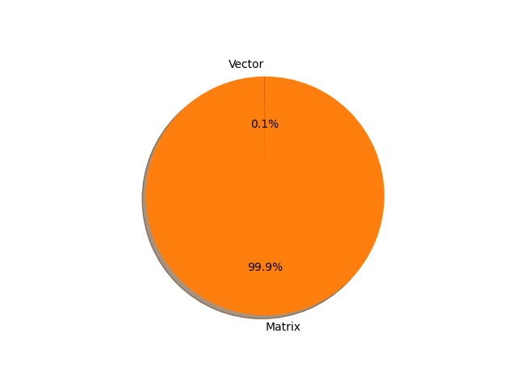

# gpt2 parameter information

**Number of layers: [ 148 ]**

**Number of parameters: [ 124.44M ]**

**Proportional of each form** (%)

| Vector | Matrix | 
|  --- | --- |
| 66.22 | 33.78 | 

**Proportional of parameters by form** (%)

| Vector | Matrix | 
|  --- | --- |
| 0.10 | 99.90 | 

**Layer information**

| Name | Shape | Squeezed shape | Number of parameters | Form |
| --- | --- | --- | --- | --- |
| wte.weight | (50257, 768) | (50257, 768) | 38597376 | Matrix |
| wpe.weight | (1024, 768) | (1024, 768) | 786432 | Matrix |
| h.0.ln_1.weight | (768,) | (768,) | 768 | Vector |
| h.0.ln_1.bias | (768,) | (768,) | 768 | Vector |
| h.0.attn.c_attn.weight | (768, 2304) | (768, 2304) | 1769472 | Matrix |
| h.0.attn.c_attn.bias | (2304,) | (2304,) | 2304 | Vector |
| h.0.attn.c_proj.weight | (768, 768) | (768, 768) | 589824 | Matrix |
| h.0.attn.c_proj.bias | (768,) | (768,) | 768 | Vector |
| h.0.ln_2.weight | (768,) | (768,) | 768 | Vector |
| h.0.ln_2.bias | (768,) | (768,) | 768 | Vector |
| h.0.mlp.c_fc.weight | (768, 3072) | (768, 3072) | 2359296 | Matrix |
| h.0.mlp.c_fc.bias | (3072,) | (3072,) | 3072 | Vector |
| h.0.mlp.c_proj.weight | (3072, 768) | (3072, 768) | 2359296 | Matrix |
| h.0.mlp.c_proj.bias | (768,) | (768,) | 768 | Vector |
| h.1.ln_1.weight | (768,) | (768,) | 768 | Vector |
| h.1.ln_1.bias | (768,) | (768,) | 768 | Vector |
| h.1.attn.c_attn.weight | (768, 2304) | (768, 2304) | 1769472 | Matrix |
| h.1.attn.c_attn.bias | (2304,) | (2304,) | 2304 | Vector |
| h.1.attn.c_proj.weight | (768, 768) | (768, 768) | 589824 | Matrix |
| h.1.attn.c_proj.bias | (768,) | (768,) | 768 | Vector |
| h.1.ln_2.weight | (768,) | (768,) | 768 | Vector |
| h.1.ln_2.bias | (768,) | (768,) | 768 | Vector |
| h.1.mlp.c_fc.weight | (768, 3072) | (768, 3072) | 2359296 | Matrix |
| h.1.mlp.c_fc.bias | (3072,) | (3072,) | 3072 | Vector |
| h.1.mlp.c_proj.weight | (3072, 768) | (3072, 768) | 2359296 | Matrix |
| h.1.mlp.c_proj.bias | (768,) | (768,) | 768 | Vector |
| h.2.ln_1.weight | (768,) | (768,) | 768 | Vector |
| h.2.ln_1.bias | (768,) | (768,) | 768 | Vector |
| h.2.attn.c_attn.weight | (768, 2304) | (768, 2304) | 1769472 | Matrix |
| h.2.attn.c_attn.bias | (2304,) | (2304,) | 2304 | Vector |
| h.2.attn.c_proj.weight | (768, 768) | (768, 768) | 589824 | Matrix |
| h.2.attn.c_proj.bias | (768,) | (768,) | 768 | Vector |
| h.2.ln_2.weight | (768,) | (768,) | 768 | Vector |
| h.2.ln_2.bias | (768,) | (768,) | 768 | Vector |
| h.2.mlp.c_fc.weight | (768, 3072) | (768, 3072) | 2359296 | Matrix |
| h.2.mlp.c_fc.bias | (3072,) | (3072,) | 3072 | Vector |
| h.2.mlp.c_proj.weight | (3072, 768) | (3072, 768) | 2359296 | Matrix |
| h.2.mlp.c_proj.bias | (768,) | (768,) | 768 | Vector |
| h.3.ln_1.weight | (768,) | (768,) | 768 | Vector |
| h.3.ln_1.bias | (768,) | (768,) | 768 | Vector |
| h.3.attn.c_attn.weight | (768, 2304) | (768, 2304) | 1769472 | Matrix |
| h.3.attn.c_attn.bias | (2304,) | (2304,) | 2304 | Vector |
| h.3.attn.c_proj.weight | (768, 768) | (768, 768) | 589824 | Matrix |
| h.3.attn.c_proj.bias | (768,) | (768,) | 768 | Vector |
| h.3.ln_2.weight | (768,) | (768,) | 768 | Vector |
| h.3.ln_2.bias | (768,) | (768,) | 768 | Vector |
| h.3.mlp.c_fc.weight | (768, 3072) | (768, 3072) | 2359296 | Matrix |
| h.3.mlp.c_fc.bias | (3072,) | (3072,) | 3072 | Vector |
| h.3.mlp.c_proj.weight | (3072, 768) | (3072, 768) | 2359296 | Matrix |
| h.3.mlp.c_proj.bias | (768,) | (768,) | 768 | Vector |
| h.4.ln_1.weight | (768,) | (768,) | 768 | Vector |
| h.4.ln_1.bias | (768,) | (768,) | 768 | Vector |
| h.4.attn.c_attn.weight | (768, 2304) | (768, 2304) | 1769472 | Matrix |
| h.4.attn.c_attn.bias | (2304,) | (2304,) | 2304 | Vector |
| h.4.attn.c_proj.weight | (768, 768) | (768, 768) | 589824 | Matrix |
| h.4.attn.c_proj.bias | (768,) | (768,) | 768 | Vector |
| h.4.ln_2.weight | (768,) | (768,) | 768 | Vector |
| h.4.ln_2.bias | (768,) | (768,) | 768 | Vector |
| h.4.mlp.c_fc.weight | (768, 3072) | (768, 3072) | 2359296 | Matrix |
| h.4.mlp.c_fc.bias | (3072,) | (3072,) | 3072 | Vector |
| h.4.mlp.c_proj.weight | (3072, 768) | (3072, 768) | 2359296 | Matrix |
| h.4.mlp.c_proj.bias | (768,) | (768,) | 768 | Vector |
| h.5.ln_1.weight | (768,) | (768,) | 768 | Vector |
| h.5.ln_1.bias | (768,) | (768,) | 768 | Vector |
| h.5.attn.c_attn.weight | (768, 2304) | (768, 2304) | 1769472 | Matrix |
| h.5.attn.c_attn.bias | (2304,) | (2304,) | 2304 | Vector |
| h.5.attn.c_proj.weight | (768, 768) | (768, 768) | 589824 | Matrix |
| h.5.attn.c_proj.bias | (768,) | (768,) | 768 | Vector |
| h.5.ln_2.weight | (768,) | (768,) | 768 | Vector |
| h.5.ln_2.bias | (768,) | (768,) | 768 | Vector |
| h.5.mlp.c_fc.weight | (768, 3072) | (768, 3072) | 2359296 | Matrix |
| h.5.mlp.c_fc.bias | (3072,) | (3072,) | 3072 | Vector |
| h.5.mlp.c_proj.weight | (3072, 768) | (3072, 768) | 2359296 | Matrix |
| h.5.mlp.c_proj.bias | (768,) | (768,) | 768 | Vector |
| h.6.ln_1.weight | (768,) | (768,) | 768 | Vector |
| h.6.ln_1.bias | (768,) | (768,) | 768 | Vector |
| h.6.attn.c_attn.weight | (768, 2304) | (768, 2304) | 1769472 | Matrix |
| h.6.attn.c_attn.bias | (2304,) | (2304,) | 2304 | Vector |
| h.6.attn.c_proj.weight | (768, 768) | (768, 768) | 589824 | Matrix |
| h.6.attn.c_proj.bias | (768,) | (768,) | 768 | Vector |
| h.6.ln_2.weight | (768,) | (768,) | 768 | Vector |
| h.6.ln_2.bias | (768,) | (768,) | 768 | Vector |
| h.6.mlp.c_fc.weight | (768, 3072) | (768, 3072) | 2359296 | Matrix |
| h.6.mlp.c_fc.bias | (3072,) | (3072,) | 3072 | Vector |
| h.6.mlp.c_proj.weight | (3072, 768) | (3072, 768) | 2359296 | Matrix |
| h.6.mlp.c_proj.bias | (768,) | (768,) | 768 | Vector |
| h.7.ln_1.weight | (768,) | (768,) | 768 | Vector |
| h.7.ln_1.bias | (768,) | (768,) | 768 | Vector |
| h.7.attn.c_attn.weight | (768, 2304) | (768, 2304) | 1769472 | Matrix |
| h.7.attn.c_attn.bias | (2304,) | (2304,) | 2304 | Vector |
| h.7.attn.c_proj.weight | (768, 768) | (768, 768) | 589824 | Matrix |
| h.7.attn.c_proj.bias | (768,) | (768,) | 768 | Vector |
| h.7.ln_2.weight | (768,) | (768,) | 768 | Vector |
| h.7.ln_2.bias | (768,) | (768,) | 768 | Vector |
| h.7.mlp.c_fc.weight | (768, 3072) | (768, 3072) | 2359296 | Matrix |
| h.7.mlp.c_fc.bias | (3072,) | (3072,) | 3072 | Vector |
| h.7.mlp.c_proj.weight | (3072, 768) | (3072, 768) | 2359296 | Matrix |
| h.7.mlp.c_proj.bias | (768,) | (768,) | 768 | Vector |
| h.8.ln_1.weight | (768,) | (768,) | 768 | Vector |
| h.8.ln_1.bias | (768,) | (768,) | 768 | Vector |
| h.8.attn.c_attn.weight | (768, 2304) | (768, 2304) | 1769472 | Matrix |
| h.8.attn.c_attn.bias | (2304,) | (2304,) | 2304 | Vector |
| h.8.attn.c_proj.weight | (768, 768) | (768, 768) | 589824 | Matrix |
| h.8.attn.c_proj.bias | (768,) | (768,) | 768 | Vector |
| h.8.ln_2.weight | (768,) | (768,) | 768 | Vector |
| h.8.ln_2.bias | (768,) | (768,) | 768 | Vector |
| h.8.mlp.c_fc.weight | (768, 3072) | (768, 3072) | 2359296 | Matrix |
| h.8.mlp.c_fc.bias | (3072,) | (3072,) | 3072 | Vector |
| h.8.mlp.c_proj.weight | (3072, 768) | (3072, 768) | 2359296 | Matrix |
| h.8.mlp.c_proj.bias | (768,) | (768,) | 768 | Vector |
| h.9.ln_1.weight | (768,) | (768,) | 768 | Vector |
| h.9.ln_1.bias | (768,) | (768,) | 768 | Vector |
| h.9.attn.c_attn.weight | (768, 2304) | (768, 2304) | 1769472 | Matrix |
| h.9.attn.c_attn.bias | (2304,) | (2304,) | 2304 | Vector |
| h.9.attn.c_proj.weight | (768, 768) | (768, 768) | 589824 | Matrix |
| h.9.attn.c_proj.bias | (768,) | (768,) | 768 | Vector |
| h.9.ln_2.weight | (768,) | (768,) | 768 | Vector |
| h.9.ln_2.bias | (768,) | (768,) | 768 | Vector |
| h.9.mlp.c_fc.weight | (768, 3072) | (768, 3072) | 2359296 | Matrix |
| h.9.mlp.c_fc.bias | (3072,) | (3072,) | 3072 | Vector |
| h.9.mlp.c_proj.weight | (3072, 768) | (3072, 768) | 2359296 | Matrix |
| h.9.mlp.c_proj.bias | (768,) | (768,) | 768 | Vector |
| h.10.ln_1.weight | (768,) | (768,) | 768 | Vector |
| h.10.ln_1.bias | (768,) | (768,) | 768 | Vector |
| h.10.attn.c_attn.weight | (768, 2304) | (768, 2304) | 1769472 | Matrix |
| h.10.attn.c_attn.bias | (2304,) | (2304,) | 2304 | Vector |
| h.10.attn.c_proj.weight | (768, 768) | (768, 768) | 589824 | Matrix |
| h.10.attn.c_proj.bias | (768,) | (768,) | 768 | Vector |
| h.10.ln_2.weight | (768,) | (768,) | 768 | Vector |
| h.10.ln_2.bias | (768,) | (768,) | 768 | Vector |
| h.10.mlp.c_fc.weight | (768, 3072) | (768, 3072) | 2359296 | Matrix |
| h.10.mlp.c_fc.bias | (3072,) | (3072,) | 3072 | Vector |
| h.10.mlp.c_proj.weight | (3072, 768) | (3072, 768) | 2359296 | Matrix |
| h.10.mlp.c_proj.bias | (768,) | (768,) | 768 | Vector |
| h.11.ln_1.weight | (768,) | (768,) | 768 | Vector |
| h.11.ln_1.bias | (768,) | (768,) | 768 | Vector |
| h.11.attn.c_attn.weight | (768, 2304) | (768, 2304) | 1769472 | Matrix |
| h.11.attn.c_attn.bias | (2304,) | (2304,) | 2304 | Vector |
| h.11.attn.c_proj.weight | (768, 768) | (768, 768) | 589824 | Matrix |
| h.11.attn.c_proj.bias | (768,) | (768,) | 768 | Vector |
| h.11.ln_2.weight | (768,) | (768,) | 768 | Vector |
| h.11.ln_2.bias | (768,) | (768,) | 768 | Vector |
| h.11.mlp.c_fc.weight | (768, 3072) | (768, 3072) | 2359296 | Matrix |
| h.11.mlp.c_fc.bias | (3072,) | (3072,) | 3072 | Vector |
| h.11.mlp.c_proj.weight | (3072, 768) | (3072, 768) | 2359296 | Matrix |
| h.11.mlp.c_proj.bias | (768,) | (768,) | 768 | Vector |
| ln_f.weight | (768,) | (768,) | 768 | Vector |
| ln_f.bias | (768,) | (768,) | 768 | Vector |

