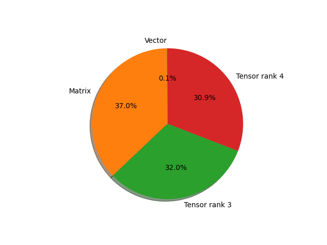

# inception_v3 parameter information

**Number of layers: [ 292 ]**

**Number of parameters: [ 27.16M ]**

**Proportional of each form** (%)

| Vector | Matrix | Tensor rank 3 | Tensor rank 4 | 
|  --- | --- | --- | --- |
| 66.44 | 14.73 | 11.64 | 7.19 | 

**Proportional of parameters by form** (%)

| Vector | Matrix | Tensor rank 3 | Tensor rank 4 | 
|  --- | --- | --- | --- |
| 0.14 | 36.96 | 32.03 | 30.87 | 

**Layer information**

| Name | Shape | Squeezed shape | Number of parameters | Form |
| --- | --- | --- | --- | --- |
| Conv2d_1a_3x3.conv.weight | (32, 3, 3, 3) | (32, 3, 3, 3) | 864 | Tensor rank 4 |
| Conv2d_1a_3x3.bn.weight | (32,) | (32,) | 32 | Vector |
| Conv2d_1a_3x3.bn.bias | (32,) | (32,) | 32 | Vector |
| Conv2d_2a_3x3.conv.weight | (32, 32, 3, 3) | (32, 32, 3, 3) | 9216 | Tensor rank 4 |
| Conv2d_2a_3x3.bn.weight | (32,) | (32,) | 32 | Vector |
| Conv2d_2a_3x3.bn.bias | (32,) | (32,) | 32 | Vector |
| Conv2d_2b_3x3.conv.weight | (64, 32, 3, 3) | (64, 32, 3, 3) | 18432 | Tensor rank 4 |
| Conv2d_2b_3x3.bn.weight | (64,) | (64,) | 64 | Vector |
| Conv2d_2b_3x3.bn.bias | (64,) | (64,) | 64 | Vector |
| Conv2d_3b_1x1.conv.weight | (80, 64, 1, 1) | (80, 64) | 5120 | Matrix |
| Conv2d_3b_1x1.bn.weight | (80,) | (80,) | 80 | Vector |
| Conv2d_3b_1x1.bn.bias | (80,) | (80,) | 80 | Vector |
| Conv2d_4a_3x3.conv.weight | (192, 80, 3, 3) | (192, 80, 3, 3) | 138240 | Tensor rank 4 |
| Conv2d_4a_3x3.bn.weight | (192,) | (192,) | 192 | Vector |
| Conv2d_4a_3x3.bn.bias | (192,) | (192,) | 192 | Vector |
| Mixed_5b.branch1x1.conv.weight | (64, 192, 1, 1) | (64, 192) | 12288 | Matrix |
| Mixed_5b.branch1x1.bn.weight | (64,) | (64,) | 64 | Vector |
| Mixed_5b.branch1x1.bn.bias | (64,) | (64,) | 64 | Vector |
| Mixed_5b.branch5x5_1.conv.weight | (48, 192, 1, 1) | (48, 192) | 9216 | Matrix |
| Mixed_5b.branch5x5_1.bn.weight | (48,) | (48,) | 48 | Vector |
| Mixed_5b.branch5x5_1.bn.bias | (48,) | (48,) | 48 | Vector |
| Mixed_5b.branch5x5_2.conv.weight | (64, 48, 5, 5) | (64, 48, 5, 5) | 76800 | Tensor rank 4 |
| Mixed_5b.branch5x5_2.bn.weight | (64,) | (64,) | 64 | Vector |
| Mixed_5b.branch5x5_2.bn.bias | (64,) | (64,) | 64 | Vector |
| Mixed_5b.branch3x3dbl_1.conv.weight | (64, 192, 1, 1) | (64, 192) | 12288 | Matrix |
| Mixed_5b.branch3x3dbl_1.bn.weight | (64,) | (64,) | 64 | Vector |
| Mixed_5b.branch3x3dbl_1.bn.bias | (64,) | (64,) | 64 | Vector |
| Mixed_5b.branch3x3dbl_2.conv.weight | (96, 64, 3, 3) | (96, 64, 3, 3) | 55296 | Tensor rank 4 |
| Mixed_5b.branch3x3dbl_2.bn.weight | (96,) | (96,) | 96 | Vector |
| Mixed_5b.branch3x3dbl_2.bn.bias | (96,) | (96,) | 96 | Vector |
| Mixed_5b.branch3x3dbl_3.conv.weight | (96, 96, 3, 3) | (96, 96, 3, 3) | 82944 | Tensor rank 4 |
| Mixed_5b.branch3x3dbl_3.bn.weight | (96,) | (96,) | 96 | Vector |
| Mixed_5b.branch3x3dbl_3.bn.bias | (96,) | (96,) | 96 | Vector |
| Mixed_5b.branch_pool.conv.weight | (32, 192, 1, 1) | (32, 192) | 6144 | Matrix |
| Mixed_5b.branch_pool.bn.weight | (32,) | (32,) | 32 | Vector |
| Mixed_5b.branch_pool.bn.bias | (32,) | (32,) | 32 | Vector |
| Mixed_5c.branch1x1.conv.weight | (64, 256, 1, 1) | (64, 256) | 16384 | Matrix |
| Mixed_5c.branch1x1.bn.weight | (64,) | (64,) | 64 | Vector |
| Mixed_5c.branch1x1.bn.bias | (64,) | (64,) | 64 | Vector |
| Mixed_5c.branch5x5_1.conv.weight | (48, 256, 1, 1) | (48, 256) | 12288 | Matrix |
| Mixed_5c.branch5x5_1.bn.weight | (48,) | (48,) | 48 | Vector |
| Mixed_5c.branch5x5_1.bn.bias | (48,) | (48,) | 48 | Vector |
| Mixed_5c.branch5x5_2.conv.weight | (64, 48, 5, 5) | (64, 48, 5, 5) | 76800 | Tensor rank 4 |
| Mixed_5c.branch5x5_2.bn.weight | (64,) | (64,) | 64 | Vector |
| Mixed_5c.branch5x5_2.bn.bias | (64,) | (64,) | 64 | Vector |
| Mixed_5c.branch3x3dbl_1.conv.weight | (64, 256, 1, 1) | (64, 256) | 16384 | Matrix |
| Mixed_5c.branch3x3dbl_1.bn.weight | (64,) | (64,) | 64 | Vector |
| Mixed_5c.branch3x3dbl_1.bn.bias | (64,) | (64,) | 64 | Vector |
| Mixed_5c.branch3x3dbl_2.conv.weight | (96, 64, 3, 3) | (96, 64, 3, 3) | 55296 | Tensor rank 4 |
| Mixed_5c.branch3x3dbl_2.bn.weight | (96,) | (96,) | 96 | Vector |
| Mixed_5c.branch3x3dbl_2.bn.bias | (96,) | (96,) | 96 | Vector |
| Mixed_5c.branch3x3dbl_3.conv.weight | (96, 96, 3, 3) | (96, 96, 3, 3) | 82944 | Tensor rank 4 |
| Mixed_5c.branch3x3dbl_3.bn.weight | (96,) | (96,) | 96 | Vector |
| Mixed_5c.branch3x3dbl_3.bn.bias | (96,) | (96,) | 96 | Vector |
| Mixed_5c.branch_pool.conv.weight | (64, 256, 1, 1) | (64, 256) | 16384 | Matrix |
| Mixed_5c.branch_pool.bn.weight | (64,) | (64,) | 64 | Vector |
| Mixed_5c.branch_pool.bn.bias | (64,) | (64,) | 64 | Vector |
| Mixed_5d.branch1x1.conv.weight | (64, 288, 1, 1) | (64, 288) | 18432 | Matrix |
| Mixed_5d.branch1x1.bn.weight | (64,) | (64,) | 64 | Vector |
| Mixed_5d.branch1x1.bn.bias | (64,) | (64,) | 64 | Vector |
| Mixed_5d.branch5x5_1.conv.weight | (48, 288, 1, 1) | (48, 288) | 13824 | Matrix |
| Mixed_5d.branch5x5_1.bn.weight | (48,) | (48,) | 48 | Vector |
| Mixed_5d.branch5x5_1.bn.bias | (48,) | (48,) | 48 | Vector |
| Mixed_5d.branch5x5_2.conv.weight | (64, 48, 5, 5) | (64, 48, 5, 5) | 76800 | Tensor rank 4 |
| Mixed_5d.branch5x5_2.bn.weight | (64,) | (64,) | 64 | Vector |
| Mixed_5d.branch5x5_2.bn.bias | (64,) | (64,) | 64 | Vector |
| Mixed_5d.branch3x3dbl_1.conv.weight | (64, 288, 1, 1) | (64, 288) | 18432 | Matrix |
| Mixed_5d.branch3x3dbl_1.bn.weight | (64,) | (64,) | 64 | Vector |
| Mixed_5d.branch3x3dbl_1.bn.bias | (64,) | (64,) | 64 | Vector |
| Mixed_5d.branch3x3dbl_2.conv.weight | (96, 64, 3, 3) | (96, 64, 3, 3) | 55296 | Tensor rank 4 |
| Mixed_5d.branch3x3dbl_2.bn.weight | (96,) | (96,) | 96 | Vector |
| Mixed_5d.branch3x3dbl_2.bn.bias | (96,) | (96,) | 96 | Vector |
| Mixed_5d.branch3x3dbl_3.conv.weight | (96, 96, 3, 3) | (96, 96, 3, 3) | 82944 | Tensor rank 4 |
| Mixed_5d.branch3x3dbl_3.bn.weight | (96,) | (96,) | 96 | Vector |
| Mixed_5d.branch3x3dbl_3.bn.bias | (96,) | (96,) | 96 | Vector |
| Mixed_5d.branch_pool.conv.weight | (64, 288, 1, 1) | (64, 288) | 18432 | Matrix |
| Mixed_5d.branch_pool.bn.weight | (64,) | (64,) | 64 | Vector |
| Mixed_5d.branch_pool.bn.bias | (64,) | (64,) | 64 | Vector |
| Mixed_6a.branch3x3.conv.weight | (384, 288, 3, 3) | (384, 288, 3, 3) | 995328 | Tensor rank 4 |
| Mixed_6a.branch3x3.bn.weight | (384,) | (384,) | 384 | Vector |
| Mixed_6a.branch3x3.bn.bias | (384,) | (384,) | 384 | Vector |
| Mixed_6a.branch3x3dbl_1.conv.weight | (64, 288, 1, 1) | (64, 288) | 18432 | Matrix |
| Mixed_6a.branch3x3dbl_1.bn.weight | (64,) | (64,) | 64 | Vector |
| Mixed_6a.branch3x3dbl_1.bn.bias | (64,) | (64,) | 64 | Vector |
| Mixed_6a.branch3x3dbl_2.conv.weight | (96, 64, 3, 3) | (96, 64, 3, 3) | 55296 | Tensor rank 4 |
| Mixed_6a.branch3x3dbl_2.bn.weight | (96,) | (96,) | 96 | Vector |
| Mixed_6a.branch3x3dbl_2.bn.bias | (96,) | (96,) | 96 | Vector |
| Mixed_6a.branch3x3dbl_3.conv.weight | (96, 96, 3, 3) | (96, 96, 3, 3) | 82944 | Tensor rank 4 |
| Mixed_6a.branch3x3dbl_3.bn.weight | (96,) | (96,) | 96 | Vector |
| Mixed_6a.branch3x3dbl_3.bn.bias | (96,) | (96,) | 96 | Vector |
| Mixed_6b.branch1x1.conv.weight | (192, 768, 1, 1) | (192, 768) | 147456 | Matrix |
| Mixed_6b.branch1x1.bn.weight | (192,) | (192,) | 192 | Vector |
| Mixed_6b.branch1x1.bn.bias | (192,) | (192,) | 192 | Vector |
| Mixed_6b.branch7x7_1.conv.weight | (128, 768, 1, 1) | (128, 768) | 98304 | Matrix |
| Mixed_6b.branch7x7_1.bn.weight | (128,) | (128,) | 128 | Vector |
| Mixed_6b.branch7x7_1.bn.bias | (128,) | (128,) | 128 | Vector |
| Mixed_6b.branch7x7_2.conv.weight | (128, 128, 1, 7) | (128, 128, 7) | 114688 | Tensor rank 3 |
| Mixed_6b.branch7x7_2.bn.weight | (128,) | (128,) | 128 | Vector |
| Mixed_6b.branch7x7_2.bn.bias | (128,) | (128,) | 128 | Vector |
| Mixed_6b.branch7x7_3.conv.weight | (192, 128, 7, 1) | (192, 128, 7) | 172032 | Tensor rank 3 |
| Mixed_6b.branch7x7_3.bn.weight | (192,) | (192,) | 192 | Vector |
| Mixed_6b.branch7x7_3.bn.bias | (192,) | (192,) | 192 | Vector |
| Mixed_6b.branch7x7dbl_1.conv.weight | (128, 768, 1, 1) | (128, 768) | 98304 | Matrix |
| Mixed_6b.branch7x7dbl_1.bn.weight | (128,) | (128,) | 128 | Vector |
| Mixed_6b.branch7x7dbl_1.bn.bias | (128,) | (128,) | 128 | Vector |
| Mixed_6b.branch7x7dbl_2.conv.weight | (128, 128, 7, 1) | (128, 128, 7) | 114688 | Tensor rank 3 |
| Mixed_6b.branch7x7dbl_2.bn.weight | (128,) | (128,) | 128 | Vector |
| Mixed_6b.branch7x7dbl_2.bn.bias | (128,) | (128,) | 128 | Vector |
| Mixed_6b.branch7x7dbl_3.conv.weight | (128, 128, 1, 7) | (128, 128, 7) | 114688 | Tensor rank 3 |
| Mixed_6b.branch7x7dbl_3.bn.weight | (128,) | (128,) | 128 | Vector |
| Mixed_6b.branch7x7dbl_3.bn.bias | (128,) | (128,) | 128 | Vector |
| Mixed_6b.branch7x7dbl_4.conv.weight | (128, 128, 7, 1) | (128, 128, 7) | 114688 | Tensor rank 3 |
| Mixed_6b.branch7x7dbl_4.bn.weight | (128,) | (128,) | 128 | Vector |
| Mixed_6b.branch7x7dbl_4.bn.bias | (128,) | (128,) | 128 | Vector |
| Mixed_6b.branch7x7dbl_5.conv.weight | (192, 128, 1, 7) | (192, 128, 7) | 172032 | Tensor rank 3 |
| Mixed_6b.branch7x7dbl_5.bn.weight | (192,) | (192,) | 192 | Vector |
| Mixed_6b.branch7x7dbl_5.bn.bias | (192,) | (192,) | 192 | Vector |
| Mixed_6b.branch_pool.conv.weight | (192, 768, 1, 1) | (192, 768) | 147456 | Matrix |
| Mixed_6b.branch_pool.bn.weight | (192,) | (192,) | 192 | Vector |
| Mixed_6b.branch_pool.bn.bias | (192,) | (192,) | 192 | Vector |
| Mixed_6c.branch1x1.conv.weight | (192, 768, 1, 1) | (192, 768) | 147456 | Matrix |
| Mixed_6c.branch1x1.bn.weight | (192,) | (192,) | 192 | Vector |
| Mixed_6c.branch1x1.bn.bias | (192,) | (192,) | 192 | Vector |
| Mixed_6c.branch7x7_1.conv.weight | (160, 768, 1, 1) | (160, 768) | 122880 | Matrix |
| Mixed_6c.branch7x7_1.bn.weight | (160,) | (160,) | 160 | Vector |
| Mixed_6c.branch7x7_1.bn.bias | (160,) | (160,) | 160 | Vector |
| Mixed_6c.branch7x7_2.conv.weight | (160, 160, 1, 7) | (160, 160, 7) | 179200 | Tensor rank 3 |
| Mixed_6c.branch7x7_2.bn.weight | (160,) | (160,) | 160 | Vector |
| Mixed_6c.branch7x7_2.bn.bias | (160,) | (160,) | 160 | Vector |
| Mixed_6c.branch7x7_3.conv.weight | (192, 160, 7, 1) | (192, 160, 7) | 215040 | Tensor rank 3 |
| Mixed_6c.branch7x7_3.bn.weight | (192,) | (192,) | 192 | Vector |
| Mixed_6c.branch7x7_3.bn.bias | (192,) | (192,) | 192 | Vector |
| Mixed_6c.branch7x7dbl_1.conv.weight | (160, 768, 1, 1) | (160, 768) | 122880 | Matrix |
| Mixed_6c.branch7x7dbl_1.bn.weight | (160,) | (160,) | 160 | Vector |
| Mixed_6c.branch7x7dbl_1.bn.bias | (160,) | (160,) | 160 | Vector |
| Mixed_6c.branch7x7dbl_2.conv.weight | (160, 160, 7, 1) | (160, 160, 7) | 179200 | Tensor rank 3 |
| Mixed_6c.branch7x7dbl_2.bn.weight | (160,) | (160,) | 160 | Vector |
| Mixed_6c.branch7x7dbl_2.bn.bias | (160,) | (160,) | 160 | Vector |
| Mixed_6c.branch7x7dbl_3.conv.weight | (160, 160, 1, 7) | (160, 160, 7) | 179200 | Tensor rank 3 |
| Mixed_6c.branch7x7dbl_3.bn.weight | (160,) | (160,) | 160 | Vector |
| Mixed_6c.branch7x7dbl_3.bn.bias | (160,) | (160,) | 160 | Vector |
| Mixed_6c.branch7x7dbl_4.conv.weight | (160, 160, 7, 1) | (160, 160, 7) | 179200 | Tensor rank 3 |
| Mixed_6c.branch7x7dbl_4.bn.weight | (160,) | (160,) | 160 | Vector |
| Mixed_6c.branch7x7dbl_4.bn.bias | (160,) | (160,) | 160 | Vector |
| Mixed_6c.branch7x7dbl_5.conv.weight | (192, 160, 1, 7) | (192, 160, 7) | 215040 | Tensor rank 3 |
| Mixed_6c.branch7x7dbl_5.bn.weight | (192,) | (192,) | 192 | Vector |
| Mixed_6c.branch7x7dbl_5.bn.bias | (192,) | (192,) | 192 | Vector |
| Mixed_6c.branch_pool.conv.weight | (192, 768, 1, 1) | (192, 768) | 147456 | Matrix |
| Mixed_6c.branch_pool.bn.weight | (192,) | (192,) | 192 | Vector |
| Mixed_6c.branch_pool.bn.bias | (192,) | (192,) | 192 | Vector |
| Mixed_6d.branch1x1.conv.weight | (192, 768, 1, 1) | (192, 768) | 147456 | Matrix |
| Mixed_6d.branch1x1.bn.weight | (192,) | (192,) | 192 | Vector |
| Mixed_6d.branch1x1.bn.bias | (192,) | (192,) | 192 | Vector |
| Mixed_6d.branch7x7_1.conv.weight | (160, 768, 1, 1) | (160, 768) | 122880 | Matrix |
| Mixed_6d.branch7x7_1.bn.weight | (160,) | (160,) | 160 | Vector |
| Mixed_6d.branch7x7_1.bn.bias | (160,) | (160,) | 160 | Vector |
| Mixed_6d.branch7x7_2.conv.weight | (160, 160, 1, 7) | (160, 160, 7) | 179200 | Tensor rank 3 |
| Mixed_6d.branch7x7_2.bn.weight | (160,) | (160,) | 160 | Vector |
| Mixed_6d.branch7x7_2.bn.bias | (160,) | (160,) | 160 | Vector |
| Mixed_6d.branch7x7_3.conv.weight | (192, 160, 7, 1) | (192, 160, 7) | 215040 | Tensor rank 3 |
| Mixed_6d.branch7x7_3.bn.weight | (192,) | (192,) | 192 | Vector |
| Mixed_6d.branch7x7_3.bn.bias | (192,) | (192,) | 192 | Vector |
| Mixed_6d.branch7x7dbl_1.conv.weight | (160, 768, 1, 1) | (160, 768) | 122880 | Matrix |
| Mixed_6d.branch7x7dbl_1.bn.weight | (160,) | (160,) | 160 | Vector |
| Mixed_6d.branch7x7dbl_1.bn.bias | (160,) | (160,) | 160 | Vector |
| Mixed_6d.branch7x7dbl_2.conv.weight | (160, 160, 7, 1) | (160, 160, 7) | 179200 | Tensor rank 3 |
| Mixed_6d.branch7x7dbl_2.bn.weight | (160,) | (160,) | 160 | Vector |
| Mixed_6d.branch7x7dbl_2.bn.bias | (160,) | (160,) | 160 | Vector |
| Mixed_6d.branch7x7dbl_3.conv.weight | (160, 160, 1, 7) | (160, 160, 7) | 179200 | Tensor rank 3 |
| Mixed_6d.branch7x7dbl_3.bn.weight | (160,) | (160,) | 160 | Vector |
| Mixed_6d.branch7x7dbl_3.bn.bias | (160,) | (160,) | 160 | Vector |
| Mixed_6d.branch7x7dbl_4.conv.weight | (160, 160, 7, 1) | (160, 160, 7) | 179200 | Tensor rank 3 |
| Mixed_6d.branch7x7dbl_4.bn.weight | (160,) | (160,) | 160 | Vector |
| Mixed_6d.branch7x7dbl_4.bn.bias | (160,) | (160,) | 160 | Vector |
| Mixed_6d.branch7x7dbl_5.conv.weight | (192, 160, 1, 7) | (192, 160, 7) | 215040 | Tensor rank 3 |
| Mixed_6d.branch7x7dbl_5.bn.weight | (192,) | (192,) | 192 | Vector |
| Mixed_6d.branch7x7dbl_5.bn.bias | (192,) | (192,) | 192 | Vector |
| Mixed_6d.branch_pool.conv.weight | (192, 768, 1, 1) | (192, 768) | 147456 | Matrix |
| Mixed_6d.branch_pool.bn.weight | (192,) | (192,) | 192 | Vector |
| Mixed_6d.branch_pool.bn.bias | (192,) | (192,) | 192 | Vector |
| Mixed_6e.branch1x1.conv.weight | (192, 768, 1, 1) | (192, 768) | 147456 | Matrix |
| Mixed_6e.branch1x1.bn.weight | (192,) | (192,) | 192 | Vector |
| Mixed_6e.branch1x1.bn.bias | (192,) | (192,) | 192 | Vector |
| Mixed_6e.branch7x7_1.conv.weight | (192, 768, 1, 1) | (192, 768) | 147456 | Matrix |
| Mixed_6e.branch7x7_1.bn.weight | (192,) | (192,) | 192 | Vector |
| Mixed_6e.branch7x7_1.bn.bias | (192,) | (192,) | 192 | Vector |
| Mixed_6e.branch7x7_2.conv.weight | (192, 192, 1, 7) | (192, 192, 7) | 258048 | Tensor rank 3 |
| Mixed_6e.branch7x7_2.bn.weight | (192,) | (192,) | 192 | Vector |
| Mixed_6e.branch7x7_2.bn.bias | (192,) | (192,) | 192 | Vector |
| Mixed_6e.branch7x7_3.conv.weight | (192, 192, 7, 1) | (192, 192, 7) | 258048 | Tensor rank 3 |
| Mixed_6e.branch7x7_3.bn.weight | (192,) | (192,) | 192 | Vector |
| Mixed_6e.branch7x7_3.bn.bias | (192,) | (192,) | 192 | Vector |
| Mixed_6e.branch7x7dbl_1.conv.weight | (192, 768, 1, 1) | (192, 768) | 147456 | Matrix |
| Mixed_6e.branch7x7dbl_1.bn.weight | (192,) | (192,) | 192 | Vector |
| Mixed_6e.branch7x7dbl_1.bn.bias | (192,) | (192,) | 192 | Vector |
| Mixed_6e.branch7x7dbl_2.conv.weight | (192, 192, 7, 1) | (192, 192, 7) | 258048 | Tensor rank 3 |
| Mixed_6e.branch7x7dbl_2.bn.weight | (192,) | (192,) | 192 | Vector |
| Mixed_6e.branch7x7dbl_2.bn.bias | (192,) | (192,) | 192 | Vector |
| Mixed_6e.branch7x7dbl_3.conv.weight | (192, 192, 1, 7) | (192, 192, 7) | 258048 | Tensor rank 3 |
| Mixed_6e.branch7x7dbl_3.bn.weight | (192,) | (192,) | 192 | Vector |
| Mixed_6e.branch7x7dbl_3.bn.bias | (192,) | (192,) | 192 | Vector |
| Mixed_6e.branch7x7dbl_4.conv.weight | (192, 192, 7, 1) | (192, 192, 7) | 258048 | Tensor rank 3 |
| Mixed_6e.branch7x7dbl_4.bn.weight | (192,) | (192,) | 192 | Vector |
| Mixed_6e.branch7x7dbl_4.bn.bias | (192,) | (192,) | 192 | Vector |
| Mixed_6e.branch7x7dbl_5.conv.weight | (192, 192, 1, 7) | (192, 192, 7) | 258048 | Tensor rank 3 |
| Mixed_6e.branch7x7dbl_5.bn.weight | (192,) | (192,) | 192 | Vector |
| Mixed_6e.branch7x7dbl_5.bn.bias | (192,) | (192,) | 192 | Vector |
| Mixed_6e.branch_pool.conv.weight | (192, 768, 1, 1) | (192, 768) | 147456 | Matrix |
| Mixed_6e.branch_pool.bn.weight | (192,) | (192,) | 192 | Vector |
| Mixed_6e.branch_pool.bn.bias | (192,) | (192,) | 192 | Vector |
| AuxLogits.conv0.conv.weight | (128, 768, 1, 1) | (128, 768) | 98304 | Matrix |
| AuxLogits.conv0.bn.weight | (128,) | (128,) | 128 | Vector |
| AuxLogits.conv0.bn.bias | (128,) | (128,) | 128 | Vector |
| AuxLogits.conv1.conv.weight | (768, 128, 5, 5) | (768, 128, 5, 5) | 2457600 | Tensor rank 4 |
| AuxLogits.conv1.bn.weight | (768,) | (768,) | 768 | Vector |
| AuxLogits.conv1.bn.bias | (768,) | (768,) | 768 | Vector |
| AuxLogits.fc.weight | (1000, 768) | (1000, 768) | 768000 | Matrix |
| AuxLogits.fc.bias | (1000,) | (1000,) | 1000 | Vector |
| Mixed_7a.branch3x3_1.conv.weight | (192, 768, 1, 1) | (192, 768) | 147456 | Matrix |
| Mixed_7a.branch3x3_1.bn.weight | (192,) | (192,) | 192 | Vector |
| Mixed_7a.branch3x3_1.bn.bias | (192,) | (192,) | 192 | Vector |
| Mixed_7a.branch3x3_2.conv.weight | (320, 192, 3, 3) | (320, 192, 3, 3) | 552960 | Tensor rank 4 |
| Mixed_7a.branch3x3_2.bn.weight | (320,) | (320,) | 320 | Vector |
| Mixed_7a.branch3x3_2.bn.bias | (320,) | (320,) | 320 | Vector |
| Mixed_7a.branch7x7x3_1.conv.weight | (192, 768, 1, 1) | (192, 768) | 147456 | Matrix |
| Mixed_7a.branch7x7x3_1.bn.weight | (192,) | (192,) | 192 | Vector |
| Mixed_7a.branch7x7x3_1.bn.bias | (192,) | (192,) | 192 | Vector |
| Mixed_7a.branch7x7x3_2.conv.weight | (192, 192, 1, 7) | (192, 192, 7) | 258048 | Tensor rank 3 |
| Mixed_7a.branch7x7x3_2.bn.weight | (192,) | (192,) | 192 | Vector |
| Mixed_7a.branch7x7x3_2.bn.bias | (192,) | (192,) | 192 | Vector |
| Mixed_7a.branch7x7x3_3.conv.weight | (192, 192, 7, 1) | (192, 192, 7) | 258048 | Tensor rank 3 |
| Mixed_7a.branch7x7x3_3.bn.weight | (192,) | (192,) | 192 | Vector |
| Mixed_7a.branch7x7x3_3.bn.bias | (192,) | (192,) | 192 | Vector |
| Mixed_7a.branch7x7x3_4.conv.weight | (192, 192, 3, 3) | (192, 192, 3, 3) | 331776 | Tensor rank 4 |
| Mixed_7a.branch7x7x3_4.bn.weight | (192,) | (192,) | 192 | Vector |
| Mixed_7a.branch7x7x3_4.bn.bias | (192,) | (192,) | 192 | Vector |
| Mixed_7b.branch1x1.conv.weight | (320, 1280, 1, 1) | (320, 1280) | 409600 | Matrix |
| Mixed_7b.branch1x1.bn.weight | (320,) | (320,) | 320 | Vector |
| Mixed_7b.branch1x1.bn.bias | (320,) | (320,) | 320 | Vector |
| Mixed_7b.branch3x3_1.conv.weight | (384, 1280, 1, 1) | (384, 1280) | 491520 | Matrix |
| Mixed_7b.branch3x3_1.bn.weight | (384,) | (384,) | 384 | Vector |
| Mixed_7b.branch3x3_1.bn.bias | (384,) | (384,) | 384 | Vector |
| Mixed_7b.branch3x3_2a.conv.weight | (384, 384, 1, 3) | (384, 384, 3) | 442368 | Tensor rank 3 |
| Mixed_7b.branch3x3_2a.bn.weight | (384,) | (384,) | 384 | Vector |
| Mixed_7b.branch3x3_2a.bn.bias | (384,) | (384,) | 384 | Vector |
| Mixed_7b.branch3x3_2b.conv.weight | (384, 384, 3, 1) | (384, 384, 3) | 442368 | Tensor rank 3 |
| Mixed_7b.branch3x3_2b.bn.weight | (384,) | (384,) | 384 | Vector |
| Mixed_7b.branch3x3_2b.bn.bias | (384,) | (384,) | 384 | Vector |
| Mixed_7b.branch3x3dbl_1.conv.weight | (448, 1280, 1, 1) | (448, 1280) | 573440 | Matrix |
| Mixed_7b.branch3x3dbl_1.bn.weight | (448,) | (448,) | 448 | Vector |
| Mixed_7b.branch3x3dbl_1.bn.bias | (448,) | (448,) | 448 | Vector |
| Mixed_7b.branch3x3dbl_2.conv.weight | (384, 448, 3, 3) | (384, 448, 3, 3) | 1548288 | Tensor rank 4 |
| Mixed_7b.branch3x3dbl_2.bn.weight | (384,) | (384,) | 384 | Vector |
| Mixed_7b.branch3x3dbl_2.bn.bias | (384,) | (384,) | 384 | Vector |
| Mixed_7b.branch3x3dbl_3a.conv.weight | (384, 384, 1, 3) | (384, 384, 3) | 442368 | Tensor rank 3 |
| Mixed_7b.branch3x3dbl_3a.bn.weight | (384,) | (384,) | 384 | Vector |
| Mixed_7b.branch3x3dbl_3a.bn.bias | (384,) | (384,) | 384 | Vector |
| Mixed_7b.branch3x3dbl_3b.conv.weight | (384, 384, 3, 1) | (384, 384, 3) | 442368 | Tensor rank 3 |
| Mixed_7b.branch3x3dbl_3b.bn.weight | (384,) | (384,) | 384 | Vector |
| Mixed_7b.branch3x3dbl_3b.bn.bias | (384,) | (384,) | 384 | Vector |
| Mixed_7b.branch_pool.conv.weight | (192, 1280, 1, 1) | (192, 1280) | 245760 | Matrix |
| Mixed_7b.branch_pool.bn.weight | (192,) | (192,) | 192 | Vector |
| Mixed_7b.branch_pool.bn.bias | (192,) | (192,) | 192 | Vector |
| Mixed_7c.branch1x1.conv.weight | (320, 2048, 1, 1) | (320, 2048) | 655360 | Matrix |
| Mixed_7c.branch1x1.bn.weight | (320,) | (320,) | 320 | Vector |
| Mixed_7c.branch1x1.bn.bias | (320,) | (320,) | 320 | Vector |
| Mixed_7c.branch3x3_1.conv.weight | (384, 2048, 1, 1) | (384, 2048) | 786432 | Matrix |
| Mixed_7c.branch3x3_1.bn.weight | (384,) | (384,) | 384 | Vector |
| Mixed_7c.branch3x3_1.bn.bias | (384,) | (384,) | 384 | Vector |
| Mixed_7c.branch3x3_2a.conv.weight | (384, 384, 1, 3) | (384, 384, 3) | 442368 | Tensor rank 3 |
| Mixed_7c.branch3x3_2a.bn.weight | (384,) | (384,) | 384 | Vector |
| Mixed_7c.branch3x3_2a.bn.bias | (384,) | (384,) | 384 | Vector |
| Mixed_7c.branch3x3_2b.conv.weight | (384, 384, 3, 1) | (384, 384, 3) | 442368 | Tensor rank 3 |
| Mixed_7c.branch3x3_2b.bn.weight | (384,) | (384,) | 384 | Vector |
| Mixed_7c.branch3x3_2b.bn.bias | (384,) | (384,) | 384 | Vector |
| Mixed_7c.branch3x3dbl_1.conv.weight | (448, 2048, 1, 1) | (448, 2048) | 917504 | Matrix |
| Mixed_7c.branch3x3dbl_1.bn.weight | (448,) | (448,) | 448 | Vector |
| Mixed_7c.branch3x3dbl_1.bn.bias | (448,) | (448,) | 448 | Vector |
| Mixed_7c.branch3x3dbl_2.conv.weight | (384, 448, 3, 3) | (384, 448, 3, 3) | 1548288 | Tensor rank 4 |
| Mixed_7c.branch3x3dbl_2.bn.weight | (384,) | (384,) | 384 | Vector |
| Mixed_7c.branch3x3dbl_2.bn.bias | (384,) | (384,) | 384 | Vector |
| Mixed_7c.branch3x3dbl_3a.conv.weight | (384, 384, 1, 3) | (384, 384, 3) | 442368 | Tensor rank 3 |
| Mixed_7c.branch3x3dbl_3a.bn.weight | (384,) | (384,) | 384 | Vector |
| Mixed_7c.branch3x3dbl_3a.bn.bias | (384,) | (384,) | 384 | Vector |
| Mixed_7c.branch3x3dbl_3b.conv.weight | (384, 384, 3, 1) | (384, 384, 3) | 442368 | Tensor rank 3 |
| Mixed_7c.branch3x3dbl_3b.bn.weight | (384,) | (384,) | 384 | Vector |
| Mixed_7c.branch3x3dbl_3b.bn.bias | (384,) | (384,) | 384 | Vector |
| Mixed_7c.branch_pool.conv.weight | (192, 2048, 1, 1) | (192, 2048) | 393216 | Matrix |
| Mixed_7c.branch_pool.bn.weight | (192,) | (192,) | 192 | Vector |
| Mixed_7c.branch_pool.bn.bias | (192,) | (192,) | 192 | Vector |
| fc.weight | (1000, 2048) | (1000, 2048) | 2048000 | Matrix |
| fc.bias | (1000,) | (1000,) | 1000 | Vector |

