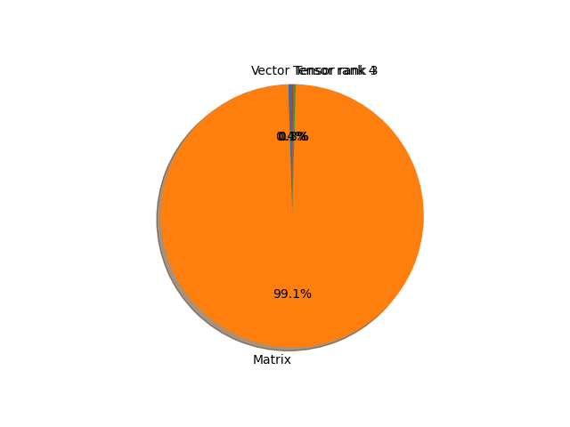

# maxvit_t parameter information

**Number of layers: [ 458 ]**

**Number of parameters: [ 30.92M ]**

**Proportional of each form** (%)

| Vector | Matrix | Tensor rank 3 | Tensor rank 4 | 
|  --- | --- | --- | --- |
| 62.23 | 34.93 | 2.40 | 0.44 | 

**Proportional of parameters by form** (%)

| Vector | Matrix | Tensor rank 3 | Tensor rank 4 | 
|  --- | --- | --- | --- |
| 0.43 | 99.13 | 0.31 | 0.12 | 

**Layer information**

| Name | Shape | Squeezed shape | Number of parameters | Form |
| --- | --- | --- | --- | --- |
| stem.0.0.weight | (64, 3, 3, 3) | (64, 3, 3, 3) | 1728 | Tensor rank 4 |
| stem.0.1.weight | (64,) | (64,) | 64 | Vector |
| stem.0.1.bias | (64,) | (64,) | 64 | Vector |
| stem.1.0.weight | (64, 64, 3, 3) | (64, 64, 3, 3) | 36864 | Tensor rank 4 |
| stem.1.0.bias | (64,) | (64,) | 64 | Vector |
| blocks.0.layers.0.layers.MBconv.proj.1.weight | (64, 64, 1, 1) | (64, 64) | 4096 | Matrix |
| blocks.0.layers.0.layers.MBconv.proj.1.bias | (64,) | (64,) | 64 | Vector |
| blocks.0.layers.0.layers.MBconv.layers.pre_norm.weight | (64,) | (64,) | 64 | Vector |
| blocks.0.layers.0.layers.MBconv.layers.pre_norm.bias | (64,) | (64,) | 64 | Vector |
| blocks.0.layers.0.layers.MBconv.layers.conv_a.0.weight | (256, 64, 1, 1) | (256, 64) | 16384 | Matrix |
| blocks.0.layers.0.layers.MBconv.layers.conv_a.1.weight | (256,) | (256,) | 256 | Vector |
| blocks.0.layers.0.layers.MBconv.layers.conv_a.1.bias | (256,) | (256,) | 256 | Vector |
| blocks.0.layers.0.layers.MBconv.layers.conv_b.0.weight | (256, 1, 3, 3) | (256, 3, 3) | 2304 | Tensor rank 3 |
| blocks.0.layers.0.layers.MBconv.layers.conv_b.1.weight | (256,) | (256,) | 256 | Vector |
| blocks.0.layers.0.layers.MBconv.layers.conv_b.1.bias | (256,) | (256,) | 256 | Vector |
| blocks.0.layers.0.layers.MBconv.layers.squeeze_excitation.fc1.weight | (16, 256, 1, 1) | (16, 256) | 4096 | Matrix |
| blocks.0.layers.0.layers.MBconv.layers.squeeze_excitation.fc1.bias | (16,) | (16,) | 16 | Vector |
| blocks.0.layers.0.layers.MBconv.layers.squeeze_excitation.fc2.weight | (256, 16, 1, 1) | (256, 16) | 4096 | Matrix |
| blocks.0.layers.0.layers.MBconv.layers.squeeze_excitation.fc2.bias | (256,) | (256,) | 256 | Vector |
| blocks.0.layers.0.layers.MBconv.layers.conv_c.weight | (64, 256, 1, 1) | (64, 256) | 16384 | Matrix |
| blocks.0.layers.0.layers.MBconv.layers.conv_c.bias | (64,) | (64,) | 64 | Vector |
| blocks.0.layers.0.layers.window_attention.attn_layer.0.weight | (64,) | (64,) | 64 | Vector |
| blocks.0.layers.0.layers.window_attention.attn_layer.0.bias | (64,) | (64,) | 64 | Vector |
| blocks.0.layers.0.layers.window_attention.attn_layer.1.relative_position_bias_table | (169, 2) | (169, 2) | 338 | Matrix |
| blocks.0.layers.0.layers.window_attention.attn_layer.1.to_qkv.weight | (192, 64) | (192, 64) | 12288 | Matrix |
| blocks.0.layers.0.layers.window_attention.attn_layer.1.to_qkv.bias | (192,) | (192,) | 192 | Vector |
| blocks.0.layers.0.layers.window_attention.attn_layer.1.merge.weight | (64, 64) | (64, 64) | 4096 | Matrix |
| blocks.0.layers.0.layers.window_attention.attn_layer.1.merge.bias | (64,) | (64,) | 64 | Vector |
| blocks.0.layers.0.layers.window_attention.mlp_layer.0.weight | (64,) | (64,) | 64 | Vector |
| blocks.0.layers.0.layers.window_attention.mlp_layer.0.bias | (64,) | (64,) | 64 | Vector |
| blocks.0.layers.0.layers.window_attention.mlp_layer.1.weight | (256, 64) | (256, 64) | 16384 | Matrix |
| blocks.0.layers.0.layers.window_attention.mlp_layer.1.bias | (256,) | (256,) | 256 | Vector |
| blocks.0.layers.0.layers.window_attention.mlp_layer.3.weight | (64, 256) | (64, 256) | 16384 | Matrix |
| blocks.0.layers.0.layers.window_attention.mlp_layer.3.bias | (64,) | (64,) | 64 | Vector |
| blocks.0.layers.0.layers.grid_attention.attn_layer.0.weight | (64,) | (64,) | 64 | Vector |
| blocks.0.layers.0.layers.grid_attention.attn_layer.0.bias | (64,) | (64,) | 64 | Vector |
| blocks.0.layers.0.layers.grid_attention.attn_layer.1.relative_position_bias_table | (169, 2) | (169, 2) | 338 | Matrix |
| blocks.0.layers.0.layers.grid_attention.attn_layer.1.to_qkv.weight | (192, 64) | (192, 64) | 12288 | Matrix |
| blocks.0.layers.0.layers.grid_attention.attn_layer.1.to_qkv.bias | (192,) | (192,) | 192 | Vector |
| blocks.0.layers.0.layers.grid_attention.attn_layer.1.merge.weight | (64, 64) | (64, 64) | 4096 | Matrix |
| blocks.0.layers.0.layers.grid_attention.attn_layer.1.merge.bias | (64,) | (64,) | 64 | Vector |
| blocks.0.layers.0.layers.grid_attention.mlp_layer.0.weight | (64,) | (64,) | 64 | Vector |
| blocks.0.layers.0.layers.grid_attention.mlp_layer.0.bias | (64,) | (64,) | 64 | Vector |
| blocks.0.layers.0.layers.grid_attention.mlp_layer.1.weight | (256, 64) | (256, 64) | 16384 | Matrix |
| blocks.0.layers.0.layers.grid_attention.mlp_layer.1.bias | (256,) | (256,) | 256 | Vector |
| blocks.0.layers.0.layers.grid_attention.mlp_layer.3.weight | (64, 256) | (64, 256) | 16384 | Matrix |
| blocks.0.layers.0.layers.grid_attention.mlp_layer.3.bias | (64,) | (64,) | 64 | Vector |
| blocks.0.layers.1.layers.MBconv.layers.pre_norm.weight | (64,) | (64,) | 64 | Vector |
| blocks.0.layers.1.layers.MBconv.layers.pre_norm.bias | (64,) | (64,) | 64 | Vector |
| blocks.0.layers.1.layers.MBconv.layers.conv_a.0.weight | (256, 64, 1, 1) | (256, 64) | 16384 | Matrix |
| blocks.0.layers.1.layers.MBconv.layers.conv_a.1.weight | (256,) | (256,) | 256 | Vector |
| blocks.0.layers.1.layers.MBconv.layers.conv_a.1.bias | (256,) | (256,) | 256 | Vector |
| blocks.0.layers.1.layers.MBconv.layers.conv_b.0.weight | (256, 1, 3, 3) | (256, 3, 3) | 2304 | Tensor rank 3 |
| blocks.0.layers.1.layers.MBconv.layers.conv_b.1.weight | (256,) | (256,) | 256 | Vector |
| blocks.0.layers.1.layers.MBconv.layers.conv_b.1.bias | (256,) | (256,) | 256 | Vector |
| blocks.0.layers.1.layers.MBconv.layers.squeeze_excitation.fc1.weight | (16, 256, 1, 1) | (16, 256) | 4096 | Matrix |
| blocks.0.layers.1.layers.MBconv.layers.squeeze_excitation.fc1.bias | (16,) | (16,) | 16 | Vector |
| blocks.0.layers.1.layers.MBconv.layers.squeeze_excitation.fc2.weight | (256, 16, 1, 1) | (256, 16) | 4096 | Matrix |
| blocks.0.layers.1.layers.MBconv.layers.squeeze_excitation.fc2.bias | (256,) | (256,) | 256 | Vector |
| blocks.0.layers.1.layers.MBconv.layers.conv_c.weight | (64, 256, 1, 1) | (64, 256) | 16384 | Matrix |
| blocks.0.layers.1.layers.MBconv.layers.conv_c.bias | (64,) | (64,) | 64 | Vector |
| blocks.0.layers.1.layers.window_attention.attn_layer.0.weight | (64,) | (64,) | 64 | Vector |
| blocks.0.layers.1.layers.window_attention.attn_layer.0.bias | (64,) | (64,) | 64 | Vector |
| blocks.0.layers.1.layers.window_attention.attn_layer.1.relative_position_bias_table | (169, 2) | (169, 2) | 338 | Matrix |
| blocks.0.layers.1.layers.window_attention.attn_layer.1.to_qkv.weight | (192, 64) | (192, 64) | 12288 | Matrix |
| blocks.0.layers.1.layers.window_attention.attn_layer.1.to_qkv.bias | (192,) | (192,) | 192 | Vector |
| blocks.0.layers.1.layers.window_attention.attn_layer.1.merge.weight | (64, 64) | (64, 64) | 4096 | Matrix |
| blocks.0.layers.1.layers.window_attention.attn_layer.1.merge.bias | (64,) | (64,) | 64 | Vector |
| blocks.0.layers.1.layers.window_attention.mlp_layer.0.weight | (64,) | (64,) | 64 | Vector |
| blocks.0.layers.1.layers.window_attention.mlp_layer.0.bias | (64,) | (64,) | 64 | Vector |
| blocks.0.layers.1.layers.window_attention.mlp_layer.1.weight | (256, 64) | (256, 64) | 16384 | Matrix |
| blocks.0.layers.1.layers.window_attention.mlp_layer.1.bias | (256,) | (256,) | 256 | Vector |
| blocks.0.layers.1.layers.window_attention.mlp_layer.3.weight | (64, 256) | (64, 256) | 16384 | Matrix |
| blocks.0.layers.1.layers.window_attention.mlp_layer.3.bias | (64,) | (64,) | 64 | Vector |
| blocks.0.layers.1.layers.grid_attention.attn_layer.0.weight | (64,) | (64,) | 64 | Vector |
| blocks.0.layers.1.layers.grid_attention.attn_layer.0.bias | (64,) | (64,) | 64 | Vector |
| blocks.0.layers.1.layers.grid_attention.attn_layer.1.relative_position_bias_table | (169, 2) | (169, 2) | 338 | Matrix |
| blocks.0.layers.1.layers.grid_attention.attn_layer.1.to_qkv.weight | (192, 64) | (192, 64) | 12288 | Matrix |
| blocks.0.layers.1.layers.grid_attention.attn_layer.1.to_qkv.bias | (192,) | (192,) | 192 | Vector |
| blocks.0.layers.1.layers.grid_attention.attn_layer.1.merge.weight | (64, 64) | (64, 64) | 4096 | Matrix |
| blocks.0.layers.1.layers.grid_attention.attn_layer.1.merge.bias | (64,) | (64,) | 64 | Vector |
| blocks.0.layers.1.layers.grid_attention.mlp_layer.0.weight | (64,) | (64,) | 64 | Vector |
| blocks.0.layers.1.layers.grid_attention.mlp_layer.0.bias | (64,) | (64,) | 64 | Vector |
| blocks.0.layers.1.layers.grid_attention.mlp_layer.1.weight | (256, 64) | (256, 64) | 16384 | Matrix |
| blocks.0.layers.1.layers.grid_attention.mlp_layer.1.bias | (256,) | (256,) | 256 | Vector |
| blocks.0.layers.1.layers.grid_attention.mlp_layer.3.weight | (64, 256) | (64, 256) | 16384 | Matrix |
| blocks.0.layers.1.layers.grid_attention.mlp_layer.3.bias | (64,) | (64,) | 64 | Vector |
| blocks.1.layers.0.layers.MBconv.proj.1.weight | (128, 64, 1, 1) | (128, 64) | 8192 | Matrix |
| blocks.1.layers.0.layers.MBconv.proj.1.bias | (128,) | (128,) | 128 | Vector |
| blocks.1.layers.0.layers.MBconv.layers.pre_norm.weight | (64,) | (64,) | 64 | Vector |
| blocks.1.layers.0.layers.MBconv.layers.pre_norm.bias | (64,) | (64,) | 64 | Vector |
| blocks.1.layers.0.layers.MBconv.layers.conv_a.0.weight | (512, 64, 1, 1) | (512, 64) | 32768 | Matrix |
| blocks.1.layers.0.layers.MBconv.layers.conv_a.1.weight | (512,) | (512,) | 512 | Vector |
| blocks.1.layers.0.layers.MBconv.layers.conv_a.1.bias | (512,) | (512,) | 512 | Vector |
| blocks.1.layers.0.layers.MBconv.layers.conv_b.0.weight | (512, 1, 3, 3) | (512, 3, 3) | 4608 | Tensor rank 3 |
| blocks.1.layers.0.layers.MBconv.layers.conv_b.1.weight | (512,) | (512,) | 512 | Vector |
| blocks.1.layers.0.layers.MBconv.layers.conv_b.1.bias | (512,) | (512,) | 512 | Vector |
| blocks.1.layers.0.layers.MBconv.layers.squeeze_excitation.fc1.weight | (32, 512, 1, 1) | (32, 512) | 16384 | Matrix |
| blocks.1.layers.0.layers.MBconv.layers.squeeze_excitation.fc1.bias | (32,) | (32,) | 32 | Vector |
| blocks.1.layers.0.layers.MBconv.layers.squeeze_excitation.fc2.weight | (512, 32, 1, 1) | (512, 32) | 16384 | Matrix |
| blocks.1.layers.0.layers.MBconv.layers.squeeze_excitation.fc2.bias | (512,) | (512,) | 512 | Vector |
| blocks.1.layers.0.layers.MBconv.layers.conv_c.weight | (128, 512, 1, 1) | (128, 512) | 65536 | Matrix |
| blocks.1.layers.0.layers.MBconv.layers.conv_c.bias | (128,) | (128,) | 128 | Vector |
| blocks.1.layers.0.layers.window_attention.attn_layer.0.weight | (128,) | (128,) | 128 | Vector |
| blocks.1.layers.0.layers.window_attention.attn_layer.0.bias | (128,) | (128,) | 128 | Vector |
| blocks.1.layers.0.layers.window_attention.attn_layer.1.relative_position_bias_table | (169, 4) | (169, 4) | 676 | Matrix |
| blocks.1.layers.0.layers.window_attention.attn_layer.1.to_qkv.weight | (384, 128) | (384, 128) | 49152 | Matrix |
| blocks.1.layers.0.layers.window_attention.attn_layer.1.to_qkv.bias | (384,) | (384,) | 384 | Vector |
| blocks.1.layers.0.layers.window_attention.attn_layer.1.merge.weight | (128, 128) | (128, 128) | 16384 | Matrix |
| blocks.1.layers.0.layers.window_attention.attn_layer.1.merge.bias | (128,) | (128,) | 128 | Vector |
| blocks.1.layers.0.layers.window_attention.mlp_layer.0.weight | (128,) | (128,) | 128 | Vector |
| blocks.1.layers.0.layers.window_attention.mlp_layer.0.bias | (128,) | (128,) | 128 | Vector |
| blocks.1.layers.0.layers.window_attention.mlp_layer.1.weight | (512, 128) | (512, 128) | 65536 | Matrix |
| blocks.1.layers.0.layers.window_attention.mlp_layer.1.bias | (512,) | (512,) | 512 | Vector |
| blocks.1.layers.0.layers.window_attention.mlp_layer.3.weight | (128, 512) | (128, 512) | 65536 | Matrix |
| blocks.1.layers.0.layers.window_attention.mlp_layer.3.bias | (128,) | (128,) | 128 | Vector |
| blocks.1.layers.0.layers.grid_attention.attn_layer.0.weight | (128,) | (128,) | 128 | Vector |
| blocks.1.layers.0.layers.grid_attention.attn_layer.0.bias | (128,) | (128,) | 128 | Vector |
| blocks.1.layers.0.layers.grid_attention.attn_layer.1.relative_position_bias_table | (169, 4) | (169, 4) | 676 | Matrix |
| blocks.1.layers.0.layers.grid_attention.attn_layer.1.to_qkv.weight | (384, 128) | (384, 128) | 49152 | Matrix |
| blocks.1.layers.0.layers.grid_attention.attn_layer.1.to_qkv.bias | (384,) | (384,) | 384 | Vector |
| blocks.1.layers.0.layers.grid_attention.attn_layer.1.merge.weight | (128, 128) | (128, 128) | 16384 | Matrix |
| blocks.1.layers.0.layers.grid_attention.attn_layer.1.merge.bias | (128,) | (128,) | 128 | Vector |
| blocks.1.layers.0.layers.grid_attention.mlp_layer.0.weight | (128,) | (128,) | 128 | Vector |
| blocks.1.layers.0.layers.grid_attention.mlp_layer.0.bias | (128,) | (128,) | 128 | Vector |
| blocks.1.layers.0.layers.grid_attention.mlp_layer.1.weight | (512, 128) | (512, 128) | 65536 | Matrix |
| blocks.1.layers.0.layers.grid_attention.mlp_layer.1.bias | (512,) | (512,) | 512 | Vector |
| blocks.1.layers.0.layers.grid_attention.mlp_layer.3.weight | (128, 512) | (128, 512) | 65536 | Matrix |
| blocks.1.layers.0.layers.grid_attention.mlp_layer.3.bias | (128,) | (128,) | 128 | Vector |
| blocks.1.layers.1.layers.MBconv.layers.pre_norm.weight | (128,) | (128,) | 128 | Vector |
| blocks.1.layers.1.layers.MBconv.layers.pre_norm.bias | (128,) | (128,) | 128 | Vector |
| blocks.1.layers.1.layers.MBconv.layers.conv_a.0.weight | (512, 128, 1, 1) | (512, 128) | 65536 | Matrix |
| blocks.1.layers.1.layers.MBconv.layers.conv_a.1.weight | (512,) | (512,) | 512 | Vector |
| blocks.1.layers.1.layers.MBconv.layers.conv_a.1.bias | (512,) | (512,) | 512 | Vector |
| blocks.1.layers.1.layers.MBconv.layers.conv_b.0.weight | (512, 1, 3, 3) | (512, 3, 3) | 4608 | Tensor rank 3 |
| blocks.1.layers.1.layers.MBconv.layers.conv_b.1.weight | (512,) | (512,) | 512 | Vector |
| blocks.1.layers.1.layers.MBconv.layers.conv_b.1.bias | (512,) | (512,) | 512 | Vector |
| blocks.1.layers.1.layers.MBconv.layers.squeeze_excitation.fc1.weight | (32, 512, 1, 1) | (32, 512) | 16384 | Matrix |
| blocks.1.layers.1.layers.MBconv.layers.squeeze_excitation.fc1.bias | (32,) | (32,) | 32 | Vector |
| blocks.1.layers.1.layers.MBconv.layers.squeeze_excitation.fc2.weight | (512, 32, 1, 1) | (512, 32) | 16384 | Matrix |
| blocks.1.layers.1.layers.MBconv.layers.squeeze_excitation.fc2.bias | (512,) | (512,) | 512 | Vector |
| blocks.1.layers.1.layers.MBconv.layers.conv_c.weight | (128, 512, 1, 1) | (128, 512) | 65536 | Matrix |
| blocks.1.layers.1.layers.MBconv.layers.conv_c.bias | (128,) | (128,) | 128 | Vector |
| blocks.1.layers.1.layers.window_attention.attn_layer.0.weight | (128,) | (128,) | 128 | Vector |
| blocks.1.layers.1.layers.window_attention.attn_layer.0.bias | (128,) | (128,) | 128 | Vector |
| blocks.1.layers.1.layers.window_attention.attn_layer.1.relative_position_bias_table | (169, 4) | (169, 4) | 676 | Matrix |
| blocks.1.layers.1.layers.window_attention.attn_layer.1.to_qkv.weight | (384, 128) | (384, 128) | 49152 | Matrix |
| blocks.1.layers.1.layers.window_attention.attn_layer.1.to_qkv.bias | (384,) | (384,) | 384 | Vector |
| blocks.1.layers.1.layers.window_attention.attn_layer.1.merge.weight | (128, 128) | (128, 128) | 16384 | Matrix |
| blocks.1.layers.1.layers.window_attention.attn_layer.1.merge.bias | (128,) | (128,) | 128 | Vector |
| blocks.1.layers.1.layers.window_attention.mlp_layer.0.weight | (128,) | (128,) | 128 | Vector |
| blocks.1.layers.1.layers.window_attention.mlp_layer.0.bias | (128,) | (128,) | 128 | Vector |
| blocks.1.layers.1.layers.window_attention.mlp_layer.1.weight | (512, 128) | (512, 128) | 65536 | Matrix |
| blocks.1.layers.1.layers.window_attention.mlp_layer.1.bias | (512,) | (512,) | 512 | Vector |
| blocks.1.layers.1.layers.window_attention.mlp_layer.3.weight | (128, 512) | (128, 512) | 65536 | Matrix |
| blocks.1.layers.1.layers.window_attention.mlp_layer.3.bias | (128,) | (128,) | 128 | Vector |
| blocks.1.layers.1.layers.grid_attention.attn_layer.0.weight | (128,) | (128,) | 128 | Vector |
| blocks.1.layers.1.layers.grid_attention.attn_layer.0.bias | (128,) | (128,) | 128 | Vector |
| blocks.1.layers.1.layers.grid_attention.attn_layer.1.relative_position_bias_table | (169, 4) | (169, 4) | 676 | Matrix |
| blocks.1.layers.1.layers.grid_attention.attn_layer.1.to_qkv.weight | (384, 128) | (384, 128) | 49152 | Matrix |
| blocks.1.layers.1.layers.grid_attention.attn_layer.1.to_qkv.bias | (384,) | (384,) | 384 | Vector |
| blocks.1.layers.1.layers.grid_attention.attn_layer.1.merge.weight | (128, 128) | (128, 128) | 16384 | Matrix |
| blocks.1.layers.1.layers.grid_attention.attn_layer.1.merge.bias | (128,) | (128,) | 128 | Vector |
| blocks.1.layers.1.layers.grid_attention.mlp_layer.0.weight | (128,) | (128,) | 128 | Vector |
| blocks.1.layers.1.layers.grid_attention.mlp_layer.0.bias | (128,) | (128,) | 128 | Vector |
| blocks.1.layers.1.layers.grid_attention.mlp_layer.1.weight | (512, 128) | (512, 128) | 65536 | Matrix |
| blocks.1.layers.1.layers.grid_attention.mlp_layer.1.bias | (512,) | (512,) | 512 | Vector |
| blocks.1.layers.1.layers.grid_attention.mlp_layer.3.weight | (128, 512) | (128, 512) | 65536 | Matrix |
| blocks.1.layers.1.layers.grid_attention.mlp_layer.3.bias | (128,) | (128,) | 128 | Vector |
| blocks.2.layers.0.layers.MBconv.proj.1.weight | (256, 128, 1, 1) | (256, 128) | 32768 | Matrix |
| blocks.2.layers.0.layers.MBconv.proj.1.bias | (256,) | (256,) | 256 | Vector |
| blocks.2.layers.0.layers.MBconv.layers.pre_norm.weight | (128,) | (128,) | 128 | Vector |
| blocks.2.layers.0.layers.MBconv.layers.pre_norm.bias | (128,) | (128,) | 128 | Vector |
| blocks.2.layers.0.layers.MBconv.layers.conv_a.0.weight | (1024, 128, 1, 1) | (1024, 128) | 131072 | Matrix |
| blocks.2.layers.0.layers.MBconv.layers.conv_a.1.weight | (1024,) | (1024,) | 1024 | Vector |
| blocks.2.layers.0.layers.MBconv.layers.conv_a.1.bias | (1024,) | (1024,) | 1024 | Vector |
| blocks.2.layers.0.layers.MBconv.layers.conv_b.0.weight | (1024, 1, 3, 3) | (1024, 3, 3) | 9216 | Tensor rank 3 |
| blocks.2.layers.0.layers.MBconv.layers.conv_b.1.weight | (1024,) | (1024,) | 1024 | Vector |
| blocks.2.layers.0.layers.MBconv.layers.conv_b.1.bias | (1024,) | (1024,) | 1024 | Vector |
| blocks.2.layers.0.layers.MBconv.layers.squeeze_excitation.fc1.weight | (64, 1024, 1, 1) | (64, 1024) | 65536 | Matrix |
| blocks.2.layers.0.layers.MBconv.layers.squeeze_excitation.fc1.bias | (64,) | (64,) | 64 | Vector |
| blocks.2.layers.0.layers.MBconv.layers.squeeze_excitation.fc2.weight | (1024, 64, 1, 1) | (1024, 64) | 65536 | Matrix |
| blocks.2.layers.0.layers.MBconv.layers.squeeze_excitation.fc2.bias | (1024,) | (1024,) | 1024 | Vector |
| blocks.2.layers.0.layers.MBconv.layers.conv_c.weight | (256, 1024, 1, 1) | (256, 1024) | 262144 | Matrix |
| blocks.2.layers.0.layers.MBconv.layers.conv_c.bias | (256,) | (256,) | 256 | Vector |
| blocks.2.layers.0.layers.window_attention.attn_layer.0.weight | (256,) | (256,) | 256 | Vector |
| blocks.2.layers.0.layers.window_attention.attn_layer.0.bias | (256,) | (256,) | 256 | Vector |
| blocks.2.layers.0.layers.window_attention.attn_layer.1.relative_position_bias_table | (169, 8) | (169, 8) | 1352 | Matrix |
| blocks.2.layers.0.layers.window_attention.attn_layer.1.to_qkv.weight | (768, 256) | (768, 256) | 196608 | Matrix |
| blocks.2.layers.0.layers.window_attention.attn_layer.1.to_qkv.bias | (768,) | (768,) | 768 | Vector |
| blocks.2.layers.0.layers.window_attention.attn_layer.1.merge.weight | (256, 256) | (256, 256) | 65536 | Matrix |
| blocks.2.layers.0.layers.window_attention.attn_layer.1.merge.bias | (256,) | (256,) | 256 | Vector |
| blocks.2.layers.0.layers.window_attention.mlp_layer.0.weight | (256,) | (256,) | 256 | Vector |
| blocks.2.layers.0.layers.window_attention.mlp_layer.0.bias | (256,) | (256,) | 256 | Vector |
| blocks.2.layers.0.layers.window_attention.mlp_layer.1.weight | (1024, 256) | (1024, 256) | 262144 | Matrix |
| blocks.2.layers.0.layers.window_attention.mlp_layer.1.bias | (1024,) | (1024,) | 1024 | Vector |
| blocks.2.layers.0.layers.window_attention.mlp_layer.3.weight | (256, 1024) | (256, 1024) | 262144 | Matrix |
| blocks.2.layers.0.layers.window_attention.mlp_layer.3.bias | (256,) | (256,) | 256 | Vector |
| blocks.2.layers.0.layers.grid_attention.attn_layer.0.weight | (256,) | (256,) | 256 | Vector |
| blocks.2.layers.0.layers.grid_attention.attn_layer.0.bias | (256,) | (256,) | 256 | Vector |
| blocks.2.layers.0.layers.grid_attention.attn_layer.1.relative_position_bias_table | (169, 8) | (169, 8) | 1352 | Matrix |
| blocks.2.layers.0.layers.grid_attention.attn_layer.1.to_qkv.weight | (768, 256) | (768, 256) | 196608 | Matrix |
| blocks.2.layers.0.layers.grid_attention.attn_layer.1.to_qkv.bias | (768,) | (768,) | 768 | Vector |
| blocks.2.layers.0.layers.grid_attention.attn_layer.1.merge.weight | (256, 256) | (256, 256) | 65536 | Matrix |
| blocks.2.layers.0.layers.grid_attention.attn_layer.1.merge.bias | (256,) | (256,) | 256 | Vector |
| blocks.2.layers.0.layers.grid_attention.mlp_layer.0.weight | (256,) | (256,) | 256 | Vector |
| blocks.2.layers.0.layers.grid_attention.mlp_layer.0.bias | (256,) | (256,) | 256 | Vector |
| blocks.2.layers.0.layers.grid_attention.mlp_layer.1.weight | (1024, 256) | (1024, 256) | 262144 | Matrix |
| blocks.2.layers.0.layers.grid_attention.mlp_layer.1.bias | (1024,) | (1024,) | 1024 | Vector |
| blocks.2.layers.0.layers.grid_attention.mlp_layer.3.weight | (256, 1024) | (256, 1024) | 262144 | Matrix |
| blocks.2.layers.0.layers.grid_attention.mlp_layer.3.bias | (256,) | (256,) | 256 | Vector |
| blocks.2.layers.1.layers.MBconv.layers.pre_norm.weight | (256,) | (256,) | 256 | Vector |
| blocks.2.layers.1.layers.MBconv.layers.pre_norm.bias | (256,) | (256,) | 256 | Vector |
| blocks.2.layers.1.layers.MBconv.layers.conv_a.0.weight | (1024, 256, 1, 1) | (1024, 256) | 262144 | Matrix |
| blocks.2.layers.1.layers.MBconv.layers.conv_a.1.weight | (1024,) | (1024,) | 1024 | Vector |
| blocks.2.layers.1.layers.MBconv.layers.conv_a.1.bias | (1024,) | (1024,) | 1024 | Vector |
| blocks.2.layers.1.layers.MBconv.layers.conv_b.0.weight | (1024, 1, 3, 3) | (1024, 3, 3) | 9216 | Tensor rank 3 |
| blocks.2.layers.1.layers.MBconv.layers.conv_b.1.weight | (1024,) | (1024,) | 1024 | Vector |
| blocks.2.layers.1.layers.MBconv.layers.conv_b.1.bias | (1024,) | (1024,) | 1024 | Vector |
| blocks.2.layers.1.layers.MBconv.layers.squeeze_excitation.fc1.weight | (64, 1024, 1, 1) | (64, 1024) | 65536 | Matrix |
| blocks.2.layers.1.layers.MBconv.layers.squeeze_excitation.fc1.bias | (64,) | (64,) | 64 | Vector |
| blocks.2.layers.1.layers.MBconv.layers.squeeze_excitation.fc2.weight | (1024, 64, 1, 1) | (1024, 64) | 65536 | Matrix |
| blocks.2.layers.1.layers.MBconv.layers.squeeze_excitation.fc2.bias | (1024,) | (1024,) | 1024 | Vector |
| blocks.2.layers.1.layers.MBconv.layers.conv_c.weight | (256, 1024, 1, 1) | (256, 1024) | 262144 | Matrix |
| blocks.2.layers.1.layers.MBconv.layers.conv_c.bias | (256,) | (256,) | 256 | Vector |
| blocks.2.layers.1.layers.window_attention.attn_layer.0.weight | (256,) | (256,) | 256 | Vector |
| blocks.2.layers.1.layers.window_attention.attn_layer.0.bias | (256,) | (256,) | 256 | Vector |
| blocks.2.layers.1.layers.window_attention.attn_layer.1.relative_position_bias_table | (169, 8) | (169, 8) | 1352 | Matrix |
| blocks.2.layers.1.layers.window_attention.attn_layer.1.to_qkv.weight | (768, 256) | (768, 256) | 196608 | Matrix |
| blocks.2.layers.1.layers.window_attention.attn_layer.1.to_qkv.bias | (768,) | (768,) | 768 | Vector |
| blocks.2.layers.1.layers.window_attention.attn_layer.1.merge.weight | (256, 256) | (256, 256) | 65536 | Matrix |
| blocks.2.layers.1.layers.window_attention.attn_layer.1.merge.bias | (256,) | (256,) | 256 | Vector |
| blocks.2.layers.1.layers.window_attention.mlp_layer.0.weight | (256,) | (256,) | 256 | Vector |
| blocks.2.layers.1.layers.window_attention.mlp_layer.0.bias | (256,) | (256,) | 256 | Vector |
| blocks.2.layers.1.layers.window_attention.mlp_layer.1.weight | (1024, 256) | (1024, 256) | 262144 | Matrix |
| blocks.2.layers.1.layers.window_attention.mlp_layer.1.bias | (1024,) | (1024,) | 1024 | Vector |
| blocks.2.layers.1.layers.window_attention.mlp_layer.3.weight | (256, 1024) | (256, 1024) | 262144 | Matrix |
| blocks.2.layers.1.layers.window_attention.mlp_layer.3.bias | (256,) | (256,) | 256 | Vector |
| blocks.2.layers.1.layers.grid_attention.attn_layer.0.weight | (256,) | (256,) | 256 | Vector |
| blocks.2.layers.1.layers.grid_attention.attn_layer.0.bias | (256,) | (256,) | 256 | Vector |
| blocks.2.layers.1.layers.grid_attention.attn_layer.1.relative_position_bias_table | (169, 8) | (169, 8) | 1352 | Matrix |
| blocks.2.layers.1.layers.grid_attention.attn_layer.1.to_qkv.weight | (768, 256) | (768, 256) | 196608 | Matrix |
| blocks.2.layers.1.layers.grid_attention.attn_layer.1.to_qkv.bias | (768,) | (768,) | 768 | Vector |
| blocks.2.layers.1.layers.grid_attention.attn_layer.1.merge.weight | (256, 256) | (256, 256) | 65536 | Matrix |
| blocks.2.layers.1.layers.grid_attention.attn_layer.1.merge.bias | (256,) | (256,) | 256 | Vector |
| blocks.2.layers.1.layers.grid_attention.mlp_layer.0.weight | (256,) | (256,) | 256 | Vector |
| blocks.2.layers.1.layers.grid_attention.mlp_layer.0.bias | (256,) | (256,) | 256 | Vector |
| blocks.2.layers.1.layers.grid_attention.mlp_layer.1.weight | (1024, 256) | (1024, 256) | 262144 | Matrix |
| blocks.2.layers.1.layers.grid_attention.mlp_layer.1.bias | (1024,) | (1024,) | 1024 | Vector |
| blocks.2.layers.1.layers.grid_attention.mlp_layer.3.weight | (256, 1024) | (256, 1024) | 262144 | Matrix |
| blocks.2.layers.1.layers.grid_attention.mlp_layer.3.bias | (256,) | (256,) | 256 | Vector |
| blocks.2.layers.2.layers.MBconv.layers.pre_norm.weight | (256,) | (256,) | 256 | Vector |
| blocks.2.layers.2.layers.MBconv.layers.pre_norm.bias | (256,) | (256,) | 256 | Vector |
| blocks.2.layers.2.layers.MBconv.layers.conv_a.0.weight | (1024, 256, 1, 1) | (1024, 256) | 262144 | Matrix |
| blocks.2.layers.2.layers.MBconv.layers.conv_a.1.weight | (1024,) | (1024,) | 1024 | Vector |
| blocks.2.layers.2.layers.MBconv.layers.conv_a.1.bias | (1024,) | (1024,) | 1024 | Vector |
| blocks.2.layers.2.layers.MBconv.layers.conv_b.0.weight | (1024, 1, 3, 3) | (1024, 3, 3) | 9216 | Tensor rank 3 |
| blocks.2.layers.2.layers.MBconv.layers.conv_b.1.weight | (1024,) | (1024,) | 1024 | Vector |
| blocks.2.layers.2.layers.MBconv.layers.conv_b.1.bias | (1024,) | (1024,) | 1024 | Vector |
| blocks.2.layers.2.layers.MBconv.layers.squeeze_excitation.fc1.weight | (64, 1024, 1, 1) | (64, 1024) | 65536 | Matrix |
| blocks.2.layers.2.layers.MBconv.layers.squeeze_excitation.fc1.bias | (64,) | (64,) | 64 | Vector |
| blocks.2.layers.2.layers.MBconv.layers.squeeze_excitation.fc2.weight | (1024, 64, 1, 1) | (1024, 64) | 65536 | Matrix |
| blocks.2.layers.2.layers.MBconv.layers.squeeze_excitation.fc2.bias | (1024,) | (1024,) | 1024 | Vector |
| blocks.2.layers.2.layers.MBconv.layers.conv_c.weight | (256, 1024, 1, 1) | (256, 1024) | 262144 | Matrix |
| blocks.2.layers.2.layers.MBconv.layers.conv_c.bias | (256,) | (256,) | 256 | Vector |
| blocks.2.layers.2.layers.window_attention.attn_layer.0.weight | (256,) | (256,) | 256 | Vector |
| blocks.2.layers.2.layers.window_attention.attn_layer.0.bias | (256,) | (256,) | 256 | Vector |
| blocks.2.layers.2.layers.window_attention.attn_layer.1.relative_position_bias_table | (169, 8) | (169, 8) | 1352 | Matrix |
| blocks.2.layers.2.layers.window_attention.attn_layer.1.to_qkv.weight | (768, 256) | (768, 256) | 196608 | Matrix |
| blocks.2.layers.2.layers.window_attention.attn_layer.1.to_qkv.bias | (768,) | (768,) | 768 | Vector |
| blocks.2.layers.2.layers.window_attention.attn_layer.1.merge.weight | (256, 256) | (256, 256) | 65536 | Matrix |
| blocks.2.layers.2.layers.window_attention.attn_layer.1.merge.bias | (256,) | (256,) | 256 | Vector |
| blocks.2.layers.2.layers.window_attention.mlp_layer.0.weight | (256,) | (256,) | 256 | Vector |
| blocks.2.layers.2.layers.window_attention.mlp_layer.0.bias | (256,) | (256,) | 256 | Vector |
| blocks.2.layers.2.layers.window_attention.mlp_layer.1.weight | (1024, 256) | (1024, 256) | 262144 | Matrix |
| blocks.2.layers.2.layers.window_attention.mlp_layer.1.bias | (1024,) | (1024,) | 1024 | Vector |
| blocks.2.layers.2.layers.window_attention.mlp_layer.3.weight | (256, 1024) | (256, 1024) | 262144 | Matrix |
| blocks.2.layers.2.layers.window_attention.mlp_layer.3.bias | (256,) | (256,) | 256 | Vector |
| blocks.2.layers.2.layers.grid_attention.attn_layer.0.weight | (256,) | (256,) | 256 | Vector |
| blocks.2.layers.2.layers.grid_attention.attn_layer.0.bias | (256,) | (256,) | 256 | Vector |
| blocks.2.layers.2.layers.grid_attention.attn_layer.1.relative_position_bias_table | (169, 8) | (169, 8) | 1352 | Matrix |
| blocks.2.layers.2.layers.grid_attention.attn_layer.1.to_qkv.weight | (768, 256) | (768, 256) | 196608 | Matrix |
| blocks.2.layers.2.layers.grid_attention.attn_layer.1.to_qkv.bias | (768,) | (768,) | 768 | Vector |
| blocks.2.layers.2.layers.grid_attention.attn_layer.1.merge.weight | (256, 256) | (256, 256) | 65536 | Matrix |
| blocks.2.layers.2.layers.grid_attention.attn_layer.1.merge.bias | (256,) | (256,) | 256 | Vector |
| blocks.2.layers.2.layers.grid_attention.mlp_layer.0.weight | (256,) | (256,) | 256 | Vector |
| blocks.2.layers.2.layers.grid_attention.mlp_layer.0.bias | (256,) | (256,) | 256 | Vector |
| blocks.2.layers.2.layers.grid_attention.mlp_layer.1.weight | (1024, 256) | (1024, 256) | 262144 | Matrix |
| blocks.2.layers.2.layers.grid_attention.mlp_layer.1.bias | (1024,) | (1024,) | 1024 | Vector |
| blocks.2.layers.2.layers.grid_attention.mlp_layer.3.weight | (256, 1024) | (256, 1024) | 262144 | Matrix |
| blocks.2.layers.2.layers.grid_attention.mlp_layer.3.bias | (256,) | (256,) | 256 | Vector |
| blocks.2.layers.3.layers.MBconv.layers.pre_norm.weight | (256,) | (256,) | 256 | Vector |
| blocks.2.layers.3.layers.MBconv.layers.pre_norm.bias | (256,) | (256,) | 256 | Vector |
| blocks.2.layers.3.layers.MBconv.layers.conv_a.0.weight | (1024, 256, 1, 1) | (1024, 256) | 262144 | Matrix |
| blocks.2.layers.3.layers.MBconv.layers.conv_a.1.weight | (1024,) | (1024,) | 1024 | Vector |
| blocks.2.layers.3.layers.MBconv.layers.conv_a.1.bias | (1024,) | (1024,) | 1024 | Vector |
| blocks.2.layers.3.layers.MBconv.layers.conv_b.0.weight | (1024, 1, 3, 3) | (1024, 3, 3) | 9216 | Tensor rank 3 |
| blocks.2.layers.3.layers.MBconv.layers.conv_b.1.weight | (1024,) | (1024,) | 1024 | Vector |
| blocks.2.layers.3.layers.MBconv.layers.conv_b.1.bias | (1024,) | (1024,) | 1024 | Vector |
| blocks.2.layers.3.layers.MBconv.layers.squeeze_excitation.fc1.weight | (64, 1024, 1, 1) | (64, 1024) | 65536 | Matrix |
| blocks.2.layers.3.layers.MBconv.layers.squeeze_excitation.fc1.bias | (64,) | (64,) | 64 | Vector |
| blocks.2.layers.3.layers.MBconv.layers.squeeze_excitation.fc2.weight | (1024, 64, 1, 1) | (1024, 64) | 65536 | Matrix |
| blocks.2.layers.3.layers.MBconv.layers.squeeze_excitation.fc2.bias | (1024,) | (1024,) | 1024 | Vector |
| blocks.2.layers.3.layers.MBconv.layers.conv_c.weight | (256, 1024, 1, 1) | (256, 1024) | 262144 | Matrix |
| blocks.2.layers.3.layers.MBconv.layers.conv_c.bias | (256,) | (256,) | 256 | Vector |
| blocks.2.layers.3.layers.window_attention.attn_layer.0.weight | (256,) | (256,) | 256 | Vector |
| blocks.2.layers.3.layers.window_attention.attn_layer.0.bias | (256,) | (256,) | 256 | Vector |
| blocks.2.layers.3.layers.window_attention.attn_layer.1.relative_position_bias_table | (169, 8) | (169, 8) | 1352 | Matrix |
| blocks.2.layers.3.layers.window_attention.attn_layer.1.to_qkv.weight | (768, 256) | (768, 256) | 196608 | Matrix |
| blocks.2.layers.3.layers.window_attention.attn_layer.1.to_qkv.bias | (768,) | (768,) | 768 | Vector |
| blocks.2.layers.3.layers.window_attention.attn_layer.1.merge.weight | (256, 256) | (256, 256) | 65536 | Matrix |
| blocks.2.layers.3.layers.window_attention.attn_layer.1.merge.bias | (256,) | (256,) | 256 | Vector |
| blocks.2.layers.3.layers.window_attention.mlp_layer.0.weight | (256,) | (256,) | 256 | Vector |
| blocks.2.layers.3.layers.window_attention.mlp_layer.0.bias | (256,) | (256,) | 256 | Vector |
| blocks.2.layers.3.layers.window_attention.mlp_layer.1.weight | (1024, 256) | (1024, 256) | 262144 | Matrix |
| blocks.2.layers.3.layers.window_attention.mlp_layer.1.bias | (1024,) | (1024,) | 1024 | Vector |
| blocks.2.layers.3.layers.window_attention.mlp_layer.3.weight | (256, 1024) | (256, 1024) | 262144 | Matrix |
| blocks.2.layers.3.layers.window_attention.mlp_layer.3.bias | (256,) | (256,) | 256 | Vector |
| blocks.2.layers.3.layers.grid_attention.attn_layer.0.weight | (256,) | (256,) | 256 | Vector |
| blocks.2.layers.3.layers.grid_attention.attn_layer.0.bias | (256,) | (256,) | 256 | Vector |
| blocks.2.layers.3.layers.grid_attention.attn_layer.1.relative_position_bias_table | (169, 8) | (169, 8) | 1352 | Matrix |
| blocks.2.layers.3.layers.grid_attention.attn_layer.1.to_qkv.weight | (768, 256) | (768, 256) | 196608 | Matrix |
| blocks.2.layers.3.layers.grid_attention.attn_layer.1.to_qkv.bias | (768,) | (768,) | 768 | Vector |
| blocks.2.layers.3.layers.grid_attention.attn_layer.1.merge.weight | (256, 256) | (256, 256) | 65536 | Matrix |
| blocks.2.layers.3.layers.grid_attention.attn_layer.1.merge.bias | (256,) | (256,) | 256 | Vector |
| blocks.2.layers.3.layers.grid_attention.mlp_layer.0.weight | (256,) | (256,) | 256 | Vector |
| blocks.2.layers.3.layers.grid_attention.mlp_layer.0.bias | (256,) | (256,) | 256 | Vector |
| blocks.2.layers.3.layers.grid_attention.mlp_layer.1.weight | (1024, 256) | (1024, 256) | 262144 | Matrix |
| blocks.2.layers.3.layers.grid_attention.mlp_layer.1.bias | (1024,) | (1024,) | 1024 | Vector |
| blocks.2.layers.3.layers.grid_attention.mlp_layer.3.weight | (256, 1024) | (256, 1024) | 262144 | Matrix |
| blocks.2.layers.3.layers.grid_attention.mlp_layer.3.bias | (256,) | (256,) | 256 | Vector |
| blocks.2.layers.4.layers.MBconv.layers.pre_norm.weight | (256,) | (256,) | 256 | Vector |
| blocks.2.layers.4.layers.MBconv.layers.pre_norm.bias | (256,) | (256,) | 256 | Vector |
| blocks.2.layers.4.layers.MBconv.layers.conv_a.0.weight | (1024, 256, 1, 1) | (1024, 256) | 262144 | Matrix |
| blocks.2.layers.4.layers.MBconv.layers.conv_a.1.weight | (1024,) | (1024,) | 1024 | Vector |
| blocks.2.layers.4.layers.MBconv.layers.conv_a.1.bias | (1024,) | (1024,) | 1024 | Vector |
| blocks.2.layers.4.layers.MBconv.layers.conv_b.0.weight | (1024, 1, 3, 3) | (1024, 3, 3) | 9216 | Tensor rank 3 |
| blocks.2.layers.4.layers.MBconv.layers.conv_b.1.weight | (1024,) | (1024,) | 1024 | Vector |
| blocks.2.layers.4.layers.MBconv.layers.conv_b.1.bias | (1024,) | (1024,) | 1024 | Vector |
| blocks.2.layers.4.layers.MBconv.layers.squeeze_excitation.fc1.weight | (64, 1024, 1, 1) | (64, 1024) | 65536 | Matrix |
| blocks.2.layers.4.layers.MBconv.layers.squeeze_excitation.fc1.bias | (64,) | (64,) | 64 | Vector |
| blocks.2.layers.4.layers.MBconv.layers.squeeze_excitation.fc2.weight | (1024, 64, 1, 1) | (1024, 64) | 65536 | Matrix |
| blocks.2.layers.4.layers.MBconv.layers.squeeze_excitation.fc2.bias | (1024,) | (1024,) | 1024 | Vector |
| blocks.2.layers.4.layers.MBconv.layers.conv_c.weight | (256, 1024, 1, 1) | (256, 1024) | 262144 | Matrix |
| blocks.2.layers.4.layers.MBconv.layers.conv_c.bias | (256,) | (256,) | 256 | Vector |
| blocks.2.layers.4.layers.window_attention.attn_layer.0.weight | (256,) | (256,) | 256 | Vector |
| blocks.2.layers.4.layers.window_attention.attn_layer.0.bias | (256,) | (256,) | 256 | Vector |
| blocks.2.layers.4.layers.window_attention.attn_layer.1.relative_position_bias_table | (169, 8) | (169, 8) | 1352 | Matrix |
| blocks.2.layers.4.layers.window_attention.attn_layer.1.to_qkv.weight | (768, 256) | (768, 256) | 196608 | Matrix |
| blocks.2.layers.4.layers.window_attention.attn_layer.1.to_qkv.bias | (768,) | (768,) | 768 | Vector |
| blocks.2.layers.4.layers.window_attention.attn_layer.1.merge.weight | (256, 256) | (256, 256) | 65536 | Matrix |
| blocks.2.layers.4.layers.window_attention.attn_layer.1.merge.bias | (256,) | (256,) | 256 | Vector |
| blocks.2.layers.4.layers.window_attention.mlp_layer.0.weight | (256,) | (256,) | 256 | Vector |
| blocks.2.layers.4.layers.window_attention.mlp_layer.0.bias | (256,) | (256,) | 256 | Vector |
| blocks.2.layers.4.layers.window_attention.mlp_layer.1.weight | (1024, 256) | (1024, 256) | 262144 | Matrix |
| blocks.2.layers.4.layers.window_attention.mlp_layer.1.bias | (1024,) | (1024,) | 1024 | Vector |
| blocks.2.layers.4.layers.window_attention.mlp_layer.3.weight | (256, 1024) | (256, 1024) | 262144 | Matrix |
| blocks.2.layers.4.layers.window_attention.mlp_layer.3.bias | (256,) | (256,) | 256 | Vector |
| blocks.2.layers.4.layers.grid_attention.attn_layer.0.weight | (256,) | (256,) | 256 | Vector |
| blocks.2.layers.4.layers.grid_attention.attn_layer.0.bias | (256,) | (256,) | 256 | Vector |
| blocks.2.layers.4.layers.grid_attention.attn_layer.1.relative_position_bias_table | (169, 8) | (169, 8) | 1352 | Matrix |
| blocks.2.layers.4.layers.grid_attention.attn_layer.1.to_qkv.weight | (768, 256) | (768, 256) | 196608 | Matrix |
| blocks.2.layers.4.layers.grid_attention.attn_layer.1.to_qkv.bias | (768,) | (768,) | 768 | Vector |
| blocks.2.layers.4.layers.grid_attention.attn_layer.1.merge.weight | (256, 256) | (256, 256) | 65536 | Matrix |
| blocks.2.layers.4.layers.grid_attention.attn_layer.1.merge.bias | (256,) | (256,) | 256 | Vector |
| blocks.2.layers.4.layers.grid_attention.mlp_layer.0.weight | (256,) | (256,) | 256 | Vector |
| blocks.2.layers.4.layers.grid_attention.mlp_layer.0.bias | (256,) | (256,) | 256 | Vector |
| blocks.2.layers.4.layers.grid_attention.mlp_layer.1.weight | (1024, 256) | (1024, 256) | 262144 | Matrix |
| blocks.2.layers.4.layers.grid_attention.mlp_layer.1.bias | (1024,) | (1024,) | 1024 | Vector |
| blocks.2.layers.4.layers.grid_attention.mlp_layer.3.weight | (256, 1024) | (256, 1024) | 262144 | Matrix |
| blocks.2.layers.4.layers.grid_attention.mlp_layer.3.bias | (256,) | (256,) | 256 | Vector |
| blocks.3.layers.0.layers.MBconv.proj.1.weight | (512, 256, 1, 1) | (512, 256) | 131072 | Matrix |
| blocks.3.layers.0.layers.MBconv.proj.1.bias | (512,) | (512,) | 512 | Vector |
| blocks.3.layers.0.layers.MBconv.layers.pre_norm.weight | (256,) | (256,) | 256 | Vector |
| blocks.3.layers.0.layers.MBconv.layers.pre_norm.bias | (256,) | (256,) | 256 | Vector |
| blocks.3.layers.0.layers.MBconv.layers.conv_a.0.weight | (2048, 256, 1, 1) | (2048, 256) | 524288 | Matrix |
| blocks.3.layers.0.layers.MBconv.layers.conv_a.1.weight | (2048,) | (2048,) | 2048 | Vector |
| blocks.3.layers.0.layers.MBconv.layers.conv_a.1.bias | (2048,) | (2048,) | 2048 | Vector |
| blocks.3.layers.0.layers.MBconv.layers.conv_b.0.weight | (2048, 1, 3, 3) | (2048, 3, 3) | 18432 | Tensor rank 3 |
| blocks.3.layers.0.layers.MBconv.layers.conv_b.1.weight | (2048,) | (2048,) | 2048 | Vector |
| blocks.3.layers.0.layers.MBconv.layers.conv_b.1.bias | (2048,) | (2048,) | 2048 | Vector |
| blocks.3.layers.0.layers.MBconv.layers.squeeze_excitation.fc1.weight | (128, 2048, 1, 1) | (128, 2048) | 262144 | Matrix |
| blocks.3.layers.0.layers.MBconv.layers.squeeze_excitation.fc1.bias | (128,) | (128,) | 128 | Vector |
| blocks.3.layers.0.layers.MBconv.layers.squeeze_excitation.fc2.weight | (2048, 128, 1, 1) | (2048, 128) | 262144 | Matrix |
| blocks.3.layers.0.layers.MBconv.layers.squeeze_excitation.fc2.bias | (2048,) | (2048,) | 2048 | Vector |
| blocks.3.layers.0.layers.MBconv.layers.conv_c.weight | (512, 2048, 1, 1) | (512, 2048) | 1048576 | Matrix |
| blocks.3.layers.0.layers.MBconv.layers.conv_c.bias | (512,) | (512,) | 512 | Vector |
| blocks.3.layers.0.layers.window_attention.attn_layer.0.weight | (512,) | (512,) | 512 | Vector |
| blocks.3.layers.0.layers.window_attention.attn_layer.0.bias | (512,) | (512,) | 512 | Vector |
| blocks.3.layers.0.layers.window_attention.attn_layer.1.relative_position_bias_table | (169, 16) | (169, 16) | 2704 | Matrix |
| blocks.3.layers.0.layers.window_attention.attn_layer.1.to_qkv.weight | (1536, 512) | (1536, 512) | 786432 | Matrix |
| blocks.3.layers.0.layers.window_attention.attn_layer.1.to_qkv.bias | (1536,) | (1536,) | 1536 | Vector |
| blocks.3.layers.0.layers.window_attention.attn_layer.1.merge.weight | (512, 512) | (512, 512) | 262144 | Matrix |
| blocks.3.layers.0.layers.window_attention.attn_layer.1.merge.bias | (512,) | (512,) | 512 | Vector |
| blocks.3.layers.0.layers.window_attention.mlp_layer.0.weight | (512,) | (512,) | 512 | Vector |
| blocks.3.layers.0.layers.window_attention.mlp_layer.0.bias | (512,) | (512,) | 512 | Vector |
| blocks.3.layers.0.layers.window_attention.mlp_layer.1.weight | (2048, 512) | (2048, 512) | 1048576 | Matrix |
| blocks.3.layers.0.layers.window_attention.mlp_layer.1.bias | (2048,) | (2048,) | 2048 | Vector |
| blocks.3.layers.0.layers.window_attention.mlp_layer.3.weight | (512, 2048) | (512, 2048) | 1048576 | Matrix |
| blocks.3.layers.0.layers.window_attention.mlp_layer.3.bias | (512,) | (512,) | 512 | Vector |
| blocks.3.layers.0.layers.grid_attention.attn_layer.0.weight | (512,) | (512,) | 512 | Vector |
| blocks.3.layers.0.layers.grid_attention.attn_layer.0.bias | (512,) | (512,) | 512 | Vector |
| blocks.3.layers.0.layers.grid_attention.attn_layer.1.relative_position_bias_table | (169, 16) | (169, 16) | 2704 | Matrix |
| blocks.3.layers.0.layers.grid_attention.attn_layer.1.to_qkv.weight | (1536, 512) | (1536, 512) | 786432 | Matrix |
| blocks.3.layers.0.layers.grid_attention.attn_layer.1.to_qkv.bias | (1536,) | (1536,) | 1536 | Vector |
| blocks.3.layers.0.layers.grid_attention.attn_layer.1.merge.weight | (512, 512) | (512, 512) | 262144 | Matrix |
| blocks.3.layers.0.layers.grid_attention.attn_layer.1.merge.bias | (512,) | (512,) | 512 | Vector |
| blocks.3.layers.0.layers.grid_attention.mlp_layer.0.weight | (512,) | (512,) | 512 | Vector |
| blocks.3.layers.0.layers.grid_attention.mlp_layer.0.bias | (512,) | (512,) | 512 | Vector |
| blocks.3.layers.0.layers.grid_attention.mlp_layer.1.weight | (2048, 512) | (2048, 512) | 1048576 | Matrix |
| blocks.3.layers.0.layers.grid_attention.mlp_layer.1.bias | (2048,) | (2048,) | 2048 | Vector |
| blocks.3.layers.0.layers.grid_attention.mlp_layer.3.weight | (512, 2048) | (512, 2048) | 1048576 | Matrix |
| blocks.3.layers.0.layers.grid_attention.mlp_layer.3.bias | (512,) | (512,) | 512 | Vector |
| blocks.3.layers.1.layers.MBconv.layers.pre_norm.weight | (512,) | (512,) | 512 | Vector |
| blocks.3.layers.1.layers.MBconv.layers.pre_norm.bias | (512,) | (512,) | 512 | Vector |
| blocks.3.layers.1.layers.MBconv.layers.conv_a.0.weight | (2048, 512, 1, 1) | (2048, 512) | 1048576 | Matrix |
| blocks.3.layers.1.layers.MBconv.layers.conv_a.1.weight | (2048,) | (2048,) | 2048 | Vector |
| blocks.3.layers.1.layers.MBconv.layers.conv_a.1.bias | (2048,) | (2048,) | 2048 | Vector |
| blocks.3.layers.1.layers.MBconv.layers.conv_b.0.weight | (2048, 1, 3, 3) | (2048, 3, 3) | 18432 | Tensor rank 3 |
| blocks.3.layers.1.layers.MBconv.layers.conv_b.1.weight | (2048,) | (2048,) | 2048 | Vector |
| blocks.3.layers.1.layers.MBconv.layers.conv_b.1.bias | (2048,) | (2048,) | 2048 | Vector |
| blocks.3.layers.1.layers.MBconv.layers.squeeze_excitation.fc1.weight | (128, 2048, 1, 1) | (128, 2048) | 262144 | Matrix |
| blocks.3.layers.1.layers.MBconv.layers.squeeze_excitation.fc1.bias | (128,) | (128,) | 128 | Vector |
| blocks.3.layers.1.layers.MBconv.layers.squeeze_excitation.fc2.weight | (2048, 128, 1, 1) | (2048, 128) | 262144 | Matrix |
| blocks.3.layers.1.layers.MBconv.layers.squeeze_excitation.fc2.bias | (2048,) | (2048,) | 2048 | Vector |
| blocks.3.layers.1.layers.MBconv.layers.conv_c.weight | (512, 2048, 1, 1) | (512, 2048) | 1048576 | Matrix |
| blocks.3.layers.1.layers.MBconv.layers.conv_c.bias | (512,) | (512,) | 512 | Vector |
| blocks.3.layers.1.layers.window_attention.attn_layer.0.weight | (512,) | (512,) | 512 | Vector |
| blocks.3.layers.1.layers.window_attention.attn_layer.0.bias | (512,) | (512,) | 512 | Vector |
| blocks.3.layers.1.layers.window_attention.attn_layer.1.relative_position_bias_table | (169, 16) | (169, 16) | 2704 | Matrix |
| blocks.3.layers.1.layers.window_attention.attn_layer.1.to_qkv.weight | (1536, 512) | (1536, 512) | 786432 | Matrix |
| blocks.3.layers.1.layers.window_attention.attn_layer.1.to_qkv.bias | (1536,) | (1536,) | 1536 | Vector |
| blocks.3.layers.1.layers.window_attention.attn_layer.1.merge.weight | (512, 512) | (512, 512) | 262144 | Matrix |
| blocks.3.layers.1.layers.window_attention.attn_layer.1.merge.bias | (512,) | (512,) | 512 | Vector |
| blocks.3.layers.1.layers.window_attention.mlp_layer.0.weight | (512,) | (512,) | 512 | Vector |
| blocks.3.layers.1.layers.window_attention.mlp_layer.0.bias | (512,) | (512,) | 512 | Vector |
| blocks.3.layers.1.layers.window_attention.mlp_layer.1.weight | (2048, 512) | (2048, 512) | 1048576 | Matrix |
| blocks.3.layers.1.layers.window_attention.mlp_layer.1.bias | (2048,) | (2048,) | 2048 | Vector |
| blocks.3.layers.1.layers.window_attention.mlp_layer.3.weight | (512, 2048) | (512, 2048) | 1048576 | Matrix |
| blocks.3.layers.1.layers.window_attention.mlp_layer.3.bias | (512,) | (512,) | 512 | Vector |
| blocks.3.layers.1.layers.grid_attention.attn_layer.0.weight | (512,) | (512,) | 512 | Vector |
| blocks.3.layers.1.layers.grid_attention.attn_layer.0.bias | (512,) | (512,) | 512 | Vector |
| blocks.3.layers.1.layers.grid_attention.attn_layer.1.relative_position_bias_table | (169, 16) | (169, 16) | 2704 | Matrix |
| blocks.3.layers.1.layers.grid_attention.attn_layer.1.to_qkv.weight | (1536, 512) | (1536, 512) | 786432 | Matrix |
| blocks.3.layers.1.layers.grid_attention.attn_layer.1.to_qkv.bias | (1536,) | (1536,) | 1536 | Vector |
| blocks.3.layers.1.layers.grid_attention.attn_layer.1.merge.weight | (512, 512) | (512, 512) | 262144 | Matrix |
| blocks.3.layers.1.layers.grid_attention.attn_layer.1.merge.bias | (512,) | (512,) | 512 | Vector |
| blocks.3.layers.1.layers.grid_attention.mlp_layer.0.weight | (512,) | (512,) | 512 | Vector |
| blocks.3.layers.1.layers.grid_attention.mlp_layer.0.bias | (512,) | (512,) | 512 | Vector |
| blocks.3.layers.1.layers.grid_attention.mlp_layer.1.weight | (2048, 512) | (2048, 512) | 1048576 | Matrix |
| blocks.3.layers.1.layers.grid_attention.mlp_layer.1.bias | (2048,) | (2048,) | 2048 | Vector |
| blocks.3.layers.1.layers.grid_attention.mlp_layer.3.weight | (512, 2048) | (512, 2048) | 1048576 | Matrix |
| blocks.3.layers.1.layers.grid_attention.mlp_layer.3.bias | (512,) | (512,) | 512 | Vector |
| classifier.2.weight | (512,) | (512,) | 512 | Vector |
| classifier.2.bias | (512,) | (512,) | 512 | Vector |
| classifier.3.weight | (512, 512) | (512, 512) | 262144 | Matrix |
| classifier.3.bias | (512,) | (512,) | 512 | Vector |
| classifier.5.weight | (1000, 512) | (1000, 512) | 512000 | Matrix |

