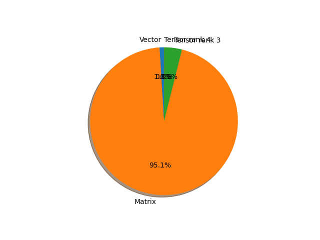

# mnasnet0_75 parameter information

**Number of layers: [ 158 ]**

**Number of parameters: [ 3.17M ]**

**Proportional of each form** (%)

| Vector | Matrix | Tensor rank 3 | Tensor rank 4 | 
|  --- | --- | --- | --- |
| 66.46 | 22.15 | 10.76 | 0.63 | 
**Proportional of parameters by form** (%)

| Vector | Matrix | Tensor rank 3 | Tensor rank 4 | 
|  --- | --- | --- | --- |
| 0.97 | 95.12 | 3.89 | 0.02 | 

**Layer information**

| Name | Shape | Squeezed shape | Number of parameters | Form |
| --- | --- | --- | --- | --- |
| layers.0.weight | (24, 3, 3, 3) | (24, 3, 3, 3) | 648 | Tensor rank 4 |
| layers.1.weight | (24,) | (24,) | 24 | Vector |
| layers.1.bias | (24,) | (24,) | 24 | Vector |
| layers.3.weight | (24, 1, 3, 3) | (24, 3, 3) | 216 | Tensor rank 3 |
| layers.4.weight | (24,) | (24,) | 24 | Vector |
| layers.4.bias | (24,) | (24,) | 24 | Vector |
| layers.6.weight | (16, 24, 1, 1) | (16, 24) | 384 | Matrix |
| layers.7.weight | (16,) | (16,) | 16 | Vector |
| layers.7.bias | (16,) | (16,) | 16 | Vector |
| layers.8.0.layers.0.weight | (48, 16, 1, 1) | (48, 16) | 768 | Matrix |
| layers.8.0.layers.1.weight | (48,) | (48,) | 48 | Vector |
| layers.8.0.layers.1.bias | (48,) | (48,) | 48 | Vector |
| layers.8.0.layers.3.weight | (48, 1, 3, 3) | (48, 3, 3) | 432 | Tensor rank 3 |
| layers.8.0.layers.4.weight | (48,) | (48,) | 48 | Vector |
| layers.8.0.layers.4.bias | (48,) | (48,) | 48 | Vector |
| layers.8.0.layers.6.weight | (24, 48, 1, 1) | (24, 48) | 1152 | Matrix |
| layers.8.0.layers.7.weight | (24,) | (24,) | 24 | Vector |
| layers.8.0.layers.7.bias | (24,) | (24,) | 24 | Vector |
| layers.8.1.layers.0.weight | (72, 24, 1, 1) | (72, 24) | 1728 | Matrix |
| layers.8.1.layers.1.weight | (72,) | (72,) | 72 | Vector |
| layers.8.1.layers.1.bias | (72,) | (72,) | 72 | Vector |
| layers.8.1.layers.3.weight | (72, 1, 3, 3) | (72, 3, 3) | 648 | Tensor rank 3 |
| layers.8.1.layers.4.weight | (72,) | (72,) | 72 | Vector |
| layers.8.1.layers.4.bias | (72,) | (72,) | 72 | Vector |
| layers.8.1.layers.6.weight | (24, 72, 1, 1) | (24, 72) | 1728 | Matrix |
| layers.8.1.layers.7.weight | (24,) | (24,) | 24 | Vector |
| layers.8.1.layers.7.bias | (24,) | (24,) | 24 | Vector |
| layers.8.2.layers.0.weight | (72, 24, 1, 1) | (72, 24) | 1728 | Matrix |
| layers.8.2.layers.1.weight | (72,) | (72,) | 72 | Vector |
| layers.8.2.layers.1.bias | (72,) | (72,) | 72 | Vector |
| layers.8.2.layers.3.weight | (72, 1, 3, 3) | (72, 3, 3) | 648 | Tensor rank 3 |
| layers.8.2.layers.4.weight | (72,) | (72,) | 72 | Vector |
| layers.8.2.layers.4.bias | (72,) | (72,) | 72 | Vector |
| layers.8.2.layers.6.weight | (24, 72, 1, 1) | (24, 72) | 1728 | Matrix |
| layers.8.2.layers.7.weight | (24,) | (24,) | 24 | Vector |
| layers.8.2.layers.7.bias | (24,) | (24,) | 24 | Vector |
| layers.9.0.layers.0.weight | (72, 24, 1, 1) | (72, 24) | 1728 | Matrix |
| layers.9.0.layers.1.weight | (72,) | (72,) | 72 | Vector |
| layers.9.0.layers.1.bias | (72,) | (72,) | 72 | Vector |
| layers.9.0.layers.3.weight | (72, 1, 5, 5) | (72, 5, 5) | 1800 | Tensor rank 3 |
| layers.9.0.layers.4.weight | (72,) | (72,) | 72 | Vector |
| layers.9.0.layers.4.bias | (72,) | (72,) | 72 | Vector |
| layers.9.0.layers.6.weight | (32, 72, 1, 1) | (32, 72) | 2304 | Matrix |
| layers.9.0.layers.7.weight | (32,) | (32,) | 32 | Vector |
| layers.9.0.layers.7.bias | (32,) | (32,) | 32 | Vector |
| layers.9.1.layers.0.weight | (96, 32, 1, 1) | (96, 32) | 3072 | Matrix |
| layers.9.1.layers.1.weight | (96,) | (96,) | 96 | Vector |
| layers.9.1.layers.1.bias | (96,) | (96,) | 96 | Vector |
| layers.9.1.layers.3.weight | (96, 1, 5, 5) | (96, 5, 5) | 2400 | Tensor rank 3 |
| layers.9.1.layers.4.weight | (96,) | (96,) | 96 | Vector |
| layers.9.1.layers.4.bias | (96,) | (96,) | 96 | Vector |
| layers.9.1.layers.6.weight | (32, 96, 1, 1) | (32, 96) | 3072 | Matrix |
| layers.9.1.layers.7.weight | (32,) | (32,) | 32 | Vector |
| layers.9.1.layers.7.bias | (32,) | (32,) | 32 | Vector |
| layers.9.2.layers.0.weight | (96, 32, 1, 1) | (96, 32) | 3072 | Matrix |
| layers.9.2.layers.1.weight | (96,) | (96,) | 96 | Vector |
| layers.9.2.layers.1.bias | (96,) | (96,) | 96 | Vector |
| layers.9.2.layers.3.weight | (96, 1, 5, 5) | (96, 5, 5) | 2400 | Tensor rank 3 |
| layers.9.2.layers.4.weight | (96,) | (96,) | 96 | Vector |
| layers.9.2.layers.4.bias | (96,) | (96,) | 96 | Vector |
| layers.9.2.layers.6.weight | (32, 96, 1, 1) | (32, 96) | 3072 | Matrix |
| layers.9.2.layers.7.weight | (32,) | (32,) | 32 | Vector |
| layers.9.2.layers.7.bias | (32,) | (32,) | 32 | Vector |
| layers.10.0.layers.0.weight | (192, 32, 1, 1) | (192, 32) | 6144 | Matrix |
| layers.10.0.layers.1.weight | (192,) | (192,) | 192 | Vector |
| layers.10.0.layers.1.bias | (192,) | (192,) | 192 | Vector |
| layers.10.0.layers.3.weight | (192, 1, 5, 5) | (192, 5, 5) | 4800 | Tensor rank 3 |
| layers.10.0.layers.4.weight | (192,) | (192,) | 192 | Vector |
| layers.10.0.layers.4.bias | (192,) | (192,) | 192 | Vector |
| layers.10.0.layers.6.weight | (64, 192, 1, 1) | (64, 192) | 12288 | Matrix |
| layers.10.0.layers.7.weight | (64,) | (64,) | 64 | Vector |
| layers.10.0.layers.7.bias | (64,) | (64,) | 64 | Vector |
| layers.10.1.layers.0.weight | (384, 64, 1, 1) | (384, 64) | 24576 | Matrix |
| layers.10.1.layers.1.weight | (384,) | (384,) | 384 | Vector |
| layers.10.1.layers.1.bias | (384,) | (384,) | 384 | Vector |
| layers.10.1.layers.3.weight | (384, 1, 5, 5) | (384, 5, 5) | 9600 | Tensor rank 3 |
| layers.10.1.layers.4.weight | (384,) | (384,) | 384 | Vector |
| layers.10.1.layers.4.bias | (384,) | (384,) | 384 | Vector |
| layers.10.1.layers.6.weight | (64, 384, 1, 1) | (64, 384) | 24576 | Matrix |
| layers.10.1.layers.7.weight | (64,) | (64,) | 64 | Vector |
| layers.10.1.layers.7.bias | (64,) | (64,) | 64 | Vector |
| layers.10.2.layers.0.weight | (384, 64, 1, 1) | (384, 64) | 24576 | Matrix |
| layers.10.2.layers.1.weight | (384,) | (384,) | 384 | Vector |
| layers.10.2.layers.1.bias | (384,) | (384,) | 384 | Vector |
| layers.10.2.layers.3.weight | (384, 1, 5, 5) | (384, 5, 5) | 9600 | Tensor rank 3 |
| layers.10.2.layers.4.weight | (384,) | (384,) | 384 | Vector |
| layers.10.2.layers.4.bias | (384,) | (384,) | 384 | Vector |
| layers.10.2.layers.6.weight | (64, 384, 1, 1) | (64, 384) | 24576 | Matrix |
| layers.10.2.layers.7.weight | (64,) | (64,) | 64 | Vector |
| layers.10.2.layers.7.bias | (64,) | (64,) | 64 | Vector |
| layers.11.0.layers.0.weight | (384, 64, 1, 1) | (384, 64) | 24576 | Matrix |
| layers.11.0.layers.1.weight | (384,) | (384,) | 384 | Vector |
| layers.11.0.layers.1.bias | (384,) | (384,) | 384 | Vector |
| layers.11.0.layers.3.weight | (384, 1, 3, 3) | (384, 3, 3) | 3456 | Tensor rank 3 |
| layers.11.0.layers.4.weight | (384,) | (384,) | 384 | Vector |
| layers.11.0.layers.4.bias | (384,) | (384,) | 384 | Vector |
| layers.11.0.layers.6.weight | (72, 384, 1, 1) | (72, 384) | 27648 | Matrix |
| layers.11.0.layers.7.weight | (72,) | (72,) | 72 | Vector |
| layers.11.0.layers.7.bias | (72,) | (72,) | 72 | Vector |
| layers.11.1.layers.0.weight | (432, 72, 1, 1) | (432, 72) | 31104 | Matrix |
| layers.11.1.layers.1.weight | (432,) | (432,) | 432 | Vector |
| layers.11.1.layers.1.bias | (432,) | (432,) | 432 | Vector |
| layers.11.1.layers.3.weight | (432, 1, 3, 3) | (432, 3, 3) | 3888 | Tensor rank 3 |
| layers.11.1.layers.4.weight | (432,) | (432,) | 432 | Vector |
| layers.11.1.layers.4.bias | (432,) | (432,) | 432 | Vector |
| layers.11.1.layers.6.weight | (72, 432, 1, 1) | (72, 432) | 31104 | Matrix |
| layers.11.1.layers.7.weight | (72,) | (72,) | 72 | Vector |
| layers.11.1.layers.7.bias | (72,) | (72,) | 72 | Vector |
| layers.12.0.layers.0.weight | (432, 72, 1, 1) | (432, 72) | 31104 | Matrix |
| layers.12.0.layers.1.weight | (432,) | (432,) | 432 | Vector |
| layers.12.0.layers.1.bias | (432,) | (432,) | 432 | Vector |
| layers.12.0.layers.3.weight | (432, 1, 5, 5) | (432, 5, 5) | 10800 | Tensor rank 3 |
| layers.12.0.layers.4.weight | (432,) | (432,) | 432 | Vector |
| layers.12.0.layers.4.bias | (432,) | (432,) | 432 | Vector |
| layers.12.0.layers.6.weight | (144, 432, 1, 1) | (144, 432) | 62208 | Matrix |
| layers.12.0.layers.7.weight | (144,) | (144,) | 144 | Vector |
| layers.12.0.layers.7.bias | (144,) | (144,) | 144 | Vector |
| layers.12.1.layers.0.weight | (864, 144, 1, 1) | (864, 144) | 124416 | Matrix |
| layers.12.1.layers.1.weight | (864,) | (864,) | 864 | Vector |
| layers.12.1.layers.1.bias | (864,) | (864,) | 864 | Vector |
| layers.12.1.layers.3.weight | (864, 1, 5, 5) | (864, 5, 5) | 21600 | Tensor rank 3 |
| layers.12.1.layers.4.weight | (864,) | (864,) | 864 | Vector |
| layers.12.1.layers.4.bias | (864,) | (864,) | 864 | Vector |
| layers.12.1.layers.6.weight | (144, 864, 1, 1) | (144, 864) | 124416 | Matrix |
| layers.12.1.layers.7.weight | (144,) | (144,) | 144 | Vector |
| layers.12.1.layers.7.bias | (144,) | (144,) | 144 | Vector |
| layers.12.2.layers.0.weight | (864, 144, 1, 1) | (864, 144) | 124416 | Matrix |
| layers.12.2.layers.1.weight | (864,) | (864,) | 864 | Vector |
| layers.12.2.layers.1.bias | (864,) | (864,) | 864 | Vector |
| layers.12.2.layers.3.weight | (864, 1, 5, 5) | (864, 5, 5) | 21600 | Tensor rank 3 |
| layers.12.2.layers.4.weight | (864,) | (864,) | 864 | Vector |
| layers.12.2.layers.4.bias | (864,) | (864,) | 864 | Vector |
| layers.12.2.layers.6.weight | (144, 864, 1, 1) | (144, 864) | 124416 | Matrix |
| layers.12.2.layers.7.weight | (144,) | (144,) | 144 | Vector |
| layers.12.2.layers.7.bias | (144,) | (144,) | 144 | Vector |
| layers.12.3.layers.0.weight | (864, 144, 1, 1) | (864, 144) | 124416 | Matrix |
| layers.12.3.layers.1.weight | (864,) | (864,) | 864 | Vector |
| layers.12.3.layers.1.bias | (864,) | (864,) | 864 | Vector |
| layers.12.3.layers.3.weight | (864, 1, 5, 5) | (864, 5, 5) | 21600 | Tensor rank 3 |
| layers.12.3.layers.4.weight | (864,) | (864,) | 864 | Vector |
| layers.12.3.layers.4.bias | (864,) | (864,) | 864 | Vector |
| layers.12.3.layers.6.weight | (144, 864, 1, 1) | (144, 864) | 124416 | Matrix |
| layers.12.3.layers.7.weight | (144,) | (144,) | 144 | Vector |
| layers.12.3.layers.7.bias | (144,) | (144,) | 144 | Vector |
| layers.13.0.layers.0.weight | (864, 144, 1, 1) | (864, 144) | 124416 | Matrix |
| layers.13.0.layers.1.weight | (864,) | (864,) | 864 | Vector |
| layers.13.0.layers.1.bias | (864,) | (864,) | 864 | Vector |
| layers.13.0.layers.3.weight | (864, 1, 3, 3) | (864, 3, 3) | 7776 | Tensor rank 3 |
| layers.13.0.layers.4.weight | (864,) | (864,) | 864 | Vector |
| layers.13.0.layers.4.bias | (864,) | (864,) | 864 | Vector |
| layers.13.0.layers.6.weight | (240, 864, 1, 1) | (240, 864) | 207360 | Matrix |
| layers.13.0.layers.7.weight | (240,) | (240,) | 240 | Vector |
| layers.13.0.layers.7.bias | (240,) | (240,) | 240 | Vector |
| layers.14.weight | (1280, 240, 1, 1) | (1280, 240) | 307200 | Matrix |
| layers.15.weight | (1280,) | (1280,) | 1280 | Vector |
| layers.15.bias | (1280,) | (1280,) | 1280 | Vector |
| classifier.1.weight | (1000, 1280) | (1000, 1280) | 1280000 | Matrix |
| classifier.1.bias | (1000,) | (1000,) | 1000 | Vector |

