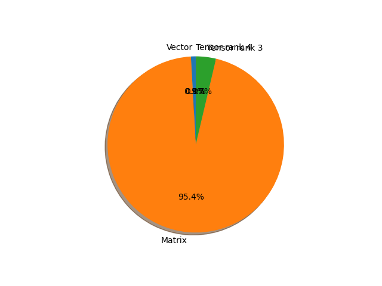

# mnasnet1_0 parameter information

**Number of layers: [ 158 ]**

**Number of parameters: [ 4.38M ]**

**Proportional of each form** (%)

| Vector | Matrix | Tensor rank 3 | Tensor rank 4 | 
|  --- | --- | --- | --- |
| 66.46 | 22.15 | 10.76 | 0.63 | 
**Proportional of parameters by form** (%)

| Vector | Matrix | Tensor rank 3 | Tensor rank 4 | 
|  --- | --- | --- | --- |
| 0.89 | 95.43 | 3.66 | 0.02 | 

**Layer information**

| Name | Shape | Squeezed shape | Number of parameters | Form |
| --- | --- | --- | --- | --- |
| layers.0.weight | (32, 3, 3, 3) | (32, 3, 3, 3) | 864 | Tensor rank 4 |
| layers.1.weight | (32,) | (32,) | 32 | Vector |
| layers.1.bias | (32,) | (32,) | 32 | Vector |
| layers.3.weight | (32, 1, 3, 3) | (32, 3, 3) | 288 | Tensor rank 3 |
| layers.4.weight | (32,) | (32,) | 32 | Vector |
| layers.4.bias | (32,) | (32,) | 32 | Vector |
| layers.6.weight | (16, 32, 1, 1) | (16, 32) | 512 | Matrix |
| layers.7.weight | (16,) | (16,) | 16 | Vector |
| layers.7.bias | (16,) | (16,) | 16 | Vector |
| layers.8.0.layers.0.weight | (48, 16, 1, 1) | (48, 16) | 768 | Matrix |
| layers.8.0.layers.1.weight | (48,) | (48,) | 48 | Vector |
| layers.8.0.layers.1.bias | (48,) | (48,) | 48 | Vector |
| layers.8.0.layers.3.weight | (48, 1, 3, 3) | (48, 3, 3) | 432 | Tensor rank 3 |
| layers.8.0.layers.4.weight | (48,) | (48,) | 48 | Vector |
| layers.8.0.layers.4.bias | (48,) | (48,) | 48 | Vector |
| layers.8.0.layers.6.weight | (24, 48, 1, 1) | (24, 48) | 1152 | Matrix |
| layers.8.0.layers.7.weight | (24,) | (24,) | 24 | Vector |
| layers.8.0.layers.7.bias | (24,) | (24,) | 24 | Vector |
| layers.8.1.layers.0.weight | (72, 24, 1, 1) | (72, 24) | 1728 | Matrix |
| layers.8.1.layers.1.weight | (72,) | (72,) | 72 | Vector |
| layers.8.1.layers.1.bias | (72,) | (72,) | 72 | Vector |
| layers.8.1.layers.3.weight | (72, 1, 3, 3) | (72, 3, 3) | 648 | Tensor rank 3 |
| layers.8.1.layers.4.weight | (72,) | (72,) | 72 | Vector |
| layers.8.1.layers.4.bias | (72,) | (72,) | 72 | Vector |
| layers.8.1.layers.6.weight | (24, 72, 1, 1) | (24, 72) | 1728 | Matrix |
| layers.8.1.layers.7.weight | (24,) | (24,) | 24 | Vector |
| layers.8.1.layers.7.bias | (24,) | (24,) | 24 | Vector |
| layers.8.2.layers.0.weight | (72, 24, 1, 1) | (72, 24) | 1728 | Matrix |
| layers.8.2.layers.1.weight | (72,) | (72,) | 72 | Vector |
| layers.8.2.layers.1.bias | (72,) | (72,) | 72 | Vector |
| layers.8.2.layers.3.weight | (72, 1, 3, 3) | (72, 3, 3) | 648 | Tensor rank 3 |
| layers.8.2.layers.4.weight | (72,) | (72,) | 72 | Vector |
| layers.8.2.layers.4.bias | (72,) | (72,) | 72 | Vector |
| layers.8.2.layers.6.weight | (24, 72, 1, 1) | (24, 72) | 1728 | Matrix |
| layers.8.2.layers.7.weight | (24,) | (24,) | 24 | Vector |
| layers.8.2.layers.7.bias | (24,) | (24,) | 24 | Vector |
| layers.9.0.layers.0.weight | (72, 24, 1, 1) | (72, 24) | 1728 | Matrix |
| layers.9.0.layers.1.weight | (72,) | (72,) | 72 | Vector |
| layers.9.0.layers.1.bias | (72,) | (72,) | 72 | Vector |
| layers.9.0.layers.3.weight | (72, 1, 5, 5) | (72, 5, 5) | 1800 | Tensor rank 3 |
| layers.9.0.layers.4.weight | (72,) | (72,) | 72 | Vector |
| layers.9.0.layers.4.bias | (72,) | (72,) | 72 | Vector |
| layers.9.0.layers.6.weight | (40, 72, 1, 1) | (40, 72) | 2880 | Matrix |
| layers.9.0.layers.7.weight | (40,) | (40,) | 40 | Vector |
| layers.9.0.layers.7.bias | (40,) | (40,) | 40 | Vector |
| layers.9.1.layers.0.weight | (120, 40, 1, 1) | (120, 40) | 4800 | Matrix |
| layers.9.1.layers.1.weight | (120,) | (120,) | 120 | Vector |
| layers.9.1.layers.1.bias | (120,) | (120,) | 120 | Vector |
| layers.9.1.layers.3.weight | (120, 1, 5, 5) | (120, 5, 5) | 3000 | Tensor rank 3 |
| layers.9.1.layers.4.weight | (120,) | (120,) | 120 | Vector |
| layers.9.1.layers.4.bias | (120,) | (120,) | 120 | Vector |
| layers.9.1.layers.6.weight | (40, 120, 1, 1) | (40, 120) | 4800 | Matrix |
| layers.9.1.layers.7.weight | (40,) | (40,) | 40 | Vector |
| layers.9.1.layers.7.bias | (40,) | (40,) | 40 | Vector |
| layers.9.2.layers.0.weight | (120, 40, 1, 1) | (120, 40) | 4800 | Matrix |
| layers.9.2.layers.1.weight | (120,) | (120,) | 120 | Vector |
| layers.9.2.layers.1.bias | (120,) | (120,) | 120 | Vector |
| layers.9.2.layers.3.weight | (120, 1, 5, 5) | (120, 5, 5) | 3000 | Tensor rank 3 |
| layers.9.2.layers.4.weight | (120,) | (120,) | 120 | Vector |
| layers.9.2.layers.4.bias | (120,) | (120,) | 120 | Vector |
| layers.9.2.layers.6.weight | (40, 120, 1, 1) | (40, 120) | 4800 | Matrix |
| layers.9.2.layers.7.weight | (40,) | (40,) | 40 | Vector |
| layers.9.2.layers.7.bias | (40,) | (40,) | 40 | Vector |
| layers.10.0.layers.0.weight | (240, 40, 1, 1) | (240, 40) | 9600 | Matrix |
| layers.10.0.layers.1.weight | (240,) | (240,) | 240 | Vector |
| layers.10.0.layers.1.bias | (240,) | (240,) | 240 | Vector |
| layers.10.0.layers.3.weight | (240, 1, 5, 5) | (240, 5, 5) | 6000 | Tensor rank 3 |
| layers.10.0.layers.4.weight | (240,) | (240,) | 240 | Vector |
| layers.10.0.layers.4.bias | (240,) | (240,) | 240 | Vector |
| layers.10.0.layers.6.weight | (80, 240, 1, 1) | (80, 240) | 19200 | Matrix |
| layers.10.0.layers.7.weight | (80,) | (80,) | 80 | Vector |
| layers.10.0.layers.7.bias | (80,) | (80,) | 80 | Vector |
| layers.10.1.layers.0.weight | (480, 80, 1, 1) | (480, 80) | 38400 | Matrix |
| layers.10.1.layers.1.weight | (480,) | (480,) | 480 | Vector |
| layers.10.1.layers.1.bias | (480,) | (480,) | 480 | Vector |
| layers.10.1.layers.3.weight | (480, 1, 5, 5) | (480, 5, 5) | 12000 | Tensor rank 3 |
| layers.10.1.layers.4.weight | (480,) | (480,) | 480 | Vector |
| layers.10.1.layers.4.bias | (480,) | (480,) | 480 | Vector |
| layers.10.1.layers.6.weight | (80, 480, 1, 1) | (80, 480) | 38400 | Matrix |
| layers.10.1.layers.7.weight | (80,) | (80,) | 80 | Vector |
| layers.10.1.layers.7.bias | (80,) | (80,) | 80 | Vector |
| layers.10.2.layers.0.weight | (480, 80, 1, 1) | (480, 80) | 38400 | Matrix |
| layers.10.2.layers.1.weight | (480,) | (480,) | 480 | Vector |
| layers.10.2.layers.1.bias | (480,) | (480,) | 480 | Vector |
| layers.10.2.layers.3.weight | (480, 1, 5, 5) | (480, 5, 5) | 12000 | Tensor rank 3 |
| layers.10.2.layers.4.weight | (480,) | (480,) | 480 | Vector |
| layers.10.2.layers.4.bias | (480,) | (480,) | 480 | Vector |
| layers.10.2.layers.6.weight | (80, 480, 1, 1) | (80, 480) | 38400 | Matrix |
| layers.10.2.layers.7.weight | (80,) | (80,) | 80 | Vector |
| layers.10.2.layers.7.bias | (80,) | (80,) | 80 | Vector |
| layers.11.0.layers.0.weight | (480, 80, 1, 1) | (480, 80) | 38400 | Matrix |
| layers.11.0.layers.1.weight | (480,) | (480,) | 480 | Vector |
| layers.11.0.layers.1.bias | (480,) | (480,) | 480 | Vector |
| layers.11.0.layers.3.weight | (480, 1, 3, 3) | (480, 3, 3) | 4320 | Tensor rank 3 |
| layers.11.0.layers.4.weight | (480,) | (480,) | 480 | Vector |
| layers.11.0.layers.4.bias | (480,) | (480,) | 480 | Vector |
| layers.11.0.layers.6.weight | (96, 480, 1, 1) | (96, 480) | 46080 | Matrix |
| layers.11.0.layers.7.weight | (96,) | (96,) | 96 | Vector |
| layers.11.0.layers.7.bias | (96,) | (96,) | 96 | Vector |
| layers.11.1.layers.0.weight | (576, 96, 1, 1) | (576, 96) | 55296 | Matrix |
| layers.11.1.layers.1.weight | (576,) | (576,) | 576 | Vector |
| layers.11.1.layers.1.bias | (576,) | (576,) | 576 | Vector |
| layers.11.1.layers.3.weight | (576, 1, 3, 3) | (576, 3, 3) | 5184 | Tensor rank 3 |
| layers.11.1.layers.4.weight | (576,) | (576,) | 576 | Vector |
| layers.11.1.layers.4.bias | (576,) | (576,) | 576 | Vector |
| layers.11.1.layers.6.weight | (96, 576, 1, 1) | (96, 576) | 55296 | Matrix |
| layers.11.1.layers.7.weight | (96,) | (96,) | 96 | Vector |
| layers.11.1.layers.7.bias | (96,) | (96,) | 96 | Vector |
| layers.12.0.layers.0.weight | (576, 96, 1, 1) | (576, 96) | 55296 | Matrix |
| layers.12.0.layers.1.weight | (576,) | (576,) | 576 | Vector |
| layers.12.0.layers.1.bias | (576,) | (576,) | 576 | Vector |
| layers.12.0.layers.3.weight | (576, 1, 5, 5) | (576, 5, 5) | 14400 | Tensor rank 3 |
| layers.12.0.layers.4.weight | (576,) | (576,) | 576 | Vector |
| layers.12.0.layers.4.bias | (576,) | (576,) | 576 | Vector |
| layers.12.0.layers.6.weight | (192, 576, 1, 1) | (192, 576) | 110592 | Matrix |
| layers.12.0.layers.7.weight | (192,) | (192,) | 192 | Vector |
| layers.12.0.layers.7.bias | (192,) | (192,) | 192 | Vector |
| layers.12.1.layers.0.weight | (1152, 192, 1, 1) | (1152, 192) | 221184 | Matrix |
| layers.12.1.layers.1.weight | (1152,) | (1152,) | 1152 | Vector |
| layers.12.1.layers.1.bias | (1152,) | (1152,) | 1152 | Vector |
| layers.12.1.layers.3.weight | (1152, 1, 5, 5) | (1152, 5, 5) | 28800 | Tensor rank 3 |
| layers.12.1.layers.4.weight | (1152,) | (1152,) | 1152 | Vector |
| layers.12.1.layers.4.bias | (1152,) | (1152,) | 1152 | Vector |
| layers.12.1.layers.6.weight | (192, 1152, 1, 1) | (192, 1152) | 221184 | Matrix |
| layers.12.1.layers.7.weight | (192,) | (192,) | 192 | Vector |
| layers.12.1.layers.7.bias | (192,) | (192,) | 192 | Vector |
| layers.12.2.layers.0.weight | (1152, 192, 1, 1) | (1152, 192) | 221184 | Matrix |
| layers.12.2.layers.1.weight | (1152,) | (1152,) | 1152 | Vector |
| layers.12.2.layers.1.bias | (1152,) | (1152,) | 1152 | Vector |
| layers.12.2.layers.3.weight | (1152, 1, 5, 5) | (1152, 5, 5) | 28800 | Tensor rank 3 |
| layers.12.2.layers.4.weight | (1152,) | (1152,) | 1152 | Vector |
| layers.12.2.layers.4.bias | (1152,) | (1152,) | 1152 | Vector |
| layers.12.2.layers.6.weight | (192, 1152, 1, 1) | (192, 1152) | 221184 | Matrix |
| layers.12.2.layers.7.weight | (192,) | (192,) | 192 | Vector |
| layers.12.2.layers.7.bias | (192,) | (192,) | 192 | Vector |
| layers.12.3.layers.0.weight | (1152, 192, 1, 1) | (1152, 192) | 221184 | Matrix |
| layers.12.3.layers.1.weight | (1152,) | (1152,) | 1152 | Vector |
| layers.12.3.layers.1.bias | (1152,) | (1152,) | 1152 | Vector |
| layers.12.3.layers.3.weight | (1152, 1, 5, 5) | (1152, 5, 5) | 28800 | Tensor rank 3 |
| layers.12.3.layers.4.weight | (1152,) | (1152,) | 1152 | Vector |
| layers.12.3.layers.4.bias | (1152,) | (1152,) | 1152 | Vector |
| layers.12.3.layers.6.weight | (192, 1152, 1, 1) | (192, 1152) | 221184 | Matrix |
| layers.12.3.layers.7.weight | (192,) | (192,) | 192 | Vector |
| layers.12.3.layers.7.bias | (192,) | (192,) | 192 | Vector |
| layers.13.0.layers.0.weight | (1152, 192, 1, 1) | (1152, 192) | 221184 | Matrix |
| layers.13.0.layers.1.weight | (1152,) | (1152,) | 1152 | Vector |
| layers.13.0.layers.1.bias | (1152,) | (1152,) | 1152 | Vector |
| layers.13.0.layers.3.weight | (1152, 1, 3, 3) | (1152, 3, 3) | 10368 | Tensor rank 3 |
| layers.13.0.layers.4.weight | (1152,) | (1152,) | 1152 | Vector |
| layers.13.0.layers.4.bias | (1152,) | (1152,) | 1152 | Vector |
| layers.13.0.layers.6.weight | (320, 1152, 1, 1) | (320, 1152) | 368640 | Matrix |
| layers.13.0.layers.7.weight | (320,) | (320,) | 320 | Vector |
| layers.13.0.layers.7.bias | (320,) | (320,) | 320 | Vector |
| layers.14.weight | (1280, 320, 1, 1) | (1280, 320) | 409600 | Matrix |
| layers.15.weight | (1280,) | (1280,) | 1280 | Vector |
| layers.15.bias | (1280,) | (1280,) | 1280 | Vector |
| classifier.1.weight | (1000, 1280) | (1000, 1280) | 1280000 | Matrix |
| classifier.1.bias | (1000,) | (1000,) | 1000 | Vector |

