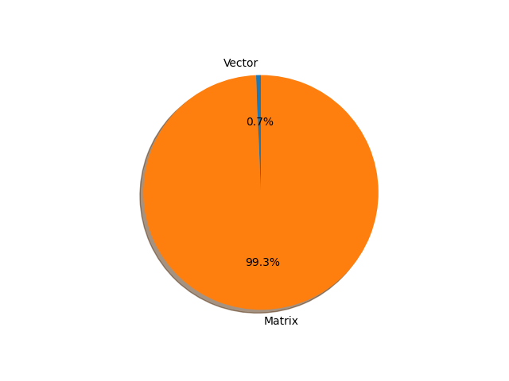

# mobilebert parameter information

**Number of layers: [ 1113 ]**

**Number of parameters: [ 24.84M ]**

**Proportional of each form** (%)

| Vector | Matrix | 
|  --- | --- |
| 67.21 | 32.79 | 

**Proportional of parameters by form** (%)

| Vector | Matrix | 
|  --- | --- |
| 0.65 | 99.35 | 

**Layer information**

| Name | Shape | Squeezed shape | Number of parameters | Form |
| --- | --- | --- | --- | --- |
| embeddings.word_embeddings.weight | (30522, 128) | (30522, 128) | 3906816 | Matrix |
| embeddings.position_embeddings.weight | (512, 512) | (512, 512) | 262144 | Matrix |
| embeddings.token_type_embeddings.weight | (2, 512) | (2, 512) | 1024 | Matrix |
| embeddings.embedding_transformation.weight | (512, 384) | (512, 384) | 196608 | Matrix |
| embeddings.embedding_transformation.bias | (512,) | (512,) | 512 | Vector |
| embeddings.LayerNorm.bias | (512,) | (512,) | 512 | Vector |
| embeddings.LayerNorm.weight | (512,) | (512,) | 512 | Vector |
| encoder.layer.0.attention.self.query.weight | (128, 128) | (128, 128) | 16384 | Matrix |
| encoder.layer.0.attention.self.query.bias | (128,) | (128,) | 128 | Vector |
| encoder.layer.0.attention.self.key.weight | (128, 128) | (128, 128) | 16384 | Matrix |
| encoder.layer.0.attention.self.key.bias | (128,) | (128,) | 128 | Vector |
| encoder.layer.0.attention.self.value.weight | (128, 512) | (128, 512) | 65536 | Matrix |
| encoder.layer.0.attention.self.value.bias | (128,) | (128,) | 128 | Vector |
| encoder.layer.0.attention.output.dense.weight | (128, 128) | (128, 128) | 16384 | Matrix |
| encoder.layer.0.attention.output.dense.bias | (128,) | (128,) | 128 | Vector |
| encoder.layer.0.attention.output.LayerNorm.bias | (128,) | (128,) | 128 | Vector |
| encoder.layer.0.attention.output.LayerNorm.weight | (128,) | (128,) | 128 | Vector |
| encoder.layer.0.intermediate.dense.weight | (512, 128) | (512, 128) | 65536 | Matrix |
| encoder.layer.0.intermediate.dense.bias | (512,) | (512,) | 512 | Vector |
| encoder.layer.0.output.dense.weight | (128, 512) | (128, 512) | 65536 | Matrix |
| encoder.layer.0.output.dense.bias | (128,) | (128,) | 128 | Vector |
| encoder.layer.0.output.LayerNorm.bias | (128,) | (128,) | 128 | Vector |
| encoder.layer.0.output.LayerNorm.weight | (128,) | (128,) | 128 | Vector |
| encoder.layer.0.output.bottleneck.dense.weight | (512, 128) | (512, 128) | 65536 | Matrix |
| encoder.layer.0.output.bottleneck.dense.bias | (512,) | (512,) | 512 | Vector |
| encoder.layer.0.output.bottleneck.LayerNorm.bias | (512,) | (512,) | 512 | Vector |
| encoder.layer.0.output.bottleneck.LayerNorm.weight | (512,) | (512,) | 512 | Vector |
| encoder.layer.0.bottleneck.input.dense.weight | (128, 512) | (128, 512) | 65536 | Matrix |
| encoder.layer.0.bottleneck.input.dense.bias | (128,) | (128,) | 128 | Vector |
| encoder.layer.0.bottleneck.input.LayerNorm.bias | (128,) | (128,) | 128 | Vector |
| encoder.layer.0.bottleneck.input.LayerNorm.weight | (128,) | (128,) | 128 | Vector |
| encoder.layer.0.bottleneck.attention.dense.weight | (128, 512) | (128, 512) | 65536 | Matrix |
| encoder.layer.0.bottleneck.attention.dense.bias | (128,) | (128,) | 128 | Vector |
| encoder.layer.0.bottleneck.attention.LayerNorm.bias | (128,) | (128,) | 128 | Vector |
| encoder.layer.0.bottleneck.attention.LayerNorm.weight | (128,) | (128,) | 128 | Vector |
| encoder.layer.0.ffn.0.intermediate.dense.weight | (512, 128) | (512, 128) | 65536 | Matrix |
| encoder.layer.0.ffn.0.intermediate.dense.bias | (512,) | (512,) | 512 | Vector |
| encoder.layer.0.ffn.0.output.dense.weight | (128, 512) | (128, 512) | 65536 | Matrix |
| encoder.layer.0.ffn.0.output.dense.bias | (128,) | (128,) | 128 | Vector |
| encoder.layer.0.ffn.0.output.LayerNorm.bias | (128,) | (128,) | 128 | Vector |
| encoder.layer.0.ffn.0.output.LayerNorm.weight | (128,) | (128,) | 128 | Vector |
| encoder.layer.0.ffn.1.intermediate.dense.weight | (512, 128) | (512, 128) | 65536 | Matrix |
| encoder.layer.0.ffn.1.intermediate.dense.bias | (512,) | (512,) | 512 | Vector |
| encoder.layer.0.ffn.1.output.dense.weight | (128, 512) | (128, 512) | 65536 | Matrix |
| encoder.layer.0.ffn.1.output.dense.bias | (128,) | (128,) | 128 | Vector |
| encoder.layer.0.ffn.1.output.LayerNorm.bias | (128,) | (128,) | 128 | Vector |
| encoder.layer.0.ffn.1.output.LayerNorm.weight | (128,) | (128,) | 128 | Vector |
| encoder.layer.0.ffn.2.intermediate.dense.weight | (512, 128) | (512, 128) | 65536 | Matrix |
| encoder.layer.0.ffn.2.intermediate.dense.bias | (512,) | (512,) | 512 | Vector |
| encoder.layer.0.ffn.2.output.dense.weight | (128, 512) | (128, 512) | 65536 | Matrix |
| encoder.layer.0.ffn.2.output.dense.bias | (128,) | (128,) | 128 | Vector |
| encoder.layer.0.ffn.2.output.LayerNorm.bias | (128,) | (128,) | 128 | Vector |
| encoder.layer.0.ffn.2.output.LayerNorm.weight | (128,) | (128,) | 128 | Vector |
| encoder.layer.1.attention.self.query.weight | (128, 128) | (128, 128) | 16384 | Matrix |
| encoder.layer.1.attention.self.query.bias | (128,) | (128,) | 128 | Vector |
| encoder.layer.1.attention.self.key.weight | (128, 128) | (128, 128) | 16384 | Matrix |
| encoder.layer.1.attention.self.key.bias | (128,) | (128,) | 128 | Vector |
| encoder.layer.1.attention.self.value.weight | (128, 512) | (128, 512) | 65536 | Matrix |
| encoder.layer.1.attention.self.value.bias | (128,) | (128,) | 128 | Vector |
| encoder.layer.1.attention.output.dense.weight | (128, 128) | (128, 128) | 16384 | Matrix |
| encoder.layer.1.attention.output.dense.bias | (128,) | (128,) | 128 | Vector |
| encoder.layer.1.attention.output.LayerNorm.bias | (128,) | (128,) | 128 | Vector |
| encoder.layer.1.attention.output.LayerNorm.weight | (128,) | (128,) | 128 | Vector |
| encoder.layer.1.intermediate.dense.weight | (512, 128) | (512, 128) | 65536 | Matrix |
| encoder.layer.1.intermediate.dense.bias | (512,) | (512,) | 512 | Vector |
| encoder.layer.1.output.dense.weight | (128, 512) | (128, 512) | 65536 | Matrix |
| encoder.layer.1.output.dense.bias | (128,) | (128,) | 128 | Vector |
| encoder.layer.1.output.LayerNorm.bias | (128,) | (128,) | 128 | Vector |
| encoder.layer.1.output.LayerNorm.weight | (128,) | (128,) | 128 | Vector |
| encoder.layer.1.output.bottleneck.dense.weight | (512, 128) | (512, 128) | 65536 | Matrix |
| encoder.layer.1.output.bottleneck.dense.bias | (512,) | (512,) | 512 | Vector |
| encoder.layer.1.output.bottleneck.LayerNorm.bias | (512,) | (512,) | 512 | Vector |
| encoder.layer.1.output.bottleneck.LayerNorm.weight | (512,) | (512,) | 512 | Vector |
| encoder.layer.1.bottleneck.input.dense.weight | (128, 512) | (128, 512) | 65536 | Matrix |
| encoder.layer.1.bottleneck.input.dense.bias | (128,) | (128,) | 128 | Vector |
| encoder.layer.1.bottleneck.input.LayerNorm.bias | (128,) | (128,) | 128 | Vector |
| encoder.layer.1.bottleneck.input.LayerNorm.weight | (128,) | (128,) | 128 | Vector |
| encoder.layer.1.bottleneck.attention.dense.weight | (128, 512) | (128, 512) | 65536 | Matrix |
| encoder.layer.1.bottleneck.attention.dense.bias | (128,) | (128,) | 128 | Vector |
| encoder.layer.1.bottleneck.attention.LayerNorm.bias | (128,) | (128,) | 128 | Vector |
| encoder.layer.1.bottleneck.attention.LayerNorm.weight | (128,) | (128,) | 128 | Vector |
| encoder.layer.1.ffn.0.intermediate.dense.weight | (512, 128) | (512, 128) | 65536 | Matrix |
| encoder.layer.1.ffn.0.intermediate.dense.bias | (512,) | (512,) | 512 | Vector |
| encoder.layer.1.ffn.0.output.dense.weight | (128, 512) | (128, 512) | 65536 | Matrix |
| encoder.layer.1.ffn.0.output.dense.bias | (128,) | (128,) | 128 | Vector |
| encoder.layer.1.ffn.0.output.LayerNorm.bias | (128,) | (128,) | 128 | Vector |
| encoder.layer.1.ffn.0.output.LayerNorm.weight | (128,) | (128,) | 128 | Vector |
| encoder.layer.1.ffn.1.intermediate.dense.weight | (512, 128) | (512, 128) | 65536 | Matrix |
| encoder.layer.1.ffn.1.intermediate.dense.bias | (512,) | (512,) | 512 | Vector |
| encoder.layer.1.ffn.1.output.dense.weight | (128, 512) | (128, 512) | 65536 | Matrix |
| encoder.layer.1.ffn.1.output.dense.bias | (128,) | (128,) | 128 | Vector |
| encoder.layer.1.ffn.1.output.LayerNorm.bias | (128,) | (128,) | 128 | Vector |
| encoder.layer.1.ffn.1.output.LayerNorm.weight | (128,) | (128,) | 128 | Vector |
| encoder.layer.1.ffn.2.intermediate.dense.weight | (512, 128) | (512, 128) | 65536 | Matrix |
| encoder.layer.1.ffn.2.intermediate.dense.bias | (512,) | (512,) | 512 | Vector |
| encoder.layer.1.ffn.2.output.dense.weight | (128, 512) | (128, 512) | 65536 | Matrix |
| encoder.layer.1.ffn.2.output.dense.bias | (128,) | (128,) | 128 | Vector |
| encoder.layer.1.ffn.2.output.LayerNorm.bias | (128,) | (128,) | 128 | Vector |
| encoder.layer.1.ffn.2.output.LayerNorm.weight | (128,) | (128,) | 128 | Vector |
| encoder.layer.2.attention.self.query.weight | (128, 128) | (128, 128) | 16384 | Matrix |
| encoder.layer.2.attention.self.query.bias | (128,) | (128,) | 128 | Vector |
| encoder.layer.2.attention.self.key.weight | (128, 128) | (128, 128) | 16384 | Matrix |
| encoder.layer.2.attention.self.key.bias | (128,) | (128,) | 128 | Vector |
| encoder.layer.2.attention.self.value.weight | (128, 512) | (128, 512) | 65536 | Matrix |
| encoder.layer.2.attention.self.value.bias | (128,) | (128,) | 128 | Vector |
| encoder.layer.2.attention.output.dense.weight | (128, 128) | (128, 128) | 16384 | Matrix |
| encoder.layer.2.attention.output.dense.bias | (128,) | (128,) | 128 | Vector |
| encoder.layer.2.attention.output.LayerNorm.bias | (128,) | (128,) | 128 | Vector |
| encoder.layer.2.attention.output.LayerNorm.weight | (128,) | (128,) | 128 | Vector |
| encoder.layer.2.intermediate.dense.weight | (512, 128) | (512, 128) | 65536 | Matrix |
| encoder.layer.2.intermediate.dense.bias | (512,) | (512,) | 512 | Vector |
| encoder.layer.2.output.dense.weight | (128, 512) | (128, 512) | 65536 | Matrix |
| encoder.layer.2.output.dense.bias | (128,) | (128,) | 128 | Vector |
| encoder.layer.2.output.LayerNorm.bias | (128,) | (128,) | 128 | Vector |
| encoder.layer.2.output.LayerNorm.weight | (128,) | (128,) | 128 | Vector |
| encoder.layer.2.output.bottleneck.dense.weight | (512, 128) | (512, 128) | 65536 | Matrix |
| encoder.layer.2.output.bottleneck.dense.bias | (512,) | (512,) | 512 | Vector |
| encoder.layer.2.output.bottleneck.LayerNorm.bias | (512,) | (512,) | 512 | Vector |
| encoder.layer.2.output.bottleneck.LayerNorm.weight | (512,) | (512,) | 512 | Vector |
| encoder.layer.2.bottleneck.input.dense.weight | (128, 512) | (128, 512) | 65536 | Matrix |
| encoder.layer.2.bottleneck.input.dense.bias | (128,) | (128,) | 128 | Vector |
| encoder.layer.2.bottleneck.input.LayerNorm.bias | (128,) | (128,) | 128 | Vector |
| encoder.layer.2.bottleneck.input.LayerNorm.weight | (128,) | (128,) | 128 | Vector |
| encoder.layer.2.bottleneck.attention.dense.weight | (128, 512) | (128, 512) | 65536 | Matrix |
| encoder.layer.2.bottleneck.attention.dense.bias | (128,) | (128,) | 128 | Vector |
| encoder.layer.2.bottleneck.attention.LayerNorm.bias | (128,) | (128,) | 128 | Vector |
| encoder.layer.2.bottleneck.attention.LayerNorm.weight | (128,) | (128,) | 128 | Vector |
| encoder.layer.2.ffn.0.intermediate.dense.weight | (512, 128) | (512, 128) | 65536 | Matrix |
| encoder.layer.2.ffn.0.intermediate.dense.bias | (512,) | (512,) | 512 | Vector |
| encoder.layer.2.ffn.0.output.dense.weight | (128, 512) | (128, 512) | 65536 | Matrix |
| encoder.layer.2.ffn.0.output.dense.bias | (128,) | (128,) | 128 | Vector |
| encoder.layer.2.ffn.0.output.LayerNorm.bias | (128,) | (128,) | 128 | Vector |
| encoder.layer.2.ffn.0.output.LayerNorm.weight | (128,) | (128,) | 128 | Vector |
| encoder.layer.2.ffn.1.intermediate.dense.weight | (512, 128) | (512, 128) | 65536 | Matrix |
| encoder.layer.2.ffn.1.intermediate.dense.bias | (512,) | (512,) | 512 | Vector |
| encoder.layer.2.ffn.1.output.dense.weight | (128, 512) | (128, 512) | 65536 | Matrix |
| encoder.layer.2.ffn.1.output.dense.bias | (128,) | (128,) | 128 | Vector |
| encoder.layer.2.ffn.1.output.LayerNorm.bias | (128,) | (128,) | 128 | Vector |
| encoder.layer.2.ffn.1.output.LayerNorm.weight | (128,) | (128,) | 128 | Vector |
| encoder.layer.2.ffn.2.intermediate.dense.weight | (512, 128) | (512, 128) | 65536 | Matrix |
| encoder.layer.2.ffn.2.intermediate.dense.bias | (512,) | (512,) | 512 | Vector |
| encoder.layer.2.ffn.2.output.dense.weight | (128, 512) | (128, 512) | 65536 | Matrix |
| encoder.layer.2.ffn.2.output.dense.bias | (128,) | (128,) | 128 | Vector |
| encoder.layer.2.ffn.2.output.LayerNorm.bias | (128,) | (128,) | 128 | Vector |
| encoder.layer.2.ffn.2.output.LayerNorm.weight | (128,) | (128,) | 128 | Vector |
| encoder.layer.3.attention.self.query.weight | (128, 128) | (128, 128) | 16384 | Matrix |
| encoder.layer.3.attention.self.query.bias | (128,) | (128,) | 128 | Vector |
| encoder.layer.3.attention.self.key.weight | (128, 128) | (128, 128) | 16384 | Matrix |
| encoder.layer.3.attention.self.key.bias | (128,) | (128,) | 128 | Vector |
| encoder.layer.3.attention.self.value.weight | (128, 512) | (128, 512) | 65536 | Matrix |
| encoder.layer.3.attention.self.value.bias | (128,) | (128,) | 128 | Vector |
| encoder.layer.3.attention.output.dense.weight | (128, 128) | (128, 128) | 16384 | Matrix |
| encoder.layer.3.attention.output.dense.bias | (128,) | (128,) | 128 | Vector |
| encoder.layer.3.attention.output.LayerNorm.bias | (128,) | (128,) | 128 | Vector |
| encoder.layer.3.attention.output.LayerNorm.weight | (128,) | (128,) | 128 | Vector |
| encoder.layer.3.intermediate.dense.weight | (512, 128) | (512, 128) | 65536 | Matrix |
| encoder.layer.3.intermediate.dense.bias | (512,) | (512,) | 512 | Vector |
| encoder.layer.3.output.dense.weight | (128, 512) | (128, 512) | 65536 | Matrix |
| encoder.layer.3.output.dense.bias | (128,) | (128,) | 128 | Vector |
| encoder.layer.3.output.LayerNorm.bias | (128,) | (128,) | 128 | Vector |
| encoder.layer.3.output.LayerNorm.weight | (128,) | (128,) | 128 | Vector |
| encoder.layer.3.output.bottleneck.dense.weight | (512, 128) | (512, 128) | 65536 | Matrix |
| encoder.layer.3.output.bottleneck.dense.bias | (512,) | (512,) | 512 | Vector |
| encoder.layer.3.output.bottleneck.LayerNorm.bias | (512,) | (512,) | 512 | Vector |
| encoder.layer.3.output.bottleneck.LayerNorm.weight | (512,) | (512,) | 512 | Vector |
| encoder.layer.3.bottleneck.input.dense.weight | (128, 512) | (128, 512) | 65536 | Matrix |
| encoder.layer.3.bottleneck.input.dense.bias | (128,) | (128,) | 128 | Vector |
| encoder.layer.3.bottleneck.input.LayerNorm.bias | (128,) | (128,) | 128 | Vector |
| encoder.layer.3.bottleneck.input.LayerNorm.weight | (128,) | (128,) | 128 | Vector |
| encoder.layer.3.bottleneck.attention.dense.weight | (128, 512) | (128, 512) | 65536 | Matrix |
| encoder.layer.3.bottleneck.attention.dense.bias | (128,) | (128,) | 128 | Vector |
| encoder.layer.3.bottleneck.attention.LayerNorm.bias | (128,) | (128,) | 128 | Vector |
| encoder.layer.3.bottleneck.attention.LayerNorm.weight | (128,) | (128,) | 128 | Vector |
| encoder.layer.3.ffn.0.intermediate.dense.weight | (512, 128) | (512, 128) | 65536 | Matrix |
| encoder.layer.3.ffn.0.intermediate.dense.bias | (512,) | (512,) | 512 | Vector |
| encoder.layer.3.ffn.0.output.dense.weight | (128, 512) | (128, 512) | 65536 | Matrix |
| encoder.layer.3.ffn.0.output.dense.bias | (128,) | (128,) | 128 | Vector |
| encoder.layer.3.ffn.0.output.LayerNorm.bias | (128,) | (128,) | 128 | Vector |
| encoder.layer.3.ffn.0.output.LayerNorm.weight | (128,) | (128,) | 128 | Vector |
| encoder.layer.3.ffn.1.intermediate.dense.weight | (512, 128) | (512, 128) | 65536 | Matrix |
| encoder.layer.3.ffn.1.intermediate.dense.bias | (512,) | (512,) | 512 | Vector |
| encoder.layer.3.ffn.1.output.dense.weight | (128, 512) | (128, 512) | 65536 | Matrix |
| encoder.layer.3.ffn.1.output.dense.bias | (128,) | (128,) | 128 | Vector |
| encoder.layer.3.ffn.1.output.LayerNorm.bias | (128,) | (128,) | 128 | Vector |
| encoder.layer.3.ffn.1.output.LayerNorm.weight | (128,) | (128,) | 128 | Vector |
| encoder.layer.3.ffn.2.intermediate.dense.weight | (512, 128) | (512, 128) | 65536 | Matrix |
| encoder.layer.3.ffn.2.intermediate.dense.bias | (512,) | (512,) | 512 | Vector |
| encoder.layer.3.ffn.2.output.dense.weight | (128, 512) | (128, 512) | 65536 | Matrix |
| encoder.layer.3.ffn.2.output.dense.bias | (128,) | (128,) | 128 | Vector |
| encoder.layer.3.ffn.2.output.LayerNorm.bias | (128,) | (128,) | 128 | Vector |
| encoder.layer.3.ffn.2.output.LayerNorm.weight | (128,) | (128,) | 128 | Vector |
| encoder.layer.4.attention.self.query.weight | (128, 128) | (128, 128) | 16384 | Matrix |
| encoder.layer.4.attention.self.query.bias | (128,) | (128,) | 128 | Vector |
| encoder.layer.4.attention.self.key.weight | (128, 128) | (128, 128) | 16384 | Matrix |
| encoder.layer.4.attention.self.key.bias | (128,) | (128,) | 128 | Vector |
| encoder.layer.4.attention.self.value.weight | (128, 512) | (128, 512) | 65536 | Matrix |
| encoder.layer.4.attention.self.value.bias | (128,) | (128,) | 128 | Vector |
| encoder.layer.4.attention.output.dense.weight | (128, 128) | (128, 128) | 16384 | Matrix |
| encoder.layer.4.attention.output.dense.bias | (128,) | (128,) | 128 | Vector |
| encoder.layer.4.attention.output.LayerNorm.bias | (128,) | (128,) | 128 | Vector |
| encoder.layer.4.attention.output.LayerNorm.weight | (128,) | (128,) | 128 | Vector |
| encoder.layer.4.intermediate.dense.weight | (512, 128) | (512, 128) | 65536 | Matrix |
| encoder.layer.4.intermediate.dense.bias | (512,) | (512,) | 512 | Vector |
| encoder.layer.4.output.dense.weight | (128, 512) | (128, 512) | 65536 | Matrix |
| encoder.layer.4.output.dense.bias | (128,) | (128,) | 128 | Vector |
| encoder.layer.4.output.LayerNorm.bias | (128,) | (128,) | 128 | Vector |
| encoder.layer.4.output.LayerNorm.weight | (128,) | (128,) | 128 | Vector |
| encoder.layer.4.output.bottleneck.dense.weight | (512, 128) | (512, 128) | 65536 | Matrix |
| encoder.layer.4.output.bottleneck.dense.bias | (512,) | (512,) | 512 | Vector |
| encoder.layer.4.output.bottleneck.LayerNorm.bias | (512,) | (512,) | 512 | Vector |
| encoder.layer.4.output.bottleneck.LayerNorm.weight | (512,) | (512,) | 512 | Vector |
| encoder.layer.4.bottleneck.input.dense.weight | (128, 512) | (128, 512) | 65536 | Matrix |
| encoder.layer.4.bottleneck.input.dense.bias | (128,) | (128,) | 128 | Vector |
| encoder.layer.4.bottleneck.input.LayerNorm.bias | (128,) | (128,) | 128 | Vector |
| encoder.layer.4.bottleneck.input.LayerNorm.weight | (128,) | (128,) | 128 | Vector |
| encoder.layer.4.bottleneck.attention.dense.weight | (128, 512) | (128, 512) | 65536 | Matrix |
| encoder.layer.4.bottleneck.attention.dense.bias | (128,) | (128,) | 128 | Vector |
| encoder.layer.4.bottleneck.attention.LayerNorm.bias | (128,) | (128,) | 128 | Vector |
| encoder.layer.4.bottleneck.attention.LayerNorm.weight | (128,) | (128,) | 128 | Vector |
| encoder.layer.4.ffn.0.intermediate.dense.weight | (512, 128) | (512, 128) | 65536 | Matrix |
| encoder.layer.4.ffn.0.intermediate.dense.bias | (512,) | (512,) | 512 | Vector |
| encoder.layer.4.ffn.0.output.dense.weight | (128, 512) | (128, 512) | 65536 | Matrix |
| encoder.layer.4.ffn.0.output.dense.bias | (128,) | (128,) | 128 | Vector |
| encoder.layer.4.ffn.0.output.LayerNorm.bias | (128,) | (128,) | 128 | Vector |
| encoder.layer.4.ffn.0.output.LayerNorm.weight | (128,) | (128,) | 128 | Vector |
| encoder.layer.4.ffn.1.intermediate.dense.weight | (512, 128) | (512, 128) | 65536 | Matrix |
| encoder.layer.4.ffn.1.intermediate.dense.bias | (512,) | (512,) | 512 | Vector |
| encoder.layer.4.ffn.1.output.dense.weight | (128, 512) | (128, 512) | 65536 | Matrix |
| encoder.layer.4.ffn.1.output.dense.bias | (128,) | (128,) | 128 | Vector |
| encoder.layer.4.ffn.1.output.LayerNorm.bias | (128,) | (128,) | 128 | Vector |
| encoder.layer.4.ffn.1.output.LayerNorm.weight | (128,) | (128,) | 128 | Vector |
| encoder.layer.4.ffn.2.intermediate.dense.weight | (512, 128) | (512, 128) | 65536 | Matrix |
| encoder.layer.4.ffn.2.intermediate.dense.bias | (512,) | (512,) | 512 | Vector |
| encoder.layer.4.ffn.2.output.dense.weight | (128, 512) | (128, 512) | 65536 | Matrix |
| encoder.layer.4.ffn.2.output.dense.bias | (128,) | (128,) | 128 | Vector |
| encoder.layer.4.ffn.2.output.LayerNorm.bias | (128,) | (128,) | 128 | Vector |
| encoder.layer.4.ffn.2.output.LayerNorm.weight | (128,) | (128,) | 128 | Vector |
| encoder.layer.5.attention.self.query.weight | (128, 128) | (128, 128) | 16384 | Matrix |
| encoder.layer.5.attention.self.query.bias | (128,) | (128,) | 128 | Vector |
| encoder.layer.5.attention.self.key.weight | (128, 128) | (128, 128) | 16384 | Matrix |
| encoder.layer.5.attention.self.key.bias | (128,) | (128,) | 128 | Vector |
| encoder.layer.5.attention.self.value.weight | (128, 512) | (128, 512) | 65536 | Matrix |
| encoder.layer.5.attention.self.value.bias | (128,) | (128,) | 128 | Vector |
| encoder.layer.5.attention.output.dense.weight | (128, 128) | (128, 128) | 16384 | Matrix |
| encoder.layer.5.attention.output.dense.bias | (128,) | (128,) | 128 | Vector |
| encoder.layer.5.attention.output.LayerNorm.bias | (128,) | (128,) | 128 | Vector |
| encoder.layer.5.attention.output.LayerNorm.weight | (128,) | (128,) | 128 | Vector |
| encoder.layer.5.intermediate.dense.weight | (512, 128) | (512, 128) | 65536 | Matrix |
| encoder.layer.5.intermediate.dense.bias | (512,) | (512,) | 512 | Vector |
| encoder.layer.5.output.dense.weight | (128, 512) | (128, 512) | 65536 | Matrix |
| encoder.layer.5.output.dense.bias | (128,) | (128,) | 128 | Vector |
| encoder.layer.5.output.LayerNorm.bias | (128,) | (128,) | 128 | Vector |
| encoder.layer.5.output.LayerNorm.weight | (128,) | (128,) | 128 | Vector |
| encoder.layer.5.output.bottleneck.dense.weight | (512, 128) | (512, 128) | 65536 | Matrix |
| encoder.layer.5.output.bottleneck.dense.bias | (512,) | (512,) | 512 | Vector |
| encoder.layer.5.output.bottleneck.LayerNorm.bias | (512,) | (512,) | 512 | Vector |
| encoder.layer.5.output.bottleneck.LayerNorm.weight | (512,) | (512,) | 512 | Vector |
| encoder.layer.5.bottleneck.input.dense.weight | (128, 512) | (128, 512) | 65536 | Matrix |
| encoder.layer.5.bottleneck.input.dense.bias | (128,) | (128,) | 128 | Vector |
| encoder.layer.5.bottleneck.input.LayerNorm.bias | (128,) | (128,) | 128 | Vector |
| encoder.layer.5.bottleneck.input.LayerNorm.weight | (128,) | (128,) | 128 | Vector |
| encoder.layer.5.bottleneck.attention.dense.weight | (128, 512) | (128, 512) | 65536 | Matrix |
| encoder.layer.5.bottleneck.attention.dense.bias | (128,) | (128,) | 128 | Vector |
| encoder.layer.5.bottleneck.attention.LayerNorm.bias | (128,) | (128,) | 128 | Vector |
| encoder.layer.5.bottleneck.attention.LayerNorm.weight | (128,) | (128,) | 128 | Vector |
| encoder.layer.5.ffn.0.intermediate.dense.weight | (512, 128) | (512, 128) | 65536 | Matrix |
| encoder.layer.5.ffn.0.intermediate.dense.bias | (512,) | (512,) | 512 | Vector |
| encoder.layer.5.ffn.0.output.dense.weight | (128, 512) | (128, 512) | 65536 | Matrix |
| encoder.layer.5.ffn.0.output.dense.bias | (128,) | (128,) | 128 | Vector |
| encoder.layer.5.ffn.0.output.LayerNorm.bias | (128,) | (128,) | 128 | Vector |
| encoder.layer.5.ffn.0.output.LayerNorm.weight | (128,) | (128,) | 128 | Vector |
| encoder.layer.5.ffn.1.intermediate.dense.weight | (512, 128) | (512, 128) | 65536 | Matrix |
| encoder.layer.5.ffn.1.intermediate.dense.bias | (512,) | (512,) | 512 | Vector |
| encoder.layer.5.ffn.1.output.dense.weight | (128, 512) | (128, 512) | 65536 | Matrix |
| encoder.layer.5.ffn.1.output.dense.bias | (128,) | (128,) | 128 | Vector |
| encoder.layer.5.ffn.1.output.LayerNorm.bias | (128,) | (128,) | 128 | Vector |
| encoder.layer.5.ffn.1.output.LayerNorm.weight | (128,) | (128,) | 128 | Vector |
| encoder.layer.5.ffn.2.intermediate.dense.weight | (512, 128) | (512, 128) | 65536 | Matrix |
| encoder.layer.5.ffn.2.intermediate.dense.bias | (512,) | (512,) | 512 | Vector |
| encoder.layer.5.ffn.2.output.dense.weight | (128, 512) | (128, 512) | 65536 | Matrix |
| encoder.layer.5.ffn.2.output.dense.bias | (128,) | (128,) | 128 | Vector |
| encoder.layer.5.ffn.2.output.LayerNorm.bias | (128,) | (128,) | 128 | Vector |
| encoder.layer.5.ffn.2.output.LayerNorm.weight | (128,) | (128,) | 128 | Vector |
| encoder.layer.6.attention.self.query.weight | (128, 128) | (128, 128) | 16384 | Matrix |
| encoder.layer.6.attention.self.query.bias | (128,) | (128,) | 128 | Vector |
| encoder.layer.6.attention.self.key.weight | (128, 128) | (128, 128) | 16384 | Matrix |
| encoder.layer.6.attention.self.key.bias | (128,) | (128,) | 128 | Vector |
| encoder.layer.6.attention.self.value.weight | (128, 512) | (128, 512) | 65536 | Matrix |
| encoder.layer.6.attention.self.value.bias | (128,) | (128,) | 128 | Vector |
| encoder.layer.6.attention.output.dense.weight | (128, 128) | (128, 128) | 16384 | Matrix |
| encoder.layer.6.attention.output.dense.bias | (128,) | (128,) | 128 | Vector |
| encoder.layer.6.attention.output.LayerNorm.bias | (128,) | (128,) | 128 | Vector |
| encoder.layer.6.attention.output.LayerNorm.weight | (128,) | (128,) | 128 | Vector |
| encoder.layer.6.intermediate.dense.weight | (512, 128) | (512, 128) | 65536 | Matrix |
| encoder.layer.6.intermediate.dense.bias | (512,) | (512,) | 512 | Vector |
| encoder.layer.6.output.dense.weight | (128, 512) | (128, 512) | 65536 | Matrix |
| encoder.layer.6.output.dense.bias | (128,) | (128,) | 128 | Vector |
| encoder.layer.6.output.LayerNorm.bias | (128,) | (128,) | 128 | Vector |
| encoder.layer.6.output.LayerNorm.weight | (128,) | (128,) | 128 | Vector |
| encoder.layer.6.output.bottleneck.dense.weight | (512, 128) | (512, 128) | 65536 | Matrix |
| encoder.layer.6.output.bottleneck.dense.bias | (512,) | (512,) | 512 | Vector |
| encoder.layer.6.output.bottleneck.LayerNorm.bias | (512,) | (512,) | 512 | Vector |
| encoder.layer.6.output.bottleneck.LayerNorm.weight | (512,) | (512,) | 512 | Vector |
| encoder.layer.6.bottleneck.input.dense.weight | (128, 512) | (128, 512) | 65536 | Matrix |
| encoder.layer.6.bottleneck.input.dense.bias | (128,) | (128,) | 128 | Vector |
| encoder.layer.6.bottleneck.input.LayerNorm.bias | (128,) | (128,) | 128 | Vector |
| encoder.layer.6.bottleneck.input.LayerNorm.weight | (128,) | (128,) | 128 | Vector |
| encoder.layer.6.bottleneck.attention.dense.weight | (128, 512) | (128, 512) | 65536 | Matrix |
| encoder.layer.6.bottleneck.attention.dense.bias | (128,) | (128,) | 128 | Vector |
| encoder.layer.6.bottleneck.attention.LayerNorm.bias | (128,) | (128,) | 128 | Vector |
| encoder.layer.6.bottleneck.attention.LayerNorm.weight | (128,) | (128,) | 128 | Vector |
| encoder.layer.6.ffn.0.intermediate.dense.weight | (512, 128) | (512, 128) | 65536 | Matrix |
| encoder.layer.6.ffn.0.intermediate.dense.bias | (512,) | (512,) | 512 | Vector |
| encoder.layer.6.ffn.0.output.dense.weight | (128, 512) | (128, 512) | 65536 | Matrix |
| encoder.layer.6.ffn.0.output.dense.bias | (128,) | (128,) | 128 | Vector |
| encoder.layer.6.ffn.0.output.LayerNorm.bias | (128,) | (128,) | 128 | Vector |
| encoder.layer.6.ffn.0.output.LayerNorm.weight | (128,) | (128,) | 128 | Vector |
| encoder.layer.6.ffn.1.intermediate.dense.weight | (512, 128) | (512, 128) | 65536 | Matrix |
| encoder.layer.6.ffn.1.intermediate.dense.bias | (512,) | (512,) | 512 | Vector |
| encoder.layer.6.ffn.1.output.dense.weight | (128, 512) | (128, 512) | 65536 | Matrix |
| encoder.layer.6.ffn.1.output.dense.bias | (128,) | (128,) | 128 | Vector |
| encoder.layer.6.ffn.1.output.LayerNorm.bias | (128,) | (128,) | 128 | Vector |
| encoder.layer.6.ffn.1.output.LayerNorm.weight | (128,) | (128,) | 128 | Vector |
| encoder.layer.6.ffn.2.intermediate.dense.weight | (512, 128) | (512, 128) | 65536 | Matrix |
| encoder.layer.6.ffn.2.intermediate.dense.bias | (512,) | (512,) | 512 | Vector |
| encoder.layer.6.ffn.2.output.dense.weight | (128, 512) | (128, 512) | 65536 | Matrix |
| encoder.layer.6.ffn.2.output.dense.bias | (128,) | (128,) | 128 | Vector |
| encoder.layer.6.ffn.2.output.LayerNorm.bias | (128,) | (128,) | 128 | Vector |
| encoder.layer.6.ffn.2.output.LayerNorm.weight | (128,) | (128,) | 128 | Vector |
| encoder.layer.7.attention.self.query.weight | (128, 128) | (128, 128) | 16384 | Matrix |
| encoder.layer.7.attention.self.query.bias | (128,) | (128,) | 128 | Vector |
| encoder.layer.7.attention.self.key.weight | (128, 128) | (128, 128) | 16384 | Matrix |
| encoder.layer.7.attention.self.key.bias | (128,) | (128,) | 128 | Vector |
| encoder.layer.7.attention.self.value.weight | (128, 512) | (128, 512) | 65536 | Matrix |
| encoder.layer.7.attention.self.value.bias | (128,) | (128,) | 128 | Vector |
| encoder.layer.7.attention.output.dense.weight | (128, 128) | (128, 128) | 16384 | Matrix |
| encoder.layer.7.attention.output.dense.bias | (128,) | (128,) | 128 | Vector |
| encoder.layer.7.attention.output.LayerNorm.bias | (128,) | (128,) | 128 | Vector |
| encoder.layer.7.attention.output.LayerNorm.weight | (128,) | (128,) | 128 | Vector |
| encoder.layer.7.intermediate.dense.weight | (512, 128) | (512, 128) | 65536 | Matrix |
| encoder.layer.7.intermediate.dense.bias | (512,) | (512,) | 512 | Vector |
| encoder.layer.7.output.dense.weight | (128, 512) | (128, 512) | 65536 | Matrix |
| encoder.layer.7.output.dense.bias | (128,) | (128,) | 128 | Vector |
| encoder.layer.7.output.LayerNorm.bias | (128,) | (128,) | 128 | Vector |
| encoder.layer.7.output.LayerNorm.weight | (128,) | (128,) | 128 | Vector |
| encoder.layer.7.output.bottleneck.dense.weight | (512, 128) | (512, 128) | 65536 | Matrix |
| encoder.layer.7.output.bottleneck.dense.bias | (512,) | (512,) | 512 | Vector |
| encoder.layer.7.output.bottleneck.LayerNorm.bias | (512,) | (512,) | 512 | Vector |
| encoder.layer.7.output.bottleneck.LayerNorm.weight | (512,) | (512,) | 512 | Vector |
| encoder.layer.7.bottleneck.input.dense.weight | (128, 512) | (128, 512) | 65536 | Matrix |
| encoder.layer.7.bottleneck.input.dense.bias | (128,) | (128,) | 128 | Vector |
| encoder.layer.7.bottleneck.input.LayerNorm.bias | (128,) | (128,) | 128 | Vector |
| encoder.layer.7.bottleneck.input.LayerNorm.weight | (128,) | (128,) | 128 | Vector |
| encoder.layer.7.bottleneck.attention.dense.weight | (128, 512) | (128, 512) | 65536 | Matrix |
| encoder.layer.7.bottleneck.attention.dense.bias | (128,) | (128,) | 128 | Vector |
| encoder.layer.7.bottleneck.attention.LayerNorm.bias | (128,) | (128,) | 128 | Vector |
| encoder.layer.7.bottleneck.attention.LayerNorm.weight | (128,) | (128,) | 128 | Vector |
| encoder.layer.7.ffn.0.intermediate.dense.weight | (512, 128) | (512, 128) | 65536 | Matrix |
| encoder.layer.7.ffn.0.intermediate.dense.bias | (512,) | (512,) | 512 | Vector |
| encoder.layer.7.ffn.0.output.dense.weight | (128, 512) | (128, 512) | 65536 | Matrix |
| encoder.layer.7.ffn.0.output.dense.bias | (128,) | (128,) | 128 | Vector |
| encoder.layer.7.ffn.0.output.LayerNorm.bias | (128,) | (128,) | 128 | Vector |
| encoder.layer.7.ffn.0.output.LayerNorm.weight | (128,) | (128,) | 128 | Vector |
| encoder.layer.7.ffn.1.intermediate.dense.weight | (512, 128) | (512, 128) | 65536 | Matrix |
| encoder.layer.7.ffn.1.intermediate.dense.bias | (512,) | (512,) | 512 | Vector |
| encoder.layer.7.ffn.1.output.dense.weight | (128, 512) | (128, 512) | 65536 | Matrix |
| encoder.layer.7.ffn.1.output.dense.bias | (128,) | (128,) | 128 | Vector |
| encoder.layer.7.ffn.1.output.LayerNorm.bias | (128,) | (128,) | 128 | Vector |
| encoder.layer.7.ffn.1.output.LayerNorm.weight | (128,) | (128,) | 128 | Vector |
| encoder.layer.7.ffn.2.intermediate.dense.weight | (512, 128) | (512, 128) | 65536 | Matrix |
| encoder.layer.7.ffn.2.intermediate.dense.bias | (512,) | (512,) | 512 | Vector |
| encoder.layer.7.ffn.2.output.dense.weight | (128, 512) | (128, 512) | 65536 | Matrix |
| encoder.layer.7.ffn.2.output.dense.bias | (128,) | (128,) | 128 | Vector |
| encoder.layer.7.ffn.2.output.LayerNorm.bias | (128,) | (128,) | 128 | Vector |
| encoder.layer.7.ffn.2.output.LayerNorm.weight | (128,) | (128,) | 128 | Vector |
| encoder.layer.8.attention.self.query.weight | (128, 128) | (128, 128) | 16384 | Matrix |
| encoder.layer.8.attention.self.query.bias | (128,) | (128,) | 128 | Vector |
| encoder.layer.8.attention.self.key.weight | (128, 128) | (128, 128) | 16384 | Matrix |
| encoder.layer.8.attention.self.key.bias | (128,) | (128,) | 128 | Vector |
| encoder.layer.8.attention.self.value.weight | (128, 512) | (128, 512) | 65536 | Matrix |
| encoder.layer.8.attention.self.value.bias | (128,) | (128,) | 128 | Vector |
| encoder.layer.8.attention.output.dense.weight | (128, 128) | (128, 128) | 16384 | Matrix |
| encoder.layer.8.attention.output.dense.bias | (128,) | (128,) | 128 | Vector |
| encoder.layer.8.attention.output.LayerNorm.bias | (128,) | (128,) | 128 | Vector |
| encoder.layer.8.attention.output.LayerNorm.weight | (128,) | (128,) | 128 | Vector |
| encoder.layer.8.intermediate.dense.weight | (512, 128) | (512, 128) | 65536 | Matrix |
| encoder.layer.8.intermediate.dense.bias | (512,) | (512,) | 512 | Vector |
| encoder.layer.8.output.dense.weight | (128, 512) | (128, 512) | 65536 | Matrix |
| encoder.layer.8.output.dense.bias | (128,) | (128,) | 128 | Vector |
| encoder.layer.8.output.LayerNorm.bias | (128,) | (128,) | 128 | Vector |
| encoder.layer.8.output.LayerNorm.weight | (128,) | (128,) | 128 | Vector |
| encoder.layer.8.output.bottleneck.dense.weight | (512, 128) | (512, 128) | 65536 | Matrix |
| encoder.layer.8.output.bottleneck.dense.bias | (512,) | (512,) | 512 | Vector |
| encoder.layer.8.output.bottleneck.LayerNorm.bias | (512,) | (512,) | 512 | Vector |
| encoder.layer.8.output.bottleneck.LayerNorm.weight | (512,) | (512,) | 512 | Vector |
| encoder.layer.8.bottleneck.input.dense.weight | (128, 512) | (128, 512) | 65536 | Matrix |
| encoder.layer.8.bottleneck.input.dense.bias | (128,) | (128,) | 128 | Vector |
| encoder.layer.8.bottleneck.input.LayerNorm.bias | (128,) | (128,) | 128 | Vector |
| encoder.layer.8.bottleneck.input.LayerNorm.weight | (128,) | (128,) | 128 | Vector |
| encoder.layer.8.bottleneck.attention.dense.weight | (128, 512) | (128, 512) | 65536 | Matrix |
| encoder.layer.8.bottleneck.attention.dense.bias | (128,) | (128,) | 128 | Vector |
| encoder.layer.8.bottleneck.attention.LayerNorm.bias | (128,) | (128,) | 128 | Vector |
| encoder.layer.8.bottleneck.attention.LayerNorm.weight | (128,) | (128,) | 128 | Vector |
| encoder.layer.8.ffn.0.intermediate.dense.weight | (512, 128) | (512, 128) | 65536 | Matrix |
| encoder.layer.8.ffn.0.intermediate.dense.bias | (512,) | (512,) | 512 | Vector |
| encoder.layer.8.ffn.0.output.dense.weight | (128, 512) | (128, 512) | 65536 | Matrix |
| encoder.layer.8.ffn.0.output.dense.bias | (128,) | (128,) | 128 | Vector |
| encoder.layer.8.ffn.0.output.LayerNorm.bias | (128,) | (128,) | 128 | Vector |
| encoder.layer.8.ffn.0.output.LayerNorm.weight | (128,) | (128,) | 128 | Vector |
| encoder.layer.8.ffn.1.intermediate.dense.weight | (512, 128) | (512, 128) | 65536 | Matrix |
| encoder.layer.8.ffn.1.intermediate.dense.bias | (512,) | (512,) | 512 | Vector |
| encoder.layer.8.ffn.1.output.dense.weight | (128, 512) | (128, 512) | 65536 | Matrix |
| encoder.layer.8.ffn.1.output.dense.bias | (128,) | (128,) | 128 | Vector |
| encoder.layer.8.ffn.1.output.LayerNorm.bias | (128,) | (128,) | 128 | Vector |
| encoder.layer.8.ffn.1.output.LayerNorm.weight | (128,) | (128,) | 128 | Vector |
| encoder.layer.8.ffn.2.intermediate.dense.weight | (512, 128) | (512, 128) | 65536 | Matrix |
| encoder.layer.8.ffn.2.intermediate.dense.bias | (512,) | (512,) | 512 | Vector |
| encoder.layer.8.ffn.2.output.dense.weight | (128, 512) | (128, 512) | 65536 | Matrix |
| encoder.layer.8.ffn.2.output.dense.bias | (128,) | (128,) | 128 | Vector |
| encoder.layer.8.ffn.2.output.LayerNorm.bias | (128,) | (128,) | 128 | Vector |
| encoder.layer.8.ffn.2.output.LayerNorm.weight | (128,) | (128,) | 128 | Vector |
| encoder.layer.9.attention.self.query.weight | (128, 128) | (128, 128) | 16384 | Matrix |
| encoder.layer.9.attention.self.query.bias | (128,) | (128,) | 128 | Vector |
| encoder.layer.9.attention.self.key.weight | (128, 128) | (128, 128) | 16384 | Matrix |
| encoder.layer.9.attention.self.key.bias | (128,) | (128,) | 128 | Vector |
| encoder.layer.9.attention.self.value.weight | (128, 512) | (128, 512) | 65536 | Matrix |
| encoder.layer.9.attention.self.value.bias | (128,) | (128,) | 128 | Vector |
| encoder.layer.9.attention.output.dense.weight | (128, 128) | (128, 128) | 16384 | Matrix |
| encoder.layer.9.attention.output.dense.bias | (128,) | (128,) | 128 | Vector |
| encoder.layer.9.attention.output.LayerNorm.bias | (128,) | (128,) | 128 | Vector |
| encoder.layer.9.attention.output.LayerNorm.weight | (128,) | (128,) | 128 | Vector |
| encoder.layer.9.intermediate.dense.weight | (512, 128) | (512, 128) | 65536 | Matrix |
| encoder.layer.9.intermediate.dense.bias | (512,) | (512,) | 512 | Vector |
| encoder.layer.9.output.dense.weight | (128, 512) | (128, 512) | 65536 | Matrix |
| encoder.layer.9.output.dense.bias | (128,) | (128,) | 128 | Vector |
| encoder.layer.9.output.LayerNorm.bias | (128,) | (128,) | 128 | Vector |
| encoder.layer.9.output.LayerNorm.weight | (128,) | (128,) | 128 | Vector |
| encoder.layer.9.output.bottleneck.dense.weight | (512, 128) | (512, 128) | 65536 | Matrix |
| encoder.layer.9.output.bottleneck.dense.bias | (512,) | (512,) | 512 | Vector |
| encoder.layer.9.output.bottleneck.LayerNorm.bias | (512,) | (512,) | 512 | Vector |
| encoder.layer.9.output.bottleneck.LayerNorm.weight | (512,) | (512,) | 512 | Vector |
| encoder.layer.9.bottleneck.input.dense.weight | (128, 512) | (128, 512) | 65536 | Matrix |
| encoder.layer.9.bottleneck.input.dense.bias | (128,) | (128,) | 128 | Vector |
| encoder.layer.9.bottleneck.input.LayerNorm.bias | (128,) | (128,) | 128 | Vector |
| encoder.layer.9.bottleneck.input.LayerNorm.weight | (128,) | (128,) | 128 | Vector |
| encoder.layer.9.bottleneck.attention.dense.weight | (128, 512) | (128, 512) | 65536 | Matrix |
| encoder.layer.9.bottleneck.attention.dense.bias | (128,) | (128,) | 128 | Vector |
| encoder.layer.9.bottleneck.attention.LayerNorm.bias | (128,) | (128,) | 128 | Vector |
| encoder.layer.9.bottleneck.attention.LayerNorm.weight | (128,) | (128,) | 128 | Vector |
| encoder.layer.9.ffn.0.intermediate.dense.weight | (512, 128) | (512, 128) | 65536 | Matrix |
| encoder.layer.9.ffn.0.intermediate.dense.bias | (512,) | (512,) | 512 | Vector |
| encoder.layer.9.ffn.0.output.dense.weight | (128, 512) | (128, 512) | 65536 | Matrix |
| encoder.layer.9.ffn.0.output.dense.bias | (128,) | (128,) | 128 | Vector |
| encoder.layer.9.ffn.0.output.LayerNorm.bias | (128,) | (128,) | 128 | Vector |
| encoder.layer.9.ffn.0.output.LayerNorm.weight | (128,) | (128,) | 128 | Vector |
| encoder.layer.9.ffn.1.intermediate.dense.weight | (512, 128) | (512, 128) | 65536 | Matrix |
| encoder.layer.9.ffn.1.intermediate.dense.bias | (512,) | (512,) | 512 | Vector |
| encoder.layer.9.ffn.1.output.dense.weight | (128, 512) | (128, 512) | 65536 | Matrix |
| encoder.layer.9.ffn.1.output.dense.bias | (128,) | (128,) | 128 | Vector |
| encoder.layer.9.ffn.1.output.LayerNorm.bias | (128,) | (128,) | 128 | Vector |
| encoder.layer.9.ffn.1.output.LayerNorm.weight | (128,) | (128,) | 128 | Vector |
| encoder.layer.9.ffn.2.intermediate.dense.weight | (512, 128) | (512, 128) | 65536 | Matrix |
| encoder.layer.9.ffn.2.intermediate.dense.bias | (512,) | (512,) | 512 | Vector |
| encoder.layer.9.ffn.2.output.dense.weight | (128, 512) | (128, 512) | 65536 | Matrix |
| encoder.layer.9.ffn.2.output.dense.bias | (128,) | (128,) | 128 | Vector |
| encoder.layer.9.ffn.2.output.LayerNorm.bias | (128,) | (128,) | 128 | Vector |
| encoder.layer.9.ffn.2.output.LayerNorm.weight | (128,) | (128,) | 128 | Vector |
| encoder.layer.10.attention.self.query.weight | (128, 128) | (128, 128) | 16384 | Matrix |
| encoder.layer.10.attention.self.query.bias | (128,) | (128,) | 128 | Vector |
| encoder.layer.10.attention.self.key.weight | (128, 128) | (128, 128) | 16384 | Matrix |
| encoder.layer.10.attention.self.key.bias | (128,) | (128,) | 128 | Vector |
| encoder.layer.10.attention.self.value.weight | (128, 512) | (128, 512) | 65536 | Matrix |
| encoder.layer.10.attention.self.value.bias | (128,) | (128,) | 128 | Vector |
| encoder.layer.10.attention.output.dense.weight | (128, 128) | (128, 128) | 16384 | Matrix |
| encoder.layer.10.attention.output.dense.bias | (128,) | (128,) | 128 | Vector |
| encoder.layer.10.attention.output.LayerNorm.bias | (128,) | (128,) | 128 | Vector |
| encoder.layer.10.attention.output.LayerNorm.weight | (128,) | (128,) | 128 | Vector |
| encoder.layer.10.intermediate.dense.weight | (512, 128) | (512, 128) | 65536 | Matrix |
| encoder.layer.10.intermediate.dense.bias | (512,) | (512,) | 512 | Vector |
| encoder.layer.10.output.dense.weight | (128, 512) | (128, 512) | 65536 | Matrix |
| encoder.layer.10.output.dense.bias | (128,) | (128,) | 128 | Vector |
| encoder.layer.10.output.LayerNorm.bias | (128,) | (128,) | 128 | Vector |
| encoder.layer.10.output.LayerNorm.weight | (128,) | (128,) | 128 | Vector |
| encoder.layer.10.output.bottleneck.dense.weight | (512, 128) | (512, 128) | 65536 | Matrix |
| encoder.layer.10.output.bottleneck.dense.bias | (512,) | (512,) | 512 | Vector |
| encoder.layer.10.output.bottleneck.LayerNorm.bias | (512,) | (512,) | 512 | Vector |
| encoder.layer.10.output.bottleneck.LayerNorm.weight | (512,) | (512,) | 512 | Vector |
| encoder.layer.10.bottleneck.input.dense.weight | (128, 512) | (128, 512) | 65536 | Matrix |
| encoder.layer.10.bottleneck.input.dense.bias | (128,) | (128,) | 128 | Vector |
| encoder.layer.10.bottleneck.input.LayerNorm.bias | (128,) | (128,) | 128 | Vector |
| encoder.layer.10.bottleneck.input.LayerNorm.weight | (128,) | (128,) | 128 | Vector |
| encoder.layer.10.bottleneck.attention.dense.weight | (128, 512) | (128, 512) | 65536 | Matrix |
| encoder.layer.10.bottleneck.attention.dense.bias | (128,) | (128,) | 128 | Vector |
| encoder.layer.10.bottleneck.attention.LayerNorm.bias | (128,) | (128,) | 128 | Vector |
| encoder.layer.10.bottleneck.attention.LayerNorm.weight | (128,) | (128,) | 128 | Vector |
| encoder.layer.10.ffn.0.intermediate.dense.weight | (512, 128) | (512, 128) | 65536 | Matrix |
| encoder.layer.10.ffn.0.intermediate.dense.bias | (512,) | (512,) | 512 | Vector |
| encoder.layer.10.ffn.0.output.dense.weight | (128, 512) | (128, 512) | 65536 | Matrix |
| encoder.layer.10.ffn.0.output.dense.bias | (128,) | (128,) | 128 | Vector |
| encoder.layer.10.ffn.0.output.LayerNorm.bias | (128,) | (128,) | 128 | Vector |
| encoder.layer.10.ffn.0.output.LayerNorm.weight | (128,) | (128,) | 128 | Vector |
| encoder.layer.10.ffn.1.intermediate.dense.weight | (512, 128) | (512, 128) | 65536 | Matrix |
| encoder.layer.10.ffn.1.intermediate.dense.bias | (512,) | (512,) | 512 | Vector |
| encoder.layer.10.ffn.1.output.dense.weight | (128, 512) | (128, 512) | 65536 | Matrix |
| encoder.layer.10.ffn.1.output.dense.bias | (128,) | (128,) | 128 | Vector |
| encoder.layer.10.ffn.1.output.LayerNorm.bias | (128,) | (128,) | 128 | Vector |
| encoder.layer.10.ffn.1.output.LayerNorm.weight | (128,) | (128,) | 128 | Vector |
| encoder.layer.10.ffn.2.intermediate.dense.weight | (512, 128) | (512, 128) | 65536 | Matrix |
| encoder.layer.10.ffn.2.intermediate.dense.bias | (512,) | (512,) | 512 | Vector |
| encoder.layer.10.ffn.2.output.dense.weight | (128, 512) | (128, 512) | 65536 | Matrix |
| encoder.layer.10.ffn.2.output.dense.bias | (128,) | (128,) | 128 | Vector |
| encoder.layer.10.ffn.2.output.LayerNorm.bias | (128,) | (128,) | 128 | Vector |
| encoder.layer.10.ffn.2.output.LayerNorm.weight | (128,) | (128,) | 128 | Vector |
| encoder.layer.11.attention.self.query.weight | (128, 128) | (128, 128) | 16384 | Matrix |
| encoder.layer.11.attention.self.query.bias | (128,) | (128,) | 128 | Vector |
| encoder.layer.11.attention.self.key.weight | (128, 128) | (128, 128) | 16384 | Matrix |
| encoder.layer.11.attention.self.key.bias | (128,) | (128,) | 128 | Vector |
| encoder.layer.11.attention.self.value.weight | (128, 512) | (128, 512) | 65536 | Matrix |
| encoder.layer.11.attention.self.value.bias | (128,) | (128,) | 128 | Vector |
| encoder.layer.11.attention.output.dense.weight | (128, 128) | (128, 128) | 16384 | Matrix |
| encoder.layer.11.attention.output.dense.bias | (128,) | (128,) | 128 | Vector |
| encoder.layer.11.attention.output.LayerNorm.bias | (128,) | (128,) | 128 | Vector |
| encoder.layer.11.attention.output.LayerNorm.weight | (128,) | (128,) | 128 | Vector |
| encoder.layer.11.intermediate.dense.weight | (512, 128) | (512, 128) | 65536 | Matrix |
| encoder.layer.11.intermediate.dense.bias | (512,) | (512,) | 512 | Vector |
| encoder.layer.11.output.dense.weight | (128, 512) | (128, 512) | 65536 | Matrix |
| encoder.layer.11.output.dense.bias | (128,) | (128,) | 128 | Vector |
| encoder.layer.11.output.LayerNorm.bias | (128,) | (128,) | 128 | Vector |
| encoder.layer.11.output.LayerNorm.weight | (128,) | (128,) | 128 | Vector |
| encoder.layer.11.output.bottleneck.dense.weight | (512, 128) | (512, 128) | 65536 | Matrix |
| encoder.layer.11.output.bottleneck.dense.bias | (512,) | (512,) | 512 | Vector |
| encoder.layer.11.output.bottleneck.LayerNorm.bias | (512,) | (512,) | 512 | Vector |
| encoder.layer.11.output.bottleneck.LayerNorm.weight | (512,) | (512,) | 512 | Vector |
| encoder.layer.11.bottleneck.input.dense.weight | (128, 512) | (128, 512) | 65536 | Matrix |
| encoder.layer.11.bottleneck.input.dense.bias | (128,) | (128,) | 128 | Vector |
| encoder.layer.11.bottleneck.input.LayerNorm.bias | (128,) | (128,) | 128 | Vector |
| encoder.layer.11.bottleneck.input.LayerNorm.weight | (128,) | (128,) | 128 | Vector |
| encoder.layer.11.bottleneck.attention.dense.weight | (128, 512) | (128, 512) | 65536 | Matrix |
| encoder.layer.11.bottleneck.attention.dense.bias | (128,) | (128,) | 128 | Vector |
| encoder.layer.11.bottleneck.attention.LayerNorm.bias | (128,) | (128,) | 128 | Vector |
| encoder.layer.11.bottleneck.attention.LayerNorm.weight | (128,) | (128,) | 128 | Vector |
| encoder.layer.11.ffn.0.intermediate.dense.weight | (512, 128) | (512, 128) | 65536 | Matrix |
| encoder.layer.11.ffn.0.intermediate.dense.bias | (512,) | (512,) | 512 | Vector |
| encoder.layer.11.ffn.0.output.dense.weight | (128, 512) | (128, 512) | 65536 | Matrix |
| encoder.layer.11.ffn.0.output.dense.bias | (128,) | (128,) | 128 | Vector |
| encoder.layer.11.ffn.0.output.LayerNorm.bias | (128,) | (128,) | 128 | Vector |
| encoder.layer.11.ffn.0.output.LayerNorm.weight | (128,) | (128,) | 128 | Vector |
| encoder.layer.11.ffn.1.intermediate.dense.weight | (512, 128) | (512, 128) | 65536 | Matrix |
| encoder.layer.11.ffn.1.intermediate.dense.bias | (512,) | (512,) | 512 | Vector |
| encoder.layer.11.ffn.1.output.dense.weight | (128, 512) | (128, 512) | 65536 | Matrix |
| encoder.layer.11.ffn.1.output.dense.bias | (128,) | (128,) | 128 | Vector |
| encoder.layer.11.ffn.1.output.LayerNorm.bias | (128,) | (128,) | 128 | Vector |
| encoder.layer.11.ffn.1.output.LayerNorm.weight | (128,) | (128,) | 128 | Vector |
| encoder.layer.11.ffn.2.intermediate.dense.weight | (512, 128) | (512, 128) | 65536 | Matrix |
| encoder.layer.11.ffn.2.intermediate.dense.bias | (512,) | (512,) | 512 | Vector |
| encoder.layer.11.ffn.2.output.dense.weight | (128, 512) | (128, 512) | 65536 | Matrix |
| encoder.layer.11.ffn.2.output.dense.bias | (128,) | (128,) | 128 | Vector |
| encoder.layer.11.ffn.2.output.LayerNorm.bias | (128,) | (128,) | 128 | Vector |
| encoder.layer.11.ffn.2.output.LayerNorm.weight | (128,) | (128,) | 128 | Vector |
| encoder.layer.12.attention.self.query.weight | (128, 128) | (128, 128) | 16384 | Matrix |
| encoder.layer.12.attention.self.query.bias | (128,) | (128,) | 128 | Vector |
| encoder.layer.12.attention.self.key.weight | (128, 128) | (128, 128) | 16384 | Matrix |
| encoder.layer.12.attention.self.key.bias | (128,) | (128,) | 128 | Vector |
| encoder.layer.12.attention.self.value.weight | (128, 512) | (128, 512) | 65536 | Matrix |
| encoder.layer.12.attention.self.value.bias | (128,) | (128,) | 128 | Vector |
| encoder.layer.12.attention.output.dense.weight | (128, 128) | (128, 128) | 16384 | Matrix |
| encoder.layer.12.attention.output.dense.bias | (128,) | (128,) | 128 | Vector |
| encoder.layer.12.attention.output.LayerNorm.bias | (128,) | (128,) | 128 | Vector |
| encoder.layer.12.attention.output.LayerNorm.weight | (128,) | (128,) | 128 | Vector |
| encoder.layer.12.intermediate.dense.weight | (512, 128) | (512, 128) | 65536 | Matrix |
| encoder.layer.12.intermediate.dense.bias | (512,) | (512,) | 512 | Vector |
| encoder.layer.12.output.dense.weight | (128, 512) | (128, 512) | 65536 | Matrix |
| encoder.layer.12.output.dense.bias | (128,) | (128,) | 128 | Vector |
| encoder.layer.12.output.LayerNorm.bias | (128,) | (128,) | 128 | Vector |
| encoder.layer.12.output.LayerNorm.weight | (128,) | (128,) | 128 | Vector |
| encoder.layer.12.output.bottleneck.dense.weight | (512, 128) | (512, 128) | 65536 | Matrix |
| encoder.layer.12.output.bottleneck.dense.bias | (512,) | (512,) | 512 | Vector |
| encoder.layer.12.output.bottleneck.LayerNorm.bias | (512,) | (512,) | 512 | Vector |
| encoder.layer.12.output.bottleneck.LayerNorm.weight | (512,) | (512,) | 512 | Vector |
| encoder.layer.12.bottleneck.input.dense.weight | (128, 512) | (128, 512) | 65536 | Matrix |
| encoder.layer.12.bottleneck.input.dense.bias | (128,) | (128,) | 128 | Vector |
| encoder.layer.12.bottleneck.input.LayerNorm.bias | (128,) | (128,) | 128 | Vector |
| encoder.layer.12.bottleneck.input.LayerNorm.weight | (128,) | (128,) | 128 | Vector |
| encoder.layer.12.bottleneck.attention.dense.weight | (128, 512) | (128, 512) | 65536 | Matrix |
| encoder.layer.12.bottleneck.attention.dense.bias | (128,) | (128,) | 128 | Vector |
| encoder.layer.12.bottleneck.attention.LayerNorm.bias | (128,) | (128,) | 128 | Vector |
| encoder.layer.12.bottleneck.attention.LayerNorm.weight | (128,) | (128,) | 128 | Vector |
| encoder.layer.12.ffn.0.intermediate.dense.weight | (512, 128) | (512, 128) | 65536 | Matrix |
| encoder.layer.12.ffn.0.intermediate.dense.bias | (512,) | (512,) | 512 | Vector |
| encoder.layer.12.ffn.0.output.dense.weight | (128, 512) | (128, 512) | 65536 | Matrix |
| encoder.layer.12.ffn.0.output.dense.bias | (128,) | (128,) | 128 | Vector |
| encoder.layer.12.ffn.0.output.LayerNorm.bias | (128,) | (128,) | 128 | Vector |
| encoder.layer.12.ffn.0.output.LayerNorm.weight | (128,) | (128,) | 128 | Vector |
| encoder.layer.12.ffn.1.intermediate.dense.weight | (512, 128) | (512, 128) | 65536 | Matrix |
| encoder.layer.12.ffn.1.intermediate.dense.bias | (512,) | (512,) | 512 | Vector |
| encoder.layer.12.ffn.1.output.dense.weight | (128, 512) | (128, 512) | 65536 | Matrix |
| encoder.layer.12.ffn.1.output.dense.bias | (128,) | (128,) | 128 | Vector |
| encoder.layer.12.ffn.1.output.LayerNorm.bias | (128,) | (128,) | 128 | Vector |
| encoder.layer.12.ffn.1.output.LayerNorm.weight | (128,) | (128,) | 128 | Vector |
| encoder.layer.12.ffn.2.intermediate.dense.weight | (512, 128) | (512, 128) | 65536 | Matrix |
| encoder.layer.12.ffn.2.intermediate.dense.bias | (512,) | (512,) | 512 | Vector |
| encoder.layer.12.ffn.2.output.dense.weight | (128, 512) | (128, 512) | 65536 | Matrix |
| encoder.layer.12.ffn.2.output.dense.bias | (128,) | (128,) | 128 | Vector |
| encoder.layer.12.ffn.2.output.LayerNorm.bias | (128,) | (128,) | 128 | Vector |
| encoder.layer.12.ffn.2.output.LayerNorm.weight | (128,) | (128,) | 128 | Vector |
| encoder.layer.13.attention.self.query.weight | (128, 128) | (128, 128) | 16384 | Matrix |
| encoder.layer.13.attention.self.query.bias | (128,) | (128,) | 128 | Vector |
| encoder.layer.13.attention.self.key.weight | (128, 128) | (128, 128) | 16384 | Matrix |
| encoder.layer.13.attention.self.key.bias | (128,) | (128,) | 128 | Vector |
| encoder.layer.13.attention.self.value.weight | (128, 512) | (128, 512) | 65536 | Matrix |
| encoder.layer.13.attention.self.value.bias | (128,) | (128,) | 128 | Vector |
| encoder.layer.13.attention.output.dense.weight | (128, 128) | (128, 128) | 16384 | Matrix |
| encoder.layer.13.attention.output.dense.bias | (128,) | (128,) | 128 | Vector |
| encoder.layer.13.attention.output.LayerNorm.bias | (128,) | (128,) | 128 | Vector |
| encoder.layer.13.attention.output.LayerNorm.weight | (128,) | (128,) | 128 | Vector |
| encoder.layer.13.intermediate.dense.weight | (512, 128) | (512, 128) | 65536 | Matrix |
| encoder.layer.13.intermediate.dense.bias | (512,) | (512,) | 512 | Vector |
| encoder.layer.13.output.dense.weight | (128, 512) | (128, 512) | 65536 | Matrix |
| encoder.layer.13.output.dense.bias | (128,) | (128,) | 128 | Vector |
| encoder.layer.13.output.LayerNorm.bias | (128,) | (128,) | 128 | Vector |
| encoder.layer.13.output.LayerNorm.weight | (128,) | (128,) | 128 | Vector |
| encoder.layer.13.output.bottleneck.dense.weight | (512, 128) | (512, 128) | 65536 | Matrix |
| encoder.layer.13.output.bottleneck.dense.bias | (512,) | (512,) | 512 | Vector |
| encoder.layer.13.output.bottleneck.LayerNorm.bias | (512,) | (512,) | 512 | Vector |
| encoder.layer.13.output.bottleneck.LayerNorm.weight | (512,) | (512,) | 512 | Vector |
| encoder.layer.13.bottleneck.input.dense.weight | (128, 512) | (128, 512) | 65536 | Matrix |
| encoder.layer.13.bottleneck.input.dense.bias | (128,) | (128,) | 128 | Vector |
| encoder.layer.13.bottleneck.input.LayerNorm.bias | (128,) | (128,) | 128 | Vector |
| encoder.layer.13.bottleneck.input.LayerNorm.weight | (128,) | (128,) | 128 | Vector |
| encoder.layer.13.bottleneck.attention.dense.weight | (128, 512) | (128, 512) | 65536 | Matrix |
| encoder.layer.13.bottleneck.attention.dense.bias | (128,) | (128,) | 128 | Vector |
| encoder.layer.13.bottleneck.attention.LayerNorm.bias | (128,) | (128,) | 128 | Vector |
| encoder.layer.13.bottleneck.attention.LayerNorm.weight | (128,) | (128,) | 128 | Vector |
| encoder.layer.13.ffn.0.intermediate.dense.weight | (512, 128) | (512, 128) | 65536 | Matrix |
| encoder.layer.13.ffn.0.intermediate.dense.bias | (512,) | (512,) | 512 | Vector |
| encoder.layer.13.ffn.0.output.dense.weight | (128, 512) | (128, 512) | 65536 | Matrix |
| encoder.layer.13.ffn.0.output.dense.bias | (128,) | (128,) | 128 | Vector |
| encoder.layer.13.ffn.0.output.LayerNorm.bias | (128,) | (128,) | 128 | Vector |
| encoder.layer.13.ffn.0.output.LayerNorm.weight | (128,) | (128,) | 128 | Vector |
| encoder.layer.13.ffn.1.intermediate.dense.weight | (512, 128) | (512, 128) | 65536 | Matrix |
| encoder.layer.13.ffn.1.intermediate.dense.bias | (512,) | (512,) | 512 | Vector |
| encoder.layer.13.ffn.1.output.dense.weight | (128, 512) | (128, 512) | 65536 | Matrix |
| encoder.layer.13.ffn.1.output.dense.bias | (128,) | (128,) | 128 | Vector |
| encoder.layer.13.ffn.1.output.LayerNorm.bias | (128,) | (128,) | 128 | Vector |
| encoder.layer.13.ffn.1.output.LayerNorm.weight | (128,) | (128,) | 128 | Vector |
| encoder.layer.13.ffn.2.intermediate.dense.weight | (512, 128) | (512, 128) | 65536 | Matrix |
| encoder.layer.13.ffn.2.intermediate.dense.bias | (512,) | (512,) | 512 | Vector |
| encoder.layer.13.ffn.2.output.dense.weight | (128, 512) | (128, 512) | 65536 | Matrix |
| encoder.layer.13.ffn.2.output.dense.bias | (128,) | (128,) | 128 | Vector |
| encoder.layer.13.ffn.2.output.LayerNorm.bias | (128,) | (128,) | 128 | Vector |
| encoder.layer.13.ffn.2.output.LayerNorm.weight | (128,) | (128,) | 128 | Vector |
| encoder.layer.14.attention.self.query.weight | (128, 128) | (128, 128) | 16384 | Matrix |
| encoder.layer.14.attention.self.query.bias | (128,) | (128,) | 128 | Vector |
| encoder.layer.14.attention.self.key.weight | (128, 128) | (128, 128) | 16384 | Matrix |
| encoder.layer.14.attention.self.key.bias | (128,) | (128,) | 128 | Vector |
| encoder.layer.14.attention.self.value.weight | (128, 512) | (128, 512) | 65536 | Matrix |
| encoder.layer.14.attention.self.value.bias | (128,) | (128,) | 128 | Vector |
| encoder.layer.14.attention.output.dense.weight | (128, 128) | (128, 128) | 16384 | Matrix |
| encoder.layer.14.attention.output.dense.bias | (128,) | (128,) | 128 | Vector |
| encoder.layer.14.attention.output.LayerNorm.bias | (128,) | (128,) | 128 | Vector |
| encoder.layer.14.attention.output.LayerNorm.weight | (128,) | (128,) | 128 | Vector |
| encoder.layer.14.intermediate.dense.weight | (512, 128) | (512, 128) | 65536 | Matrix |
| encoder.layer.14.intermediate.dense.bias | (512,) | (512,) | 512 | Vector |
| encoder.layer.14.output.dense.weight | (128, 512) | (128, 512) | 65536 | Matrix |
| encoder.layer.14.output.dense.bias | (128,) | (128,) | 128 | Vector |
| encoder.layer.14.output.LayerNorm.bias | (128,) | (128,) | 128 | Vector |
| encoder.layer.14.output.LayerNorm.weight | (128,) | (128,) | 128 | Vector |
| encoder.layer.14.output.bottleneck.dense.weight | (512, 128) | (512, 128) | 65536 | Matrix |
| encoder.layer.14.output.bottleneck.dense.bias | (512,) | (512,) | 512 | Vector |
| encoder.layer.14.output.bottleneck.LayerNorm.bias | (512,) | (512,) | 512 | Vector |
| encoder.layer.14.output.bottleneck.LayerNorm.weight | (512,) | (512,) | 512 | Vector |
| encoder.layer.14.bottleneck.input.dense.weight | (128, 512) | (128, 512) | 65536 | Matrix |
| encoder.layer.14.bottleneck.input.dense.bias | (128,) | (128,) | 128 | Vector |
| encoder.layer.14.bottleneck.input.LayerNorm.bias | (128,) | (128,) | 128 | Vector |
| encoder.layer.14.bottleneck.input.LayerNorm.weight | (128,) | (128,) | 128 | Vector |
| encoder.layer.14.bottleneck.attention.dense.weight | (128, 512) | (128, 512) | 65536 | Matrix |
| encoder.layer.14.bottleneck.attention.dense.bias | (128,) | (128,) | 128 | Vector |
| encoder.layer.14.bottleneck.attention.LayerNorm.bias | (128,) | (128,) | 128 | Vector |
| encoder.layer.14.bottleneck.attention.LayerNorm.weight | (128,) | (128,) | 128 | Vector |
| encoder.layer.14.ffn.0.intermediate.dense.weight | (512, 128) | (512, 128) | 65536 | Matrix |
| encoder.layer.14.ffn.0.intermediate.dense.bias | (512,) | (512,) | 512 | Vector |
| encoder.layer.14.ffn.0.output.dense.weight | (128, 512) | (128, 512) | 65536 | Matrix |
| encoder.layer.14.ffn.0.output.dense.bias | (128,) | (128,) | 128 | Vector |
| encoder.layer.14.ffn.0.output.LayerNorm.bias | (128,) | (128,) | 128 | Vector |
| encoder.layer.14.ffn.0.output.LayerNorm.weight | (128,) | (128,) | 128 | Vector |
| encoder.layer.14.ffn.1.intermediate.dense.weight | (512, 128) | (512, 128) | 65536 | Matrix |
| encoder.layer.14.ffn.1.intermediate.dense.bias | (512,) | (512,) | 512 | Vector |
| encoder.layer.14.ffn.1.output.dense.weight | (128, 512) | (128, 512) | 65536 | Matrix |
| encoder.layer.14.ffn.1.output.dense.bias | (128,) | (128,) | 128 | Vector |
| encoder.layer.14.ffn.1.output.LayerNorm.bias | (128,) | (128,) | 128 | Vector |
| encoder.layer.14.ffn.1.output.LayerNorm.weight | (128,) | (128,) | 128 | Vector |
| encoder.layer.14.ffn.2.intermediate.dense.weight | (512, 128) | (512, 128) | 65536 | Matrix |
| encoder.layer.14.ffn.2.intermediate.dense.bias | (512,) | (512,) | 512 | Vector |
| encoder.layer.14.ffn.2.output.dense.weight | (128, 512) | (128, 512) | 65536 | Matrix |
| encoder.layer.14.ffn.2.output.dense.bias | (128,) | (128,) | 128 | Vector |
| encoder.layer.14.ffn.2.output.LayerNorm.bias | (128,) | (128,) | 128 | Vector |
| encoder.layer.14.ffn.2.output.LayerNorm.weight | (128,) | (128,) | 128 | Vector |
| encoder.layer.15.attention.self.query.weight | (128, 128) | (128, 128) | 16384 | Matrix |
| encoder.layer.15.attention.self.query.bias | (128,) | (128,) | 128 | Vector |
| encoder.layer.15.attention.self.key.weight | (128, 128) | (128, 128) | 16384 | Matrix |
| encoder.layer.15.attention.self.key.bias | (128,) | (128,) | 128 | Vector |
| encoder.layer.15.attention.self.value.weight | (128, 512) | (128, 512) | 65536 | Matrix |
| encoder.layer.15.attention.self.value.bias | (128,) | (128,) | 128 | Vector |
| encoder.layer.15.attention.output.dense.weight | (128, 128) | (128, 128) | 16384 | Matrix |
| encoder.layer.15.attention.output.dense.bias | (128,) | (128,) | 128 | Vector |
| encoder.layer.15.attention.output.LayerNorm.bias | (128,) | (128,) | 128 | Vector |
| encoder.layer.15.attention.output.LayerNorm.weight | (128,) | (128,) | 128 | Vector |
| encoder.layer.15.intermediate.dense.weight | (512, 128) | (512, 128) | 65536 | Matrix |
| encoder.layer.15.intermediate.dense.bias | (512,) | (512,) | 512 | Vector |
| encoder.layer.15.output.dense.weight | (128, 512) | (128, 512) | 65536 | Matrix |
| encoder.layer.15.output.dense.bias | (128,) | (128,) | 128 | Vector |
| encoder.layer.15.output.LayerNorm.bias | (128,) | (128,) | 128 | Vector |
| encoder.layer.15.output.LayerNorm.weight | (128,) | (128,) | 128 | Vector |
| encoder.layer.15.output.bottleneck.dense.weight | (512, 128) | (512, 128) | 65536 | Matrix |
| encoder.layer.15.output.bottleneck.dense.bias | (512,) | (512,) | 512 | Vector |
| encoder.layer.15.output.bottleneck.LayerNorm.bias | (512,) | (512,) | 512 | Vector |
| encoder.layer.15.output.bottleneck.LayerNorm.weight | (512,) | (512,) | 512 | Vector |
| encoder.layer.15.bottleneck.input.dense.weight | (128, 512) | (128, 512) | 65536 | Matrix |
| encoder.layer.15.bottleneck.input.dense.bias | (128,) | (128,) | 128 | Vector |
| encoder.layer.15.bottleneck.input.LayerNorm.bias | (128,) | (128,) | 128 | Vector |
| encoder.layer.15.bottleneck.input.LayerNorm.weight | (128,) | (128,) | 128 | Vector |
| encoder.layer.15.bottleneck.attention.dense.weight | (128, 512) | (128, 512) | 65536 | Matrix |
| encoder.layer.15.bottleneck.attention.dense.bias | (128,) | (128,) | 128 | Vector |
| encoder.layer.15.bottleneck.attention.LayerNorm.bias | (128,) | (128,) | 128 | Vector |
| encoder.layer.15.bottleneck.attention.LayerNorm.weight | (128,) | (128,) | 128 | Vector |
| encoder.layer.15.ffn.0.intermediate.dense.weight | (512, 128) | (512, 128) | 65536 | Matrix |
| encoder.layer.15.ffn.0.intermediate.dense.bias | (512,) | (512,) | 512 | Vector |
| encoder.layer.15.ffn.0.output.dense.weight | (128, 512) | (128, 512) | 65536 | Matrix |
| encoder.layer.15.ffn.0.output.dense.bias | (128,) | (128,) | 128 | Vector |
| encoder.layer.15.ffn.0.output.LayerNorm.bias | (128,) | (128,) | 128 | Vector |
| encoder.layer.15.ffn.0.output.LayerNorm.weight | (128,) | (128,) | 128 | Vector |
| encoder.layer.15.ffn.1.intermediate.dense.weight | (512, 128) | (512, 128) | 65536 | Matrix |
| encoder.layer.15.ffn.1.intermediate.dense.bias | (512,) | (512,) | 512 | Vector |
| encoder.layer.15.ffn.1.output.dense.weight | (128, 512) | (128, 512) | 65536 | Matrix |
| encoder.layer.15.ffn.1.output.dense.bias | (128,) | (128,) | 128 | Vector |
| encoder.layer.15.ffn.1.output.LayerNorm.bias | (128,) | (128,) | 128 | Vector |
| encoder.layer.15.ffn.1.output.LayerNorm.weight | (128,) | (128,) | 128 | Vector |
| encoder.layer.15.ffn.2.intermediate.dense.weight | (512, 128) | (512, 128) | 65536 | Matrix |
| encoder.layer.15.ffn.2.intermediate.dense.bias | (512,) | (512,) | 512 | Vector |
| encoder.layer.15.ffn.2.output.dense.weight | (128, 512) | (128, 512) | 65536 | Matrix |
| encoder.layer.15.ffn.2.output.dense.bias | (128,) | (128,) | 128 | Vector |
| encoder.layer.15.ffn.2.output.LayerNorm.bias | (128,) | (128,) | 128 | Vector |
| encoder.layer.15.ffn.2.output.LayerNorm.weight | (128,) | (128,) | 128 | Vector |
| encoder.layer.16.attention.self.query.weight | (128, 128) | (128, 128) | 16384 | Matrix |
| encoder.layer.16.attention.self.query.bias | (128,) | (128,) | 128 | Vector |
| encoder.layer.16.attention.self.key.weight | (128, 128) | (128, 128) | 16384 | Matrix |
| encoder.layer.16.attention.self.key.bias | (128,) | (128,) | 128 | Vector |
| encoder.layer.16.attention.self.value.weight | (128, 512) | (128, 512) | 65536 | Matrix |
| encoder.layer.16.attention.self.value.bias | (128,) | (128,) | 128 | Vector |
| encoder.layer.16.attention.output.dense.weight | (128, 128) | (128, 128) | 16384 | Matrix |
| encoder.layer.16.attention.output.dense.bias | (128,) | (128,) | 128 | Vector |
| encoder.layer.16.attention.output.LayerNorm.bias | (128,) | (128,) | 128 | Vector |
| encoder.layer.16.attention.output.LayerNorm.weight | (128,) | (128,) | 128 | Vector |
| encoder.layer.16.intermediate.dense.weight | (512, 128) | (512, 128) | 65536 | Matrix |
| encoder.layer.16.intermediate.dense.bias | (512,) | (512,) | 512 | Vector |
| encoder.layer.16.output.dense.weight | (128, 512) | (128, 512) | 65536 | Matrix |
| encoder.layer.16.output.dense.bias | (128,) | (128,) | 128 | Vector |
| encoder.layer.16.output.LayerNorm.bias | (128,) | (128,) | 128 | Vector |
| encoder.layer.16.output.LayerNorm.weight | (128,) | (128,) | 128 | Vector |
| encoder.layer.16.output.bottleneck.dense.weight | (512, 128) | (512, 128) | 65536 | Matrix |
| encoder.layer.16.output.bottleneck.dense.bias | (512,) | (512,) | 512 | Vector |
| encoder.layer.16.output.bottleneck.LayerNorm.bias | (512,) | (512,) | 512 | Vector |
| encoder.layer.16.output.bottleneck.LayerNorm.weight | (512,) | (512,) | 512 | Vector |
| encoder.layer.16.bottleneck.input.dense.weight | (128, 512) | (128, 512) | 65536 | Matrix |
| encoder.layer.16.bottleneck.input.dense.bias | (128,) | (128,) | 128 | Vector |
| encoder.layer.16.bottleneck.input.LayerNorm.bias | (128,) | (128,) | 128 | Vector |
| encoder.layer.16.bottleneck.input.LayerNorm.weight | (128,) | (128,) | 128 | Vector |
| encoder.layer.16.bottleneck.attention.dense.weight | (128, 512) | (128, 512) | 65536 | Matrix |
| encoder.layer.16.bottleneck.attention.dense.bias | (128,) | (128,) | 128 | Vector |
| encoder.layer.16.bottleneck.attention.LayerNorm.bias | (128,) | (128,) | 128 | Vector |
| encoder.layer.16.bottleneck.attention.LayerNorm.weight | (128,) | (128,) | 128 | Vector |
| encoder.layer.16.ffn.0.intermediate.dense.weight | (512, 128) | (512, 128) | 65536 | Matrix |
| encoder.layer.16.ffn.0.intermediate.dense.bias | (512,) | (512,) | 512 | Vector |
| encoder.layer.16.ffn.0.output.dense.weight | (128, 512) | (128, 512) | 65536 | Matrix |
| encoder.layer.16.ffn.0.output.dense.bias | (128,) | (128,) | 128 | Vector |
| encoder.layer.16.ffn.0.output.LayerNorm.bias | (128,) | (128,) | 128 | Vector |
| encoder.layer.16.ffn.0.output.LayerNorm.weight | (128,) | (128,) | 128 | Vector |
| encoder.layer.16.ffn.1.intermediate.dense.weight | (512, 128) | (512, 128) | 65536 | Matrix |
| encoder.layer.16.ffn.1.intermediate.dense.bias | (512,) | (512,) | 512 | Vector |
| encoder.layer.16.ffn.1.output.dense.weight | (128, 512) | (128, 512) | 65536 | Matrix |
| encoder.layer.16.ffn.1.output.dense.bias | (128,) | (128,) | 128 | Vector |
| encoder.layer.16.ffn.1.output.LayerNorm.bias | (128,) | (128,) | 128 | Vector |
| encoder.layer.16.ffn.1.output.LayerNorm.weight | (128,) | (128,) | 128 | Vector |
| encoder.layer.16.ffn.2.intermediate.dense.weight | (512, 128) | (512, 128) | 65536 | Matrix |
| encoder.layer.16.ffn.2.intermediate.dense.bias | (512,) | (512,) | 512 | Vector |
| encoder.layer.16.ffn.2.output.dense.weight | (128, 512) | (128, 512) | 65536 | Matrix |
| encoder.layer.16.ffn.2.output.dense.bias | (128,) | (128,) | 128 | Vector |
| encoder.layer.16.ffn.2.output.LayerNorm.bias | (128,) | (128,) | 128 | Vector |
| encoder.layer.16.ffn.2.output.LayerNorm.weight | (128,) | (128,) | 128 | Vector |
| encoder.layer.17.attention.self.query.weight | (128, 128) | (128, 128) | 16384 | Matrix |
| encoder.layer.17.attention.self.query.bias | (128,) | (128,) | 128 | Vector |
| encoder.layer.17.attention.self.key.weight | (128, 128) | (128, 128) | 16384 | Matrix |
| encoder.layer.17.attention.self.key.bias | (128,) | (128,) | 128 | Vector |
| encoder.layer.17.attention.self.value.weight | (128, 512) | (128, 512) | 65536 | Matrix |
| encoder.layer.17.attention.self.value.bias | (128,) | (128,) | 128 | Vector |
| encoder.layer.17.attention.output.dense.weight | (128, 128) | (128, 128) | 16384 | Matrix |
| encoder.layer.17.attention.output.dense.bias | (128,) | (128,) | 128 | Vector |
| encoder.layer.17.attention.output.LayerNorm.bias | (128,) | (128,) | 128 | Vector |
| encoder.layer.17.attention.output.LayerNorm.weight | (128,) | (128,) | 128 | Vector |
| encoder.layer.17.intermediate.dense.weight | (512, 128) | (512, 128) | 65536 | Matrix |
| encoder.layer.17.intermediate.dense.bias | (512,) | (512,) | 512 | Vector |
| encoder.layer.17.output.dense.weight | (128, 512) | (128, 512) | 65536 | Matrix |
| encoder.layer.17.output.dense.bias | (128,) | (128,) | 128 | Vector |
| encoder.layer.17.output.LayerNorm.bias | (128,) | (128,) | 128 | Vector |
| encoder.layer.17.output.LayerNorm.weight | (128,) | (128,) | 128 | Vector |
| encoder.layer.17.output.bottleneck.dense.weight | (512, 128) | (512, 128) | 65536 | Matrix |
| encoder.layer.17.output.bottleneck.dense.bias | (512,) | (512,) | 512 | Vector |
| encoder.layer.17.output.bottleneck.LayerNorm.bias | (512,) | (512,) | 512 | Vector |
| encoder.layer.17.output.bottleneck.LayerNorm.weight | (512,) | (512,) | 512 | Vector |
| encoder.layer.17.bottleneck.input.dense.weight | (128, 512) | (128, 512) | 65536 | Matrix |
| encoder.layer.17.bottleneck.input.dense.bias | (128,) | (128,) | 128 | Vector |
| encoder.layer.17.bottleneck.input.LayerNorm.bias | (128,) | (128,) | 128 | Vector |
| encoder.layer.17.bottleneck.input.LayerNorm.weight | (128,) | (128,) | 128 | Vector |
| encoder.layer.17.bottleneck.attention.dense.weight | (128, 512) | (128, 512) | 65536 | Matrix |
| encoder.layer.17.bottleneck.attention.dense.bias | (128,) | (128,) | 128 | Vector |
| encoder.layer.17.bottleneck.attention.LayerNorm.bias | (128,) | (128,) | 128 | Vector |
| encoder.layer.17.bottleneck.attention.LayerNorm.weight | (128,) | (128,) | 128 | Vector |
| encoder.layer.17.ffn.0.intermediate.dense.weight | (512, 128) | (512, 128) | 65536 | Matrix |
| encoder.layer.17.ffn.0.intermediate.dense.bias | (512,) | (512,) | 512 | Vector |
| encoder.layer.17.ffn.0.output.dense.weight | (128, 512) | (128, 512) | 65536 | Matrix |
| encoder.layer.17.ffn.0.output.dense.bias | (128,) | (128,) | 128 | Vector |
| encoder.layer.17.ffn.0.output.LayerNorm.bias | (128,) | (128,) | 128 | Vector |
| encoder.layer.17.ffn.0.output.LayerNorm.weight | (128,) | (128,) | 128 | Vector |
| encoder.layer.17.ffn.1.intermediate.dense.weight | (512, 128) | (512, 128) | 65536 | Matrix |
| encoder.layer.17.ffn.1.intermediate.dense.bias | (512,) | (512,) | 512 | Vector |
| encoder.layer.17.ffn.1.output.dense.weight | (128, 512) | (128, 512) | 65536 | Matrix |
| encoder.layer.17.ffn.1.output.dense.bias | (128,) | (128,) | 128 | Vector |
| encoder.layer.17.ffn.1.output.LayerNorm.bias | (128,) | (128,) | 128 | Vector |
| encoder.layer.17.ffn.1.output.LayerNorm.weight | (128,) | (128,) | 128 | Vector |
| encoder.layer.17.ffn.2.intermediate.dense.weight | (512, 128) | (512, 128) | 65536 | Matrix |
| encoder.layer.17.ffn.2.intermediate.dense.bias | (512,) | (512,) | 512 | Vector |
| encoder.layer.17.ffn.2.output.dense.weight | (128, 512) | (128, 512) | 65536 | Matrix |
| encoder.layer.17.ffn.2.output.dense.bias | (128,) | (128,) | 128 | Vector |
| encoder.layer.17.ffn.2.output.LayerNorm.bias | (128,) | (128,) | 128 | Vector |
| encoder.layer.17.ffn.2.output.LayerNorm.weight | (128,) | (128,) | 128 | Vector |
| encoder.layer.18.attention.self.query.weight | (128, 128) | (128, 128) | 16384 | Matrix |
| encoder.layer.18.attention.self.query.bias | (128,) | (128,) | 128 | Vector |
| encoder.layer.18.attention.self.key.weight | (128, 128) | (128, 128) | 16384 | Matrix |
| encoder.layer.18.attention.self.key.bias | (128,) | (128,) | 128 | Vector |
| encoder.layer.18.attention.self.value.weight | (128, 512) | (128, 512) | 65536 | Matrix |
| encoder.layer.18.attention.self.value.bias | (128,) | (128,) | 128 | Vector |
| encoder.layer.18.attention.output.dense.weight | (128, 128) | (128, 128) | 16384 | Matrix |
| encoder.layer.18.attention.output.dense.bias | (128,) | (128,) | 128 | Vector |
| encoder.layer.18.attention.output.LayerNorm.bias | (128,) | (128,) | 128 | Vector |
| encoder.layer.18.attention.output.LayerNorm.weight | (128,) | (128,) | 128 | Vector |
| encoder.layer.18.intermediate.dense.weight | (512, 128) | (512, 128) | 65536 | Matrix |
| encoder.layer.18.intermediate.dense.bias | (512,) | (512,) | 512 | Vector |
| encoder.layer.18.output.dense.weight | (128, 512) | (128, 512) | 65536 | Matrix |
| encoder.layer.18.output.dense.bias | (128,) | (128,) | 128 | Vector |
| encoder.layer.18.output.LayerNorm.bias | (128,) | (128,) | 128 | Vector |
| encoder.layer.18.output.LayerNorm.weight | (128,) | (128,) | 128 | Vector |
| encoder.layer.18.output.bottleneck.dense.weight | (512, 128) | (512, 128) | 65536 | Matrix |
| encoder.layer.18.output.bottleneck.dense.bias | (512,) | (512,) | 512 | Vector |
| encoder.layer.18.output.bottleneck.LayerNorm.bias | (512,) | (512,) | 512 | Vector |
| encoder.layer.18.output.bottleneck.LayerNorm.weight | (512,) | (512,) | 512 | Vector |
| encoder.layer.18.bottleneck.input.dense.weight | (128, 512) | (128, 512) | 65536 | Matrix |
| encoder.layer.18.bottleneck.input.dense.bias | (128,) | (128,) | 128 | Vector |
| encoder.layer.18.bottleneck.input.LayerNorm.bias | (128,) | (128,) | 128 | Vector |
| encoder.layer.18.bottleneck.input.LayerNorm.weight | (128,) | (128,) | 128 | Vector |
| encoder.layer.18.bottleneck.attention.dense.weight | (128, 512) | (128, 512) | 65536 | Matrix |
| encoder.layer.18.bottleneck.attention.dense.bias | (128,) | (128,) | 128 | Vector |
| encoder.layer.18.bottleneck.attention.LayerNorm.bias | (128,) | (128,) | 128 | Vector |
| encoder.layer.18.bottleneck.attention.LayerNorm.weight | (128,) | (128,) | 128 | Vector |
| encoder.layer.18.ffn.0.intermediate.dense.weight | (512, 128) | (512, 128) | 65536 | Matrix |
| encoder.layer.18.ffn.0.intermediate.dense.bias | (512,) | (512,) | 512 | Vector |
| encoder.layer.18.ffn.0.output.dense.weight | (128, 512) | (128, 512) | 65536 | Matrix |
| encoder.layer.18.ffn.0.output.dense.bias | (128,) | (128,) | 128 | Vector |
| encoder.layer.18.ffn.0.output.LayerNorm.bias | (128,) | (128,) | 128 | Vector |
| encoder.layer.18.ffn.0.output.LayerNorm.weight | (128,) | (128,) | 128 | Vector |
| encoder.layer.18.ffn.1.intermediate.dense.weight | (512, 128) | (512, 128) | 65536 | Matrix |
| encoder.layer.18.ffn.1.intermediate.dense.bias | (512,) | (512,) | 512 | Vector |
| encoder.layer.18.ffn.1.output.dense.weight | (128, 512) | (128, 512) | 65536 | Matrix |
| encoder.layer.18.ffn.1.output.dense.bias | (128,) | (128,) | 128 | Vector |
| encoder.layer.18.ffn.1.output.LayerNorm.bias | (128,) | (128,) | 128 | Vector |
| encoder.layer.18.ffn.1.output.LayerNorm.weight | (128,) | (128,) | 128 | Vector |
| encoder.layer.18.ffn.2.intermediate.dense.weight | (512, 128) | (512, 128) | 65536 | Matrix |
| encoder.layer.18.ffn.2.intermediate.dense.bias | (512,) | (512,) | 512 | Vector |
| encoder.layer.18.ffn.2.output.dense.weight | (128, 512) | (128, 512) | 65536 | Matrix |
| encoder.layer.18.ffn.2.output.dense.bias | (128,) | (128,) | 128 | Vector |
| encoder.layer.18.ffn.2.output.LayerNorm.bias | (128,) | (128,) | 128 | Vector |
| encoder.layer.18.ffn.2.output.LayerNorm.weight | (128,) | (128,) | 128 | Vector |
| encoder.layer.19.attention.self.query.weight | (128, 128) | (128, 128) | 16384 | Matrix |
| encoder.layer.19.attention.self.query.bias | (128,) | (128,) | 128 | Vector |
| encoder.layer.19.attention.self.key.weight | (128, 128) | (128, 128) | 16384 | Matrix |
| encoder.layer.19.attention.self.key.bias | (128,) | (128,) | 128 | Vector |
| encoder.layer.19.attention.self.value.weight | (128, 512) | (128, 512) | 65536 | Matrix |
| encoder.layer.19.attention.self.value.bias | (128,) | (128,) | 128 | Vector |
| encoder.layer.19.attention.output.dense.weight | (128, 128) | (128, 128) | 16384 | Matrix |
| encoder.layer.19.attention.output.dense.bias | (128,) | (128,) | 128 | Vector |
| encoder.layer.19.attention.output.LayerNorm.bias | (128,) | (128,) | 128 | Vector |
| encoder.layer.19.attention.output.LayerNorm.weight | (128,) | (128,) | 128 | Vector |
| encoder.layer.19.intermediate.dense.weight | (512, 128) | (512, 128) | 65536 | Matrix |
| encoder.layer.19.intermediate.dense.bias | (512,) | (512,) | 512 | Vector |
| encoder.layer.19.output.dense.weight | (128, 512) | (128, 512) | 65536 | Matrix |
| encoder.layer.19.output.dense.bias | (128,) | (128,) | 128 | Vector |
| encoder.layer.19.output.LayerNorm.bias | (128,) | (128,) | 128 | Vector |
| encoder.layer.19.output.LayerNorm.weight | (128,) | (128,) | 128 | Vector |
| encoder.layer.19.output.bottleneck.dense.weight | (512, 128) | (512, 128) | 65536 | Matrix |
| encoder.layer.19.output.bottleneck.dense.bias | (512,) | (512,) | 512 | Vector |
| encoder.layer.19.output.bottleneck.LayerNorm.bias | (512,) | (512,) | 512 | Vector |
| encoder.layer.19.output.bottleneck.LayerNorm.weight | (512,) | (512,) | 512 | Vector |
| encoder.layer.19.bottleneck.input.dense.weight | (128, 512) | (128, 512) | 65536 | Matrix |
| encoder.layer.19.bottleneck.input.dense.bias | (128,) | (128,) | 128 | Vector |
| encoder.layer.19.bottleneck.input.LayerNorm.bias | (128,) | (128,) | 128 | Vector |
| encoder.layer.19.bottleneck.input.LayerNorm.weight | (128,) | (128,) | 128 | Vector |
| encoder.layer.19.bottleneck.attention.dense.weight | (128, 512) | (128, 512) | 65536 | Matrix |
| encoder.layer.19.bottleneck.attention.dense.bias | (128,) | (128,) | 128 | Vector |
| encoder.layer.19.bottleneck.attention.LayerNorm.bias | (128,) | (128,) | 128 | Vector |
| encoder.layer.19.bottleneck.attention.LayerNorm.weight | (128,) | (128,) | 128 | Vector |
| encoder.layer.19.ffn.0.intermediate.dense.weight | (512, 128) | (512, 128) | 65536 | Matrix |
| encoder.layer.19.ffn.0.intermediate.dense.bias | (512,) | (512,) | 512 | Vector |
| encoder.layer.19.ffn.0.output.dense.weight | (128, 512) | (128, 512) | 65536 | Matrix |
| encoder.layer.19.ffn.0.output.dense.bias | (128,) | (128,) | 128 | Vector |
| encoder.layer.19.ffn.0.output.LayerNorm.bias | (128,) | (128,) | 128 | Vector |
| encoder.layer.19.ffn.0.output.LayerNorm.weight | (128,) | (128,) | 128 | Vector |
| encoder.layer.19.ffn.1.intermediate.dense.weight | (512, 128) | (512, 128) | 65536 | Matrix |
| encoder.layer.19.ffn.1.intermediate.dense.bias | (512,) | (512,) | 512 | Vector |
| encoder.layer.19.ffn.1.output.dense.weight | (128, 512) | (128, 512) | 65536 | Matrix |
| encoder.layer.19.ffn.1.output.dense.bias | (128,) | (128,) | 128 | Vector |
| encoder.layer.19.ffn.1.output.LayerNorm.bias | (128,) | (128,) | 128 | Vector |
| encoder.layer.19.ffn.1.output.LayerNorm.weight | (128,) | (128,) | 128 | Vector |
| encoder.layer.19.ffn.2.intermediate.dense.weight | (512, 128) | (512, 128) | 65536 | Matrix |
| encoder.layer.19.ffn.2.intermediate.dense.bias | (512,) | (512,) | 512 | Vector |
| encoder.layer.19.ffn.2.output.dense.weight | (128, 512) | (128, 512) | 65536 | Matrix |
| encoder.layer.19.ffn.2.output.dense.bias | (128,) | (128,) | 128 | Vector |
| encoder.layer.19.ffn.2.output.LayerNorm.bias | (128,) | (128,) | 128 | Vector |
| encoder.layer.19.ffn.2.output.LayerNorm.weight | (128,) | (128,) | 128 | Vector |
| encoder.layer.20.attention.self.query.weight | (128, 128) | (128, 128) | 16384 | Matrix |
| encoder.layer.20.attention.self.query.bias | (128,) | (128,) | 128 | Vector |
| encoder.layer.20.attention.self.key.weight | (128, 128) | (128, 128) | 16384 | Matrix |
| encoder.layer.20.attention.self.key.bias | (128,) | (128,) | 128 | Vector |
| encoder.layer.20.attention.self.value.weight | (128, 512) | (128, 512) | 65536 | Matrix |
| encoder.layer.20.attention.self.value.bias | (128,) | (128,) | 128 | Vector |
| encoder.layer.20.attention.output.dense.weight | (128, 128) | (128, 128) | 16384 | Matrix |
| encoder.layer.20.attention.output.dense.bias | (128,) | (128,) | 128 | Vector |
| encoder.layer.20.attention.output.LayerNorm.bias | (128,) | (128,) | 128 | Vector |
| encoder.layer.20.attention.output.LayerNorm.weight | (128,) | (128,) | 128 | Vector |
| encoder.layer.20.intermediate.dense.weight | (512, 128) | (512, 128) | 65536 | Matrix |
| encoder.layer.20.intermediate.dense.bias | (512,) | (512,) | 512 | Vector |
| encoder.layer.20.output.dense.weight | (128, 512) | (128, 512) | 65536 | Matrix |
| encoder.layer.20.output.dense.bias | (128,) | (128,) | 128 | Vector |
| encoder.layer.20.output.LayerNorm.bias | (128,) | (128,) | 128 | Vector |
| encoder.layer.20.output.LayerNorm.weight | (128,) | (128,) | 128 | Vector |
| encoder.layer.20.output.bottleneck.dense.weight | (512, 128) | (512, 128) | 65536 | Matrix |
| encoder.layer.20.output.bottleneck.dense.bias | (512,) | (512,) | 512 | Vector |
| encoder.layer.20.output.bottleneck.LayerNorm.bias | (512,) | (512,) | 512 | Vector |
| encoder.layer.20.output.bottleneck.LayerNorm.weight | (512,) | (512,) | 512 | Vector |
| encoder.layer.20.bottleneck.input.dense.weight | (128, 512) | (128, 512) | 65536 | Matrix |
| encoder.layer.20.bottleneck.input.dense.bias | (128,) | (128,) | 128 | Vector |
| encoder.layer.20.bottleneck.input.LayerNorm.bias | (128,) | (128,) | 128 | Vector |
| encoder.layer.20.bottleneck.input.LayerNorm.weight | (128,) | (128,) | 128 | Vector |
| encoder.layer.20.bottleneck.attention.dense.weight | (128, 512) | (128, 512) | 65536 | Matrix |
| encoder.layer.20.bottleneck.attention.dense.bias | (128,) | (128,) | 128 | Vector |
| encoder.layer.20.bottleneck.attention.LayerNorm.bias | (128,) | (128,) | 128 | Vector |
| encoder.layer.20.bottleneck.attention.LayerNorm.weight | (128,) | (128,) | 128 | Vector |
| encoder.layer.20.ffn.0.intermediate.dense.weight | (512, 128) | (512, 128) | 65536 | Matrix |
| encoder.layer.20.ffn.0.intermediate.dense.bias | (512,) | (512,) | 512 | Vector |
| encoder.layer.20.ffn.0.output.dense.weight | (128, 512) | (128, 512) | 65536 | Matrix |
| encoder.layer.20.ffn.0.output.dense.bias | (128,) | (128,) | 128 | Vector |
| encoder.layer.20.ffn.0.output.LayerNorm.bias | (128,) | (128,) | 128 | Vector |
| encoder.layer.20.ffn.0.output.LayerNorm.weight | (128,) | (128,) | 128 | Vector |
| encoder.layer.20.ffn.1.intermediate.dense.weight | (512, 128) | (512, 128) | 65536 | Matrix |
| encoder.layer.20.ffn.1.intermediate.dense.bias | (512,) | (512,) | 512 | Vector |
| encoder.layer.20.ffn.1.output.dense.weight | (128, 512) | (128, 512) | 65536 | Matrix |
| encoder.layer.20.ffn.1.output.dense.bias | (128,) | (128,) | 128 | Vector |
| encoder.layer.20.ffn.1.output.LayerNorm.bias | (128,) | (128,) | 128 | Vector |
| encoder.layer.20.ffn.1.output.LayerNorm.weight | (128,) | (128,) | 128 | Vector |
| encoder.layer.20.ffn.2.intermediate.dense.weight | (512, 128) | (512, 128) | 65536 | Matrix |
| encoder.layer.20.ffn.2.intermediate.dense.bias | (512,) | (512,) | 512 | Vector |
| encoder.layer.20.ffn.2.output.dense.weight | (128, 512) | (128, 512) | 65536 | Matrix |
| encoder.layer.20.ffn.2.output.dense.bias | (128,) | (128,) | 128 | Vector |
| encoder.layer.20.ffn.2.output.LayerNorm.bias | (128,) | (128,) | 128 | Vector |
| encoder.layer.20.ffn.2.output.LayerNorm.weight | (128,) | (128,) | 128 | Vector |
| encoder.layer.21.attention.self.query.weight | (128, 128) | (128, 128) | 16384 | Matrix |
| encoder.layer.21.attention.self.query.bias | (128,) | (128,) | 128 | Vector |
| encoder.layer.21.attention.self.key.weight | (128, 128) | (128, 128) | 16384 | Matrix |
| encoder.layer.21.attention.self.key.bias | (128,) | (128,) | 128 | Vector |
| encoder.layer.21.attention.self.value.weight | (128, 512) | (128, 512) | 65536 | Matrix |
| encoder.layer.21.attention.self.value.bias | (128,) | (128,) | 128 | Vector |
| encoder.layer.21.attention.output.dense.weight | (128, 128) | (128, 128) | 16384 | Matrix |
| encoder.layer.21.attention.output.dense.bias | (128,) | (128,) | 128 | Vector |
| encoder.layer.21.attention.output.LayerNorm.bias | (128,) | (128,) | 128 | Vector |
| encoder.layer.21.attention.output.LayerNorm.weight | (128,) | (128,) | 128 | Vector |
| encoder.layer.21.intermediate.dense.weight | (512, 128) | (512, 128) | 65536 | Matrix |
| encoder.layer.21.intermediate.dense.bias | (512,) | (512,) | 512 | Vector |
| encoder.layer.21.output.dense.weight | (128, 512) | (128, 512) | 65536 | Matrix |
| encoder.layer.21.output.dense.bias | (128,) | (128,) | 128 | Vector |
| encoder.layer.21.output.LayerNorm.bias | (128,) | (128,) | 128 | Vector |
| encoder.layer.21.output.LayerNorm.weight | (128,) | (128,) | 128 | Vector |
| encoder.layer.21.output.bottleneck.dense.weight | (512, 128) | (512, 128) | 65536 | Matrix |
| encoder.layer.21.output.bottleneck.dense.bias | (512,) | (512,) | 512 | Vector |
| encoder.layer.21.output.bottleneck.LayerNorm.bias | (512,) | (512,) | 512 | Vector |
| encoder.layer.21.output.bottleneck.LayerNorm.weight | (512,) | (512,) | 512 | Vector |
| encoder.layer.21.bottleneck.input.dense.weight | (128, 512) | (128, 512) | 65536 | Matrix |
| encoder.layer.21.bottleneck.input.dense.bias | (128,) | (128,) | 128 | Vector |
| encoder.layer.21.bottleneck.input.LayerNorm.bias | (128,) | (128,) | 128 | Vector |
| encoder.layer.21.bottleneck.input.LayerNorm.weight | (128,) | (128,) | 128 | Vector |
| encoder.layer.21.bottleneck.attention.dense.weight | (128, 512) | (128, 512) | 65536 | Matrix |
| encoder.layer.21.bottleneck.attention.dense.bias | (128,) | (128,) | 128 | Vector |
| encoder.layer.21.bottleneck.attention.LayerNorm.bias | (128,) | (128,) | 128 | Vector |
| encoder.layer.21.bottleneck.attention.LayerNorm.weight | (128,) | (128,) | 128 | Vector |
| encoder.layer.21.ffn.0.intermediate.dense.weight | (512, 128) | (512, 128) | 65536 | Matrix |
| encoder.layer.21.ffn.0.intermediate.dense.bias | (512,) | (512,) | 512 | Vector |
| encoder.layer.21.ffn.0.output.dense.weight | (128, 512) | (128, 512) | 65536 | Matrix |
| encoder.layer.21.ffn.0.output.dense.bias | (128,) | (128,) | 128 | Vector |
| encoder.layer.21.ffn.0.output.LayerNorm.bias | (128,) | (128,) | 128 | Vector |
| encoder.layer.21.ffn.0.output.LayerNorm.weight | (128,) | (128,) | 128 | Vector |
| encoder.layer.21.ffn.1.intermediate.dense.weight | (512, 128) | (512, 128) | 65536 | Matrix |
| encoder.layer.21.ffn.1.intermediate.dense.bias | (512,) | (512,) | 512 | Vector |
| encoder.layer.21.ffn.1.output.dense.weight | (128, 512) | (128, 512) | 65536 | Matrix |
| encoder.layer.21.ffn.1.output.dense.bias | (128,) | (128,) | 128 | Vector |
| encoder.layer.21.ffn.1.output.LayerNorm.bias | (128,) | (128,) | 128 | Vector |
| encoder.layer.21.ffn.1.output.LayerNorm.weight | (128,) | (128,) | 128 | Vector |
| encoder.layer.21.ffn.2.intermediate.dense.weight | (512, 128) | (512, 128) | 65536 | Matrix |
| encoder.layer.21.ffn.2.intermediate.dense.bias | (512,) | (512,) | 512 | Vector |
| encoder.layer.21.ffn.2.output.dense.weight | (128, 512) | (128, 512) | 65536 | Matrix |
| encoder.layer.21.ffn.2.output.dense.bias | (128,) | (128,) | 128 | Vector |
| encoder.layer.21.ffn.2.output.LayerNorm.bias | (128,) | (128,) | 128 | Vector |
| encoder.layer.21.ffn.2.output.LayerNorm.weight | (128,) | (128,) | 128 | Vector |
| encoder.layer.22.attention.self.query.weight | (128, 128) | (128, 128) | 16384 | Matrix |
| encoder.layer.22.attention.self.query.bias | (128,) | (128,) | 128 | Vector |
| encoder.layer.22.attention.self.key.weight | (128, 128) | (128, 128) | 16384 | Matrix |
| encoder.layer.22.attention.self.key.bias | (128,) | (128,) | 128 | Vector |
| encoder.layer.22.attention.self.value.weight | (128, 512) | (128, 512) | 65536 | Matrix |
| encoder.layer.22.attention.self.value.bias | (128,) | (128,) | 128 | Vector |
| encoder.layer.22.attention.output.dense.weight | (128, 128) | (128, 128) | 16384 | Matrix |
| encoder.layer.22.attention.output.dense.bias | (128,) | (128,) | 128 | Vector |
| encoder.layer.22.attention.output.LayerNorm.bias | (128,) | (128,) | 128 | Vector |
| encoder.layer.22.attention.output.LayerNorm.weight | (128,) | (128,) | 128 | Vector |
| encoder.layer.22.intermediate.dense.weight | (512, 128) | (512, 128) | 65536 | Matrix |
| encoder.layer.22.intermediate.dense.bias | (512,) | (512,) | 512 | Vector |
| encoder.layer.22.output.dense.weight | (128, 512) | (128, 512) | 65536 | Matrix |
| encoder.layer.22.output.dense.bias | (128,) | (128,) | 128 | Vector |
| encoder.layer.22.output.LayerNorm.bias | (128,) | (128,) | 128 | Vector |
| encoder.layer.22.output.LayerNorm.weight | (128,) | (128,) | 128 | Vector |
| encoder.layer.22.output.bottleneck.dense.weight | (512, 128) | (512, 128) | 65536 | Matrix |
| encoder.layer.22.output.bottleneck.dense.bias | (512,) | (512,) | 512 | Vector |
| encoder.layer.22.output.bottleneck.LayerNorm.bias | (512,) | (512,) | 512 | Vector |
| encoder.layer.22.output.bottleneck.LayerNorm.weight | (512,) | (512,) | 512 | Vector |
| encoder.layer.22.bottleneck.input.dense.weight | (128, 512) | (128, 512) | 65536 | Matrix |
| encoder.layer.22.bottleneck.input.dense.bias | (128,) | (128,) | 128 | Vector |
| encoder.layer.22.bottleneck.input.LayerNorm.bias | (128,) | (128,) | 128 | Vector |
| encoder.layer.22.bottleneck.input.LayerNorm.weight | (128,) | (128,) | 128 | Vector |
| encoder.layer.22.bottleneck.attention.dense.weight | (128, 512) | (128, 512) | 65536 | Matrix |
| encoder.layer.22.bottleneck.attention.dense.bias | (128,) | (128,) | 128 | Vector |
| encoder.layer.22.bottleneck.attention.LayerNorm.bias | (128,) | (128,) | 128 | Vector |
| encoder.layer.22.bottleneck.attention.LayerNorm.weight | (128,) | (128,) | 128 | Vector |
| encoder.layer.22.ffn.0.intermediate.dense.weight | (512, 128) | (512, 128) | 65536 | Matrix |
| encoder.layer.22.ffn.0.intermediate.dense.bias | (512,) | (512,) | 512 | Vector |
| encoder.layer.22.ffn.0.output.dense.weight | (128, 512) | (128, 512) | 65536 | Matrix |
| encoder.layer.22.ffn.0.output.dense.bias | (128,) | (128,) | 128 | Vector |
| encoder.layer.22.ffn.0.output.LayerNorm.bias | (128,) | (128,) | 128 | Vector |
| encoder.layer.22.ffn.0.output.LayerNorm.weight | (128,) | (128,) | 128 | Vector |
| encoder.layer.22.ffn.1.intermediate.dense.weight | (512, 128) | (512, 128) | 65536 | Matrix |
| encoder.layer.22.ffn.1.intermediate.dense.bias | (512,) | (512,) | 512 | Vector |
| encoder.layer.22.ffn.1.output.dense.weight | (128, 512) | (128, 512) | 65536 | Matrix |
| encoder.layer.22.ffn.1.output.dense.bias | (128,) | (128,) | 128 | Vector |
| encoder.layer.22.ffn.1.output.LayerNorm.bias | (128,) | (128,) | 128 | Vector |
| encoder.layer.22.ffn.1.output.LayerNorm.weight | (128,) | (128,) | 128 | Vector |
| encoder.layer.22.ffn.2.intermediate.dense.weight | (512, 128) | (512, 128) | 65536 | Matrix |
| encoder.layer.22.ffn.2.intermediate.dense.bias | (512,) | (512,) | 512 | Vector |
| encoder.layer.22.ffn.2.output.dense.weight | (128, 512) | (128, 512) | 65536 | Matrix |
| encoder.layer.22.ffn.2.output.dense.bias | (128,) | (128,) | 128 | Vector |
| encoder.layer.22.ffn.2.output.LayerNorm.bias | (128,) | (128,) | 128 | Vector |
| encoder.layer.22.ffn.2.output.LayerNorm.weight | (128,) | (128,) | 128 | Vector |
| encoder.layer.23.attention.self.query.weight | (128, 128) | (128, 128) | 16384 | Matrix |
| encoder.layer.23.attention.self.query.bias | (128,) | (128,) | 128 | Vector |
| encoder.layer.23.attention.self.key.weight | (128, 128) | (128, 128) | 16384 | Matrix |
| encoder.layer.23.attention.self.key.bias | (128,) | (128,) | 128 | Vector |
| encoder.layer.23.attention.self.value.weight | (128, 512) | (128, 512) | 65536 | Matrix |
| encoder.layer.23.attention.self.value.bias | (128,) | (128,) | 128 | Vector |
| encoder.layer.23.attention.output.dense.weight | (128, 128) | (128, 128) | 16384 | Matrix |
| encoder.layer.23.attention.output.dense.bias | (128,) | (128,) | 128 | Vector |
| encoder.layer.23.attention.output.LayerNorm.bias | (128,) | (128,) | 128 | Vector |
| encoder.layer.23.attention.output.LayerNorm.weight | (128,) | (128,) | 128 | Vector |
| encoder.layer.23.intermediate.dense.weight | (512, 128) | (512, 128) | 65536 | Matrix |
| encoder.layer.23.intermediate.dense.bias | (512,) | (512,) | 512 | Vector |
| encoder.layer.23.output.dense.weight | (128, 512) | (128, 512) | 65536 | Matrix |
| encoder.layer.23.output.dense.bias | (128,) | (128,) | 128 | Vector |
| encoder.layer.23.output.LayerNorm.bias | (128,) | (128,) | 128 | Vector |
| encoder.layer.23.output.LayerNorm.weight | (128,) | (128,) | 128 | Vector |
| encoder.layer.23.output.bottleneck.dense.weight | (512, 128) | (512, 128) | 65536 | Matrix |
| encoder.layer.23.output.bottleneck.dense.bias | (512,) | (512,) | 512 | Vector |
| encoder.layer.23.output.bottleneck.LayerNorm.bias | (512,) | (512,) | 512 | Vector |
| encoder.layer.23.output.bottleneck.LayerNorm.weight | (512,) | (512,) | 512 | Vector |
| encoder.layer.23.bottleneck.input.dense.weight | (128, 512) | (128, 512) | 65536 | Matrix |
| encoder.layer.23.bottleneck.input.dense.bias | (128,) | (128,) | 128 | Vector |
| encoder.layer.23.bottleneck.input.LayerNorm.bias | (128,) | (128,) | 128 | Vector |
| encoder.layer.23.bottleneck.input.LayerNorm.weight | (128,) | (128,) | 128 | Vector |
| encoder.layer.23.bottleneck.attention.dense.weight | (128, 512) | (128, 512) | 65536 | Matrix |
| encoder.layer.23.bottleneck.attention.dense.bias | (128,) | (128,) | 128 | Vector |
| encoder.layer.23.bottleneck.attention.LayerNorm.bias | (128,) | (128,) | 128 | Vector |
| encoder.layer.23.bottleneck.attention.LayerNorm.weight | (128,) | (128,) | 128 | Vector |
| encoder.layer.23.ffn.0.intermediate.dense.weight | (512, 128) | (512, 128) | 65536 | Matrix |
| encoder.layer.23.ffn.0.intermediate.dense.bias | (512,) | (512,) | 512 | Vector |
| encoder.layer.23.ffn.0.output.dense.weight | (128, 512) | (128, 512) | 65536 | Matrix |
| encoder.layer.23.ffn.0.output.dense.bias | (128,) | (128,) | 128 | Vector |
| encoder.layer.23.ffn.0.output.LayerNorm.bias | (128,) | (128,) | 128 | Vector |
| encoder.layer.23.ffn.0.output.LayerNorm.weight | (128,) | (128,) | 128 | Vector |
| encoder.layer.23.ffn.1.intermediate.dense.weight | (512, 128) | (512, 128) | 65536 | Matrix |
| encoder.layer.23.ffn.1.intermediate.dense.bias | (512,) | (512,) | 512 | Vector |
| encoder.layer.23.ffn.1.output.dense.weight | (128, 512) | (128, 512) | 65536 | Matrix |
| encoder.layer.23.ffn.1.output.dense.bias | (128,) | (128,) | 128 | Vector |
| encoder.layer.23.ffn.1.output.LayerNorm.bias | (128,) | (128,) | 128 | Vector |
| encoder.layer.23.ffn.1.output.LayerNorm.weight | (128,) | (128,) | 128 | Vector |
| encoder.layer.23.ffn.2.intermediate.dense.weight | (512, 128) | (512, 128) | 65536 | Matrix |
| encoder.layer.23.ffn.2.intermediate.dense.bias | (512,) | (512,) | 512 | Vector |
| encoder.layer.23.ffn.2.output.dense.weight | (128, 512) | (128, 512) | 65536 | Matrix |
| encoder.layer.23.ffn.2.output.dense.bias | (128,) | (128,) | 128 | Vector |
| encoder.layer.23.ffn.2.output.LayerNorm.bias | (128,) | (128,) | 128 | Vector |
| encoder.layer.23.ffn.2.output.LayerNorm.weight | (128,) | (128,) | 128 | Vector |
| pooler.dense.weight | (512, 512) | (512, 512) | 262144 | Matrix |
| pooler.dense.bias | (512,) | (512,) | 512 | Vector |

