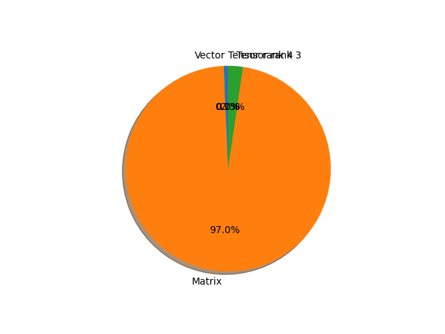

# mobilenet_v3_small parameter information

**Number of layers: [ 142 ]**

**Number of parameters: [ 2.54M ]**

**Proportional of each form** (%)

| Vector | Matrix | Tensor rank 3 | Tensor rank 4 | 
|  --- | --- | --- | --- |
| 61.97 | 29.58 | 7.75 | 0.70 | 

**Proportional of parameters by form** (%)

| Vector | Matrix | Tensor rank 3 | Tensor rank 4 | 
|  --- | --- | --- | --- |
| 0.67 | 97.01 | 2.30 | 0.02 | 

**Layer information**

| Name | Shape | Squeezed shape | Number of parameters | Form |
| --- | --- | --- | --- | --- |
| features.0.0.weight | (16, 3, 3, 3) | (16, 3, 3, 3) | 432 | Tensor rank 4 |
| features.0.1.weight | (16,) | (16,) | 16 | Vector |
| features.0.1.bias | (16,) | (16,) | 16 | Vector |
| features.1.block.0.0.weight | (16, 1, 3, 3) | (16, 3, 3) | 144 | Tensor rank 3 |
| features.1.block.0.1.weight | (16,) | (16,) | 16 | Vector |
| features.1.block.0.1.bias | (16,) | (16,) | 16 | Vector |
| features.1.block.1.fc1.weight | (8, 16, 1, 1) | (8, 16) | 128 | Matrix |
| features.1.block.1.fc1.bias | (8,) | (8,) | 8 | Vector |
| features.1.block.1.fc2.weight | (16, 8, 1, 1) | (16, 8) | 128 | Matrix |
| features.1.block.1.fc2.bias | (16,) | (16,) | 16 | Vector |
| features.1.block.2.0.weight | (16, 16, 1, 1) | (16, 16) | 256 | Matrix |
| features.1.block.2.1.weight | (16,) | (16,) | 16 | Vector |
| features.1.block.2.1.bias | (16,) | (16,) | 16 | Vector |
| features.2.block.0.0.weight | (72, 16, 1, 1) | (72, 16) | 1152 | Matrix |
| features.2.block.0.1.weight | (72,) | (72,) | 72 | Vector |
| features.2.block.0.1.bias | (72,) | (72,) | 72 | Vector |
| features.2.block.1.0.weight | (72, 1, 3, 3) | (72, 3, 3) | 648 | Tensor rank 3 |
| features.2.block.1.1.weight | (72,) | (72,) | 72 | Vector |
| features.2.block.1.1.bias | (72,) | (72,) | 72 | Vector |
| features.2.block.2.0.weight | (24, 72, 1, 1) | (24, 72) | 1728 | Matrix |
| features.2.block.2.1.weight | (24,) | (24,) | 24 | Vector |
| features.2.block.2.1.bias | (24,) | (24,) | 24 | Vector |
| features.3.block.0.0.weight | (88, 24, 1, 1) | (88, 24) | 2112 | Matrix |
| features.3.block.0.1.weight | (88,) | (88,) | 88 | Vector |
| features.3.block.0.1.bias | (88,) | (88,) | 88 | Vector |
| features.3.block.1.0.weight | (88, 1, 3, 3) | (88, 3, 3) | 792 | Tensor rank 3 |
| features.3.block.1.1.weight | (88,) | (88,) | 88 | Vector |
| features.3.block.1.1.bias | (88,) | (88,) | 88 | Vector |
| features.3.block.2.0.weight | (24, 88, 1, 1) | (24, 88) | 2112 | Matrix |
| features.3.block.2.1.weight | (24,) | (24,) | 24 | Vector |
| features.3.block.2.1.bias | (24,) | (24,) | 24 | Vector |
| features.4.block.0.0.weight | (96, 24, 1, 1) | (96, 24) | 2304 | Matrix |
| features.4.block.0.1.weight | (96,) | (96,) | 96 | Vector |
| features.4.block.0.1.bias | (96,) | (96,) | 96 | Vector |
| features.4.block.1.0.weight | (96, 1, 5, 5) | (96, 5, 5) | 2400 | Tensor rank 3 |
| features.4.block.1.1.weight | (96,) | (96,) | 96 | Vector |
| features.4.block.1.1.bias | (96,) | (96,) | 96 | Vector |
| features.4.block.2.fc1.weight | (24, 96, 1, 1) | (24, 96) | 2304 | Matrix |
| features.4.block.2.fc1.bias | (24,) | (24,) | 24 | Vector |
| features.4.block.2.fc2.weight | (96, 24, 1, 1) | (96, 24) | 2304 | Matrix |
| features.4.block.2.fc2.bias | (96,) | (96,) | 96 | Vector |
| features.4.block.3.0.weight | (40, 96, 1, 1) | (40, 96) | 3840 | Matrix |
| features.4.block.3.1.weight | (40,) | (40,) | 40 | Vector |
| features.4.block.3.1.bias | (40,) | (40,) | 40 | Vector |
| features.5.block.0.0.weight | (240, 40, 1, 1) | (240, 40) | 9600 | Matrix |
| features.5.block.0.1.weight | (240,) | (240,) | 240 | Vector |
| features.5.block.0.1.bias | (240,) | (240,) | 240 | Vector |
| features.5.block.1.0.weight | (240, 1, 5, 5) | (240, 5, 5) | 6000 | Tensor rank 3 |
| features.5.block.1.1.weight | (240,) | (240,) | 240 | Vector |
| features.5.block.1.1.bias | (240,) | (240,) | 240 | Vector |
| features.5.block.2.fc1.weight | (64, 240, 1, 1) | (64, 240) | 15360 | Matrix |
| features.5.block.2.fc1.bias | (64,) | (64,) | 64 | Vector |
| features.5.block.2.fc2.weight | (240, 64, 1, 1) | (240, 64) | 15360 | Matrix |
| features.5.block.2.fc2.bias | (240,) | (240,) | 240 | Vector |
| features.5.block.3.0.weight | (40, 240, 1, 1) | (40, 240) | 9600 | Matrix |
| features.5.block.3.1.weight | (40,) | (40,) | 40 | Vector |
| features.5.block.3.1.bias | (40,) | (40,) | 40 | Vector |
| features.6.block.0.0.weight | (240, 40, 1, 1) | (240, 40) | 9600 | Matrix |
| features.6.block.0.1.weight | (240,) | (240,) | 240 | Vector |
| features.6.block.0.1.bias | (240,) | (240,) | 240 | Vector |
| features.6.block.1.0.weight | (240, 1, 5, 5) | (240, 5, 5) | 6000 | Tensor rank 3 |
| features.6.block.1.1.weight | (240,) | (240,) | 240 | Vector |
| features.6.block.1.1.bias | (240,) | (240,) | 240 | Vector |
| features.6.block.2.fc1.weight | (64, 240, 1, 1) | (64, 240) | 15360 | Matrix |
| features.6.block.2.fc1.bias | (64,) | (64,) | 64 | Vector |
| features.6.block.2.fc2.weight | (240, 64, 1, 1) | (240, 64) | 15360 | Matrix |
| features.6.block.2.fc2.bias | (240,) | (240,) | 240 | Vector |
| features.6.block.3.0.weight | (40, 240, 1, 1) | (40, 240) | 9600 | Matrix |
| features.6.block.3.1.weight | (40,) | (40,) | 40 | Vector |
| features.6.block.3.1.bias | (40,) | (40,) | 40 | Vector |
| features.7.block.0.0.weight | (120, 40, 1, 1) | (120, 40) | 4800 | Matrix |
| features.7.block.0.1.weight | (120,) | (120,) | 120 | Vector |
| features.7.block.0.1.bias | (120,) | (120,) | 120 | Vector |
| features.7.block.1.0.weight | (120, 1, 5, 5) | (120, 5, 5) | 3000 | Tensor rank 3 |
| features.7.block.1.1.weight | (120,) | (120,) | 120 | Vector |
| features.7.block.1.1.bias | (120,) | (120,) | 120 | Vector |
| features.7.block.2.fc1.weight | (32, 120, 1, 1) | (32, 120) | 3840 | Matrix |
| features.7.block.2.fc1.bias | (32,) | (32,) | 32 | Vector |
| features.7.block.2.fc2.weight | (120, 32, 1, 1) | (120, 32) | 3840 | Matrix |
| features.7.block.2.fc2.bias | (120,) | (120,) | 120 | Vector |
| features.7.block.3.0.weight | (48, 120, 1, 1) | (48, 120) | 5760 | Matrix |
| features.7.block.3.1.weight | (48,) | (48,) | 48 | Vector |
| features.7.block.3.1.bias | (48,) | (48,) | 48 | Vector |
| features.8.block.0.0.weight | (144, 48, 1, 1) | (144, 48) | 6912 | Matrix |
| features.8.block.0.1.weight | (144,) | (144,) | 144 | Vector |
| features.8.block.0.1.bias | (144,) | (144,) | 144 | Vector |
| features.8.block.1.0.weight | (144, 1, 5, 5) | (144, 5, 5) | 3600 | Tensor rank 3 |
| features.8.block.1.1.weight | (144,) | (144,) | 144 | Vector |
| features.8.block.1.1.bias | (144,) | (144,) | 144 | Vector |
| features.8.block.2.fc1.weight | (40, 144, 1, 1) | (40, 144) | 5760 | Matrix |
| features.8.block.2.fc1.bias | (40,) | (40,) | 40 | Vector |
| features.8.block.2.fc2.weight | (144, 40, 1, 1) | (144, 40) | 5760 | Matrix |
| features.8.block.2.fc2.bias | (144,) | (144,) | 144 | Vector |
| features.8.block.3.0.weight | (48, 144, 1, 1) | (48, 144) | 6912 | Matrix |
| features.8.block.3.1.weight | (48,) | (48,) | 48 | Vector |
| features.8.block.3.1.bias | (48,) | (48,) | 48 | Vector |
| features.9.block.0.0.weight | (288, 48, 1, 1) | (288, 48) | 13824 | Matrix |
| features.9.block.0.1.weight | (288,) | (288,) | 288 | Vector |
| features.9.block.0.1.bias | (288,) | (288,) | 288 | Vector |
| features.9.block.1.0.weight | (288, 1, 5, 5) | (288, 5, 5) | 7200 | Tensor rank 3 |
| features.9.block.1.1.weight | (288,) | (288,) | 288 | Vector |
| features.9.block.1.1.bias | (288,) | (288,) | 288 | Vector |
| features.9.block.2.fc1.weight | (72, 288, 1, 1) | (72, 288) | 20736 | Matrix |
| features.9.block.2.fc1.bias | (72,) | (72,) | 72 | Vector |
| features.9.block.2.fc2.weight | (288, 72, 1, 1) | (288, 72) | 20736 | Matrix |
| features.9.block.2.fc2.bias | (288,) | (288,) | 288 | Vector |
| features.9.block.3.0.weight | (96, 288, 1, 1) | (96, 288) | 27648 | Matrix |
| features.9.block.3.1.weight | (96,) | (96,) | 96 | Vector |
| features.9.block.3.1.bias | (96,) | (96,) | 96 | Vector |
| features.10.block.0.0.weight | (576, 96, 1, 1) | (576, 96) | 55296 | Matrix |
| features.10.block.0.1.weight | (576,) | (576,) | 576 | Vector |
| features.10.block.0.1.bias | (576,) | (576,) | 576 | Vector |
| features.10.block.1.0.weight | (576, 1, 5, 5) | (576, 5, 5) | 14400 | Tensor rank 3 |
| features.10.block.1.1.weight | (576,) | (576,) | 576 | Vector |
| features.10.block.1.1.bias | (576,) | (576,) | 576 | Vector |
| features.10.block.2.fc1.weight | (144, 576, 1, 1) | (144, 576) | 82944 | Matrix |
| features.10.block.2.fc1.bias | (144,) | (144,) | 144 | Vector |
| features.10.block.2.fc2.weight | (576, 144, 1, 1) | (576, 144) | 82944 | Matrix |
| features.10.block.2.fc2.bias | (576,) | (576,) | 576 | Vector |
| features.10.block.3.0.weight | (96, 576, 1, 1) | (96, 576) | 55296 | Matrix |
| features.10.block.3.1.weight | (96,) | (96,) | 96 | Vector |
| features.10.block.3.1.bias | (96,) | (96,) | 96 | Vector |
| features.11.block.0.0.weight | (576, 96, 1, 1) | (576, 96) | 55296 | Matrix |
| features.11.block.0.1.weight | (576,) | (576,) | 576 | Vector |
| features.11.block.0.1.bias | (576,) | (576,) | 576 | Vector |
| features.11.block.1.0.weight | (576, 1, 5, 5) | (576, 5, 5) | 14400 | Tensor rank 3 |
| features.11.block.1.1.weight | (576,) | (576,) | 576 | Vector |
| features.11.block.1.1.bias | (576,) | (576,) | 576 | Vector |
| features.11.block.2.fc1.weight | (144, 576, 1, 1) | (144, 576) | 82944 | Matrix |
| features.11.block.2.fc1.bias | (144,) | (144,) | 144 | Vector |
| features.11.block.2.fc2.weight | (576, 144, 1, 1) | (576, 144) | 82944 | Matrix |
| features.11.block.2.fc2.bias | (576,) | (576,) | 576 | Vector |
| features.11.block.3.0.weight | (96, 576, 1, 1) | (96, 576) | 55296 | Matrix |
| features.11.block.3.1.weight | (96,) | (96,) | 96 | Vector |
| features.11.block.3.1.bias | (96,) | (96,) | 96 | Vector |
| features.12.0.weight | (576, 96, 1, 1) | (576, 96) | 55296 | Matrix |
| features.12.1.weight | (576,) | (576,) | 576 | Vector |
| features.12.1.bias | (576,) | (576,) | 576 | Vector |
| classifier.0.weight | (1024, 576) | (1024, 576) | 589824 | Matrix |
| classifier.0.bias | (1024,) | (1024,) | 1024 | Vector |
| classifier.3.weight | (1000, 1024) | (1000, 1024) | 1024000 | Matrix |
| classifier.3.bias | (1000,) | (1000,) | 1000 | Vector |

