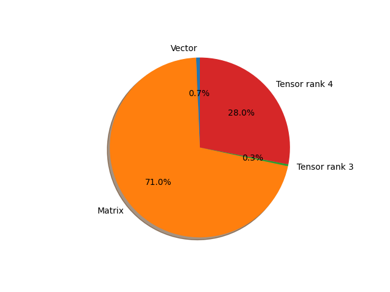

# mobilevit parameter information

**Number of layers: [ 249 ]**

**Number of parameters: [ 4.94M ]**

**Proportional of each form** (%)

| Vector | Matrix | Tensor rank 3 | Tensor rank 4 | 
|  --- | --- | --- | --- |
| 64.26 | 30.12 | 2.81 | 2.81 | 

**Proportional of parameters by form** (%)

| Vector | Matrix | Tensor rank 3 | Tensor rank 4 | 
|  --- | --- | --- | --- |
| 0.67 | 70.99 | 0.34 | 28.01 | 

**Layer information**

| Name | Shape | Squeezed shape | Number of parameters | Form |
| --- | --- | --- | --- | --- |
| conv_stem.convolution.weight | (16, 3, 3, 3) | (16, 3, 3, 3) | 432 | Tensor rank 4 |
| conv_stem.normalization.weight | (16,) | (16,) | 16 | Vector |
| conv_stem.normalization.bias | (16,) | (16,) | 16 | Vector |
| encoder.layer.0.layer.0.expand_1x1.convolution.weight | (64, 16, 1, 1) | (64, 16) | 1024 | Matrix |
| encoder.layer.0.layer.0.expand_1x1.normalization.weight | (64,) | (64,) | 64 | Vector |
| encoder.layer.0.layer.0.expand_1x1.normalization.bias | (64,) | (64,) | 64 | Vector |
| encoder.layer.0.layer.0.conv_3x3.convolution.weight | (64, 1, 3, 3) | (64, 3, 3) | 576 | Tensor rank 3 |
| encoder.layer.0.layer.0.conv_3x3.normalization.weight | (64,) | (64,) | 64 | Vector |
| encoder.layer.0.layer.0.conv_3x3.normalization.bias | (64,) | (64,) | 64 | Vector |
| encoder.layer.0.layer.0.reduce_1x1.convolution.weight | (32, 64, 1, 1) | (32, 64) | 2048 | Matrix |
| encoder.layer.0.layer.0.reduce_1x1.normalization.weight | (32,) | (32,) | 32 | Vector |
| encoder.layer.0.layer.0.reduce_1x1.normalization.bias | (32,) | (32,) | 32 | Vector |
| encoder.layer.1.layer.0.expand_1x1.convolution.weight | (128, 32, 1, 1) | (128, 32) | 4096 | Matrix |
| encoder.layer.1.layer.0.expand_1x1.normalization.weight | (128,) | (128,) | 128 | Vector |
| encoder.layer.1.layer.0.expand_1x1.normalization.bias | (128,) | (128,) | 128 | Vector |
| encoder.layer.1.layer.0.conv_3x3.convolution.weight | (128, 1, 3, 3) | (128, 3, 3) | 1152 | Tensor rank 3 |
| encoder.layer.1.layer.0.conv_3x3.normalization.weight | (128,) | (128,) | 128 | Vector |
| encoder.layer.1.layer.0.conv_3x3.normalization.bias | (128,) | (128,) | 128 | Vector |
| encoder.layer.1.layer.0.reduce_1x1.convolution.weight | (64, 128, 1, 1) | (64, 128) | 8192 | Matrix |
| encoder.layer.1.layer.0.reduce_1x1.normalization.weight | (64,) | (64,) | 64 | Vector |
| encoder.layer.1.layer.0.reduce_1x1.normalization.bias | (64,) | (64,) | 64 | Vector |
| encoder.layer.1.layer.1.expand_1x1.convolution.weight | (256, 64, 1, 1) | (256, 64) | 16384 | Matrix |
| encoder.layer.1.layer.1.expand_1x1.normalization.weight | (256,) | (256,) | 256 | Vector |
| encoder.layer.1.layer.1.expand_1x1.normalization.bias | (256,) | (256,) | 256 | Vector |
| encoder.layer.1.layer.1.conv_3x3.convolution.weight | (256, 1, 3, 3) | (256, 3, 3) | 2304 | Tensor rank 3 |
| encoder.layer.1.layer.1.conv_3x3.normalization.weight | (256,) | (256,) | 256 | Vector |
| encoder.layer.1.layer.1.conv_3x3.normalization.bias | (256,) | (256,) | 256 | Vector |
| encoder.layer.1.layer.1.reduce_1x1.convolution.weight | (64, 256, 1, 1) | (64, 256) | 16384 | Matrix |
| encoder.layer.1.layer.1.reduce_1x1.normalization.weight | (64,) | (64,) | 64 | Vector |
| encoder.layer.1.layer.1.reduce_1x1.normalization.bias | (64,) | (64,) | 64 | Vector |
| encoder.layer.1.layer.2.expand_1x1.convolution.weight | (256, 64, 1, 1) | (256, 64) | 16384 | Matrix |
| encoder.layer.1.layer.2.expand_1x1.normalization.weight | (256,) | (256,) | 256 | Vector |
| encoder.layer.1.layer.2.expand_1x1.normalization.bias | (256,) | (256,) | 256 | Vector |
| encoder.layer.1.layer.2.conv_3x3.convolution.weight | (256, 1, 3, 3) | (256, 3, 3) | 2304 | Tensor rank 3 |
| encoder.layer.1.layer.2.conv_3x3.normalization.weight | (256,) | (256,) | 256 | Vector |
| encoder.layer.1.layer.2.conv_3x3.normalization.bias | (256,) | (256,) | 256 | Vector |
| encoder.layer.1.layer.2.reduce_1x1.convolution.weight | (64, 256, 1, 1) | (64, 256) | 16384 | Matrix |
| encoder.layer.1.layer.2.reduce_1x1.normalization.weight | (64,) | (64,) | 64 | Vector |
| encoder.layer.1.layer.2.reduce_1x1.normalization.bias | (64,) | (64,) | 64 | Vector |
| encoder.layer.2.downsampling_layer.expand_1x1.convolution.weight | (256, 64, 1, 1) | (256, 64) | 16384 | Matrix |
| encoder.layer.2.downsampling_layer.expand_1x1.normalization.weight | (256,) | (256,) | 256 | Vector |
| encoder.layer.2.downsampling_layer.expand_1x1.normalization.bias | (256,) | (256,) | 256 | Vector |
| encoder.layer.2.downsampling_layer.conv_3x3.convolution.weight | (256, 1, 3, 3) | (256, 3, 3) | 2304 | Tensor rank 3 |
| encoder.layer.2.downsampling_layer.conv_3x3.normalization.weight | (256,) | (256,) | 256 | Vector |
| encoder.layer.2.downsampling_layer.conv_3x3.normalization.bias | (256,) | (256,) | 256 | Vector |
| encoder.layer.2.downsampling_layer.reduce_1x1.convolution.weight | (96, 256, 1, 1) | (96, 256) | 24576 | Matrix |
| encoder.layer.2.downsampling_layer.reduce_1x1.normalization.weight | (96,) | (96,) | 96 | Vector |
| encoder.layer.2.downsampling_layer.reduce_1x1.normalization.bias | (96,) | (96,) | 96 | Vector |
| encoder.layer.2.conv_kxk.convolution.weight | (96, 96, 3, 3) | (96, 96, 3, 3) | 82944 | Tensor rank 4 |
| encoder.layer.2.conv_kxk.normalization.weight | (96,) | (96,) | 96 | Vector |
| encoder.layer.2.conv_kxk.normalization.bias | (96,) | (96,) | 96 | Vector |
| encoder.layer.2.conv_1x1.convolution.weight | (144, 96, 1, 1) | (144, 96) | 13824 | Matrix |
| encoder.layer.2.transformer.layer.0.attention.attention.query.weight | (144, 144) | (144, 144) | 20736 | Matrix |
| encoder.layer.2.transformer.layer.0.attention.attention.query.bias | (144,) | (144,) | 144 | Vector |
| encoder.layer.2.transformer.layer.0.attention.attention.key.weight | (144, 144) | (144, 144) | 20736 | Matrix |
| encoder.layer.2.transformer.layer.0.attention.attention.key.bias | (144,) | (144,) | 144 | Vector |
| encoder.layer.2.transformer.layer.0.attention.attention.value.weight | (144, 144) | (144, 144) | 20736 | Matrix |
| encoder.layer.2.transformer.layer.0.attention.attention.value.bias | (144,) | (144,) | 144 | Vector |
| encoder.layer.2.transformer.layer.0.attention.output.dense.weight | (144, 144) | (144, 144) | 20736 | Matrix |
| encoder.layer.2.transformer.layer.0.attention.output.dense.bias | (144,) | (144,) | 144 | Vector |
| encoder.layer.2.transformer.layer.0.intermediate.dense.weight | (288, 144) | (288, 144) | 41472 | Matrix |
| encoder.layer.2.transformer.layer.0.intermediate.dense.bias | (288,) | (288,) | 288 | Vector |
| encoder.layer.2.transformer.layer.0.output.dense.weight | (144, 288) | (144, 288) | 41472 | Matrix |
| encoder.layer.2.transformer.layer.0.output.dense.bias | (144,) | (144,) | 144 | Vector |
| encoder.layer.2.transformer.layer.0.layernorm_before.weight | (144,) | (144,) | 144 | Vector |
| encoder.layer.2.transformer.layer.0.layernorm_before.bias | (144,) | (144,) | 144 | Vector |
| encoder.layer.2.transformer.layer.0.layernorm_after.weight | (144,) | (144,) | 144 | Vector |
| encoder.layer.2.transformer.layer.0.layernorm_after.bias | (144,) | (144,) | 144 | Vector |
| encoder.layer.2.transformer.layer.1.attention.attention.query.weight | (144, 144) | (144, 144) | 20736 | Matrix |
| encoder.layer.2.transformer.layer.1.attention.attention.query.bias | (144,) | (144,) | 144 | Vector |
| encoder.layer.2.transformer.layer.1.attention.attention.key.weight | (144, 144) | (144, 144) | 20736 | Matrix |
| encoder.layer.2.transformer.layer.1.attention.attention.key.bias | (144,) | (144,) | 144 | Vector |
| encoder.layer.2.transformer.layer.1.attention.attention.value.weight | (144, 144) | (144, 144) | 20736 | Matrix |
| encoder.layer.2.transformer.layer.1.attention.attention.value.bias | (144,) | (144,) | 144 | Vector |
| encoder.layer.2.transformer.layer.1.attention.output.dense.weight | (144, 144) | (144, 144) | 20736 | Matrix |
| encoder.layer.2.transformer.layer.1.attention.output.dense.bias | (144,) | (144,) | 144 | Vector |
| encoder.layer.2.transformer.layer.1.intermediate.dense.weight | (288, 144) | (288, 144) | 41472 | Matrix |
| encoder.layer.2.transformer.layer.1.intermediate.dense.bias | (288,) | (288,) | 288 | Vector |
| encoder.layer.2.transformer.layer.1.output.dense.weight | (144, 288) | (144, 288) | 41472 | Matrix |
| encoder.layer.2.transformer.layer.1.output.dense.bias | (144,) | (144,) | 144 | Vector |
| encoder.layer.2.transformer.layer.1.layernorm_before.weight | (144,) | (144,) | 144 | Vector |
| encoder.layer.2.transformer.layer.1.layernorm_before.bias | (144,) | (144,) | 144 | Vector |
| encoder.layer.2.transformer.layer.1.layernorm_after.weight | (144,) | (144,) | 144 | Vector |
| encoder.layer.2.transformer.layer.1.layernorm_after.bias | (144,) | (144,) | 144 | Vector |
| encoder.layer.2.layernorm.weight | (144,) | (144,) | 144 | Vector |
| encoder.layer.2.layernorm.bias | (144,) | (144,) | 144 | Vector |
| encoder.layer.2.conv_projection.convolution.weight | (96, 144, 1, 1) | (96, 144) | 13824 | Matrix |
| encoder.layer.2.conv_projection.normalization.weight | (96,) | (96,) | 96 | Vector |
| encoder.layer.2.conv_projection.normalization.bias | (96,) | (96,) | 96 | Vector |
| encoder.layer.2.fusion.convolution.weight | (96, 192, 3, 3) | (96, 192, 3, 3) | 165888 | Tensor rank 4 |
| encoder.layer.2.fusion.normalization.weight | (96,) | (96,) | 96 | Vector |
| encoder.layer.2.fusion.normalization.bias | (96,) | (96,) | 96 | Vector |
| encoder.layer.3.downsampling_layer.expand_1x1.convolution.weight | (384, 96, 1, 1) | (384, 96) | 36864 | Matrix |
| encoder.layer.3.downsampling_layer.expand_1x1.normalization.weight | (384,) | (384,) | 384 | Vector |
| encoder.layer.3.downsampling_layer.expand_1x1.normalization.bias | (384,) | (384,) | 384 | Vector |
| encoder.layer.3.downsampling_layer.conv_3x3.convolution.weight | (384, 1, 3, 3) | (384, 3, 3) | 3456 | Tensor rank 3 |
| encoder.layer.3.downsampling_layer.conv_3x3.normalization.weight | (384,) | (384,) | 384 | Vector |
| encoder.layer.3.downsampling_layer.conv_3x3.normalization.bias | (384,) | (384,) | 384 | Vector |
| encoder.layer.3.downsampling_layer.reduce_1x1.convolution.weight | (128, 384, 1, 1) | (128, 384) | 49152 | Matrix |
| encoder.layer.3.downsampling_layer.reduce_1x1.normalization.weight | (128,) | (128,) | 128 | Vector |
| encoder.layer.3.downsampling_layer.reduce_1x1.normalization.bias | (128,) | (128,) | 128 | Vector |
| encoder.layer.3.conv_kxk.convolution.weight | (128, 128, 3, 3) | (128, 128, 3, 3) | 147456 | Tensor rank 4 |
| encoder.layer.3.conv_kxk.normalization.weight | (128,) | (128,) | 128 | Vector |
| encoder.layer.3.conv_kxk.normalization.bias | (128,) | (128,) | 128 | Vector |
| encoder.layer.3.conv_1x1.convolution.weight | (192, 128, 1, 1) | (192, 128) | 24576 | Matrix |
| encoder.layer.3.transformer.layer.0.attention.attention.query.weight | (192, 192) | (192, 192) | 36864 | Matrix |
| encoder.layer.3.transformer.layer.0.attention.attention.query.bias | (192,) | (192,) | 192 | Vector |
| encoder.layer.3.transformer.layer.0.attention.attention.key.weight | (192, 192) | (192, 192) | 36864 | Matrix |
| encoder.layer.3.transformer.layer.0.attention.attention.key.bias | (192,) | (192,) | 192 | Vector |
| encoder.layer.3.transformer.layer.0.attention.attention.value.weight | (192, 192) | (192, 192) | 36864 | Matrix |
| encoder.layer.3.transformer.layer.0.attention.attention.value.bias | (192,) | (192,) | 192 | Vector |
| encoder.layer.3.transformer.layer.0.attention.output.dense.weight | (192, 192) | (192, 192) | 36864 | Matrix |
| encoder.layer.3.transformer.layer.0.attention.output.dense.bias | (192,) | (192,) | 192 | Vector |
| encoder.layer.3.transformer.layer.0.intermediate.dense.weight | (384, 192) | (384, 192) | 73728 | Matrix |
| encoder.layer.3.transformer.layer.0.intermediate.dense.bias | (384,) | (384,) | 384 | Vector |
| encoder.layer.3.transformer.layer.0.output.dense.weight | (192, 384) | (192, 384) | 73728 | Matrix |
| encoder.layer.3.transformer.layer.0.output.dense.bias | (192,) | (192,) | 192 | Vector |
| encoder.layer.3.transformer.layer.0.layernorm_before.weight | (192,) | (192,) | 192 | Vector |
| encoder.layer.3.transformer.layer.0.layernorm_before.bias | (192,) | (192,) | 192 | Vector |
| encoder.layer.3.transformer.layer.0.layernorm_after.weight | (192,) | (192,) | 192 | Vector |
| encoder.layer.3.transformer.layer.0.layernorm_after.bias | (192,) | (192,) | 192 | Vector |
| encoder.layer.3.transformer.layer.1.attention.attention.query.weight | (192, 192) | (192, 192) | 36864 | Matrix |
| encoder.layer.3.transformer.layer.1.attention.attention.query.bias | (192,) | (192,) | 192 | Vector |
| encoder.layer.3.transformer.layer.1.attention.attention.key.weight | (192, 192) | (192, 192) | 36864 | Matrix |
| encoder.layer.3.transformer.layer.1.attention.attention.key.bias | (192,) | (192,) | 192 | Vector |
| encoder.layer.3.transformer.layer.1.attention.attention.value.weight | (192, 192) | (192, 192) | 36864 | Matrix |
| encoder.layer.3.transformer.layer.1.attention.attention.value.bias | (192,) | (192,) | 192 | Vector |
| encoder.layer.3.transformer.layer.1.attention.output.dense.weight | (192, 192) | (192, 192) | 36864 | Matrix |
| encoder.layer.3.transformer.layer.1.attention.output.dense.bias | (192,) | (192,) | 192 | Vector |
| encoder.layer.3.transformer.layer.1.intermediate.dense.weight | (384, 192) | (384, 192) | 73728 | Matrix |
| encoder.layer.3.transformer.layer.1.intermediate.dense.bias | (384,) | (384,) | 384 | Vector |
| encoder.layer.3.transformer.layer.1.output.dense.weight | (192, 384) | (192, 384) | 73728 | Matrix |
| encoder.layer.3.transformer.layer.1.output.dense.bias | (192,) | (192,) | 192 | Vector |
| encoder.layer.3.transformer.layer.1.layernorm_before.weight | (192,) | (192,) | 192 | Vector |
| encoder.layer.3.transformer.layer.1.layernorm_before.bias | (192,) | (192,) | 192 | Vector |
| encoder.layer.3.transformer.layer.1.layernorm_after.weight | (192,) | (192,) | 192 | Vector |
| encoder.layer.3.transformer.layer.1.layernorm_after.bias | (192,) | (192,) | 192 | Vector |
| encoder.layer.3.transformer.layer.2.attention.attention.query.weight | (192, 192) | (192, 192) | 36864 | Matrix |
| encoder.layer.3.transformer.layer.2.attention.attention.query.bias | (192,) | (192,) | 192 | Vector |
| encoder.layer.3.transformer.layer.2.attention.attention.key.weight | (192, 192) | (192, 192) | 36864 | Matrix |
| encoder.layer.3.transformer.layer.2.attention.attention.key.bias | (192,) | (192,) | 192 | Vector |
| encoder.layer.3.transformer.layer.2.attention.attention.value.weight | (192, 192) | (192, 192) | 36864 | Matrix |
| encoder.layer.3.transformer.layer.2.attention.attention.value.bias | (192,) | (192,) | 192 | Vector |
| encoder.layer.3.transformer.layer.2.attention.output.dense.weight | (192, 192) | (192, 192) | 36864 | Matrix |
| encoder.layer.3.transformer.layer.2.attention.output.dense.bias | (192,) | (192,) | 192 | Vector |
| encoder.layer.3.transformer.layer.2.intermediate.dense.weight | (384, 192) | (384, 192) | 73728 | Matrix |
| encoder.layer.3.transformer.layer.2.intermediate.dense.bias | (384,) | (384,) | 384 | Vector |
| encoder.layer.3.transformer.layer.2.output.dense.weight | (192, 384) | (192, 384) | 73728 | Matrix |
| encoder.layer.3.transformer.layer.2.output.dense.bias | (192,) | (192,) | 192 | Vector |
| encoder.layer.3.transformer.layer.2.layernorm_before.weight | (192,) | (192,) | 192 | Vector |
| encoder.layer.3.transformer.layer.2.layernorm_before.bias | (192,) | (192,) | 192 | Vector |
| encoder.layer.3.transformer.layer.2.layernorm_after.weight | (192,) | (192,) | 192 | Vector |
| encoder.layer.3.transformer.layer.2.layernorm_after.bias | (192,) | (192,) | 192 | Vector |
| encoder.layer.3.transformer.layer.3.attention.attention.query.weight | (192, 192) | (192, 192) | 36864 | Matrix |
| encoder.layer.3.transformer.layer.3.attention.attention.query.bias | (192,) | (192,) | 192 | Vector |
| encoder.layer.3.transformer.layer.3.attention.attention.key.weight | (192, 192) | (192, 192) | 36864 | Matrix |
| encoder.layer.3.transformer.layer.3.attention.attention.key.bias | (192,) | (192,) | 192 | Vector |
| encoder.layer.3.transformer.layer.3.attention.attention.value.weight | (192, 192) | (192, 192) | 36864 | Matrix |
| encoder.layer.3.transformer.layer.3.attention.attention.value.bias | (192,) | (192,) | 192 | Vector |
| encoder.layer.3.transformer.layer.3.attention.output.dense.weight | (192, 192) | (192, 192) | 36864 | Matrix |
| encoder.layer.3.transformer.layer.3.attention.output.dense.bias | (192,) | (192,) | 192 | Vector |
| encoder.layer.3.transformer.layer.3.intermediate.dense.weight | (384, 192) | (384, 192) | 73728 | Matrix |
| encoder.layer.3.transformer.layer.3.intermediate.dense.bias | (384,) | (384,) | 384 | Vector |
| encoder.layer.3.transformer.layer.3.output.dense.weight | (192, 384) | (192, 384) | 73728 | Matrix |
| encoder.layer.3.transformer.layer.3.output.dense.bias | (192,) | (192,) | 192 | Vector |
| encoder.layer.3.transformer.layer.3.layernorm_before.weight | (192,) | (192,) | 192 | Vector |
| encoder.layer.3.transformer.layer.3.layernorm_before.bias | (192,) | (192,) | 192 | Vector |
| encoder.layer.3.transformer.layer.3.layernorm_after.weight | (192,) | (192,) | 192 | Vector |
| encoder.layer.3.transformer.layer.3.layernorm_after.bias | (192,) | (192,) | 192 | Vector |
| encoder.layer.3.layernorm.weight | (192,) | (192,) | 192 | Vector |
| encoder.layer.3.layernorm.bias | (192,) | (192,) | 192 | Vector |
| encoder.layer.3.conv_projection.convolution.weight | (128, 192, 1, 1) | (128, 192) | 24576 | Matrix |
| encoder.layer.3.conv_projection.normalization.weight | (128,) | (128,) | 128 | Vector |
| encoder.layer.3.conv_projection.normalization.bias | (128,) | (128,) | 128 | Vector |
| encoder.layer.3.fusion.convolution.weight | (128, 256, 3, 3) | (128, 256, 3, 3) | 294912 | Tensor rank 4 |
| encoder.layer.3.fusion.normalization.weight | (128,) | (128,) | 128 | Vector |
| encoder.layer.3.fusion.normalization.bias | (128,) | (128,) | 128 | Vector |
| encoder.layer.4.downsampling_layer.expand_1x1.convolution.weight | (512, 128, 1, 1) | (512, 128) | 65536 | Matrix |
| encoder.layer.4.downsampling_layer.expand_1x1.normalization.weight | (512,) | (512,) | 512 | Vector |
| encoder.layer.4.downsampling_layer.expand_1x1.normalization.bias | (512,) | (512,) | 512 | Vector |
| encoder.layer.4.downsampling_layer.conv_3x3.convolution.weight | (512, 1, 3, 3) | (512, 3, 3) | 4608 | Tensor rank 3 |
| encoder.layer.4.downsampling_layer.conv_3x3.normalization.weight | (512,) | (512,) | 512 | Vector |
| encoder.layer.4.downsampling_layer.conv_3x3.normalization.bias | (512,) | (512,) | 512 | Vector |
| encoder.layer.4.downsampling_layer.reduce_1x1.convolution.weight | (160, 512, 1, 1) | (160, 512) | 81920 | Matrix |
| encoder.layer.4.downsampling_layer.reduce_1x1.normalization.weight | (160,) | (160,) | 160 | Vector |
| encoder.layer.4.downsampling_layer.reduce_1x1.normalization.bias | (160,) | (160,) | 160 | Vector |
| encoder.layer.4.conv_kxk.convolution.weight | (160, 160, 3, 3) | (160, 160, 3, 3) | 230400 | Tensor rank 4 |
| encoder.layer.4.conv_kxk.normalization.weight | (160,) | (160,) | 160 | Vector |
| encoder.layer.4.conv_kxk.normalization.bias | (160,) | (160,) | 160 | Vector |
| encoder.layer.4.conv_1x1.convolution.weight | (240, 160, 1, 1) | (240, 160) | 38400 | Matrix |
| encoder.layer.4.transformer.layer.0.attention.attention.query.weight | (240, 240) | (240, 240) | 57600 | Matrix |
| encoder.layer.4.transformer.layer.0.attention.attention.query.bias | (240,) | (240,) | 240 | Vector |
| encoder.layer.4.transformer.layer.0.attention.attention.key.weight | (240, 240) | (240, 240) | 57600 | Matrix |
| encoder.layer.4.transformer.layer.0.attention.attention.key.bias | (240,) | (240,) | 240 | Vector |
| encoder.layer.4.transformer.layer.0.attention.attention.value.weight | (240, 240) | (240, 240) | 57600 | Matrix |
| encoder.layer.4.transformer.layer.0.attention.attention.value.bias | (240,) | (240,) | 240 | Vector |
| encoder.layer.4.transformer.layer.0.attention.output.dense.weight | (240, 240) | (240, 240) | 57600 | Matrix |
| encoder.layer.4.transformer.layer.0.attention.output.dense.bias | (240,) | (240,) | 240 | Vector |
| encoder.layer.4.transformer.layer.0.intermediate.dense.weight | (480, 240) | (480, 240) | 115200 | Matrix |
| encoder.layer.4.transformer.layer.0.intermediate.dense.bias | (480,) | (480,) | 480 | Vector |
| encoder.layer.4.transformer.layer.0.output.dense.weight | (240, 480) | (240, 480) | 115200 | Matrix |
| encoder.layer.4.transformer.layer.0.output.dense.bias | (240,) | (240,) | 240 | Vector |
| encoder.layer.4.transformer.layer.0.layernorm_before.weight | (240,) | (240,) | 240 | Vector |
| encoder.layer.4.transformer.layer.0.layernorm_before.bias | (240,) | (240,) | 240 | Vector |
| encoder.layer.4.transformer.layer.0.layernorm_after.weight | (240,) | (240,) | 240 | Vector |
| encoder.layer.4.transformer.layer.0.layernorm_after.bias | (240,) | (240,) | 240 | Vector |
| encoder.layer.4.transformer.layer.1.attention.attention.query.weight | (240, 240) | (240, 240) | 57600 | Matrix |
| encoder.layer.4.transformer.layer.1.attention.attention.query.bias | (240,) | (240,) | 240 | Vector |
| encoder.layer.4.transformer.layer.1.attention.attention.key.weight | (240, 240) | (240, 240) | 57600 | Matrix |
| encoder.layer.4.transformer.layer.1.attention.attention.key.bias | (240,) | (240,) | 240 | Vector |
| encoder.layer.4.transformer.layer.1.attention.attention.value.weight | (240, 240) | (240, 240) | 57600 | Matrix |
| encoder.layer.4.transformer.layer.1.attention.attention.value.bias | (240,) | (240,) | 240 | Vector |
| encoder.layer.4.transformer.layer.1.attention.output.dense.weight | (240, 240) | (240, 240) | 57600 | Matrix |
| encoder.layer.4.transformer.layer.1.attention.output.dense.bias | (240,) | (240,) | 240 | Vector |
| encoder.layer.4.transformer.layer.1.intermediate.dense.weight | (480, 240) | (480, 240) | 115200 | Matrix |
| encoder.layer.4.transformer.layer.1.intermediate.dense.bias | (480,) | (480,) | 480 | Vector |
| encoder.layer.4.transformer.layer.1.output.dense.weight | (240, 480) | (240, 480) | 115200 | Matrix |
| encoder.layer.4.transformer.layer.1.output.dense.bias | (240,) | (240,) | 240 | Vector |
| encoder.layer.4.transformer.layer.1.layernorm_before.weight | (240,) | (240,) | 240 | Vector |
| encoder.layer.4.transformer.layer.1.layernorm_before.bias | (240,) | (240,) | 240 | Vector |
| encoder.layer.4.transformer.layer.1.layernorm_after.weight | (240,) | (240,) | 240 | Vector |
| encoder.layer.4.transformer.layer.1.layernorm_after.bias | (240,) | (240,) | 240 | Vector |
| encoder.layer.4.transformer.layer.2.attention.attention.query.weight | (240, 240) | (240, 240) | 57600 | Matrix |
| encoder.layer.4.transformer.layer.2.attention.attention.query.bias | (240,) | (240,) | 240 | Vector |
| encoder.layer.4.transformer.layer.2.attention.attention.key.weight | (240, 240) | (240, 240) | 57600 | Matrix |
| encoder.layer.4.transformer.layer.2.attention.attention.key.bias | (240,) | (240,) | 240 | Vector |
| encoder.layer.4.transformer.layer.2.attention.attention.value.weight | (240, 240) | (240, 240) | 57600 | Matrix |
| encoder.layer.4.transformer.layer.2.attention.attention.value.bias | (240,) | (240,) | 240 | Vector |
| encoder.layer.4.transformer.layer.2.attention.output.dense.weight | (240, 240) | (240, 240) | 57600 | Matrix |
| encoder.layer.4.transformer.layer.2.attention.output.dense.bias | (240,) | (240,) | 240 | Vector |
| encoder.layer.4.transformer.layer.2.intermediate.dense.weight | (480, 240) | (480, 240) | 115200 | Matrix |
| encoder.layer.4.transformer.layer.2.intermediate.dense.bias | (480,) | (480,) | 480 | Vector |
| encoder.layer.4.transformer.layer.2.output.dense.weight | (240, 480) | (240, 480) | 115200 | Matrix |
| encoder.layer.4.transformer.layer.2.output.dense.bias | (240,) | (240,) | 240 | Vector |
| encoder.layer.4.transformer.layer.2.layernorm_before.weight | (240,) | (240,) | 240 | Vector |
| encoder.layer.4.transformer.layer.2.layernorm_before.bias | (240,) | (240,) | 240 | Vector |
| encoder.layer.4.transformer.layer.2.layernorm_after.weight | (240,) | (240,) | 240 | Vector |
| encoder.layer.4.transformer.layer.2.layernorm_after.bias | (240,) | (240,) | 240 | Vector |
| encoder.layer.4.layernorm.weight | (240,) | (240,) | 240 | Vector |
| encoder.layer.4.layernorm.bias | (240,) | (240,) | 240 | Vector |
| encoder.layer.4.conv_projection.convolution.weight | (160, 240, 1, 1) | (160, 240) | 38400 | Matrix |
| encoder.layer.4.conv_projection.normalization.weight | (160,) | (160,) | 160 | Vector |
| encoder.layer.4.conv_projection.normalization.bias | (160,) | (160,) | 160 | Vector |
| encoder.layer.4.fusion.convolution.weight | (160, 320, 3, 3) | (160, 320, 3, 3) | 460800 | Tensor rank 4 |
| encoder.layer.4.fusion.normalization.weight | (160,) | (160,) | 160 | Vector |
| encoder.layer.4.fusion.normalization.bias | (160,) | (160,) | 160 | Vector |
| conv_1x1_exp.convolution.weight | (640, 160, 1, 1) | (640, 160) | 102400 | Matrix |
| conv_1x1_exp.normalization.weight | (640,) | (640,) | 640 | Vector |
| conv_1x1_exp.normalization.bias | (640,) | (640,) | 640 | Vector |

