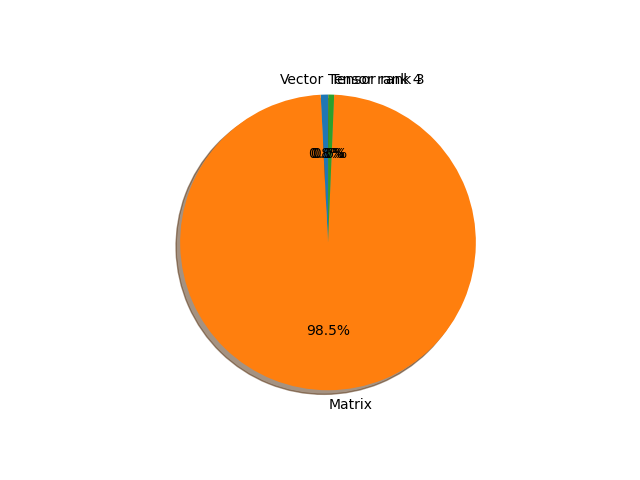

# mobilevitv2 parameter information

**Number of layers: [ 192 ]**

**Number of parameters: [ 4.39M ]**

**Proportional of each form** (%)

| Vector | Matrix | Tensor rank 3 | Tensor rank 4 | 
|  --- | --- | --- | --- |
| 66.67 | 28.12 | 4.69 | 0.52 | 

**Proportional of parameters by form** (%)

| Vector | Matrix | Tensor rank 3 | Tensor rank 4 | 
|  --- | --- | --- | --- |
| 0.79 | 98.55 | 0.64 | 0.02 | 

**Layer information**

| Name | Shape | Squeezed shape | Number of parameters | Form |
| --- | --- | --- | --- | --- |
| conv_stem.convolution.weight | (32, 3, 3, 3) | (32, 3, 3, 3) | 864 | Tensor rank 4 |
| conv_stem.normalization.weight | (32,) | (32,) | 32 | Vector |
| conv_stem.normalization.bias | (32,) | (32,) | 32 | Vector |
| encoder.layer.0.layer.0.expand_1x1.convolution.weight | (64, 32, 1, 1) | (64, 32) | 2048 | Matrix |
| encoder.layer.0.layer.0.expand_1x1.normalization.weight | (64,) | (64,) | 64 | Vector |
| encoder.layer.0.layer.0.expand_1x1.normalization.bias | (64,) | (64,) | 64 | Vector |
| encoder.layer.0.layer.0.conv_3x3.convolution.weight | (64, 1, 3, 3) | (64, 3, 3) | 576 | Tensor rank 3 |
| encoder.layer.0.layer.0.conv_3x3.normalization.weight | (64,) | (64,) | 64 | Vector |
| encoder.layer.0.layer.0.conv_3x3.normalization.bias | (64,) | (64,) | 64 | Vector |
| encoder.layer.0.layer.0.reduce_1x1.convolution.weight | (64, 64, 1, 1) | (64, 64) | 4096 | Matrix |
| encoder.layer.0.layer.0.reduce_1x1.normalization.weight | (64,) | (64,) | 64 | Vector |
| encoder.layer.0.layer.0.reduce_1x1.normalization.bias | (64,) | (64,) | 64 | Vector |
| encoder.layer.1.layer.0.expand_1x1.convolution.weight | (128, 64, 1, 1) | (128, 64) | 8192 | Matrix |
| encoder.layer.1.layer.0.expand_1x1.normalization.weight | (128,) | (128,) | 128 | Vector |
| encoder.layer.1.layer.0.expand_1x1.normalization.bias | (128,) | (128,) | 128 | Vector |
| encoder.layer.1.layer.0.conv_3x3.convolution.weight | (128, 1, 3, 3) | (128, 3, 3) | 1152 | Tensor rank 3 |
| encoder.layer.1.layer.0.conv_3x3.normalization.weight | (128,) | (128,) | 128 | Vector |
| encoder.layer.1.layer.0.conv_3x3.normalization.bias | (128,) | (128,) | 128 | Vector |
| encoder.layer.1.layer.0.reduce_1x1.convolution.weight | (128, 128, 1, 1) | (128, 128) | 16384 | Matrix |
| encoder.layer.1.layer.0.reduce_1x1.normalization.weight | (128,) | (128,) | 128 | Vector |
| encoder.layer.1.layer.0.reduce_1x1.normalization.bias | (128,) | (128,) | 128 | Vector |
| encoder.layer.1.layer.1.expand_1x1.convolution.weight | (256, 128, 1, 1) | (256, 128) | 32768 | Matrix |
| encoder.layer.1.layer.1.expand_1x1.normalization.weight | (256,) | (256,) | 256 | Vector |
| encoder.layer.1.layer.1.expand_1x1.normalization.bias | (256,) | (256,) | 256 | Vector |
| encoder.layer.1.layer.1.conv_3x3.convolution.weight | (256, 1, 3, 3) | (256, 3, 3) | 2304 | Tensor rank 3 |
| encoder.layer.1.layer.1.conv_3x3.normalization.weight | (256,) | (256,) | 256 | Vector |
| encoder.layer.1.layer.1.conv_3x3.normalization.bias | (256,) | (256,) | 256 | Vector |
| encoder.layer.1.layer.1.reduce_1x1.convolution.weight | (128, 256, 1, 1) | (128, 256) | 32768 | Matrix |
| encoder.layer.1.layer.1.reduce_1x1.normalization.weight | (128,) | (128,) | 128 | Vector |
| encoder.layer.1.layer.1.reduce_1x1.normalization.bias | (128,) | (128,) | 128 | Vector |
| encoder.layer.2.downsampling_layer.expand_1x1.convolution.weight | (256, 128, 1, 1) | (256, 128) | 32768 | Matrix |
| encoder.layer.2.downsampling_layer.expand_1x1.normalization.weight | (256,) | (256,) | 256 | Vector |
| encoder.layer.2.downsampling_layer.expand_1x1.normalization.bias | (256,) | (256,) | 256 | Vector |
| encoder.layer.2.downsampling_layer.conv_3x3.convolution.weight | (256, 1, 3, 3) | (256, 3, 3) | 2304 | Tensor rank 3 |
| encoder.layer.2.downsampling_layer.conv_3x3.normalization.weight | (256,) | (256,) | 256 | Vector |
| encoder.layer.2.downsampling_layer.conv_3x3.normalization.bias | (256,) | (256,) | 256 | Vector |
| encoder.layer.2.downsampling_layer.reduce_1x1.convolution.weight | (256, 256, 1, 1) | (256, 256) | 65536 | Matrix |
| encoder.layer.2.downsampling_layer.reduce_1x1.normalization.weight | (256,) | (256,) | 256 | Vector |
| encoder.layer.2.downsampling_layer.reduce_1x1.normalization.bias | (256,) | (256,) | 256 | Vector |
| encoder.layer.2.conv_kxk.convolution.weight | (256, 1, 3, 3) | (256, 3, 3) | 2304 | Tensor rank 3 |
| encoder.layer.2.conv_kxk.normalization.weight | (256,) | (256,) | 256 | Vector |
| encoder.layer.2.conv_kxk.normalization.bias | (256,) | (256,) | 256 | Vector |
| encoder.layer.2.conv_1x1.convolution.weight | (128, 256, 1, 1) | (128, 256) | 32768 | Matrix |
| encoder.layer.2.transformer.layer.0.layernorm_before.weight | (128,) | (128,) | 128 | Vector |
| encoder.layer.2.transformer.layer.0.layernorm_before.bias | (128,) | (128,) | 128 | Vector |
| encoder.layer.2.transformer.layer.0.attention.qkv_proj.convolution.weight | (257, 128, 1, 1) | (257, 128) | 32896 | Matrix |
| encoder.layer.2.transformer.layer.0.attention.qkv_proj.convolution.bias | (257,) | (257,) | 257 | Vector |
| encoder.layer.2.transformer.layer.0.attention.out_proj.convolution.weight | (128, 128, 1, 1) | (128, 128) | 16384 | Matrix |
| encoder.layer.2.transformer.layer.0.attention.out_proj.convolution.bias | (128,) | (128,) | 128 | Vector |
| encoder.layer.2.transformer.layer.0.layernorm_after.weight | (128,) | (128,) | 128 | Vector |
| encoder.layer.2.transformer.layer.0.layernorm_after.bias | (128,) | (128,) | 128 | Vector |
| encoder.layer.2.transformer.layer.0.ffn.conv1.convolution.weight | (256, 128, 1, 1) | (256, 128) | 32768 | Matrix |
| encoder.layer.2.transformer.layer.0.ffn.conv1.convolution.bias | (256,) | (256,) | 256 | Vector |
| encoder.layer.2.transformer.layer.0.ffn.conv2.convolution.weight | (128, 256, 1, 1) | (128, 256) | 32768 | Matrix |
| encoder.layer.2.transformer.layer.0.ffn.conv2.convolution.bias | (128,) | (128,) | 128 | Vector |
| encoder.layer.2.transformer.layer.1.layernorm_before.weight | (128,) | (128,) | 128 | Vector |
| encoder.layer.2.transformer.layer.1.layernorm_before.bias | (128,) | (128,) | 128 | Vector |
| encoder.layer.2.transformer.layer.1.attention.qkv_proj.convolution.weight | (257, 128, 1, 1) | (257, 128) | 32896 | Matrix |
| encoder.layer.2.transformer.layer.1.attention.qkv_proj.convolution.bias | (257,) | (257,) | 257 | Vector |
| encoder.layer.2.transformer.layer.1.attention.out_proj.convolution.weight | (128, 128, 1, 1) | (128, 128) | 16384 | Matrix |
| encoder.layer.2.transformer.layer.1.attention.out_proj.convolution.bias | (128,) | (128,) | 128 | Vector |
| encoder.layer.2.transformer.layer.1.layernorm_after.weight | (128,) | (128,) | 128 | Vector |
| encoder.layer.2.transformer.layer.1.layernorm_after.bias | (128,) | (128,) | 128 | Vector |
| encoder.layer.2.transformer.layer.1.ffn.conv1.convolution.weight | (256, 128, 1, 1) | (256, 128) | 32768 | Matrix |
| encoder.layer.2.transformer.layer.1.ffn.conv1.convolution.bias | (256,) | (256,) | 256 | Vector |
| encoder.layer.2.transformer.layer.1.ffn.conv2.convolution.weight | (128, 256, 1, 1) | (128, 256) | 32768 | Matrix |
| encoder.layer.2.transformer.layer.1.ffn.conv2.convolution.bias | (128,) | (128,) | 128 | Vector |
| encoder.layer.2.layernorm.weight | (128,) | (128,) | 128 | Vector |
| encoder.layer.2.layernorm.bias | (128,) | (128,) | 128 | Vector |
| encoder.layer.2.conv_projection.convolution.weight | (256, 128, 1, 1) | (256, 128) | 32768 | Matrix |
| encoder.layer.2.conv_projection.normalization.weight | (256,) | (256,) | 256 | Vector |
| encoder.layer.2.conv_projection.normalization.bias | (256,) | (256,) | 256 | Vector |
| encoder.layer.3.downsampling_layer.expand_1x1.convolution.weight | (512, 256, 1, 1) | (512, 256) | 131072 | Matrix |
| encoder.layer.3.downsampling_layer.expand_1x1.normalization.weight | (512,) | (512,) | 512 | Vector |
| encoder.layer.3.downsampling_layer.expand_1x1.normalization.bias | (512,) | (512,) | 512 | Vector |
| encoder.layer.3.downsampling_layer.conv_3x3.convolution.weight | (512, 1, 3, 3) | (512, 3, 3) | 4608 | Tensor rank 3 |
| encoder.layer.3.downsampling_layer.conv_3x3.normalization.weight | (512,) | (512,) | 512 | Vector |
| encoder.layer.3.downsampling_layer.conv_3x3.normalization.bias | (512,) | (512,) | 512 | Vector |
| encoder.layer.3.downsampling_layer.reduce_1x1.convolution.weight | (384, 512, 1, 1) | (384, 512) | 196608 | Matrix |
| encoder.layer.3.downsampling_layer.reduce_1x1.normalization.weight | (384,) | (384,) | 384 | Vector |
| encoder.layer.3.downsampling_layer.reduce_1x1.normalization.bias | (384,) | (384,) | 384 | Vector |
| encoder.layer.3.conv_kxk.convolution.weight | (384, 1, 3, 3) | (384, 3, 3) | 3456 | Tensor rank 3 |
| encoder.layer.3.conv_kxk.normalization.weight | (384,) | (384,) | 384 | Vector |
| encoder.layer.3.conv_kxk.normalization.bias | (384,) | (384,) | 384 | Vector |
| encoder.layer.3.conv_1x1.convolution.weight | (192, 384, 1, 1) | (192, 384) | 73728 | Matrix |
| encoder.layer.3.transformer.layer.0.layernorm_before.weight | (192,) | (192,) | 192 | Vector |
| encoder.layer.3.transformer.layer.0.layernorm_before.bias | (192,) | (192,) | 192 | Vector |
| encoder.layer.3.transformer.layer.0.attention.qkv_proj.convolution.weight | (385, 192, 1, 1) | (385, 192) | 73920 | Matrix |
| encoder.layer.3.transformer.layer.0.attention.qkv_proj.convolution.bias | (385,) | (385,) | 385 | Vector |
| encoder.layer.3.transformer.layer.0.attention.out_proj.convolution.weight | (192, 192, 1, 1) | (192, 192) | 36864 | Matrix |
| encoder.layer.3.transformer.layer.0.attention.out_proj.convolution.bias | (192,) | (192,) | 192 | Vector |
| encoder.layer.3.transformer.layer.0.layernorm_after.weight | (192,) | (192,) | 192 | Vector |
| encoder.layer.3.transformer.layer.0.layernorm_after.bias | (192,) | (192,) | 192 | Vector |
| encoder.layer.3.transformer.layer.0.ffn.conv1.convolution.weight | (384, 192, 1, 1) | (384, 192) | 73728 | Matrix |
| encoder.layer.3.transformer.layer.0.ffn.conv1.convolution.bias | (384,) | (384,) | 384 | Vector |
| encoder.layer.3.transformer.layer.0.ffn.conv2.convolution.weight | (192, 384, 1, 1) | (192, 384) | 73728 | Matrix |
| encoder.layer.3.transformer.layer.0.ffn.conv2.convolution.bias | (192,) | (192,) | 192 | Vector |
| encoder.layer.3.transformer.layer.1.layernorm_before.weight | (192,) | (192,) | 192 | Vector |
| encoder.layer.3.transformer.layer.1.layernorm_before.bias | (192,) | (192,) | 192 | Vector |
| encoder.layer.3.transformer.layer.1.attention.qkv_proj.convolution.weight | (385, 192, 1, 1) | (385, 192) | 73920 | Matrix |
| encoder.layer.3.transformer.layer.1.attention.qkv_proj.convolution.bias | (385,) | (385,) | 385 | Vector |
| encoder.layer.3.transformer.layer.1.attention.out_proj.convolution.weight | (192, 192, 1, 1) | (192, 192) | 36864 | Matrix |
| encoder.layer.3.transformer.layer.1.attention.out_proj.convolution.bias | (192,) | (192,) | 192 | Vector |
| encoder.layer.3.transformer.layer.1.layernorm_after.weight | (192,) | (192,) | 192 | Vector |
| encoder.layer.3.transformer.layer.1.layernorm_after.bias | (192,) | (192,) | 192 | Vector |
| encoder.layer.3.transformer.layer.1.ffn.conv1.convolution.weight | (384, 192, 1, 1) | (384, 192) | 73728 | Matrix |
| encoder.layer.3.transformer.layer.1.ffn.conv1.convolution.bias | (384,) | (384,) | 384 | Vector |
| encoder.layer.3.transformer.layer.1.ffn.conv2.convolution.weight | (192, 384, 1, 1) | (192, 384) | 73728 | Matrix |
| encoder.layer.3.transformer.layer.1.ffn.conv2.convolution.bias | (192,) | (192,) | 192 | Vector |
| encoder.layer.3.transformer.layer.2.layernorm_before.weight | (192,) | (192,) | 192 | Vector |
| encoder.layer.3.transformer.layer.2.layernorm_before.bias | (192,) | (192,) | 192 | Vector |
| encoder.layer.3.transformer.layer.2.attention.qkv_proj.convolution.weight | (385, 192, 1, 1) | (385, 192) | 73920 | Matrix |
| encoder.layer.3.transformer.layer.2.attention.qkv_proj.convolution.bias | (385,) | (385,) | 385 | Vector |
| encoder.layer.3.transformer.layer.2.attention.out_proj.convolution.weight | (192, 192, 1, 1) | (192, 192) | 36864 | Matrix |
| encoder.layer.3.transformer.layer.2.attention.out_proj.convolution.bias | (192,) | (192,) | 192 | Vector |
| encoder.layer.3.transformer.layer.2.layernorm_after.weight | (192,) | (192,) | 192 | Vector |
| encoder.layer.3.transformer.layer.2.layernorm_after.bias | (192,) | (192,) | 192 | Vector |
| encoder.layer.3.transformer.layer.2.ffn.conv1.convolution.weight | (384, 192, 1, 1) | (384, 192) | 73728 | Matrix |
| encoder.layer.3.transformer.layer.2.ffn.conv1.convolution.bias | (384,) | (384,) | 384 | Vector |
| encoder.layer.3.transformer.layer.2.ffn.conv2.convolution.weight | (192, 384, 1, 1) | (192, 384) | 73728 | Matrix |
| encoder.layer.3.transformer.layer.2.ffn.conv2.convolution.bias | (192,) | (192,) | 192 | Vector |
| encoder.layer.3.transformer.layer.3.layernorm_before.weight | (192,) | (192,) | 192 | Vector |
| encoder.layer.3.transformer.layer.3.layernorm_before.bias | (192,) | (192,) | 192 | Vector |
| encoder.layer.3.transformer.layer.3.attention.qkv_proj.convolution.weight | (385, 192, 1, 1) | (385, 192) | 73920 | Matrix |
| encoder.layer.3.transformer.layer.3.attention.qkv_proj.convolution.bias | (385,) | (385,) | 385 | Vector |
| encoder.layer.3.transformer.layer.3.attention.out_proj.convolution.weight | (192, 192, 1, 1) | (192, 192) | 36864 | Matrix |
| encoder.layer.3.transformer.layer.3.attention.out_proj.convolution.bias | (192,) | (192,) | 192 | Vector |
| encoder.layer.3.transformer.layer.3.layernorm_after.weight | (192,) | (192,) | 192 | Vector |
| encoder.layer.3.transformer.layer.3.layernorm_after.bias | (192,) | (192,) | 192 | Vector |
| encoder.layer.3.transformer.layer.3.ffn.conv1.convolution.weight | (384, 192, 1, 1) | (384, 192) | 73728 | Matrix |
| encoder.layer.3.transformer.layer.3.ffn.conv1.convolution.bias | (384,) | (384,) | 384 | Vector |
| encoder.layer.3.transformer.layer.3.ffn.conv2.convolution.weight | (192, 384, 1, 1) | (192, 384) | 73728 | Matrix |
| encoder.layer.3.transformer.layer.3.ffn.conv2.convolution.bias | (192,) | (192,) | 192 | Vector |
| encoder.layer.3.layernorm.weight | (192,) | (192,) | 192 | Vector |
| encoder.layer.3.layernorm.bias | (192,) | (192,) | 192 | Vector |
| encoder.layer.3.conv_projection.convolution.weight | (384, 192, 1, 1) | (384, 192) | 73728 | Matrix |
| encoder.layer.3.conv_projection.normalization.weight | (384,) | (384,) | 384 | Vector |
| encoder.layer.3.conv_projection.normalization.bias | (384,) | (384,) | 384 | Vector |
| encoder.layer.4.downsampling_layer.expand_1x1.convolution.weight | (768, 384, 1, 1) | (768, 384) | 294912 | Matrix |
| encoder.layer.4.downsampling_layer.expand_1x1.normalization.weight | (768,) | (768,) | 768 | Vector |
| encoder.layer.4.downsampling_layer.expand_1x1.normalization.bias | (768,) | (768,) | 768 | Vector |
| encoder.layer.4.downsampling_layer.conv_3x3.convolution.weight | (768, 1, 3, 3) | (768, 3, 3) | 6912 | Tensor rank 3 |
| encoder.layer.4.downsampling_layer.conv_3x3.normalization.weight | (768,) | (768,) | 768 | Vector |
| encoder.layer.4.downsampling_layer.conv_3x3.normalization.bias | (768,) | (768,) | 768 | Vector |
| encoder.layer.4.downsampling_layer.reduce_1x1.convolution.weight | (512, 768, 1, 1) | (512, 768) | 393216 | Matrix |
| encoder.layer.4.downsampling_layer.reduce_1x1.normalization.weight | (512,) | (512,) | 512 | Vector |
| encoder.layer.4.downsampling_layer.reduce_1x1.normalization.bias | (512,) | (512,) | 512 | Vector |
| encoder.layer.4.conv_kxk.convolution.weight | (512, 1, 3, 3) | (512, 3, 3) | 4608 | Tensor rank 3 |
| encoder.layer.4.conv_kxk.normalization.weight | (512,) | (512,) | 512 | Vector |
| encoder.layer.4.conv_kxk.normalization.bias | (512,) | (512,) | 512 | Vector |
| encoder.layer.4.conv_1x1.convolution.weight | (256, 512, 1, 1) | (256, 512) | 131072 | Matrix |
| encoder.layer.4.transformer.layer.0.layernorm_before.weight | (256,) | (256,) | 256 | Vector |
| encoder.layer.4.transformer.layer.0.layernorm_before.bias | (256,) | (256,) | 256 | Vector |
| encoder.layer.4.transformer.layer.0.attention.qkv_proj.convolution.weight | (513, 256, 1, 1) | (513, 256) | 131328 | Matrix |
| encoder.layer.4.transformer.layer.0.attention.qkv_proj.convolution.bias | (513,) | (513,) | 513 | Vector |
| encoder.layer.4.transformer.layer.0.attention.out_proj.convolution.weight | (256, 256, 1, 1) | (256, 256) | 65536 | Matrix |
| encoder.layer.4.transformer.layer.0.attention.out_proj.convolution.bias | (256,) | (256,) | 256 | Vector |
| encoder.layer.4.transformer.layer.0.layernorm_after.weight | (256,) | (256,) | 256 | Vector |
| encoder.layer.4.transformer.layer.0.layernorm_after.bias | (256,) | (256,) | 256 | Vector |
| encoder.layer.4.transformer.layer.0.ffn.conv1.convolution.weight | (512, 256, 1, 1) | (512, 256) | 131072 | Matrix |
| encoder.layer.4.transformer.layer.0.ffn.conv1.convolution.bias | (512,) | (512,) | 512 | Vector |
| encoder.layer.4.transformer.layer.0.ffn.conv2.convolution.weight | (256, 512, 1, 1) | (256, 512) | 131072 | Matrix |
| encoder.layer.4.transformer.layer.0.ffn.conv2.convolution.bias | (256,) | (256,) | 256 | Vector |
| encoder.layer.4.transformer.layer.1.layernorm_before.weight | (256,) | (256,) | 256 | Vector |
| encoder.layer.4.transformer.layer.1.layernorm_before.bias | (256,) | (256,) | 256 | Vector |
| encoder.layer.4.transformer.layer.1.attention.qkv_proj.convolution.weight | (513, 256, 1, 1) | (513, 256) | 131328 | Matrix |
| encoder.layer.4.transformer.layer.1.attention.qkv_proj.convolution.bias | (513,) | (513,) | 513 | Vector |
| encoder.layer.4.transformer.layer.1.attention.out_proj.convolution.weight | (256, 256, 1, 1) | (256, 256) | 65536 | Matrix |
| encoder.layer.4.transformer.layer.1.attention.out_proj.convolution.bias | (256,) | (256,) | 256 | Vector |
| encoder.layer.4.transformer.layer.1.layernorm_after.weight | (256,) | (256,) | 256 | Vector |
| encoder.layer.4.transformer.layer.1.layernorm_after.bias | (256,) | (256,) | 256 | Vector |
| encoder.layer.4.transformer.layer.1.ffn.conv1.convolution.weight | (512, 256, 1, 1) | (512, 256) | 131072 | Matrix |
| encoder.layer.4.transformer.layer.1.ffn.conv1.convolution.bias | (512,) | (512,) | 512 | Vector |
| encoder.layer.4.transformer.layer.1.ffn.conv2.convolution.weight | (256, 512, 1, 1) | (256, 512) | 131072 | Matrix |
| encoder.layer.4.transformer.layer.1.ffn.conv2.convolution.bias | (256,) | (256,) | 256 | Vector |
| encoder.layer.4.transformer.layer.2.layernorm_before.weight | (256,) | (256,) | 256 | Vector |
| encoder.layer.4.transformer.layer.2.layernorm_before.bias | (256,) | (256,) | 256 | Vector |
| encoder.layer.4.transformer.layer.2.attention.qkv_proj.convolution.weight | (513, 256, 1, 1) | (513, 256) | 131328 | Matrix |
| encoder.layer.4.transformer.layer.2.attention.qkv_proj.convolution.bias | (513,) | (513,) | 513 | Vector |
| encoder.layer.4.transformer.layer.2.attention.out_proj.convolution.weight | (256, 256, 1, 1) | (256, 256) | 65536 | Matrix |
| encoder.layer.4.transformer.layer.2.attention.out_proj.convolution.bias | (256,) | (256,) | 256 | Vector |
| encoder.layer.4.transformer.layer.2.layernorm_after.weight | (256,) | (256,) | 256 | Vector |
| encoder.layer.4.transformer.layer.2.layernorm_after.bias | (256,) | (256,) | 256 | Vector |
| encoder.layer.4.transformer.layer.2.ffn.conv1.convolution.weight | (512, 256, 1, 1) | (512, 256) | 131072 | Matrix |
| encoder.layer.4.transformer.layer.2.ffn.conv1.convolution.bias | (512,) | (512,) | 512 | Vector |
| encoder.layer.4.transformer.layer.2.ffn.conv2.convolution.weight | (256, 512, 1, 1) | (256, 512) | 131072 | Matrix |
| encoder.layer.4.transformer.layer.2.ffn.conv2.convolution.bias | (256,) | (256,) | 256 | Vector |
| encoder.layer.4.layernorm.weight | (256,) | (256,) | 256 | Vector |
| encoder.layer.4.layernorm.bias | (256,) | (256,) | 256 | Vector |
| encoder.layer.4.conv_projection.convolution.weight | (512, 256, 1, 1) | (512, 256) | 131072 | Matrix |
| encoder.layer.4.conv_projection.normalization.weight | (512,) | (512,) | 512 | Vector |
| encoder.layer.4.conv_projection.normalization.bias | (512,) | (512,) | 512 | Vector |

