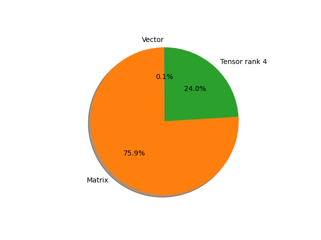

# regnet_y_128gf parameter information

**Number of layers: [ 368 ]**

**Number of parameters: [ 644.81M ]**

**Proportional of each form** (%)

| Vector | Matrix | Tensor rank 4 | 
|  --- | --- | --- |
| 61.68 | 30.71 | 7.61 | 

**Proportional of parameters by form** (%)

| Vector | Matrix | Tensor rank 4 | 
|  --- | --- | --- |
| 0.08 | 75.90 | 24.03 | 

**Layer information**

| Name | Shape | Squeezed shape | Number of parameters | Form |
| --- | --- | --- | --- | --- |
| stem.0.weight | (32, 3, 3, 3) | (32, 3, 3, 3) | 864 | Tensor rank 4 |
| stem.1.weight | (32,) | (32,) | 32 | Vector |
| stem.1.bias | (32,) | (32,) | 32 | Vector |
| trunk_output.block1.block1-0.proj.0.weight | (528, 32, 1, 1) | (528, 32) | 16896 | Matrix |
| trunk_output.block1.block1-0.proj.1.weight | (528,) | (528,) | 528 | Vector |
| trunk_output.block1.block1-0.proj.1.bias | (528,) | (528,) | 528 | Vector |
| trunk_output.block1.block1-0.f.a.0.weight | (528, 32, 1, 1) | (528, 32) | 16896 | Matrix |
| trunk_output.block1.block1-0.f.a.1.weight | (528,) | (528,) | 528 | Vector |
| trunk_output.block1.block1-0.f.a.1.bias | (528,) | (528,) | 528 | Vector |
| trunk_output.block1.block1-0.f.b.0.weight | (528, 264, 3, 3) | (528, 264, 3, 3) | 1254528 | Tensor rank 4 |
| trunk_output.block1.block1-0.f.b.1.weight | (528,) | (528,) | 528 | Vector |
| trunk_output.block1.block1-0.f.b.1.bias | (528,) | (528,) | 528 | Vector |
| trunk_output.block1.block1-0.f.se.fc1.weight | (8, 528, 1, 1) | (8, 528) | 4224 | Matrix |
| trunk_output.block1.block1-0.f.se.fc1.bias | (8,) | (8,) | 8 | Vector |
| trunk_output.block1.block1-0.f.se.fc2.weight | (528, 8, 1, 1) | (528, 8) | 4224 | Matrix |
| trunk_output.block1.block1-0.f.se.fc2.bias | (528,) | (528,) | 528 | Vector |
| trunk_output.block1.block1-0.f.c.0.weight | (528, 528, 1, 1) | (528, 528) | 278784 | Matrix |
| trunk_output.block1.block1-0.f.c.1.weight | (528,) | (528,) | 528 | Vector |
| trunk_output.block1.block1-0.f.c.1.bias | (528,) | (528,) | 528 | Vector |
| trunk_output.block1.block1-1.f.a.0.weight | (528, 528, 1, 1) | (528, 528) | 278784 | Matrix |
| trunk_output.block1.block1-1.f.a.1.weight | (528,) | (528,) | 528 | Vector |
| trunk_output.block1.block1-1.f.a.1.bias | (528,) | (528,) | 528 | Vector |
| trunk_output.block1.block1-1.f.b.0.weight | (528, 264, 3, 3) | (528, 264, 3, 3) | 1254528 | Tensor rank 4 |
| trunk_output.block1.block1-1.f.b.1.weight | (528,) | (528,) | 528 | Vector |
| trunk_output.block1.block1-1.f.b.1.bias | (528,) | (528,) | 528 | Vector |
| trunk_output.block1.block1-1.f.se.fc1.weight | (132, 528, 1, 1) | (132, 528) | 69696 | Matrix |
| trunk_output.block1.block1-1.f.se.fc1.bias | (132,) | (132,) | 132 | Vector |
| trunk_output.block1.block1-1.f.se.fc2.weight | (528, 132, 1, 1) | (528, 132) | 69696 | Matrix |
| trunk_output.block1.block1-1.f.se.fc2.bias | (528,) | (528,) | 528 | Vector |
| trunk_output.block1.block1-1.f.c.0.weight | (528, 528, 1, 1) | (528, 528) | 278784 | Matrix |
| trunk_output.block1.block1-1.f.c.1.weight | (528,) | (528,) | 528 | Vector |
| trunk_output.block1.block1-1.f.c.1.bias | (528,) | (528,) | 528 | Vector |
| trunk_output.block2.block2-0.proj.0.weight | (1056, 528, 1, 1) | (1056, 528) | 557568 | Matrix |
| trunk_output.block2.block2-0.proj.1.weight | (1056,) | (1056,) | 1056 | Vector |
| trunk_output.block2.block2-0.proj.1.bias | (1056,) | (1056,) | 1056 | Vector |
| trunk_output.block2.block2-0.f.a.0.weight | (1056, 528, 1, 1) | (1056, 528) | 557568 | Matrix |
| trunk_output.block2.block2-0.f.a.1.weight | (1056,) | (1056,) | 1056 | Vector |
| trunk_output.block2.block2-0.f.a.1.bias | (1056,) | (1056,) | 1056 | Vector |
| trunk_output.block2.block2-0.f.b.0.weight | (1056, 264, 3, 3) | (1056, 264, 3, 3) | 2509056 | Tensor rank 4 |
| trunk_output.block2.block2-0.f.b.1.weight | (1056,) | (1056,) | 1056 | Vector |
| trunk_output.block2.block2-0.f.b.1.bias | (1056,) | (1056,) | 1056 | Vector |
| trunk_output.block2.block2-0.f.se.fc1.weight | (132, 1056, 1, 1) | (132, 1056) | 139392 | Matrix |
| trunk_output.block2.block2-0.f.se.fc1.bias | (132,) | (132,) | 132 | Vector |
| trunk_output.block2.block2-0.f.se.fc2.weight | (1056, 132, 1, 1) | (1056, 132) | 139392 | Matrix |
| trunk_output.block2.block2-0.f.se.fc2.bias | (1056,) | (1056,) | 1056 | Vector |
| trunk_output.block2.block2-0.f.c.0.weight | (1056, 1056, 1, 1) | (1056, 1056) | 1115136 | Matrix |
| trunk_output.block2.block2-0.f.c.1.weight | (1056,) | (1056,) | 1056 | Vector |
| trunk_output.block2.block2-0.f.c.1.bias | (1056,) | (1056,) | 1056 | Vector |
| trunk_output.block2.block2-1.f.a.0.weight | (1056, 1056, 1, 1) | (1056, 1056) | 1115136 | Matrix |
| trunk_output.block2.block2-1.f.a.1.weight | (1056,) | (1056,) | 1056 | Vector |
| trunk_output.block2.block2-1.f.a.1.bias | (1056,) | (1056,) | 1056 | Vector |
| trunk_output.block2.block2-1.f.b.0.weight | (1056, 264, 3, 3) | (1056, 264, 3, 3) | 2509056 | Tensor rank 4 |
| trunk_output.block2.block2-1.f.b.1.weight | (1056,) | (1056,) | 1056 | Vector |
| trunk_output.block2.block2-1.f.b.1.bias | (1056,) | (1056,) | 1056 | Vector |
| trunk_output.block2.block2-1.f.se.fc1.weight | (264, 1056, 1, 1) | (264, 1056) | 278784 | Matrix |
| trunk_output.block2.block2-1.f.se.fc1.bias | (264,) | (264,) | 264 | Vector |
| trunk_output.block2.block2-1.f.se.fc2.weight | (1056, 264, 1, 1) | (1056, 264) | 278784 | Matrix |
| trunk_output.block2.block2-1.f.se.fc2.bias | (1056,) | (1056,) | 1056 | Vector |
| trunk_output.block2.block2-1.f.c.0.weight | (1056, 1056, 1, 1) | (1056, 1056) | 1115136 | Matrix |
| trunk_output.block2.block2-1.f.c.1.weight | (1056,) | (1056,) | 1056 | Vector |
| trunk_output.block2.block2-1.f.c.1.bias | (1056,) | (1056,) | 1056 | Vector |
| trunk_output.block2.block2-2.f.a.0.weight | (1056, 1056, 1, 1) | (1056, 1056) | 1115136 | Matrix |
| trunk_output.block2.block2-2.f.a.1.weight | (1056,) | (1056,) | 1056 | Vector |
| trunk_output.block2.block2-2.f.a.1.bias | (1056,) | (1056,) | 1056 | Vector |
| trunk_output.block2.block2-2.f.b.0.weight | (1056, 264, 3, 3) | (1056, 264, 3, 3) | 2509056 | Tensor rank 4 |
| trunk_output.block2.block2-2.f.b.1.weight | (1056,) | (1056,) | 1056 | Vector |
| trunk_output.block2.block2-2.f.b.1.bias | (1056,) | (1056,) | 1056 | Vector |
| trunk_output.block2.block2-2.f.se.fc1.weight | (264, 1056, 1, 1) | (264, 1056) | 278784 | Matrix |
| trunk_output.block2.block2-2.f.se.fc1.bias | (264,) | (264,) | 264 | Vector |
| trunk_output.block2.block2-2.f.se.fc2.weight | (1056, 264, 1, 1) | (1056, 264) | 278784 | Matrix |
| trunk_output.block2.block2-2.f.se.fc2.bias | (1056,) | (1056,) | 1056 | Vector |
| trunk_output.block2.block2-2.f.c.0.weight | (1056, 1056, 1, 1) | (1056, 1056) | 1115136 | Matrix |
| trunk_output.block2.block2-2.f.c.1.weight | (1056,) | (1056,) | 1056 | Vector |
| trunk_output.block2.block2-2.f.c.1.bias | (1056,) | (1056,) | 1056 | Vector |
| trunk_output.block2.block2-3.f.a.0.weight | (1056, 1056, 1, 1) | (1056, 1056) | 1115136 | Matrix |
| trunk_output.block2.block2-3.f.a.1.weight | (1056,) | (1056,) | 1056 | Vector |
| trunk_output.block2.block2-3.f.a.1.bias | (1056,) | (1056,) | 1056 | Vector |
| trunk_output.block2.block2-3.f.b.0.weight | (1056, 264, 3, 3) | (1056, 264, 3, 3) | 2509056 | Tensor rank 4 |
| trunk_output.block2.block2-3.f.b.1.weight | (1056,) | (1056,) | 1056 | Vector |
| trunk_output.block2.block2-3.f.b.1.bias | (1056,) | (1056,) | 1056 | Vector |
| trunk_output.block2.block2-3.f.se.fc1.weight | (264, 1056, 1, 1) | (264, 1056) | 278784 | Matrix |
| trunk_output.block2.block2-3.f.se.fc1.bias | (264,) | (264,) | 264 | Vector |
| trunk_output.block2.block2-3.f.se.fc2.weight | (1056, 264, 1, 1) | (1056, 264) | 278784 | Matrix |
| trunk_output.block2.block2-3.f.se.fc2.bias | (1056,) | (1056,) | 1056 | Vector |
| trunk_output.block2.block2-3.f.c.0.weight | (1056, 1056, 1, 1) | (1056, 1056) | 1115136 | Matrix |
| trunk_output.block2.block2-3.f.c.1.weight | (1056,) | (1056,) | 1056 | Vector |
| trunk_output.block2.block2-3.f.c.1.bias | (1056,) | (1056,) | 1056 | Vector |
| trunk_output.block2.block2-4.f.a.0.weight | (1056, 1056, 1, 1) | (1056, 1056) | 1115136 | Matrix |
| trunk_output.block2.block2-4.f.a.1.weight | (1056,) | (1056,) | 1056 | Vector |
| trunk_output.block2.block2-4.f.a.1.bias | (1056,) | (1056,) | 1056 | Vector |
| trunk_output.block2.block2-4.f.b.0.weight | (1056, 264, 3, 3) | (1056, 264, 3, 3) | 2509056 | Tensor rank 4 |
| trunk_output.block2.block2-4.f.b.1.weight | (1056,) | (1056,) | 1056 | Vector |
| trunk_output.block2.block2-4.f.b.1.bias | (1056,) | (1056,) | 1056 | Vector |
| trunk_output.block2.block2-4.f.se.fc1.weight | (264, 1056, 1, 1) | (264, 1056) | 278784 | Matrix |
| trunk_output.block2.block2-4.f.se.fc1.bias | (264,) | (264,) | 264 | Vector |
| trunk_output.block2.block2-4.f.se.fc2.weight | (1056, 264, 1, 1) | (1056, 264) | 278784 | Matrix |
| trunk_output.block2.block2-4.f.se.fc2.bias | (1056,) | (1056,) | 1056 | Vector |
| trunk_output.block2.block2-4.f.c.0.weight | (1056, 1056, 1, 1) | (1056, 1056) | 1115136 | Matrix |
| trunk_output.block2.block2-4.f.c.1.weight | (1056,) | (1056,) | 1056 | Vector |
| trunk_output.block2.block2-4.f.c.1.bias | (1056,) | (1056,) | 1056 | Vector |
| trunk_output.block2.block2-5.f.a.0.weight | (1056, 1056, 1, 1) | (1056, 1056) | 1115136 | Matrix |
| trunk_output.block2.block2-5.f.a.1.weight | (1056,) | (1056,) | 1056 | Vector |
| trunk_output.block2.block2-5.f.a.1.bias | (1056,) | (1056,) | 1056 | Vector |
| trunk_output.block2.block2-5.f.b.0.weight | (1056, 264, 3, 3) | (1056, 264, 3, 3) | 2509056 | Tensor rank 4 |
| trunk_output.block2.block2-5.f.b.1.weight | (1056,) | (1056,) | 1056 | Vector |
| trunk_output.block2.block2-5.f.b.1.bias | (1056,) | (1056,) | 1056 | Vector |
| trunk_output.block2.block2-5.f.se.fc1.weight | (264, 1056, 1, 1) | (264, 1056) | 278784 | Matrix |
| trunk_output.block2.block2-5.f.se.fc1.bias | (264,) | (264,) | 264 | Vector |
| trunk_output.block2.block2-5.f.se.fc2.weight | (1056, 264, 1, 1) | (1056, 264) | 278784 | Matrix |
| trunk_output.block2.block2-5.f.se.fc2.bias | (1056,) | (1056,) | 1056 | Vector |
| trunk_output.block2.block2-5.f.c.0.weight | (1056, 1056, 1, 1) | (1056, 1056) | 1115136 | Matrix |
| trunk_output.block2.block2-5.f.c.1.weight | (1056,) | (1056,) | 1056 | Vector |
| trunk_output.block2.block2-5.f.c.1.bias | (1056,) | (1056,) | 1056 | Vector |
| trunk_output.block2.block2-6.f.a.0.weight | (1056, 1056, 1, 1) | (1056, 1056) | 1115136 | Matrix |
| trunk_output.block2.block2-6.f.a.1.weight | (1056,) | (1056,) | 1056 | Vector |
| trunk_output.block2.block2-6.f.a.1.bias | (1056,) | (1056,) | 1056 | Vector |
| trunk_output.block2.block2-6.f.b.0.weight | (1056, 264, 3, 3) | (1056, 264, 3, 3) | 2509056 | Tensor rank 4 |
| trunk_output.block2.block2-6.f.b.1.weight | (1056,) | (1056,) | 1056 | Vector |
| trunk_output.block2.block2-6.f.b.1.bias | (1056,) | (1056,) | 1056 | Vector |
| trunk_output.block2.block2-6.f.se.fc1.weight | (264, 1056, 1, 1) | (264, 1056) | 278784 | Matrix |
| trunk_output.block2.block2-6.f.se.fc1.bias | (264,) | (264,) | 264 | Vector |
| trunk_output.block2.block2-6.f.se.fc2.weight | (1056, 264, 1, 1) | (1056, 264) | 278784 | Matrix |
| trunk_output.block2.block2-6.f.se.fc2.bias | (1056,) | (1056,) | 1056 | Vector |
| trunk_output.block2.block2-6.f.c.0.weight | (1056, 1056, 1, 1) | (1056, 1056) | 1115136 | Matrix |
| trunk_output.block2.block2-6.f.c.1.weight | (1056,) | (1056,) | 1056 | Vector |
| trunk_output.block2.block2-6.f.c.1.bias | (1056,) | (1056,) | 1056 | Vector |
| trunk_output.block3.block3-0.proj.0.weight | (2904, 1056, 1, 1) | (2904, 1056) | 3066624 | Matrix |
| trunk_output.block3.block3-0.proj.1.weight | (2904,) | (2904,) | 2904 | Vector |
| trunk_output.block3.block3-0.proj.1.bias | (2904,) | (2904,) | 2904 | Vector |
| trunk_output.block3.block3-0.f.a.0.weight | (2904, 1056, 1, 1) | (2904, 1056) | 3066624 | Matrix |
| trunk_output.block3.block3-0.f.a.1.weight | (2904,) | (2904,) | 2904 | Vector |
| trunk_output.block3.block3-0.f.a.1.bias | (2904,) | (2904,) | 2904 | Vector |
| trunk_output.block3.block3-0.f.b.0.weight | (2904, 264, 3, 3) | (2904, 264, 3, 3) | 6899904 | Tensor rank 4 |
| trunk_output.block3.block3-0.f.b.1.weight | (2904,) | (2904,) | 2904 | Vector |
| trunk_output.block3.block3-0.f.b.1.bias | (2904,) | (2904,) | 2904 | Vector |
| trunk_output.block3.block3-0.f.se.fc1.weight | (264, 2904, 1, 1) | (264, 2904) | 766656 | Matrix |
| trunk_output.block3.block3-0.f.se.fc1.bias | (264,) | (264,) | 264 | Vector |
| trunk_output.block3.block3-0.f.se.fc2.weight | (2904, 264, 1, 1) | (2904, 264) | 766656 | Matrix |
| trunk_output.block3.block3-0.f.se.fc2.bias | (2904,) | (2904,) | 2904 | Vector |
| trunk_output.block3.block3-0.f.c.0.weight | (2904, 2904, 1, 1) | (2904, 2904) | 8433216 | Matrix |
| trunk_output.block3.block3-0.f.c.1.weight | (2904,) | (2904,) | 2904 | Vector |
| trunk_output.block3.block3-0.f.c.1.bias | (2904,) | (2904,) | 2904 | Vector |
| trunk_output.block3.block3-1.f.a.0.weight | (2904, 2904, 1, 1) | (2904, 2904) | 8433216 | Matrix |
| trunk_output.block3.block3-1.f.a.1.weight | (2904,) | (2904,) | 2904 | Vector |
| trunk_output.block3.block3-1.f.a.1.bias | (2904,) | (2904,) | 2904 | Vector |
| trunk_output.block3.block3-1.f.b.0.weight | (2904, 264, 3, 3) | (2904, 264, 3, 3) | 6899904 | Tensor rank 4 |
| trunk_output.block3.block3-1.f.b.1.weight | (2904,) | (2904,) | 2904 | Vector |
| trunk_output.block3.block3-1.f.b.1.bias | (2904,) | (2904,) | 2904 | Vector |
| trunk_output.block3.block3-1.f.se.fc1.weight | (726, 2904, 1, 1) | (726, 2904) | 2108304 | Matrix |
| trunk_output.block3.block3-1.f.se.fc1.bias | (726,) | (726,) | 726 | Vector |
| trunk_output.block3.block3-1.f.se.fc2.weight | (2904, 726, 1, 1) | (2904, 726) | 2108304 | Matrix |
| trunk_output.block3.block3-1.f.se.fc2.bias | (2904,) | (2904,) | 2904 | Vector |
| trunk_output.block3.block3-1.f.c.0.weight | (2904, 2904, 1, 1) | (2904, 2904) | 8433216 | Matrix |
| trunk_output.block3.block3-1.f.c.1.weight | (2904,) | (2904,) | 2904 | Vector |
| trunk_output.block3.block3-1.f.c.1.bias | (2904,) | (2904,) | 2904 | Vector |
| trunk_output.block3.block3-2.f.a.0.weight | (2904, 2904, 1, 1) | (2904, 2904) | 8433216 | Matrix |
| trunk_output.block3.block3-2.f.a.1.weight | (2904,) | (2904,) | 2904 | Vector |
| trunk_output.block3.block3-2.f.a.1.bias | (2904,) | (2904,) | 2904 | Vector |
| trunk_output.block3.block3-2.f.b.0.weight | (2904, 264, 3, 3) | (2904, 264, 3, 3) | 6899904 | Tensor rank 4 |
| trunk_output.block3.block3-2.f.b.1.weight | (2904,) | (2904,) | 2904 | Vector |
| trunk_output.block3.block3-2.f.b.1.bias | (2904,) | (2904,) | 2904 | Vector |
| trunk_output.block3.block3-2.f.se.fc1.weight | (726, 2904, 1, 1) | (726, 2904) | 2108304 | Matrix |
| trunk_output.block3.block3-2.f.se.fc1.bias | (726,) | (726,) | 726 | Vector |
| trunk_output.block3.block3-2.f.se.fc2.weight | (2904, 726, 1, 1) | (2904, 726) | 2108304 | Matrix |
| trunk_output.block3.block3-2.f.se.fc2.bias | (2904,) | (2904,) | 2904 | Vector |
| trunk_output.block3.block3-2.f.c.0.weight | (2904, 2904, 1, 1) | (2904, 2904) | 8433216 | Matrix |
| trunk_output.block3.block3-2.f.c.1.weight | (2904,) | (2904,) | 2904 | Vector |
| trunk_output.block3.block3-2.f.c.1.bias | (2904,) | (2904,) | 2904 | Vector |
| trunk_output.block3.block3-3.f.a.0.weight | (2904, 2904, 1, 1) | (2904, 2904) | 8433216 | Matrix |
| trunk_output.block3.block3-3.f.a.1.weight | (2904,) | (2904,) | 2904 | Vector |
| trunk_output.block3.block3-3.f.a.1.bias | (2904,) | (2904,) | 2904 | Vector |
| trunk_output.block3.block3-3.f.b.0.weight | (2904, 264, 3, 3) | (2904, 264, 3, 3) | 6899904 | Tensor rank 4 |
| trunk_output.block3.block3-3.f.b.1.weight | (2904,) | (2904,) | 2904 | Vector |
| trunk_output.block3.block3-3.f.b.1.bias | (2904,) | (2904,) | 2904 | Vector |
| trunk_output.block3.block3-3.f.se.fc1.weight | (726, 2904, 1, 1) | (726, 2904) | 2108304 | Matrix |
| trunk_output.block3.block3-3.f.se.fc1.bias | (726,) | (726,) | 726 | Vector |
| trunk_output.block3.block3-3.f.se.fc2.weight | (2904, 726, 1, 1) | (2904, 726) | 2108304 | Matrix |
| trunk_output.block3.block3-3.f.se.fc2.bias | (2904,) | (2904,) | 2904 | Vector |
| trunk_output.block3.block3-3.f.c.0.weight | (2904, 2904, 1, 1) | (2904, 2904) | 8433216 | Matrix |
| trunk_output.block3.block3-3.f.c.1.weight | (2904,) | (2904,) | 2904 | Vector |
| trunk_output.block3.block3-3.f.c.1.bias | (2904,) | (2904,) | 2904 | Vector |
| trunk_output.block3.block3-4.f.a.0.weight | (2904, 2904, 1, 1) | (2904, 2904) | 8433216 | Matrix |
| trunk_output.block3.block3-4.f.a.1.weight | (2904,) | (2904,) | 2904 | Vector |
| trunk_output.block3.block3-4.f.a.1.bias | (2904,) | (2904,) | 2904 | Vector |
| trunk_output.block3.block3-4.f.b.0.weight | (2904, 264, 3, 3) | (2904, 264, 3, 3) | 6899904 | Tensor rank 4 |
| trunk_output.block3.block3-4.f.b.1.weight | (2904,) | (2904,) | 2904 | Vector |
| trunk_output.block3.block3-4.f.b.1.bias | (2904,) | (2904,) | 2904 | Vector |
| trunk_output.block3.block3-4.f.se.fc1.weight | (726, 2904, 1, 1) | (726, 2904) | 2108304 | Matrix |
| trunk_output.block3.block3-4.f.se.fc1.bias | (726,) | (726,) | 726 | Vector |
| trunk_output.block3.block3-4.f.se.fc2.weight | (2904, 726, 1, 1) | (2904, 726) | 2108304 | Matrix |
| trunk_output.block3.block3-4.f.se.fc2.bias | (2904,) | (2904,) | 2904 | Vector |
| trunk_output.block3.block3-4.f.c.0.weight | (2904, 2904, 1, 1) | (2904, 2904) | 8433216 | Matrix |
| trunk_output.block3.block3-4.f.c.1.weight | (2904,) | (2904,) | 2904 | Vector |
| trunk_output.block3.block3-4.f.c.1.bias | (2904,) | (2904,) | 2904 | Vector |
| trunk_output.block3.block3-5.f.a.0.weight | (2904, 2904, 1, 1) | (2904, 2904) | 8433216 | Matrix |
| trunk_output.block3.block3-5.f.a.1.weight | (2904,) | (2904,) | 2904 | Vector |
| trunk_output.block3.block3-5.f.a.1.bias | (2904,) | (2904,) | 2904 | Vector |
| trunk_output.block3.block3-5.f.b.0.weight | (2904, 264, 3, 3) | (2904, 264, 3, 3) | 6899904 | Tensor rank 4 |
| trunk_output.block3.block3-5.f.b.1.weight | (2904,) | (2904,) | 2904 | Vector |
| trunk_output.block3.block3-5.f.b.1.bias | (2904,) | (2904,) | 2904 | Vector |
| trunk_output.block3.block3-5.f.se.fc1.weight | (726, 2904, 1, 1) | (726, 2904) | 2108304 | Matrix |
| trunk_output.block3.block3-5.f.se.fc1.bias | (726,) | (726,) | 726 | Vector |
| trunk_output.block3.block3-5.f.se.fc2.weight | (2904, 726, 1, 1) | (2904, 726) | 2108304 | Matrix |
| trunk_output.block3.block3-5.f.se.fc2.bias | (2904,) | (2904,) | 2904 | Vector |
| trunk_output.block3.block3-5.f.c.0.weight | (2904, 2904, 1, 1) | (2904, 2904) | 8433216 | Matrix |
| trunk_output.block3.block3-5.f.c.1.weight | (2904,) | (2904,) | 2904 | Vector |
| trunk_output.block3.block3-5.f.c.1.bias | (2904,) | (2904,) | 2904 | Vector |
| trunk_output.block3.block3-6.f.a.0.weight | (2904, 2904, 1, 1) | (2904, 2904) | 8433216 | Matrix |
| trunk_output.block3.block3-6.f.a.1.weight | (2904,) | (2904,) | 2904 | Vector |
| trunk_output.block3.block3-6.f.a.1.bias | (2904,) | (2904,) | 2904 | Vector |
| trunk_output.block3.block3-6.f.b.0.weight | (2904, 264, 3, 3) | (2904, 264, 3, 3) | 6899904 | Tensor rank 4 |
| trunk_output.block3.block3-6.f.b.1.weight | (2904,) | (2904,) | 2904 | Vector |
| trunk_output.block3.block3-6.f.b.1.bias | (2904,) | (2904,) | 2904 | Vector |
| trunk_output.block3.block3-6.f.se.fc1.weight | (726, 2904, 1, 1) | (726, 2904) | 2108304 | Matrix |
| trunk_output.block3.block3-6.f.se.fc1.bias | (726,) | (726,) | 726 | Vector |
| trunk_output.block3.block3-6.f.se.fc2.weight | (2904, 726, 1, 1) | (2904, 726) | 2108304 | Matrix |
| trunk_output.block3.block3-6.f.se.fc2.bias | (2904,) | (2904,) | 2904 | Vector |
| trunk_output.block3.block3-6.f.c.0.weight | (2904, 2904, 1, 1) | (2904, 2904) | 8433216 | Matrix |
| trunk_output.block3.block3-6.f.c.1.weight | (2904,) | (2904,) | 2904 | Vector |
| trunk_output.block3.block3-6.f.c.1.bias | (2904,) | (2904,) | 2904 | Vector |
| trunk_output.block3.block3-7.f.a.0.weight | (2904, 2904, 1, 1) | (2904, 2904) | 8433216 | Matrix |
| trunk_output.block3.block3-7.f.a.1.weight | (2904,) | (2904,) | 2904 | Vector |
| trunk_output.block3.block3-7.f.a.1.bias | (2904,) | (2904,) | 2904 | Vector |
| trunk_output.block3.block3-7.f.b.0.weight | (2904, 264, 3, 3) | (2904, 264, 3, 3) | 6899904 | Tensor rank 4 |
| trunk_output.block3.block3-7.f.b.1.weight | (2904,) | (2904,) | 2904 | Vector |
| trunk_output.block3.block3-7.f.b.1.bias | (2904,) | (2904,) | 2904 | Vector |
| trunk_output.block3.block3-7.f.se.fc1.weight | (726, 2904, 1, 1) | (726, 2904) | 2108304 | Matrix |
| trunk_output.block3.block3-7.f.se.fc1.bias | (726,) | (726,) | 726 | Vector |
| trunk_output.block3.block3-7.f.se.fc2.weight | (2904, 726, 1, 1) | (2904, 726) | 2108304 | Matrix |
| trunk_output.block3.block3-7.f.se.fc2.bias | (2904,) | (2904,) | 2904 | Vector |
| trunk_output.block3.block3-7.f.c.0.weight | (2904, 2904, 1, 1) | (2904, 2904) | 8433216 | Matrix |
| trunk_output.block3.block3-7.f.c.1.weight | (2904,) | (2904,) | 2904 | Vector |
| trunk_output.block3.block3-7.f.c.1.bias | (2904,) | (2904,) | 2904 | Vector |
| trunk_output.block3.block3-8.f.a.0.weight | (2904, 2904, 1, 1) | (2904, 2904) | 8433216 | Matrix |
| trunk_output.block3.block3-8.f.a.1.weight | (2904,) | (2904,) | 2904 | Vector |
| trunk_output.block3.block3-8.f.a.1.bias | (2904,) | (2904,) | 2904 | Vector |
| trunk_output.block3.block3-8.f.b.0.weight | (2904, 264, 3, 3) | (2904, 264, 3, 3) | 6899904 | Tensor rank 4 |
| trunk_output.block3.block3-8.f.b.1.weight | (2904,) | (2904,) | 2904 | Vector |
| trunk_output.block3.block3-8.f.b.1.bias | (2904,) | (2904,) | 2904 | Vector |
| trunk_output.block3.block3-8.f.se.fc1.weight | (726, 2904, 1, 1) | (726, 2904) | 2108304 | Matrix |
| trunk_output.block3.block3-8.f.se.fc1.bias | (726,) | (726,) | 726 | Vector |
| trunk_output.block3.block3-8.f.se.fc2.weight | (2904, 726, 1, 1) | (2904, 726) | 2108304 | Matrix |
| trunk_output.block3.block3-8.f.se.fc2.bias | (2904,) | (2904,) | 2904 | Vector |
| trunk_output.block3.block3-8.f.c.0.weight | (2904, 2904, 1, 1) | (2904, 2904) | 8433216 | Matrix |
| trunk_output.block3.block3-8.f.c.1.weight | (2904,) | (2904,) | 2904 | Vector |
| trunk_output.block3.block3-8.f.c.1.bias | (2904,) | (2904,) | 2904 | Vector |
| trunk_output.block3.block3-9.f.a.0.weight | (2904, 2904, 1, 1) | (2904, 2904) | 8433216 | Matrix |
| trunk_output.block3.block3-9.f.a.1.weight | (2904,) | (2904,) | 2904 | Vector |
| trunk_output.block3.block3-9.f.a.1.bias | (2904,) | (2904,) | 2904 | Vector |
| trunk_output.block3.block3-9.f.b.0.weight | (2904, 264, 3, 3) | (2904, 264, 3, 3) | 6899904 | Tensor rank 4 |
| trunk_output.block3.block3-9.f.b.1.weight | (2904,) | (2904,) | 2904 | Vector |
| trunk_output.block3.block3-9.f.b.1.bias | (2904,) | (2904,) | 2904 | Vector |
| trunk_output.block3.block3-9.f.se.fc1.weight | (726, 2904, 1, 1) | (726, 2904) | 2108304 | Matrix |
| trunk_output.block3.block3-9.f.se.fc1.bias | (726,) | (726,) | 726 | Vector |
| trunk_output.block3.block3-9.f.se.fc2.weight | (2904, 726, 1, 1) | (2904, 726) | 2108304 | Matrix |
| trunk_output.block3.block3-9.f.se.fc2.bias | (2904,) | (2904,) | 2904 | Vector |
| trunk_output.block3.block3-9.f.c.0.weight | (2904, 2904, 1, 1) | (2904, 2904) | 8433216 | Matrix |
| trunk_output.block3.block3-9.f.c.1.weight | (2904,) | (2904,) | 2904 | Vector |
| trunk_output.block3.block3-9.f.c.1.bias | (2904,) | (2904,) | 2904 | Vector |
| trunk_output.block3.block3-10.f.a.0.weight | (2904, 2904, 1, 1) | (2904, 2904) | 8433216 | Matrix |
| trunk_output.block3.block3-10.f.a.1.weight | (2904,) | (2904,) | 2904 | Vector |
| trunk_output.block3.block3-10.f.a.1.bias | (2904,) | (2904,) | 2904 | Vector |
| trunk_output.block3.block3-10.f.b.0.weight | (2904, 264, 3, 3) | (2904, 264, 3, 3) | 6899904 | Tensor rank 4 |
| trunk_output.block3.block3-10.f.b.1.weight | (2904,) | (2904,) | 2904 | Vector |
| trunk_output.block3.block3-10.f.b.1.bias | (2904,) | (2904,) | 2904 | Vector |
| trunk_output.block3.block3-10.f.se.fc1.weight | (726, 2904, 1, 1) | (726, 2904) | 2108304 | Matrix |
| trunk_output.block3.block3-10.f.se.fc1.bias | (726,) | (726,) | 726 | Vector |
| trunk_output.block3.block3-10.f.se.fc2.weight | (2904, 726, 1, 1) | (2904, 726) | 2108304 | Matrix |
| trunk_output.block3.block3-10.f.se.fc2.bias | (2904,) | (2904,) | 2904 | Vector |
| trunk_output.block3.block3-10.f.c.0.weight | (2904, 2904, 1, 1) | (2904, 2904) | 8433216 | Matrix |
| trunk_output.block3.block3-10.f.c.1.weight | (2904,) | (2904,) | 2904 | Vector |
| trunk_output.block3.block3-10.f.c.1.bias | (2904,) | (2904,) | 2904 | Vector |
| trunk_output.block3.block3-11.f.a.0.weight | (2904, 2904, 1, 1) | (2904, 2904) | 8433216 | Matrix |
| trunk_output.block3.block3-11.f.a.1.weight | (2904,) | (2904,) | 2904 | Vector |
| trunk_output.block3.block3-11.f.a.1.bias | (2904,) | (2904,) | 2904 | Vector |
| trunk_output.block3.block3-11.f.b.0.weight | (2904, 264, 3, 3) | (2904, 264, 3, 3) | 6899904 | Tensor rank 4 |
| trunk_output.block3.block3-11.f.b.1.weight | (2904,) | (2904,) | 2904 | Vector |
| trunk_output.block3.block3-11.f.b.1.bias | (2904,) | (2904,) | 2904 | Vector |
| trunk_output.block3.block3-11.f.se.fc1.weight | (726, 2904, 1, 1) | (726, 2904) | 2108304 | Matrix |
| trunk_output.block3.block3-11.f.se.fc1.bias | (726,) | (726,) | 726 | Vector |
| trunk_output.block3.block3-11.f.se.fc2.weight | (2904, 726, 1, 1) | (2904, 726) | 2108304 | Matrix |
| trunk_output.block3.block3-11.f.se.fc2.bias | (2904,) | (2904,) | 2904 | Vector |
| trunk_output.block3.block3-11.f.c.0.weight | (2904, 2904, 1, 1) | (2904, 2904) | 8433216 | Matrix |
| trunk_output.block3.block3-11.f.c.1.weight | (2904,) | (2904,) | 2904 | Vector |
| trunk_output.block3.block3-11.f.c.1.bias | (2904,) | (2904,) | 2904 | Vector |
| trunk_output.block3.block3-12.f.a.0.weight | (2904, 2904, 1, 1) | (2904, 2904) | 8433216 | Matrix |
| trunk_output.block3.block3-12.f.a.1.weight | (2904,) | (2904,) | 2904 | Vector |
| trunk_output.block3.block3-12.f.a.1.bias | (2904,) | (2904,) | 2904 | Vector |
| trunk_output.block3.block3-12.f.b.0.weight | (2904, 264, 3, 3) | (2904, 264, 3, 3) | 6899904 | Tensor rank 4 |
| trunk_output.block3.block3-12.f.b.1.weight | (2904,) | (2904,) | 2904 | Vector |
| trunk_output.block3.block3-12.f.b.1.bias | (2904,) | (2904,) | 2904 | Vector |
| trunk_output.block3.block3-12.f.se.fc1.weight | (726, 2904, 1, 1) | (726, 2904) | 2108304 | Matrix |
| trunk_output.block3.block3-12.f.se.fc1.bias | (726,) | (726,) | 726 | Vector |
| trunk_output.block3.block3-12.f.se.fc2.weight | (2904, 726, 1, 1) | (2904, 726) | 2108304 | Matrix |
| trunk_output.block3.block3-12.f.se.fc2.bias | (2904,) | (2904,) | 2904 | Vector |
| trunk_output.block3.block3-12.f.c.0.weight | (2904, 2904, 1, 1) | (2904, 2904) | 8433216 | Matrix |
| trunk_output.block3.block3-12.f.c.1.weight | (2904,) | (2904,) | 2904 | Vector |
| trunk_output.block3.block3-12.f.c.1.bias | (2904,) | (2904,) | 2904 | Vector |
| trunk_output.block3.block3-13.f.a.0.weight | (2904, 2904, 1, 1) | (2904, 2904) | 8433216 | Matrix |
| trunk_output.block3.block3-13.f.a.1.weight | (2904,) | (2904,) | 2904 | Vector |
| trunk_output.block3.block3-13.f.a.1.bias | (2904,) | (2904,) | 2904 | Vector |
| trunk_output.block3.block3-13.f.b.0.weight | (2904, 264, 3, 3) | (2904, 264, 3, 3) | 6899904 | Tensor rank 4 |
| trunk_output.block3.block3-13.f.b.1.weight | (2904,) | (2904,) | 2904 | Vector |
| trunk_output.block3.block3-13.f.b.1.bias | (2904,) | (2904,) | 2904 | Vector |
| trunk_output.block3.block3-13.f.se.fc1.weight | (726, 2904, 1, 1) | (726, 2904) | 2108304 | Matrix |
| trunk_output.block3.block3-13.f.se.fc1.bias | (726,) | (726,) | 726 | Vector |
| trunk_output.block3.block3-13.f.se.fc2.weight | (2904, 726, 1, 1) | (2904, 726) | 2108304 | Matrix |
| trunk_output.block3.block3-13.f.se.fc2.bias | (2904,) | (2904,) | 2904 | Vector |
| trunk_output.block3.block3-13.f.c.0.weight | (2904, 2904, 1, 1) | (2904, 2904) | 8433216 | Matrix |
| trunk_output.block3.block3-13.f.c.1.weight | (2904,) | (2904,) | 2904 | Vector |
| trunk_output.block3.block3-13.f.c.1.bias | (2904,) | (2904,) | 2904 | Vector |
| trunk_output.block3.block3-14.f.a.0.weight | (2904, 2904, 1, 1) | (2904, 2904) | 8433216 | Matrix |
| trunk_output.block3.block3-14.f.a.1.weight | (2904,) | (2904,) | 2904 | Vector |
| trunk_output.block3.block3-14.f.a.1.bias | (2904,) | (2904,) | 2904 | Vector |
| trunk_output.block3.block3-14.f.b.0.weight | (2904, 264, 3, 3) | (2904, 264, 3, 3) | 6899904 | Tensor rank 4 |
| trunk_output.block3.block3-14.f.b.1.weight | (2904,) | (2904,) | 2904 | Vector |
| trunk_output.block3.block3-14.f.b.1.bias | (2904,) | (2904,) | 2904 | Vector |
| trunk_output.block3.block3-14.f.se.fc1.weight | (726, 2904, 1, 1) | (726, 2904) | 2108304 | Matrix |
| trunk_output.block3.block3-14.f.se.fc1.bias | (726,) | (726,) | 726 | Vector |
| trunk_output.block3.block3-14.f.se.fc2.weight | (2904, 726, 1, 1) | (2904, 726) | 2108304 | Matrix |
| trunk_output.block3.block3-14.f.se.fc2.bias | (2904,) | (2904,) | 2904 | Vector |
| trunk_output.block3.block3-14.f.c.0.weight | (2904, 2904, 1, 1) | (2904, 2904) | 8433216 | Matrix |
| trunk_output.block3.block3-14.f.c.1.weight | (2904,) | (2904,) | 2904 | Vector |
| trunk_output.block3.block3-14.f.c.1.bias | (2904,) | (2904,) | 2904 | Vector |
| trunk_output.block3.block3-15.f.a.0.weight | (2904, 2904, 1, 1) | (2904, 2904) | 8433216 | Matrix |
| trunk_output.block3.block3-15.f.a.1.weight | (2904,) | (2904,) | 2904 | Vector |
| trunk_output.block3.block3-15.f.a.1.bias | (2904,) | (2904,) | 2904 | Vector |
| trunk_output.block3.block3-15.f.b.0.weight | (2904, 264, 3, 3) | (2904, 264, 3, 3) | 6899904 | Tensor rank 4 |
| trunk_output.block3.block3-15.f.b.1.weight | (2904,) | (2904,) | 2904 | Vector |
| trunk_output.block3.block3-15.f.b.1.bias | (2904,) | (2904,) | 2904 | Vector |
| trunk_output.block3.block3-15.f.se.fc1.weight | (726, 2904, 1, 1) | (726, 2904) | 2108304 | Matrix |
| trunk_output.block3.block3-15.f.se.fc1.bias | (726,) | (726,) | 726 | Vector |
| trunk_output.block3.block3-15.f.se.fc2.weight | (2904, 726, 1, 1) | (2904, 726) | 2108304 | Matrix |
| trunk_output.block3.block3-15.f.se.fc2.bias | (2904,) | (2904,) | 2904 | Vector |
| trunk_output.block3.block3-15.f.c.0.weight | (2904, 2904, 1, 1) | (2904, 2904) | 8433216 | Matrix |
| trunk_output.block3.block3-15.f.c.1.weight | (2904,) | (2904,) | 2904 | Vector |
| trunk_output.block3.block3-15.f.c.1.bias | (2904,) | (2904,) | 2904 | Vector |
| trunk_output.block3.block3-16.f.a.0.weight | (2904, 2904, 1, 1) | (2904, 2904) | 8433216 | Matrix |
| trunk_output.block3.block3-16.f.a.1.weight | (2904,) | (2904,) | 2904 | Vector |
| trunk_output.block3.block3-16.f.a.1.bias | (2904,) | (2904,) | 2904 | Vector |
| trunk_output.block3.block3-16.f.b.0.weight | (2904, 264, 3, 3) | (2904, 264, 3, 3) | 6899904 | Tensor rank 4 |
| trunk_output.block3.block3-16.f.b.1.weight | (2904,) | (2904,) | 2904 | Vector |
| trunk_output.block3.block3-16.f.b.1.bias | (2904,) | (2904,) | 2904 | Vector |
| trunk_output.block3.block3-16.f.se.fc1.weight | (726, 2904, 1, 1) | (726, 2904) | 2108304 | Matrix |
| trunk_output.block3.block3-16.f.se.fc1.bias | (726,) | (726,) | 726 | Vector |
| trunk_output.block3.block3-16.f.se.fc2.weight | (2904, 726, 1, 1) | (2904, 726) | 2108304 | Matrix |
| trunk_output.block3.block3-16.f.se.fc2.bias | (2904,) | (2904,) | 2904 | Vector |
| trunk_output.block3.block3-16.f.c.0.weight | (2904, 2904, 1, 1) | (2904, 2904) | 8433216 | Matrix |
| trunk_output.block3.block3-16.f.c.1.weight | (2904,) | (2904,) | 2904 | Vector |
| trunk_output.block3.block3-16.f.c.1.bias | (2904,) | (2904,) | 2904 | Vector |
| trunk_output.block4.block4-0.proj.0.weight | (7392, 2904, 1, 1) | (7392, 2904) | 21466368 | Matrix |
| trunk_output.block4.block4-0.proj.1.weight | (7392,) | (7392,) | 7392 | Vector |
| trunk_output.block4.block4-0.proj.1.bias | (7392,) | (7392,) | 7392 | Vector |
| trunk_output.block4.block4-0.f.a.0.weight | (7392, 2904, 1, 1) | (7392, 2904) | 21466368 | Matrix |
| trunk_output.block4.block4-0.f.a.1.weight | (7392,) | (7392,) | 7392 | Vector |
| trunk_output.block4.block4-0.f.a.1.bias | (7392,) | (7392,) | 7392 | Vector |
| trunk_output.block4.block4-0.f.b.0.weight | (7392, 264, 3, 3) | (7392, 264, 3, 3) | 17563392 | Tensor rank 4 |
| trunk_output.block4.block4-0.f.b.1.weight | (7392,) | (7392,) | 7392 | Vector |
| trunk_output.block4.block4-0.f.b.1.bias | (7392,) | (7392,) | 7392 | Vector |
| trunk_output.block4.block4-0.f.se.fc1.weight | (726, 7392, 1, 1) | (726, 7392) | 5366592 | Matrix |
| trunk_output.block4.block4-0.f.se.fc1.bias | (726,) | (726,) | 726 | Vector |
| trunk_output.block4.block4-0.f.se.fc2.weight | (7392, 726, 1, 1) | (7392, 726) | 5366592 | Matrix |
| trunk_output.block4.block4-0.f.se.fc2.bias | (7392,) | (7392,) | 7392 | Vector |
| trunk_output.block4.block4-0.f.c.0.weight | (7392, 7392, 1, 1) | (7392, 7392) | 54641664 | Matrix |
| trunk_output.block4.block4-0.f.c.1.weight | (7392,) | (7392,) | 7392 | Vector |
| trunk_output.block4.block4-0.f.c.1.bias | (7392,) | (7392,) | 7392 | Vector |
| fc.weight | (1000, 7392) | (1000, 7392) | 7392000 | Matrix |
| fc.bias | (1000,) | (1000,) | 1000 | Vector |

