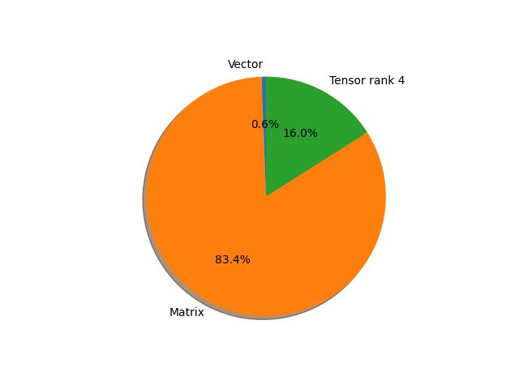

# regnet_y_1_6gf parameter information

**Number of layers: [ 368 ]**

**Number of parameters: [ 11.20M ]**

**Proportional of each form** (%)

| Vector | Matrix | Tensor rank 4 | 
|  --- | --- | --- |
| 61.68 | 30.71 | 7.61 | 

**Proportional of parameters by form** (%)

| Vector | Matrix | Tensor rank 4 | 
|  --- | --- | --- |
| 0.57 | 83.41 | 16.02 | 

**Layer information**

| Name | Shape | Squeezed shape | Number of parameters | Form |
| --- | --- | --- | --- | --- |
| stem.0.weight | (32, 3, 3, 3) | (32, 3, 3, 3) | 864 | Tensor rank 4 |
| stem.1.weight | (32,) | (32,) | 32 | Vector |
| stem.1.bias | (32,) | (32,) | 32 | Vector |
| trunk_output.block1.block1-0.proj.0.weight | (48, 32, 1, 1) | (48, 32) | 1536 | Matrix |
| trunk_output.block1.block1-0.proj.1.weight | (48,) | (48,) | 48 | Vector |
| trunk_output.block1.block1-0.proj.1.bias | (48,) | (48,) | 48 | Vector |
| trunk_output.block1.block1-0.f.a.0.weight | (48, 32, 1, 1) | (48, 32) | 1536 | Matrix |
| trunk_output.block1.block1-0.f.a.1.weight | (48,) | (48,) | 48 | Vector |
| trunk_output.block1.block1-0.f.a.1.bias | (48,) | (48,) | 48 | Vector |
| trunk_output.block1.block1-0.f.b.0.weight | (48, 24, 3, 3) | (48, 24, 3, 3) | 10368 | Tensor rank 4 |
| trunk_output.block1.block1-0.f.b.1.weight | (48,) | (48,) | 48 | Vector |
| trunk_output.block1.block1-0.f.b.1.bias | (48,) | (48,) | 48 | Vector |
| trunk_output.block1.block1-0.f.se.fc1.weight | (8, 48, 1, 1) | (8, 48) | 384 | Matrix |
| trunk_output.block1.block1-0.f.se.fc1.bias | (8,) | (8,) | 8 | Vector |
| trunk_output.block1.block1-0.f.se.fc2.weight | (48, 8, 1, 1) | (48, 8) | 384 | Matrix |
| trunk_output.block1.block1-0.f.se.fc2.bias | (48,) | (48,) | 48 | Vector |
| trunk_output.block1.block1-0.f.c.0.weight | (48, 48, 1, 1) | (48, 48) | 2304 | Matrix |
| trunk_output.block1.block1-0.f.c.1.weight | (48,) | (48,) | 48 | Vector |
| trunk_output.block1.block1-0.f.c.1.bias | (48,) | (48,) | 48 | Vector |
| trunk_output.block1.block1-1.f.a.0.weight | (48, 48, 1, 1) | (48, 48) | 2304 | Matrix |
| trunk_output.block1.block1-1.f.a.1.weight | (48,) | (48,) | 48 | Vector |
| trunk_output.block1.block1-1.f.a.1.bias | (48,) | (48,) | 48 | Vector |
| trunk_output.block1.block1-1.f.b.0.weight | (48, 24, 3, 3) | (48, 24, 3, 3) | 10368 | Tensor rank 4 |
| trunk_output.block1.block1-1.f.b.1.weight | (48,) | (48,) | 48 | Vector |
| trunk_output.block1.block1-1.f.b.1.bias | (48,) | (48,) | 48 | Vector |
| trunk_output.block1.block1-1.f.se.fc1.weight | (12, 48, 1, 1) | (12, 48) | 576 | Matrix |
| trunk_output.block1.block1-1.f.se.fc1.bias | (12,) | (12,) | 12 | Vector |
| trunk_output.block1.block1-1.f.se.fc2.weight | (48, 12, 1, 1) | (48, 12) | 576 | Matrix |
| trunk_output.block1.block1-1.f.se.fc2.bias | (48,) | (48,) | 48 | Vector |
| trunk_output.block1.block1-1.f.c.0.weight | (48, 48, 1, 1) | (48, 48) | 2304 | Matrix |
| trunk_output.block1.block1-1.f.c.1.weight | (48,) | (48,) | 48 | Vector |
| trunk_output.block1.block1-1.f.c.1.bias | (48,) | (48,) | 48 | Vector |
| trunk_output.block2.block2-0.proj.0.weight | (120, 48, 1, 1) | (120, 48) | 5760 | Matrix |
| trunk_output.block2.block2-0.proj.1.weight | (120,) | (120,) | 120 | Vector |
| trunk_output.block2.block2-0.proj.1.bias | (120,) | (120,) | 120 | Vector |
| trunk_output.block2.block2-0.f.a.0.weight | (120, 48, 1, 1) | (120, 48) | 5760 | Matrix |
| trunk_output.block2.block2-0.f.a.1.weight | (120,) | (120,) | 120 | Vector |
| trunk_output.block2.block2-0.f.a.1.bias | (120,) | (120,) | 120 | Vector |
| trunk_output.block2.block2-0.f.b.0.weight | (120, 24, 3, 3) | (120, 24, 3, 3) | 25920 | Tensor rank 4 |
| trunk_output.block2.block2-0.f.b.1.weight | (120,) | (120,) | 120 | Vector |
| trunk_output.block2.block2-0.f.b.1.bias | (120,) | (120,) | 120 | Vector |
| trunk_output.block2.block2-0.f.se.fc1.weight | (12, 120, 1, 1) | (12, 120) | 1440 | Matrix |
| trunk_output.block2.block2-0.f.se.fc1.bias | (12,) | (12,) | 12 | Vector |
| trunk_output.block2.block2-0.f.se.fc2.weight | (120, 12, 1, 1) | (120, 12) | 1440 | Matrix |
| trunk_output.block2.block2-0.f.se.fc2.bias | (120,) | (120,) | 120 | Vector |
| trunk_output.block2.block2-0.f.c.0.weight | (120, 120, 1, 1) | (120, 120) | 14400 | Matrix |
| trunk_output.block2.block2-0.f.c.1.weight | (120,) | (120,) | 120 | Vector |
| trunk_output.block2.block2-0.f.c.1.bias | (120,) | (120,) | 120 | Vector |
| trunk_output.block2.block2-1.f.a.0.weight | (120, 120, 1, 1) | (120, 120) | 14400 | Matrix |
| trunk_output.block2.block2-1.f.a.1.weight | (120,) | (120,) | 120 | Vector |
| trunk_output.block2.block2-1.f.a.1.bias | (120,) | (120,) | 120 | Vector |
| trunk_output.block2.block2-1.f.b.0.weight | (120, 24, 3, 3) | (120, 24, 3, 3) | 25920 | Tensor rank 4 |
| trunk_output.block2.block2-1.f.b.1.weight | (120,) | (120,) | 120 | Vector |
| trunk_output.block2.block2-1.f.b.1.bias | (120,) | (120,) | 120 | Vector |
| trunk_output.block2.block2-1.f.se.fc1.weight | (30, 120, 1, 1) | (30, 120) | 3600 | Matrix |
| trunk_output.block2.block2-1.f.se.fc1.bias | (30,) | (30,) | 30 | Vector |
| trunk_output.block2.block2-1.f.se.fc2.weight | (120, 30, 1, 1) | (120, 30) | 3600 | Matrix |
| trunk_output.block2.block2-1.f.se.fc2.bias | (120,) | (120,) | 120 | Vector |
| trunk_output.block2.block2-1.f.c.0.weight | (120, 120, 1, 1) | (120, 120) | 14400 | Matrix |
| trunk_output.block2.block2-1.f.c.1.weight | (120,) | (120,) | 120 | Vector |
| trunk_output.block2.block2-1.f.c.1.bias | (120,) | (120,) | 120 | Vector |
| trunk_output.block2.block2-2.f.a.0.weight | (120, 120, 1, 1) | (120, 120) | 14400 | Matrix |
| trunk_output.block2.block2-2.f.a.1.weight | (120,) | (120,) | 120 | Vector |
| trunk_output.block2.block2-2.f.a.1.bias | (120,) | (120,) | 120 | Vector |
| trunk_output.block2.block2-2.f.b.0.weight | (120, 24, 3, 3) | (120, 24, 3, 3) | 25920 | Tensor rank 4 |
| trunk_output.block2.block2-2.f.b.1.weight | (120,) | (120,) | 120 | Vector |
| trunk_output.block2.block2-2.f.b.1.bias | (120,) | (120,) | 120 | Vector |
| trunk_output.block2.block2-2.f.se.fc1.weight | (30, 120, 1, 1) | (30, 120) | 3600 | Matrix |
| trunk_output.block2.block2-2.f.se.fc1.bias | (30,) | (30,) | 30 | Vector |
| trunk_output.block2.block2-2.f.se.fc2.weight | (120, 30, 1, 1) | (120, 30) | 3600 | Matrix |
| trunk_output.block2.block2-2.f.se.fc2.bias | (120,) | (120,) | 120 | Vector |
| trunk_output.block2.block2-2.f.c.0.weight | (120, 120, 1, 1) | (120, 120) | 14400 | Matrix |
| trunk_output.block2.block2-2.f.c.1.weight | (120,) | (120,) | 120 | Vector |
| trunk_output.block2.block2-2.f.c.1.bias | (120,) | (120,) | 120 | Vector |
| trunk_output.block2.block2-3.f.a.0.weight | (120, 120, 1, 1) | (120, 120) | 14400 | Matrix |
| trunk_output.block2.block2-3.f.a.1.weight | (120,) | (120,) | 120 | Vector |
| trunk_output.block2.block2-3.f.a.1.bias | (120,) | (120,) | 120 | Vector |
| trunk_output.block2.block2-3.f.b.0.weight | (120, 24, 3, 3) | (120, 24, 3, 3) | 25920 | Tensor rank 4 |
| trunk_output.block2.block2-3.f.b.1.weight | (120,) | (120,) | 120 | Vector |
| trunk_output.block2.block2-3.f.b.1.bias | (120,) | (120,) | 120 | Vector |
| trunk_output.block2.block2-3.f.se.fc1.weight | (30, 120, 1, 1) | (30, 120) | 3600 | Matrix |
| trunk_output.block2.block2-3.f.se.fc1.bias | (30,) | (30,) | 30 | Vector |
| trunk_output.block2.block2-3.f.se.fc2.weight | (120, 30, 1, 1) | (120, 30) | 3600 | Matrix |
| trunk_output.block2.block2-3.f.se.fc2.bias | (120,) | (120,) | 120 | Vector |
| trunk_output.block2.block2-3.f.c.0.weight | (120, 120, 1, 1) | (120, 120) | 14400 | Matrix |
| trunk_output.block2.block2-3.f.c.1.weight | (120,) | (120,) | 120 | Vector |
| trunk_output.block2.block2-3.f.c.1.bias | (120,) | (120,) | 120 | Vector |
| trunk_output.block2.block2-4.f.a.0.weight | (120, 120, 1, 1) | (120, 120) | 14400 | Matrix |
| trunk_output.block2.block2-4.f.a.1.weight | (120,) | (120,) | 120 | Vector |
| trunk_output.block2.block2-4.f.a.1.bias | (120,) | (120,) | 120 | Vector |
| trunk_output.block2.block2-4.f.b.0.weight | (120, 24, 3, 3) | (120, 24, 3, 3) | 25920 | Tensor rank 4 |
| trunk_output.block2.block2-4.f.b.1.weight | (120,) | (120,) | 120 | Vector |
| trunk_output.block2.block2-4.f.b.1.bias | (120,) | (120,) | 120 | Vector |
| trunk_output.block2.block2-4.f.se.fc1.weight | (30, 120, 1, 1) | (30, 120) | 3600 | Matrix |
| trunk_output.block2.block2-4.f.se.fc1.bias | (30,) | (30,) | 30 | Vector |
| trunk_output.block2.block2-4.f.se.fc2.weight | (120, 30, 1, 1) | (120, 30) | 3600 | Matrix |
| trunk_output.block2.block2-4.f.se.fc2.bias | (120,) | (120,) | 120 | Vector |
| trunk_output.block2.block2-4.f.c.0.weight | (120, 120, 1, 1) | (120, 120) | 14400 | Matrix |
| trunk_output.block2.block2-4.f.c.1.weight | (120,) | (120,) | 120 | Vector |
| trunk_output.block2.block2-4.f.c.1.bias | (120,) | (120,) | 120 | Vector |
| trunk_output.block2.block2-5.f.a.0.weight | (120, 120, 1, 1) | (120, 120) | 14400 | Matrix |
| trunk_output.block2.block2-5.f.a.1.weight | (120,) | (120,) | 120 | Vector |
| trunk_output.block2.block2-5.f.a.1.bias | (120,) | (120,) | 120 | Vector |
| trunk_output.block2.block2-5.f.b.0.weight | (120, 24, 3, 3) | (120, 24, 3, 3) | 25920 | Tensor rank 4 |
| trunk_output.block2.block2-5.f.b.1.weight | (120,) | (120,) | 120 | Vector |
| trunk_output.block2.block2-5.f.b.1.bias | (120,) | (120,) | 120 | Vector |
| trunk_output.block2.block2-5.f.se.fc1.weight | (30, 120, 1, 1) | (30, 120) | 3600 | Matrix |
| trunk_output.block2.block2-5.f.se.fc1.bias | (30,) | (30,) | 30 | Vector |
| trunk_output.block2.block2-5.f.se.fc2.weight | (120, 30, 1, 1) | (120, 30) | 3600 | Matrix |
| trunk_output.block2.block2-5.f.se.fc2.bias | (120,) | (120,) | 120 | Vector |
| trunk_output.block2.block2-5.f.c.0.weight | (120, 120, 1, 1) | (120, 120) | 14400 | Matrix |
| trunk_output.block2.block2-5.f.c.1.weight | (120,) | (120,) | 120 | Vector |
| trunk_output.block2.block2-5.f.c.1.bias | (120,) | (120,) | 120 | Vector |
| trunk_output.block3.block3-0.proj.0.weight | (336, 120, 1, 1) | (336, 120) | 40320 | Matrix |
| trunk_output.block3.block3-0.proj.1.weight | (336,) | (336,) | 336 | Vector |
| trunk_output.block3.block3-0.proj.1.bias | (336,) | (336,) | 336 | Vector |
| trunk_output.block3.block3-0.f.a.0.weight | (336, 120, 1, 1) | (336, 120) | 40320 | Matrix |
| trunk_output.block3.block3-0.f.a.1.weight | (336,) | (336,) | 336 | Vector |
| trunk_output.block3.block3-0.f.a.1.bias | (336,) | (336,) | 336 | Vector |
| trunk_output.block3.block3-0.f.b.0.weight | (336, 24, 3, 3) | (336, 24, 3, 3) | 72576 | Tensor rank 4 |
| trunk_output.block3.block3-0.f.b.1.weight | (336,) | (336,) | 336 | Vector |
| trunk_output.block3.block3-0.f.b.1.bias | (336,) | (336,) | 336 | Vector |
| trunk_output.block3.block3-0.f.se.fc1.weight | (30, 336, 1, 1) | (30, 336) | 10080 | Matrix |
| trunk_output.block3.block3-0.f.se.fc1.bias | (30,) | (30,) | 30 | Vector |
| trunk_output.block3.block3-0.f.se.fc2.weight | (336, 30, 1, 1) | (336, 30) | 10080 | Matrix |
| trunk_output.block3.block3-0.f.se.fc2.bias | (336,) | (336,) | 336 | Vector |
| trunk_output.block3.block3-0.f.c.0.weight | (336, 336, 1, 1) | (336, 336) | 112896 | Matrix |
| trunk_output.block3.block3-0.f.c.1.weight | (336,) | (336,) | 336 | Vector |
| trunk_output.block3.block3-0.f.c.1.bias | (336,) | (336,) | 336 | Vector |
| trunk_output.block3.block3-1.f.a.0.weight | (336, 336, 1, 1) | (336, 336) | 112896 | Matrix |
| trunk_output.block3.block3-1.f.a.1.weight | (336,) | (336,) | 336 | Vector |
| trunk_output.block3.block3-1.f.a.1.bias | (336,) | (336,) | 336 | Vector |
| trunk_output.block3.block3-1.f.b.0.weight | (336, 24, 3, 3) | (336, 24, 3, 3) | 72576 | Tensor rank 4 |
| trunk_output.block3.block3-1.f.b.1.weight | (336,) | (336,) | 336 | Vector |
| trunk_output.block3.block3-1.f.b.1.bias | (336,) | (336,) | 336 | Vector |
| trunk_output.block3.block3-1.f.se.fc1.weight | (84, 336, 1, 1) | (84, 336) | 28224 | Matrix |
| trunk_output.block3.block3-1.f.se.fc1.bias | (84,) | (84,) | 84 | Vector |
| trunk_output.block3.block3-1.f.se.fc2.weight | (336, 84, 1, 1) | (336, 84) | 28224 | Matrix |
| trunk_output.block3.block3-1.f.se.fc2.bias | (336,) | (336,) | 336 | Vector |
| trunk_output.block3.block3-1.f.c.0.weight | (336, 336, 1, 1) | (336, 336) | 112896 | Matrix |
| trunk_output.block3.block3-1.f.c.1.weight | (336,) | (336,) | 336 | Vector |
| trunk_output.block3.block3-1.f.c.1.bias | (336,) | (336,) | 336 | Vector |
| trunk_output.block3.block3-2.f.a.0.weight | (336, 336, 1, 1) | (336, 336) | 112896 | Matrix |
| trunk_output.block3.block3-2.f.a.1.weight | (336,) | (336,) | 336 | Vector |
| trunk_output.block3.block3-2.f.a.1.bias | (336,) | (336,) | 336 | Vector |
| trunk_output.block3.block3-2.f.b.0.weight | (336, 24, 3, 3) | (336, 24, 3, 3) | 72576 | Tensor rank 4 |
| trunk_output.block3.block3-2.f.b.1.weight | (336,) | (336,) | 336 | Vector |
| trunk_output.block3.block3-2.f.b.1.bias | (336,) | (336,) | 336 | Vector |
| trunk_output.block3.block3-2.f.se.fc1.weight | (84, 336, 1, 1) | (84, 336) | 28224 | Matrix |
| trunk_output.block3.block3-2.f.se.fc1.bias | (84,) | (84,) | 84 | Vector |
| trunk_output.block3.block3-2.f.se.fc2.weight | (336, 84, 1, 1) | (336, 84) | 28224 | Matrix |
| trunk_output.block3.block3-2.f.se.fc2.bias | (336,) | (336,) | 336 | Vector |
| trunk_output.block3.block3-2.f.c.0.weight | (336, 336, 1, 1) | (336, 336) | 112896 | Matrix |
| trunk_output.block3.block3-2.f.c.1.weight | (336,) | (336,) | 336 | Vector |
| trunk_output.block3.block3-2.f.c.1.bias | (336,) | (336,) | 336 | Vector |
| trunk_output.block3.block3-3.f.a.0.weight | (336, 336, 1, 1) | (336, 336) | 112896 | Matrix |
| trunk_output.block3.block3-3.f.a.1.weight | (336,) | (336,) | 336 | Vector |
| trunk_output.block3.block3-3.f.a.1.bias | (336,) | (336,) | 336 | Vector |
| trunk_output.block3.block3-3.f.b.0.weight | (336, 24, 3, 3) | (336, 24, 3, 3) | 72576 | Tensor rank 4 |
| trunk_output.block3.block3-3.f.b.1.weight | (336,) | (336,) | 336 | Vector |
| trunk_output.block3.block3-3.f.b.1.bias | (336,) | (336,) | 336 | Vector |
| trunk_output.block3.block3-3.f.se.fc1.weight | (84, 336, 1, 1) | (84, 336) | 28224 | Matrix |
| trunk_output.block3.block3-3.f.se.fc1.bias | (84,) | (84,) | 84 | Vector |
| trunk_output.block3.block3-3.f.se.fc2.weight | (336, 84, 1, 1) | (336, 84) | 28224 | Matrix |
| trunk_output.block3.block3-3.f.se.fc2.bias | (336,) | (336,) | 336 | Vector |
| trunk_output.block3.block3-3.f.c.0.weight | (336, 336, 1, 1) | (336, 336) | 112896 | Matrix |
| trunk_output.block3.block3-3.f.c.1.weight | (336,) | (336,) | 336 | Vector |
| trunk_output.block3.block3-3.f.c.1.bias | (336,) | (336,) | 336 | Vector |
| trunk_output.block3.block3-4.f.a.0.weight | (336, 336, 1, 1) | (336, 336) | 112896 | Matrix |
| trunk_output.block3.block3-4.f.a.1.weight | (336,) | (336,) | 336 | Vector |
| trunk_output.block3.block3-4.f.a.1.bias | (336,) | (336,) | 336 | Vector |
| trunk_output.block3.block3-4.f.b.0.weight | (336, 24, 3, 3) | (336, 24, 3, 3) | 72576 | Tensor rank 4 |
| trunk_output.block3.block3-4.f.b.1.weight | (336,) | (336,) | 336 | Vector |
| trunk_output.block3.block3-4.f.b.1.bias | (336,) | (336,) | 336 | Vector |
| trunk_output.block3.block3-4.f.se.fc1.weight | (84, 336, 1, 1) | (84, 336) | 28224 | Matrix |
| trunk_output.block3.block3-4.f.se.fc1.bias | (84,) | (84,) | 84 | Vector |
| trunk_output.block3.block3-4.f.se.fc2.weight | (336, 84, 1, 1) | (336, 84) | 28224 | Matrix |
| trunk_output.block3.block3-4.f.se.fc2.bias | (336,) | (336,) | 336 | Vector |
| trunk_output.block3.block3-4.f.c.0.weight | (336, 336, 1, 1) | (336, 336) | 112896 | Matrix |
| trunk_output.block3.block3-4.f.c.1.weight | (336,) | (336,) | 336 | Vector |
| trunk_output.block3.block3-4.f.c.1.bias | (336,) | (336,) | 336 | Vector |
| trunk_output.block3.block3-5.f.a.0.weight | (336, 336, 1, 1) | (336, 336) | 112896 | Matrix |
| trunk_output.block3.block3-5.f.a.1.weight | (336,) | (336,) | 336 | Vector |
| trunk_output.block3.block3-5.f.a.1.bias | (336,) | (336,) | 336 | Vector |
| trunk_output.block3.block3-5.f.b.0.weight | (336, 24, 3, 3) | (336, 24, 3, 3) | 72576 | Tensor rank 4 |
| trunk_output.block3.block3-5.f.b.1.weight | (336,) | (336,) | 336 | Vector |
| trunk_output.block3.block3-5.f.b.1.bias | (336,) | (336,) | 336 | Vector |
| trunk_output.block3.block3-5.f.se.fc1.weight | (84, 336, 1, 1) | (84, 336) | 28224 | Matrix |
| trunk_output.block3.block3-5.f.se.fc1.bias | (84,) | (84,) | 84 | Vector |
| trunk_output.block3.block3-5.f.se.fc2.weight | (336, 84, 1, 1) | (336, 84) | 28224 | Matrix |
| trunk_output.block3.block3-5.f.se.fc2.bias | (336,) | (336,) | 336 | Vector |
| trunk_output.block3.block3-5.f.c.0.weight | (336, 336, 1, 1) | (336, 336) | 112896 | Matrix |
| trunk_output.block3.block3-5.f.c.1.weight | (336,) | (336,) | 336 | Vector |
| trunk_output.block3.block3-5.f.c.1.bias | (336,) | (336,) | 336 | Vector |
| trunk_output.block3.block3-6.f.a.0.weight | (336, 336, 1, 1) | (336, 336) | 112896 | Matrix |
| trunk_output.block3.block3-6.f.a.1.weight | (336,) | (336,) | 336 | Vector |
| trunk_output.block3.block3-6.f.a.1.bias | (336,) | (336,) | 336 | Vector |
| trunk_output.block3.block3-6.f.b.0.weight | (336, 24, 3, 3) | (336, 24, 3, 3) | 72576 | Tensor rank 4 |
| trunk_output.block3.block3-6.f.b.1.weight | (336,) | (336,) | 336 | Vector |
| trunk_output.block3.block3-6.f.b.1.bias | (336,) | (336,) | 336 | Vector |
| trunk_output.block3.block3-6.f.se.fc1.weight | (84, 336, 1, 1) | (84, 336) | 28224 | Matrix |
| trunk_output.block3.block3-6.f.se.fc1.bias | (84,) | (84,) | 84 | Vector |
| trunk_output.block3.block3-6.f.se.fc2.weight | (336, 84, 1, 1) | (336, 84) | 28224 | Matrix |
| trunk_output.block3.block3-6.f.se.fc2.bias | (336,) | (336,) | 336 | Vector |
| trunk_output.block3.block3-6.f.c.0.weight | (336, 336, 1, 1) | (336, 336) | 112896 | Matrix |
| trunk_output.block3.block3-6.f.c.1.weight | (336,) | (336,) | 336 | Vector |
| trunk_output.block3.block3-6.f.c.1.bias | (336,) | (336,) | 336 | Vector |
| trunk_output.block3.block3-7.f.a.0.weight | (336, 336, 1, 1) | (336, 336) | 112896 | Matrix |
| trunk_output.block3.block3-7.f.a.1.weight | (336,) | (336,) | 336 | Vector |
| trunk_output.block3.block3-7.f.a.1.bias | (336,) | (336,) | 336 | Vector |
| trunk_output.block3.block3-7.f.b.0.weight | (336, 24, 3, 3) | (336, 24, 3, 3) | 72576 | Tensor rank 4 |
| trunk_output.block3.block3-7.f.b.1.weight | (336,) | (336,) | 336 | Vector |
| trunk_output.block3.block3-7.f.b.1.bias | (336,) | (336,) | 336 | Vector |
| trunk_output.block3.block3-7.f.se.fc1.weight | (84, 336, 1, 1) | (84, 336) | 28224 | Matrix |
| trunk_output.block3.block3-7.f.se.fc1.bias | (84,) | (84,) | 84 | Vector |
| trunk_output.block3.block3-7.f.se.fc2.weight | (336, 84, 1, 1) | (336, 84) | 28224 | Matrix |
| trunk_output.block3.block3-7.f.se.fc2.bias | (336,) | (336,) | 336 | Vector |
| trunk_output.block3.block3-7.f.c.0.weight | (336, 336, 1, 1) | (336, 336) | 112896 | Matrix |
| trunk_output.block3.block3-7.f.c.1.weight | (336,) | (336,) | 336 | Vector |
| trunk_output.block3.block3-7.f.c.1.bias | (336,) | (336,) | 336 | Vector |
| trunk_output.block3.block3-8.f.a.0.weight | (336, 336, 1, 1) | (336, 336) | 112896 | Matrix |
| trunk_output.block3.block3-8.f.a.1.weight | (336,) | (336,) | 336 | Vector |
| trunk_output.block3.block3-8.f.a.1.bias | (336,) | (336,) | 336 | Vector |
| trunk_output.block3.block3-8.f.b.0.weight | (336, 24, 3, 3) | (336, 24, 3, 3) | 72576 | Tensor rank 4 |
| trunk_output.block3.block3-8.f.b.1.weight | (336,) | (336,) | 336 | Vector |
| trunk_output.block3.block3-8.f.b.1.bias | (336,) | (336,) | 336 | Vector |
| trunk_output.block3.block3-8.f.se.fc1.weight | (84, 336, 1, 1) | (84, 336) | 28224 | Matrix |
| trunk_output.block3.block3-8.f.se.fc1.bias | (84,) | (84,) | 84 | Vector |
| trunk_output.block3.block3-8.f.se.fc2.weight | (336, 84, 1, 1) | (336, 84) | 28224 | Matrix |
| trunk_output.block3.block3-8.f.se.fc2.bias | (336,) | (336,) | 336 | Vector |
| trunk_output.block3.block3-8.f.c.0.weight | (336, 336, 1, 1) | (336, 336) | 112896 | Matrix |
| trunk_output.block3.block3-8.f.c.1.weight | (336,) | (336,) | 336 | Vector |
| trunk_output.block3.block3-8.f.c.1.bias | (336,) | (336,) | 336 | Vector |
| trunk_output.block3.block3-9.f.a.0.weight | (336, 336, 1, 1) | (336, 336) | 112896 | Matrix |
| trunk_output.block3.block3-9.f.a.1.weight | (336,) | (336,) | 336 | Vector |
| trunk_output.block3.block3-9.f.a.1.bias | (336,) | (336,) | 336 | Vector |
| trunk_output.block3.block3-9.f.b.0.weight | (336, 24, 3, 3) | (336, 24, 3, 3) | 72576 | Tensor rank 4 |
| trunk_output.block3.block3-9.f.b.1.weight | (336,) | (336,) | 336 | Vector |
| trunk_output.block3.block3-9.f.b.1.bias | (336,) | (336,) | 336 | Vector |
| trunk_output.block3.block3-9.f.se.fc1.weight | (84, 336, 1, 1) | (84, 336) | 28224 | Matrix |
| trunk_output.block3.block3-9.f.se.fc1.bias | (84,) | (84,) | 84 | Vector |
| trunk_output.block3.block3-9.f.se.fc2.weight | (336, 84, 1, 1) | (336, 84) | 28224 | Matrix |
| trunk_output.block3.block3-9.f.se.fc2.bias | (336,) | (336,) | 336 | Vector |
| trunk_output.block3.block3-9.f.c.0.weight | (336, 336, 1, 1) | (336, 336) | 112896 | Matrix |
| trunk_output.block3.block3-9.f.c.1.weight | (336,) | (336,) | 336 | Vector |
| trunk_output.block3.block3-9.f.c.1.bias | (336,) | (336,) | 336 | Vector |
| trunk_output.block3.block3-10.f.a.0.weight | (336, 336, 1, 1) | (336, 336) | 112896 | Matrix |
| trunk_output.block3.block3-10.f.a.1.weight | (336,) | (336,) | 336 | Vector |
| trunk_output.block3.block3-10.f.a.1.bias | (336,) | (336,) | 336 | Vector |
| trunk_output.block3.block3-10.f.b.0.weight | (336, 24, 3, 3) | (336, 24, 3, 3) | 72576 | Tensor rank 4 |
| trunk_output.block3.block3-10.f.b.1.weight | (336,) | (336,) | 336 | Vector |
| trunk_output.block3.block3-10.f.b.1.bias | (336,) | (336,) | 336 | Vector |
| trunk_output.block3.block3-10.f.se.fc1.weight | (84, 336, 1, 1) | (84, 336) | 28224 | Matrix |
| trunk_output.block3.block3-10.f.se.fc1.bias | (84,) | (84,) | 84 | Vector |
| trunk_output.block3.block3-10.f.se.fc2.weight | (336, 84, 1, 1) | (336, 84) | 28224 | Matrix |
| trunk_output.block3.block3-10.f.se.fc2.bias | (336,) | (336,) | 336 | Vector |
| trunk_output.block3.block3-10.f.c.0.weight | (336, 336, 1, 1) | (336, 336) | 112896 | Matrix |
| trunk_output.block3.block3-10.f.c.1.weight | (336,) | (336,) | 336 | Vector |
| trunk_output.block3.block3-10.f.c.1.bias | (336,) | (336,) | 336 | Vector |
| trunk_output.block3.block3-11.f.a.0.weight | (336, 336, 1, 1) | (336, 336) | 112896 | Matrix |
| trunk_output.block3.block3-11.f.a.1.weight | (336,) | (336,) | 336 | Vector |
| trunk_output.block3.block3-11.f.a.1.bias | (336,) | (336,) | 336 | Vector |
| trunk_output.block3.block3-11.f.b.0.weight | (336, 24, 3, 3) | (336, 24, 3, 3) | 72576 | Tensor rank 4 |
| trunk_output.block3.block3-11.f.b.1.weight | (336,) | (336,) | 336 | Vector |
| trunk_output.block3.block3-11.f.b.1.bias | (336,) | (336,) | 336 | Vector |
| trunk_output.block3.block3-11.f.se.fc1.weight | (84, 336, 1, 1) | (84, 336) | 28224 | Matrix |
| trunk_output.block3.block3-11.f.se.fc1.bias | (84,) | (84,) | 84 | Vector |
| trunk_output.block3.block3-11.f.se.fc2.weight | (336, 84, 1, 1) | (336, 84) | 28224 | Matrix |
| trunk_output.block3.block3-11.f.se.fc2.bias | (336,) | (336,) | 336 | Vector |
| trunk_output.block3.block3-11.f.c.0.weight | (336, 336, 1, 1) | (336, 336) | 112896 | Matrix |
| trunk_output.block3.block3-11.f.c.1.weight | (336,) | (336,) | 336 | Vector |
| trunk_output.block3.block3-11.f.c.1.bias | (336,) | (336,) | 336 | Vector |
| trunk_output.block3.block3-12.f.a.0.weight | (336, 336, 1, 1) | (336, 336) | 112896 | Matrix |
| trunk_output.block3.block3-12.f.a.1.weight | (336,) | (336,) | 336 | Vector |
| trunk_output.block3.block3-12.f.a.1.bias | (336,) | (336,) | 336 | Vector |
| trunk_output.block3.block3-12.f.b.0.weight | (336, 24, 3, 3) | (336, 24, 3, 3) | 72576 | Tensor rank 4 |
| trunk_output.block3.block3-12.f.b.1.weight | (336,) | (336,) | 336 | Vector |
| trunk_output.block3.block3-12.f.b.1.bias | (336,) | (336,) | 336 | Vector |
| trunk_output.block3.block3-12.f.se.fc1.weight | (84, 336, 1, 1) | (84, 336) | 28224 | Matrix |
| trunk_output.block3.block3-12.f.se.fc1.bias | (84,) | (84,) | 84 | Vector |
| trunk_output.block3.block3-12.f.se.fc2.weight | (336, 84, 1, 1) | (336, 84) | 28224 | Matrix |
| trunk_output.block3.block3-12.f.se.fc2.bias | (336,) | (336,) | 336 | Vector |
| trunk_output.block3.block3-12.f.c.0.weight | (336, 336, 1, 1) | (336, 336) | 112896 | Matrix |
| trunk_output.block3.block3-12.f.c.1.weight | (336,) | (336,) | 336 | Vector |
| trunk_output.block3.block3-12.f.c.1.bias | (336,) | (336,) | 336 | Vector |
| trunk_output.block3.block3-13.f.a.0.weight | (336, 336, 1, 1) | (336, 336) | 112896 | Matrix |
| trunk_output.block3.block3-13.f.a.1.weight | (336,) | (336,) | 336 | Vector |
| trunk_output.block3.block3-13.f.a.1.bias | (336,) | (336,) | 336 | Vector |
| trunk_output.block3.block3-13.f.b.0.weight | (336, 24, 3, 3) | (336, 24, 3, 3) | 72576 | Tensor rank 4 |
| trunk_output.block3.block3-13.f.b.1.weight | (336,) | (336,) | 336 | Vector |
| trunk_output.block3.block3-13.f.b.1.bias | (336,) | (336,) | 336 | Vector |
| trunk_output.block3.block3-13.f.se.fc1.weight | (84, 336, 1, 1) | (84, 336) | 28224 | Matrix |
| trunk_output.block3.block3-13.f.se.fc1.bias | (84,) | (84,) | 84 | Vector |
| trunk_output.block3.block3-13.f.se.fc2.weight | (336, 84, 1, 1) | (336, 84) | 28224 | Matrix |
| trunk_output.block3.block3-13.f.se.fc2.bias | (336,) | (336,) | 336 | Vector |
| trunk_output.block3.block3-13.f.c.0.weight | (336, 336, 1, 1) | (336, 336) | 112896 | Matrix |
| trunk_output.block3.block3-13.f.c.1.weight | (336,) | (336,) | 336 | Vector |
| trunk_output.block3.block3-13.f.c.1.bias | (336,) | (336,) | 336 | Vector |
| trunk_output.block3.block3-14.f.a.0.weight | (336, 336, 1, 1) | (336, 336) | 112896 | Matrix |
| trunk_output.block3.block3-14.f.a.1.weight | (336,) | (336,) | 336 | Vector |
| trunk_output.block3.block3-14.f.a.1.bias | (336,) | (336,) | 336 | Vector |
| trunk_output.block3.block3-14.f.b.0.weight | (336, 24, 3, 3) | (336, 24, 3, 3) | 72576 | Tensor rank 4 |
| trunk_output.block3.block3-14.f.b.1.weight | (336,) | (336,) | 336 | Vector |
| trunk_output.block3.block3-14.f.b.1.bias | (336,) | (336,) | 336 | Vector |
| trunk_output.block3.block3-14.f.se.fc1.weight | (84, 336, 1, 1) | (84, 336) | 28224 | Matrix |
| trunk_output.block3.block3-14.f.se.fc1.bias | (84,) | (84,) | 84 | Vector |
| trunk_output.block3.block3-14.f.se.fc2.weight | (336, 84, 1, 1) | (336, 84) | 28224 | Matrix |
| trunk_output.block3.block3-14.f.se.fc2.bias | (336,) | (336,) | 336 | Vector |
| trunk_output.block3.block3-14.f.c.0.weight | (336, 336, 1, 1) | (336, 336) | 112896 | Matrix |
| trunk_output.block3.block3-14.f.c.1.weight | (336,) | (336,) | 336 | Vector |
| trunk_output.block3.block3-14.f.c.1.bias | (336,) | (336,) | 336 | Vector |
| trunk_output.block3.block3-15.f.a.0.weight | (336, 336, 1, 1) | (336, 336) | 112896 | Matrix |
| trunk_output.block3.block3-15.f.a.1.weight | (336,) | (336,) | 336 | Vector |
| trunk_output.block3.block3-15.f.a.1.bias | (336,) | (336,) | 336 | Vector |
| trunk_output.block3.block3-15.f.b.0.weight | (336, 24, 3, 3) | (336, 24, 3, 3) | 72576 | Tensor rank 4 |
| trunk_output.block3.block3-15.f.b.1.weight | (336,) | (336,) | 336 | Vector |
| trunk_output.block3.block3-15.f.b.1.bias | (336,) | (336,) | 336 | Vector |
| trunk_output.block3.block3-15.f.se.fc1.weight | (84, 336, 1, 1) | (84, 336) | 28224 | Matrix |
| trunk_output.block3.block3-15.f.se.fc1.bias | (84,) | (84,) | 84 | Vector |
| trunk_output.block3.block3-15.f.se.fc2.weight | (336, 84, 1, 1) | (336, 84) | 28224 | Matrix |
| trunk_output.block3.block3-15.f.se.fc2.bias | (336,) | (336,) | 336 | Vector |
| trunk_output.block3.block3-15.f.c.0.weight | (336, 336, 1, 1) | (336, 336) | 112896 | Matrix |
| trunk_output.block3.block3-15.f.c.1.weight | (336,) | (336,) | 336 | Vector |
| trunk_output.block3.block3-15.f.c.1.bias | (336,) | (336,) | 336 | Vector |
| trunk_output.block3.block3-16.f.a.0.weight | (336, 336, 1, 1) | (336, 336) | 112896 | Matrix |
| trunk_output.block3.block3-16.f.a.1.weight | (336,) | (336,) | 336 | Vector |
| trunk_output.block3.block3-16.f.a.1.bias | (336,) | (336,) | 336 | Vector |
| trunk_output.block3.block3-16.f.b.0.weight | (336, 24, 3, 3) | (336, 24, 3, 3) | 72576 | Tensor rank 4 |
| trunk_output.block3.block3-16.f.b.1.weight | (336,) | (336,) | 336 | Vector |
| trunk_output.block3.block3-16.f.b.1.bias | (336,) | (336,) | 336 | Vector |
| trunk_output.block3.block3-16.f.se.fc1.weight | (84, 336, 1, 1) | (84, 336) | 28224 | Matrix |
| trunk_output.block3.block3-16.f.se.fc1.bias | (84,) | (84,) | 84 | Vector |
| trunk_output.block3.block3-16.f.se.fc2.weight | (336, 84, 1, 1) | (336, 84) | 28224 | Matrix |
| trunk_output.block3.block3-16.f.se.fc2.bias | (336,) | (336,) | 336 | Vector |
| trunk_output.block3.block3-16.f.c.0.weight | (336, 336, 1, 1) | (336, 336) | 112896 | Matrix |
| trunk_output.block3.block3-16.f.c.1.weight | (336,) | (336,) | 336 | Vector |
| trunk_output.block3.block3-16.f.c.1.bias | (336,) | (336,) | 336 | Vector |
| trunk_output.block4.block4-0.proj.0.weight | (888, 336, 1, 1) | (888, 336) | 298368 | Matrix |
| trunk_output.block4.block4-0.proj.1.weight | (888,) | (888,) | 888 | Vector |
| trunk_output.block4.block4-0.proj.1.bias | (888,) | (888,) | 888 | Vector |
| trunk_output.block4.block4-0.f.a.0.weight | (888, 336, 1, 1) | (888, 336) | 298368 | Matrix |
| trunk_output.block4.block4-0.f.a.1.weight | (888,) | (888,) | 888 | Vector |
| trunk_output.block4.block4-0.f.a.1.bias | (888,) | (888,) | 888 | Vector |
| trunk_output.block4.block4-0.f.b.0.weight | (888, 24, 3, 3) | (888, 24, 3, 3) | 191808 | Tensor rank 4 |
| trunk_output.block4.block4-0.f.b.1.weight | (888,) | (888,) | 888 | Vector |
| trunk_output.block4.block4-0.f.b.1.bias | (888,) | (888,) | 888 | Vector |
| trunk_output.block4.block4-0.f.se.fc1.weight | (84, 888, 1, 1) | (84, 888) | 74592 | Matrix |
| trunk_output.block4.block4-0.f.se.fc1.bias | (84,) | (84,) | 84 | Vector |
| trunk_output.block4.block4-0.f.se.fc2.weight | (888, 84, 1, 1) | (888, 84) | 74592 | Matrix |
| trunk_output.block4.block4-0.f.se.fc2.bias | (888,) | (888,) | 888 | Vector |
| trunk_output.block4.block4-0.f.c.0.weight | (888, 888, 1, 1) | (888, 888) | 788544 | Matrix |
| trunk_output.block4.block4-0.f.c.1.weight | (888,) | (888,) | 888 | Vector |
| trunk_output.block4.block4-0.f.c.1.bias | (888,) | (888,) | 888 | Vector |
| trunk_output.block4.block4-1.f.a.0.weight | (888, 888, 1, 1) | (888, 888) | 788544 | Matrix |
| trunk_output.block4.block4-1.f.a.1.weight | (888,) | (888,) | 888 | Vector |
| trunk_output.block4.block4-1.f.a.1.bias | (888,) | (888,) | 888 | Vector |
| trunk_output.block4.block4-1.f.b.0.weight | (888, 24, 3, 3) | (888, 24, 3, 3) | 191808 | Tensor rank 4 |
| trunk_output.block4.block4-1.f.b.1.weight | (888,) | (888,) | 888 | Vector |
| trunk_output.block4.block4-1.f.b.1.bias | (888,) | (888,) | 888 | Vector |
| trunk_output.block4.block4-1.f.se.fc1.weight | (222, 888, 1, 1) | (222, 888) | 197136 | Matrix |
| trunk_output.block4.block4-1.f.se.fc1.bias | (222,) | (222,) | 222 | Vector |
| trunk_output.block4.block4-1.f.se.fc2.weight | (888, 222, 1, 1) | (888, 222) | 197136 | Matrix |
| trunk_output.block4.block4-1.f.se.fc2.bias | (888,) | (888,) | 888 | Vector |
| trunk_output.block4.block4-1.f.c.0.weight | (888, 888, 1, 1) | (888, 888) | 788544 | Matrix |
| trunk_output.block4.block4-1.f.c.1.weight | (888,) | (888,) | 888 | Vector |
| trunk_output.block4.block4-1.f.c.1.bias | (888,) | (888,) | 888 | Vector |
| fc.weight | (1000, 888) | (1000, 888) | 888000 | Matrix |
| fc.bias | (1000,) | (1000,) | 1000 | Vector |

