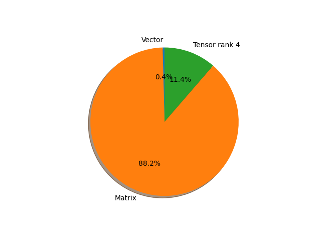

# regnet_y_3_2gf parameter information

**Number of layers: [ 290 ]**

**Number of parameters: [ 19.44M ]**

**Proportional of each form** (%)

| Vector | Matrix | Tensor rank 4 | 
|  --- | --- | --- |
| 61.72 | 30.69 | 7.59 | 

**Proportional of parameters by form** (%)

| Vector | Matrix | Tensor rank 4 | 
|  --- | --- | --- |
| 0.41 | 88.22 | 11.37 | 

**Layer information**

| Name | Shape | Squeezed shape | Number of parameters | Form |
| --- | --- | --- | --- | --- |
| stem.0.weight | (32, 3, 3, 3) | (32, 3, 3, 3) | 864 | Tensor rank 4 |
| stem.1.weight | (32,) | (32,) | 32 | Vector |
| stem.1.bias | (32,) | (32,) | 32 | Vector |
| trunk_output.block1.block1-0.proj.0.weight | (72, 32, 1, 1) | (72, 32) | 2304 | Matrix |
| trunk_output.block1.block1-0.proj.1.weight | (72,) | (72,) | 72 | Vector |
| trunk_output.block1.block1-0.proj.1.bias | (72,) | (72,) | 72 | Vector |
| trunk_output.block1.block1-0.f.a.0.weight | (72, 32, 1, 1) | (72, 32) | 2304 | Matrix |
| trunk_output.block1.block1-0.f.a.1.weight | (72,) | (72,) | 72 | Vector |
| trunk_output.block1.block1-0.f.a.1.bias | (72,) | (72,) | 72 | Vector |
| trunk_output.block1.block1-0.f.b.0.weight | (72, 24, 3, 3) | (72, 24, 3, 3) | 15552 | Tensor rank 4 |
| trunk_output.block1.block1-0.f.b.1.weight | (72,) | (72,) | 72 | Vector |
| trunk_output.block1.block1-0.f.b.1.bias | (72,) | (72,) | 72 | Vector |
| trunk_output.block1.block1-0.f.se.fc1.weight | (8, 72, 1, 1) | (8, 72) | 576 | Matrix |
| trunk_output.block1.block1-0.f.se.fc1.bias | (8,) | (8,) | 8 | Vector |
| trunk_output.block1.block1-0.f.se.fc2.weight | (72, 8, 1, 1) | (72, 8) | 576 | Matrix |
| trunk_output.block1.block1-0.f.se.fc2.bias | (72,) | (72,) | 72 | Vector |
| trunk_output.block1.block1-0.f.c.0.weight | (72, 72, 1, 1) | (72, 72) | 5184 | Matrix |
| trunk_output.block1.block1-0.f.c.1.weight | (72,) | (72,) | 72 | Vector |
| trunk_output.block1.block1-0.f.c.1.bias | (72,) | (72,) | 72 | Vector |
| trunk_output.block1.block1-1.f.a.0.weight | (72, 72, 1, 1) | (72, 72) | 5184 | Matrix |
| trunk_output.block1.block1-1.f.a.1.weight | (72,) | (72,) | 72 | Vector |
| trunk_output.block1.block1-1.f.a.1.bias | (72,) | (72,) | 72 | Vector |
| trunk_output.block1.block1-1.f.b.0.weight | (72, 24, 3, 3) | (72, 24, 3, 3) | 15552 | Tensor rank 4 |
| trunk_output.block1.block1-1.f.b.1.weight | (72,) | (72,) | 72 | Vector |
| trunk_output.block1.block1-1.f.b.1.bias | (72,) | (72,) | 72 | Vector |
| trunk_output.block1.block1-1.f.se.fc1.weight | (18, 72, 1, 1) | (18, 72) | 1296 | Matrix |
| trunk_output.block1.block1-1.f.se.fc1.bias | (18,) | (18,) | 18 | Vector |
| trunk_output.block1.block1-1.f.se.fc2.weight | (72, 18, 1, 1) | (72, 18) | 1296 | Matrix |
| trunk_output.block1.block1-1.f.se.fc2.bias | (72,) | (72,) | 72 | Vector |
| trunk_output.block1.block1-1.f.c.0.weight | (72, 72, 1, 1) | (72, 72) | 5184 | Matrix |
| trunk_output.block1.block1-1.f.c.1.weight | (72,) | (72,) | 72 | Vector |
| trunk_output.block1.block1-1.f.c.1.bias | (72,) | (72,) | 72 | Vector |
| trunk_output.block2.block2-0.proj.0.weight | (216, 72, 1, 1) | (216, 72) | 15552 | Matrix |
| trunk_output.block2.block2-0.proj.1.weight | (216,) | (216,) | 216 | Vector |
| trunk_output.block2.block2-0.proj.1.bias | (216,) | (216,) | 216 | Vector |
| trunk_output.block2.block2-0.f.a.0.weight | (216, 72, 1, 1) | (216, 72) | 15552 | Matrix |
| trunk_output.block2.block2-0.f.a.1.weight | (216,) | (216,) | 216 | Vector |
| trunk_output.block2.block2-0.f.a.1.bias | (216,) | (216,) | 216 | Vector |
| trunk_output.block2.block2-0.f.b.0.weight | (216, 24, 3, 3) | (216, 24, 3, 3) | 46656 | Tensor rank 4 |
| trunk_output.block2.block2-0.f.b.1.weight | (216,) | (216,) | 216 | Vector |
| trunk_output.block2.block2-0.f.b.1.bias | (216,) | (216,) | 216 | Vector |
| trunk_output.block2.block2-0.f.se.fc1.weight | (18, 216, 1, 1) | (18, 216) | 3888 | Matrix |
| trunk_output.block2.block2-0.f.se.fc1.bias | (18,) | (18,) | 18 | Vector |
| trunk_output.block2.block2-0.f.se.fc2.weight | (216, 18, 1, 1) | (216, 18) | 3888 | Matrix |
| trunk_output.block2.block2-0.f.se.fc2.bias | (216,) | (216,) | 216 | Vector |
| trunk_output.block2.block2-0.f.c.0.weight | (216, 216, 1, 1) | (216, 216) | 46656 | Matrix |
| trunk_output.block2.block2-0.f.c.1.weight | (216,) | (216,) | 216 | Vector |
| trunk_output.block2.block2-0.f.c.1.bias | (216,) | (216,) | 216 | Vector |
| trunk_output.block2.block2-1.f.a.0.weight | (216, 216, 1, 1) | (216, 216) | 46656 | Matrix |
| trunk_output.block2.block2-1.f.a.1.weight | (216,) | (216,) | 216 | Vector |
| trunk_output.block2.block2-1.f.a.1.bias | (216,) | (216,) | 216 | Vector |
| trunk_output.block2.block2-1.f.b.0.weight | (216, 24, 3, 3) | (216, 24, 3, 3) | 46656 | Tensor rank 4 |
| trunk_output.block2.block2-1.f.b.1.weight | (216,) | (216,) | 216 | Vector |
| trunk_output.block2.block2-1.f.b.1.bias | (216,) | (216,) | 216 | Vector |
| trunk_output.block2.block2-1.f.se.fc1.weight | (54, 216, 1, 1) | (54, 216) | 11664 | Matrix |
| trunk_output.block2.block2-1.f.se.fc1.bias | (54,) | (54,) | 54 | Vector |
| trunk_output.block2.block2-1.f.se.fc2.weight | (216, 54, 1, 1) | (216, 54) | 11664 | Matrix |
| trunk_output.block2.block2-1.f.se.fc2.bias | (216,) | (216,) | 216 | Vector |
| trunk_output.block2.block2-1.f.c.0.weight | (216, 216, 1, 1) | (216, 216) | 46656 | Matrix |
| trunk_output.block2.block2-1.f.c.1.weight | (216,) | (216,) | 216 | Vector |
| trunk_output.block2.block2-1.f.c.1.bias | (216,) | (216,) | 216 | Vector |
| trunk_output.block2.block2-2.f.a.0.weight | (216, 216, 1, 1) | (216, 216) | 46656 | Matrix |
| trunk_output.block2.block2-2.f.a.1.weight | (216,) | (216,) | 216 | Vector |
| trunk_output.block2.block2-2.f.a.1.bias | (216,) | (216,) | 216 | Vector |
| trunk_output.block2.block2-2.f.b.0.weight | (216, 24, 3, 3) | (216, 24, 3, 3) | 46656 | Tensor rank 4 |
| trunk_output.block2.block2-2.f.b.1.weight | (216,) | (216,) | 216 | Vector |
| trunk_output.block2.block2-2.f.b.1.bias | (216,) | (216,) | 216 | Vector |
| trunk_output.block2.block2-2.f.se.fc1.weight | (54, 216, 1, 1) | (54, 216) | 11664 | Matrix |
| trunk_output.block2.block2-2.f.se.fc1.bias | (54,) | (54,) | 54 | Vector |
| trunk_output.block2.block2-2.f.se.fc2.weight | (216, 54, 1, 1) | (216, 54) | 11664 | Matrix |
| trunk_output.block2.block2-2.f.se.fc2.bias | (216,) | (216,) | 216 | Vector |
| trunk_output.block2.block2-2.f.c.0.weight | (216, 216, 1, 1) | (216, 216) | 46656 | Matrix |
| trunk_output.block2.block2-2.f.c.1.weight | (216,) | (216,) | 216 | Vector |
| trunk_output.block2.block2-2.f.c.1.bias | (216,) | (216,) | 216 | Vector |
| trunk_output.block2.block2-3.f.a.0.weight | (216, 216, 1, 1) | (216, 216) | 46656 | Matrix |
| trunk_output.block2.block2-3.f.a.1.weight | (216,) | (216,) | 216 | Vector |
| trunk_output.block2.block2-3.f.a.1.bias | (216,) | (216,) | 216 | Vector |
| trunk_output.block2.block2-3.f.b.0.weight | (216, 24, 3, 3) | (216, 24, 3, 3) | 46656 | Tensor rank 4 |
| trunk_output.block2.block2-3.f.b.1.weight | (216,) | (216,) | 216 | Vector |
| trunk_output.block2.block2-3.f.b.1.bias | (216,) | (216,) | 216 | Vector |
| trunk_output.block2.block2-3.f.se.fc1.weight | (54, 216, 1, 1) | (54, 216) | 11664 | Matrix |
| trunk_output.block2.block2-3.f.se.fc1.bias | (54,) | (54,) | 54 | Vector |
| trunk_output.block2.block2-3.f.se.fc2.weight | (216, 54, 1, 1) | (216, 54) | 11664 | Matrix |
| trunk_output.block2.block2-3.f.se.fc2.bias | (216,) | (216,) | 216 | Vector |
| trunk_output.block2.block2-3.f.c.0.weight | (216, 216, 1, 1) | (216, 216) | 46656 | Matrix |
| trunk_output.block2.block2-3.f.c.1.weight | (216,) | (216,) | 216 | Vector |
| trunk_output.block2.block2-3.f.c.1.bias | (216,) | (216,) | 216 | Vector |
| trunk_output.block2.block2-4.f.a.0.weight | (216, 216, 1, 1) | (216, 216) | 46656 | Matrix |
| trunk_output.block2.block2-4.f.a.1.weight | (216,) | (216,) | 216 | Vector |
| trunk_output.block2.block2-4.f.a.1.bias | (216,) | (216,) | 216 | Vector |
| trunk_output.block2.block2-4.f.b.0.weight | (216, 24, 3, 3) | (216, 24, 3, 3) | 46656 | Tensor rank 4 |
| trunk_output.block2.block2-4.f.b.1.weight | (216,) | (216,) | 216 | Vector |
| trunk_output.block2.block2-4.f.b.1.bias | (216,) | (216,) | 216 | Vector |
| trunk_output.block2.block2-4.f.se.fc1.weight | (54, 216, 1, 1) | (54, 216) | 11664 | Matrix |
| trunk_output.block2.block2-4.f.se.fc1.bias | (54,) | (54,) | 54 | Vector |
| trunk_output.block2.block2-4.f.se.fc2.weight | (216, 54, 1, 1) | (216, 54) | 11664 | Matrix |
| trunk_output.block2.block2-4.f.se.fc2.bias | (216,) | (216,) | 216 | Vector |
| trunk_output.block2.block2-4.f.c.0.weight | (216, 216, 1, 1) | (216, 216) | 46656 | Matrix |
| trunk_output.block2.block2-4.f.c.1.weight | (216,) | (216,) | 216 | Vector |
| trunk_output.block2.block2-4.f.c.1.bias | (216,) | (216,) | 216 | Vector |
| trunk_output.block3.block3-0.proj.0.weight | (576, 216, 1, 1) | (576, 216) | 124416 | Matrix |
| trunk_output.block3.block3-0.proj.1.weight | (576,) | (576,) | 576 | Vector |
| trunk_output.block3.block3-0.proj.1.bias | (576,) | (576,) | 576 | Vector |
| trunk_output.block3.block3-0.f.a.0.weight | (576, 216, 1, 1) | (576, 216) | 124416 | Matrix |
| trunk_output.block3.block3-0.f.a.1.weight | (576,) | (576,) | 576 | Vector |
| trunk_output.block3.block3-0.f.a.1.bias | (576,) | (576,) | 576 | Vector |
| trunk_output.block3.block3-0.f.b.0.weight | (576, 24, 3, 3) | (576, 24, 3, 3) | 124416 | Tensor rank 4 |
| trunk_output.block3.block3-0.f.b.1.weight | (576,) | (576,) | 576 | Vector |
| trunk_output.block3.block3-0.f.b.1.bias | (576,) | (576,) | 576 | Vector |
| trunk_output.block3.block3-0.f.se.fc1.weight | (54, 576, 1, 1) | (54, 576) | 31104 | Matrix |
| trunk_output.block3.block3-0.f.se.fc1.bias | (54,) | (54,) | 54 | Vector |
| trunk_output.block3.block3-0.f.se.fc2.weight | (576, 54, 1, 1) | (576, 54) | 31104 | Matrix |
| trunk_output.block3.block3-0.f.se.fc2.bias | (576,) | (576,) | 576 | Vector |
| trunk_output.block3.block3-0.f.c.0.weight | (576, 576, 1, 1) | (576, 576) | 331776 | Matrix |
| trunk_output.block3.block3-0.f.c.1.weight | (576,) | (576,) | 576 | Vector |
| trunk_output.block3.block3-0.f.c.1.bias | (576,) | (576,) | 576 | Vector |
| trunk_output.block3.block3-1.f.a.0.weight | (576, 576, 1, 1) | (576, 576) | 331776 | Matrix |
| trunk_output.block3.block3-1.f.a.1.weight | (576,) | (576,) | 576 | Vector |
| trunk_output.block3.block3-1.f.a.1.bias | (576,) | (576,) | 576 | Vector |
| trunk_output.block3.block3-1.f.b.0.weight | (576, 24, 3, 3) | (576, 24, 3, 3) | 124416 | Tensor rank 4 |
| trunk_output.block3.block3-1.f.b.1.weight | (576,) | (576,) | 576 | Vector |
| trunk_output.block3.block3-1.f.b.1.bias | (576,) | (576,) | 576 | Vector |
| trunk_output.block3.block3-1.f.se.fc1.weight | (144, 576, 1, 1) | (144, 576) | 82944 | Matrix |
| trunk_output.block3.block3-1.f.se.fc1.bias | (144,) | (144,) | 144 | Vector |
| trunk_output.block3.block3-1.f.se.fc2.weight | (576, 144, 1, 1) | (576, 144) | 82944 | Matrix |
| trunk_output.block3.block3-1.f.se.fc2.bias | (576,) | (576,) | 576 | Vector |
| trunk_output.block3.block3-1.f.c.0.weight | (576, 576, 1, 1) | (576, 576) | 331776 | Matrix |
| trunk_output.block3.block3-1.f.c.1.weight | (576,) | (576,) | 576 | Vector |
| trunk_output.block3.block3-1.f.c.1.bias | (576,) | (576,) | 576 | Vector |
| trunk_output.block3.block3-2.f.a.0.weight | (576, 576, 1, 1) | (576, 576) | 331776 | Matrix |
| trunk_output.block3.block3-2.f.a.1.weight | (576,) | (576,) | 576 | Vector |
| trunk_output.block3.block3-2.f.a.1.bias | (576,) | (576,) | 576 | Vector |
| trunk_output.block3.block3-2.f.b.0.weight | (576, 24, 3, 3) | (576, 24, 3, 3) | 124416 | Tensor rank 4 |
| trunk_output.block3.block3-2.f.b.1.weight | (576,) | (576,) | 576 | Vector |
| trunk_output.block3.block3-2.f.b.1.bias | (576,) | (576,) | 576 | Vector |
| trunk_output.block3.block3-2.f.se.fc1.weight | (144, 576, 1, 1) | (144, 576) | 82944 | Matrix |
| trunk_output.block3.block3-2.f.se.fc1.bias | (144,) | (144,) | 144 | Vector |
| trunk_output.block3.block3-2.f.se.fc2.weight | (576, 144, 1, 1) | (576, 144) | 82944 | Matrix |
| trunk_output.block3.block3-2.f.se.fc2.bias | (576,) | (576,) | 576 | Vector |
| trunk_output.block3.block3-2.f.c.0.weight | (576, 576, 1, 1) | (576, 576) | 331776 | Matrix |
| trunk_output.block3.block3-2.f.c.1.weight | (576,) | (576,) | 576 | Vector |
| trunk_output.block3.block3-2.f.c.1.bias | (576,) | (576,) | 576 | Vector |
| trunk_output.block3.block3-3.f.a.0.weight | (576, 576, 1, 1) | (576, 576) | 331776 | Matrix |
| trunk_output.block3.block3-3.f.a.1.weight | (576,) | (576,) | 576 | Vector |
| trunk_output.block3.block3-3.f.a.1.bias | (576,) | (576,) | 576 | Vector |
| trunk_output.block3.block3-3.f.b.0.weight | (576, 24, 3, 3) | (576, 24, 3, 3) | 124416 | Tensor rank 4 |
| trunk_output.block3.block3-3.f.b.1.weight | (576,) | (576,) | 576 | Vector |
| trunk_output.block3.block3-3.f.b.1.bias | (576,) | (576,) | 576 | Vector |
| trunk_output.block3.block3-3.f.se.fc1.weight | (144, 576, 1, 1) | (144, 576) | 82944 | Matrix |
| trunk_output.block3.block3-3.f.se.fc1.bias | (144,) | (144,) | 144 | Vector |
| trunk_output.block3.block3-3.f.se.fc2.weight | (576, 144, 1, 1) | (576, 144) | 82944 | Matrix |
| trunk_output.block3.block3-3.f.se.fc2.bias | (576,) | (576,) | 576 | Vector |
| trunk_output.block3.block3-3.f.c.0.weight | (576, 576, 1, 1) | (576, 576) | 331776 | Matrix |
| trunk_output.block3.block3-3.f.c.1.weight | (576,) | (576,) | 576 | Vector |
| trunk_output.block3.block3-3.f.c.1.bias | (576,) | (576,) | 576 | Vector |
| trunk_output.block3.block3-4.f.a.0.weight | (576, 576, 1, 1) | (576, 576) | 331776 | Matrix |
| trunk_output.block3.block3-4.f.a.1.weight | (576,) | (576,) | 576 | Vector |
| trunk_output.block3.block3-4.f.a.1.bias | (576,) | (576,) | 576 | Vector |
| trunk_output.block3.block3-4.f.b.0.weight | (576, 24, 3, 3) | (576, 24, 3, 3) | 124416 | Tensor rank 4 |
| trunk_output.block3.block3-4.f.b.1.weight | (576,) | (576,) | 576 | Vector |
| trunk_output.block3.block3-4.f.b.1.bias | (576,) | (576,) | 576 | Vector |
| trunk_output.block3.block3-4.f.se.fc1.weight | (144, 576, 1, 1) | (144, 576) | 82944 | Matrix |
| trunk_output.block3.block3-4.f.se.fc1.bias | (144,) | (144,) | 144 | Vector |
| trunk_output.block3.block3-4.f.se.fc2.weight | (576, 144, 1, 1) | (576, 144) | 82944 | Matrix |
| trunk_output.block3.block3-4.f.se.fc2.bias | (576,) | (576,) | 576 | Vector |
| trunk_output.block3.block3-4.f.c.0.weight | (576, 576, 1, 1) | (576, 576) | 331776 | Matrix |
| trunk_output.block3.block3-4.f.c.1.weight | (576,) | (576,) | 576 | Vector |
| trunk_output.block3.block3-4.f.c.1.bias | (576,) | (576,) | 576 | Vector |
| trunk_output.block3.block3-5.f.a.0.weight | (576, 576, 1, 1) | (576, 576) | 331776 | Matrix |
| trunk_output.block3.block3-5.f.a.1.weight | (576,) | (576,) | 576 | Vector |
| trunk_output.block3.block3-5.f.a.1.bias | (576,) | (576,) | 576 | Vector |
| trunk_output.block3.block3-5.f.b.0.weight | (576, 24, 3, 3) | (576, 24, 3, 3) | 124416 | Tensor rank 4 |
| trunk_output.block3.block3-5.f.b.1.weight | (576,) | (576,) | 576 | Vector |
| trunk_output.block3.block3-5.f.b.1.bias | (576,) | (576,) | 576 | Vector |
| trunk_output.block3.block3-5.f.se.fc1.weight | (144, 576, 1, 1) | (144, 576) | 82944 | Matrix |
| trunk_output.block3.block3-5.f.se.fc1.bias | (144,) | (144,) | 144 | Vector |
| trunk_output.block3.block3-5.f.se.fc2.weight | (576, 144, 1, 1) | (576, 144) | 82944 | Matrix |
| trunk_output.block3.block3-5.f.se.fc2.bias | (576,) | (576,) | 576 | Vector |
| trunk_output.block3.block3-5.f.c.0.weight | (576, 576, 1, 1) | (576, 576) | 331776 | Matrix |
| trunk_output.block3.block3-5.f.c.1.weight | (576,) | (576,) | 576 | Vector |
| trunk_output.block3.block3-5.f.c.1.bias | (576,) | (576,) | 576 | Vector |
| trunk_output.block3.block3-6.f.a.0.weight | (576, 576, 1, 1) | (576, 576) | 331776 | Matrix |
| trunk_output.block3.block3-6.f.a.1.weight | (576,) | (576,) | 576 | Vector |
| trunk_output.block3.block3-6.f.a.1.bias | (576,) | (576,) | 576 | Vector |
| trunk_output.block3.block3-6.f.b.0.weight | (576, 24, 3, 3) | (576, 24, 3, 3) | 124416 | Tensor rank 4 |
| trunk_output.block3.block3-6.f.b.1.weight | (576,) | (576,) | 576 | Vector |
| trunk_output.block3.block3-6.f.b.1.bias | (576,) | (576,) | 576 | Vector |
| trunk_output.block3.block3-6.f.se.fc1.weight | (144, 576, 1, 1) | (144, 576) | 82944 | Matrix |
| trunk_output.block3.block3-6.f.se.fc1.bias | (144,) | (144,) | 144 | Vector |
| trunk_output.block3.block3-6.f.se.fc2.weight | (576, 144, 1, 1) | (576, 144) | 82944 | Matrix |
| trunk_output.block3.block3-6.f.se.fc2.bias | (576,) | (576,) | 576 | Vector |
| trunk_output.block3.block3-6.f.c.0.weight | (576, 576, 1, 1) | (576, 576) | 331776 | Matrix |
| trunk_output.block3.block3-6.f.c.1.weight | (576,) | (576,) | 576 | Vector |
| trunk_output.block3.block3-6.f.c.1.bias | (576,) | (576,) | 576 | Vector |
| trunk_output.block3.block3-7.f.a.0.weight | (576, 576, 1, 1) | (576, 576) | 331776 | Matrix |
| trunk_output.block3.block3-7.f.a.1.weight | (576,) | (576,) | 576 | Vector |
| trunk_output.block3.block3-7.f.a.1.bias | (576,) | (576,) | 576 | Vector |
| trunk_output.block3.block3-7.f.b.0.weight | (576, 24, 3, 3) | (576, 24, 3, 3) | 124416 | Tensor rank 4 |
| trunk_output.block3.block3-7.f.b.1.weight | (576,) | (576,) | 576 | Vector |
| trunk_output.block3.block3-7.f.b.1.bias | (576,) | (576,) | 576 | Vector |
| trunk_output.block3.block3-7.f.se.fc1.weight | (144, 576, 1, 1) | (144, 576) | 82944 | Matrix |
| trunk_output.block3.block3-7.f.se.fc1.bias | (144,) | (144,) | 144 | Vector |
| trunk_output.block3.block3-7.f.se.fc2.weight | (576, 144, 1, 1) | (576, 144) | 82944 | Matrix |
| trunk_output.block3.block3-7.f.se.fc2.bias | (576,) | (576,) | 576 | Vector |
| trunk_output.block3.block3-7.f.c.0.weight | (576, 576, 1, 1) | (576, 576) | 331776 | Matrix |
| trunk_output.block3.block3-7.f.c.1.weight | (576,) | (576,) | 576 | Vector |
| trunk_output.block3.block3-7.f.c.1.bias | (576,) | (576,) | 576 | Vector |
| trunk_output.block3.block3-8.f.a.0.weight | (576, 576, 1, 1) | (576, 576) | 331776 | Matrix |
| trunk_output.block3.block3-8.f.a.1.weight | (576,) | (576,) | 576 | Vector |
| trunk_output.block3.block3-8.f.a.1.bias | (576,) | (576,) | 576 | Vector |
| trunk_output.block3.block3-8.f.b.0.weight | (576, 24, 3, 3) | (576, 24, 3, 3) | 124416 | Tensor rank 4 |
| trunk_output.block3.block3-8.f.b.1.weight | (576,) | (576,) | 576 | Vector |
| trunk_output.block3.block3-8.f.b.1.bias | (576,) | (576,) | 576 | Vector |
| trunk_output.block3.block3-8.f.se.fc1.weight | (144, 576, 1, 1) | (144, 576) | 82944 | Matrix |
| trunk_output.block3.block3-8.f.se.fc1.bias | (144,) | (144,) | 144 | Vector |
| trunk_output.block3.block3-8.f.se.fc2.weight | (576, 144, 1, 1) | (576, 144) | 82944 | Matrix |
| trunk_output.block3.block3-8.f.se.fc2.bias | (576,) | (576,) | 576 | Vector |
| trunk_output.block3.block3-8.f.c.0.weight | (576, 576, 1, 1) | (576, 576) | 331776 | Matrix |
| trunk_output.block3.block3-8.f.c.1.weight | (576,) | (576,) | 576 | Vector |
| trunk_output.block3.block3-8.f.c.1.bias | (576,) | (576,) | 576 | Vector |
| trunk_output.block3.block3-9.f.a.0.weight | (576, 576, 1, 1) | (576, 576) | 331776 | Matrix |
| trunk_output.block3.block3-9.f.a.1.weight | (576,) | (576,) | 576 | Vector |
| trunk_output.block3.block3-9.f.a.1.bias | (576,) | (576,) | 576 | Vector |
| trunk_output.block3.block3-9.f.b.0.weight | (576, 24, 3, 3) | (576, 24, 3, 3) | 124416 | Tensor rank 4 |
| trunk_output.block3.block3-9.f.b.1.weight | (576,) | (576,) | 576 | Vector |
| trunk_output.block3.block3-9.f.b.1.bias | (576,) | (576,) | 576 | Vector |
| trunk_output.block3.block3-9.f.se.fc1.weight | (144, 576, 1, 1) | (144, 576) | 82944 | Matrix |
| trunk_output.block3.block3-9.f.se.fc1.bias | (144,) | (144,) | 144 | Vector |
| trunk_output.block3.block3-9.f.se.fc2.weight | (576, 144, 1, 1) | (576, 144) | 82944 | Matrix |
| trunk_output.block3.block3-9.f.se.fc2.bias | (576,) | (576,) | 576 | Vector |
| trunk_output.block3.block3-9.f.c.0.weight | (576, 576, 1, 1) | (576, 576) | 331776 | Matrix |
| trunk_output.block3.block3-9.f.c.1.weight | (576,) | (576,) | 576 | Vector |
| trunk_output.block3.block3-9.f.c.1.bias | (576,) | (576,) | 576 | Vector |
| trunk_output.block3.block3-10.f.a.0.weight | (576, 576, 1, 1) | (576, 576) | 331776 | Matrix |
| trunk_output.block3.block3-10.f.a.1.weight | (576,) | (576,) | 576 | Vector |
| trunk_output.block3.block3-10.f.a.1.bias | (576,) | (576,) | 576 | Vector |
| trunk_output.block3.block3-10.f.b.0.weight | (576, 24, 3, 3) | (576, 24, 3, 3) | 124416 | Tensor rank 4 |
| trunk_output.block3.block3-10.f.b.1.weight | (576,) | (576,) | 576 | Vector |
| trunk_output.block3.block3-10.f.b.1.bias | (576,) | (576,) | 576 | Vector |
| trunk_output.block3.block3-10.f.se.fc1.weight | (144, 576, 1, 1) | (144, 576) | 82944 | Matrix |
| trunk_output.block3.block3-10.f.se.fc1.bias | (144,) | (144,) | 144 | Vector |
| trunk_output.block3.block3-10.f.se.fc2.weight | (576, 144, 1, 1) | (576, 144) | 82944 | Matrix |
| trunk_output.block3.block3-10.f.se.fc2.bias | (576,) | (576,) | 576 | Vector |
| trunk_output.block3.block3-10.f.c.0.weight | (576, 576, 1, 1) | (576, 576) | 331776 | Matrix |
| trunk_output.block3.block3-10.f.c.1.weight | (576,) | (576,) | 576 | Vector |
| trunk_output.block3.block3-10.f.c.1.bias | (576,) | (576,) | 576 | Vector |
| trunk_output.block3.block3-11.f.a.0.weight | (576, 576, 1, 1) | (576, 576) | 331776 | Matrix |
| trunk_output.block3.block3-11.f.a.1.weight | (576,) | (576,) | 576 | Vector |
| trunk_output.block3.block3-11.f.a.1.bias | (576,) | (576,) | 576 | Vector |
| trunk_output.block3.block3-11.f.b.0.weight | (576, 24, 3, 3) | (576, 24, 3, 3) | 124416 | Tensor rank 4 |
| trunk_output.block3.block3-11.f.b.1.weight | (576,) | (576,) | 576 | Vector |
| trunk_output.block3.block3-11.f.b.1.bias | (576,) | (576,) | 576 | Vector |
| trunk_output.block3.block3-11.f.se.fc1.weight | (144, 576, 1, 1) | (144, 576) | 82944 | Matrix |
| trunk_output.block3.block3-11.f.se.fc1.bias | (144,) | (144,) | 144 | Vector |
| trunk_output.block3.block3-11.f.se.fc2.weight | (576, 144, 1, 1) | (576, 144) | 82944 | Matrix |
| trunk_output.block3.block3-11.f.se.fc2.bias | (576,) | (576,) | 576 | Vector |
| trunk_output.block3.block3-11.f.c.0.weight | (576, 576, 1, 1) | (576, 576) | 331776 | Matrix |
| trunk_output.block3.block3-11.f.c.1.weight | (576,) | (576,) | 576 | Vector |
| trunk_output.block3.block3-11.f.c.1.bias | (576,) | (576,) | 576 | Vector |
| trunk_output.block3.block3-12.f.a.0.weight | (576, 576, 1, 1) | (576, 576) | 331776 | Matrix |
| trunk_output.block3.block3-12.f.a.1.weight | (576,) | (576,) | 576 | Vector |
| trunk_output.block3.block3-12.f.a.1.bias | (576,) | (576,) | 576 | Vector |
| trunk_output.block3.block3-12.f.b.0.weight | (576, 24, 3, 3) | (576, 24, 3, 3) | 124416 | Tensor rank 4 |
| trunk_output.block3.block3-12.f.b.1.weight | (576,) | (576,) | 576 | Vector |
| trunk_output.block3.block3-12.f.b.1.bias | (576,) | (576,) | 576 | Vector |
| trunk_output.block3.block3-12.f.se.fc1.weight | (144, 576, 1, 1) | (144, 576) | 82944 | Matrix |
| trunk_output.block3.block3-12.f.se.fc1.bias | (144,) | (144,) | 144 | Vector |
| trunk_output.block3.block3-12.f.se.fc2.weight | (576, 144, 1, 1) | (576, 144) | 82944 | Matrix |
| trunk_output.block3.block3-12.f.se.fc2.bias | (576,) | (576,) | 576 | Vector |
| trunk_output.block3.block3-12.f.c.0.weight | (576, 576, 1, 1) | (576, 576) | 331776 | Matrix |
| trunk_output.block3.block3-12.f.c.1.weight | (576,) | (576,) | 576 | Vector |
| trunk_output.block3.block3-12.f.c.1.bias | (576,) | (576,) | 576 | Vector |
| trunk_output.block4.block4-0.proj.0.weight | (1512, 576, 1, 1) | (1512, 576) | 870912 | Matrix |
| trunk_output.block4.block4-0.proj.1.weight | (1512,) | (1512,) | 1512 | Vector |
| trunk_output.block4.block4-0.proj.1.bias | (1512,) | (1512,) | 1512 | Vector |
| trunk_output.block4.block4-0.f.a.0.weight | (1512, 576, 1, 1) | (1512, 576) | 870912 | Matrix |
| trunk_output.block4.block4-0.f.a.1.weight | (1512,) | (1512,) | 1512 | Vector |
| trunk_output.block4.block4-0.f.a.1.bias | (1512,) | (1512,) | 1512 | Vector |
| trunk_output.block4.block4-0.f.b.0.weight | (1512, 24, 3, 3) | (1512, 24, 3, 3) | 326592 | Tensor rank 4 |
| trunk_output.block4.block4-0.f.b.1.weight | (1512,) | (1512,) | 1512 | Vector |
| trunk_output.block4.block4-0.f.b.1.bias | (1512,) | (1512,) | 1512 | Vector |
| trunk_output.block4.block4-0.f.se.fc1.weight | (144, 1512, 1, 1) | (144, 1512) | 217728 | Matrix |
| trunk_output.block4.block4-0.f.se.fc1.bias | (144,) | (144,) | 144 | Vector |
| trunk_output.block4.block4-0.f.se.fc2.weight | (1512, 144, 1, 1) | (1512, 144) | 217728 | Matrix |
| trunk_output.block4.block4-0.f.se.fc2.bias | (1512,) | (1512,) | 1512 | Vector |
| trunk_output.block4.block4-0.f.c.0.weight | (1512, 1512, 1, 1) | (1512, 1512) | 2286144 | Matrix |
| trunk_output.block4.block4-0.f.c.1.weight | (1512,) | (1512,) | 1512 | Vector |
| trunk_output.block4.block4-0.f.c.1.bias | (1512,) | (1512,) | 1512 | Vector |
| fc.weight | (1000, 1512) | (1000, 1512) | 1512000 | Matrix |
| fc.bias | (1000,) | (1000,) | 1000 | Vector |

