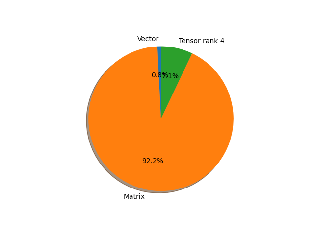

# regnet_y_400mf parameter information

**Number of layers: [ 225 ]**

**Number of parameters: [ 4.34M ]**

**Proportional of each form** (%)

| Vector | Matrix | Tensor rank 4 | 
|  --- | --- | --- |
| 61.78 | 30.67 | 7.56 | 

**Proportional of parameters by form** (%)

| Vector | Matrix | Tensor rank 4 | 
|  --- | --- | --- |
| 0.77 | 92.17 | 7.06 | 

**Layer information**

| Name | Shape | Squeezed shape | Number of parameters | Form |
| --- | --- | --- | --- | --- |
| stem.0.weight | (32, 3, 3, 3) | (32, 3, 3, 3) | 864 | Tensor rank 4 |
| stem.1.weight | (32,) | (32,) | 32 | Vector |
| stem.1.bias | (32,) | (32,) | 32 | Vector |
| trunk_output.block1.block1-0.proj.0.weight | (48, 32, 1, 1) | (48, 32) | 1536 | Matrix |
| trunk_output.block1.block1-0.proj.1.weight | (48,) | (48,) | 48 | Vector |
| trunk_output.block1.block1-0.proj.1.bias | (48,) | (48,) | 48 | Vector |
| trunk_output.block1.block1-0.f.a.0.weight | (48, 32, 1, 1) | (48, 32) | 1536 | Matrix |
| trunk_output.block1.block1-0.f.a.1.weight | (48,) | (48,) | 48 | Vector |
| trunk_output.block1.block1-0.f.a.1.bias | (48,) | (48,) | 48 | Vector |
| trunk_output.block1.block1-0.f.b.0.weight | (48, 8, 3, 3) | (48, 8, 3, 3) | 3456 | Tensor rank 4 |
| trunk_output.block1.block1-0.f.b.1.weight | (48,) | (48,) | 48 | Vector |
| trunk_output.block1.block1-0.f.b.1.bias | (48,) | (48,) | 48 | Vector |
| trunk_output.block1.block1-0.f.se.fc1.weight | (8, 48, 1, 1) | (8, 48) | 384 | Matrix |
| trunk_output.block1.block1-0.f.se.fc1.bias | (8,) | (8,) | 8 | Vector |
| trunk_output.block1.block1-0.f.se.fc2.weight | (48, 8, 1, 1) | (48, 8) | 384 | Matrix |
| trunk_output.block1.block1-0.f.se.fc2.bias | (48,) | (48,) | 48 | Vector |
| trunk_output.block1.block1-0.f.c.0.weight | (48, 48, 1, 1) | (48, 48) | 2304 | Matrix |
| trunk_output.block1.block1-0.f.c.1.weight | (48,) | (48,) | 48 | Vector |
| trunk_output.block1.block1-0.f.c.1.bias | (48,) | (48,) | 48 | Vector |
| trunk_output.block2.block2-0.proj.0.weight | (104, 48, 1, 1) | (104, 48) | 4992 | Matrix |
| trunk_output.block2.block2-0.proj.1.weight | (104,) | (104,) | 104 | Vector |
| trunk_output.block2.block2-0.proj.1.bias | (104,) | (104,) | 104 | Vector |
| trunk_output.block2.block2-0.f.a.0.weight | (104, 48, 1, 1) | (104, 48) | 4992 | Matrix |
| trunk_output.block2.block2-0.f.a.1.weight | (104,) | (104,) | 104 | Vector |
| trunk_output.block2.block2-0.f.a.1.bias | (104,) | (104,) | 104 | Vector |
| trunk_output.block2.block2-0.f.b.0.weight | (104, 8, 3, 3) | (104, 8, 3, 3) | 7488 | Tensor rank 4 |
| trunk_output.block2.block2-0.f.b.1.weight | (104,) | (104,) | 104 | Vector |
| trunk_output.block2.block2-0.f.b.1.bias | (104,) | (104,) | 104 | Vector |
| trunk_output.block2.block2-0.f.se.fc1.weight | (12, 104, 1, 1) | (12, 104) | 1248 | Matrix |
| trunk_output.block2.block2-0.f.se.fc1.bias | (12,) | (12,) | 12 | Vector |
| trunk_output.block2.block2-0.f.se.fc2.weight | (104, 12, 1, 1) | (104, 12) | 1248 | Matrix |
| trunk_output.block2.block2-0.f.se.fc2.bias | (104,) | (104,) | 104 | Vector |
| trunk_output.block2.block2-0.f.c.0.weight | (104, 104, 1, 1) | (104, 104) | 10816 | Matrix |
| trunk_output.block2.block2-0.f.c.1.weight | (104,) | (104,) | 104 | Vector |
| trunk_output.block2.block2-0.f.c.1.bias | (104,) | (104,) | 104 | Vector |
| trunk_output.block2.block2-1.f.a.0.weight | (104, 104, 1, 1) | (104, 104) | 10816 | Matrix |
| trunk_output.block2.block2-1.f.a.1.weight | (104,) | (104,) | 104 | Vector |
| trunk_output.block2.block2-1.f.a.1.bias | (104,) | (104,) | 104 | Vector |
| trunk_output.block2.block2-1.f.b.0.weight | (104, 8, 3, 3) | (104, 8, 3, 3) | 7488 | Tensor rank 4 |
| trunk_output.block2.block2-1.f.b.1.weight | (104,) | (104,) | 104 | Vector |
| trunk_output.block2.block2-1.f.b.1.bias | (104,) | (104,) | 104 | Vector |
| trunk_output.block2.block2-1.f.se.fc1.weight | (26, 104, 1, 1) | (26, 104) | 2704 | Matrix |
| trunk_output.block2.block2-1.f.se.fc1.bias | (26,) | (26,) | 26 | Vector |
| trunk_output.block2.block2-1.f.se.fc2.weight | (104, 26, 1, 1) | (104, 26) | 2704 | Matrix |
| trunk_output.block2.block2-1.f.se.fc2.bias | (104,) | (104,) | 104 | Vector |
| trunk_output.block2.block2-1.f.c.0.weight | (104, 104, 1, 1) | (104, 104) | 10816 | Matrix |
| trunk_output.block2.block2-1.f.c.1.weight | (104,) | (104,) | 104 | Vector |
| trunk_output.block2.block2-1.f.c.1.bias | (104,) | (104,) | 104 | Vector |
| trunk_output.block2.block2-2.f.a.0.weight | (104, 104, 1, 1) | (104, 104) | 10816 | Matrix |
| trunk_output.block2.block2-2.f.a.1.weight | (104,) | (104,) | 104 | Vector |
| trunk_output.block2.block2-2.f.a.1.bias | (104,) | (104,) | 104 | Vector |
| trunk_output.block2.block2-2.f.b.0.weight | (104, 8, 3, 3) | (104, 8, 3, 3) | 7488 | Tensor rank 4 |
| trunk_output.block2.block2-2.f.b.1.weight | (104,) | (104,) | 104 | Vector |
| trunk_output.block2.block2-2.f.b.1.bias | (104,) | (104,) | 104 | Vector |
| trunk_output.block2.block2-2.f.se.fc1.weight | (26, 104, 1, 1) | (26, 104) | 2704 | Matrix |
| trunk_output.block2.block2-2.f.se.fc1.bias | (26,) | (26,) | 26 | Vector |
| trunk_output.block2.block2-2.f.se.fc2.weight | (104, 26, 1, 1) | (104, 26) | 2704 | Matrix |
| trunk_output.block2.block2-2.f.se.fc2.bias | (104,) | (104,) | 104 | Vector |
| trunk_output.block2.block2-2.f.c.0.weight | (104, 104, 1, 1) | (104, 104) | 10816 | Matrix |
| trunk_output.block2.block2-2.f.c.1.weight | (104,) | (104,) | 104 | Vector |
| trunk_output.block2.block2-2.f.c.1.bias | (104,) | (104,) | 104 | Vector |
| trunk_output.block3.block3-0.proj.0.weight | (208, 104, 1, 1) | (208, 104) | 21632 | Matrix |
| trunk_output.block3.block3-0.proj.1.weight | (208,) | (208,) | 208 | Vector |
| trunk_output.block3.block3-0.proj.1.bias | (208,) | (208,) | 208 | Vector |
| trunk_output.block3.block3-0.f.a.0.weight | (208, 104, 1, 1) | (208, 104) | 21632 | Matrix |
| trunk_output.block3.block3-0.f.a.1.weight | (208,) | (208,) | 208 | Vector |
| trunk_output.block3.block3-0.f.a.1.bias | (208,) | (208,) | 208 | Vector |
| trunk_output.block3.block3-0.f.b.0.weight | (208, 8, 3, 3) | (208, 8, 3, 3) | 14976 | Tensor rank 4 |
| trunk_output.block3.block3-0.f.b.1.weight | (208,) | (208,) | 208 | Vector |
| trunk_output.block3.block3-0.f.b.1.bias | (208,) | (208,) | 208 | Vector |
| trunk_output.block3.block3-0.f.se.fc1.weight | (26, 208, 1, 1) | (26, 208) | 5408 | Matrix |
| trunk_output.block3.block3-0.f.se.fc1.bias | (26,) | (26,) | 26 | Vector |
| trunk_output.block3.block3-0.f.se.fc2.weight | (208, 26, 1, 1) | (208, 26) | 5408 | Matrix |
| trunk_output.block3.block3-0.f.se.fc2.bias | (208,) | (208,) | 208 | Vector |
| trunk_output.block3.block3-0.f.c.0.weight | (208, 208, 1, 1) | (208, 208) | 43264 | Matrix |
| trunk_output.block3.block3-0.f.c.1.weight | (208,) | (208,) | 208 | Vector |
| trunk_output.block3.block3-0.f.c.1.bias | (208,) | (208,) | 208 | Vector |
| trunk_output.block3.block3-1.f.a.0.weight | (208, 208, 1, 1) | (208, 208) | 43264 | Matrix |
| trunk_output.block3.block3-1.f.a.1.weight | (208,) | (208,) | 208 | Vector |
| trunk_output.block3.block3-1.f.a.1.bias | (208,) | (208,) | 208 | Vector |
| trunk_output.block3.block3-1.f.b.0.weight | (208, 8, 3, 3) | (208, 8, 3, 3) | 14976 | Tensor rank 4 |
| trunk_output.block3.block3-1.f.b.1.weight | (208,) | (208,) | 208 | Vector |
| trunk_output.block3.block3-1.f.b.1.bias | (208,) | (208,) | 208 | Vector |
| trunk_output.block3.block3-1.f.se.fc1.weight | (52, 208, 1, 1) | (52, 208) | 10816 | Matrix |
| trunk_output.block3.block3-1.f.se.fc1.bias | (52,) | (52,) | 52 | Vector |
| trunk_output.block3.block3-1.f.se.fc2.weight | (208, 52, 1, 1) | (208, 52) | 10816 | Matrix |
| trunk_output.block3.block3-1.f.se.fc2.bias | (208,) | (208,) | 208 | Vector |
| trunk_output.block3.block3-1.f.c.0.weight | (208, 208, 1, 1) | (208, 208) | 43264 | Matrix |
| trunk_output.block3.block3-1.f.c.1.weight | (208,) | (208,) | 208 | Vector |
| trunk_output.block3.block3-1.f.c.1.bias | (208,) | (208,) | 208 | Vector |
| trunk_output.block3.block3-2.f.a.0.weight | (208, 208, 1, 1) | (208, 208) | 43264 | Matrix |
| trunk_output.block3.block3-2.f.a.1.weight | (208,) | (208,) | 208 | Vector |
| trunk_output.block3.block3-2.f.a.1.bias | (208,) | (208,) | 208 | Vector |
| trunk_output.block3.block3-2.f.b.0.weight | (208, 8, 3, 3) | (208, 8, 3, 3) | 14976 | Tensor rank 4 |
| trunk_output.block3.block3-2.f.b.1.weight | (208,) | (208,) | 208 | Vector |
| trunk_output.block3.block3-2.f.b.1.bias | (208,) | (208,) | 208 | Vector |
| trunk_output.block3.block3-2.f.se.fc1.weight | (52, 208, 1, 1) | (52, 208) | 10816 | Matrix |
| trunk_output.block3.block3-2.f.se.fc1.bias | (52,) | (52,) | 52 | Vector |
| trunk_output.block3.block3-2.f.se.fc2.weight | (208, 52, 1, 1) | (208, 52) | 10816 | Matrix |
| trunk_output.block3.block3-2.f.se.fc2.bias | (208,) | (208,) | 208 | Vector |
| trunk_output.block3.block3-2.f.c.0.weight | (208, 208, 1, 1) | (208, 208) | 43264 | Matrix |
| trunk_output.block3.block3-2.f.c.1.weight | (208,) | (208,) | 208 | Vector |
| trunk_output.block3.block3-2.f.c.1.bias | (208,) | (208,) | 208 | Vector |
| trunk_output.block3.block3-3.f.a.0.weight | (208, 208, 1, 1) | (208, 208) | 43264 | Matrix |
| trunk_output.block3.block3-3.f.a.1.weight | (208,) | (208,) | 208 | Vector |
| trunk_output.block3.block3-3.f.a.1.bias | (208,) | (208,) | 208 | Vector |
| trunk_output.block3.block3-3.f.b.0.weight | (208, 8, 3, 3) | (208, 8, 3, 3) | 14976 | Tensor rank 4 |
| trunk_output.block3.block3-3.f.b.1.weight | (208,) | (208,) | 208 | Vector |
| trunk_output.block3.block3-3.f.b.1.bias | (208,) | (208,) | 208 | Vector |
| trunk_output.block3.block3-3.f.se.fc1.weight | (52, 208, 1, 1) | (52, 208) | 10816 | Matrix |
| trunk_output.block3.block3-3.f.se.fc1.bias | (52,) | (52,) | 52 | Vector |
| trunk_output.block3.block3-3.f.se.fc2.weight | (208, 52, 1, 1) | (208, 52) | 10816 | Matrix |
| trunk_output.block3.block3-3.f.se.fc2.bias | (208,) | (208,) | 208 | Vector |
| trunk_output.block3.block3-3.f.c.0.weight | (208, 208, 1, 1) | (208, 208) | 43264 | Matrix |
| trunk_output.block3.block3-3.f.c.1.weight | (208,) | (208,) | 208 | Vector |
| trunk_output.block3.block3-3.f.c.1.bias | (208,) | (208,) | 208 | Vector |
| trunk_output.block3.block3-4.f.a.0.weight | (208, 208, 1, 1) | (208, 208) | 43264 | Matrix |
| trunk_output.block3.block3-4.f.a.1.weight | (208,) | (208,) | 208 | Vector |
| trunk_output.block3.block3-4.f.a.1.bias | (208,) | (208,) | 208 | Vector |
| trunk_output.block3.block3-4.f.b.0.weight | (208, 8, 3, 3) | (208, 8, 3, 3) | 14976 | Tensor rank 4 |
| trunk_output.block3.block3-4.f.b.1.weight | (208,) | (208,) | 208 | Vector |
| trunk_output.block3.block3-4.f.b.1.bias | (208,) | (208,) | 208 | Vector |
| trunk_output.block3.block3-4.f.se.fc1.weight | (52, 208, 1, 1) | (52, 208) | 10816 | Matrix |
| trunk_output.block3.block3-4.f.se.fc1.bias | (52,) | (52,) | 52 | Vector |
| trunk_output.block3.block3-4.f.se.fc2.weight | (208, 52, 1, 1) | (208, 52) | 10816 | Matrix |
| trunk_output.block3.block3-4.f.se.fc2.bias | (208,) | (208,) | 208 | Vector |
| trunk_output.block3.block3-4.f.c.0.weight | (208, 208, 1, 1) | (208, 208) | 43264 | Matrix |
| trunk_output.block3.block3-4.f.c.1.weight | (208,) | (208,) | 208 | Vector |
| trunk_output.block3.block3-4.f.c.1.bias | (208,) | (208,) | 208 | Vector |
| trunk_output.block3.block3-5.f.a.0.weight | (208, 208, 1, 1) | (208, 208) | 43264 | Matrix |
| trunk_output.block3.block3-5.f.a.1.weight | (208,) | (208,) | 208 | Vector |
| trunk_output.block3.block3-5.f.a.1.bias | (208,) | (208,) | 208 | Vector |
| trunk_output.block3.block3-5.f.b.0.weight | (208, 8, 3, 3) | (208, 8, 3, 3) | 14976 | Tensor rank 4 |
| trunk_output.block3.block3-5.f.b.1.weight | (208,) | (208,) | 208 | Vector |
| trunk_output.block3.block3-5.f.b.1.bias | (208,) | (208,) | 208 | Vector |
| trunk_output.block3.block3-5.f.se.fc1.weight | (52, 208, 1, 1) | (52, 208) | 10816 | Matrix |
| trunk_output.block3.block3-5.f.se.fc1.bias | (52,) | (52,) | 52 | Vector |
| trunk_output.block3.block3-5.f.se.fc2.weight | (208, 52, 1, 1) | (208, 52) | 10816 | Matrix |
| trunk_output.block3.block3-5.f.se.fc2.bias | (208,) | (208,) | 208 | Vector |
| trunk_output.block3.block3-5.f.c.0.weight | (208, 208, 1, 1) | (208, 208) | 43264 | Matrix |
| trunk_output.block3.block3-5.f.c.1.weight | (208,) | (208,) | 208 | Vector |
| trunk_output.block3.block3-5.f.c.1.bias | (208,) | (208,) | 208 | Vector |
| trunk_output.block4.block4-0.proj.0.weight | (440, 208, 1, 1) | (440, 208) | 91520 | Matrix |
| trunk_output.block4.block4-0.proj.1.weight | (440,) | (440,) | 440 | Vector |
| trunk_output.block4.block4-0.proj.1.bias | (440,) | (440,) | 440 | Vector |
| trunk_output.block4.block4-0.f.a.0.weight | (440, 208, 1, 1) | (440, 208) | 91520 | Matrix |
| trunk_output.block4.block4-0.f.a.1.weight | (440,) | (440,) | 440 | Vector |
| trunk_output.block4.block4-0.f.a.1.bias | (440,) | (440,) | 440 | Vector |
| trunk_output.block4.block4-0.f.b.0.weight | (440, 8, 3, 3) | (440, 8, 3, 3) | 31680 | Tensor rank 4 |
| trunk_output.block4.block4-0.f.b.1.weight | (440,) | (440,) | 440 | Vector |
| trunk_output.block4.block4-0.f.b.1.bias | (440,) | (440,) | 440 | Vector |
| trunk_output.block4.block4-0.f.se.fc1.weight | (52, 440, 1, 1) | (52, 440) | 22880 | Matrix |
| trunk_output.block4.block4-0.f.se.fc1.bias | (52,) | (52,) | 52 | Vector |
| trunk_output.block4.block4-0.f.se.fc2.weight | (440, 52, 1, 1) | (440, 52) | 22880 | Matrix |
| trunk_output.block4.block4-0.f.se.fc2.bias | (440,) | (440,) | 440 | Vector |
| trunk_output.block4.block4-0.f.c.0.weight | (440, 440, 1, 1) | (440, 440) | 193600 | Matrix |
| trunk_output.block4.block4-0.f.c.1.weight | (440,) | (440,) | 440 | Vector |
| trunk_output.block4.block4-0.f.c.1.bias | (440,) | (440,) | 440 | Vector |
| trunk_output.block4.block4-1.f.a.0.weight | (440, 440, 1, 1) | (440, 440) | 193600 | Matrix |
| trunk_output.block4.block4-1.f.a.1.weight | (440,) | (440,) | 440 | Vector |
| trunk_output.block4.block4-1.f.a.1.bias | (440,) | (440,) | 440 | Vector |
| trunk_output.block4.block4-1.f.b.0.weight | (440, 8, 3, 3) | (440, 8, 3, 3) | 31680 | Tensor rank 4 |
| trunk_output.block4.block4-1.f.b.1.weight | (440,) | (440,) | 440 | Vector |
| trunk_output.block4.block4-1.f.b.1.bias | (440,) | (440,) | 440 | Vector |
| trunk_output.block4.block4-1.f.se.fc1.weight | (110, 440, 1, 1) | (110, 440) | 48400 | Matrix |
| trunk_output.block4.block4-1.f.se.fc1.bias | (110,) | (110,) | 110 | Vector |
| trunk_output.block4.block4-1.f.se.fc2.weight | (440, 110, 1, 1) | (440, 110) | 48400 | Matrix |
| trunk_output.block4.block4-1.f.se.fc2.bias | (440,) | (440,) | 440 | Vector |
| trunk_output.block4.block4-1.f.c.0.weight | (440, 440, 1, 1) | (440, 440) | 193600 | Matrix |
| trunk_output.block4.block4-1.f.c.1.weight | (440,) | (440,) | 440 | Vector |
| trunk_output.block4.block4-1.f.c.1.bias | (440,) | (440,) | 440 | Vector |
| trunk_output.block4.block4-2.f.a.0.weight | (440, 440, 1, 1) | (440, 440) | 193600 | Matrix |
| trunk_output.block4.block4-2.f.a.1.weight | (440,) | (440,) | 440 | Vector |
| trunk_output.block4.block4-2.f.a.1.bias | (440,) | (440,) | 440 | Vector |
| trunk_output.block4.block4-2.f.b.0.weight | (440, 8, 3, 3) | (440, 8, 3, 3) | 31680 | Tensor rank 4 |
| trunk_output.block4.block4-2.f.b.1.weight | (440,) | (440,) | 440 | Vector |
| trunk_output.block4.block4-2.f.b.1.bias | (440,) | (440,) | 440 | Vector |
| trunk_output.block4.block4-2.f.se.fc1.weight | (110, 440, 1, 1) | (110, 440) | 48400 | Matrix |
| trunk_output.block4.block4-2.f.se.fc1.bias | (110,) | (110,) | 110 | Vector |
| trunk_output.block4.block4-2.f.se.fc2.weight | (440, 110, 1, 1) | (440, 110) | 48400 | Matrix |
| trunk_output.block4.block4-2.f.se.fc2.bias | (440,) | (440,) | 440 | Vector |
| trunk_output.block4.block4-2.f.c.0.weight | (440, 440, 1, 1) | (440, 440) | 193600 | Matrix |
| trunk_output.block4.block4-2.f.c.1.weight | (440,) | (440,) | 440 | Vector |
| trunk_output.block4.block4-2.f.c.1.bias | (440,) | (440,) | 440 | Vector |
| trunk_output.block4.block4-3.f.a.0.weight | (440, 440, 1, 1) | (440, 440) | 193600 | Matrix |
| trunk_output.block4.block4-3.f.a.1.weight | (440,) | (440,) | 440 | Vector |
| trunk_output.block4.block4-3.f.a.1.bias | (440,) | (440,) | 440 | Vector |
| trunk_output.block4.block4-3.f.b.0.weight | (440, 8, 3, 3) | (440, 8, 3, 3) | 31680 | Tensor rank 4 |
| trunk_output.block4.block4-3.f.b.1.weight | (440,) | (440,) | 440 | Vector |
| trunk_output.block4.block4-3.f.b.1.bias | (440,) | (440,) | 440 | Vector |
| trunk_output.block4.block4-3.f.se.fc1.weight | (110, 440, 1, 1) | (110, 440) | 48400 | Matrix |
| trunk_output.block4.block4-3.f.se.fc1.bias | (110,) | (110,) | 110 | Vector |
| trunk_output.block4.block4-3.f.se.fc2.weight | (440, 110, 1, 1) | (440, 110) | 48400 | Matrix |
| trunk_output.block4.block4-3.f.se.fc2.bias | (440,) | (440,) | 440 | Vector |
| trunk_output.block4.block4-3.f.c.0.weight | (440, 440, 1, 1) | (440, 440) | 193600 | Matrix |
| trunk_output.block4.block4-3.f.c.1.weight | (440,) | (440,) | 440 | Vector |
| trunk_output.block4.block4-3.f.c.1.bias | (440,) | (440,) | 440 | Vector |
| trunk_output.block4.block4-4.f.a.0.weight | (440, 440, 1, 1) | (440, 440) | 193600 | Matrix |
| trunk_output.block4.block4-4.f.a.1.weight | (440,) | (440,) | 440 | Vector |
| trunk_output.block4.block4-4.f.a.1.bias | (440,) | (440,) | 440 | Vector |
| trunk_output.block4.block4-4.f.b.0.weight | (440, 8, 3, 3) | (440, 8, 3, 3) | 31680 | Tensor rank 4 |
| trunk_output.block4.block4-4.f.b.1.weight | (440,) | (440,) | 440 | Vector |
| trunk_output.block4.block4-4.f.b.1.bias | (440,) | (440,) | 440 | Vector |
| trunk_output.block4.block4-4.f.se.fc1.weight | (110, 440, 1, 1) | (110, 440) | 48400 | Matrix |
| trunk_output.block4.block4-4.f.se.fc1.bias | (110,) | (110,) | 110 | Vector |
| trunk_output.block4.block4-4.f.se.fc2.weight | (440, 110, 1, 1) | (440, 110) | 48400 | Matrix |
| trunk_output.block4.block4-4.f.se.fc2.bias | (440,) | (440,) | 440 | Vector |
| trunk_output.block4.block4-4.f.c.0.weight | (440, 440, 1, 1) | (440, 440) | 193600 | Matrix |
| trunk_output.block4.block4-4.f.c.1.weight | (440,) | (440,) | 440 | Vector |
| trunk_output.block4.block4-4.f.c.1.bias | (440,) | (440,) | 440 | Vector |
| trunk_output.block4.block4-5.f.a.0.weight | (440, 440, 1, 1) | (440, 440) | 193600 | Matrix |
| trunk_output.block4.block4-5.f.a.1.weight | (440,) | (440,) | 440 | Vector |
| trunk_output.block4.block4-5.f.a.1.bias | (440,) | (440,) | 440 | Vector |
| trunk_output.block4.block4-5.f.b.0.weight | (440, 8, 3, 3) | (440, 8, 3, 3) | 31680 | Tensor rank 4 |
| trunk_output.block4.block4-5.f.b.1.weight | (440,) | (440,) | 440 | Vector |
| trunk_output.block4.block4-5.f.b.1.bias | (440,) | (440,) | 440 | Vector |
| trunk_output.block4.block4-5.f.se.fc1.weight | (110, 440, 1, 1) | (110, 440) | 48400 | Matrix |
| trunk_output.block4.block4-5.f.se.fc1.bias | (110,) | (110,) | 110 | Vector |
| trunk_output.block4.block4-5.f.se.fc2.weight | (440, 110, 1, 1) | (440, 110) | 48400 | Matrix |
| trunk_output.block4.block4-5.f.se.fc2.bias | (440,) | (440,) | 440 | Vector |
| trunk_output.block4.block4-5.f.c.0.weight | (440, 440, 1, 1) | (440, 440) | 193600 | Matrix |
| trunk_output.block4.block4-5.f.c.1.weight | (440,) | (440,) | 440 | Vector |
| trunk_output.block4.block4-5.f.c.1.bias | (440,) | (440,) | 440 | Vector |
| fc.weight | (1000, 440) | (1000, 440) | 440000 | Matrix |
| fc.bias | (1000,) | (1000,) | 1000 | Vector |

