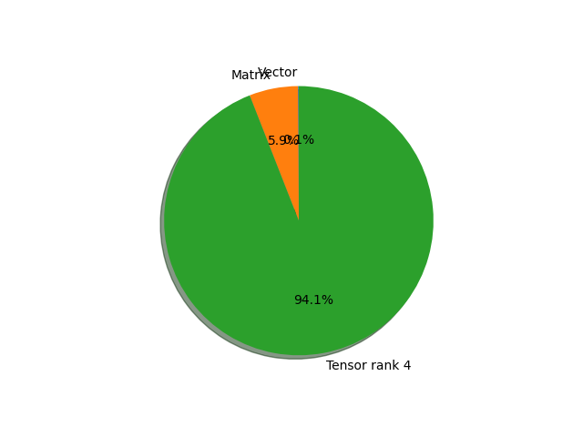

# resnet18 parameter information

**Number of layers: [ 62 ]**

**Number of parameters: [ 11.69M ]**

**Proportional of each form** (%)

| Vector | Matrix | Tensor rank 4 | 
|  --- | --- | --- |
| 66.13 | 6.45 | 27.42 | 

**Proportional of parameters by form** (%)

| Vector | Matrix | Tensor rank 4 | 
|  --- | --- | --- |
| 0.09 | 5.85 | 94.06 | 

**Layer information**

| Name | Shape | Squeezed shape | Number of parameters | Form |
| --- | --- | --- | --- | --- |
| conv1.weight | (64, 3, 7, 7) | (64, 3, 7, 7) | 9408 | Tensor rank 4 |
| bn1.weight | (64,) | (64,) | 64 | Vector |
| bn1.bias | (64,) | (64,) | 64 | Vector |
| layer1.0.conv1.weight | (64, 64, 3, 3) | (64, 64, 3, 3) | 36864 | Tensor rank 4 |
| layer1.0.bn1.weight | (64,) | (64,) | 64 | Vector |
| layer1.0.bn1.bias | (64,) | (64,) | 64 | Vector |
| layer1.0.conv2.weight | (64, 64, 3, 3) | (64, 64, 3, 3) | 36864 | Tensor rank 4 |
| layer1.0.bn2.weight | (64,) | (64,) | 64 | Vector |
| layer1.0.bn2.bias | (64,) | (64,) | 64 | Vector |
| layer1.1.conv1.weight | (64, 64, 3, 3) | (64, 64, 3, 3) | 36864 | Tensor rank 4 |
| layer1.1.bn1.weight | (64,) | (64,) | 64 | Vector |
| layer1.1.bn1.bias | (64,) | (64,) | 64 | Vector |
| layer1.1.conv2.weight | (64, 64, 3, 3) | (64, 64, 3, 3) | 36864 | Tensor rank 4 |
| layer1.1.bn2.weight | (64,) | (64,) | 64 | Vector |
| layer1.1.bn2.bias | (64,) | (64,) | 64 | Vector |
| layer2.0.conv1.weight | (128, 64, 3, 3) | (128, 64, 3, 3) | 73728 | Tensor rank 4 |
| layer2.0.bn1.weight | (128,) | (128,) | 128 | Vector |
| layer2.0.bn1.bias | (128,) | (128,) | 128 | Vector |
| layer2.0.conv2.weight | (128, 128, 3, 3) | (128, 128, 3, 3) | 147456 | Tensor rank 4 |
| layer2.0.bn2.weight | (128,) | (128,) | 128 | Vector |
| layer2.0.bn2.bias | (128,) | (128,) | 128 | Vector |
| layer2.0.downsample.0.weight | (128, 64, 1, 1) | (128, 64) | 8192 | Matrix |
| layer2.0.downsample.1.weight | (128,) | (128,) | 128 | Vector |
| layer2.0.downsample.1.bias | (128,) | (128,) | 128 | Vector |
| layer2.1.conv1.weight | (128, 128, 3, 3) | (128, 128, 3, 3) | 147456 | Tensor rank 4 |
| layer2.1.bn1.weight | (128,) | (128,) | 128 | Vector |
| layer2.1.bn1.bias | (128,) | (128,) | 128 | Vector |
| layer2.1.conv2.weight | (128, 128, 3, 3) | (128, 128, 3, 3) | 147456 | Tensor rank 4 |
| layer2.1.bn2.weight | (128,) | (128,) | 128 | Vector |
| layer2.1.bn2.bias | (128,) | (128,) | 128 | Vector |
| layer3.0.conv1.weight | (256, 128, 3, 3) | (256, 128, 3, 3) | 294912 | Tensor rank 4 |
| layer3.0.bn1.weight | (256,) | (256,) | 256 | Vector |
| layer3.0.bn1.bias | (256,) | (256,) | 256 | Vector |
| layer3.0.conv2.weight | (256, 256, 3, 3) | (256, 256, 3, 3) | 589824 | Tensor rank 4 |
| layer3.0.bn2.weight | (256,) | (256,) | 256 | Vector |
| layer3.0.bn2.bias | (256,) | (256,) | 256 | Vector |
| layer3.0.downsample.0.weight | (256, 128, 1, 1) | (256, 128) | 32768 | Matrix |
| layer3.0.downsample.1.weight | (256,) | (256,) | 256 | Vector |
| layer3.0.downsample.1.bias | (256,) | (256,) | 256 | Vector |
| layer3.1.conv1.weight | (256, 256, 3, 3) | (256, 256, 3, 3) | 589824 | Tensor rank 4 |
| layer3.1.bn1.weight | (256,) | (256,) | 256 | Vector |
| layer3.1.bn1.bias | (256,) | (256,) | 256 | Vector |
| layer3.1.conv2.weight | (256, 256, 3, 3) | (256, 256, 3, 3) | 589824 | Tensor rank 4 |
| layer3.1.bn2.weight | (256,) | (256,) | 256 | Vector |
| layer3.1.bn2.bias | (256,) | (256,) | 256 | Vector |
| layer4.0.conv1.weight | (512, 256, 3, 3) | (512, 256, 3, 3) | 1179648 | Tensor rank 4 |
| layer4.0.bn1.weight | (512,) | (512,) | 512 | Vector |
| layer4.0.bn1.bias | (512,) | (512,) | 512 | Vector |
| layer4.0.conv2.weight | (512, 512, 3, 3) | (512, 512, 3, 3) | 2359296 | Tensor rank 4 |
| layer4.0.bn2.weight | (512,) | (512,) | 512 | Vector |
| layer4.0.bn2.bias | (512,) | (512,) | 512 | Vector |
| layer4.0.downsample.0.weight | (512, 256, 1, 1) | (512, 256) | 131072 | Matrix |
| layer4.0.downsample.1.weight | (512,) | (512,) | 512 | Vector |
| layer4.0.downsample.1.bias | (512,) | (512,) | 512 | Vector |
| layer4.1.conv1.weight | (512, 512, 3, 3) | (512, 512, 3, 3) | 2359296 | Tensor rank 4 |
| layer4.1.bn1.weight | (512,) | (512,) | 512 | Vector |
| layer4.1.bn1.bias | (512,) | (512,) | 512 | Vector |
| layer4.1.conv2.weight | (512, 512, 3, 3) | (512, 512, 3, 3) | 2359296 | Tensor rank 4 |
| layer4.1.bn2.weight | (512,) | (512,) | 512 | Vector |
| layer4.1.bn2.bias | (512,) | (512,) | 512 | Vector |
| fc.weight | (1000, 512) | (1000, 512) | 512000 | Matrix |
| fc.bias | (1000,) | (1000,) | 1000 | Vector |

