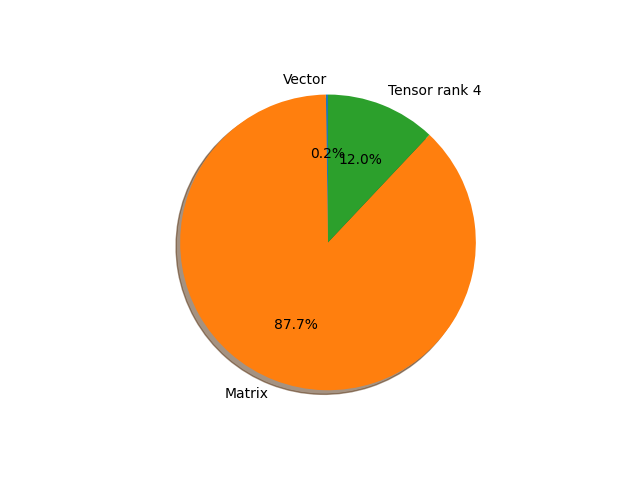

# resnext101_32x8d parameter information

**Number of layers: [ 314 ]**

**Number of parameters: [ 88.79M ]**

**Proportional of each form** (%)

| Vector | Matrix | Tensor rank 4 | 
|  --- | --- | --- |
| 66.56 | 22.61 | 10.83 | 
**Proportional of parameters by form** (%)

| Vector | Matrix | Tensor rank 4 | 
|  --- | --- | --- |
| 0.23 | 87.74 | 12.03 | 

**Layer information**

| Name | Shape | Squeezed shape | Number of parameters | Form |
| --- | --- | --- | --- | --- |
| conv1.weight | (64, 3, 7, 7) | (64, 3, 7, 7) | 9408 | Tensor rank 4 |
| bn1.weight | (64,) | (64,) | 64 | Vector |
| bn1.bias | (64,) | (64,) | 64 | Vector |
| layer1.0.conv1.weight | (256, 64, 1, 1) | (256, 64) | 16384 | Matrix |
| layer1.0.bn1.weight | (256,) | (256,) | 256 | Vector |
| layer1.0.bn1.bias | (256,) | (256,) | 256 | Vector |
| layer1.0.conv2.weight | (256, 8, 3, 3) | (256, 8, 3, 3) | 18432 | Tensor rank 4 |
| layer1.0.bn2.weight | (256,) | (256,) | 256 | Vector |
| layer1.0.bn2.bias | (256,) | (256,) | 256 | Vector |
| layer1.0.conv3.weight | (256, 256, 1, 1) | (256, 256) | 65536 | Matrix |
| layer1.0.bn3.weight | (256,) | (256,) | 256 | Vector |
| layer1.0.bn3.bias | (256,) | (256,) | 256 | Vector |
| layer1.0.downsample.0.weight | (256, 64, 1, 1) | (256, 64) | 16384 | Matrix |
| layer1.0.downsample.1.weight | (256,) | (256,) | 256 | Vector |
| layer1.0.downsample.1.bias | (256,) | (256,) | 256 | Vector |
| layer1.1.conv1.weight | (256, 256, 1, 1) | (256, 256) | 65536 | Matrix |
| layer1.1.bn1.weight | (256,) | (256,) | 256 | Vector |
| layer1.1.bn1.bias | (256,) | (256,) | 256 | Vector |
| layer1.1.conv2.weight | (256, 8, 3, 3) | (256, 8, 3, 3) | 18432 | Tensor rank 4 |
| layer1.1.bn2.weight | (256,) | (256,) | 256 | Vector |
| layer1.1.bn2.bias | (256,) | (256,) | 256 | Vector |
| layer1.1.conv3.weight | (256, 256, 1, 1) | (256, 256) | 65536 | Matrix |
| layer1.1.bn3.weight | (256,) | (256,) | 256 | Vector |
| layer1.1.bn3.bias | (256,) | (256,) | 256 | Vector |
| layer1.2.conv1.weight | (256, 256, 1, 1) | (256, 256) | 65536 | Matrix |
| layer1.2.bn1.weight | (256,) | (256,) | 256 | Vector |
| layer1.2.bn1.bias | (256,) | (256,) | 256 | Vector |
| layer1.2.conv2.weight | (256, 8, 3, 3) | (256, 8, 3, 3) | 18432 | Tensor rank 4 |
| layer1.2.bn2.weight | (256,) | (256,) | 256 | Vector |
| layer1.2.bn2.bias | (256,) | (256,) | 256 | Vector |
| layer1.2.conv3.weight | (256, 256, 1, 1) | (256, 256) | 65536 | Matrix |
| layer1.2.bn3.weight | (256,) | (256,) | 256 | Vector |
| layer1.2.bn3.bias | (256,) | (256,) | 256 | Vector |
| layer2.0.conv1.weight | (512, 256, 1, 1) | (512, 256) | 131072 | Matrix |
| layer2.0.bn1.weight | (512,) | (512,) | 512 | Vector |
| layer2.0.bn1.bias | (512,) | (512,) | 512 | Vector |
| layer2.0.conv2.weight | (512, 16, 3, 3) | (512, 16, 3, 3) | 73728 | Tensor rank 4 |
| layer2.0.bn2.weight | (512,) | (512,) | 512 | Vector |
| layer2.0.bn2.bias | (512,) | (512,) | 512 | Vector |
| layer2.0.conv3.weight | (512, 512, 1, 1) | (512, 512) | 262144 | Matrix |
| layer2.0.bn3.weight | (512,) | (512,) | 512 | Vector |
| layer2.0.bn3.bias | (512,) | (512,) | 512 | Vector |
| layer2.0.downsample.0.weight | (512, 256, 1, 1) | (512, 256) | 131072 | Matrix |
| layer2.0.downsample.1.weight | (512,) | (512,) | 512 | Vector |
| layer2.0.downsample.1.bias | (512,) | (512,) | 512 | Vector |
| layer2.1.conv1.weight | (512, 512, 1, 1) | (512, 512) | 262144 | Matrix |
| layer2.1.bn1.weight | (512,) | (512,) | 512 | Vector |
| layer2.1.bn1.bias | (512,) | (512,) | 512 | Vector |
| layer2.1.conv2.weight | (512, 16, 3, 3) | (512, 16, 3, 3) | 73728 | Tensor rank 4 |
| layer2.1.bn2.weight | (512,) | (512,) | 512 | Vector |
| layer2.1.bn2.bias | (512,) | (512,) | 512 | Vector |
| layer2.1.conv3.weight | (512, 512, 1, 1) | (512, 512) | 262144 | Matrix |
| layer2.1.bn3.weight | (512,) | (512,) | 512 | Vector |
| layer2.1.bn3.bias | (512,) | (512,) | 512 | Vector |
| layer2.2.conv1.weight | (512, 512, 1, 1) | (512, 512) | 262144 | Matrix |
| layer2.2.bn1.weight | (512,) | (512,) | 512 | Vector |
| layer2.2.bn1.bias | (512,) | (512,) | 512 | Vector |
| layer2.2.conv2.weight | (512, 16, 3, 3) | (512, 16, 3, 3) | 73728 | Tensor rank 4 |
| layer2.2.bn2.weight | (512,) | (512,) | 512 | Vector |
| layer2.2.bn2.bias | (512,) | (512,) | 512 | Vector |
| layer2.2.conv3.weight | (512, 512, 1, 1) | (512, 512) | 262144 | Matrix |
| layer2.2.bn3.weight | (512,) | (512,) | 512 | Vector |
| layer2.2.bn3.bias | (512,) | (512,) | 512 | Vector |
| layer2.3.conv1.weight | (512, 512, 1, 1) | (512, 512) | 262144 | Matrix |
| layer2.3.bn1.weight | (512,) | (512,) | 512 | Vector |
| layer2.3.bn1.bias | (512,) | (512,) | 512 | Vector |
| layer2.3.conv2.weight | (512, 16, 3, 3) | (512, 16, 3, 3) | 73728 | Tensor rank 4 |
| layer2.3.bn2.weight | (512,) | (512,) | 512 | Vector |
| layer2.3.bn2.bias | (512,) | (512,) | 512 | Vector |
| layer2.3.conv3.weight | (512, 512, 1, 1) | (512, 512) | 262144 | Matrix |
| layer2.3.bn3.weight | (512,) | (512,) | 512 | Vector |
| layer2.3.bn3.bias | (512,) | (512,) | 512 | Vector |
| layer3.0.conv1.weight | (1024, 512, 1, 1) | (1024, 512) | 524288 | Matrix |
| layer3.0.bn1.weight | (1024,) | (1024,) | 1024 | Vector |
| layer3.0.bn1.bias | (1024,) | (1024,) | 1024 | Vector |
| layer3.0.conv2.weight | (1024, 32, 3, 3) | (1024, 32, 3, 3) | 294912 | Tensor rank 4 |
| layer3.0.bn2.weight | (1024,) | (1024,) | 1024 | Vector |
| layer3.0.bn2.bias | (1024,) | (1024,) | 1024 | Vector |
| layer3.0.conv3.weight | (1024, 1024, 1, 1) | (1024, 1024) | 1048576 | Matrix |
| layer3.0.bn3.weight | (1024,) | (1024,) | 1024 | Vector |
| layer3.0.bn3.bias | (1024,) | (1024,) | 1024 | Vector |
| layer3.0.downsample.0.weight | (1024, 512, 1, 1) | (1024, 512) | 524288 | Matrix |
| layer3.0.downsample.1.weight | (1024,) | (1024,) | 1024 | Vector |
| layer3.0.downsample.1.bias | (1024,) | (1024,) | 1024 | Vector |
| layer3.1.conv1.weight | (1024, 1024, 1, 1) | (1024, 1024) | 1048576 | Matrix |
| layer3.1.bn1.weight | (1024,) | (1024,) | 1024 | Vector |
| layer3.1.bn1.bias | (1024,) | (1024,) | 1024 | Vector |
| layer3.1.conv2.weight | (1024, 32, 3, 3) | (1024, 32, 3, 3) | 294912 | Tensor rank 4 |
| layer3.1.bn2.weight | (1024,) | (1024,) | 1024 | Vector |
| layer3.1.bn2.bias | (1024,) | (1024,) | 1024 | Vector |
| layer3.1.conv3.weight | (1024, 1024, 1, 1) | (1024, 1024) | 1048576 | Matrix |
| layer3.1.bn3.weight | (1024,) | (1024,) | 1024 | Vector |
| layer3.1.bn3.bias | (1024,) | (1024,) | 1024 | Vector |
| layer3.2.conv1.weight | (1024, 1024, 1, 1) | (1024, 1024) | 1048576 | Matrix |
| layer3.2.bn1.weight | (1024,) | (1024,) | 1024 | Vector |
| layer3.2.bn1.bias | (1024,) | (1024,) | 1024 | Vector |
| layer3.2.conv2.weight | (1024, 32, 3, 3) | (1024, 32, 3, 3) | 294912 | Tensor rank 4 |
| layer3.2.bn2.weight | (1024,) | (1024,) | 1024 | Vector |
| layer3.2.bn2.bias | (1024,) | (1024,) | 1024 | Vector |
| layer3.2.conv3.weight | (1024, 1024, 1, 1) | (1024, 1024) | 1048576 | Matrix |
| layer3.2.bn3.weight | (1024,) | (1024,) | 1024 | Vector |
| layer3.2.bn3.bias | (1024,) | (1024,) | 1024 | Vector |
| layer3.3.conv1.weight | (1024, 1024, 1, 1) | (1024, 1024) | 1048576 | Matrix |
| layer3.3.bn1.weight | (1024,) | (1024,) | 1024 | Vector |
| layer3.3.bn1.bias | (1024,) | (1024,) | 1024 | Vector |
| layer3.3.conv2.weight | (1024, 32, 3, 3) | (1024, 32, 3, 3) | 294912 | Tensor rank 4 |
| layer3.3.bn2.weight | (1024,) | (1024,) | 1024 | Vector |
| layer3.3.bn2.bias | (1024,) | (1024,) | 1024 | Vector |
| layer3.3.conv3.weight | (1024, 1024, 1, 1) | (1024, 1024) | 1048576 | Matrix |
| layer3.3.bn3.weight | (1024,) | (1024,) | 1024 | Vector |
| layer3.3.bn3.bias | (1024,) | (1024,) | 1024 | Vector |
| layer3.4.conv1.weight | (1024, 1024, 1, 1) | (1024, 1024) | 1048576 | Matrix |
| layer3.4.bn1.weight | (1024,) | (1024,) | 1024 | Vector |
| layer3.4.bn1.bias | (1024,) | (1024,) | 1024 | Vector |
| layer3.4.conv2.weight | (1024, 32, 3, 3) | (1024, 32, 3, 3) | 294912 | Tensor rank 4 |
| layer3.4.bn2.weight | (1024,) | (1024,) | 1024 | Vector |
| layer3.4.bn2.bias | (1024,) | (1024,) | 1024 | Vector |
| layer3.4.conv3.weight | (1024, 1024, 1, 1) | (1024, 1024) | 1048576 | Matrix |
| layer3.4.bn3.weight | (1024,) | (1024,) | 1024 | Vector |
| layer3.4.bn3.bias | (1024,) | (1024,) | 1024 | Vector |
| layer3.5.conv1.weight | (1024, 1024, 1, 1) | (1024, 1024) | 1048576 | Matrix |
| layer3.5.bn1.weight | (1024,) | (1024,) | 1024 | Vector |
| layer3.5.bn1.bias | (1024,) | (1024,) | 1024 | Vector |
| layer3.5.conv2.weight | (1024, 32, 3, 3) | (1024, 32, 3, 3) | 294912 | Tensor rank 4 |
| layer3.5.bn2.weight | (1024,) | (1024,) | 1024 | Vector |
| layer3.5.bn2.bias | (1024,) | (1024,) | 1024 | Vector |
| layer3.5.conv3.weight | (1024, 1024, 1, 1) | (1024, 1024) | 1048576 | Matrix |
| layer3.5.bn3.weight | (1024,) | (1024,) | 1024 | Vector |
| layer3.5.bn3.bias | (1024,) | (1024,) | 1024 | Vector |
| layer3.6.conv1.weight | (1024, 1024, 1, 1) | (1024, 1024) | 1048576 | Matrix |
| layer3.6.bn1.weight | (1024,) | (1024,) | 1024 | Vector |
| layer3.6.bn1.bias | (1024,) | (1024,) | 1024 | Vector |
| layer3.6.conv2.weight | (1024, 32, 3, 3) | (1024, 32, 3, 3) | 294912 | Tensor rank 4 |
| layer3.6.bn2.weight | (1024,) | (1024,) | 1024 | Vector |
| layer3.6.bn2.bias | (1024,) | (1024,) | 1024 | Vector |
| layer3.6.conv3.weight | (1024, 1024, 1, 1) | (1024, 1024) | 1048576 | Matrix |
| layer3.6.bn3.weight | (1024,) | (1024,) | 1024 | Vector |
| layer3.6.bn3.bias | (1024,) | (1024,) | 1024 | Vector |
| layer3.7.conv1.weight | (1024, 1024, 1, 1) | (1024, 1024) | 1048576 | Matrix |
| layer3.7.bn1.weight | (1024,) | (1024,) | 1024 | Vector |
| layer3.7.bn1.bias | (1024,) | (1024,) | 1024 | Vector |
| layer3.7.conv2.weight | (1024, 32, 3, 3) | (1024, 32, 3, 3) | 294912 | Tensor rank 4 |
| layer3.7.bn2.weight | (1024,) | (1024,) | 1024 | Vector |
| layer3.7.bn2.bias | (1024,) | (1024,) | 1024 | Vector |
| layer3.7.conv3.weight | (1024, 1024, 1, 1) | (1024, 1024) | 1048576 | Matrix |
| layer3.7.bn3.weight | (1024,) | (1024,) | 1024 | Vector |
| layer3.7.bn3.bias | (1024,) | (1024,) | 1024 | Vector |
| layer3.8.conv1.weight | (1024, 1024, 1, 1) | (1024, 1024) | 1048576 | Matrix |
| layer3.8.bn1.weight | (1024,) | (1024,) | 1024 | Vector |
| layer3.8.bn1.bias | (1024,) | (1024,) | 1024 | Vector |
| layer3.8.conv2.weight | (1024, 32, 3, 3) | (1024, 32, 3, 3) | 294912 | Tensor rank 4 |
| layer3.8.bn2.weight | (1024,) | (1024,) | 1024 | Vector |
| layer3.8.bn2.bias | (1024,) | (1024,) | 1024 | Vector |
| layer3.8.conv3.weight | (1024, 1024, 1, 1) | (1024, 1024) | 1048576 | Matrix |
| layer3.8.bn3.weight | (1024,) | (1024,) | 1024 | Vector |
| layer3.8.bn3.bias | (1024,) | (1024,) | 1024 | Vector |
| layer3.9.conv1.weight | (1024, 1024, 1, 1) | (1024, 1024) | 1048576 | Matrix |
| layer3.9.bn1.weight | (1024,) | (1024,) | 1024 | Vector |
| layer3.9.bn1.bias | (1024,) | (1024,) | 1024 | Vector |
| layer3.9.conv2.weight | (1024, 32, 3, 3) | (1024, 32, 3, 3) | 294912 | Tensor rank 4 |
| layer3.9.bn2.weight | (1024,) | (1024,) | 1024 | Vector |
| layer3.9.bn2.bias | (1024,) | (1024,) | 1024 | Vector |
| layer3.9.conv3.weight | (1024, 1024, 1, 1) | (1024, 1024) | 1048576 | Matrix |
| layer3.9.bn3.weight | (1024,) | (1024,) | 1024 | Vector |
| layer3.9.bn3.bias | (1024,) | (1024,) | 1024 | Vector |
| layer3.10.conv1.weight | (1024, 1024, 1, 1) | (1024, 1024) | 1048576 | Matrix |
| layer3.10.bn1.weight | (1024,) | (1024,) | 1024 | Vector |
| layer3.10.bn1.bias | (1024,) | (1024,) | 1024 | Vector |
| layer3.10.conv2.weight | (1024, 32, 3, 3) | (1024, 32, 3, 3) | 294912 | Tensor rank 4 |
| layer3.10.bn2.weight | (1024,) | (1024,) | 1024 | Vector |
| layer3.10.bn2.bias | (1024,) | (1024,) | 1024 | Vector |
| layer3.10.conv3.weight | (1024, 1024, 1, 1) | (1024, 1024) | 1048576 | Matrix |
| layer3.10.bn3.weight | (1024,) | (1024,) | 1024 | Vector |
| layer3.10.bn3.bias | (1024,) | (1024,) | 1024 | Vector |
| layer3.11.conv1.weight | (1024, 1024, 1, 1) | (1024, 1024) | 1048576 | Matrix |
| layer3.11.bn1.weight | (1024,) | (1024,) | 1024 | Vector |
| layer3.11.bn1.bias | (1024,) | (1024,) | 1024 | Vector |
| layer3.11.conv2.weight | (1024, 32, 3, 3) | (1024, 32, 3, 3) | 294912 | Tensor rank 4 |
| layer3.11.bn2.weight | (1024,) | (1024,) | 1024 | Vector |
| layer3.11.bn2.bias | (1024,) | (1024,) | 1024 | Vector |
| layer3.11.conv3.weight | (1024, 1024, 1, 1) | (1024, 1024) | 1048576 | Matrix |
| layer3.11.bn3.weight | (1024,) | (1024,) | 1024 | Vector |
| layer3.11.bn3.bias | (1024,) | (1024,) | 1024 | Vector |
| layer3.12.conv1.weight | (1024, 1024, 1, 1) | (1024, 1024) | 1048576 | Matrix |
| layer3.12.bn1.weight | (1024,) | (1024,) | 1024 | Vector |
| layer3.12.bn1.bias | (1024,) | (1024,) | 1024 | Vector |
| layer3.12.conv2.weight | (1024, 32, 3, 3) | (1024, 32, 3, 3) | 294912 | Tensor rank 4 |
| layer3.12.bn2.weight | (1024,) | (1024,) | 1024 | Vector |
| layer3.12.bn2.bias | (1024,) | (1024,) | 1024 | Vector |
| layer3.12.conv3.weight | (1024, 1024, 1, 1) | (1024, 1024) | 1048576 | Matrix |
| layer3.12.bn3.weight | (1024,) | (1024,) | 1024 | Vector |
| layer3.12.bn3.bias | (1024,) | (1024,) | 1024 | Vector |
| layer3.13.conv1.weight | (1024, 1024, 1, 1) | (1024, 1024) | 1048576 | Matrix |
| layer3.13.bn1.weight | (1024,) | (1024,) | 1024 | Vector |
| layer3.13.bn1.bias | (1024,) | (1024,) | 1024 | Vector |
| layer3.13.conv2.weight | (1024, 32, 3, 3) | (1024, 32, 3, 3) | 294912 | Tensor rank 4 |
| layer3.13.bn2.weight | (1024,) | (1024,) | 1024 | Vector |
| layer3.13.bn2.bias | (1024,) | (1024,) | 1024 | Vector |
| layer3.13.conv3.weight | (1024, 1024, 1, 1) | (1024, 1024) | 1048576 | Matrix |
| layer3.13.bn3.weight | (1024,) | (1024,) | 1024 | Vector |
| layer3.13.bn3.bias | (1024,) | (1024,) | 1024 | Vector |
| layer3.14.conv1.weight | (1024, 1024, 1, 1) | (1024, 1024) | 1048576 | Matrix |
| layer3.14.bn1.weight | (1024,) | (1024,) | 1024 | Vector |
| layer3.14.bn1.bias | (1024,) | (1024,) | 1024 | Vector |
| layer3.14.conv2.weight | (1024, 32, 3, 3) | (1024, 32, 3, 3) | 294912 | Tensor rank 4 |
| layer3.14.bn2.weight | (1024,) | (1024,) | 1024 | Vector |
| layer3.14.bn2.bias | (1024,) | (1024,) | 1024 | Vector |
| layer3.14.conv3.weight | (1024, 1024, 1, 1) | (1024, 1024) | 1048576 | Matrix |
| layer3.14.bn3.weight | (1024,) | (1024,) | 1024 | Vector |
| layer3.14.bn3.bias | (1024,) | (1024,) | 1024 | Vector |
| layer3.15.conv1.weight | (1024, 1024, 1, 1) | (1024, 1024) | 1048576 | Matrix |
| layer3.15.bn1.weight | (1024,) | (1024,) | 1024 | Vector |
| layer3.15.bn1.bias | (1024,) | (1024,) | 1024 | Vector |
| layer3.15.conv2.weight | (1024, 32, 3, 3) | (1024, 32, 3, 3) | 294912 | Tensor rank 4 |
| layer3.15.bn2.weight | (1024,) | (1024,) | 1024 | Vector |
| layer3.15.bn2.bias | (1024,) | (1024,) | 1024 | Vector |
| layer3.15.conv3.weight | (1024, 1024, 1, 1) | (1024, 1024) | 1048576 | Matrix |
| layer3.15.bn3.weight | (1024,) | (1024,) | 1024 | Vector |
| layer3.15.bn3.bias | (1024,) | (1024,) | 1024 | Vector |
| layer3.16.conv1.weight | (1024, 1024, 1, 1) | (1024, 1024) | 1048576 | Matrix |
| layer3.16.bn1.weight | (1024,) | (1024,) | 1024 | Vector |
| layer3.16.bn1.bias | (1024,) | (1024,) | 1024 | Vector |
| layer3.16.conv2.weight | (1024, 32, 3, 3) | (1024, 32, 3, 3) | 294912 | Tensor rank 4 |
| layer3.16.bn2.weight | (1024,) | (1024,) | 1024 | Vector |
| layer3.16.bn2.bias | (1024,) | (1024,) | 1024 | Vector |
| layer3.16.conv3.weight | (1024, 1024, 1, 1) | (1024, 1024) | 1048576 | Matrix |
| layer3.16.bn3.weight | (1024,) | (1024,) | 1024 | Vector |
| layer3.16.bn3.bias | (1024,) | (1024,) | 1024 | Vector |
| layer3.17.conv1.weight | (1024, 1024, 1, 1) | (1024, 1024) | 1048576 | Matrix |
| layer3.17.bn1.weight | (1024,) | (1024,) | 1024 | Vector |
| layer3.17.bn1.bias | (1024,) | (1024,) | 1024 | Vector |
| layer3.17.conv2.weight | (1024, 32, 3, 3) | (1024, 32, 3, 3) | 294912 | Tensor rank 4 |
| layer3.17.bn2.weight | (1024,) | (1024,) | 1024 | Vector |
| layer3.17.bn2.bias | (1024,) | (1024,) | 1024 | Vector |
| layer3.17.conv3.weight | (1024, 1024, 1, 1) | (1024, 1024) | 1048576 | Matrix |
| layer3.17.bn3.weight | (1024,) | (1024,) | 1024 | Vector |
| layer3.17.bn3.bias | (1024,) | (1024,) | 1024 | Vector |
| layer3.18.conv1.weight | (1024, 1024, 1, 1) | (1024, 1024) | 1048576 | Matrix |
| layer3.18.bn1.weight | (1024,) | (1024,) | 1024 | Vector |
| layer3.18.bn1.bias | (1024,) | (1024,) | 1024 | Vector |
| layer3.18.conv2.weight | (1024, 32, 3, 3) | (1024, 32, 3, 3) | 294912 | Tensor rank 4 |
| layer3.18.bn2.weight | (1024,) | (1024,) | 1024 | Vector |
| layer3.18.bn2.bias | (1024,) | (1024,) | 1024 | Vector |
| layer3.18.conv3.weight | (1024, 1024, 1, 1) | (1024, 1024) | 1048576 | Matrix |
| layer3.18.bn3.weight | (1024,) | (1024,) | 1024 | Vector |
| layer3.18.bn3.bias | (1024,) | (1024,) | 1024 | Vector |
| layer3.19.conv1.weight | (1024, 1024, 1, 1) | (1024, 1024) | 1048576 | Matrix |
| layer3.19.bn1.weight | (1024,) | (1024,) | 1024 | Vector |
| layer3.19.bn1.bias | (1024,) | (1024,) | 1024 | Vector |
| layer3.19.conv2.weight | (1024, 32, 3, 3) | (1024, 32, 3, 3) | 294912 | Tensor rank 4 |
| layer3.19.bn2.weight | (1024,) | (1024,) | 1024 | Vector |
| layer3.19.bn2.bias | (1024,) | (1024,) | 1024 | Vector |
| layer3.19.conv3.weight | (1024, 1024, 1, 1) | (1024, 1024) | 1048576 | Matrix |
| layer3.19.bn3.weight | (1024,) | (1024,) | 1024 | Vector |
| layer3.19.bn3.bias | (1024,) | (1024,) | 1024 | Vector |
| layer3.20.conv1.weight | (1024, 1024, 1, 1) | (1024, 1024) | 1048576 | Matrix |
| layer3.20.bn1.weight | (1024,) | (1024,) | 1024 | Vector |
| layer3.20.bn1.bias | (1024,) | (1024,) | 1024 | Vector |
| layer3.20.conv2.weight | (1024, 32, 3, 3) | (1024, 32, 3, 3) | 294912 | Tensor rank 4 |
| layer3.20.bn2.weight | (1024,) | (1024,) | 1024 | Vector |
| layer3.20.bn2.bias | (1024,) | (1024,) | 1024 | Vector |
| layer3.20.conv3.weight | (1024, 1024, 1, 1) | (1024, 1024) | 1048576 | Matrix |
| layer3.20.bn3.weight | (1024,) | (1024,) | 1024 | Vector |
| layer3.20.bn3.bias | (1024,) | (1024,) | 1024 | Vector |
| layer3.21.conv1.weight | (1024, 1024, 1, 1) | (1024, 1024) | 1048576 | Matrix |
| layer3.21.bn1.weight | (1024,) | (1024,) | 1024 | Vector |
| layer3.21.bn1.bias | (1024,) | (1024,) | 1024 | Vector |
| layer3.21.conv2.weight | (1024, 32, 3, 3) | (1024, 32, 3, 3) | 294912 | Tensor rank 4 |
| layer3.21.bn2.weight | (1024,) | (1024,) | 1024 | Vector |
| layer3.21.bn2.bias | (1024,) | (1024,) | 1024 | Vector |
| layer3.21.conv3.weight | (1024, 1024, 1, 1) | (1024, 1024) | 1048576 | Matrix |
| layer3.21.bn3.weight | (1024,) | (1024,) | 1024 | Vector |
| layer3.21.bn3.bias | (1024,) | (1024,) | 1024 | Vector |
| layer3.22.conv1.weight | (1024, 1024, 1, 1) | (1024, 1024) | 1048576 | Matrix |
| layer3.22.bn1.weight | (1024,) | (1024,) | 1024 | Vector |
| layer3.22.bn1.bias | (1024,) | (1024,) | 1024 | Vector |
| layer3.22.conv2.weight | (1024, 32, 3, 3) | (1024, 32, 3, 3) | 294912 | Tensor rank 4 |
| layer3.22.bn2.weight | (1024,) | (1024,) | 1024 | Vector |
| layer3.22.bn2.bias | (1024,) | (1024,) | 1024 | Vector |
| layer3.22.conv3.weight | (1024, 1024, 1, 1) | (1024, 1024) | 1048576 | Matrix |
| layer3.22.bn3.weight | (1024,) | (1024,) | 1024 | Vector |
| layer3.22.bn3.bias | (1024,) | (1024,) | 1024 | Vector |
| layer4.0.conv1.weight | (2048, 1024, 1, 1) | (2048, 1024) | 2097152 | Matrix |
| layer4.0.bn1.weight | (2048,) | (2048,) | 2048 | Vector |
| layer4.0.bn1.bias | (2048,) | (2048,) | 2048 | Vector |
| layer4.0.conv2.weight | (2048, 64, 3, 3) | (2048, 64, 3, 3) | 1179648 | Tensor rank 4 |
| layer4.0.bn2.weight | (2048,) | (2048,) | 2048 | Vector |
| layer4.0.bn2.bias | (2048,) | (2048,) | 2048 | Vector |
| layer4.0.conv3.weight | (2048, 2048, 1, 1) | (2048, 2048) | 4194304 | Matrix |
| layer4.0.bn3.weight | (2048,) | (2048,) | 2048 | Vector |
| layer4.0.bn3.bias | (2048,) | (2048,) | 2048 | Vector |
| layer4.0.downsample.0.weight | (2048, 1024, 1, 1) | (2048, 1024) | 2097152 | Matrix |
| layer4.0.downsample.1.weight | (2048,) | (2048,) | 2048 | Vector |
| layer4.0.downsample.1.bias | (2048,) | (2048,) | 2048 | Vector |
| layer4.1.conv1.weight | (2048, 2048, 1, 1) | (2048, 2048) | 4194304 | Matrix |
| layer4.1.bn1.weight | (2048,) | (2048,) | 2048 | Vector |
| layer4.1.bn1.bias | (2048,) | (2048,) | 2048 | Vector |
| layer4.1.conv2.weight | (2048, 64, 3, 3) | (2048, 64, 3, 3) | 1179648 | Tensor rank 4 |
| layer4.1.bn2.weight | (2048,) | (2048,) | 2048 | Vector |
| layer4.1.bn2.bias | (2048,) | (2048,) | 2048 | Vector |
| layer4.1.conv3.weight | (2048, 2048, 1, 1) | (2048, 2048) | 4194304 | Matrix |
| layer4.1.bn3.weight | (2048,) | (2048,) | 2048 | Vector |
| layer4.1.bn3.bias | (2048,) | (2048,) | 2048 | Vector |
| layer4.2.conv1.weight | (2048, 2048, 1, 1) | (2048, 2048) | 4194304 | Matrix |
| layer4.2.bn1.weight | (2048,) | (2048,) | 2048 | Vector |
| layer4.2.bn1.bias | (2048,) | (2048,) | 2048 | Vector |
| layer4.2.conv2.weight | (2048, 64, 3, 3) | (2048, 64, 3, 3) | 1179648 | Tensor rank 4 |
| layer4.2.bn2.weight | (2048,) | (2048,) | 2048 | Vector |
| layer4.2.bn2.bias | (2048,) | (2048,) | 2048 | Vector |
| layer4.2.conv3.weight | (2048, 2048, 1, 1) | (2048, 2048) | 4194304 | Matrix |
| layer4.2.bn3.weight | (2048,) | (2048,) | 2048 | Vector |
| layer4.2.bn3.bias | (2048,) | (2048,) | 2048 | Vector |
| fc.weight | (1000, 2048) | (1000, 2048) | 2048000 | Matrix |
| fc.bias | (1000,) | (1000,) | 1000 | Vector |

