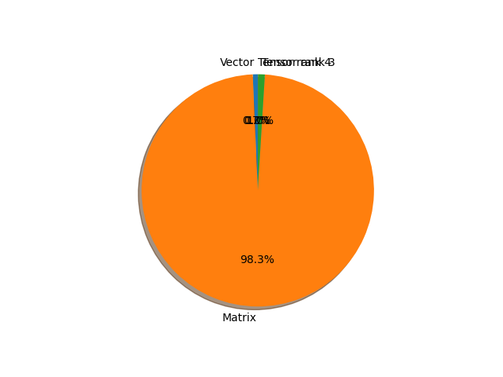

# shufflenet_v2_x1_5 parameter information

**Number of layers: [ 170 ]**

**Number of parameters: [ 3.50M ]**

**Proportional of each form** (%)

| Vector | Matrix | Tensor rank 3 | Tensor rank 4 | 
|  --- | --- | --- | --- |
| 66.47 | 21.76 | 11.18 | 0.59 | 

**Proportional of parameters by form** (%)

| Vector | Matrix | Tensor rank 3 | Tensor rank 4 | 
|  --- | --- | --- | --- |
| 0.70 | 98.33 | 0.96 | 0.02 | 

**Layer information**

| Name | Shape | Squeezed shape | Number of parameters | Form |
| --- | --- | --- | --- | --- |
| conv1.0.weight | (24, 3, 3, 3) | (24, 3, 3, 3) | 648 | Tensor rank 4 |
| conv1.1.weight | (24,) | (24,) | 24 | Vector |
| conv1.1.bias | (24,) | (24,) | 24 | Vector |
| stage2.0.branch1.0.weight | (24, 1, 3, 3) | (24, 3, 3) | 216 | Tensor rank 3 |
| stage2.0.branch1.1.weight | (24,) | (24,) | 24 | Vector |
| stage2.0.branch1.1.bias | (24,) | (24,) | 24 | Vector |
| stage2.0.branch1.2.weight | (88, 24, 1, 1) | (88, 24) | 2112 | Matrix |
| stage2.0.branch1.3.weight | (88,) | (88,) | 88 | Vector |
| stage2.0.branch1.3.bias | (88,) | (88,) | 88 | Vector |
| stage2.0.branch2.0.weight | (88, 24, 1, 1) | (88, 24) | 2112 | Matrix |
| stage2.0.branch2.1.weight | (88,) | (88,) | 88 | Vector |
| stage2.0.branch2.1.bias | (88,) | (88,) | 88 | Vector |
| stage2.0.branch2.3.weight | (88, 1, 3, 3) | (88, 3, 3) | 792 | Tensor rank 3 |
| stage2.0.branch2.4.weight | (88,) | (88,) | 88 | Vector |
| stage2.0.branch2.4.bias | (88,) | (88,) | 88 | Vector |
| stage2.0.branch2.5.weight | (88, 88, 1, 1) | (88, 88) | 7744 | Matrix |
| stage2.0.branch2.6.weight | (88,) | (88,) | 88 | Vector |
| stage2.0.branch2.6.bias | (88,) | (88,) | 88 | Vector |
| stage2.1.branch2.0.weight | (88, 88, 1, 1) | (88, 88) | 7744 | Matrix |
| stage2.1.branch2.1.weight | (88,) | (88,) | 88 | Vector |
| stage2.1.branch2.1.bias | (88,) | (88,) | 88 | Vector |
| stage2.1.branch2.3.weight | (88, 1, 3, 3) | (88, 3, 3) | 792 | Tensor rank 3 |
| stage2.1.branch2.4.weight | (88,) | (88,) | 88 | Vector |
| stage2.1.branch2.4.bias | (88,) | (88,) | 88 | Vector |
| stage2.1.branch2.5.weight | (88, 88, 1, 1) | (88, 88) | 7744 | Matrix |
| stage2.1.branch2.6.weight | (88,) | (88,) | 88 | Vector |
| stage2.1.branch2.6.bias | (88,) | (88,) | 88 | Vector |
| stage2.2.branch2.0.weight | (88, 88, 1, 1) | (88, 88) | 7744 | Matrix |
| stage2.2.branch2.1.weight | (88,) | (88,) | 88 | Vector |
| stage2.2.branch2.1.bias | (88,) | (88,) | 88 | Vector |
| stage2.2.branch2.3.weight | (88, 1, 3, 3) | (88, 3, 3) | 792 | Tensor rank 3 |
| stage2.2.branch2.4.weight | (88,) | (88,) | 88 | Vector |
| stage2.2.branch2.4.bias | (88,) | (88,) | 88 | Vector |
| stage2.2.branch2.5.weight | (88, 88, 1, 1) | (88, 88) | 7744 | Matrix |
| stage2.2.branch2.6.weight | (88,) | (88,) | 88 | Vector |
| stage2.2.branch2.6.bias | (88,) | (88,) | 88 | Vector |
| stage2.3.branch2.0.weight | (88, 88, 1, 1) | (88, 88) | 7744 | Matrix |
| stage2.3.branch2.1.weight | (88,) | (88,) | 88 | Vector |
| stage2.3.branch2.1.bias | (88,) | (88,) | 88 | Vector |
| stage2.3.branch2.3.weight | (88, 1, 3, 3) | (88, 3, 3) | 792 | Tensor rank 3 |
| stage2.3.branch2.4.weight | (88,) | (88,) | 88 | Vector |
| stage2.3.branch2.4.bias | (88,) | (88,) | 88 | Vector |
| stage2.3.branch2.5.weight | (88, 88, 1, 1) | (88, 88) | 7744 | Matrix |
| stage2.3.branch2.6.weight | (88,) | (88,) | 88 | Vector |
| stage2.3.branch2.6.bias | (88,) | (88,) | 88 | Vector |
| stage3.0.branch1.0.weight | (176, 1, 3, 3) | (176, 3, 3) | 1584 | Tensor rank 3 |
| stage3.0.branch1.1.weight | (176,) | (176,) | 176 | Vector |
| stage3.0.branch1.1.bias | (176,) | (176,) | 176 | Vector |
| stage3.0.branch1.2.weight | (176, 176, 1, 1) | (176, 176) | 30976 | Matrix |
| stage3.0.branch1.3.weight | (176,) | (176,) | 176 | Vector |
| stage3.0.branch1.3.bias | (176,) | (176,) | 176 | Vector |
| stage3.0.branch2.0.weight | (176, 176, 1, 1) | (176, 176) | 30976 | Matrix |
| stage3.0.branch2.1.weight | (176,) | (176,) | 176 | Vector |
| stage3.0.branch2.1.bias | (176,) | (176,) | 176 | Vector |
| stage3.0.branch2.3.weight | (176, 1, 3, 3) | (176, 3, 3) | 1584 | Tensor rank 3 |
| stage3.0.branch2.4.weight | (176,) | (176,) | 176 | Vector |
| stage3.0.branch2.4.bias | (176,) | (176,) | 176 | Vector |
| stage3.0.branch2.5.weight | (176, 176, 1, 1) | (176, 176) | 30976 | Matrix |
| stage3.0.branch2.6.weight | (176,) | (176,) | 176 | Vector |
| stage3.0.branch2.6.bias | (176,) | (176,) | 176 | Vector |
| stage3.1.branch2.0.weight | (176, 176, 1, 1) | (176, 176) | 30976 | Matrix |
| stage3.1.branch2.1.weight | (176,) | (176,) | 176 | Vector |
| stage3.1.branch2.1.bias | (176,) | (176,) | 176 | Vector |
| stage3.1.branch2.3.weight | (176, 1, 3, 3) | (176, 3, 3) | 1584 | Tensor rank 3 |
| stage3.1.branch2.4.weight | (176,) | (176,) | 176 | Vector |
| stage3.1.branch2.4.bias | (176,) | (176,) | 176 | Vector |
| stage3.1.branch2.5.weight | (176, 176, 1, 1) | (176, 176) | 30976 | Matrix |
| stage3.1.branch2.6.weight | (176,) | (176,) | 176 | Vector |
| stage3.1.branch2.6.bias | (176,) | (176,) | 176 | Vector |
| stage3.2.branch2.0.weight | (176, 176, 1, 1) | (176, 176) | 30976 | Matrix |
| stage3.2.branch2.1.weight | (176,) | (176,) | 176 | Vector |
| stage3.2.branch2.1.bias | (176,) | (176,) | 176 | Vector |
| stage3.2.branch2.3.weight | (176, 1, 3, 3) | (176, 3, 3) | 1584 | Tensor rank 3 |
| stage3.2.branch2.4.weight | (176,) | (176,) | 176 | Vector |
| stage3.2.branch2.4.bias | (176,) | (176,) | 176 | Vector |
| stage3.2.branch2.5.weight | (176, 176, 1, 1) | (176, 176) | 30976 | Matrix |
| stage3.2.branch2.6.weight | (176,) | (176,) | 176 | Vector |
| stage3.2.branch2.6.bias | (176,) | (176,) | 176 | Vector |
| stage3.3.branch2.0.weight | (176, 176, 1, 1) | (176, 176) | 30976 | Matrix |
| stage3.3.branch2.1.weight | (176,) | (176,) | 176 | Vector |
| stage3.3.branch2.1.bias | (176,) | (176,) | 176 | Vector |
| stage3.3.branch2.3.weight | (176, 1, 3, 3) | (176, 3, 3) | 1584 | Tensor rank 3 |
| stage3.3.branch2.4.weight | (176,) | (176,) | 176 | Vector |
| stage3.3.branch2.4.bias | (176,) | (176,) | 176 | Vector |
| stage3.3.branch2.5.weight | (176, 176, 1, 1) | (176, 176) | 30976 | Matrix |
| stage3.3.branch2.6.weight | (176,) | (176,) | 176 | Vector |
| stage3.3.branch2.6.bias | (176,) | (176,) | 176 | Vector |
| stage3.4.branch2.0.weight | (176, 176, 1, 1) | (176, 176) | 30976 | Matrix |
| stage3.4.branch2.1.weight | (176,) | (176,) | 176 | Vector |
| stage3.4.branch2.1.bias | (176,) | (176,) | 176 | Vector |
| stage3.4.branch2.3.weight | (176, 1, 3, 3) | (176, 3, 3) | 1584 | Tensor rank 3 |
| stage3.4.branch2.4.weight | (176,) | (176,) | 176 | Vector |
| stage3.4.branch2.4.bias | (176,) | (176,) | 176 | Vector |
| stage3.4.branch2.5.weight | (176, 176, 1, 1) | (176, 176) | 30976 | Matrix |
| stage3.4.branch2.6.weight | (176,) | (176,) | 176 | Vector |
| stage3.4.branch2.6.bias | (176,) | (176,) | 176 | Vector |
| stage3.5.branch2.0.weight | (176, 176, 1, 1) | (176, 176) | 30976 | Matrix |
| stage3.5.branch2.1.weight | (176,) | (176,) | 176 | Vector |
| stage3.5.branch2.1.bias | (176,) | (176,) | 176 | Vector |
| stage3.5.branch2.3.weight | (176, 1, 3, 3) | (176, 3, 3) | 1584 | Tensor rank 3 |
| stage3.5.branch2.4.weight | (176,) | (176,) | 176 | Vector |
| stage3.5.branch2.4.bias | (176,) | (176,) | 176 | Vector |
| stage3.5.branch2.5.weight | (176, 176, 1, 1) | (176, 176) | 30976 | Matrix |
| stage3.5.branch2.6.weight | (176,) | (176,) | 176 | Vector |
| stage3.5.branch2.6.bias | (176,) | (176,) | 176 | Vector |
| stage3.6.branch2.0.weight | (176, 176, 1, 1) | (176, 176) | 30976 | Matrix |
| stage3.6.branch2.1.weight | (176,) | (176,) | 176 | Vector |
| stage3.6.branch2.1.bias | (176,) | (176,) | 176 | Vector |
| stage3.6.branch2.3.weight | (176, 1, 3, 3) | (176, 3, 3) | 1584 | Tensor rank 3 |
| stage3.6.branch2.4.weight | (176,) | (176,) | 176 | Vector |
| stage3.6.branch2.4.bias | (176,) | (176,) | 176 | Vector |
| stage3.6.branch2.5.weight | (176, 176, 1, 1) | (176, 176) | 30976 | Matrix |
| stage3.6.branch2.6.weight | (176,) | (176,) | 176 | Vector |
| stage3.6.branch2.6.bias | (176,) | (176,) | 176 | Vector |
| stage3.7.branch2.0.weight | (176, 176, 1, 1) | (176, 176) | 30976 | Matrix |
| stage3.7.branch2.1.weight | (176,) | (176,) | 176 | Vector |
| stage3.7.branch2.1.bias | (176,) | (176,) | 176 | Vector |
| stage3.7.branch2.3.weight | (176, 1, 3, 3) | (176, 3, 3) | 1584 | Tensor rank 3 |
| stage3.7.branch2.4.weight | (176,) | (176,) | 176 | Vector |
| stage3.7.branch2.4.bias | (176,) | (176,) | 176 | Vector |
| stage3.7.branch2.5.weight | (176, 176, 1, 1) | (176, 176) | 30976 | Matrix |
| stage3.7.branch2.6.weight | (176,) | (176,) | 176 | Vector |
| stage3.7.branch2.6.bias | (176,) | (176,) | 176 | Vector |
| stage4.0.branch1.0.weight | (352, 1, 3, 3) | (352, 3, 3) | 3168 | Tensor rank 3 |
| stage4.0.branch1.1.weight | (352,) | (352,) | 352 | Vector |
| stage4.0.branch1.1.bias | (352,) | (352,) | 352 | Vector |
| stage4.0.branch1.2.weight | (352, 352, 1, 1) | (352, 352) | 123904 | Matrix |
| stage4.0.branch1.3.weight | (352,) | (352,) | 352 | Vector |
| stage4.0.branch1.3.bias | (352,) | (352,) | 352 | Vector |
| stage4.0.branch2.0.weight | (352, 352, 1, 1) | (352, 352) | 123904 | Matrix |
| stage4.0.branch2.1.weight | (352,) | (352,) | 352 | Vector |
| stage4.0.branch2.1.bias | (352,) | (352,) | 352 | Vector |
| stage4.0.branch2.3.weight | (352, 1, 3, 3) | (352, 3, 3) | 3168 | Tensor rank 3 |
| stage4.0.branch2.4.weight | (352,) | (352,) | 352 | Vector |
| stage4.0.branch2.4.bias | (352,) | (352,) | 352 | Vector |
| stage4.0.branch2.5.weight | (352, 352, 1, 1) | (352, 352) | 123904 | Matrix |
| stage4.0.branch2.6.weight | (352,) | (352,) | 352 | Vector |
| stage4.0.branch2.6.bias | (352,) | (352,) | 352 | Vector |
| stage4.1.branch2.0.weight | (352, 352, 1, 1) | (352, 352) | 123904 | Matrix |
| stage4.1.branch2.1.weight | (352,) | (352,) | 352 | Vector |
| stage4.1.branch2.1.bias | (352,) | (352,) | 352 | Vector |
| stage4.1.branch2.3.weight | (352, 1, 3, 3) | (352, 3, 3) | 3168 | Tensor rank 3 |
| stage4.1.branch2.4.weight | (352,) | (352,) | 352 | Vector |
| stage4.1.branch2.4.bias | (352,) | (352,) | 352 | Vector |
| stage4.1.branch2.5.weight | (352, 352, 1, 1) | (352, 352) | 123904 | Matrix |
| stage4.1.branch2.6.weight | (352,) | (352,) | 352 | Vector |
| stage4.1.branch2.6.bias | (352,) | (352,) | 352 | Vector |
| stage4.2.branch2.0.weight | (352, 352, 1, 1) | (352, 352) | 123904 | Matrix |
| stage4.2.branch2.1.weight | (352,) | (352,) | 352 | Vector |
| stage4.2.branch2.1.bias | (352,) | (352,) | 352 | Vector |
| stage4.2.branch2.3.weight | (352, 1, 3, 3) | (352, 3, 3) | 3168 | Tensor rank 3 |
| stage4.2.branch2.4.weight | (352,) | (352,) | 352 | Vector |
| stage4.2.branch2.4.bias | (352,) | (352,) | 352 | Vector |
| stage4.2.branch2.5.weight | (352, 352, 1, 1) | (352, 352) | 123904 | Matrix |
| stage4.2.branch2.6.weight | (352,) | (352,) | 352 | Vector |
| stage4.2.branch2.6.bias | (352,) | (352,) | 352 | Vector |
| stage4.3.branch2.0.weight | (352, 352, 1, 1) | (352, 352) | 123904 | Matrix |
| stage4.3.branch2.1.weight | (352,) | (352,) | 352 | Vector |
| stage4.3.branch2.1.bias | (352,) | (352,) | 352 | Vector |
| stage4.3.branch2.3.weight | (352, 1, 3, 3) | (352, 3, 3) | 3168 | Tensor rank 3 |
| stage4.3.branch2.4.weight | (352,) | (352,) | 352 | Vector |
| stage4.3.branch2.4.bias | (352,) | (352,) | 352 | Vector |
| stage4.3.branch2.5.weight | (352, 352, 1, 1) | (352, 352) | 123904 | Matrix |
| stage4.3.branch2.6.weight | (352,) | (352,) | 352 | Vector |
| stage4.3.branch2.6.bias | (352,) | (352,) | 352 | Vector |
| conv5.0.weight | (1024, 704, 1, 1) | (1024, 704) | 720896 | Matrix |
| conv5.1.weight | (1024,) | (1024,) | 1024 | Vector |
| conv5.1.bias | (1024,) | (1024,) | 1024 | Vector |
| fc.weight | (1000, 1024) | (1000, 1024) | 1024000 | Matrix |
| fc.bias | (1000,) | (1000,) | 1000 | Vector |

