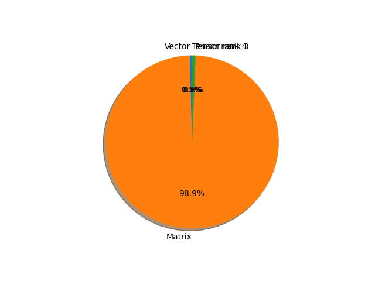

# shufflenet_v2_x2_0 parameter information

**Number of layers: [ 170 ]**

**Number of parameters: [ 7.39M ]**

**Proportional of each form** (%)

| Vector | Matrix | Tensor rank 3 | Tensor rank 4 | 
|  --- | --- | --- | --- |
| 66.47 | 21.76 | 11.18 | 0.59 | 

**Proportional of parameters by form** (%)

| Vector | Matrix | Tensor rank 3 | Tensor rank 4 | 
|  --- | --- | --- | --- |
| 0.47 | 98.90 | 0.63 | 0.01 | 

**Layer information**

| Name | Shape | Squeezed shape | Number of parameters | Form |
| --- | --- | --- | --- | --- |
| conv1.0.weight | (24, 3, 3, 3) | (24, 3, 3, 3) | 648 | Tensor rank 4 |
| conv1.1.weight | (24,) | (24,) | 24 | Vector |
| conv1.1.bias | (24,) | (24,) | 24 | Vector |
| stage2.0.branch1.0.weight | (24, 1, 3, 3) | (24, 3, 3) | 216 | Tensor rank 3 |
| stage2.0.branch1.1.weight | (24,) | (24,) | 24 | Vector |
| stage2.0.branch1.1.bias | (24,) | (24,) | 24 | Vector |
| stage2.0.branch1.2.weight | (122, 24, 1, 1) | (122, 24) | 2928 | Matrix |
| stage2.0.branch1.3.weight | (122,) | (122,) | 122 | Vector |
| stage2.0.branch1.3.bias | (122,) | (122,) | 122 | Vector |
| stage2.0.branch2.0.weight | (122, 24, 1, 1) | (122, 24) | 2928 | Matrix |
| stage2.0.branch2.1.weight | (122,) | (122,) | 122 | Vector |
| stage2.0.branch2.1.bias | (122,) | (122,) | 122 | Vector |
| stage2.0.branch2.3.weight | (122, 1, 3, 3) | (122, 3, 3) | 1098 | Tensor rank 3 |
| stage2.0.branch2.4.weight | (122,) | (122,) | 122 | Vector |
| stage2.0.branch2.4.bias | (122,) | (122,) | 122 | Vector |
| stage2.0.branch2.5.weight | (122, 122, 1, 1) | (122, 122) | 14884 | Matrix |
| stage2.0.branch2.6.weight | (122,) | (122,) | 122 | Vector |
| stage2.0.branch2.6.bias | (122,) | (122,) | 122 | Vector |
| stage2.1.branch2.0.weight | (122, 122, 1, 1) | (122, 122) | 14884 | Matrix |
| stage2.1.branch2.1.weight | (122,) | (122,) | 122 | Vector |
| stage2.1.branch2.1.bias | (122,) | (122,) | 122 | Vector |
| stage2.1.branch2.3.weight | (122, 1, 3, 3) | (122, 3, 3) | 1098 | Tensor rank 3 |
| stage2.1.branch2.4.weight | (122,) | (122,) | 122 | Vector |
| stage2.1.branch2.4.bias | (122,) | (122,) | 122 | Vector |
| stage2.1.branch2.5.weight | (122, 122, 1, 1) | (122, 122) | 14884 | Matrix |
| stage2.1.branch2.6.weight | (122,) | (122,) | 122 | Vector |
| stage2.1.branch2.6.bias | (122,) | (122,) | 122 | Vector |
| stage2.2.branch2.0.weight | (122, 122, 1, 1) | (122, 122) | 14884 | Matrix |
| stage2.2.branch2.1.weight | (122,) | (122,) | 122 | Vector |
| stage2.2.branch2.1.bias | (122,) | (122,) | 122 | Vector |
| stage2.2.branch2.3.weight | (122, 1, 3, 3) | (122, 3, 3) | 1098 | Tensor rank 3 |
| stage2.2.branch2.4.weight | (122,) | (122,) | 122 | Vector |
| stage2.2.branch2.4.bias | (122,) | (122,) | 122 | Vector |
| stage2.2.branch2.5.weight | (122, 122, 1, 1) | (122, 122) | 14884 | Matrix |
| stage2.2.branch2.6.weight | (122,) | (122,) | 122 | Vector |
| stage2.2.branch2.6.bias | (122,) | (122,) | 122 | Vector |
| stage2.3.branch2.0.weight | (122, 122, 1, 1) | (122, 122) | 14884 | Matrix |
| stage2.3.branch2.1.weight | (122,) | (122,) | 122 | Vector |
| stage2.3.branch2.1.bias | (122,) | (122,) | 122 | Vector |
| stage2.3.branch2.3.weight | (122, 1, 3, 3) | (122, 3, 3) | 1098 | Tensor rank 3 |
| stage2.3.branch2.4.weight | (122,) | (122,) | 122 | Vector |
| stage2.3.branch2.4.bias | (122,) | (122,) | 122 | Vector |
| stage2.3.branch2.5.weight | (122, 122, 1, 1) | (122, 122) | 14884 | Matrix |
| stage2.3.branch2.6.weight | (122,) | (122,) | 122 | Vector |
| stage2.3.branch2.6.bias | (122,) | (122,) | 122 | Vector |
| stage3.0.branch1.0.weight | (244, 1, 3, 3) | (244, 3, 3) | 2196 | Tensor rank 3 |
| stage3.0.branch1.1.weight | (244,) | (244,) | 244 | Vector |
| stage3.0.branch1.1.bias | (244,) | (244,) | 244 | Vector |
| stage3.0.branch1.2.weight | (244, 244, 1, 1) | (244, 244) | 59536 | Matrix |
| stage3.0.branch1.3.weight | (244,) | (244,) | 244 | Vector |
| stage3.0.branch1.3.bias | (244,) | (244,) | 244 | Vector |
| stage3.0.branch2.0.weight | (244, 244, 1, 1) | (244, 244) | 59536 | Matrix |
| stage3.0.branch2.1.weight | (244,) | (244,) | 244 | Vector |
| stage3.0.branch2.1.bias | (244,) | (244,) | 244 | Vector |
| stage3.0.branch2.3.weight | (244, 1, 3, 3) | (244, 3, 3) | 2196 | Tensor rank 3 |
| stage3.0.branch2.4.weight | (244,) | (244,) | 244 | Vector |
| stage3.0.branch2.4.bias | (244,) | (244,) | 244 | Vector |
| stage3.0.branch2.5.weight | (244, 244, 1, 1) | (244, 244) | 59536 | Matrix |
| stage3.0.branch2.6.weight | (244,) | (244,) | 244 | Vector |
| stage3.0.branch2.6.bias | (244,) | (244,) | 244 | Vector |
| stage3.1.branch2.0.weight | (244, 244, 1, 1) | (244, 244) | 59536 | Matrix |
| stage3.1.branch2.1.weight | (244,) | (244,) | 244 | Vector |
| stage3.1.branch2.1.bias | (244,) | (244,) | 244 | Vector |
| stage3.1.branch2.3.weight | (244, 1, 3, 3) | (244, 3, 3) | 2196 | Tensor rank 3 |
| stage3.1.branch2.4.weight | (244,) | (244,) | 244 | Vector |
| stage3.1.branch2.4.bias | (244,) | (244,) | 244 | Vector |
| stage3.1.branch2.5.weight | (244, 244, 1, 1) | (244, 244) | 59536 | Matrix |
| stage3.1.branch2.6.weight | (244,) | (244,) | 244 | Vector |
| stage3.1.branch2.6.bias | (244,) | (244,) | 244 | Vector |
| stage3.2.branch2.0.weight | (244, 244, 1, 1) | (244, 244) | 59536 | Matrix |
| stage3.2.branch2.1.weight | (244,) | (244,) | 244 | Vector |
| stage3.2.branch2.1.bias | (244,) | (244,) | 244 | Vector |
| stage3.2.branch2.3.weight | (244, 1, 3, 3) | (244, 3, 3) | 2196 | Tensor rank 3 |
| stage3.2.branch2.4.weight | (244,) | (244,) | 244 | Vector |
| stage3.2.branch2.4.bias | (244,) | (244,) | 244 | Vector |
| stage3.2.branch2.5.weight | (244, 244, 1, 1) | (244, 244) | 59536 | Matrix |
| stage3.2.branch2.6.weight | (244,) | (244,) | 244 | Vector |
| stage3.2.branch2.6.bias | (244,) | (244,) | 244 | Vector |
| stage3.3.branch2.0.weight | (244, 244, 1, 1) | (244, 244) | 59536 | Matrix |
| stage3.3.branch2.1.weight | (244,) | (244,) | 244 | Vector |
| stage3.3.branch2.1.bias | (244,) | (244,) | 244 | Vector |
| stage3.3.branch2.3.weight | (244, 1, 3, 3) | (244, 3, 3) | 2196 | Tensor rank 3 |
| stage3.3.branch2.4.weight | (244,) | (244,) | 244 | Vector |
| stage3.3.branch2.4.bias | (244,) | (244,) | 244 | Vector |
| stage3.3.branch2.5.weight | (244, 244, 1, 1) | (244, 244) | 59536 | Matrix |
| stage3.3.branch2.6.weight | (244,) | (244,) | 244 | Vector |
| stage3.3.branch2.6.bias | (244,) | (244,) | 244 | Vector |
| stage3.4.branch2.0.weight | (244, 244, 1, 1) | (244, 244) | 59536 | Matrix |
| stage3.4.branch2.1.weight | (244,) | (244,) | 244 | Vector |
| stage3.4.branch2.1.bias | (244,) | (244,) | 244 | Vector |
| stage3.4.branch2.3.weight | (244, 1, 3, 3) | (244, 3, 3) | 2196 | Tensor rank 3 |
| stage3.4.branch2.4.weight | (244,) | (244,) | 244 | Vector |
| stage3.4.branch2.4.bias | (244,) | (244,) | 244 | Vector |
| stage3.4.branch2.5.weight | (244, 244, 1, 1) | (244, 244) | 59536 | Matrix |
| stage3.4.branch2.6.weight | (244,) | (244,) | 244 | Vector |
| stage3.4.branch2.6.bias | (244,) | (244,) | 244 | Vector |
| stage3.5.branch2.0.weight | (244, 244, 1, 1) | (244, 244) | 59536 | Matrix |
| stage3.5.branch2.1.weight | (244,) | (244,) | 244 | Vector |
| stage3.5.branch2.1.bias | (244,) | (244,) | 244 | Vector |
| stage3.5.branch2.3.weight | (244, 1, 3, 3) | (244, 3, 3) | 2196 | Tensor rank 3 |
| stage3.5.branch2.4.weight | (244,) | (244,) | 244 | Vector |
| stage3.5.branch2.4.bias | (244,) | (244,) | 244 | Vector |
| stage3.5.branch2.5.weight | (244, 244, 1, 1) | (244, 244) | 59536 | Matrix |
| stage3.5.branch2.6.weight | (244,) | (244,) | 244 | Vector |
| stage3.5.branch2.6.bias | (244,) | (244,) | 244 | Vector |
| stage3.6.branch2.0.weight | (244, 244, 1, 1) | (244, 244) | 59536 | Matrix |
| stage3.6.branch2.1.weight | (244,) | (244,) | 244 | Vector |
| stage3.6.branch2.1.bias | (244,) | (244,) | 244 | Vector |
| stage3.6.branch2.3.weight | (244, 1, 3, 3) | (244, 3, 3) | 2196 | Tensor rank 3 |
| stage3.6.branch2.4.weight | (244,) | (244,) | 244 | Vector |
| stage3.6.branch2.4.bias | (244,) | (244,) | 244 | Vector |
| stage3.6.branch2.5.weight | (244, 244, 1, 1) | (244, 244) | 59536 | Matrix |
| stage3.6.branch2.6.weight | (244,) | (244,) | 244 | Vector |
| stage3.6.branch2.6.bias | (244,) | (244,) | 244 | Vector |
| stage3.7.branch2.0.weight | (244, 244, 1, 1) | (244, 244) | 59536 | Matrix |
| stage3.7.branch2.1.weight | (244,) | (244,) | 244 | Vector |
| stage3.7.branch2.1.bias | (244,) | (244,) | 244 | Vector |
| stage3.7.branch2.3.weight | (244, 1, 3, 3) | (244, 3, 3) | 2196 | Tensor rank 3 |
| stage3.7.branch2.4.weight | (244,) | (244,) | 244 | Vector |
| stage3.7.branch2.4.bias | (244,) | (244,) | 244 | Vector |
| stage3.7.branch2.5.weight | (244, 244, 1, 1) | (244, 244) | 59536 | Matrix |
| stage3.7.branch2.6.weight | (244,) | (244,) | 244 | Vector |
| stage3.7.branch2.6.bias | (244,) | (244,) | 244 | Vector |
| stage4.0.branch1.0.weight | (488, 1, 3, 3) | (488, 3, 3) | 4392 | Tensor rank 3 |
| stage4.0.branch1.1.weight | (488,) | (488,) | 488 | Vector |
| stage4.0.branch1.1.bias | (488,) | (488,) | 488 | Vector |
| stage4.0.branch1.2.weight | (488, 488, 1, 1) | (488, 488) | 238144 | Matrix |
| stage4.0.branch1.3.weight | (488,) | (488,) | 488 | Vector |
| stage4.0.branch1.3.bias | (488,) | (488,) | 488 | Vector |
| stage4.0.branch2.0.weight | (488, 488, 1, 1) | (488, 488) | 238144 | Matrix |
| stage4.0.branch2.1.weight | (488,) | (488,) | 488 | Vector |
| stage4.0.branch2.1.bias | (488,) | (488,) | 488 | Vector |
| stage4.0.branch2.3.weight | (488, 1, 3, 3) | (488, 3, 3) | 4392 | Tensor rank 3 |
| stage4.0.branch2.4.weight | (488,) | (488,) | 488 | Vector |
| stage4.0.branch2.4.bias | (488,) | (488,) | 488 | Vector |
| stage4.0.branch2.5.weight | (488, 488, 1, 1) | (488, 488) | 238144 | Matrix |
| stage4.0.branch2.6.weight | (488,) | (488,) | 488 | Vector |
| stage4.0.branch2.6.bias | (488,) | (488,) | 488 | Vector |
| stage4.1.branch2.0.weight | (488, 488, 1, 1) | (488, 488) | 238144 | Matrix |
| stage4.1.branch2.1.weight | (488,) | (488,) | 488 | Vector |
| stage4.1.branch2.1.bias | (488,) | (488,) | 488 | Vector |
| stage4.1.branch2.3.weight | (488, 1, 3, 3) | (488, 3, 3) | 4392 | Tensor rank 3 |
| stage4.1.branch2.4.weight | (488,) | (488,) | 488 | Vector |
| stage4.1.branch2.4.bias | (488,) | (488,) | 488 | Vector |
| stage4.1.branch2.5.weight | (488, 488, 1, 1) | (488, 488) | 238144 | Matrix |
| stage4.1.branch2.6.weight | (488,) | (488,) | 488 | Vector |
| stage4.1.branch2.6.bias | (488,) | (488,) | 488 | Vector |
| stage4.2.branch2.0.weight | (488, 488, 1, 1) | (488, 488) | 238144 | Matrix |
| stage4.2.branch2.1.weight | (488,) | (488,) | 488 | Vector |
| stage4.2.branch2.1.bias | (488,) | (488,) | 488 | Vector |
| stage4.2.branch2.3.weight | (488, 1, 3, 3) | (488, 3, 3) | 4392 | Tensor rank 3 |
| stage4.2.branch2.4.weight | (488,) | (488,) | 488 | Vector |
| stage4.2.branch2.4.bias | (488,) | (488,) | 488 | Vector |
| stage4.2.branch2.5.weight | (488, 488, 1, 1) | (488, 488) | 238144 | Matrix |
| stage4.2.branch2.6.weight | (488,) | (488,) | 488 | Vector |
| stage4.2.branch2.6.bias | (488,) | (488,) | 488 | Vector |
| stage4.3.branch2.0.weight | (488, 488, 1, 1) | (488, 488) | 238144 | Matrix |
| stage4.3.branch2.1.weight | (488,) | (488,) | 488 | Vector |
| stage4.3.branch2.1.bias | (488,) | (488,) | 488 | Vector |
| stage4.3.branch2.3.weight | (488, 1, 3, 3) | (488, 3, 3) | 4392 | Tensor rank 3 |
| stage4.3.branch2.4.weight | (488,) | (488,) | 488 | Vector |
| stage4.3.branch2.4.bias | (488,) | (488,) | 488 | Vector |
| stage4.3.branch2.5.weight | (488, 488, 1, 1) | (488, 488) | 238144 | Matrix |
| stage4.3.branch2.6.weight | (488,) | (488,) | 488 | Vector |
| stage4.3.branch2.6.bias | (488,) | (488,) | 488 | Vector |
| conv5.0.weight | (2048, 976, 1, 1) | (2048, 976) | 1998848 | Matrix |
| conv5.1.weight | (2048,) | (2048,) | 2048 | Vector |
| conv5.1.bias | (2048,) | (2048,) | 2048 | Vector |
| fc.weight | (1000, 2048) | (1000, 2048) | 2048000 | Matrix |
| fc.bias | (1000,) | (1000,) | 1000 | Vector |

