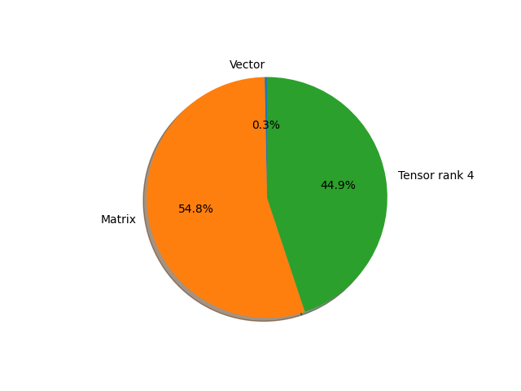

# squeezenet1_1 parameter information

**Number of layers: [ 52 ]**

**Number of parameters: [ 1.24M ]**

**Proportional of each form** (%)

| Vector | Matrix | Tensor rank 4 | 
|  --- | --- | --- |
| 50.00 | 32.69 | 17.31 | 
**Proportional of parameters by form** (%)

| Vector | Matrix | Tensor rank 4 | 
|  --- | --- | --- |
| 0.32 | 54.78 | 44.90 | 

**Layer information**

| Name | Shape | Squeezed shape | Number of parameters | Form |
| --- | --- | --- | --- | --- |
| features.0.weight | (64, 3, 3, 3) | (64, 3, 3, 3) | 1728 | Tensor rank 4 |
| features.0.bias | (64,) | (64,) | 64 | Vector |
| features.3.squeeze.weight | (16, 64, 1, 1) | (16, 64) | 1024 | Matrix |
| features.3.squeeze.bias | (16,) | (16,) | 16 | Vector |
| features.3.expand1x1.weight | (64, 16, 1, 1) | (64, 16) | 1024 | Matrix |
| features.3.expand1x1.bias | (64,) | (64,) | 64 | Vector |
| features.3.expand3x3.weight | (64, 16, 3, 3) | (64, 16, 3, 3) | 9216 | Tensor rank 4 |
| features.3.expand3x3.bias | (64,) | (64,) | 64 | Vector |
| features.4.squeeze.weight | (16, 128, 1, 1) | (16, 128) | 2048 | Matrix |
| features.4.squeeze.bias | (16,) | (16,) | 16 | Vector |
| features.4.expand1x1.weight | (64, 16, 1, 1) | (64, 16) | 1024 | Matrix |
| features.4.expand1x1.bias | (64,) | (64,) | 64 | Vector |
| features.4.expand3x3.weight | (64, 16, 3, 3) | (64, 16, 3, 3) | 9216 | Tensor rank 4 |
| features.4.expand3x3.bias | (64,) | (64,) | 64 | Vector |
| features.6.squeeze.weight | (32, 128, 1, 1) | (32, 128) | 4096 | Matrix |
| features.6.squeeze.bias | (32,) | (32,) | 32 | Vector |
| features.6.expand1x1.weight | (128, 32, 1, 1) | (128, 32) | 4096 | Matrix |
| features.6.expand1x1.bias | (128,) | (128,) | 128 | Vector |
| features.6.expand3x3.weight | (128, 32, 3, 3) | (128, 32, 3, 3) | 36864 | Tensor rank 4 |
| features.6.expand3x3.bias | (128,) | (128,) | 128 | Vector |
| features.7.squeeze.weight | (32, 256, 1, 1) | (32, 256) | 8192 | Matrix |
| features.7.squeeze.bias | (32,) | (32,) | 32 | Vector |
| features.7.expand1x1.weight | (128, 32, 1, 1) | (128, 32) | 4096 | Matrix |
| features.7.expand1x1.bias | (128,) | (128,) | 128 | Vector |
| features.7.expand3x3.weight | (128, 32, 3, 3) | (128, 32, 3, 3) | 36864 | Tensor rank 4 |
| features.7.expand3x3.bias | (128,) | (128,) | 128 | Vector |
| features.9.squeeze.weight | (48, 256, 1, 1) | (48, 256) | 12288 | Matrix |
| features.9.squeeze.bias | (48,) | (48,) | 48 | Vector |
| features.9.expand1x1.weight | (192, 48, 1, 1) | (192, 48) | 9216 | Matrix |
| features.9.expand1x1.bias | (192,) | (192,) | 192 | Vector |
| features.9.expand3x3.weight | (192, 48, 3, 3) | (192, 48, 3, 3) | 82944 | Tensor rank 4 |
| features.9.expand3x3.bias | (192,) | (192,) | 192 | Vector |
| features.10.squeeze.weight | (48, 384, 1, 1) | (48, 384) | 18432 | Matrix |
| features.10.squeeze.bias | (48,) | (48,) | 48 | Vector |
| features.10.expand1x1.weight | (192, 48, 1, 1) | (192, 48) | 9216 | Matrix |
| features.10.expand1x1.bias | (192,) | (192,) | 192 | Vector |
| features.10.expand3x3.weight | (192, 48, 3, 3) | (192, 48, 3, 3) | 82944 | Tensor rank 4 |
| features.10.expand3x3.bias | (192,) | (192,) | 192 | Vector |
| features.11.squeeze.weight | (64, 384, 1, 1) | (64, 384) | 24576 | Matrix |
| features.11.squeeze.bias | (64,) | (64,) | 64 | Vector |
| features.11.expand1x1.weight | (256, 64, 1, 1) | (256, 64) | 16384 | Matrix |
| features.11.expand1x1.bias | (256,) | (256,) | 256 | Vector |
| features.11.expand3x3.weight | (256, 64, 3, 3) | (256, 64, 3, 3) | 147456 | Tensor rank 4 |
| features.11.expand3x3.bias | (256,) | (256,) | 256 | Vector |
| features.12.squeeze.weight | (64, 512, 1, 1) | (64, 512) | 32768 | Matrix |
| features.12.squeeze.bias | (64,) | (64,) | 64 | Vector |
| features.12.expand1x1.weight | (256, 64, 1, 1) | (256, 64) | 16384 | Matrix |
| features.12.expand1x1.bias | (256,) | (256,) | 256 | Vector |
| features.12.expand3x3.weight | (256, 64, 3, 3) | (256, 64, 3, 3) | 147456 | Tensor rank 4 |
| features.12.expand3x3.bias | (256,) | (256,) | 256 | Vector |
| classifier.1.weight | (1000, 512, 1, 1) | (1000, 512) | 512000 | Matrix |
| classifier.1.bias | (1000,) | (1000,) | 1000 | Vector |

