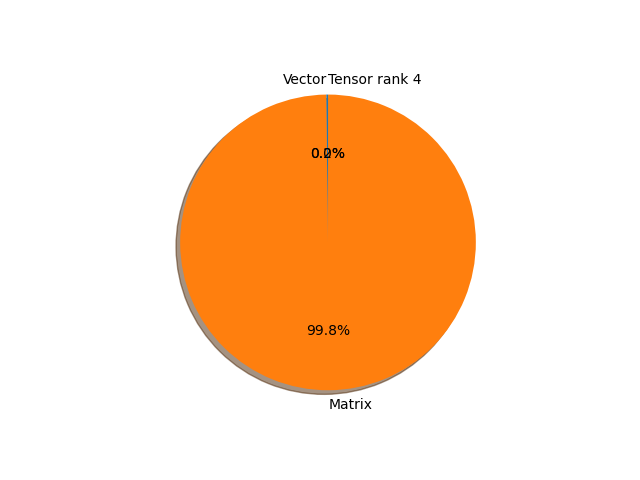

# swin_b parameter information

**Number of layers: [ 329 ]**

**Number of parameters: [ 87.77M ]**

**Proportional of each form** (%)

| Vector | Matrix | Tensor rank 4 | 
|  --- | --- | --- |
| 62.01 | 37.69 | 0.30 | 

**Proportional of parameters by form** (%)

| Vector | Matrix | Tensor rank 4 | 
|  --- | --- | --- |
| 0.19 | 99.80 | 0.01 | 

**Layer information**

| Name | Shape | Squeezed shape | Number of parameters | Form |
| --- | --- | --- | --- | --- |
| features.0.0.weight | (128, 3, 4, 4) | (128, 3, 4, 4) | 6144 | Tensor rank 4 |
| features.0.0.bias | (128,) | (128,) | 128 | Vector |
| features.0.2.weight | (128,) | (128,) | 128 | Vector |
| features.0.2.bias | (128,) | (128,) | 128 | Vector |
| features.1.0.norm1.weight | (128,) | (128,) | 128 | Vector |
| features.1.0.norm1.bias | (128,) | (128,) | 128 | Vector |
| features.1.0.attn.relative_position_bias_table | (169, 4) | (169, 4) | 676 | Matrix |
| features.1.0.attn.qkv.weight | (384, 128) | (384, 128) | 49152 | Matrix |
| features.1.0.attn.qkv.bias | (384,) | (384,) | 384 | Vector |
| features.1.0.attn.proj.weight | (128, 128) | (128, 128) | 16384 | Matrix |
| features.1.0.attn.proj.bias | (128,) | (128,) | 128 | Vector |
| features.1.0.norm2.weight | (128,) | (128,) | 128 | Vector |
| features.1.0.norm2.bias | (128,) | (128,) | 128 | Vector |
| features.1.0.mlp.0.weight | (512, 128) | (512, 128) | 65536 | Matrix |
| features.1.0.mlp.0.bias | (512,) | (512,) | 512 | Vector |
| features.1.0.mlp.3.weight | (128, 512) | (128, 512) | 65536 | Matrix |
| features.1.0.mlp.3.bias | (128,) | (128,) | 128 | Vector |
| features.1.1.norm1.weight | (128,) | (128,) | 128 | Vector |
| features.1.1.norm1.bias | (128,) | (128,) | 128 | Vector |
| features.1.1.attn.relative_position_bias_table | (169, 4) | (169, 4) | 676 | Matrix |
| features.1.1.attn.qkv.weight | (384, 128) | (384, 128) | 49152 | Matrix |
| features.1.1.attn.qkv.bias | (384,) | (384,) | 384 | Vector |
| features.1.1.attn.proj.weight | (128, 128) | (128, 128) | 16384 | Matrix |
| features.1.1.attn.proj.bias | (128,) | (128,) | 128 | Vector |
| features.1.1.norm2.weight | (128,) | (128,) | 128 | Vector |
| features.1.1.norm2.bias | (128,) | (128,) | 128 | Vector |
| features.1.1.mlp.0.weight | (512, 128) | (512, 128) | 65536 | Matrix |
| features.1.1.mlp.0.bias | (512,) | (512,) | 512 | Vector |
| features.1.1.mlp.3.weight | (128, 512) | (128, 512) | 65536 | Matrix |
| features.1.1.mlp.3.bias | (128,) | (128,) | 128 | Vector |
| features.2.reduction.weight | (256, 512) | (256, 512) | 131072 | Matrix |
| features.2.norm.weight | (512,) | (512,) | 512 | Vector |
| features.2.norm.bias | (512,) | (512,) | 512 | Vector |
| features.3.0.norm1.weight | (256,) | (256,) | 256 | Vector |
| features.3.0.norm1.bias | (256,) | (256,) | 256 | Vector |
| features.3.0.attn.relative_position_bias_table | (169, 8) | (169, 8) | 1352 | Matrix |
| features.3.0.attn.qkv.weight | (768, 256) | (768, 256) | 196608 | Matrix |
| features.3.0.attn.qkv.bias | (768,) | (768,) | 768 | Vector |
| features.3.0.attn.proj.weight | (256, 256) | (256, 256) | 65536 | Matrix |
| features.3.0.attn.proj.bias | (256,) | (256,) | 256 | Vector |
| features.3.0.norm2.weight | (256,) | (256,) | 256 | Vector |
| features.3.0.norm2.bias | (256,) | (256,) | 256 | Vector |
| features.3.0.mlp.0.weight | (1024, 256) | (1024, 256) | 262144 | Matrix |
| features.3.0.mlp.0.bias | (1024,) | (1024,) | 1024 | Vector |
| features.3.0.mlp.3.weight | (256, 1024) | (256, 1024) | 262144 | Matrix |
| features.3.0.mlp.3.bias | (256,) | (256,) | 256 | Vector |
| features.3.1.norm1.weight | (256,) | (256,) | 256 | Vector |
| features.3.1.norm1.bias | (256,) | (256,) | 256 | Vector |
| features.3.1.attn.relative_position_bias_table | (169, 8) | (169, 8) | 1352 | Matrix |
| features.3.1.attn.qkv.weight | (768, 256) | (768, 256) | 196608 | Matrix |
| features.3.1.attn.qkv.bias | (768,) | (768,) | 768 | Vector |
| features.3.1.attn.proj.weight | (256, 256) | (256, 256) | 65536 | Matrix |
| features.3.1.attn.proj.bias | (256,) | (256,) | 256 | Vector |
| features.3.1.norm2.weight | (256,) | (256,) | 256 | Vector |
| features.3.1.norm2.bias | (256,) | (256,) | 256 | Vector |
| features.3.1.mlp.0.weight | (1024, 256) | (1024, 256) | 262144 | Matrix |
| features.3.1.mlp.0.bias | (1024,) | (1024,) | 1024 | Vector |
| features.3.1.mlp.3.weight | (256, 1024) | (256, 1024) | 262144 | Matrix |
| features.3.1.mlp.3.bias | (256,) | (256,) | 256 | Vector |
| features.4.reduction.weight | (512, 1024) | (512, 1024) | 524288 | Matrix |
| features.4.norm.weight | (1024,) | (1024,) | 1024 | Vector |
| features.4.norm.bias | (1024,) | (1024,) | 1024 | Vector |
| features.5.0.norm1.weight | (512,) | (512,) | 512 | Vector |
| features.5.0.norm1.bias | (512,) | (512,) | 512 | Vector |
| features.5.0.attn.relative_position_bias_table | (169, 16) | (169, 16) | 2704 | Matrix |
| features.5.0.attn.qkv.weight | (1536, 512) | (1536, 512) | 786432 | Matrix |
| features.5.0.attn.qkv.bias | (1536,) | (1536,) | 1536 | Vector |
| features.5.0.attn.proj.weight | (512, 512) | (512, 512) | 262144 | Matrix |
| features.5.0.attn.proj.bias | (512,) | (512,) | 512 | Vector |
| features.5.0.norm2.weight | (512,) | (512,) | 512 | Vector |
| features.5.0.norm2.bias | (512,) | (512,) | 512 | Vector |
| features.5.0.mlp.0.weight | (2048, 512) | (2048, 512) | 1048576 | Matrix |
| features.5.0.mlp.0.bias | (2048,) | (2048,) | 2048 | Vector |
| features.5.0.mlp.3.weight | (512, 2048) | (512, 2048) | 1048576 | Matrix |
| features.5.0.mlp.3.bias | (512,) | (512,) | 512 | Vector |
| features.5.1.norm1.weight | (512,) | (512,) | 512 | Vector |
| features.5.1.norm1.bias | (512,) | (512,) | 512 | Vector |
| features.5.1.attn.relative_position_bias_table | (169, 16) | (169, 16) | 2704 | Matrix |
| features.5.1.attn.qkv.weight | (1536, 512) | (1536, 512) | 786432 | Matrix |
| features.5.1.attn.qkv.bias | (1536,) | (1536,) | 1536 | Vector |
| features.5.1.attn.proj.weight | (512, 512) | (512, 512) | 262144 | Matrix |
| features.5.1.attn.proj.bias | (512,) | (512,) | 512 | Vector |
| features.5.1.norm2.weight | (512,) | (512,) | 512 | Vector |
| features.5.1.norm2.bias | (512,) | (512,) | 512 | Vector |
| features.5.1.mlp.0.weight | (2048, 512) | (2048, 512) | 1048576 | Matrix |
| features.5.1.mlp.0.bias | (2048,) | (2048,) | 2048 | Vector |
| features.5.1.mlp.3.weight | (512, 2048) | (512, 2048) | 1048576 | Matrix |
| features.5.1.mlp.3.bias | (512,) | (512,) | 512 | Vector |
| features.5.2.norm1.weight | (512,) | (512,) | 512 | Vector |
| features.5.2.norm1.bias | (512,) | (512,) | 512 | Vector |
| features.5.2.attn.relative_position_bias_table | (169, 16) | (169, 16) | 2704 | Matrix |
| features.5.2.attn.qkv.weight | (1536, 512) | (1536, 512) | 786432 | Matrix |
| features.5.2.attn.qkv.bias | (1536,) | (1536,) | 1536 | Vector |
| features.5.2.attn.proj.weight | (512, 512) | (512, 512) | 262144 | Matrix |
| features.5.2.attn.proj.bias | (512,) | (512,) | 512 | Vector |
| features.5.2.norm2.weight | (512,) | (512,) | 512 | Vector |
| features.5.2.norm2.bias | (512,) | (512,) | 512 | Vector |
| features.5.2.mlp.0.weight | (2048, 512) | (2048, 512) | 1048576 | Matrix |
| features.5.2.mlp.0.bias | (2048,) | (2048,) | 2048 | Vector |
| features.5.2.mlp.3.weight | (512, 2048) | (512, 2048) | 1048576 | Matrix |
| features.5.2.mlp.3.bias | (512,) | (512,) | 512 | Vector |
| features.5.3.norm1.weight | (512,) | (512,) | 512 | Vector |
| features.5.3.norm1.bias | (512,) | (512,) | 512 | Vector |
| features.5.3.attn.relative_position_bias_table | (169, 16) | (169, 16) | 2704 | Matrix |
| features.5.3.attn.qkv.weight | (1536, 512) | (1536, 512) | 786432 | Matrix |
| features.5.3.attn.qkv.bias | (1536,) | (1536,) | 1536 | Vector |
| features.5.3.attn.proj.weight | (512, 512) | (512, 512) | 262144 | Matrix |
| features.5.3.attn.proj.bias | (512,) | (512,) | 512 | Vector |
| features.5.3.norm2.weight | (512,) | (512,) | 512 | Vector |
| features.5.3.norm2.bias | (512,) | (512,) | 512 | Vector |
| features.5.3.mlp.0.weight | (2048, 512) | (2048, 512) | 1048576 | Matrix |
| features.5.3.mlp.0.bias | (2048,) | (2048,) | 2048 | Vector |
| features.5.3.mlp.3.weight | (512, 2048) | (512, 2048) | 1048576 | Matrix |
| features.5.3.mlp.3.bias | (512,) | (512,) | 512 | Vector |
| features.5.4.norm1.weight | (512,) | (512,) | 512 | Vector |
| features.5.4.norm1.bias | (512,) | (512,) | 512 | Vector |
| features.5.4.attn.relative_position_bias_table | (169, 16) | (169, 16) | 2704 | Matrix |
| features.5.4.attn.qkv.weight | (1536, 512) | (1536, 512) | 786432 | Matrix |
| features.5.4.attn.qkv.bias | (1536,) | (1536,) | 1536 | Vector |
| features.5.4.attn.proj.weight | (512, 512) | (512, 512) | 262144 | Matrix |
| features.5.4.attn.proj.bias | (512,) | (512,) | 512 | Vector |
| features.5.4.norm2.weight | (512,) | (512,) | 512 | Vector |
| features.5.4.norm2.bias | (512,) | (512,) | 512 | Vector |
| features.5.4.mlp.0.weight | (2048, 512) | (2048, 512) | 1048576 | Matrix |
| features.5.4.mlp.0.bias | (2048,) | (2048,) | 2048 | Vector |
| features.5.4.mlp.3.weight | (512, 2048) | (512, 2048) | 1048576 | Matrix |
| features.5.4.mlp.3.bias | (512,) | (512,) | 512 | Vector |
| features.5.5.norm1.weight | (512,) | (512,) | 512 | Vector |
| features.5.5.norm1.bias | (512,) | (512,) | 512 | Vector |
| features.5.5.attn.relative_position_bias_table | (169, 16) | (169, 16) | 2704 | Matrix |
| features.5.5.attn.qkv.weight | (1536, 512) | (1536, 512) | 786432 | Matrix |
| features.5.5.attn.qkv.bias | (1536,) | (1536,) | 1536 | Vector |
| features.5.5.attn.proj.weight | (512, 512) | (512, 512) | 262144 | Matrix |
| features.5.5.attn.proj.bias | (512,) | (512,) | 512 | Vector |
| features.5.5.norm2.weight | (512,) | (512,) | 512 | Vector |
| features.5.5.norm2.bias | (512,) | (512,) | 512 | Vector |
| features.5.5.mlp.0.weight | (2048, 512) | (2048, 512) | 1048576 | Matrix |
| features.5.5.mlp.0.bias | (2048,) | (2048,) | 2048 | Vector |
| features.5.5.mlp.3.weight | (512, 2048) | (512, 2048) | 1048576 | Matrix |
| features.5.5.mlp.3.bias | (512,) | (512,) | 512 | Vector |
| features.5.6.norm1.weight | (512,) | (512,) | 512 | Vector |
| features.5.6.norm1.bias | (512,) | (512,) | 512 | Vector |
| features.5.6.attn.relative_position_bias_table | (169, 16) | (169, 16) | 2704 | Matrix |
| features.5.6.attn.qkv.weight | (1536, 512) | (1536, 512) | 786432 | Matrix |
| features.5.6.attn.qkv.bias | (1536,) | (1536,) | 1536 | Vector |
| features.5.6.attn.proj.weight | (512, 512) | (512, 512) | 262144 | Matrix |
| features.5.6.attn.proj.bias | (512,) | (512,) | 512 | Vector |
| features.5.6.norm2.weight | (512,) | (512,) | 512 | Vector |
| features.5.6.norm2.bias | (512,) | (512,) | 512 | Vector |
| features.5.6.mlp.0.weight | (2048, 512) | (2048, 512) | 1048576 | Matrix |
| features.5.6.mlp.0.bias | (2048,) | (2048,) | 2048 | Vector |
| features.5.6.mlp.3.weight | (512, 2048) | (512, 2048) | 1048576 | Matrix |
| features.5.6.mlp.3.bias | (512,) | (512,) | 512 | Vector |
| features.5.7.norm1.weight | (512,) | (512,) | 512 | Vector |
| features.5.7.norm1.bias | (512,) | (512,) | 512 | Vector |
| features.5.7.attn.relative_position_bias_table | (169, 16) | (169, 16) | 2704 | Matrix |
| features.5.7.attn.qkv.weight | (1536, 512) | (1536, 512) | 786432 | Matrix |
| features.5.7.attn.qkv.bias | (1536,) | (1536,) | 1536 | Vector |
| features.5.7.attn.proj.weight | (512, 512) | (512, 512) | 262144 | Matrix |
| features.5.7.attn.proj.bias | (512,) | (512,) | 512 | Vector |
| features.5.7.norm2.weight | (512,) | (512,) | 512 | Vector |
| features.5.7.norm2.bias | (512,) | (512,) | 512 | Vector |
| features.5.7.mlp.0.weight | (2048, 512) | (2048, 512) | 1048576 | Matrix |
| features.5.7.mlp.0.bias | (2048,) | (2048,) | 2048 | Vector |
| features.5.7.mlp.3.weight | (512, 2048) | (512, 2048) | 1048576 | Matrix |
| features.5.7.mlp.3.bias | (512,) | (512,) | 512 | Vector |
| features.5.8.norm1.weight | (512,) | (512,) | 512 | Vector |
| features.5.8.norm1.bias | (512,) | (512,) | 512 | Vector |
| features.5.8.attn.relative_position_bias_table | (169, 16) | (169, 16) | 2704 | Matrix |
| features.5.8.attn.qkv.weight | (1536, 512) | (1536, 512) | 786432 | Matrix |
| features.5.8.attn.qkv.bias | (1536,) | (1536,) | 1536 | Vector |
| features.5.8.attn.proj.weight | (512, 512) | (512, 512) | 262144 | Matrix |
| features.5.8.attn.proj.bias | (512,) | (512,) | 512 | Vector |
| features.5.8.norm2.weight | (512,) | (512,) | 512 | Vector |
| features.5.8.norm2.bias | (512,) | (512,) | 512 | Vector |
| features.5.8.mlp.0.weight | (2048, 512) | (2048, 512) | 1048576 | Matrix |
| features.5.8.mlp.0.bias | (2048,) | (2048,) | 2048 | Vector |
| features.5.8.mlp.3.weight | (512, 2048) | (512, 2048) | 1048576 | Matrix |
| features.5.8.mlp.3.bias | (512,) | (512,) | 512 | Vector |
| features.5.9.norm1.weight | (512,) | (512,) | 512 | Vector |
| features.5.9.norm1.bias | (512,) | (512,) | 512 | Vector |
| features.5.9.attn.relative_position_bias_table | (169, 16) | (169, 16) | 2704 | Matrix |
| features.5.9.attn.qkv.weight | (1536, 512) | (1536, 512) | 786432 | Matrix |
| features.5.9.attn.qkv.bias | (1536,) | (1536,) | 1536 | Vector |
| features.5.9.attn.proj.weight | (512, 512) | (512, 512) | 262144 | Matrix |
| features.5.9.attn.proj.bias | (512,) | (512,) | 512 | Vector |
| features.5.9.norm2.weight | (512,) | (512,) | 512 | Vector |
| features.5.9.norm2.bias | (512,) | (512,) | 512 | Vector |
| features.5.9.mlp.0.weight | (2048, 512) | (2048, 512) | 1048576 | Matrix |
| features.5.9.mlp.0.bias | (2048,) | (2048,) | 2048 | Vector |
| features.5.9.mlp.3.weight | (512, 2048) | (512, 2048) | 1048576 | Matrix |
| features.5.9.mlp.3.bias | (512,) | (512,) | 512 | Vector |
| features.5.10.norm1.weight | (512,) | (512,) | 512 | Vector |
| features.5.10.norm1.bias | (512,) | (512,) | 512 | Vector |
| features.5.10.attn.relative_position_bias_table | (169, 16) | (169, 16) | 2704 | Matrix |
| features.5.10.attn.qkv.weight | (1536, 512) | (1536, 512) | 786432 | Matrix |
| features.5.10.attn.qkv.bias | (1536,) | (1536,) | 1536 | Vector |
| features.5.10.attn.proj.weight | (512, 512) | (512, 512) | 262144 | Matrix |
| features.5.10.attn.proj.bias | (512,) | (512,) | 512 | Vector |
| features.5.10.norm2.weight | (512,) | (512,) | 512 | Vector |
| features.5.10.norm2.bias | (512,) | (512,) | 512 | Vector |
| features.5.10.mlp.0.weight | (2048, 512) | (2048, 512) | 1048576 | Matrix |
| features.5.10.mlp.0.bias | (2048,) | (2048,) | 2048 | Vector |
| features.5.10.mlp.3.weight | (512, 2048) | (512, 2048) | 1048576 | Matrix |
| features.5.10.mlp.3.bias | (512,) | (512,) | 512 | Vector |
| features.5.11.norm1.weight | (512,) | (512,) | 512 | Vector |
| features.5.11.norm1.bias | (512,) | (512,) | 512 | Vector |
| features.5.11.attn.relative_position_bias_table | (169, 16) | (169, 16) | 2704 | Matrix |
| features.5.11.attn.qkv.weight | (1536, 512) | (1536, 512) | 786432 | Matrix |
| features.5.11.attn.qkv.bias | (1536,) | (1536,) | 1536 | Vector |
| features.5.11.attn.proj.weight | (512, 512) | (512, 512) | 262144 | Matrix |
| features.5.11.attn.proj.bias | (512,) | (512,) | 512 | Vector |
| features.5.11.norm2.weight | (512,) | (512,) | 512 | Vector |
| features.5.11.norm2.bias | (512,) | (512,) | 512 | Vector |
| features.5.11.mlp.0.weight | (2048, 512) | (2048, 512) | 1048576 | Matrix |
| features.5.11.mlp.0.bias | (2048,) | (2048,) | 2048 | Vector |
| features.5.11.mlp.3.weight | (512, 2048) | (512, 2048) | 1048576 | Matrix |
| features.5.11.mlp.3.bias | (512,) | (512,) | 512 | Vector |
| features.5.12.norm1.weight | (512,) | (512,) | 512 | Vector |
| features.5.12.norm1.bias | (512,) | (512,) | 512 | Vector |
| features.5.12.attn.relative_position_bias_table | (169, 16) | (169, 16) | 2704 | Matrix |
| features.5.12.attn.qkv.weight | (1536, 512) | (1536, 512) | 786432 | Matrix |
| features.5.12.attn.qkv.bias | (1536,) | (1536,) | 1536 | Vector |
| features.5.12.attn.proj.weight | (512, 512) | (512, 512) | 262144 | Matrix |
| features.5.12.attn.proj.bias | (512,) | (512,) | 512 | Vector |
| features.5.12.norm2.weight | (512,) | (512,) | 512 | Vector |
| features.5.12.norm2.bias | (512,) | (512,) | 512 | Vector |
| features.5.12.mlp.0.weight | (2048, 512) | (2048, 512) | 1048576 | Matrix |
| features.5.12.mlp.0.bias | (2048,) | (2048,) | 2048 | Vector |
| features.5.12.mlp.3.weight | (512, 2048) | (512, 2048) | 1048576 | Matrix |
| features.5.12.mlp.3.bias | (512,) | (512,) | 512 | Vector |
| features.5.13.norm1.weight | (512,) | (512,) | 512 | Vector |
| features.5.13.norm1.bias | (512,) | (512,) | 512 | Vector |
| features.5.13.attn.relative_position_bias_table | (169, 16) | (169, 16) | 2704 | Matrix |
| features.5.13.attn.qkv.weight | (1536, 512) | (1536, 512) | 786432 | Matrix |
| features.5.13.attn.qkv.bias | (1536,) | (1536,) | 1536 | Vector |
| features.5.13.attn.proj.weight | (512, 512) | (512, 512) | 262144 | Matrix |
| features.5.13.attn.proj.bias | (512,) | (512,) | 512 | Vector |
| features.5.13.norm2.weight | (512,) | (512,) | 512 | Vector |
| features.5.13.norm2.bias | (512,) | (512,) | 512 | Vector |
| features.5.13.mlp.0.weight | (2048, 512) | (2048, 512) | 1048576 | Matrix |
| features.5.13.mlp.0.bias | (2048,) | (2048,) | 2048 | Vector |
| features.5.13.mlp.3.weight | (512, 2048) | (512, 2048) | 1048576 | Matrix |
| features.5.13.mlp.3.bias | (512,) | (512,) | 512 | Vector |
| features.5.14.norm1.weight | (512,) | (512,) | 512 | Vector |
| features.5.14.norm1.bias | (512,) | (512,) | 512 | Vector |
| features.5.14.attn.relative_position_bias_table | (169, 16) | (169, 16) | 2704 | Matrix |
| features.5.14.attn.qkv.weight | (1536, 512) | (1536, 512) | 786432 | Matrix |
| features.5.14.attn.qkv.bias | (1536,) | (1536,) | 1536 | Vector |
| features.5.14.attn.proj.weight | (512, 512) | (512, 512) | 262144 | Matrix |
| features.5.14.attn.proj.bias | (512,) | (512,) | 512 | Vector |
| features.5.14.norm2.weight | (512,) | (512,) | 512 | Vector |
| features.5.14.norm2.bias | (512,) | (512,) | 512 | Vector |
| features.5.14.mlp.0.weight | (2048, 512) | (2048, 512) | 1048576 | Matrix |
| features.5.14.mlp.0.bias | (2048,) | (2048,) | 2048 | Vector |
| features.5.14.mlp.3.weight | (512, 2048) | (512, 2048) | 1048576 | Matrix |
| features.5.14.mlp.3.bias | (512,) | (512,) | 512 | Vector |
| features.5.15.norm1.weight | (512,) | (512,) | 512 | Vector |
| features.5.15.norm1.bias | (512,) | (512,) | 512 | Vector |
| features.5.15.attn.relative_position_bias_table | (169, 16) | (169, 16) | 2704 | Matrix |
| features.5.15.attn.qkv.weight | (1536, 512) | (1536, 512) | 786432 | Matrix |
| features.5.15.attn.qkv.bias | (1536,) | (1536,) | 1536 | Vector |
| features.5.15.attn.proj.weight | (512, 512) | (512, 512) | 262144 | Matrix |
| features.5.15.attn.proj.bias | (512,) | (512,) | 512 | Vector |
| features.5.15.norm2.weight | (512,) | (512,) | 512 | Vector |
| features.5.15.norm2.bias | (512,) | (512,) | 512 | Vector |
| features.5.15.mlp.0.weight | (2048, 512) | (2048, 512) | 1048576 | Matrix |
| features.5.15.mlp.0.bias | (2048,) | (2048,) | 2048 | Vector |
| features.5.15.mlp.3.weight | (512, 2048) | (512, 2048) | 1048576 | Matrix |
| features.5.15.mlp.3.bias | (512,) | (512,) | 512 | Vector |
| features.5.16.norm1.weight | (512,) | (512,) | 512 | Vector |
| features.5.16.norm1.bias | (512,) | (512,) | 512 | Vector |
| features.5.16.attn.relative_position_bias_table | (169, 16) | (169, 16) | 2704 | Matrix |
| features.5.16.attn.qkv.weight | (1536, 512) | (1536, 512) | 786432 | Matrix |
| features.5.16.attn.qkv.bias | (1536,) | (1536,) | 1536 | Vector |
| features.5.16.attn.proj.weight | (512, 512) | (512, 512) | 262144 | Matrix |
| features.5.16.attn.proj.bias | (512,) | (512,) | 512 | Vector |
| features.5.16.norm2.weight | (512,) | (512,) | 512 | Vector |
| features.5.16.norm2.bias | (512,) | (512,) | 512 | Vector |
| features.5.16.mlp.0.weight | (2048, 512) | (2048, 512) | 1048576 | Matrix |
| features.5.16.mlp.0.bias | (2048,) | (2048,) | 2048 | Vector |
| features.5.16.mlp.3.weight | (512, 2048) | (512, 2048) | 1048576 | Matrix |
| features.5.16.mlp.3.bias | (512,) | (512,) | 512 | Vector |
| features.5.17.norm1.weight | (512,) | (512,) | 512 | Vector |
| features.5.17.norm1.bias | (512,) | (512,) | 512 | Vector |
| features.5.17.attn.relative_position_bias_table | (169, 16) | (169, 16) | 2704 | Matrix |
| features.5.17.attn.qkv.weight | (1536, 512) | (1536, 512) | 786432 | Matrix |
| features.5.17.attn.qkv.bias | (1536,) | (1536,) | 1536 | Vector |
| features.5.17.attn.proj.weight | (512, 512) | (512, 512) | 262144 | Matrix |
| features.5.17.attn.proj.bias | (512,) | (512,) | 512 | Vector |
| features.5.17.norm2.weight | (512,) | (512,) | 512 | Vector |
| features.5.17.norm2.bias | (512,) | (512,) | 512 | Vector |
| features.5.17.mlp.0.weight | (2048, 512) | (2048, 512) | 1048576 | Matrix |
| features.5.17.mlp.0.bias | (2048,) | (2048,) | 2048 | Vector |
| features.5.17.mlp.3.weight | (512, 2048) | (512, 2048) | 1048576 | Matrix |
| features.5.17.mlp.3.bias | (512,) | (512,) | 512 | Vector |
| features.6.reduction.weight | (1024, 2048) | (1024, 2048) | 2097152 | Matrix |
| features.6.norm.weight | (2048,) | (2048,) | 2048 | Vector |
| features.6.norm.bias | (2048,) | (2048,) | 2048 | Vector |
| features.7.0.norm1.weight | (1024,) | (1024,) | 1024 | Vector |
| features.7.0.norm1.bias | (1024,) | (1024,) | 1024 | Vector |
| features.7.0.attn.relative_position_bias_table | (169, 32) | (169, 32) | 5408 | Matrix |
| features.7.0.attn.qkv.weight | (3072, 1024) | (3072, 1024) | 3145728 | Matrix |
| features.7.0.attn.qkv.bias | (3072,) | (3072,) | 3072 | Vector |
| features.7.0.attn.proj.weight | (1024, 1024) | (1024, 1024) | 1048576 | Matrix |
| features.7.0.attn.proj.bias | (1024,) | (1024,) | 1024 | Vector |
| features.7.0.norm2.weight | (1024,) | (1024,) | 1024 | Vector |
| features.7.0.norm2.bias | (1024,) | (1024,) | 1024 | Vector |
| features.7.0.mlp.0.weight | (4096, 1024) | (4096, 1024) | 4194304 | Matrix |
| features.7.0.mlp.0.bias | (4096,) | (4096,) | 4096 | Vector |
| features.7.0.mlp.3.weight | (1024, 4096) | (1024, 4096) | 4194304 | Matrix |
| features.7.0.mlp.3.bias | (1024,) | (1024,) | 1024 | Vector |
| features.7.1.norm1.weight | (1024,) | (1024,) | 1024 | Vector |
| features.7.1.norm1.bias | (1024,) | (1024,) | 1024 | Vector |
| features.7.1.attn.relative_position_bias_table | (169, 32) | (169, 32) | 5408 | Matrix |
| features.7.1.attn.qkv.weight | (3072, 1024) | (3072, 1024) | 3145728 | Matrix |
| features.7.1.attn.qkv.bias | (3072,) | (3072,) | 3072 | Vector |
| features.7.1.attn.proj.weight | (1024, 1024) | (1024, 1024) | 1048576 | Matrix |
| features.7.1.attn.proj.bias | (1024,) | (1024,) | 1024 | Vector |
| features.7.1.norm2.weight | (1024,) | (1024,) | 1024 | Vector |
| features.7.1.norm2.bias | (1024,) | (1024,) | 1024 | Vector |
| features.7.1.mlp.0.weight | (4096, 1024) | (4096, 1024) | 4194304 | Matrix |
| features.7.1.mlp.0.bias | (4096,) | (4096,) | 4096 | Vector |
| features.7.1.mlp.3.weight | (1024, 4096) | (1024, 4096) | 4194304 | Matrix |
| features.7.1.mlp.3.bias | (1024,) | (1024,) | 1024 | Vector |
| norm.weight | (1024,) | (1024,) | 1024 | Vector |
| norm.bias | (1024,) | (1024,) | 1024 | Vector |
| head.weight | (1000, 1024) | (1000, 1024) | 1024000 | Matrix |
| head.bias | (1000,) | (1000,) | 1000 | Vector |

