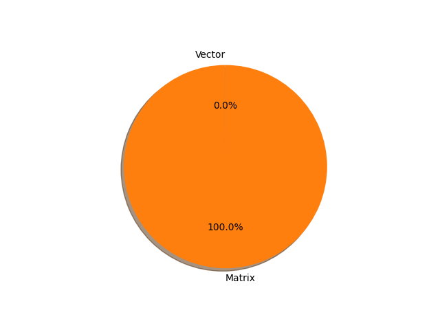

# t5-base parameter information

**Number of layers: [ 257 ]**

**Number of parameters: [ 222.90M ]**

**Proportional of each form** (%)

| Vector | Matrix | 
|  --- | --- |
| 24.12 | 75.88 | 

**Proportional of parameters by form** (%)

| Vector | Matrix | 
|  --- | --- |
| 0.02 | 99.98 | 

**Layer information**

| Name | Shape | Squeezed shape | Number of parameters | Form |
| --- | --- | --- | --- | --- |
| shared.weight | (32128, 768) | (32128, 768) | 24674304 | Matrix |
| encoder.block.0.layer.0.SelfAttention.q.weight | (768, 768) | (768, 768) | 589824 | Matrix |
| encoder.block.0.layer.0.SelfAttention.k.weight | (768, 768) | (768, 768) | 589824 | Matrix |
| encoder.block.0.layer.0.SelfAttention.v.weight | (768, 768) | (768, 768) | 589824 | Matrix |
| encoder.block.0.layer.0.SelfAttention.o.weight | (768, 768) | (768, 768) | 589824 | Matrix |
| encoder.block.0.layer.0.SelfAttention.relative_attention_bias.weight | (32, 12) | (32, 12) | 384 | Matrix |
| encoder.block.0.layer.0.layer_norm.weight | (768,) | (768,) | 768 | Vector |
| encoder.block.0.layer.1.DenseReluDense.wi.weight | (3072, 768) | (3072, 768) | 2359296 | Matrix |
| encoder.block.0.layer.1.DenseReluDense.wo.weight | (768, 3072) | (768, 3072) | 2359296 | Matrix |
| encoder.block.0.layer.1.layer_norm.weight | (768,) | (768,) | 768 | Vector |
| encoder.block.1.layer.0.SelfAttention.q.weight | (768, 768) | (768, 768) | 589824 | Matrix |
| encoder.block.1.layer.0.SelfAttention.k.weight | (768, 768) | (768, 768) | 589824 | Matrix |
| encoder.block.1.layer.0.SelfAttention.v.weight | (768, 768) | (768, 768) | 589824 | Matrix |
| encoder.block.1.layer.0.SelfAttention.o.weight | (768, 768) | (768, 768) | 589824 | Matrix |
| encoder.block.1.layer.0.layer_norm.weight | (768,) | (768,) | 768 | Vector |
| encoder.block.1.layer.1.DenseReluDense.wi.weight | (3072, 768) | (3072, 768) | 2359296 | Matrix |
| encoder.block.1.layer.1.DenseReluDense.wo.weight | (768, 3072) | (768, 3072) | 2359296 | Matrix |
| encoder.block.1.layer.1.layer_norm.weight | (768,) | (768,) | 768 | Vector |
| encoder.block.2.layer.0.SelfAttention.q.weight | (768, 768) | (768, 768) | 589824 | Matrix |
| encoder.block.2.layer.0.SelfAttention.k.weight | (768, 768) | (768, 768) | 589824 | Matrix |
| encoder.block.2.layer.0.SelfAttention.v.weight | (768, 768) | (768, 768) | 589824 | Matrix |
| encoder.block.2.layer.0.SelfAttention.o.weight | (768, 768) | (768, 768) | 589824 | Matrix |
| encoder.block.2.layer.0.layer_norm.weight | (768,) | (768,) | 768 | Vector |
| encoder.block.2.layer.1.DenseReluDense.wi.weight | (3072, 768) | (3072, 768) | 2359296 | Matrix |
| encoder.block.2.layer.1.DenseReluDense.wo.weight | (768, 3072) | (768, 3072) | 2359296 | Matrix |
| encoder.block.2.layer.1.layer_norm.weight | (768,) | (768,) | 768 | Vector |
| encoder.block.3.layer.0.SelfAttention.q.weight | (768, 768) | (768, 768) | 589824 | Matrix |
| encoder.block.3.layer.0.SelfAttention.k.weight | (768, 768) | (768, 768) | 589824 | Matrix |
| encoder.block.3.layer.0.SelfAttention.v.weight | (768, 768) | (768, 768) | 589824 | Matrix |
| encoder.block.3.layer.0.SelfAttention.o.weight | (768, 768) | (768, 768) | 589824 | Matrix |
| encoder.block.3.layer.0.layer_norm.weight | (768,) | (768,) | 768 | Vector |
| encoder.block.3.layer.1.DenseReluDense.wi.weight | (3072, 768) | (3072, 768) | 2359296 | Matrix |
| encoder.block.3.layer.1.DenseReluDense.wo.weight | (768, 3072) | (768, 3072) | 2359296 | Matrix |
| encoder.block.3.layer.1.layer_norm.weight | (768,) | (768,) | 768 | Vector |
| encoder.block.4.layer.0.SelfAttention.q.weight | (768, 768) | (768, 768) | 589824 | Matrix |
| encoder.block.4.layer.0.SelfAttention.k.weight | (768, 768) | (768, 768) | 589824 | Matrix |
| encoder.block.4.layer.0.SelfAttention.v.weight | (768, 768) | (768, 768) | 589824 | Matrix |
| encoder.block.4.layer.0.SelfAttention.o.weight | (768, 768) | (768, 768) | 589824 | Matrix |
| encoder.block.4.layer.0.layer_norm.weight | (768,) | (768,) | 768 | Vector |
| encoder.block.4.layer.1.DenseReluDense.wi.weight | (3072, 768) | (3072, 768) | 2359296 | Matrix |
| encoder.block.4.layer.1.DenseReluDense.wo.weight | (768, 3072) | (768, 3072) | 2359296 | Matrix |
| encoder.block.4.layer.1.layer_norm.weight | (768,) | (768,) | 768 | Vector |
| encoder.block.5.layer.0.SelfAttention.q.weight | (768, 768) | (768, 768) | 589824 | Matrix |
| encoder.block.5.layer.0.SelfAttention.k.weight | (768, 768) | (768, 768) | 589824 | Matrix |
| encoder.block.5.layer.0.SelfAttention.v.weight | (768, 768) | (768, 768) | 589824 | Matrix |
| encoder.block.5.layer.0.SelfAttention.o.weight | (768, 768) | (768, 768) | 589824 | Matrix |
| encoder.block.5.layer.0.layer_norm.weight | (768,) | (768,) | 768 | Vector |
| encoder.block.5.layer.1.DenseReluDense.wi.weight | (3072, 768) | (3072, 768) | 2359296 | Matrix |
| encoder.block.5.layer.1.DenseReluDense.wo.weight | (768, 3072) | (768, 3072) | 2359296 | Matrix |
| encoder.block.5.layer.1.layer_norm.weight | (768,) | (768,) | 768 | Vector |
| encoder.block.6.layer.0.SelfAttention.q.weight | (768, 768) | (768, 768) | 589824 | Matrix |
| encoder.block.6.layer.0.SelfAttention.k.weight | (768, 768) | (768, 768) | 589824 | Matrix |
| encoder.block.6.layer.0.SelfAttention.v.weight | (768, 768) | (768, 768) | 589824 | Matrix |
| encoder.block.6.layer.0.SelfAttention.o.weight | (768, 768) | (768, 768) | 589824 | Matrix |
| encoder.block.6.layer.0.layer_norm.weight | (768,) | (768,) | 768 | Vector |
| encoder.block.6.layer.1.DenseReluDense.wi.weight | (3072, 768) | (3072, 768) | 2359296 | Matrix |
| encoder.block.6.layer.1.DenseReluDense.wo.weight | (768, 3072) | (768, 3072) | 2359296 | Matrix |
| encoder.block.6.layer.1.layer_norm.weight | (768,) | (768,) | 768 | Vector |
| encoder.block.7.layer.0.SelfAttention.q.weight | (768, 768) | (768, 768) | 589824 | Matrix |
| encoder.block.7.layer.0.SelfAttention.k.weight | (768, 768) | (768, 768) | 589824 | Matrix |
| encoder.block.7.layer.0.SelfAttention.v.weight | (768, 768) | (768, 768) | 589824 | Matrix |
| encoder.block.7.layer.0.SelfAttention.o.weight | (768, 768) | (768, 768) | 589824 | Matrix |
| encoder.block.7.layer.0.layer_norm.weight | (768,) | (768,) | 768 | Vector |
| encoder.block.7.layer.1.DenseReluDense.wi.weight | (3072, 768) | (3072, 768) | 2359296 | Matrix |
| encoder.block.7.layer.1.DenseReluDense.wo.weight | (768, 3072) | (768, 3072) | 2359296 | Matrix |
| encoder.block.7.layer.1.layer_norm.weight | (768,) | (768,) | 768 | Vector |
| encoder.block.8.layer.0.SelfAttention.q.weight | (768, 768) | (768, 768) | 589824 | Matrix |
| encoder.block.8.layer.0.SelfAttention.k.weight | (768, 768) | (768, 768) | 589824 | Matrix |
| encoder.block.8.layer.0.SelfAttention.v.weight | (768, 768) | (768, 768) | 589824 | Matrix |
| encoder.block.8.layer.0.SelfAttention.o.weight | (768, 768) | (768, 768) | 589824 | Matrix |
| encoder.block.8.layer.0.layer_norm.weight | (768,) | (768,) | 768 | Vector |
| encoder.block.8.layer.1.DenseReluDense.wi.weight | (3072, 768) | (3072, 768) | 2359296 | Matrix |
| encoder.block.8.layer.1.DenseReluDense.wo.weight | (768, 3072) | (768, 3072) | 2359296 | Matrix |
| encoder.block.8.layer.1.layer_norm.weight | (768,) | (768,) | 768 | Vector |
| encoder.block.9.layer.0.SelfAttention.q.weight | (768, 768) | (768, 768) | 589824 | Matrix |
| encoder.block.9.layer.0.SelfAttention.k.weight | (768, 768) | (768, 768) | 589824 | Matrix |
| encoder.block.9.layer.0.SelfAttention.v.weight | (768, 768) | (768, 768) | 589824 | Matrix |
| encoder.block.9.layer.0.SelfAttention.o.weight | (768, 768) | (768, 768) | 589824 | Matrix |
| encoder.block.9.layer.0.layer_norm.weight | (768,) | (768,) | 768 | Vector |
| encoder.block.9.layer.1.DenseReluDense.wi.weight | (3072, 768) | (3072, 768) | 2359296 | Matrix |
| encoder.block.9.layer.1.DenseReluDense.wo.weight | (768, 3072) | (768, 3072) | 2359296 | Matrix |
| encoder.block.9.layer.1.layer_norm.weight | (768,) | (768,) | 768 | Vector |
| encoder.block.10.layer.0.SelfAttention.q.weight | (768, 768) | (768, 768) | 589824 | Matrix |
| encoder.block.10.layer.0.SelfAttention.k.weight | (768, 768) | (768, 768) | 589824 | Matrix |
| encoder.block.10.layer.0.SelfAttention.v.weight | (768, 768) | (768, 768) | 589824 | Matrix |
| encoder.block.10.layer.0.SelfAttention.o.weight | (768, 768) | (768, 768) | 589824 | Matrix |
| encoder.block.10.layer.0.layer_norm.weight | (768,) | (768,) | 768 | Vector |
| encoder.block.10.layer.1.DenseReluDense.wi.weight | (3072, 768) | (3072, 768) | 2359296 | Matrix |
| encoder.block.10.layer.1.DenseReluDense.wo.weight | (768, 3072) | (768, 3072) | 2359296 | Matrix |
| encoder.block.10.layer.1.layer_norm.weight | (768,) | (768,) | 768 | Vector |
| encoder.block.11.layer.0.SelfAttention.q.weight | (768, 768) | (768, 768) | 589824 | Matrix |
| encoder.block.11.layer.0.SelfAttention.k.weight | (768, 768) | (768, 768) | 589824 | Matrix |
| encoder.block.11.layer.0.SelfAttention.v.weight | (768, 768) | (768, 768) | 589824 | Matrix |
| encoder.block.11.layer.0.SelfAttention.o.weight | (768, 768) | (768, 768) | 589824 | Matrix |
| encoder.block.11.layer.0.layer_norm.weight | (768,) | (768,) | 768 | Vector |
| encoder.block.11.layer.1.DenseReluDense.wi.weight | (3072, 768) | (3072, 768) | 2359296 | Matrix |
| encoder.block.11.layer.1.DenseReluDense.wo.weight | (768, 3072) | (768, 3072) | 2359296 | Matrix |
| encoder.block.11.layer.1.layer_norm.weight | (768,) | (768,) | 768 | Vector |
| encoder.final_layer_norm.weight | (768,) | (768,) | 768 | Vector |
| decoder.block.0.layer.0.SelfAttention.q.weight | (768, 768) | (768, 768) | 589824 | Matrix |
| decoder.block.0.layer.0.SelfAttention.k.weight | (768, 768) | (768, 768) | 589824 | Matrix |
| decoder.block.0.layer.0.SelfAttention.v.weight | (768, 768) | (768, 768) | 589824 | Matrix |
| decoder.block.0.layer.0.SelfAttention.o.weight | (768, 768) | (768, 768) | 589824 | Matrix |
| decoder.block.0.layer.0.SelfAttention.relative_attention_bias.weight | (32, 12) | (32, 12) | 384 | Matrix |
| decoder.block.0.layer.0.layer_norm.weight | (768,) | (768,) | 768 | Vector |
| decoder.block.0.layer.1.EncDecAttention.q.weight | (768, 768) | (768, 768) | 589824 | Matrix |
| decoder.block.0.layer.1.EncDecAttention.k.weight | (768, 768) | (768, 768) | 589824 | Matrix |
| decoder.block.0.layer.1.EncDecAttention.v.weight | (768, 768) | (768, 768) | 589824 | Matrix |
| decoder.block.0.layer.1.EncDecAttention.o.weight | (768, 768) | (768, 768) | 589824 | Matrix |
| decoder.block.0.layer.1.layer_norm.weight | (768,) | (768,) | 768 | Vector |
| decoder.block.0.layer.2.DenseReluDense.wi.weight | (3072, 768) | (3072, 768) | 2359296 | Matrix |
| decoder.block.0.layer.2.DenseReluDense.wo.weight | (768, 3072) | (768, 3072) | 2359296 | Matrix |
| decoder.block.0.layer.2.layer_norm.weight | (768,) | (768,) | 768 | Vector |
| decoder.block.1.layer.0.SelfAttention.q.weight | (768, 768) | (768, 768) | 589824 | Matrix |
| decoder.block.1.layer.0.SelfAttention.k.weight | (768, 768) | (768, 768) | 589824 | Matrix |
| decoder.block.1.layer.0.SelfAttention.v.weight | (768, 768) | (768, 768) | 589824 | Matrix |
| decoder.block.1.layer.0.SelfAttention.o.weight | (768, 768) | (768, 768) | 589824 | Matrix |
| decoder.block.1.layer.0.layer_norm.weight | (768,) | (768,) | 768 | Vector |
| decoder.block.1.layer.1.EncDecAttention.q.weight | (768, 768) | (768, 768) | 589824 | Matrix |
| decoder.block.1.layer.1.EncDecAttention.k.weight | (768, 768) | (768, 768) | 589824 | Matrix |
| decoder.block.1.layer.1.EncDecAttention.v.weight | (768, 768) | (768, 768) | 589824 | Matrix |
| decoder.block.1.layer.1.EncDecAttention.o.weight | (768, 768) | (768, 768) | 589824 | Matrix |
| decoder.block.1.layer.1.layer_norm.weight | (768,) | (768,) | 768 | Vector |
| decoder.block.1.layer.2.DenseReluDense.wi.weight | (3072, 768) | (3072, 768) | 2359296 | Matrix |
| decoder.block.1.layer.2.DenseReluDense.wo.weight | (768, 3072) | (768, 3072) | 2359296 | Matrix |
| decoder.block.1.layer.2.layer_norm.weight | (768,) | (768,) | 768 | Vector |
| decoder.block.2.layer.0.SelfAttention.q.weight | (768, 768) | (768, 768) | 589824 | Matrix |
| decoder.block.2.layer.0.SelfAttention.k.weight | (768, 768) | (768, 768) | 589824 | Matrix |
| decoder.block.2.layer.0.SelfAttention.v.weight | (768, 768) | (768, 768) | 589824 | Matrix |
| decoder.block.2.layer.0.SelfAttention.o.weight | (768, 768) | (768, 768) | 589824 | Matrix |
| decoder.block.2.layer.0.layer_norm.weight | (768,) | (768,) | 768 | Vector |
| decoder.block.2.layer.1.EncDecAttention.q.weight | (768, 768) | (768, 768) | 589824 | Matrix |
| decoder.block.2.layer.1.EncDecAttention.k.weight | (768, 768) | (768, 768) | 589824 | Matrix |
| decoder.block.2.layer.1.EncDecAttention.v.weight | (768, 768) | (768, 768) | 589824 | Matrix |
| decoder.block.2.layer.1.EncDecAttention.o.weight | (768, 768) | (768, 768) | 589824 | Matrix |
| decoder.block.2.layer.1.layer_norm.weight | (768,) | (768,) | 768 | Vector |
| decoder.block.2.layer.2.DenseReluDense.wi.weight | (3072, 768) | (3072, 768) | 2359296 | Matrix |
| decoder.block.2.layer.2.DenseReluDense.wo.weight | (768, 3072) | (768, 3072) | 2359296 | Matrix |
| decoder.block.2.layer.2.layer_norm.weight | (768,) | (768,) | 768 | Vector |
| decoder.block.3.layer.0.SelfAttention.q.weight | (768, 768) | (768, 768) | 589824 | Matrix |
| decoder.block.3.layer.0.SelfAttention.k.weight | (768, 768) | (768, 768) | 589824 | Matrix |
| decoder.block.3.layer.0.SelfAttention.v.weight | (768, 768) | (768, 768) | 589824 | Matrix |
| decoder.block.3.layer.0.SelfAttention.o.weight | (768, 768) | (768, 768) | 589824 | Matrix |
| decoder.block.3.layer.0.layer_norm.weight | (768,) | (768,) | 768 | Vector |
| decoder.block.3.layer.1.EncDecAttention.q.weight | (768, 768) | (768, 768) | 589824 | Matrix |
| decoder.block.3.layer.1.EncDecAttention.k.weight | (768, 768) | (768, 768) | 589824 | Matrix |
| decoder.block.3.layer.1.EncDecAttention.v.weight | (768, 768) | (768, 768) | 589824 | Matrix |
| decoder.block.3.layer.1.EncDecAttention.o.weight | (768, 768) | (768, 768) | 589824 | Matrix |
| decoder.block.3.layer.1.layer_norm.weight | (768,) | (768,) | 768 | Vector |
| decoder.block.3.layer.2.DenseReluDense.wi.weight | (3072, 768) | (3072, 768) | 2359296 | Matrix |
| decoder.block.3.layer.2.DenseReluDense.wo.weight | (768, 3072) | (768, 3072) | 2359296 | Matrix |
| decoder.block.3.layer.2.layer_norm.weight | (768,) | (768,) | 768 | Vector |
| decoder.block.4.layer.0.SelfAttention.q.weight | (768, 768) | (768, 768) | 589824 | Matrix |
| decoder.block.4.layer.0.SelfAttention.k.weight | (768, 768) | (768, 768) | 589824 | Matrix |
| decoder.block.4.layer.0.SelfAttention.v.weight | (768, 768) | (768, 768) | 589824 | Matrix |
| decoder.block.4.layer.0.SelfAttention.o.weight | (768, 768) | (768, 768) | 589824 | Matrix |
| decoder.block.4.layer.0.layer_norm.weight | (768,) | (768,) | 768 | Vector |
| decoder.block.4.layer.1.EncDecAttention.q.weight | (768, 768) | (768, 768) | 589824 | Matrix |
| decoder.block.4.layer.1.EncDecAttention.k.weight | (768, 768) | (768, 768) | 589824 | Matrix |
| decoder.block.4.layer.1.EncDecAttention.v.weight | (768, 768) | (768, 768) | 589824 | Matrix |
| decoder.block.4.layer.1.EncDecAttention.o.weight | (768, 768) | (768, 768) | 589824 | Matrix |
| decoder.block.4.layer.1.layer_norm.weight | (768,) | (768,) | 768 | Vector |
| decoder.block.4.layer.2.DenseReluDense.wi.weight | (3072, 768) | (3072, 768) | 2359296 | Matrix |
| decoder.block.4.layer.2.DenseReluDense.wo.weight | (768, 3072) | (768, 3072) | 2359296 | Matrix |
| decoder.block.4.layer.2.layer_norm.weight | (768,) | (768,) | 768 | Vector |
| decoder.block.5.layer.0.SelfAttention.q.weight | (768, 768) | (768, 768) | 589824 | Matrix |
| decoder.block.5.layer.0.SelfAttention.k.weight | (768, 768) | (768, 768) | 589824 | Matrix |
| decoder.block.5.layer.0.SelfAttention.v.weight | (768, 768) | (768, 768) | 589824 | Matrix |
| decoder.block.5.layer.0.SelfAttention.o.weight | (768, 768) | (768, 768) | 589824 | Matrix |
| decoder.block.5.layer.0.layer_norm.weight | (768,) | (768,) | 768 | Vector |
| decoder.block.5.layer.1.EncDecAttention.q.weight | (768, 768) | (768, 768) | 589824 | Matrix |
| decoder.block.5.layer.1.EncDecAttention.k.weight | (768, 768) | (768, 768) | 589824 | Matrix |
| decoder.block.5.layer.1.EncDecAttention.v.weight | (768, 768) | (768, 768) | 589824 | Matrix |
| decoder.block.5.layer.1.EncDecAttention.o.weight | (768, 768) | (768, 768) | 589824 | Matrix |
| decoder.block.5.layer.1.layer_norm.weight | (768,) | (768,) | 768 | Vector |
| decoder.block.5.layer.2.DenseReluDense.wi.weight | (3072, 768) | (3072, 768) | 2359296 | Matrix |
| decoder.block.5.layer.2.DenseReluDense.wo.weight | (768, 3072) | (768, 3072) | 2359296 | Matrix |
| decoder.block.5.layer.2.layer_norm.weight | (768,) | (768,) | 768 | Vector |
| decoder.block.6.layer.0.SelfAttention.q.weight | (768, 768) | (768, 768) | 589824 | Matrix |
| decoder.block.6.layer.0.SelfAttention.k.weight | (768, 768) | (768, 768) | 589824 | Matrix |
| decoder.block.6.layer.0.SelfAttention.v.weight | (768, 768) | (768, 768) | 589824 | Matrix |
| decoder.block.6.layer.0.SelfAttention.o.weight | (768, 768) | (768, 768) | 589824 | Matrix |
| decoder.block.6.layer.0.layer_norm.weight | (768,) | (768,) | 768 | Vector |
| decoder.block.6.layer.1.EncDecAttention.q.weight | (768, 768) | (768, 768) | 589824 | Matrix |
| decoder.block.6.layer.1.EncDecAttention.k.weight | (768, 768) | (768, 768) | 589824 | Matrix |
| decoder.block.6.layer.1.EncDecAttention.v.weight | (768, 768) | (768, 768) | 589824 | Matrix |
| decoder.block.6.layer.1.EncDecAttention.o.weight | (768, 768) | (768, 768) | 589824 | Matrix |
| decoder.block.6.layer.1.layer_norm.weight | (768,) | (768,) | 768 | Vector |
| decoder.block.6.layer.2.DenseReluDense.wi.weight | (3072, 768) | (3072, 768) | 2359296 | Matrix |
| decoder.block.6.layer.2.DenseReluDense.wo.weight | (768, 3072) | (768, 3072) | 2359296 | Matrix |
| decoder.block.6.layer.2.layer_norm.weight | (768,) | (768,) | 768 | Vector |
| decoder.block.7.layer.0.SelfAttention.q.weight | (768, 768) | (768, 768) | 589824 | Matrix |
| decoder.block.7.layer.0.SelfAttention.k.weight | (768, 768) | (768, 768) | 589824 | Matrix |
| decoder.block.7.layer.0.SelfAttention.v.weight | (768, 768) | (768, 768) | 589824 | Matrix |
| decoder.block.7.layer.0.SelfAttention.o.weight | (768, 768) | (768, 768) | 589824 | Matrix |
| decoder.block.7.layer.0.layer_norm.weight | (768,) | (768,) | 768 | Vector |
| decoder.block.7.layer.1.EncDecAttention.q.weight | (768, 768) | (768, 768) | 589824 | Matrix |
| decoder.block.7.layer.1.EncDecAttention.k.weight | (768, 768) | (768, 768) | 589824 | Matrix |
| decoder.block.7.layer.1.EncDecAttention.v.weight | (768, 768) | (768, 768) | 589824 | Matrix |
| decoder.block.7.layer.1.EncDecAttention.o.weight | (768, 768) | (768, 768) | 589824 | Matrix |
| decoder.block.7.layer.1.layer_norm.weight | (768,) | (768,) | 768 | Vector |
| decoder.block.7.layer.2.DenseReluDense.wi.weight | (3072, 768) | (3072, 768) | 2359296 | Matrix |
| decoder.block.7.layer.2.DenseReluDense.wo.weight | (768, 3072) | (768, 3072) | 2359296 | Matrix |
| decoder.block.7.layer.2.layer_norm.weight | (768,) | (768,) | 768 | Vector |
| decoder.block.8.layer.0.SelfAttention.q.weight | (768, 768) | (768, 768) | 589824 | Matrix |
| decoder.block.8.layer.0.SelfAttention.k.weight | (768, 768) | (768, 768) | 589824 | Matrix |
| decoder.block.8.layer.0.SelfAttention.v.weight | (768, 768) | (768, 768) | 589824 | Matrix |
| decoder.block.8.layer.0.SelfAttention.o.weight | (768, 768) | (768, 768) | 589824 | Matrix |
| decoder.block.8.layer.0.layer_norm.weight | (768,) | (768,) | 768 | Vector |
| decoder.block.8.layer.1.EncDecAttention.q.weight | (768, 768) | (768, 768) | 589824 | Matrix |
| decoder.block.8.layer.1.EncDecAttention.k.weight | (768, 768) | (768, 768) | 589824 | Matrix |
| decoder.block.8.layer.1.EncDecAttention.v.weight | (768, 768) | (768, 768) | 589824 | Matrix |
| decoder.block.8.layer.1.EncDecAttention.o.weight | (768, 768) | (768, 768) | 589824 | Matrix |
| decoder.block.8.layer.1.layer_norm.weight | (768,) | (768,) | 768 | Vector |
| decoder.block.8.layer.2.DenseReluDense.wi.weight | (3072, 768) | (3072, 768) | 2359296 | Matrix |
| decoder.block.8.layer.2.DenseReluDense.wo.weight | (768, 3072) | (768, 3072) | 2359296 | Matrix |
| decoder.block.8.layer.2.layer_norm.weight | (768,) | (768,) | 768 | Vector |
| decoder.block.9.layer.0.SelfAttention.q.weight | (768, 768) | (768, 768) | 589824 | Matrix |
| decoder.block.9.layer.0.SelfAttention.k.weight | (768, 768) | (768, 768) | 589824 | Matrix |
| decoder.block.9.layer.0.SelfAttention.v.weight | (768, 768) | (768, 768) | 589824 | Matrix |
| decoder.block.9.layer.0.SelfAttention.o.weight | (768, 768) | (768, 768) | 589824 | Matrix |
| decoder.block.9.layer.0.layer_norm.weight | (768,) | (768,) | 768 | Vector |
| decoder.block.9.layer.1.EncDecAttention.q.weight | (768, 768) | (768, 768) | 589824 | Matrix |
| decoder.block.9.layer.1.EncDecAttention.k.weight | (768, 768) | (768, 768) | 589824 | Matrix |
| decoder.block.9.layer.1.EncDecAttention.v.weight | (768, 768) | (768, 768) | 589824 | Matrix |
| decoder.block.9.layer.1.EncDecAttention.o.weight | (768, 768) | (768, 768) | 589824 | Matrix |
| decoder.block.9.layer.1.layer_norm.weight | (768,) | (768,) | 768 | Vector |
| decoder.block.9.layer.2.DenseReluDense.wi.weight | (3072, 768) | (3072, 768) | 2359296 | Matrix |
| decoder.block.9.layer.2.DenseReluDense.wo.weight | (768, 3072) | (768, 3072) | 2359296 | Matrix |
| decoder.block.9.layer.2.layer_norm.weight | (768,) | (768,) | 768 | Vector |
| decoder.block.10.layer.0.SelfAttention.q.weight | (768, 768) | (768, 768) | 589824 | Matrix |
| decoder.block.10.layer.0.SelfAttention.k.weight | (768, 768) | (768, 768) | 589824 | Matrix |
| decoder.block.10.layer.0.SelfAttention.v.weight | (768, 768) | (768, 768) | 589824 | Matrix |
| decoder.block.10.layer.0.SelfAttention.o.weight | (768, 768) | (768, 768) | 589824 | Matrix |
| decoder.block.10.layer.0.layer_norm.weight | (768,) | (768,) | 768 | Vector |
| decoder.block.10.layer.1.EncDecAttention.q.weight | (768, 768) | (768, 768) | 589824 | Matrix |
| decoder.block.10.layer.1.EncDecAttention.k.weight | (768, 768) | (768, 768) | 589824 | Matrix |
| decoder.block.10.layer.1.EncDecAttention.v.weight | (768, 768) | (768, 768) | 589824 | Matrix |
| decoder.block.10.layer.1.EncDecAttention.o.weight | (768, 768) | (768, 768) | 589824 | Matrix |
| decoder.block.10.layer.1.layer_norm.weight | (768,) | (768,) | 768 | Vector |
| decoder.block.10.layer.2.DenseReluDense.wi.weight | (3072, 768) | (3072, 768) | 2359296 | Matrix |
| decoder.block.10.layer.2.DenseReluDense.wo.weight | (768, 3072) | (768, 3072) | 2359296 | Matrix |
| decoder.block.10.layer.2.layer_norm.weight | (768,) | (768,) | 768 | Vector |
| decoder.block.11.layer.0.SelfAttention.q.weight | (768, 768) | (768, 768) | 589824 | Matrix |
| decoder.block.11.layer.0.SelfAttention.k.weight | (768, 768) | (768, 768) | 589824 | Matrix |
| decoder.block.11.layer.0.SelfAttention.v.weight | (768, 768) | (768, 768) | 589824 | Matrix |
| decoder.block.11.layer.0.SelfAttention.o.weight | (768, 768) | (768, 768) | 589824 | Matrix |
| decoder.block.11.layer.0.layer_norm.weight | (768,) | (768,) | 768 | Vector |
| decoder.block.11.layer.1.EncDecAttention.q.weight | (768, 768) | (768, 768) | 589824 | Matrix |
| decoder.block.11.layer.1.EncDecAttention.k.weight | (768, 768) | (768, 768) | 589824 | Matrix |
| decoder.block.11.layer.1.EncDecAttention.v.weight | (768, 768) | (768, 768) | 589824 | Matrix |
| decoder.block.11.layer.1.EncDecAttention.o.weight | (768, 768) | (768, 768) | 589824 | Matrix |
| decoder.block.11.layer.1.layer_norm.weight | (768,) | (768,) | 768 | Vector |
| decoder.block.11.layer.2.DenseReluDense.wi.weight | (3072, 768) | (3072, 768) | 2359296 | Matrix |
| decoder.block.11.layer.2.DenseReluDense.wo.weight | (768, 3072) | (768, 3072) | 2359296 | Matrix |
| decoder.block.11.layer.2.layer_norm.weight | (768,) | (768,) | 768 | Vector |
| decoder.final_layer_norm.weight | (768,) | (768,) | 768 | Vector |

