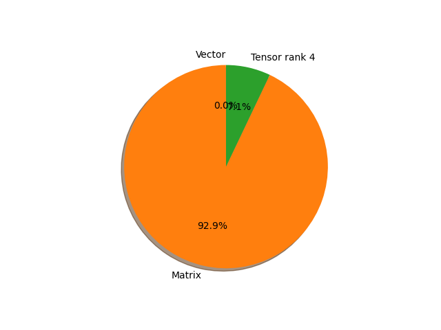

# vgg13_bn parameter information

**Number of layers: [ 46 ]**

**Number of parameters: [ 133.05M ]**

**Proportional of each form** (%)

| Vector | Matrix | Tensor rank 4 | 
|  --- | --- | --- |
| 71.74 | 6.52 | 21.74 | 

**Proportional of parameters by form** (%)

| Vector | Matrix | Tensor rank 4 | 
|  --- | --- | --- |
| 0.01 | 92.92 | 7.07 | 

**Layer information**

| Name | Shape | Squeezed shape | Number of parameters | Form |
| --- | --- | --- | --- | --- |
| features.0.weight | (64, 3, 3, 3) | (64, 3, 3, 3) | 1728 | Tensor rank 4 |
| features.0.bias | (64,) | (64,) | 64 | Vector |
| features.1.weight | (64,) | (64,) | 64 | Vector |
| features.1.bias | (64,) | (64,) | 64 | Vector |
| features.3.weight | (64, 64, 3, 3) | (64, 64, 3, 3) | 36864 | Tensor rank 4 |
| features.3.bias | (64,) | (64,) | 64 | Vector |
| features.4.weight | (64,) | (64,) | 64 | Vector |
| features.4.bias | (64,) | (64,) | 64 | Vector |
| features.7.weight | (128, 64, 3, 3) | (128, 64, 3, 3) | 73728 | Tensor rank 4 |
| features.7.bias | (128,) | (128,) | 128 | Vector |
| features.8.weight | (128,) | (128,) | 128 | Vector |
| features.8.bias | (128,) | (128,) | 128 | Vector |
| features.10.weight | (128, 128, 3, 3) | (128, 128, 3, 3) | 147456 | Tensor rank 4 |
| features.10.bias | (128,) | (128,) | 128 | Vector |
| features.11.weight | (128,) | (128,) | 128 | Vector |
| features.11.bias | (128,) | (128,) | 128 | Vector |
| features.14.weight | (256, 128, 3, 3) | (256, 128, 3, 3) | 294912 | Tensor rank 4 |
| features.14.bias | (256,) | (256,) | 256 | Vector |
| features.15.weight | (256,) | (256,) | 256 | Vector |
| features.15.bias | (256,) | (256,) | 256 | Vector |
| features.17.weight | (256, 256, 3, 3) | (256, 256, 3, 3) | 589824 | Tensor rank 4 |
| features.17.bias | (256,) | (256,) | 256 | Vector |
| features.18.weight | (256,) | (256,) | 256 | Vector |
| features.18.bias | (256,) | (256,) | 256 | Vector |
| features.21.weight | (512, 256, 3, 3) | (512, 256, 3, 3) | 1179648 | Tensor rank 4 |
| features.21.bias | (512,) | (512,) | 512 | Vector |
| features.22.weight | (512,) | (512,) | 512 | Vector |
| features.22.bias | (512,) | (512,) | 512 | Vector |
| features.24.weight | (512, 512, 3, 3) | (512, 512, 3, 3) | 2359296 | Tensor rank 4 |
| features.24.bias | (512,) | (512,) | 512 | Vector |
| features.25.weight | (512,) | (512,) | 512 | Vector |
| features.25.bias | (512,) | (512,) | 512 | Vector |
| features.28.weight | (512, 512, 3, 3) | (512, 512, 3, 3) | 2359296 | Tensor rank 4 |
| features.28.bias | (512,) | (512,) | 512 | Vector |
| features.29.weight | (512,) | (512,) | 512 | Vector |
| features.29.bias | (512,) | (512,) | 512 | Vector |
| features.31.weight | (512, 512, 3, 3) | (512, 512, 3, 3) | 2359296 | Tensor rank 4 |
| features.31.bias | (512,) | (512,) | 512 | Vector |
| features.32.weight | (512,) | (512,) | 512 | Vector |
| features.32.bias | (512,) | (512,) | 512 | Vector |
| classifier.0.weight | (4096, 25088) | (4096, 25088) | 102760448 | Matrix |
| classifier.0.bias | (4096,) | (4096,) | 4096 | Vector |
| classifier.3.weight | (4096, 4096) | (4096, 4096) | 16777216 | Matrix |
| classifier.3.bias | (4096,) | (4096,) | 4096 | Vector |
| classifier.6.weight | (1000, 4096) | (1000, 4096) | 4096000 | Matrix |
| classifier.6.bias | (1000,) | (1000,) | 1000 | Vector |

