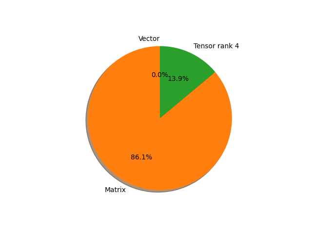

# vgg19 parameter information

**Number of layers: [ 38 ]**

**Number of parameters: [ 143.67M ]**

**Proportional of each form** (%)

| Vector | Matrix | Tensor rank 4 | 
|  --- | --- | --- |
| 50.00 | 7.89 | 42.11 | 
**Proportional of parameters by form** (%)

| Vector | Matrix | Tensor rank 4 | 
|  --- | --- | --- |
| 0.01 | 86.06 | 13.93 | 

**Layer information**

| Name | Shape | Squeezed shape | Number of parameters | Form |
| --- | --- | --- | --- | --- |
| features.0.weight | (64, 3, 3, 3) | (64, 3, 3, 3) | 1728 | Tensor rank 4 |
| features.0.bias | (64,) | (64,) | 64 | Vector |
| features.2.weight | (64, 64, 3, 3) | (64, 64, 3, 3) | 36864 | Tensor rank 4 |
| features.2.bias | (64,) | (64,) | 64 | Vector |
| features.5.weight | (128, 64, 3, 3) | (128, 64, 3, 3) | 73728 | Tensor rank 4 |
| features.5.bias | (128,) | (128,) | 128 | Vector |
| features.7.weight | (128, 128, 3, 3) | (128, 128, 3, 3) | 147456 | Tensor rank 4 |
| features.7.bias | (128,) | (128,) | 128 | Vector |
| features.10.weight | (256, 128, 3, 3) | (256, 128, 3, 3) | 294912 | Tensor rank 4 |
| features.10.bias | (256,) | (256,) | 256 | Vector |
| features.12.weight | (256, 256, 3, 3) | (256, 256, 3, 3) | 589824 | Tensor rank 4 |
| features.12.bias | (256,) | (256,) | 256 | Vector |
| features.14.weight | (256, 256, 3, 3) | (256, 256, 3, 3) | 589824 | Tensor rank 4 |
| features.14.bias | (256,) | (256,) | 256 | Vector |
| features.16.weight | (256, 256, 3, 3) | (256, 256, 3, 3) | 589824 | Tensor rank 4 |
| features.16.bias | (256,) | (256,) | 256 | Vector |
| features.19.weight | (512, 256, 3, 3) | (512, 256, 3, 3) | 1179648 | Tensor rank 4 |
| features.19.bias | (512,) | (512,) | 512 | Vector |
| features.21.weight | (512, 512, 3, 3) | (512, 512, 3, 3) | 2359296 | Tensor rank 4 |
| features.21.bias | (512,) | (512,) | 512 | Vector |
| features.23.weight | (512, 512, 3, 3) | (512, 512, 3, 3) | 2359296 | Tensor rank 4 |
| features.23.bias | (512,) | (512,) | 512 | Vector |
| features.25.weight | (512, 512, 3, 3) | (512, 512, 3, 3) | 2359296 | Tensor rank 4 |
| features.25.bias | (512,) | (512,) | 512 | Vector |
| features.28.weight | (512, 512, 3, 3) | (512, 512, 3, 3) | 2359296 | Tensor rank 4 |
| features.28.bias | (512,) | (512,) | 512 | Vector |
| features.30.weight | (512, 512, 3, 3) | (512, 512, 3, 3) | 2359296 | Tensor rank 4 |
| features.30.bias | (512,) | (512,) | 512 | Vector |
| features.32.weight | (512, 512, 3, 3) | (512, 512, 3, 3) | 2359296 | Tensor rank 4 |
| features.32.bias | (512,) | (512,) | 512 | Vector |
| features.34.weight | (512, 512, 3, 3) | (512, 512, 3, 3) | 2359296 | Tensor rank 4 |
| features.34.bias | (512,) | (512,) | 512 | Vector |
| classifier.0.weight | (4096, 25088) | (4096, 25088) | 102760448 | Matrix |
| classifier.0.bias | (4096,) | (4096,) | 4096 | Vector |
| classifier.3.weight | (4096, 4096) | (4096, 4096) | 16777216 | Matrix |
| classifier.3.bias | (4096,) | (4096,) | 4096 | Vector |
| classifier.6.weight | (1000, 4096) | (1000, 4096) | 4096000 | Matrix |
| classifier.6.bias | (1000,) | (1000,) | 1000 | Vector |

