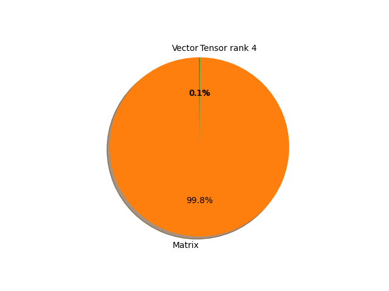

# vit_h_14 parameter information

**Number of layers: [ 392 ]**

**Number of parameters: [ 632.05M ]**

**Proportional of each form** (%)

| Vector | Matrix | Tensor rank 4 | 
|  --- | --- | --- |
| 66.58 | 33.16 | 0.26 | 

**Proportional of parameters by form** (%)

| Vector | Matrix | Tensor rank 4 | 
|  --- | --- | --- |
| 0.09 | 99.80 | 0.12 | 

**Layer information**

| Name | Shape | Squeezed shape | Number of parameters | Form |
| --- | --- | --- | --- | --- |
| class_token | (1, 1, 1280) | (1280,) | 1280 | Vector |
| conv_proj.weight | (1280, 3, 14, 14) | (1280, 3, 14, 14) | 752640 | Tensor rank 4 |
| conv_proj.bias | (1280,) | (1280,) | 1280 | Vector |
| encoder.pos_embedding | (1, 257, 1280) | (257, 1280) | 328960 | Matrix |
| encoder.layers.encoder_layer_0.ln_1.weight | (1280,) | (1280,) | 1280 | Vector |
| encoder.layers.encoder_layer_0.ln_1.bias | (1280,) | (1280,) | 1280 | Vector |
| encoder.layers.encoder_layer_0.self_attention.in_proj_weight | (3840, 1280) | (3840, 1280) | 4915200 | Matrix |
| encoder.layers.encoder_layer_0.self_attention.in_proj_bias | (3840,) | (3840,) | 3840 | Vector |
| encoder.layers.encoder_layer_0.self_attention.out_proj.weight | (1280, 1280) | (1280, 1280) | 1638400 | Matrix |
| encoder.layers.encoder_layer_0.self_attention.out_proj.bias | (1280,) | (1280,) | 1280 | Vector |
| encoder.layers.encoder_layer_0.ln_2.weight | (1280,) | (1280,) | 1280 | Vector |
| encoder.layers.encoder_layer_0.ln_2.bias | (1280,) | (1280,) | 1280 | Vector |
| encoder.layers.encoder_layer_0.mlp.0.weight | (5120, 1280) | (5120, 1280) | 6553600 | Matrix |
| encoder.layers.encoder_layer_0.mlp.0.bias | (5120,) | (5120,) | 5120 | Vector |
| encoder.layers.encoder_layer_0.mlp.3.weight | (1280, 5120) | (1280, 5120) | 6553600 | Matrix |
| encoder.layers.encoder_layer_0.mlp.3.bias | (1280,) | (1280,) | 1280 | Vector |
| encoder.layers.encoder_layer_1.ln_1.weight | (1280,) | (1280,) | 1280 | Vector |
| encoder.layers.encoder_layer_1.ln_1.bias | (1280,) | (1280,) | 1280 | Vector |
| encoder.layers.encoder_layer_1.self_attention.in_proj_weight | (3840, 1280) | (3840, 1280) | 4915200 | Matrix |
| encoder.layers.encoder_layer_1.self_attention.in_proj_bias | (3840,) | (3840,) | 3840 | Vector |
| encoder.layers.encoder_layer_1.self_attention.out_proj.weight | (1280, 1280) | (1280, 1280) | 1638400 | Matrix |
| encoder.layers.encoder_layer_1.self_attention.out_proj.bias | (1280,) | (1280,) | 1280 | Vector |
| encoder.layers.encoder_layer_1.ln_2.weight | (1280,) | (1280,) | 1280 | Vector |
| encoder.layers.encoder_layer_1.ln_2.bias | (1280,) | (1280,) | 1280 | Vector |
| encoder.layers.encoder_layer_1.mlp.0.weight | (5120, 1280) | (5120, 1280) | 6553600 | Matrix |
| encoder.layers.encoder_layer_1.mlp.0.bias | (5120,) | (5120,) | 5120 | Vector |
| encoder.layers.encoder_layer_1.mlp.3.weight | (1280, 5120) | (1280, 5120) | 6553600 | Matrix |
| encoder.layers.encoder_layer_1.mlp.3.bias | (1280,) | (1280,) | 1280 | Vector |
| encoder.layers.encoder_layer_2.ln_1.weight | (1280,) | (1280,) | 1280 | Vector |
| encoder.layers.encoder_layer_2.ln_1.bias | (1280,) | (1280,) | 1280 | Vector |
| encoder.layers.encoder_layer_2.self_attention.in_proj_weight | (3840, 1280) | (3840, 1280) | 4915200 | Matrix |
| encoder.layers.encoder_layer_2.self_attention.in_proj_bias | (3840,) | (3840,) | 3840 | Vector |
| encoder.layers.encoder_layer_2.self_attention.out_proj.weight | (1280, 1280) | (1280, 1280) | 1638400 | Matrix |
| encoder.layers.encoder_layer_2.self_attention.out_proj.bias | (1280,) | (1280,) | 1280 | Vector |
| encoder.layers.encoder_layer_2.ln_2.weight | (1280,) | (1280,) | 1280 | Vector |
| encoder.layers.encoder_layer_2.ln_2.bias | (1280,) | (1280,) | 1280 | Vector |
| encoder.layers.encoder_layer_2.mlp.0.weight | (5120, 1280) | (5120, 1280) | 6553600 | Matrix |
| encoder.layers.encoder_layer_2.mlp.0.bias | (5120,) | (5120,) | 5120 | Vector |
| encoder.layers.encoder_layer_2.mlp.3.weight | (1280, 5120) | (1280, 5120) | 6553600 | Matrix |
| encoder.layers.encoder_layer_2.mlp.3.bias | (1280,) | (1280,) | 1280 | Vector |
| encoder.layers.encoder_layer_3.ln_1.weight | (1280,) | (1280,) | 1280 | Vector |
| encoder.layers.encoder_layer_3.ln_1.bias | (1280,) | (1280,) | 1280 | Vector |
| encoder.layers.encoder_layer_3.self_attention.in_proj_weight | (3840, 1280) | (3840, 1280) | 4915200 | Matrix |
| encoder.layers.encoder_layer_3.self_attention.in_proj_bias | (3840,) | (3840,) | 3840 | Vector |
| encoder.layers.encoder_layer_3.self_attention.out_proj.weight | (1280, 1280) | (1280, 1280) | 1638400 | Matrix |
| encoder.layers.encoder_layer_3.self_attention.out_proj.bias | (1280,) | (1280,) | 1280 | Vector |
| encoder.layers.encoder_layer_3.ln_2.weight | (1280,) | (1280,) | 1280 | Vector |
| encoder.layers.encoder_layer_3.ln_2.bias | (1280,) | (1280,) | 1280 | Vector |
| encoder.layers.encoder_layer_3.mlp.0.weight | (5120, 1280) | (5120, 1280) | 6553600 | Matrix |
| encoder.layers.encoder_layer_3.mlp.0.bias | (5120,) | (5120,) | 5120 | Vector |
| encoder.layers.encoder_layer_3.mlp.3.weight | (1280, 5120) | (1280, 5120) | 6553600 | Matrix |
| encoder.layers.encoder_layer_3.mlp.3.bias | (1280,) | (1280,) | 1280 | Vector |
| encoder.layers.encoder_layer_4.ln_1.weight | (1280,) | (1280,) | 1280 | Vector |
| encoder.layers.encoder_layer_4.ln_1.bias | (1280,) | (1280,) | 1280 | Vector |
| encoder.layers.encoder_layer_4.self_attention.in_proj_weight | (3840, 1280) | (3840, 1280) | 4915200 | Matrix |
| encoder.layers.encoder_layer_4.self_attention.in_proj_bias | (3840,) | (3840,) | 3840 | Vector |
| encoder.layers.encoder_layer_4.self_attention.out_proj.weight | (1280, 1280) | (1280, 1280) | 1638400 | Matrix |
| encoder.layers.encoder_layer_4.self_attention.out_proj.bias | (1280,) | (1280,) | 1280 | Vector |
| encoder.layers.encoder_layer_4.ln_2.weight | (1280,) | (1280,) | 1280 | Vector |
| encoder.layers.encoder_layer_4.ln_2.bias | (1280,) | (1280,) | 1280 | Vector |
| encoder.layers.encoder_layer_4.mlp.0.weight | (5120, 1280) | (5120, 1280) | 6553600 | Matrix |
| encoder.layers.encoder_layer_4.mlp.0.bias | (5120,) | (5120,) | 5120 | Vector |
| encoder.layers.encoder_layer_4.mlp.3.weight | (1280, 5120) | (1280, 5120) | 6553600 | Matrix |
| encoder.layers.encoder_layer_4.mlp.3.bias | (1280,) | (1280,) | 1280 | Vector |
| encoder.layers.encoder_layer_5.ln_1.weight | (1280,) | (1280,) | 1280 | Vector |
| encoder.layers.encoder_layer_5.ln_1.bias | (1280,) | (1280,) | 1280 | Vector |
| encoder.layers.encoder_layer_5.self_attention.in_proj_weight | (3840, 1280) | (3840, 1280) | 4915200 | Matrix |
| encoder.layers.encoder_layer_5.self_attention.in_proj_bias | (3840,) | (3840,) | 3840 | Vector |
| encoder.layers.encoder_layer_5.self_attention.out_proj.weight | (1280, 1280) | (1280, 1280) | 1638400 | Matrix |
| encoder.layers.encoder_layer_5.self_attention.out_proj.bias | (1280,) | (1280,) | 1280 | Vector |
| encoder.layers.encoder_layer_5.ln_2.weight | (1280,) | (1280,) | 1280 | Vector |
| encoder.layers.encoder_layer_5.ln_2.bias | (1280,) | (1280,) | 1280 | Vector |
| encoder.layers.encoder_layer_5.mlp.0.weight | (5120, 1280) | (5120, 1280) | 6553600 | Matrix |
| encoder.layers.encoder_layer_5.mlp.0.bias | (5120,) | (5120,) | 5120 | Vector |
| encoder.layers.encoder_layer_5.mlp.3.weight | (1280, 5120) | (1280, 5120) | 6553600 | Matrix |
| encoder.layers.encoder_layer_5.mlp.3.bias | (1280,) | (1280,) | 1280 | Vector |
| encoder.layers.encoder_layer_6.ln_1.weight | (1280,) | (1280,) | 1280 | Vector |
| encoder.layers.encoder_layer_6.ln_1.bias | (1280,) | (1280,) | 1280 | Vector |
| encoder.layers.encoder_layer_6.self_attention.in_proj_weight | (3840, 1280) | (3840, 1280) | 4915200 | Matrix |
| encoder.layers.encoder_layer_6.self_attention.in_proj_bias | (3840,) | (3840,) | 3840 | Vector |
| encoder.layers.encoder_layer_6.self_attention.out_proj.weight | (1280, 1280) | (1280, 1280) | 1638400 | Matrix |
| encoder.layers.encoder_layer_6.self_attention.out_proj.bias | (1280,) | (1280,) | 1280 | Vector |
| encoder.layers.encoder_layer_6.ln_2.weight | (1280,) | (1280,) | 1280 | Vector |
| encoder.layers.encoder_layer_6.ln_2.bias | (1280,) | (1280,) | 1280 | Vector |
| encoder.layers.encoder_layer_6.mlp.0.weight | (5120, 1280) | (5120, 1280) | 6553600 | Matrix |
| encoder.layers.encoder_layer_6.mlp.0.bias | (5120,) | (5120,) | 5120 | Vector |
| encoder.layers.encoder_layer_6.mlp.3.weight | (1280, 5120) | (1280, 5120) | 6553600 | Matrix |
| encoder.layers.encoder_layer_6.mlp.3.bias | (1280,) | (1280,) | 1280 | Vector |
| encoder.layers.encoder_layer_7.ln_1.weight | (1280,) | (1280,) | 1280 | Vector |
| encoder.layers.encoder_layer_7.ln_1.bias | (1280,) | (1280,) | 1280 | Vector |
| encoder.layers.encoder_layer_7.self_attention.in_proj_weight | (3840, 1280) | (3840, 1280) | 4915200 | Matrix |
| encoder.layers.encoder_layer_7.self_attention.in_proj_bias | (3840,) | (3840,) | 3840 | Vector |
| encoder.layers.encoder_layer_7.self_attention.out_proj.weight | (1280, 1280) | (1280, 1280) | 1638400 | Matrix |
| encoder.layers.encoder_layer_7.self_attention.out_proj.bias | (1280,) | (1280,) | 1280 | Vector |
| encoder.layers.encoder_layer_7.ln_2.weight | (1280,) | (1280,) | 1280 | Vector |
| encoder.layers.encoder_layer_7.ln_2.bias | (1280,) | (1280,) | 1280 | Vector |
| encoder.layers.encoder_layer_7.mlp.0.weight | (5120, 1280) | (5120, 1280) | 6553600 | Matrix |
| encoder.layers.encoder_layer_7.mlp.0.bias | (5120,) | (5120,) | 5120 | Vector |
| encoder.layers.encoder_layer_7.mlp.3.weight | (1280, 5120) | (1280, 5120) | 6553600 | Matrix |
| encoder.layers.encoder_layer_7.mlp.3.bias | (1280,) | (1280,) | 1280 | Vector |
| encoder.layers.encoder_layer_8.ln_1.weight | (1280,) | (1280,) | 1280 | Vector |
| encoder.layers.encoder_layer_8.ln_1.bias | (1280,) | (1280,) | 1280 | Vector |
| encoder.layers.encoder_layer_8.self_attention.in_proj_weight | (3840, 1280) | (3840, 1280) | 4915200 | Matrix |
| encoder.layers.encoder_layer_8.self_attention.in_proj_bias | (3840,) | (3840,) | 3840 | Vector |
| encoder.layers.encoder_layer_8.self_attention.out_proj.weight | (1280, 1280) | (1280, 1280) | 1638400 | Matrix |
| encoder.layers.encoder_layer_8.self_attention.out_proj.bias | (1280,) | (1280,) | 1280 | Vector |
| encoder.layers.encoder_layer_8.ln_2.weight | (1280,) | (1280,) | 1280 | Vector |
| encoder.layers.encoder_layer_8.ln_2.bias | (1280,) | (1280,) | 1280 | Vector |
| encoder.layers.encoder_layer_8.mlp.0.weight | (5120, 1280) | (5120, 1280) | 6553600 | Matrix |
| encoder.layers.encoder_layer_8.mlp.0.bias | (5120,) | (5120,) | 5120 | Vector |
| encoder.layers.encoder_layer_8.mlp.3.weight | (1280, 5120) | (1280, 5120) | 6553600 | Matrix |
| encoder.layers.encoder_layer_8.mlp.3.bias | (1280,) | (1280,) | 1280 | Vector |
| encoder.layers.encoder_layer_9.ln_1.weight | (1280,) | (1280,) | 1280 | Vector |
| encoder.layers.encoder_layer_9.ln_1.bias | (1280,) | (1280,) | 1280 | Vector |
| encoder.layers.encoder_layer_9.self_attention.in_proj_weight | (3840, 1280) | (3840, 1280) | 4915200 | Matrix |
| encoder.layers.encoder_layer_9.self_attention.in_proj_bias | (3840,) | (3840,) | 3840 | Vector |
| encoder.layers.encoder_layer_9.self_attention.out_proj.weight | (1280, 1280) | (1280, 1280) | 1638400 | Matrix |
| encoder.layers.encoder_layer_9.self_attention.out_proj.bias | (1280,) | (1280,) | 1280 | Vector |
| encoder.layers.encoder_layer_9.ln_2.weight | (1280,) | (1280,) | 1280 | Vector |
| encoder.layers.encoder_layer_9.ln_2.bias | (1280,) | (1280,) | 1280 | Vector |
| encoder.layers.encoder_layer_9.mlp.0.weight | (5120, 1280) | (5120, 1280) | 6553600 | Matrix |
| encoder.layers.encoder_layer_9.mlp.0.bias | (5120,) | (5120,) | 5120 | Vector |
| encoder.layers.encoder_layer_9.mlp.3.weight | (1280, 5120) | (1280, 5120) | 6553600 | Matrix |
| encoder.layers.encoder_layer_9.mlp.3.bias | (1280,) | (1280,) | 1280 | Vector |
| encoder.layers.encoder_layer_10.ln_1.weight | (1280,) | (1280,) | 1280 | Vector |
| encoder.layers.encoder_layer_10.ln_1.bias | (1280,) | (1280,) | 1280 | Vector |
| encoder.layers.encoder_layer_10.self_attention.in_proj_weight | (3840, 1280) | (3840, 1280) | 4915200 | Matrix |
| encoder.layers.encoder_layer_10.self_attention.in_proj_bias | (3840,) | (3840,) | 3840 | Vector |
| encoder.layers.encoder_layer_10.self_attention.out_proj.weight | (1280, 1280) | (1280, 1280) | 1638400 | Matrix |
| encoder.layers.encoder_layer_10.self_attention.out_proj.bias | (1280,) | (1280,) | 1280 | Vector |
| encoder.layers.encoder_layer_10.ln_2.weight | (1280,) | (1280,) | 1280 | Vector |
| encoder.layers.encoder_layer_10.ln_2.bias | (1280,) | (1280,) | 1280 | Vector |
| encoder.layers.encoder_layer_10.mlp.0.weight | (5120, 1280) | (5120, 1280) | 6553600 | Matrix |
| encoder.layers.encoder_layer_10.mlp.0.bias | (5120,) | (5120,) | 5120 | Vector |
| encoder.layers.encoder_layer_10.mlp.3.weight | (1280, 5120) | (1280, 5120) | 6553600 | Matrix |
| encoder.layers.encoder_layer_10.mlp.3.bias | (1280,) | (1280,) | 1280 | Vector |
| encoder.layers.encoder_layer_11.ln_1.weight | (1280,) | (1280,) | 1280 | Vector |
| encoder.layers.encoder_layer_11.ln_1.bias | (1280,) | (1280,) | 1280 | Vector |
| encoder.layers.encoder_layer_11.self_attention.in_proj_weight | (3840, 1280) | (3840, 1280) | 4915200 | Matrix |
| encoder.layers.encoder_layer_11.self_attention.in_proj_bias | (3840,) | (3840,) | 3840 | Vector |
| encoder.layers.encoder_layer_11.self_attention.out_proj.weight | (1280, 1280) | (1280, 1280) | 1638400 | Matrix |
| encoder.layers.encoder_layer_11.self_attention.out_proj.bias | (1280,) | (1280,) | 1280 | Vector |
| encoder.layers.encoder_layer_11.ln_2.weight | (1280,) | (1280,) | 1280 | Vector |
| encoder.layers.encoder_layer_11.ln_2.bias | (1280,) | (1280,) | 1280 | Vector |
| encoder.layers.encoder_layer_11.mlp.0.weight | (5120, 1280) | (5120, 1280) | 6553600 | Matrix |
| encoder.layers.encoder_layer_11.mlp.0.bias | (5120,) | (5120,) | 5120 | Vector |
| encoder.layers.encoder_layer_11.mlp.3.weight | (1280, 5120) | (1280, 5120) | 6553600 | Matrix |
| encoder.layers.encoder_layer_11.mlp.3.bias | (1280,) | (1280,) | 1280 | Vector |
| encoder.layers.encoder_layer_12.ln_1.weight | (1280,) | (1280,) | 1280 | Vector |
| encoder.layers.encoder_layer_12.ln_1.bias | (1280,) | (1280,) | 1280 | Vector |
| encoder.layers.encoder_layer_12.self_attention.in_proj_weight | (3840, 1280) | (3840, 1280) | 4915200 | Matrix |
| encoder.layers.encoder_layer_12.self_attention.in_proj_bias | (3840,) | (3840,) | 3840 | Vector |
| encoder.layers.encoder_layer_12.self_attention.out_proj.weight | (1280, 1280) | (1280, 1280) | 1638400 | Matrix |
| encoder.layers.encoder_layer_12.self_attention.out_proj.bias | (1280,) | (1280,) | 1280 | Vector |
| encoder.layers.encoder_layer_12.ln_2.weight | (1280,) | (1280,) | 1280 | Vector |
| encoder.layers.encoder_layer_12.ln_2.bias | (1280,) | (1280,) | 1280 | Vector |
| encoder.layers.encoder_layer_12.mlp.0.weight | (5120, 1280) | (5120, 1280) | 6553600 | Matrix |
| encoder.layers.encoder_layer_12.mlp.0.bias | (5120,) | (5120,) | 5120 | Vector |
| encoder.layers.encoder_layer_12.mlp.3.weight | (1280, 5120) | (1280, 5120) | 6553600 | Matrix |
| encoder.layers.encoder_layer_12.mlp.3.bias | (1280,) | (1280,) | 1280 | Vector |
| encoder.layers.encoder_layer_13.ln_1.weight | (1280,) | (1280,) | 1280 | Vector |
| encoder.layers.encoder_layer_13.ln_1.bias | (1280,) | (1280,) | 1280 | Vector |
| encoder.layers.encoder_layer_13.self_attention.in_proj_weight | (3840, 1280) | (3840, 1280) | 4915200 | Matrix |
| encoder.layers.encoder_layer_13.self_attention.in_proj_bias | (3840,) | (3840,) | 3840 | Vector |
| encoder.layers.encoder_layer_13.self_attention.out_proj.weight | (1280, 1280) | (1280, 1280) | 1638400 | Matrix |
| encoder.layers.encoder_layer_13.self_attention.out_proj.bias | (1280,) | (1280,) | 1280 | Vector |
| encoder.layers.encoder_layer_13.ln_2.weight | (1280,) | (1280,) | 1280 | Vector |
| encoder.layers.encoder_layer_13.ln_2.bias | (1280,) | (1280,) | 1280 | Vector |
| encoder.layers.encoder_layer_13.mlp.0.weight | (5120, 1280) | (5120, 1280) | 6553600 | Matrix |
| encoder.layers.encoder_layer_13.mlp.0.bias | (5120,) | (5120,) | 5120 | Vector |
| encoder.layers.encoder_layer_13.mlp.3.weight | (1280, 5120) | (1280, 5120) | 6553600 | Matrix |
| encoder.layers.encoder_layer_13.mlp.3.bias | (1280,) | (1280,) | 1280 | Vector |
| encoder.layers.encoder_layer_14.ln_1.weight | (1280,) | (1280,) | 1280 | Vector |
| encoder.layers.encoder_layer_14.ln_1.bias | (1280,) | (1280,) | 1280 | Vector |
| encoder.layers.encoder_layer_14.self_attention.in_proj_weight | (3840, 1280) | (3840, 1280) | 4915200 | Matrix |
| encoder.layers.encoder_layer_14.self_attention.in_proj_bias | (3840,) | (3840,) | 3840 | Vector |
| encoder.layers.encoder_layer_14.self_attention.out_proj.weight | (1280, 1280) | (1280, 1280) | 1638400 | Matrix |
| encoder.layers.encoder_layer_14.self_attention.out_proj.bias | (1280,) | (1280,) | 1280 | Vector |
| encoder.layers.encoder_layer_14.ln_2.weight | (1280,) | (1280,) | 1280 | Vector |
| encoder.layers.encoder_layer_14.ln_2.bias | (1280,) | (1280,) | 1280 | Vector |
| encoder.layers.encoder_layer_14.mlp.0.weight | (5120, 1280) | (5120, 1280) | 6553600 | Matrix |
| encoder.layers.encoder_layer_14.mlp.0.bias | (5120,) | (5120,) | 5120 | Vector |
| encoder.layers.encoder_layer_14.mlp.3.weight | (1280, 5120) | (1280, 5120) | 6553600 | Matrix |
| encoder.layers.encoder_layer_14.mlp.3.bias | (1280,) | (1280,) | 1280 | Vector |
| encoder.layers.encoder_layer_15.ln_1.weight | (1280,) | (1280,) | 1280 | Vector |
| encoder.layers.encoder_layer_15.ln_1.bias | (1280,) | (1280,) | 1280 | Vector |
| encoder.layers.encoder_layer_15.self_attention.in_proj_weight | (3840, 1280) | (3840, 1280) | 4915200 | Matrix |
| encoder.layers.encoder_layer_15.self_attention.in_proj_bias | (3840,) | (3840,) | 3840 | Vector |
| encoder.layers.encoder_layer_15.self_attention.out_proj.weight | (1280, 1280) | (1280, 1280) | 1638400 | Matrix |
| encoder.layers.encoder_layer_15.self_attention.out_proj.bias | (1280,) | (1280,) | 1280 | Vector |
| encoder.layers.encoder_layer_15.ln_2.weight | (1280,) | (1280,) | 1280 | Vector |
| encoder.layers.encoder_layer_15.ln_2.bias | (1280,) | (1280,) | 1280 | Vector |
| encoder.layers.encoder_layer_15.mlp.0.weight | (5120, 1280) | (5120, 1280) | 6553600 | Matrix |
| encoder.layers.encoder_layer_15.mlp.0.bias | (5120,) | (5120,) | 5120 | Vector |
| encoder.layers.encoder_layer_15.mlp.3.weight | (1280, 5120) | (1280, 5120) | 6553600 | Matrix |
| encoder.layers.encoder_layer_15.mlp.3.bias | (1280,) | (1280,) | 1280 | Vector |
| encoder.layers.encoder_layer_16.ln_1.weight | (1280,) | (1280,) | 1280 | Vector |
| encoder.layers.encoder_layer_16.ln_1.bias | (1280,) | (1280,) | 1280 | Vector |
| encoder.layers.encoder_layer_16.self_attention.in_proj_weight | (3840, 1280) | (3840, 1280) | 4915200 | Matrix |
| encoder.layers.encoder_layer_16.self_attention.in_proj_bias | (3840,) | (3840,) | 3840 | Vector |
| encoder.layers.encoder_layer_16.self_attention.out_proj.weight | (1280, 1280) | (1280, 1280) | 1638400 | Matrix |
| encoder.layers.encoder_layer_16.self_attention.out_proj.bias | (1280,) | (1280,) | 1280 | Vector |
| encoder.layers.encoder_layer_16.ln_2.weight | (1280,) | (1280,) | 1280 | Vector |
| encoder.layers.encoder_layer_16.ln_2.bias | (1280,) | (1280,) | 1280 | Vector |
| encoder.layers.encoder_layer_16.mlp.0.weight | (5120, 1280) | (5120, 1280) | 6553600 | Matrix |
| encoder.layers.encoder_layer_16.mlp.0.bias | (5120,) | (5120,) | 5120 | Vector |
| encoder.layers.encoder_layer_16.mlp.3.weight | (1280, 5120) | (1280, 5120) | 6553600 | Matrix |
| encoder.layers.encoder_layer_16.mlp.3.bias | (1280,) | (1280,) | 1280 | Vector |
| encoder.layers.encoder_layer_17.ln_1.weight | (1280,) | (1280,) | 1280 | Vector |
| encoder.layers.encoder_layer_17.ln_1.bias | (1280,) | (1280,) | 1280 | Vector |
| encoder.layers.encoder_layer_17.self_attention.in_proj_weight | (3840, 1280) | (3840, 1280) | 4915200 | Matrix |
| encoder.layers.encoder_layer_17.self_attention.in_proj_bias | (3840,) | (3840,) | 3840 | Vector |
| encoder.layers.encoder_layer_17.self_attention.out_proj.weight | (1280, 1280) | (1280, 1280) | 1638400 | Matrix |
| encoder.layers.encoder_layer_17.self_attention.out_proj.bias | (1280,) | (1280,) | 1280 | Vector |
| encoder.layers.encoder_layer_17.ln_2.weight | (1280,) | (1280,) | 1280 | Vector |
| encoder.layers.encoder_layer_17.ln_2.bias | (1280,) | (1280,) | 1280 | Vector |
| encoder.layers.encoder_layer_17.mlp.0.weight | (5120, 1280) | (5120, 1280) | 6553600 | Matrix |
| encoder.layers.encoder_layer_17.mlp.0.bias | (5120,) | (5120,) | 5120 | Vector |
| encoder.layers.encoder_layer_17.mlp.3.weight | (1280, 5120) | (1280, 5120) | 6553600 | Matrix |
| encoder.layers.encoder_layer_17.mlp.3.bias | (1280,) | (1280,) | 1280 | Vector |
| encoder.layers.encoder_layer_18.ln_1.weight | (1280,) | (1280,) | 1280 | Vector |
| encoder.layers.encoder_layer_18.ln_1.bias | (1280,) | (1280,) | 1280 | Vector |
| encoder.layers.encoder_layer_18.self_attention.in_proj_weight | (3840, 1280) | (3840, 1280) | 4915200 | Matrix |
| encoder.layers.encoder_layer_18.self_attention.in_proj_bias | (3840,) | (3840,) | 3840 | Vector |
| encoder.layers.encoder_layer_18.self_attention.out_proj.weight | (1280, 1280) | (1280, 1280) | 1638400 | Matrix |
| encoder.layers.encoder_layer_18.self_attention.out_proj.bias | (1280,) | (1280,) | 1280 | Vector |
| encoder.layers.encoder_layer_18.ln_2.weight | (1280,) | (1280,) | 1280 | Vector |
| encoder.layers.encoder_layer_18.ln_2.bias | (1280,) | (1280,) | 1280 | Vector |
| encoder.layers.encoder_layer_18.mlp.0.weight | (5120, 1280) | (5120, 1280) | 6553600 | Matrix |
| encoder.layers.encoder_layer_18.mlp.0.bias | (5120,) | (5120,) | 5120 | Vector |
| encoder.layers.encoder_layer_18.mlp.3.weight | (1280, 5120) | (1280, 5120) | 6553600 | Matrix |
| encoder.layers.encoder_layer_18.mlp.3.bias | (1280,) | (1280,) | 1280 | Vector |
| encoder.layers.encoder_layer_19.ln_1.weight | (1280,) | (1280,) | 1280 | Vector |
| encoder.layers.encoder_layer_19.ln_1.bias | (1280,) | (1280,) | 1280 | Vector |
| encoder.layers.encoder_layer_19.self_attention.in_proj_weight | (3840, 1280) | (3840, 1280) | 4915200 | Matrix |
| encoder.layers.encoder_layer_19.self_attention.in_proj_bias | (3840,) | (3840,) | 3840 | Vector |
| encoder.layers.encoder_layer_19.self_attention.out_proj.weight | (1280, 1280) | (1280, 1280) | 1638400 | Matrix |
| encoder.layers.encoder_layer_19.self_attention.out_proj.bias | (1280,) | (1280,) | 1280 | Vector |
| encoder.layers.encoder_layer_19.ln_2.weight | (1280,) | (1280,) | 1280 | Vector |
| encoder.layers.encoder_layer_19.ln_2.bias | (1280,) | (1280,) | 1280 | Vector |
| encoder.layers.encoder_layer_19.mlp.0.weight | (5120, 1280) | (5120, 1280) | 6553600 | Matrix |
| encoder.layers.encoder_layer_19.mlp.0.bias | (5120,) | (5120,) | 5120 | Vector |
| encoder.layers.encoder_layer_19.mlp.3.weight | (1280, 5120) | (1280, 5120) | 6553600 | Matrix |
| encoder.layers.encoder_layer_19.mlp.3.bias | (1280,) | (1280,) | 1280 | Vector |
| encoder.layers.encoder_layer_20.ln_1.weight | (1280,) | (1280,) | 1280 | Vector |
| encoder.layers.encoder_layer_20.ln_1.bias | (1280,) | (1280,) | 1280 | Vector |
| encoder.layers.encoder_layer_20.self_attention.in_proj_weight | (3840, 1280) | (3840, 1280) | 4915200 | Matrix |
| encoder.layers.encoder_layer_20.self_attention.in_proj_bias | (3840,) | (3840,) | 3840 | Vector |
| encoder.layers.encoder_layer_20.self_attention.out_proj.weight | (1280, 1280) | (1280, 1280) | 1638400 | Matrix |
| encoder.layers.encoder_layer_20.self_attention.out_proj.bias | (1280,) | (1280,) | 1280 | Vector |
| encoder.layers.encoder_layer_20.ln_2.weight | (1280,) | (1280,) | 1280 | Vector |
| encoder.layers.encoder_layer_20.ln_2.bias | (1280,) | (1280,) | 1280 | Vector |
| encoder.layers.encoder_layer_20.mlp.0.weight | (5120, 1280) | (5120, 1280) | 6553600 | Matrix |
| encoder.layers.encoder_layer_20.mlp.0.bias | (5120,) | (5120,) | 5120 | Vector |
| encoder.layers.encoder_layer_20.mlp.3.weight | (1280, 5120) | (1280, 5120) | 6553600 | Matrix |
| encoder.layers.encoder_layer_20.mlp.3.bias | (1280,) | (1280,) | 1280 | Vector |
| encoder.layers.encoder_layer_21.ln_1.weight | (1280,) | (1280,) | 1280 | Vector |
| encoder.layers.encoder_layer_21.ln_1.bias | (1280,) | (1280,) | 1280 | Vector |
| encoder.layers.encoder_layer_21.self_attention.in_proj_weight | (3840, 1280) | (3840, 1280) | 4915200 | Matrix |
| encoder.layers.encoder_layer_21.self_attention.in_proj_bias | (3840,) | (3840,) | 3840 | Vector |
| encoder.layers.encoder_layer_21.self_attention.out_proj.weight | (1280, 1280) | (1280, 1280) | 1638400 | Matrix |
| encoder.layers.encoder_layer_21.self_attention.out_proj.bias | (1280,) | (1280,) | 1280 | Vector |
| encoder.layers.encoder_layer_21.ln_2.weight | (1280,) | (1280,) | 1280 | Vector |
| encoder.layers.encoder_layer_21.ln_2.bias | (1280,) | (1280,) | 1280 | Vector |
| encoder.layers.encoder_layer_21.mlp.0.weight | (5120, 1280) | (5120, 1280) | 6553600 | Matrix |
| encoder.layers.encoder_layer_21.mlp.0.bias | (5120,) | (5120,) | 5120 | Vector |
| encoder.layers.encoder_layer_21.mlp.3.weight | (1280, 5120) | (1280, 5120) | 6553600 | Matrix |
| encoder.layers.encoder_layer_21.mlp.3.bias | (1280,) | (1280,) | 1280 | Vector |
| encoder.layers.encoder_layer_22.ln_1.weight | (1280,) | (1280,) | 1280 | Vector |
| encoder.layers.encoder_layer_22.ln_1.bias | (1280,) | (1280,) | 1280 | Vector |
| encoder.layers.encoder_layer_22.self_attention.in_proj_weight | (3840, 1280) | (3840, 1280) | 4915200 | Matrix |
| encoder.layers.encoder_layer_22.self_attention.in_proj_bias | (3840,) | (3840,) | 3840 | Vector |
| encoder.layers.encoder_layer_22.self_attention.out_proj.weight | (1280, 1280) | (1280, 1280) | 1638400 | Matrix |
| encoder.layers.encoder_layer_22.self_attention.out_proj.bias | (1280,) | (1280,) | 1280 | Vector |
| encoder.layers.encoder_layer_22.ln_2.weight | (1280,) | (1280,) | 1280 | Vector |
| encoder.layers.encoder_layer_22.ln_2.bias | (1280,) | (1280,) | 1280 | Vector |
| encoder.layers.encoder_layer_22.mlp.0.weight | (5120, 1280) | (5120, 1280) | 6553600 | Matrix |
| encoder.layers.encoder_layer_22.mlp.0.bias | (5120,) | (5120,) | 5120 | Vector |
| encoder.layers.encoder_layer_22.mlp.3.weight | (1280, 5120) | (1280, 5120) | 6553600 | Matrix |
| encoder.layers.encoder_layer_22.mlp.3.bias | (1280,) | (1280,) | 1280 | Vector |
| encoder.layers.encoder_layer_23.ln_1.weight | (1280,) | (1280,) | 1280 | Vector |
| encoder.layers.encoder_layer_23.ln_1.bias | (1280,) | (1280,) | 1280 | Vector |
| encoder.layers.encoder_layer_23.self_attention.in_proj_weight | (3840, 1280) | (3840, 1280) | 4915200 | Matrix |
| encoder.layers.encoder_layer_23.self_attention.in_proj_bias | (3840,) | (3840,) | 3840 | Vector |
| encoder.layers.encoder_layer_23.self_attention.out_proj.weight | (1280, 1280) | (1280, 1280) | 1638400 | Matrix |
| encoder.layers.encoder_layer_23.self_attention.out_proj.bias | (1280,) | (1280,) | 1280 | Vector |
| encoder.layers.encoder_layer_23.ln_2.weight | (1280,) | (1280,) | 1280 | Vector |
| encoder.layers.encoder_layer_23.ln_2.bias | (1280,) | (1280,) | 1280 | Vector |
| encoder.layers.encoder_layer_23.mlp.0.weight | (5120, 1280) | (5120, 1280) | 6553600 | Matrix |
| encoder.layers.encoder_layer_23.mlp.0.bias | (5120,) | (5120,) | 5120 | Vector |
| encoder.layers.encoder_layer_23.mlp.3.weight | (1280, 5120) | (1280, 5120) | 6553600 | Matrix |
| encoder.layers.encoder_layer_23.mlp.3.bias | (1280,) | (1280,) | 1280 | Vector |
| encoder.layers.encoder_layer_24.ln_1.weight | (1280,) | (1280,) | 1280 | Vector |
| encoder.layers.encoder_layer_24.ln_1.bias | (1280,) | (1280,) | 1280 | Vector |
| encoder.layers.encoder_layer_24.self_attention.in_proj_weight | (3840, 1280) | (3840, 1280) | 4915200 | Matrix |
| encoder.layers.encoder_layer_24.self_attention.in_proj_bias | (3840,) | (3840,) | 3840 | Vector |
| encoder.layers.encoder_layer_24.self_attention.out_proj.weight | (1280, 1280) | (1280, 1280) | 1638400 | Matrix |
| encoder.layers.encoder_layer_24.self_attention.out_proj.bias | (1280,) | (1280,) | 1280 | Vector |
| encoder.layers.encoder_layer_24.ln_2.weight | (1280,) | (1280,) | 1280 | Vector |
| encoder.layers.encoder_layer_24.ln_2.bias | (1280,) | (1280,) | 1280 | Vector |
| encoder.layers.encoder_layer_24.mlp.0.weight | (5120, 1280) | (5120, 1280) | 6553600 | Matrix |
| encoder.layers.encoder_layer_24.mlp.0.bias | (5120,) | (5120,) | 5120 | Vector |
| encoder.layers.encoder_layer_24.mlp.3.weight | (1280, 5120) | (1280, 5120) | 6553600 | Matrix |
| encoder.layers.encoder_layer_24.mlp.3.bias | (1280,) | (1280,) | 1280 | Vector |
| encoder.layers.encoder_layer_25.ln_1.weight | (1280,) | (1280,) | 1280 | Vector |
| encoder.layers.encoder_layer_25.ln_1.bias | (1280,) | (1280,) | 1280 | Vector |
| encoder.layers.encoder_layer_25.self_attention.in_proj_weight | (3840, 1280) | (3840, 1280) | 4915200 | Matrix |
| encoder.layers.encoder_layer_25.self_attention.in_proj_bias | (3840,) | (3840,) | 3840 | Vector |
| encoder.layers.encoder_layer_25.self_attention.out_proj.weight | (1280, 1280) | (1280, 1280) | 1638400 | Matrix |
| encoder.layers.encoder_layer_25.self_attention.out_proj.bias | (1280,) | (1280,) | 1280 | Vector |
| encoder.layers.encoder_layer_25.ln_2.weight | (1280,) | (1280,) | 1280 | Vector |
| encoder.layers.encoder_layer_25.ln_2.bias | (1280,) | (1280,) | 1280 | Vector |
| encoder.layers.encoder_layer_25.mlp.0.weight | (5120, 1280) | (5120, 1280) | 6553600 | Matrix |
| encoder.layers.encoder_layer_25.mlp.0.bias | (5120,) | (5120,) | 5120 | Vector |
| encoder.layers.encoder_layer_25.mlp.3.weight | (1280, 5120) | (1280, 5120) | 6553600 | Matrix |
| encoder.layers.encoder_layer_25.mlp.3.bias | (1280,) | (1280,) | 1280 | Vector |
| encoder.layers.encoder_layer_26.ln_1.weight | (1280,) | (1280,) | 1280 | Vector |
| encoder.layers.encoder_layer_26.ln_1.bias | (1280,) | (1280,) | 1280 | Vector |
| encoder.layers.encoder_layer_26.self_attention.in_proj_weight | (3840, 1280) | (3840, 1280) | 4915200 | Matrix |
| encoder.layers.encoder_layer_26.self_attention.in_proj_bias | (3840,) | (3840,) | 3840 | Vector |
| encoder.layers.encoder_layer_26.self_attention.out_proj.weight | (1280, 1280) | (1280, 1280) | 1638400 | Matrix |
| encoder.layers.encoder_layer_26.self_attention.out_proj.bias | (1280,) | (1280,) | 1280 | Vector |
| encoder.layers.encoder_layer_26.ln_2.weight | (1280,) | (1280,) | 1280 | Vector |
| encoder.layers.encoder_layer_26.ln_2.bias | (1280,) | (1280,) | 1280 | Vector |
| encoder.layers.encoder_layer_26.mlp.0.weight | (5120, 1280) | (5120, 1280) | 6553600 | Matrix |
| encoder.layers.encoder_layer_26.mlp.0.bias | (5120,) | (5120,) | 5120 | Vector |
| encoder.layers.encoder_layer_26.mlp.3.weight | (1280, 5120) | (1280, 5120) | 6553600 | Matrix |
| encoder.layers.encoder_layer_26.mlp.3.bias | (1280,) | (1280,) | 1280 | Vector |
| encoder.layers.encoder_layer_27.ln_1.weight | (1280,) | (1280,) | 1280 | Vector |
| encoder.layers.encoder_layer_27.ln_1.bias | (1280,) | (1280,) | 1280 | Vector |
| encoder.layers.encoder_layer_27.self_attention.in_proj_weight | (3840, 1280) | (3840, 1280) | 4915200 | Matrix |
| encoder.layers.encoder_layer_27.self_attention.in_proj_bias | (3840,) | (3840,) | 3840 | Vector |
| encoder.layers.encoder_layer_27.self_attention.out_proj.weight | (1280, 1280) | (1280, 1280) | 1638400 | Matrix |
| encoder.layers.encoder_layer_27.self_attention.out_proj.bias | (1280,) | (1280,) | 1280 | Vector |
| encoder.layers.encoder_layer_27.ln_2.weight | (1280,) | (1280,) | 1280 | Vector |
| encoder.layers.encoder_layer_27.ln_2.bias | (1280,) | (1280,) | 1280 | Vector |
| encoder.layers.encoder_layer_27.mlp.0.weight | (5120, 1280) | (5120, 1280) | 6553600 | Matrix |
| encoder.layers.encoder_layer_27.mlp.0.bias | (5120,) | (5120,) | 5120 | Vector |
| encoder.layers.encoder_layer_27.mlp.3.weight | (1280, 5120) | (1280, 5120) | 6553600 | Matrix |
| encoder.layers.encoder_layer_27.mlp.3.bias | (1280,) | (1280,) | 1280 | Vector |
| encoder.layers.encoder_layer_28.ln_1.weight | (1280,) | (1280,) | 1280 | Vector |
| encoder.layers.encoder_layer_28.ln_1.bias | (1280,) | (1280,) | 1280 | Vector |
| encoder.layers.encoder_layer_28.self_attention.in_proj_weight | (3840, 1280) | (3840, 1280) | 4915200 | Matrix |
| encoder.layers.encoder_layer_28.self_attention.in_proj_bias | (3840,) | (3840,) | 3840 | Vector |
| encoder.layers.encoder_layer_28.self_attention.out_proj.weight | (1280, 1280) | (1280, 1280) | 1638400 | Matrix |
| encoder.layers.encoder_layer_28.self_attention.out_proj.bias | (1280,) | (1280,) | 1280 | Vector |
| encoder.layers.encoder_layer_28.ln_2.weight | (1280,) | (1280,) | 1280 | Vector |
| encoder.layers.encoder_layer_28.ln_2.bias | (1280,) | (1280,) | 1280 | Vector |
| encoder.layers.encoder_layer_28.mlp.0.weight | (5120, 1280) | (5120, 1280) | 6553600 | Matrix |
| encoder.layers.encoder_layer_28.mlp.0.bias | (5120,) | (5120,) | 5120 | Vector |
| encoder.layers.encoder_layer_28.mlp.3.weight | (1280, 5120) | (1280, 5120) | 6553600 | Matrix |
| encoder.layers.encoder_layer_28.mlp.3.bias | (1280,) | (1280,) | 1280 | Vector |
| encoder.layers.encoder_layer_29.ln_1.weight | (1280,) | (1280,) | 1280 | Vector |
| encoder.layers.encoder_layer_29.ln_1.bias | (1280,) | (1280,) | 1280 | Vector |
| encoder.layers.encoder_layer_29.self_attention.in_proj_weight | (3840, 1280) | (3840, 1280) | 4915200 | Matrix |
| encoder.layers.encoder_layer_29.self_attention.in_proj_bias | (3840,) | (3840,) | 3840 | Vector |
| encoder.layers.encoder_layer_29.self_attention.out_proj.weight | (1280, 1280) | (1280, 1280) | 1638400 | Matrix |
| encoder.layers.encoder_layer_29.self_attention.out_proj.bias | (1280,) | (1280,) | 1280 | Vector |
| encoder.layers.encoder_layer_29.ln_2.weight | (1280,) | (1280,) | 1280 | Vector |
| encoder.layers.encoder_layer_29.ln_2.bias | (1280,) | (1280,) | 1280 | Vector |
| encoder.layers.encoder_layer_29.mlp.0.weight | (5120, 1280) | (5120, 1280) | 6553600 | Matrix |
| encoder.layers.encoder_layer_29.mlp.0.bias | (5120,) | (5120,) | 5120 | Vector |
| encoder.layers.encoder_layer_29.mlp.3.weight | (1280, 5120) | (1280, 5120) | 6553600 | Matrix |
| encoder.layers.encoder_layer_29.mlp.3.bias | (1280,) | (1280,) | 1280 | Vector |
| encoder.layers.encoder_layer_30.ln_1.weight | (1280,) | (1280,) | 1280 | Vector |
| encoder.layers.encoder_layer_30.ln_1.bias | (1280,) | (1280,) | 1280 | Vector |
| encoder.layers.encoder_layer_30.self_attention.in_proj_weight | (3840, 1280) | (3840, 1280) | 4915200 | Matrix |
| encoder.layers.encoder_layer_30.self_attention.in_proj_bias | (3840,) | (3840,) | 3840 | Vector |
| encoder.layers.encoder_layer_30.self_attention.out_proj.weight | (1280, 1280) | (1280, 1280) | 1638400 | Matrix |
| encoder.layers.encoder_layer_30.self_attention.out_proj.bias | (1280,) | (1280,) | 1280 | Vector |
| encoder.layers.encoder_layer_30.ln_2.weight | (1280,) | (1280,) | 1280 | Vector |
| encoder.layers.encoder_layer_30.ln_2.bias | (1280,) | (1280,) | 1280 | Vector |
| encoder.layers.encoder_layer_30.mlp.0.weight | (5120, 1280) | (5120, 1280) | 6553600 | Matrix |
| encoder.layers.encoder_layer_30.mlp.0.bias | (5120,) | (5120,) | 5120 | Vector |
| encoder.layers.encoder_layer_30.mlp.3.weight | (1280, 5120) | (1280, 5120) | 6553600 | Matrix |
| encoder.layers.encoder_layer_30.mlp.3.bias | (1280,) | (1280,) | 1280 | Vector |
| encoder.layers.encoder_layer_31.ln_1.weight | (1280,) | (1280,) | 1280 | Vector |
| encoder.layers.encoder_layer_31.ln_1.bias | (1280,) | (1280,) | 1280 | Vector |
| encoder.layers.encoder_layer_31.self_attention.in_proj_weight | (3840, 1280) | (3840, 1280) | 4915200 | Matrix |
| encoder.layers.encoder_layer_31.self_attention.in_proj_bias | (3840,) | (3840,) | 3840 | Vector |
| encoder.layers.encoder_layer_31.self_attention.out_proj.weight | (1280, 1280) | (1280, 1280) | 1638400 | Matrix |
| encoder.layers.encoder_layer_31.self_attention.out_proj.bias | (1280,) | (1280,) | 1280 | Vector |
| encoder.layers.encoder_layer_31.ln_2.weight | (1280,) | (1280,) | 1280 | Vector |
| encoder.layers.encoder_layer_31.ln_2.bias | (1280,) | (1280,) | 1280 | Vector |
| encoder.layers.encoder_layer_31.mlp.0.weight | (5120, 1280) | (5120, 1280) | 6553600 | Matrix |
| encoder.layers.encoder_layer_31.mlp.0.bias | (5120,) | (5120,) | 5120 | Vector |
| encoder.layers.encoder_layer_31.mlp.3.weight | (1280, 5120) | (1280, 5120) | 6553600 | Matrix |
| encoder.layers.encoder_layer_31.mlp.3.bias | (1280,) | (1280,) | 1280 | Vector |
| encoder.ln.weight | (1280,) | (1280,) | 1280 | Vector |
| encoder.ln.bias | (1280,) | (1280,) | 1280 | Vector |
| heads.head.weight | (1000, 1280) | (1000, 1280) | 1280000 | Matrix |
| heads.head.bias | (1000,) | (1000,) | 1000 | Vector |

