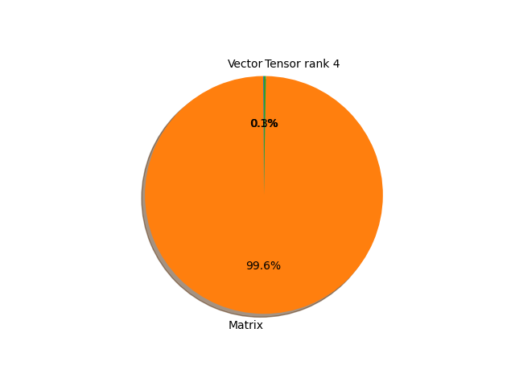

# vit_l_16 parameter information

**Number of layers: [ 296 ]**

**Number of parameters: [ 304.33M ]**

**Proportional of each form** (%)

| Vector | Matrix | Tensor rank 4 | 
|  --- | --- | --- |
| 66.55 | 33.11 | 0.34 | 

**Proportional of parameters by form** (%)

| Vector | Matrix | Tensor rank 4 | 
|  --- | --- | --- |
| 0.11 | 99.63 | 0.26 | 

**Layer information**

| Name | Shape | Squeezed shape | Number of parameters | Form |
| --- | --- | --- | --- | --- |
| class_token | (1, 1, 1024) | (1024,) | 1024 | Vector |
| conv_proj.weight | (1024, 3, 16, 16) | (1024, 3, 16, 16) | 786432 | Tensor rank 4 |
| conv_proj.bias | (1024,) | (1024,) | 1024 | Vector |
| encoder.pos_embedding | (1, 197, 1024) | (197, 1024) | 201728 | Matrix |
| encoder.layers.encoder_layer_0.ln_1.weight | (1024,) | (1024,) | 1024 | Vector |
| encoder.layers.encoder_layer_0.ln_1.bias | (1024,) | (1024,) | 1024 | Vector |
| encoder.layers.encoder_layer_0.self_attention.in_proj_weight | (3072, 1024) | (3072, 1024) | 3145728 | Matrix |
| encoder.layers.encoder_layer_0.self_attention.in_proj_bias | (3072,) | (3072,) | 3072 | Vector |
| encoder.layers.encoder_layer_0.self_attention.out_proj.weight | (1024, 1024) | (1024, 1024) | 1048576 | Matrix |
| encoder.layers.encoder_layer_0.self_attention.out_proj.bias | (1024,) | (1024,) | 1024 | Vector |
| encoder.layers.encoder_layer_0.ln_2.weight | (1024,) | (1024,) | 1024 | Vector |
| encoder.layers.encoder_layer_0.ln_2.bias | (1024,) | (1024,) | 1024 | Vector |
| encoder.layers.encoder_layer_0.mlp.0.weight | (4096, 1024) | (4096, 1024) | 4194304 | Matrix |
| encoder.layers.encoder_layer_0.mlp.0.bias | (4096,) | (4096,) | 4096 | Vector |
| encoder.layers.encoder_layer_0.mlp.3.weight | (1024, 4096) | (1024, 4096) | 4194304 | Matrix |
| encoder.layers.encoder_layer_0.mlp.3.bias | (1024,) | (1024,) | 1024 | Vector |
| encoder.layers.encoder_layer_1.ln_1.weight | (1024,) | (1024,) | 1024 | Vector |
| encoder.layers.encoder_layer_1.ln_1.bias | (1024,) | (1024,) | 1024 | Vector |
| encoder.layers.encoder_layer_1.self_attention.in_proj_weight | (3072, 1024) | (3072, 1024) | 3145728 | Matrix |
| encoder.layers.encoder_layer_1.self_attention.in_proj_bias | (3072,) | (3072,) | 3072 | Vector |
| encoder.layers.encoder_layer_1.self_attention.out_proj.weight | (1024, 1024) | (1024, 1024) | 1048576 | Matrix |
| encoder.layers.encoder_layer_1.self_attention.out_proj.bias | (1024,) | (1024,) | 1024 | Vector |
| encoder.layers.encoder_layer_1.ln_2.weight | (1024,) | (1024,) | 1024 | Vector |
| encoder.layers.encoder_layer_1.ln_2.bias | (1024,) | (1024,) | 1024 | Vector |
| encoder.layers.encoder_layer_1.mlp.0.weight | (4096, 1024) | (4096, 1024) | 4194304 | Matrix |
| encoder.layers.encoder_layer_1.mlp.0.bias | (4096,) | (4096,) | 4096 | Vector |
| encoder.layers.encoder_layer_1.mlp.3.weight | (1024, 4096) | (1024, 4096) | 4194304 | Matrix |
| encoder.layers.encoder_layer_1.mlp.3.bias | (1024,) | (1024,) | 1024 | Vector |
| encoder.layers.encoder_layer_2.ln_1.weight | (1024,) | (1024,) | 1024 | Vector |
| encoder.layers.encoder_layer_2.ln_1.bias | (1024,) | (1024,) | 1024 | Vector |
| encoder.layers.encoder_layer_2.self_attention.in_proj_weight | (3072, 1024) | (3072, 1024) | 3145728 | Matrix |
| encoder.layers.encoder_layer_2.self_attention.in_proj_bias | (3072,) | (3072,) | 3072 | Vector |
| encoder.layers.encoder_layer_2.self_attention.out_proj.weight | (1024, 1024) | (1024, 1024) | 1048576 | Matrix |
| encoder.layers.encoder_layer_2.self_attention.out_proj.bias | (1024,) | (1024,) | 1024 | Vector |
| encoder.layers.encoder_layer_2.ln_2.weight | (1024,) | (1024,) | 1024 | Vector |
| encoder.layers.encoder_layer_2.ln_2.bias | (1024,) | (1024,) | 1024 | Vector |
| encoder.layers.encoder_layer_2.mlp.0.weight | (4096, 1024) | (4096, 1024) | 4194304 | Matrix |
| encoder.layers.encoder_layer_2.mlp.0.bias | (4096,) | (4096,) | 4096 | Vector |
| encoder.layers.encoder_layer_2.mlp.3.weight | (1024, 4096) | (1024, 4096) | 4194304 | Matrix |
| encoder.layers.encoder_layer_2.mlp.3.bias | (1024,) | (1024,) | 1024 | Vector |
| encoder.layers.encoder_layer_3.ln_1.weight | (1024,) | (1024,) | 1024 | Vector |
| encoder.layers.encoder_layer_3.ln_1.bias | (1024,) | (1024,) | 1024 | Vector |
| encoder.layers.encoder_layer_3.self_attention.in_proj_weight | (3072, 1024) | (3072, 1024) | 3145728 | Matrix |
| encoder.layers.encoder_layer_3.self_attention.in_proj_bias | (3072,) | (3072,) | 3072 | Vector |
| encoder.layers.encoder_layer_3.self_attention.out_proj.weight | (1024, 1024) | (1024, 1024) | 1048576 | Matrix |
| encoder.layers.encoder_layer_3.self_attention.out_proj.bias | (1024,) | (1024,) | 1024 | Vector |
| encoder.layers.encoder_layer_3.ln_2.weight | (1024,) | (1024,) | 1024 | Vector |
| encoder.layers.encoder_layer_3.ln_2.bias | (1024,) | (1024,) | 1024 | Vector |
| encoder.layers.encoder_layer_3.mlp.0.weight | (4096, 1024) | (4096, 1024) | 4194304 | Matrix |
| encoder.layers.encoder_layer_3.mlp.0.bias | (4096,) | (4096,) | 4096 | Vector |
| encoder.layers.encoder_layer_3.mlp.3.weight | (1024, 4096) | (1024, 4096) | 4194304 | Matrix |
| encoder.layers.encoder_layer_3.mlp.3.bias | (1024,) | (1024,) | 1024 | Vector |
| encoder.layers.encoder_layer_4.ln_1.weight | (1024,) | (1024,) | 1024 | Vector |
| encoder.layers.encoder_layer_4.ln_1.bias | (1024,) | (1024,) | 1024 | Vector |
| encoder.layers.encoder_layer_4.self_attention.in_proj_weight | (3072, 1024) | (3072, 1024) | 3145728 | Matrix |
| encoder.layers.encoder_layer_4.self_attention.in_proj_bias | (3072,) | (3072,) | 3072 | Vector |
| encoder.layers.encoder_layer_4.self_attention.out_proj.weight | (1024, 1024) | (1024, 1024) | 1048576 | Matrix |
| encoder.layers.encoder_layer_4.self_attention.out_proj.bias | (1024,) | (1024,) | 1024 | Vector |
| encoder.layers.encoder_layer_4.ln_2.weight | (1024,) | (1024,) | 1024 | Vector |
| encoder.layers.encoder_layer_4.ln_2.bias | (1024,) | (1024,) | 1024 | Vector |
| encoder.layers.encoder_layer_4.mlp.0.weight | (4096, 1024) | (4096, 1024) | 4194304 | Matrix |
| encoder.layers.encoder_layer_4.mlp.0.bias | (4096,) | (4096,) | 4096 | Vector |
| encoder.layers.encoder_layer_4.mlp.3.weight | (1024, 4096) | (1024, 4096) | 4194304 | Matrix |
| encoder.layers.encoder_layer_4.mlp.3.bias | (1024,) | (1024,) | 1024 | Vector |
| encoder.layers.encoder_layer_5.ln_1.weight | (1024,) | (1024,) | 1024 | Vector |
| encoder.layers.encoder_layer_5.ln_1.bias | (1024,) | (1024,) | 1024 | Vector |
| encoder.layers.encoder_layer_5.self_attention.in_proj_weight | (3072, 1024) | (3072, 1024) | 3145728 | Matrix |
| encoder.layers.encoder_layer_5.self_attention.in_proj_bias | (3072,) | (3072,) | 3072 | Vector |
| encoder.layers.encoder_layer_5.self_attention.out_proj.weight | (1024, 1024) | (1024, 1024) | 1048576 | Matrix |
| encoder.layers.encoder_layer_5.self_attention.out_proj.bias | (1024,) | (1024,) | 1024 | Vector |
| encoder.layers.encoder_layer_5.ln_2.weight | (1024,) | (1024,) | 1024 | Vector |
| encoder.layers.encoder_layer_5.ln_2.bias | (1024,) | (1024,) | 1024 | Vector |
| encoder.layers.encoder_layer_5.mlp.0.weight | (4096, 1024) | (4096, 1024) | 4194304 | Matrix |
| encoder.layers.encoder_layer_5.mlp.0.bias | (4096,) | (4096,) | 4096 | Vector |
| encoder.layers.encoder_layer_5.mlp.3.weight | (1024, 4096) | (1024, 4096) | 4194304 | Matrix |
| encoder.layers.encoder_layer_5.mlp.3.bias | (1024,) | (1024,) | 1024 | Vector |
| encoder.layers.encoder_layer_6.ln_1.weight | (1024,) | (1024,) | 1024 | Vector |
| encoder.layers.encoder_layer_6.ln_1.bias | (1024,) | (1024,) | 1024 | Vector |
| encoder.layers.encoder_layer_6.self_attention.in_proj_weight | (3072, 1024) | (3072, 1024) | 3145728 | Matrix |
| encoder.layers.encoder_layer_6.self_attention.in_proj_bias | (3072,) | (3072,) | 3072 | Vector |
| encoder.layers.encoder_layer_6.self_attention.out_proj.weight | (1024, 1024) | (1024, 1024) | 1048576 | Matrix |
| encoder.layers.encoder_layer_6.self_attention.out_proj.bias | (1024,) | (1024,) | 1024 | Vector |
| encoder.layers.encoder_layer_6.ln_2.weight | (1024,) | (1024,) | 1024 | Vector |
| encoder.layers.encoder_layer_6.ln_2.bias | (1024,) | (1024,) | 1024 | Vector |
| encoder.layers.encoder_layer_6.mlp.0.weight | (4096, 1024) | (4096, 1024) | 4194304 | Matrix |
| encoder.layers.encoder_layer_6.mlp.0.bias | (4096,) | (4096,) | 4096 | Vector |
| encoder.layers.encoder_layer_6.mlp.3.weight | (1024, 4096) | (1024, 4096) | 4194304 | Matrix |
| encoder.layers.encoder_layer_6.mlp.3.bias | (1024,) | (1024,) | 1024 | Vector |
| encoder.layers.encoder_layer_7.ln_1.weight | (1024,) | (1024,) | 1024 | Vector |
| encoder.layers.encoder_layer_7.ln_1.bias | (1024,) | (1024,) | 1024 | Vector |
| encoder.layers.encoder_layer_7.self_attention.in_proj_weight | (3072, 1024) | (3072, 1024) | 3145728 | Matrix |
| encoder.layers.encoder_layer_7.self_attention.in_proj_bias | (3072,) | (3072,) | 3072 | Vector |
| encoder.layers.encoder_layer_7.self_attention.out_proj.weight | (1024, 1024) | (1024, 1024) | 1048576 | Matrix |
| encoder.layers.encoder_layer_7.self_attention.out_proj.bias | (1024,) | (1024,) | 1024 | Vector |
| encoder.layers.encoder_layer_7.ln_2.weight | (1024,) | (1024,) | 1024 | Vector |
| encoder.layers.encoder_layer_7.ln_2.bias | (1024,) | (1024,) | 1024 | Vector |
| encoder.layers.encoder_layer_7.mlp.0.weight | (4096, 1024) | (4096, 1024) | 4194304 | Matrix |
| encoder.layers.encoder_layer_7.mlp.0.bias | (4096,) | (4096,) | 4096 | Vector |
| encoder.layers.encoder_layer_7.mlp.3.weight | (1024, 4096) | (1024, 4096) | 4194304 | Matrix |
| encoder.layers.encoder_layer_7.mlp.3.bias | (1024,) | (1024,) | 1024 | Vector |
| encoder.layers.encoder_layer_8.ln_1.weight | (1024,) | (1024,) | 1024 | Vector |
| encoder.layers.encoder_layer_8.ln_1.bias | (1024,) | (1024,) | 1024 | Vector |
| encoder.layers.encoder_layer_8.self_attention.in_proj_weight | (3072, 1024) | (3072, 1024) | 3145728 | Matrix |
| encoder.layers.encoder_layer_8.self_attention.in_proj_bias | (3072,) | (3072,) | 3072 | Vector |
| encoder.layers.encoder_layer_8.self_attention.out_proj.weight | (1024, 1024) | (1024, 1024) | 1048576 | Matrix |
| encoder.layers.encoder_layer_8.self_attention.out_proj.bias | (1024,) | (1024,) | 1024 | Vector |
| encoder.layers.encoder_layer_8.ln_2.weight | (1024,) | (1024,) | 1024 | Vector |
| encoder.layers.encoder_layer_8.ln_2.bias | (1024,) | (1024,) | 1024 | Vector |
| encoder.layers.encoder_layer_8.mlp.0.weight | (4096, 1024) | (4096, 1024) | 4194304 | Matrix |
| encoder.layers.encoder_layer_8.mlp.0.bias | (4096,) | (4096,) | 4096 | Vector |
| encoder.layers.encoder_layer_8.mlp.3.weight | (1024, 4096) | (1024, 4096) | 4194304 | Matrix |
| encoder.layers.encoder_layer_8.mlp.3.bias | (1024,) | (1024,) | 1024 | Vector |
| encoder.layers.encoder_layer_9.ln_1.weight | (1024,) | (1024,) | 1024 | Vector |
| encoder.layers.encoder_layer_9.ln_1.bias | (1024,) | (1024,) | 1024 | Vector |
| encoder.layers.encoder_layer_9.self_attention.in_proj_weight | (3072, 1024) | (3072, 1024) | 3145728 | Matrix |
| encoder.layers.encoder_layer_9.self_attention.in_proj_bias | (3072,) | (3072,) | 3072 | Vector |
| encoder.layers.encoder_layer_9.self_attention.out_proj.weight | (1024, 1024) | (1024, 1024) | 1048576 | Matrix |
| encoder.layers.encoder_layer_9.self_attention.out_proj.bias | (1024,) | (1024,) | 1024 | Vector |
| encoder.layers.encoder_layer_9.ln_2.weight | (1024,) | (1024,) | 1024 | Vector |
| encoder.layers.encoder_layer_9.ln_2.bias | (1024,) | (1024,) | 1024 | Vector |
| encoder.layers.encoder_layer_9.mlp.0.weight | (4096, 1024) | (4096, 1024) | 4194304 | Matrix |
| encoder.layers.encoder_layer_9.mlp.0.bias | (4096,) | (4096,) | 4096 | Vector |
| encoder.layers.encoder_layer_9.mlp.3.weight | (1024, 4096) | (1024, 4096) | 4194304 | Matrix |
| encoder.layers.encoder_layer_9.mlp.3.bias | (1024,) | (1024,) | 1024 | Vector |
| encoder.layers.encoder_layer_10.ln_1.weight | (1024,) | (1024,) | 1024 | Vector |
| encoder.layers.encoder_layer_10.ln_1.bias | (1024,) | (1024,) | 1024 | Vector |
| encoder.layers.encoder_layer_10.self_attention.in_proj_weight | (3072, 1024) | (3072, 1024) | 3145728 | Matrix |
| encoder.layers.encoder_layer_10.self_attention.in_proj_bias | (3072,) | (3072,) | 3072 | Vector |
| encoder.layers.encoder_layer_10.self_attention.out_proj.weight | (1024, 1024) | (1024, 1024) | 1048576 | Matrix |
| encoder.layers.encoder_layer_10.self_attention.out_proj.bias | (1024,) | (1024,) | 1024 | Vector |
| encoder.layers.encoder_layer_10.ln_2.weight | (1024,) | (1024,) | 1024 | Vector |
| encoder.layers.encoder_layer_10.ln_2.bias | (1024,) | (1024,) | 1024 | Vector |
| encoder.layers.encoder_layer_10.mlp.0.weight | (4096, 1024) | (4096, 1024) | 4194304 | Matrix |
| encoder.layers.encoder_layer_10.mlp.0.bias | (4096,) | (4096,) | 4096 | Vector |
| encoder.layers.encoder_layer_10.mlp.3.weight | (1024, 4096) | (1024, 4096) | 4194304 | Matrix |
| encoder.layers.encoder_layer_10.mlp.3.bias | (1024,) | (1024,) | 1024 | Vector |
| encoder.layers.encoder_layer_11.ln_1.weight | (1024,) | (1024,) | 1024 | Vector |
| encoder.layers.encoder_layer_11.ln_1.bias | (1024,) | (1024,) | 1024 | Vector |
| encoder.layers.encoder_layer_11.self_attention.in_proj_weight | (3072, 1024) | (3072, 1024) | 3145728 | Matrix |
| encoder.layers.encoder_layer_11.self_attention.in_proj_bias | (3072,) | (3072,) | 3072 | Vector |
| encoder.layers.encoder_layer_11.self_attention.out_proj.weight | (1024, 1024) | (1024, 1024) | 1048576 | Matrix |
| encoder.layers.encoder_layer_11.self_attention.out_proj.bias | (1024,) | (1024,) | 1024 | Vector |
| encoder.layers.encoder_layer_11.ln_2.weight | (1024,) | (1024,) | 1024 | Vector |
| encoder.layers.encoder_layer_11.ln_2.bias | (1024,) | (1024,) | 1024 | Vector |
| encoder.layers.encoder_layer_11.mlp.0.weight | (4096, 1024) | (4096, 1024) | 4194304 | Matrix |
| encoder.layers.encoder_layer_11.mlp.0.bias | (4096,) | (4096,) | 4096 | Vector |
| encoder.layers.encoder_layer_11.mlp.3.weight | (1024, 4096) | (1024, 4096) | 4194304 | Matrix |
| encoder.layers.encoder_layer_11.mlp.3.bias | (1024,) | (1024,) | 1024 | Vector |
| encoder.layers.encoder_layer_12.ln_1.weight | (1024,) | (1024,) | 1024 | Vector |
| encoder.layers.encoder_layer_12.ln_1.bias | (1024,) | (1024,) | 1024 | Vector |
| encoder.layers.encoder_layer_12.self_attention.in_proj_weight | (3072, 1024) | (3072, 1024) | 3145728 | Matrix |
| encoder.layers.encoder_layer_12.self_attention.in_proj_bias | (3072,) | (3072,) | 3072 | Vector |
| encoder.layers.encoder_layer_12.self_attention.out_proj.weight | (1024, 1024) | (1024, 1024) | 1048576 | Matrix |
| encoder.layers.encoder_layer_12.self_attention.out_proj.bias | (1024,) | (1024,) | 1024 | Vector |
| encoder.layers.encoder_layer_12.ln_2.weight | (1024,) | (1024,) | 1024 | Vector |
| encoder.layers.encoder_layer_12.ln_2.bias | (1024,) | (1024,) | 1024 | Vector |
| encoder.layers.encoder_layer_12.mlp.0.weight | (4096, 1024) | (4096, 1024) | 4194304 | Matrix |
| encoder.layers.encoder_layer_12.mlp.0.bias | (4096,) | (4096,) | 4096 | Vector |
| encoder.layers.encoder_layer_12.mlp.3.weight | (1024, 4096) | (1024, 4096) | 4194304 | Matrix |
| encoder.layers.encoder_layer_12.mlp.3.bias | (1024,) | (1024,) | 1024 | Vector |
| encoder.layers.encoder_layer_13.ln_1.weight | (1024,) | (1024,) | 1024 | Vector |
| encoder.layers.encoder_layer_13.ln_1.bias | (1024,) | (1024,) | 1024 | Vector |
| encoder.layers.encoder_layer_13.self_attention.in_proj_weight | (3072, 1024) | (3072, 1024) | 3145728 | Matrix |
| encoder.layers.encoder_layer_13.self_attention.in_proj_bias | (3072,) | (3072,) | 3072 | Vector |
| encoder.layers.encoder_layer_13.self_attention.out_proj.weight | (1024, 1024) | (1024, 1024) | 1048576 | Matrix |
| encoder.layers.encoder_layer_13.self_attention.out_proj.bias | (1024,) | (1024,) | 1024 | Vector |
| encoder.layers.encoder_layer_13.ln_2.weight | (1024,) | (1024,) | 1024 | Vector |
| encoder.layers.encoder_layer_13.ln_2.bias | (1024,) | (1024,) | 1024 | Vector |
| encoder.layers.encoder_layer_13.mlp.0.weight | (4096, 1024) | (4096, 1024) | 4194304 | Matrix |
| encoder.layers.encoder_layer_13.mlp.0.bias | (4096,) | (4096,) | 4096 | Vector |
| encoder.layers.encoder_layer_13.mlp.3.weight | (1024, 4096) | (1024, 4096) | 4194304 | Matrix |
| encoder.layers.encoder_layer_13.mlp.3.bias | (1024,) | (1024,) | 1024 | Vector |
| encoder.layers.encoder_layer_14.ln_1.weight | (1024,) | (1024,) | 1024 | Vector |
| encoder.layers.encoder_layer_14.ln_1.bias | (1024,) | (1024,) | 1024 | Vector |
| encoder.layers.encoder_layer_14.self_attention.in_proj_weight | (3072, 1024) | (3072, 1024) | 3145728 | Matrix |
| encoder.layers.encoder_layer_14.self_attention.in_proj_bias | (3072,) | (3072,) | 3072 | Vector |
| encoder.layers.encoder_layer_14.self_attention.out_proj.weight | (1024, 1024) | (1024, 1024) | 1048576 | Matrix |
| encoder.layers.encoder_layer_14.self_attention.out_proj.bias | (1024,) | (1024,) | 1024 | Vector |
| encoder.layers.encoder_layer_14.ln_2.weight | (1024,) | (1024,) | 1024 | Vector |
| encoder.layers.encoder_layer_14.ln_2.bias | (1024,) | (1024,) | 1024 | Vector |
| encoder.layers.encoder_layer_14.mlp.0.weight | (4096, 1024) | (4096, 1024) | 4194304 | Matrix |
| encoder.layers.encoder_layer_14.mlp.0.bias | (4096,) | (4096,) | 4096 | Vector |
| encoder.layers.encoder_layer_14.mlp.3.weight | (1024, 4096) | (1024, 4096) | 4194304 | Matrix |
| encoder.layers.encoder_layer_14.mlp.3.bias | (1024,) | (1024,) | 1024 | Vector |
| encoder.layers.encoder_layer_15.ln_1.weight | (1024,) | (1024,) | 1024 | Vector |
| encoder.layers.encoder_layer_15.ln_1.bias | (1024,) | (1024,) | 1024 | Vector |
| encoder.layers.encoder_layer_15.self_attention.in_proj_weight | (3072, 1024) | (3072, 1024) | 3145728 | Matrix |
| encoder.layers.encoder_layer_15.self_attention.in_proj_bias | (3072,) | (3072,) | 3072 | Vector |
| encoder.layers.encoder_layer_15.self_attention.out_proj.weight | (1024, 1024) | (1024, 1024) | 1048576 | Matrix |
| encoder.layers.encoder_layer_15.self_attention.out_proj.bias | (1024,) | (1024,) | 1024 | Vector |
| encoder.layers.encoder_layer_15.ln_2.weight | (1024,) | (1024,) | 1024 | Vector |
| encoder.layers.encoder_layer_15.ln_2.bias | (1024,) | (1024,) | 1024 | Vector |
| encoder.layers.encoder_layer_15.mlp.0.weight | (4096, 1024) | (4096, 1024) | 4194304 | Matrix |
| encoder.layers.encoder_layer_15.mlp.0.bias | (4096,) | (4096,) | 4096 | Vector |
| encoder.layers.encoder_layer_15.mlp.3.weight | (1024, 4096) | (1024, 4096) | 4194304 | Matrix |
| encoder.layers.encoder_layer_15.mlp.3.bias | (1024,) | (1024,) | 1024 | Vector |
| encoder.layers.encoder_layer_16.ln_1.weight | (1024,) | (1024,) | 1024 | Vector |
| encoder.layers.encoder_layer_16.ln_1.bias | (1024,) | (1024,) | 1024 | Vector |
| encoder.layers.encoder_layer_16.self_attention.in_proj_weight | (3072, 1024) | (3072, 1024) | 3145728 | Matrix |
| encoder.layers.encoder_layer_16.self_attention.in_proj_bias | (3072,) | (3072,) | 3072 | Vector |
| encoder.layers.encoder_layer_16.self_attention.out_proj.weight | (1024, 1024) | (1024, 1024) | 1048576 | Matrix |
| encoder.layers.encoder_layer_16.self_attention.out_proj.bias | (1024,) | (1024,) | 1024 | Vector |
| encoder.layers.encoder_layer_16.ln_2.weight | (1024,) | (1024,) | 1024 | Vector |
| encoder.layers.encoder_layer_16.ln_2.bias | (1024,) | (1024,) | 1024 | Vector |
| encoder.layers.encoder_layer_16.mlp.0.weight | (4096, 1024) | (4096, 1024) | 4194304 | Matrix |
| encoder.layers.encoder_layer_16.mlp.0.bias | (4096,) | (4096,) | 4096 | Vector |
| encoder.layers.encoder_layer_16.mlp.3.weight | (1024, 4096) | (1024, 4096) | 4194304 | Matrix |
| encoder.layers.encoder_layer_16.mlp.3.bias | (1024,) | (1024,) | 1024 | Vector |
| encoder.layers.encoder_layer_17.ln_1.weight | (1024,) | (1024,) | 1024 | Vector |
| encoder.layers.encoder_layer_17.ln_1.bias | (1024,) | (1024,) | 1024 | Vector |
| encoder.layers.encoder_layer_17.self_attention.in_proj_weight | (3072, 1024) | (3072, 1024) | 3145728 | Matrix |
| encoder.layers.encoder_layer_17.self_attention.in_proj_bias | (3072,) | (3072,) | 3072 | Vector |
| encoder.layers.encoder_layer_17.self_attention.out_proj.weight | (1024, 1024) | (1024, 1024) | 1048576 | Matrix |
| encoder.layers.encoder_layer_17.self_attention.out_proj.bias | (1024,) | (1024,) | 1024 | Vector |
| encoder.layers.encoder_layer_17.ln_2.weight | (1024,) | (1024,) | 1024 | Vector |
| encoder.layers.encoder_layer_17.ln_2.bias | (1024,) | (1024,) | 1024 | Vector |
| encoder.layers.encoder_layer_17.mlp.0.weight | (4096, 1024) | (4096, 1024) | 4194304 | Matrix |
| encoder.layers.encoder_layer_17.mlp.0.bias | (4096,) | (4096,) | 4096 | Vector |
| encoder.layers.encoder_layer_17.mlp.3.weight | (1024, 4096) | (1024, 4096) | 4194304 | Matrix |
| encoder.layers.encoder_layer_17.mlp.3.bias | (1024,) | (1024,) | 1024 | Vector |
| encoder.layers.encoder_layer_18.ln_1.weight | (1024,) | (1024,) | 1024 | Vector |
| encoder.layers.encoder_layer_18.ln_1.bias | (1024,) | (1024,) | 1024 | Vector |
| encoder.layers.encoder_layer_18.self_attention.in_proj_weight | (3072, 1024) | (3072, 1024) | 3145728 | Matrix |
| encoder.layers.encoder_layer_18.self_attention.in_proj_bias | (3072,) | (3072,) | 3072 | Vector |
| encoder.layers.encoder_layer_18.self_attention.out_proj.weight | (1024, 1024) | (1024, 1024) | 1048576 | Matrix |
| encoder.layers.encoder_layer_18.self_attention.out_proj.bias | (1024,) | (1024,) | 1024 | Vector |
| encoder.layers.encoder_layer_18.ln_2.weight | (1024,) | (1024,) | 1024 | Vector |
| encoder.layers.encoder_layer_18.ln_2.bias | (1024,) | (1024,) | 1024 | Vector |
| encoder.layers.encoder_layer_18.mlp.0.weight | (4096, 1024) | (4096, 1024) | 4194304 | Matrix |
| encoder.layers.encoder_layer_18.mlp.0.bias | (4096,) | (4096,) | 4096 | Vector |
| encoder.layers.encoder_layer_18.mlp.3.weight | (1024, 4096) | (1024, 4096) | 4194304 | Matrix |
| encoder.layers.encoder_layer_18.mlp.3.bias | (1024,) | (1024,) | 1024 | Vector |
| encoder.layers.encoder_layer_19.ln_1.weight | (1024,) | (1024,) | 1024 | Vector |
| encoder.layers.encoder_layer_19.ln_1.bias | (1024,) | (1024,) | 1024 | Vector |
| encoder.layers.encoder_layer_19.self_attention.in_proj_weight | (3072, 1024) | (3072, 1024) | 3145728 | Matrix |
| encoder.layers.encoder_layer_19.self_attention.in_proj_bias | (3072,) | (3072,) | 3072 | Vector |
| encoder.layers.encoder_layer_19.self_attention.out_proj.weight | (1024, 1024) | (1024, 1024) | 1048576 | Matrix |
| encoder.layers.encoder_layer_19.self_attention.out_proj.bias | (1024,) | (1024,) | 1024 | Vector |
| encoder.layers.encoder_layer_19.ln_2.weight | (1024,) | (1024,) | 1024 | Vector |
| encoder.layers.encoder_layer_19.ln_2.bias | (1024,) | (1024,) | 1024 | Vector |
| encoder.layers.encoder_layer_19.mlp.0.weight | (4096, 1024) | (4096, 1024) | 4194304 | Matrix |
| encoder.layers.encoder_layer_19.mlp.0.bias | (4096,) | (4096,) | 4096 | Vector |
| encoder.layers.encoder_layer_19.mlp.3.weight | (1024, 4096) | (1024, 4096) | 4194304 | Matrix |
| encoder.layers.encoder_layer_19.mlp.3.bias | (1024,) | (1024,) | 1024 | Vector |
| encoder.layers.encoder_layer_20.ln_1.weight | (1024,) | (1024,) | 1024 | Vector |
| encoder.layers.encoder_layer_20.ln_1.bias | (1024,) | (1024,) | 1024 | Vector |
| encoder.layers.encoder_layer_20.self_attention.in_proj_weight | (3072, 1024) | (3072, 1024) | 3145728 | Matrix |
| encoder.layers.encoder_layer_20.self_attention.in_proj_bias | (3072,) | (3072,) | 3072 | Vector |
| encoder.layers.encoder_layer_20.self_attention.out_proj.weight | (1024, 1024) | (1024, 1024) | 1048576 | Matrix |
| encoder.layers.encoder_layer_20.self_attention.out_proj.bias | (1024,) | (1024,) | 1024 | Vector |
| encoder.layers.encoder_layer_20.ln_2.weight | (1024,) | (1024,) | 1024 | Vector |
| encoder.layers.encoder_layer_20.ln_2.bias | (1024,) | (1024,) | 1024 | Vector |
| encoder.layers.encoder_layer_20.mlp.0.weight | (4096, 1024) | (4096, 1024) | 4194304 | Matrix |
| encoder.layers.encoder_layer_20.mlp.0.bias | (4096,) | (4096,) | 4096 | Vector |
| encoder.layers.encoder_layer_20.mlp.3.weight | (1024, 4096) | (1024, 4096) | 4194304 | Matrix |
| encoder.layers.encoder_layer_20.mlp.3.bias | (1024,) | (1024,) | 1024 | Vector |
| encoder.layers.encoder_layer_21.ln_1.weight | (1024,) | (1024,) | 1024 | Vector |
| encoder.layers.encoder_layer_21.ln_1.bias | (1024,) | (1024,) | 1024 | Vector |
| encoder.layers.encoder_layer_21.self_attention.in_proj_weight | (3072, 1024) | (3072, 1024) | 3145728 | Matrix |
| encoder.layers.encoder_layer_21.self_attention.in_proj_bias | (3072,) | (3072,) | 3072 | Vector |
| encoder.layers.encoder_layer_21.self_attention.out_proj.weight | (1024, 1024) | (1024, 1024) | 1048576 | Matrix |
| encoder.layers.encoder_layer_21.self_attention.out_proj.bias | (1024,) | (1024,) | 1024 | Vector |
| encoder.layers.encoder_layer_21.ln_2.weight | (1024,) | (1024,) | 1024 | Vector |
| encoder.layers.encoder_layer_21.ln_2.bias | (1024,) | (1024,) | 1024 | Vector |
| encoder.layers.encoder_layer_21.mlp.0.weight | (4096, 1024) | (4096, 1024) | 4194304 | Matrix |
| encoder.layers.encoder_layer_21.mlp.0.bias | (4096,) | (4096,) | 4096 | Vector |
| encoder.layers.encoder_layer_21.mlp.3.weight | (1024, 4096) | (1024, 4096) | 4194304 | Matrix |
| encoder.layers.encoder_layer_21.mlp.3.bias | (1024,) | (1024,) | 1024 | Vector |
| encoder.layers.encoder_layer_22.ln_1.weight | (1024,) | (1024,) | 1024 | Vector |
| encoder.layers.encoder_layer_22.ln_1.bias | (1024,) | (1024,) | 1024 | Vector |
| encoder.layers.encoder_layer_22.self_attention.in_proj_weight | (3072, 1024) | (3072, 1024) | 3145728 | Matrix |
| encoder.layers.encoder_layer_22.self_attention.in_proj_bias | (3072,) | (3072,) | 3072 | Vector |
| encoder.layers.encoder_layer_22.self_attention.out_proj.weight | (1024, 1024) | (1024, 1024) | 1048576 | Matrix |
| encoder.layers.encoder_layer_22.self_attention.out_proj.bias | (1024,) | (1024,) | 1024 | Vector |
| encoder.layers.encoder_layer_22.ln_2.weight | (1024,) | (1024,) | 1024 | Vector |
| encoder.layers.encoder_layer_22.ln_2.bias | (1024,) | (1024,) | 1024 | Vector |
| encoder.layers.encoder_layer_22.mlp.0.weight | (4096, 1024) | (4096, 1024) | 4194304 | Matrix |
| encoder.layers.encoder_layer_22.mlp.0.bias | (4096,) | (4096,) | 4096 | Vector |
| encoder.layers.encoder_layer_22.mlp.3.weight | (1024, 4096) | (1024, 4096) | 4194304 | Matrix |
| encoder.layers.encoder_layer_22.mlp.3.bias | (1024,) | (1024,) | 1024 | Vector |
| encoder.layers.encoder_layer_23.ln_1.weight | (1024,) | (1024,) | 1024 | Vector |
| encoder.layers.encoder_layer_23.ln_1.bias | (1024,) | (1024,) | 1024 | Vector |
| encoder.layers.encoder_layer_23.self_attention.in_proj_weight | (3072, 1024) | (3072, 1024) | 3145728 | Matrix |
| encoder.layers.encoder_layer_23.self_attention.in_proj_bias | (3072,) | (3072,) | 3072 | Vector |
| encoder.layers.encoder_layer_23.self_attention.out_proj.weight | (1024, 1024) | (1024, 1024) | 1048576 | Matrix |
| encoder.layers.encoder_layer_23.self_attention.out_proj.bias | (1024,) | (1024,) | 1024 | Vector |
| encoder.layers.encoder_layer_23.ln_2.weight | (1024,) | (1024,) | 1024 | Vector |
| encoder.layers.encoder_layer_23.ln_2.bias | (1024,) | (1024,) | 1024 | Vector |
| encoder.layers.encoder_layer_23.mlp.0.weight | (4096, 1024) | (4096, 1024) | 4194304 | Matrix |
| encoder.layers.encoder_layer_23.mlp.0.bias | (4096,) | (4096,) | 4096 | Vector |
| encoder.layers.encoder_layer_23.mlp.3.weight | (1024, 4096) | (1024, 4096) | 4194304 | Matrix |
| encoder.layers.encoder_layer_23.mlp.3.bias | (1024,) | (1024,) | 1024 | Vector |
| encoder.ln.weight | (1024,) | (1024,) | 1024 | Vector |
| encoder.ln.bias | (1024,) | (1024,) | 1024 | Vector |
| heads.head.weight | (1000, 1024) | (1000, 1024) | 1024000 | Matrix |
| heads.head.bias | (1000,) | (1000,) | 1000 | Vector |

