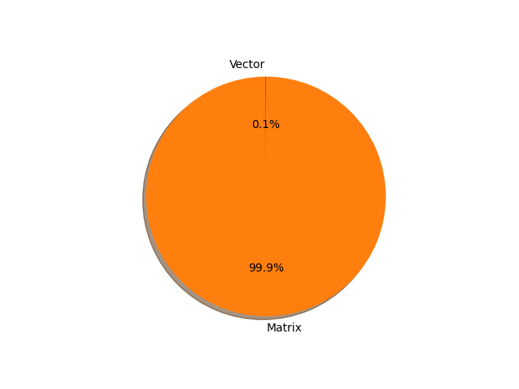

# bert-base-cased parameter information

**Number of layers: [ 201 ]**

**Number of parameters: [ 108.31M ]**

**Proportional of each form** (%)

| Vector | Matrix | 
|  --- | --- |
| 61.69 | 38.31 | 

**Proportional of parameters by form** (%)

| Vector | Matrix | 
|  --- | --- |
| 0.11 | 99.89 | 

**Layer information**

| Name | Shape | Squeezed shape | Number of parameters | Form |
| --- | --- | --- | --- | --- |
| bert.embeddings.word_embeddings.weight | (28996, 768) | (28996, 768) | 22268928 | Matrix |
| bert.embeddings.position_embeddings.weight | (512, 768) | (512, 768) | 393216 | Matrix |
| bert.embeddings.token_type_embeddings.weight | (2, 768) | (2, 768) | 1536 | Matrix |
| bert.embeddings.LayerNorm.weight | (768,) | (768,) | 768 | Vector |
| bert.embeddings.LayerNorm.bias | (768,) | (768,) | 768 | Vector |
| bert.encoder.layer.0.attention.self.query.weight | (768, 768) | (768, 768) | 589824 | Matrix |
| bert.encoder.layer.0.attention.self.query.bias | (768,) | (768,) | 768 | Vector |
| bert.encoder.layer.0.attention.self.key.weight | (768, 768) | (768, 768) | 589824 | Matrix |
| bert.encoder.layer.0.attention.self.key.bias | (768,) | (768,) | 768 | Vector |
| bert.encoder.layer.0.attention.self.value.weight | (768, 768) | (768, 768) | 589824 | Matrix |
| bert.encoder.layer.0.attention.self.value.bias | (768,) | (768,) | 768 | Vector |
| bert.encoder.layer.0.attention.output.dense.weight | (768, 768) | (768, 768) | 589824 | Matrix |
| bert.encoder.layer.0.attention.output.dense.bias | (768,) | (768,) | 768 | Vector |
| bert.encoder.layer.0.attention.output.LayerNorm.weight | (768,) | (768,) | 768 | Vector |
| bert.encoder.layer.0.attention.output.LayerNorm.bias | (768,) | (768,) | 768 | Vector |
| bert.encoder.layer.0.intermediate.dense.weight | (3072, 768) | (3072, 768) | 2359296 | Matrix |
| bert.encoder.layer.0.intermediate.dense.bias | (3072,) | (3072,) | 3072 | Vector |
| bert.encoder.layer.0.output.dense.weight | (768, 3072) | (768, 3072) | 2359296 | Matrix |
| bert.encoder.layer.0.output.dense.bias | (768,) | (768,) | 768 | Vector |
| bert.encoder.layer.0.output.LayerNorm.weight | (768,) | (768,) | 768 | Vector |
| bert.encoder.layer.0.output.LayerNorm.bias | (768,) | (768,) | 768 | Vector |
| bert.encoder.layer.1.attention.self.query.weight | (768, 768) | (768, 768) | 589824 | Matrix |
| bert.encoder.layer.1.attention.self.query.bias | (768,) | (768,) | 768 | Vector |
| bert.encoder.layer.1.attention.self.key.weight | (768, 768) | (768, 768) | 589824 | Matrix |
| bert.encoder.layer.1.attention.self.key.bias | (768,) | (768,) | 768 | Vector |
| bert.encoder.layer.1.attention.self.value.weight | (768, 768) | (768, 768) | 589824 | Matrix |
| bert.encoder.layer.1.attention.self.value.bias | (768,) | (768,) | 768 | Vector |
| bert.encoder.layer.1.attention.output.dense.weight | (768, 768) | (768, 768) | 589824 | Matrix |
| bert.encoder.layer.1.attention.output.dense.bias | (768,) | (768,) | 768 | Vector |
| bert.encoder.layer.1.attention.output.LayerNorm.weight | (768,) | (768,) | 768 | Vector |
| bert.encoder.layer.1.attention.output.LayerNorm.bias | (768,) | (768,) | 768 | Vector |
| bert.encoder.layer.1.intermediate.dense.weight | (3072, 768) | (3072, 768) | 2359296 | Matrix |
| bert.encoder.layer.1.intermediate.dense.bias | (3072,) | (3072,) | 3072 | Vector |
| bert.encoder.layer.1.output.dense.weight | (768, 3072) | (768, 3072) | 2359296 | Matrix |
| bert.encoder.layer.1.output.dense.bias | (768,) | (768,) | 768 | Vector |
| bert.encoder.layer.1.output.LayerNorm.weight | (768,) | (768,) | 768 | Vector |
| bert.encoder.layer.1.output.LayerNorm.bias | (768,) | (768,) | 768 | Vector |
| bert.encoder.layer.2.attention.self.query.weight | (768, 768) | (768, 768) | 589824 | Matrix |
| bert.encoder.layer.2.attention.self.query.bias | (768,) | (768,) | 768 | Vector |
| bert.encoder.layer.2.attention.self.key.weight | (768, 768) | (768, 768) | 589824 | Matrix |
| bert.encoder.layer.2.attention.self.key.bias | (768,) | (768,) | 768 | Vector |
| bert.encoder.layer.2.attention.self.value.weight | (768, 768) | (768, 768) | 589824 | Matrix |
| bert.encoder.layer.2.attention.self.value.bias | (768,) | (768,) | 768 | Vector |
| bert.encoder.layer.2.attention.output.dense.weight | (768, 768) | (768, 768) | 589824 | Matrix |
| bert.encoder.layer.2.attention.output.dense.bias | (768,) | (768,) | 768 | Vector |
| bert.encoder.layer.2.attention.output.LayerNorm.weight | (768,) | (768,) | 768 | Vector |
| bert.encoder.layer.2.attention.output.LayerNorm.bias | (768,) | (768,) | 768 | Vector |
| bert.encoder.layer.2.intermediate.dense.weight | (3072, 768) | (3072, 768) | 2359296 | Matrix |
| bert.encoder.layer.2.intermediate.dense.bias | (3072,) | (3072,) | 3072 | Vector |
| bert.encoder.layer.2.output.dense.weight | (768, 3072) | (768, 3072) | 2359296 | Matrix |
| bert.encoder.layer.2.output.dense.bias | (768,) | (768,) | 768 | Vector |
| bert.encoder.layer.2.output.LayerNorm.weight | (768,) | (768,) | 768 | Vector |
| bert.encoder.layer.2.output.LayerNorm.bias | (768,) | (768,) | 768 | Vector |
| bert.encoder.layer.3.attention.self.query.weight | (768, 768) | (768, 768) | 589824 | Matrix |
| bert.encoder.layer.3.attention.self.query.bias | (768,) | (768,) | 768 | Vector |
| bert.encoder.layer.3.attention.self.key.weight | (768, 768) | (768, 768) | 589824 | Matrix |
| bert.encoder.layer.3.attention.self.key.bias | (768,) | (768,) | 768 | Vector |
| bert.encoder.layer.3.attention.self.value.weight | (768, 768) | (768, 768) | 589824 | Matrix |
| bert.encoder.layer.3.attention.self.value.bias | (768,) | (768,) | 768 | Vector |
| bert.encoder.layer.3.attention.output.dense.weight | (768, 768) | (768, 768) | 589824 | Matrix |
| bert.encoder.layer.3.attention.output.dense.bias | (768,) | (768,) | 768 | Vector |
| bert.encoder.layer.3.attention.output.LayerNorm.weight | (768,) | (768,) | 768 | Vector |
| bert.encoder.layer.3.attention.output.LayerNorm.bias | (768,) | (768,) | 768 | Vector |
| bert.encoder.layer.3.intermediate.dense.weight | (3072, 768) | (3072, 768) | 2359296 | Matrix |
| bert.encoder.layer.3.intermediate.dense.bias | (3072,) | (3072,) | 3072 | Vector |
| bert.encoder.layer.3.output.dense.weight | (768, 3072) | (768, 3072) | 2359296 | Matrix |
| bert.encoder.layer.3.output.dense.bias | (768,) | (768,) | 768 | Vector |
| bert.encoder.layer.3.output.LayerNorm.weight | (768,) | (768,) | 768 | Vector |
| bert.encoder.layer.3.output.LayerNorm.bias | (768,) | (768,) | 768 | Vector |
| bert.encoder.layer.4.attention.self.query.weight | (768, 768) | (768, 768) | 589824 | Matrix |
| bert.encoder.layer.4.attention.self.query.bias | (768,) | (768,) | 768 | Vector |
| bert.encoder.layer.4.attention.self.key.weight | (768, 768) | (768, 768) | 589824 | Matrix |
| bert.encoder.layer.4.attention.self.key.bias | (768,) | (768,) | 768 | Vector |
| bert.encoder.layer.4.attention.self.value.weight | (768, 768) | (768, 768) | 589824 | Matrix |
| bert.encoder.layer.4.attention.self.value.bias | (768,) | (768,) | 768 | Vector |
| bert.encoder.layer.4.attention.output.dense.weight | (768, 768) | (768, 768) | 589824 | Matrix |
| bert.encoder.layer.4.attention.output.dense.bias | (768,) | (768,) | 768 | Vector |
| bert.encoder.layer.4.attention.output.LayerNorm.weight | (768,) | (768,) | 768 | Vector |
| bert.encoder.layer.4.attention.output.LayerNorm.bias | (768,) | (768,) | 768 | Vector |
| bert.encoder.layer.4.intermediate.dense.weight | (3072, 768) | (3072, 768) | 2359296 | Matrix |
| bert.encoder.layer.4.intermediate.dense.bias | (3072,) | (3072,) | 3072 | Vector |
| bert.encoder.layer.4.output.dense.weight | (768, 3072) | (768, 3072) | 2359296 | Matrix |
| bert.encoder.layer.4.output.dense.bias | (768,) | (768,) | 768 | Vector |
| bert.encoder.layer.4.output.LayerNorm.weight | (768,) | (768,) | 768 | Vector |
| bert.encoder.layer.4.output.LayerNorm.bias | (768,) | (768,) | 768 | Vector |
| bert.encoder.layer.5.attention.self.query.weight | (768, 768) | (768, 768) | 589824 | Matrix |
| bert.encoder.layer.5.attention.self.query.bias | (768,) | (768,) | 768 | Vector |
| bert.encoder.layer.5.attention.self.key.weight | (768, 768) | (768, 768) | 589824 | Matrix |
| bert.encoder.layer.5.attention.self.key.bias | (768,) | (768,) | 768 | Vector |
| bert.encoder.layer.5.attention.self.value.weight | (768, 768) | (768, 768) | 589824 | Matrix |
| bert.encoder.layer.5.attention.self.value.bias | (768,) | (768,) | 768 | Vector |
| bert.encoder.layer.5.attention.output.dense.weight | (768, 768) | (768, 768) | 589824 | Matrix |
| bert.encoder.layer.5.attention.output.dense.bias | (768,) | (768,) | 768 | Vector |
| bert.encoder.layer.5.attention.output.LayerNorm.weight | (768,) | (768,) | 768 | Vector |
| bert.encoder.layer.5.attention.output.LayerNorm.bias | (768,) | (768,) | 768 | Vector |
| bert.encoder.layer.5.intermediate.dense.weight | (3072, 768) | (3072, 768) | 2359296 | Matrix |
| bert.encoder.layer.5.intermediate.dense.bias | (3072,) | (3072,) | 3072 | Vector |
| bert.encoder.layer.5.output.dense.weight | (768, 3072) | (768, 3072) | 2359296 | Matrix |
| bert.encoder.layer.5.output.dense.bias | (768,) | (768,) | 768 | Vector |
| bert.encoder.layer.5.output.LayerNorm.weight | (768,) | (768,) | 768 | Vector |
| bert.encoder.layer.5.output.LayerNorm.bias | (768,) | (768,) | 768 | Vector |
| bert.encoder.layer.6.attention.self.query.weight | (768, 768) | (768, 768) | 589824 | Matrix |
| bert.encoder.layer.6.attention.self.query.bias | (768,) | (768,) | 768 | Vector |
| bert.encoder.layer.6.attention.self.key.weight | (768, 768) | (768, 768) | 589824 | Matrix |
| bert.encoder.layer.6.attention.self.key.bias | (768,) | (768,) | 768 | Vector |
| bert.encoder.layer.6.attention.self.value.weight | (768, 768) | (768, 768) | 589824 | Matrix |
| bert.encoder.layer.6.attention.self.value.bias | (768,) | (768,) | 768 | Vector |
| bert.encoder.layer.6.attention.output.dense.weight | (768, 768) | (768, 768) | 589824 | Matrix |
| bert.encoder.layer.6.attention.output.dense.bias | (768,) | (768,) | 768 | Vector |
| bert.encoder.layer.6.attention.output.LayerNorm.weight | (768,) | (768,) | 768 | Vector |
| bert.encoder.layer.6.attention.output.LayerNorm.bias | (768,) | (768,) | 768 | Vector |
| bert.encoder.layer.6.intermediate.dense.weight | (3072, 768) | (3072, 768) | 2359296 | Matrix |
| bert.encoder.layer.6.intermediate.dense.bias | (3072,) | (3072,) | 3072 | Vector |
| bert.encoder.layer.6.output.dense.weight | (768, 3072) | (768, 3072) | 2359296 | Matrix |
| bert.encoder.layer.6.output.dense.bias | (768,) | (768,) | 768 | Vector |
| bert.encoder.layer.6.output.LayerNorm.weight | (768,) | (768,) | 768 | Vector |
| bert.encoder.layer.6.output.LayerNorm.bias | (768,) | (768,) | 768 | Vector |
| bert.encoder.layer.7.attention.self.query.weight | (768, 768) | (768, 768) | 589824 | Matrix |
| bert.encoder.layer.7.attention.self.query.bias | (768,) | (768,) | 768 | Vector |
| bert.encoder.layer.7.attention.self.key.weight | (768, 768) | (768, 768) | 589824 | Matrix |
| bert.encoder.layer.7.attention.self.key.bias | (768,) | (768,) | 768 | Vector |
| bert.encoder.layer.7.attention.self.value.weight | (768, 768) | (768, 768) | 589824 | Matrix |
| bert.encoder.layer.7.attention.self.value.bias | (768,) | (768,) | 768 | Vector |
| bert.encoder.layer.7.attention.output.dense.weight | (768, 768) | (768, 768) | 589824 | Matrix |
| bert.encoder.layer.7.attention.output.dense.bias | (768,) | (768,) | 768 | Vector |
| bert.encoder.layer.7.attention.output.LayerNorm.weight | (768,) | (768,) | 768 | Vector |
| bert.encoder.layer.7.attention.output.LayerNorm.bias | (768,) | (768,) | 768 | Vector |
| bert.encoder.layer.7.intermediate.dense.weight | (3072, 768) | (3072, 768) | 2359296 | Matrix |
| bert.encoder.layer.7.intermediate.dense.bias | (3072,) | (3072,) | 3072 | Vector |
| bert.encoder.layer.7.output.dense.weight | (768, 3072) | (768, 3072) | 2359296 | Matrix |
| bert.encoder.layer.7.output.dense.bias | (768,) | (768,) | 768 | Vector |
| bert.encoder.layer.7.output.LayerNorm.weight | (768,) | (768,) | 768 | Vector |
| bert.encoder.layer.7.output.LayerNorm.bias | (768,) | (768,) | 768 | Vector |
| bert.encoder.layer.8.attention.self.query.weight | (768, 768) | (768, 768) | 589824 | Matrix |
| bert.encoder.layer.8.attention.self.query.bias | (768,) | (768,) | 768 | Vector |
| bert.encoder.layer.8.attention.self.key.weight | (768, 768) | (768, 768) | 589824 | Matrix |
| bert.encoder.layer.8.attention.self.key.bias | (768,) | (768,) | 768 | Vector |
| bert.encoder.layer.8.attention.self.value.weight | (768, 768) | (768, 768) | 589824 | Matrix |
| bert.encoder.layer.8.attention.self.value.bias | (768,) | (768,) | 768 | Vector |
| bert.encoder.layer.8.attention.output.dense.weight | (768, 768) | (768, 768) | 589824 | Matrix |
| bert.encoder.layer.8.attention.output.dense.bias | (768,) | (768,) | 768 | Vector |
| bert.encoder.layer.8.attention.output.LayerNorm.weight | (768,) | (768,) | 768 | Vector |
| bert.encoder.layer.8.attention.output.LayerNorm.bias | (768,) | (768,) | 768 | Vector |
| bert.encoder.layer.8.intermediate.dense.weight | (3072, 768) | (3072, 768) | 2359296 | Matrix |
| bert.encoder.layer.8.intermediate.dense.bias | (3072,) | (3072,) | 3072 | Vector |
| bert.encoder.layer.8.output.dense.weight | (768, 3072) | (768, 3072) | 2359296 | Matrix |
| bert.encoder.layer.8.output.dense.bias | (768,) | (768,) | 768 | Vector |
| bert.encoder.layer.8.output.LayerNorm.weight | (768,) | (768,) | 768 | Vector |
| bert.encoder.layer.8.output.LayerNorm.bias | (768,) | (768,) | 768 | Vector |
| bert.encoder.layer.9.attention.self.query.weight | (768, 768) | (768, 768) | 589824 | Matrix |
| bert.encoder.layer.9.attention.self.query.bias | (768,) | (768,) | 768 | Vector |
| bert.encoder.layer.9.attention.self.key.weight | (768, 768) | (768, 768) | 589824 | Matrix |
| bert.encoder.layer.9.attention.self.key.bias | (768,) | (768,) | 768 | Vector |
| bert.encoder.layer.9.attention.self.value.weight | (768, 768) | (768, 768) | 589824 | Matrix |
| bert.encoder.layer.9.attention.self.value.bias | (768,) | (768,) | 768 | Vector |
| bert.encoder.layer.9.attention.output.dense.weight | (768, 768) | (768, 768) | 589824 | Matrix |
| bert.encoder.layer.9.attention.output.dense.bias | (768,) | (768,) | 768 | Vector |
| bert.encoder.layer.9.attention.output.LayerNorm.weight | (768,) | (768,) | 768 | Vector |
| bert.encoder.layer.9.attention.output.LayerNorm.bias | (768,) | (768,) | 768 | Vector |
| bert.encoder.layer.9.intermediate.dense.weight | (3072, 768) | (3072, 768) | 2359296 | Matrix |
| bert.encoder.layer.9.intermediate.dense.bias | (3072,) | (3072,) | 3072 | Vector |
| bert.encoder.layer.9.output.dense.weight | (768, 3072) | (768, 3072) | 2359296 | Matrix |
| bert.encoder.layer.9.output.dense.bias | (768,) | (768,) | 768 | Vector |
| bert.encoder.layer.9.output.LayerNorm.weight | (768,) | (768,) | 768 | Vector |
| bert.encoder.layer.9.output.LayerNorm.bias | (768,) | (768,) | 768 | Vector |
| bert.encoder.layer.10.attention.self.query.weight | (768, 768) | (768, 768) | 589824 | Matrix |
| bert.encoder.layer.10.attention.self.query.bias | (768,) | (768,) | 768 | Vector |
| bert.encoder.layer.10.attention.self.key.weight | (768, 768) | (768, 768) | 589824 | Matrix |
| bert.encoder.layer.10.attention.self.key.bias | (768,) | (768,) | 768 | Vector |
| bert.encoder.layer.10.attention.self.value.weight | (768, 768) | (768, 768) | 589824 | Matrix |
| bert.encoder.layer.10.attention.self.value.bias | (768,) | (768,) | 768 | Vector |
| bert.encoder.layer.10.attention.output.dense.weight | (768, 768) | (768, 768) | 589824 | Matrix |
| bert.encoder.layer.10.attention.output.dense.bias | (768,) | (768,) | 768 | Vector |
| bert.encoder.layer.10.attention.output.LayerNorm.weight | (768,) | (768,) | 768 | Vector |
| bert.encoder.layer.10.attention.output.LayerNorm.bias | (768,) | (768,) | 768 | Vector |
| bert.encoder.layer.10.intermediate.dense.weight | (3072, 768) | (3072, 768) | 2359296 | Matrix |
| bert.encoder.layer.10.intermediate.dense.bias | (3072,) | (3072,) | 3072 | Vector |
| bert.encoder.layer.10.output.dense.weight | (768, 3072) | (768, 3072) | 2359296 | Matrix |
| bert.encoder.layer.10.output.dense.bias | (768,) | (768,) | 768 | Vector |
| bert.encoder.layer.10.output.LayerNorm.weight | (768,) | (768,) | 768 | Vector |
| bert.encoder.layer.10.output.LayerNorm.bias | (768,) | (768,) | 768 | Vector |
| bert.encoder.layer.11.attention.self.query.weight | (768, 768) | (768, 768) | 589824 | Matrix |
| bert.encoder.layer.11.attention.self.query.bias | (768,) | (768,) | 768 | Vector |
| bert.encoder.layer.11.attention.self.key.weight | (768, 768) | (768, 768) | 589824 | Matrix |
| bert.encoder.layer.11.attention.self.key.bias | (768,) | (768,) | 768 | Vector |
| bert.encoder.layer.11.attention.self.value.weight | (768, 768) | (768, 768) | 589824 | Matrix |
| bert.encoder.layer.11.attention.self.value.bias | (768,) | (768,) | 768 | Vector |
| bert.encoder.layer.11.attention.output.dense.weight | (768, 768) | (768, 768) | 589824 | Matrix |
| bert.encoder.layer.11.attention.output.dense.bias | (768,) | (768,) | 768 | Vector |
| bert.encoder.layer.11.attention.output.LayerNorm.weight | (768,) | (768,) | 768 | Vector |
| bert.encoder.layer.11.attention.output.LayerNorm.bias | (768,) | (768,) | 768 | Vector |
| bert.encoder.layer.11.intermediate.dense.weight | (3072, 768) | (3072, 768) | 2359296 | Matrix |
| bert.encoder.layer.11.intermediate.dense.bias | (3072,) | (3072,) | 3072 | Vector |
| bert.encoder.layer.11.output.dense.weight | (768, 3072) | (768, 3072) | 2359296 | Matrix |
| bert.encoder.layer.11.output.dense.bias | (768,) | (768,) | 768 | Vector |
| bert.encoder.layer.11.output.LayerNorm.weight | (768,) | (768,) | 768 | Vector |
| bert.encoder.layer.11.output.LayerNorm.bias | (768,) | (768,) | 768 | Vector |
| bert.pooler.dense.weight | (768, 768) | (768, 768) | 589824 | Matrix |
| bert.pooler.dense.bias | (768,) | (768,) | 768 | Vector |
| classifier.weight | (2, 768) | (2, 768) | 1536 | Matrix |
| classifier.bias | (2,) | (2,) | 2 | Vector |

