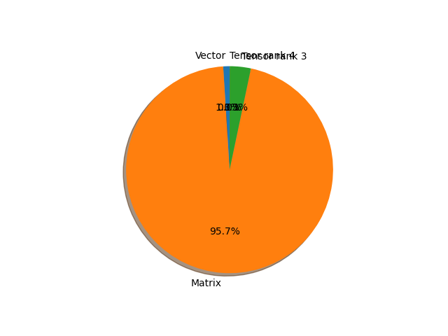

# efficientnet_b1 parameter information

**Number of layers: [ 301 ]**

**Number of parameters: [ 7.79M ]**

**Proportional of each form** (%)

| Vector | Matrix | Tensor rank 3 | Tensor rank 4 | 
|  --- | --- | --- | --- |
| 61.46 | 30.56 | 7.64 | 0.33 | 

**Proportional of parameters by form** (%)

| Vector | Matrix | Tensor rank 3 | Tensor rank 4 | 
|  --- | --- | --- | --- |
| 0.99 | 95.71 | 3.29 | 0.01 | 

**Layer information**

| Name | Shape | Squeezed shape | Number of parameters | Form |
| --- | --- | --- | --- | --- |
| features.0.0.weight | (32, 3, 3, 3) | (32, 3, 3, 3) | 864 | Tensor rank 4 |
| features.0.1.weight | (32,) | (32,) | 32 | Vector |
| features.0.1.bias | (32,) | (32,) | 32 | Vector |
| features.1.0.block.0.0.weight | (32, 1, 3, 3) | (32, 3, 3) | 288 | Tensor rank 3 |
| features.1.0.block.0.1.weight | (32,) | (32,) | 32 | Vector |
| features.1.0.block.0.1.bias | (32,) | (32,) | 32 | Vector |
| features.1.0.block.1.fc1.weight | (8, 32, 1, 1) | (8, 32) | 256 | Matrix |
| features.1.0.block.1.fc1.bias | (8,) | (8,) | 8 | Vector |
| features.1.0.block.1.fc2.weight | (32, 8, 1, 1) | (32, 8) | 256 | Matrix |
| features.1.0.block.1.fc2.bias | (32,) | (32,) | 32 | Vector |
| features.1.0.block.2.0.weight | (16, 32, 1, 1) | (16, 32) | 512 | Matrix |
| features.1.0.block.2.1.weight | (16,) | (16,) | 16 | Vector |
| features.1.0.block.2.1.bias | (16,) | (16,) | 16 | Vector |
| features.1.1.block.0.0.weight | (16, 1, 3, 3) | (16, 3, 3) | 144 | Tensor rank 3 |
| features.1.1.block.0.1.weight | (16,) | (16,) | 16 | Vector |
| features.1.1.block.0.1.bias | (16,) | (16,) | 16 | Vector |
| features.1.1.block.1.fc1.weight | (4, 16, 1, 1) | (4, 16) | 64 | Matrix |
| features.1.1.block.1.fc1.bias | (4,) | (4,) | 4 | Vector |
| features.1.1.block.1.fc2.weight | (16, 4, 1, 1) | (16, 4) | 64 | Matrix |
| features.1.1.block.1.fc2.bias | (16,) | (16,) | 16 | Vector |
| features.1.1.block.2.0.weight | (16, 16, 1, 1) | (16, 16) | 256 | Matrix |
| features.1.1.block.2.1.weight | (16,) | (16,) | 16 | Vector |
| features.1.1.block.2.1.bias | (16,) | (16,) | 16 | Vector |
| features.2.0.block.0.0.weight | (96, 16, 1, 1) | (96, 16) | 1536 | Matrix |
| features.2.0.block.0.1.weight | (96,) | (96,) | 96 | Vector |
| features.2.0.block.0.1.bias | (96,) | (96,) | 96 | Vector |
| features.2.0.block.1.0.weight | (96, 1, 3, 3) | (96, 3, 3) | 864 | Tensor rank 3 |
| features.2.0.block.1.1.weight | (96,) | (96,) | 96 | Vector |
| features.2.0.block.1.1.bias | (96,) | (96,) | 96 | Vector |
| features.2.0.block.2.fc1.weight | (4, 96, 1, 1) | (4, 96) | 384 | Matrix |
| features.2.0.block.2.fc1.bias | (4,) | (4,) | 4 | Vector |
| features.2.0.block.2.fc2.weight | (96, 4, 1, 1) | (96, 4) | 384 | Matrix |
| features.2.0.block.2.fc2.bias | (96,) | (96,) | 96 | Vector |
| features.2.0.block.3.0.weight | (24, 96, 1, 1) | (24, 96) | 2304 | Matrix |
| features.2.0.block.3.1.weight | (24,) | (24,) | 24 | Vector |
| features.2.0.block.3.1.bias | (24,) | (24,) | 24 | Vector |
| features.2.1.block.0.0.weight | (144, 24, 1, 1) | (144, 24) | 3456 | Matrix |
| features.2.1.block.0.1.weight | (144,) | (144,) | 144 | Vector |
| features.2.1.block.0.1.bias | (144,) | (144,) | 144 | Vector |
| features.2.1.block.1.0.weight | (144, 1, 3, 3) | (144, 3, 3) | 1296 | Tensor rank 3 |
| features.2.1.block.1.1.weight | (144,) | (144,) | 144 | Vector |
| features.2.1.block.1.1.bias | (144,) | (144,) | 144 | Vector |
| features.2.1.block.2.fc1.weight | (6, 144, 1, 1) | (6, 144) | 864 | Matrix |
| features.2.1.block.2.fc1.bias | (6,) | (6,) | 6 | Vector |
| features.2.1.block.2.fc2.weight | (144, 6, 1, 1) | (144, 6) | 864 | Matrix |
| features.2.1.block.2.fc2.bias | (144,) | (144,) | 144 | Vector |
| features.2.1.block.3.0.weight | (24, 144, 1, 1) | (24, 144) | 3456 | Matrix |
| features.2.1.block.3.1.weight | (24,) | (24,) | 24 | Vector |
| features.2.1.block.3.1.bias | (24,) | (24,) | 24 | Vector |
| features.2.2.block.0.0.weight | (144, 24, 1, 1) | (144, 24) | 3456 | Matrix |
| features.2.2.block.0.1.weight | (144,) | (144,) | 144 | Vector |
| features.2.2.block.0.1.bias | (144,) | (144,) | 144 | Vector |
| features.2.2.block.1.0.weight | (144, 1, 3, 3) | (144, 3, 3) | 1296 | Tensor rank 3 |
| features.2.2.block.1.1.weight | (144,) | (144,) | 144 | Vector |
| features.2.2.block.1.1.bias | (144,) | (144,) | 144 | Vector |
| features.2.2.block.2.fc1.weight | (6, 144, 1, 1) | (6, 144) | 864 | Matrix |
| features.2.2.block.2.fc1.bias | (6,) | (6,) | 6 | Vector |
| features.2.2.block.2.fc2.weight | (144, 6, 1, 1) | (144, 6) | 864 | Matrix |
| features.2.2.block.2.fc2.bias | (144,) | (144,) | 144 | Vector |
| features.2.2.block.3.0.weight | (24, 144, 1, 1) | (24, 144) | 3456 | Matrix |
| features.2.2.block.3.1.weight | (24,) | (24,) | 24 | Vector |
| features.2.2.block.3.1.bias | (24,) | (24,) | 24 | Vector |
| features.3.0.block.0.0.weight | (144, 24, 1, 1) | (144, 24) | 3456 | Matrix |
| features.3.0.block.0.1.weight | (144,) | (144,) | 144 | Vector |
| features.3.0.block.0.1.bias | (144,) | (144,) | 144 | Vector |
| features.3.0.block.1.0.weight | (144, 1, 5, 5) | (144, 5, 5) | 3600 | Tensor rank 3 |
| features.3.0.block.1.1.weight | (144,) | (144,) | 144 | Vector |
| features.3.0.block.1.1.bias | (144,) | (144,) | 144 | Vector |
| features.3.0.block.2.fc1.weight | (6, 144, 1, 1) | (6, 144) | 864 | Matrix |
| features.3.0.block.2.fc1.bias | (6,) | (6,) | 6 | Vector |
| features.3.0.block.2.fc2.weight | (144, 6, 1, 1) | (144, 6) | 864 | Matrix |
| features.3.0.block.2.fc2.bias | (144,) | (144,) | 144 | Vector |
| features.3.0.block.3.0.weight | (40, 144, 1, 1) | (40, 144) | 5760 | Matrix |
| features.3.0.block.3.1.weight | (40,) | (40,) | 40 | Vector |
| features.3.0.block.3.1.bias | (40,) | (40,) | 40 | Vector |
| features.3.1.block.0.0.weight | (240, 40, 1, 1) | (240, 40) | 9600 | Matrix |
| features.3.1.block.0.1.weight | (240,) | (240,) | 240 | Vector |
| features.3.1.block.0.1.bias | (240,) | (240,) | 240 | Vector |
| features.3.1.block.1.0.weight | (240, 1, 5, 5) | (240, 5, 5) | 6000 | Tensor rank 3 |
| features.3.1.block.1.1.weight | (240,) | (240,) | 240 | Vector |
| features.3.1.block.1.1.bias | (240,) | (240,) | 240 | Vector |
| features.3.1.block.2.fc1.weight | (10, 240, 1, 1) | (10, 240) | 2400 | Matrix |
| features.3.1.block.2.fc1.bias | (10,) | (10,) | 10 | Vector |
| features.3.1.block.2.fc2.weight | (240, 10, 1, 1) | (240, 10) | 2400 | Matrix |
| features.3.1.block.2.fc2.bias | (240,) | (240,) | 240 | Vector |
| features.3.1.block.3.0.weight | (40, 240, 1, 1) | (40, 240) | 9600 | Matrix |
| features.3.1.block.3.1.weight | (40,) | (40,) | 40 | Vector |
| features.3.1.block.3.1.bias | (40,) | (40,) | 40 | Vector |
| features.3.2.block.0.0.weight | (240, 40, 1, 1) | (240, 40) | 9600 | Matrix |
| features.3.2.block.0.1.weight | (240,) | (240,) | 240 | Vector |
| features.3.2.block.0.1.bias | (240,) | (240,) | 240 | Vector |
| features.3.2.block.1.0.weight | (240, 1, 5, 5) | (240, 5, 5) | 6000 | Tensor rank 3 |
| features.3.2.block.1.1.weight | (240,) | (240,) | 240 | Vector |
| features.3.2.block.1.1.bias | (240,) | (240,) | 240 | Vector |
| features.3.2.block.2.fc1.weight | (10, 240, 1, 1) | (10, 240) | 2400 | Matrix |
| features.3.2.block.2.fc1.bias | (10,) | (10,) | 10 | Vector |
| features.3.2.block.2.fc2.weight | (240, 10, 1, 1) | (240, 10) | 2400 | Matrix |
| features.3.2.block.2.fc2.bias | (240,) | (240,) | 240 | Vector |
| features.3.2.block.3.0.weight | (40, 240, 1, 1) | (40, 240) | 9600 | Matrix |
| features.3.2.block.3.1.weight | (40,) | (40,) | 40 | Vector |
| features.3.2.block.3.1.bias | (40,) | (40,) | 40 | Vector |
| features.4.0.block.0.0.weight | (240, 40, 1, 1) | (240, 40) | 9600 | Matrix |
| features.4.0.block.0.1.weight | (240,) | (240,) | 240 | Vector |
| features.4.0.block.0.1.bias | (240,) | (240,) | 240 | Vector |
| features.4.0.block.1.0.weight | (240, 1, 3, 3) | (240, 3, 3) | 2160 | Tensor rank 3 |
| features.4.0.block.1.1.weight | (240,) | (240,) | 240 | Vector |
| features.4.0.block.1.1.bias | (240,) | (240,) | 240 | Vector |
| features.4.0.block.2.fc1.weight | (10, 240, 1, 1) | (10, 240) | 2400 | Matrix |
| features.4.0.block.2.fc1.bias | (10,) | (10,) | 10 | Vector |
| features.4.0.block.2.fc2.weight | (240, 10, 1, 1) | (240, 10) | 2400 | Matrix |
| features.4.0.block.2.fc2.bias | (240,) | (240,) | 240 | Vector |
| features.4.0.block.3.0.weight | (80, 240, 1, 1) | (80, 240) | 19200 | Matrix |
| features.4.0.block.3.1.weight | (80,) | (80,) | 80 | Vector |
| features.4.0.block.3.1.bias | (80,) | (80,) | 80 | Vector |
| features.4.1.block.0.0.weight | (480, 80, 1, 1) | (480, 80) | 38400 | Matrix |
| features.4.1.block.0.1.weight | (480,) | (480,) | 480 | Vector |
| features.4.1.block.0.1.bias | (480,) | (480,) | 480 | Vector |
| features.4.1.block.1.0.weight | (480, 1, 3, 3) | (480, 3, 3) | 4320 | Tensor rank 3 |
| features.4.1.block.1.1.weight | (480,) | (480,) | 480 | Vector |
| features.4.1.block.1.1.bias | (480,) | (480,) | 480 | Vector |
| features.4.1.block.2.fc1.weight | (20, 480, 1, 1) | (20, 480) | 9600 | Matrix |
| features.4.1.block.2.fc1.bias | (20,) | (20,) | 20 | Vector |
| features.4.1.block.2.fc2.weight | (480, 20, 1, 1) | (480, 20) | 9600 | Matrix |
| features.4.1.block.2.fc2.bias | (480,) | (480,) | 480 | Vector |
| features.4.1.block.3.0.weight | (80, 480, 1, 1) | (80, 480) | 38400 | Matrix |
| features.4.1.block.3.1.weight | (80,) | (80,) | 80 | Vector |
| features.4.1.block.3.1.bias | (80,) | (80,) | 80 | Vector |
| features.4.2.block.0.0.weight | (480, 80, 1, 1) | (480, 80) | 38400 | Matrix |
| features.4.2.block.0.1.weight | (480,) | (480,) | 480 | Vector |
| features.4.2.block.0.1.bias | (480,) | (480,) | 480 | Vector |
| features.4.2.block.1.0.weight | (480, 1, 3, 3) | (480, 3, 3) | 4320 | Tensor rank 3 |
| features.4.2.block.1.1.weight | (480,) | (480,) | 480 | Vector |
| features.4.2.block.1.1.bias | (480,) | (480,) | 480 | Vector |
| features.4.2.block.2.fc1.weight | (20, 480, 1, 1) | (20, 480) | 9600 | Matrix |
| features.4.2.block.2.fc1.bias | (20,) | (20,) | 20 | Vector |
| features.4.2.block.2.fc2.weight | (480, 20, 1, 1) | (480, 20) | 9600 | Matrix |
| features.4.2.block.2.fc2.bias | (480,) | (480,) | 480 | Vector |
| features.4.2.block.3.0.weight | (80, 480, 1, 1) | (80, 480) | 38400 | Matrix |
| features.4.2.block.3.1.weight | (80,) | (80,) | 80 | Vector |
| features.4.2.block.3.1.bias | (80,) | (80,) | 80 | Vector |
| features.4.3.block.0.0.weight | (480, 80, 1, 1) | (480, 80) | 38400 | Matrix |
| features.4.3.block.0.1.weight | (480,) | (480,) | 480 | Vector |
| features.4.3.block.0.1.bias | (480,) | (480,) | 480 | Vector |
| features.4.3.block.1.0.weight | (480, 1, 3, 3) | (480, 3, 3) | 4320 | Tensor rank 3 |
| features.4.3.block.1.1.weight | (480,) | (480,) | 480 | Vector |
| features.4.3.block.1.1.bias | (480,) | (480,) | 480 | Vector |
| features.4.3.block.2.fc1.weight | (20, 480, 1, 1) | (20, 480) | 9600 | Matrix |
| features.4.3.block.2.fc1.bias | (20,) | (20,) | 20 | Vector |
| features.4.3.block.2.fc2.weight | (480, 20, 1, 1) | (480, 20) | 9600 | Matrix |
| features.4.3.block.2.fc2.bias | (480,) | (480,) | 480 | Vector |
| features.4.3.block.3.0.weight | (80, 480, 1, 1) | (80, 480) | 38400 | Matrix |
| features.4.3.block.3.1.weight | (80,) | (80,) | 80 | Vector |
| features.4.3.block.3.1.bias | (80,) | (80,) | 80 | Vector |
| features.5.0.block.0.0.weight | (480, 80, 1, 1) | (480, 80) | 38400 | Matrix |
| features.5.0.block.0.1.weight | (480,) | (480,) | 480 | Vector |
| features.5.0.block.0.1.bias | (480,) | (480,) | 480 | Vector |
| features.5.0.block.1.0.weight | (480, 1, 5, 5) | (480, 5, 5) | 12000 | Tensor rank 3 |
| features.5.0.block.1.1.weight | (480,) | (480,) | 480 | Vector |
| features.5.0.block.1.1.bias | (480,) | (480,) | 480 | Vector |
| features.5.0.block.2.fc1.weight | (20, 480, 1, 1) | (20, 480) | 9600 | Matrix |
| features.5.0.block.2.fc1.bias | (20,) | (20,) | 20 | Vector |
| features.5.0.block.2.fc2.weight | (480, 20, 1, 1) | (480, 20) | 9600 | Matrix |
| features.5.0.block.2.fc2.bias | (480,) | (480,) | 480 | Vector |
| features.5.0.block.3.0.weight | (112, 480, 1, 1) | (112, 480) | 53760 | Matrix |
| features.5.0.block.3.1.weight | (112,) | (112,) | 112 | Vector |
| features.5.0.block.3.1.bias | (112,) | (112,) | 112 | Vector |
| features.5.1.block.0.0.weight | (672, 112, 1, 1) | (672, 112) | 75264 | Matrix |
| features.5.1.block.0.1.weight | (672,) | (672,) | 672 | Vector |
| features.5.1.block.0.1.bias | (672,) | (672,) | 672 | Vector |
| features.5.1.block.1.0.weight | (672, 1, 5, 5) | (672, 5, 5) | 16800 | Tensor rank 3 |
| features.5.1.block.1.1.weight | (672,) | (672,) | 672 | Vector |
| features.5.1.block.1.1.bias | (672,) | (672,) | 672 | Vector |
| features.5.1.block.2.fc1.weight | (28, 672, 1, 1) | (28, 672) | 18816 | Matrix |
| features.5.1.block.2.fc1.bias | (28,) | (28,) | 28 | Vector |
| features.5.1.block.2.fc2.weight | (672, 28, 1, 1) | (672, 28) | 18816 | Matrix |
| features.5.1.block.2.fc2.bias | (672,) | (672,) | 672 | Vector |
| features.5.1.block.3.0.weight | (112, 672, 1, 1) | (112, 672) | 75264 | Matrix |
| features.5.1.block.3.1.weight | (112,) | (112,) | 112 | Vector |
| features.5.1.block.3.1.bias | (112,) | (112,) | 112 | Vector |
| features.5.2.block.0.0.weight | (672, 112, 1, 1) | (672, 112) | 75264 | Matrix |
| features.5.2.block.0.1.weight | (672,) | (672,) | 672 | Vector |
| features.5.2.block.0.1.bias | (672,) | (672,) | 672 | Vector |
| features.5.2.block.1.0.weight | (672, 1, 5, 5) | (672, 5, 5) | 16800 | Tensor rank 3 |
| features.5.2.block.1.1.weight | (672,) | (672,) | 672 | Vector |
| features.5.2.block.1.1.bias | (672,) | (672,) | 672 | Vector |
| features.5.2.block.2.fc1.weight | (28, 672, 1, 1) | (28, 672) | 18816 | Matrix |
| features.5.2.block.2.fc1.bias | (28,) | (28,) | 28 | Vector |
| features.5.2.block.2.fc2.weight | (672, 28, 1, 1) | (672, 28) | 18816 | Matrix |
| features.5.2.block.2.fc2.bias | (672,) | (672,) | 672 | Vector |
| features.5.2.block.3.0.weight | (112, 672, 1, 1) | (112, 672) | 75264 | Matrix |
| features.5.2.block.3.1.weight | (112,) | (112,) | 112 | Vector |
| features.5.2.block.3.1.bias | (112,) | (112,) | 112 | Vector |
| features.5.3.block.0.0.weight | (672, 112, 1, 1) | (672, 112) | 75264 | Matrix |
| features.5.3.block.0.1.weight | (672,) | (672,) | 672 | Vector |
| features.5.3.block.0.1.bias | (672,) | (672,) | 672 | Vector |
| features.5.3.block.1.0.weight | (672, 1, 5, 5) | (672, 5, 5) | 16800 | Tensor rank 3 |
| features.5.3.block.1.1.weight | (672,) | (672,) | 672 | Vector |
| features.5.3.block.1.1.bias | (672,) | (672,) | 672 | Vector |
| features.5.3.block.2.fc1.weight | (28, 672, 1, 1) | (28, 672) | 18816 | Matrix |
| features.5.3.block.2.fc1.bias | (28,) | (28,) | 28 | Vector |
| features.5.3.block.2.fc2.weight | (672, 28, 1, 1) | (672, 28) | 18816 | Matrix |
| features.5.3.block.2.fc2.bias | (672,) | (672,) | 672 | Vector |
| features.5.3.block.3.0.weight | (112, 672, 1, 1) | (112, 672) | 75264 | Matrix |
| features.5.3.block.3.1.weight | (112,) | (112,) | 112 | Vector |
| features.5.3.block.3.1.bias | (112,) | (112,) | 112 | Vector |
| features.6.0.block.0.0.weight | (672, 112, 1, 1) | (672, 112) | 75264 | Matrix |
| features.6.0.block.0.1.weight | (672,) | (672,) | 672 | Vector |
| features.6.0.block.0.1.bias | (672,) | (672,) | 672 | Vector |
| features.6.0.block.1.0.weight | (672, 1, 5, 5) | (672, 5, 5) | 16800 | Tensor rank 3 |
| features.6.0.block.1.1.weight | (672,) | (672,) | 672 | Vector |
| features.6.0.block.1.1.bias | (672,) | (672,) | 672 | Vector |
| features.6.0.block.2.fc1.weight | (28, 672, 1, 1) | (28, 672) | 18816 | Matrix |
| features.6.0.block.2.fc1.bias | (28,) | (28,) | 28 | Vector |
| features.6.0.block.2.fc2.weight | (672, 28, 1, 1) | (672, 28) | 18816 | Matrix |
| features.6.0.block.2.fc2.bias | (672,) | (672,) | 672 | Vector |
| features.6.0.block.3.0.weight | (192, 672, 1, 1) | (192, 672) | 129024 | Matrix |
| features.6.0.block.3.1.weight | (192,) | (192,) | 192 | Vector |
| features.6.0.block.3.1.bias | (192,) | (192,) | 192 | Vector |
| features.6.1.block.0.0.weight | (1152, 192, 1, 1) | (1152, 192) | 221184 | Matrix |
| features.6.1.block.0.1.weight | (1152,) | (1152,) | 1152 | Vector |
| features.6.1.block.0.1.bias | (1152,) | (1152,) | 1152 | Vector |
| features.6.1.block.1.0.weight | (1152, 1, 5, 5) | (1152, 5, 5) | 28800 | Tensor rank 3 |
| features.6.1.block.1.1.weight | (1152,) | (1152,) | 1152 | Vector |
| features.6.1.block.1.1.bias | (1152,) | (1152,) | 1152 | Vector |
| features.6.1.block.2.fc1.weight | (48, 1152, 1, 1) | (48, 1152) | 55296 | Matrix |
| features.6.1.block.2.fc1.bias | (48,) | (48,) | 48 | Vector |
| features.6.1.block.2.fc2.weight | (1152, 48, 1, 1) | (1152, 48) | 55296 | Matrix |
| features.6.1.block.2.fc2.bias | (1152,) | (1152,) | 1152 | Vector |
| features.6.1.block.3.0.weight | (192, 1152, 1, 1) | (192, 1152) | 221184 | Matrix |
| features.6.1.block.3.1.weight | (192,) | (192,) | 192 | Vector |
| features.6.1.block.3.1.bias | (192,) | (192,) | 192 | Vector |
| features.6.2.block.0.0.weight | (1152, 192, 1, 1) | (1152, 192) | 221184 | Matrix |
| features.6.2.block.0.1.weight | (1152,) | (1152,) | 1152 | Vector |
| features.6.2.block.0.1.bias | (1152,) | (1152,) | 1152 | Vector |
| features.6.2.block.1.0.weight | (1152, 1, 5, 5) | (1152, 5, 5) | 28800 | Tensor rank 3 |
| features.6.2.block.1.1.weight | (1152,) | (1152,) | 1152 | Vector |
| features.6.2.block.1.1.bias | (1152,) | (1152,) | 1152 | Vector |
| features.6.2.block.2.fc1.weight | (48, 1152, 1, 1) | (48, 1152) | 55296 | Matrix |
| features.6.2.block.2.fc1.bias | (48,) | (48,) | 48 | Vector |
| features.6.2.block.2.fc2.weight | (1152, 48, 1, 1) | (1152, 48) | 55296 | Matrix |
| features.6.2.block.2.fc2.bias | (1152,) | (1152,) | 1152 | Vector |
| features.6.2.block.3.0.weight | (192, 1152, 1, 1) | (192, 1152) | 221184 | Matrix |
| features.6.2.block.3.1.weight | (192,) | (192,) | 192 | Vector |
| features.6.2.block.3.1.bias | (192,) | (192,) | 192 | Vector |
| features.6.3.block.0.0.weight | (1152, 192, 1, 1) | (1152, 192) | 221184 | Matrix |
| features.6.3.block.0.1.weight | (1152,) | (1152,) | 1152 | Vector |
| features.6.3.block.0.1.bias | (1152,) | (1152,) | 1152 | Vector |
| features.6.3.block.1.0.weight | (1152, 1, 5, 5) | (1152, 5, 5) | 28800 | Tensor rank 3 |
| features.6.3.block.1.1.weight | (1152,) | (1152,) | 1152 | Vector |
| features.6.3.block.1.1.bias | (1152,) | (1152,) | 1152 | Vector |
| features.6.3.block.2.fc1.weight | (48, 1152, 1, 1) | (48, 1152) | 55296 | Matrix |
| features.6.3.block.2.fc1.bias | (48,) | (48,) | 48 | Vector |
| features.6.3.block.2.fc2.weight | (1152, 48, 1, 1) | (1152, 48) | 55296 | Matrix |
| features.6.3.block.2.fc2.bias | (1152,) | (1152,) | 1152 | Vector |
| features.6.3.block.3.0.weight | (192, 1152, 1, 1) | (192, 1152) | 221184 | Matrix |
| features.6.3.block.3.1.weight | (192,) | (192,) | 192 | Vector |
| features.6.3.block.3.1.bias | (192,) | (192,) | 192 | Vector |
| features.6.4.block.0.0.weight | (1152, 192, 1, 1) | (1152, 192) | 221184 | Matrix |
| features.6.4.block.0.1.weight | (1152,) | (1152,) | 1152 | Vector |
| features.6.4.block.0.1.bias | (1152,) | (1152,) | 1152 | Vector |
| features.6.4.block.1.0.weight | (1152, 1, 5, 5) | (1152, 5, 5) | 28800 | Tensor rank 3 |
| features.6.4.block.1.1.weight | (1152,) | (1152,) | 1152 | Vector |
| features.6.4.block.1.1.bias | (1152,) | (1152,) | 1152 | Vector |
| features.6.4.block.2.fc1.weight | (48, 1152, 1, 1) | (48, 1152) | 55296 | Matrix |
| features.6.4.block.2.fc1.bias | (48,) | (48,) | 48 | Vector |
| features.6.4.block.2.fc2.weight | (1152, 48, 1, 1) | (1152, 48) | 55296 | Matrix |
| features.6.4.block.2.fc2.bias | (1152,) | (1152,) | 1152 | Vector |
| features.6.4.block.3.0.weight | (192, 1152, 1, 1) | (192, 1152) | 221184 | Matrix |
| features.6.4.block.3.1.weight | (192,) | (192,) | 192 | Vector |
| features.6.4.block.3.1.bias | (192,) | (192,) | 192 | Vector |
| features.7.0.block.0.0.weight | (1152, 192, 1, 1) | (1152, 192) | 221184 | Matrix |
| features.7.0.block.0.1.weight | (1152,) | (1152,) | 1152 | Vector |
| features.7.0.block.0.1.bias | (1152,) | (1152,) | 1152 | Vector |
| features.7.0.block.1.0.weight | (1152, 1, 3, 3) | (1152, 3, 3) | 10368 | Tensor rank 3 |
| features.7.0.block.1.1.weight | (1152,) | (1152,) | 1152 | Vector |
| features.7.0.block.1.1.bias | (1152,) | (1152,) | 1152 | Vector |
| features.7.0.block.2.fc1.weight | (48, 1152, 1, 1) | (48, 1152) | 55296 | Matrix |
| features.7.0.block.2.fc1.bias | (48,) | (48,) | 48 | Vector |
| features.7.0.block.2.fc2.weight | (1152, 48, 1, 1) | (1152, 48) | 55296 | Matrix |
| features.7.0.block.2.fc2.bias | (1152,) | (1152,) | 1152 | Vector |
| features.7.0.block.3.0.weight | (320, 1152, 1, 1) | (320, 1152) | 368640 | Matrix |
| features.7.0.block.3.1.weight | (320,) | (320,) | 320 | Vector |
| features.7.0.block.3.1.bias | (320,) | (320,) | 320 | Vector |
| features.7.1.block.0.0.weight | (1920, 320, 1, 1) | (1920, 320) | 614400 | Matrix |
| features.7.1.block.0.1.weight | (1920,) | (1920,) | 1920 | Vector |
| features.7.1.block.0.1.bias | (1920,) | (1920,) | 1920 | Vector |
| features.7.1.block.1.0.weight | (1920, 1, 3, 3) | (1920, 3, 3) | 17280 | Tensor rank 3 |
| features.7.1.block.1.1.weight | (1920,) | (1920,) | 1920 | Vector |
| features.7.1.block.1.1.bias | (1920,) | (1920,) | 1920 | Vector |
| features.7.1.block.2.fc1.weight | (80, 1920, 1, 1) | (80, 1920) | 153600 | Matrix |
| features.7.1.block.2.fc1.bias | (80,) | (80,) | 80 | Vector |
| features.7.1.block.2.fc2.weight | (1920, 80, 1, 1) | (1920, 80) | 153600 | Matrix |
| features.7.1.block.2.fc2.bias | (1920,) | (1920,) | 1920 | Vector |
| features.7.1.block.3.0.weight | (320, 1920, 1, 1) | (320, 1920) | 614400 | Matrix |
| features.7.1.block.3.1.weight | (320,) | (320,) | 320 | Vector |
| features.7.1.block.3.1.bias | (320,) | (320,) | 320 | Vector |
| features.8.0.weight | (1280, 320, 1, 1) | (1280, 320) | 409600 | Matrix |
| features.8.1.weight | (1280,) | (1280,) | 1280 | Vector |
| features.8.1.bias | (1280,) | (1280,) | 1280 | Vector |
| classifier.1.weight | (1000, 1280) | (1000, 1280) | 1280000 | Matrix |
| classifier.1.bias | (1000,) | (1000,) | 1000 | Vector |

