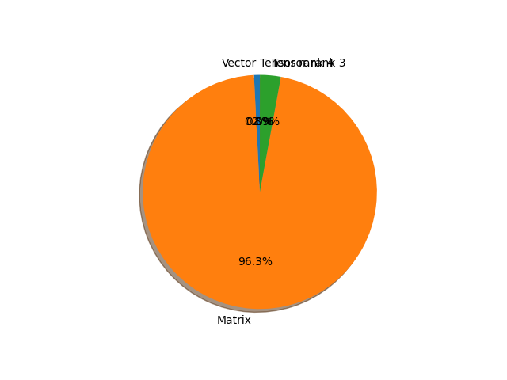

# efficientnet_b4 parameter information

**Number of layers: [ 418 ]**

**Number of parameters: [ 19.34M ]**

**Proportional of each form** (%)

| Vector | Matrix | Tensor rank 3 | Tensor rank 4 | 
|  --- | --- | --- | --- |
| 61.48 | 30.62 | 7.66 | 0.24 | 

**Proportional of parameters by form** (%)

| Vector | Matrix | Tensor rank 3 | Tensor rank 4 | 
|  --- | --- | --- | --- |
| 0.80 | 96.32 | 2.87 | 0.01 | 

**Layer information**

| Name | Shape | Squeezed shape | Number of parameters | Form |
| --- | --- | --- | --- | --- |
| features.0.0.weight | (48, 3, 3, 3) | (48, 3, 3, 3) | 1296 | Tensor rank 4 |
| features.0.1.weight | (48,) | (48,) | 48 | Vector |
| features.0.1.bias | (48,) | (48,) | 48 | Vector |
| features.1.0.block.0.0.weight | (48, 1, 3, 3) | (48, 3, 3) | 432 | Tensor rank 3 |
| features.1.0.block.0.1.weight | (48,) | (48,) | 48 | Vector |
| features.1.0.block.0.1.bias | (48,) | (48,) | 48 | Vector |
| features.1.0.block.1.fc1.weight | (12, 48, 1, 1) | (12, 48) | 576 | Matrix |
| features.1.0.block.1.fc1.bias | (12,) | (12,) | 12 | Vector |
| features.1.0.block.1.fc2.weight | (48, 12, 1, 1) | (48, 12) | 576 | Matrix |
| features.1.0.block.1.fc2.bias | (48,) | (48,) | 48 | Vector |
| features.1.0.block.2.0.weight | (24, 48, 1, 1) | (24, 48) | 1152 | Matrix |
| features.1.0.block.2.1.weight | (24,) | (24,) | 24 | Vector |
| features.1.0.block.2.1.bias | (24,) | (24,) | 24 | Vector |
| features.1.1.block.0.0.weight | (24, 1, 3, 3) | (24, 3, 3) | 216 | Tensor rank 3 |
| features.1.1.block.0.1.weight | (24,) | (24,) | 24 | Vector |
| features.1.1.block.0.1.bias | (24,) | (24,) | 24 | Vector |
| features.1.1.block.1.fc1.weight | (6, 24, 1, 1) | (6, 24) | 144 | Matrix |
| features.1.1.block.1.fc1.bias | (6,) | (6,) | 6 | Vector |
| features.1.1.block.1.fc2.weight | (24, 6, 1, 1) | (24, 6) | 144 | Matrix |
| features.1.1.block.1.fc2.bias | (24,) | (24,) | 24 | Vector |
| features.1.1.block.2.0.weight | (24, 24, 1, 1) | (24, 24) | 576 | Matrix |
| features.1.1.block.2.1.weight | (24,) | (24,) | 24 | Vector |
| features.1.1.block.2.1.bias | (24,) | (24,) | 24 | Vector |
| features.2.0.block.0.0.weight | (144, 24, 1, 1) | (144, 24) | 3456 | Matrix |
| features.2.0.block.0.1.weight | (144,) | (144,) | 144 | Vector |
| features.2.0.block.0.1.bias | (144,) | (144,) | 144 | Vector |
| features.2.0.block.1.0.weight | (144, 1, 3, 3) | (144, 3, 3) | 1296 | Tensor rank 3 |
| features.2.0.block.1.1.weight | (144,) | (144,) | 144 | Vector |
| features.2.0.block.1.1.bias | (144,) | (144,) | 144 | Vector |
| features.2.0.block.2.fc1.weight | (6, 144, 1, 1) | (6, 144) | 864 | Matrix |
| features.2.0.block.2.fc1.bias | (6,) | (6,) | 6 | Vector |
| features.2.0.block.2.fc2.weight | (144, 6, 1, 1) | (144, 6) | 864 | Matrix |
| features.2.0.block.2.fc2.bias | (144,) | (144,) | 144 | Vector |
| features.2.0.block.3.0.weight | (32, 144, 1, 1) | (32, 144) | 4608 | Matrix |
| features.2.0.block.3.1.weight | (32,) | (32,) | 32 | Vector |
| features.2.0.block.3.1.bias | (32,) | (32,) | 32 | Vector |
| features.2.1.block.0.0.weight | (192, 32, 1, 1) | (192, 32) | 6144 | Matrix |
| features.2.1.block.0.1.weight | (192,) | (192,) | 192 | Vector |
| features.2.1.block.0.1.bias | (192,) | (192,) | 192 | Vector |
| features.2.1.block.1.0.weight | (192, 1, 3, 3) | (192, 3, 3) | 1728 | Tensor rank 3 |
| features.2.1.block.1.1.weight | (192,) | (192,) | 192 | Vector |
| features.2.1.block.1.1.bias | (192,) | (192,) | 192 | Vector |
| features.2.1.block.2.fc1.weight | (8, 192, 1, 1) | (8, 192) | 1536 | Matrix |
| features.2.1.block.2.fc1.bias | (8,) | (8,) | 8 | Vector |
| features.2.1.block.2.fc2.weight | (192, 8, 1, 1) | (192, 8) | 1536 | Matrix |
| features.2.1.block.2.fc2.bias | (192,) | (192,) | 192 | Vector |
| features.2.1.block.3.0.weight | (32, 192, 1, 1) | (32, 192) | 6144 | Matrix |
| features.2.1.block.3.1.weight | (32,) | (32,) | 32 | Vector |
| features.2.1.block.3.1.bias | (32,) | (32,) | 32 | Vector |
| features.2.2.block.0.0.weight | (192, 32, 1, 1) | (192, 32) | 6144 | Matrix |
| features.2.2.block.0.1.weight | (192,) | (192,) | 192 | Vector |
| features.2.2.block.0.1.bias | (192,) | (192,) | 192 | Vector |
| features.2.2.block.1.0.weight | (192, 1, 3, 3) | (192, 3, 3) | 1728 | Tensor rank 3 |
| features.2.2.block.1.1.weight | (192,) | (192,) | 192 | Vector |
| features.2.2.block.1.1.bias | (192,) | (192,) | 192 | Vector |
| features.2.2.block.2.fc1.weight | (8, 192, 1, 1) | (8, 192) | 1536 | Matrix |
| features.2.2.block.2.fc1.bias | (8,) | (8,) | 8 | Vector |
| features.2.2.block.2.fc2.weight | (192, 8, 1, 1) | (192, 8) | 1536 | Matrix |
| features.2.2.block.2.fc2.bias | (192,) | (192,) | 192 | Vector |
| features.2.2.block.3.0.weight | (32, 192, 1, 1) | (32, 192) | 6144 | Matrix |
| features.2.2.block.3.1.weight | (32,) | (32,) | 32 | Vector |
| features.2.2.block.3.1.bias | (32,) | (32,) | 32 | Vector |
| features.2.3.block.0.0.weight | (192, 32, 1, 1) | (192, 32) | 6144 | Matrix |
| features.2.3.block.0.1.weight | (192,) | (192,) | 192 | Vector |
| features.2.3.block.0.1.bias | (192,) | (192,) | 192 | Vector |
| features.2.3.block.1.0.weight | (192, 1, 3, 3) | (192, 3, 3) | 1728 | Tensor rank 3 |
| features.2.3.block.1.1.weight | (192,) | (192,) | 192 | Vector |
| features.2.3.block.1.1.bias | (192,) | (192,) | 192 | Vector |
| features.2.3.block.2.fc1.weight | (8, 192, 1, 1) | (8, 192) | 1536 | Matrix |
| features.2.3.block.2.fc1.bias | (8,) | (8,) | 8 | Vector |
| features.2.3.block.2.fc2.weight | (192, 8, 1, 1) | (192, 8) | 1536 | Matrix |
| features.2.3.block.2.fc2.bias | (192,) | (192,) | 192 | Vector |
| features.2.3.block.3.0.weight | (32, 192, 1, 1) | (32, 192) | 6144 | Matrix |
| features.2.3.block.3.1.weight | (32,) | (32,) | 32 | Vector |
| features.2.3.block.3.1.bias | (32,) | (32,) | 32 | Vector |
| features.3.0.block.0.0.weight | (192, 32, 1, 1) | (192, 32) | 6144 | Matrix |
| features.3.0.block.0.1.weight | (192,) | (192,) | 192 | Vector |
| features.3.0.block.0.1.bias | (192,) | (192,) | 192 | Vector |
| features.3.0.block.1.0.weight | (192, 1, 5, 5) | (192, 5, 5) | 4800 | Tensor rank 3 |
| features.3.0.block.1.1.weight | (192,) | (192,) | 192 | Vector |
| features.3.0.block.1.1.bias | (192,) | (192,) | 192 | Vector |
| features.3.0.block.2.fc1.weight | (8, 192, 1, 1) | (8, 192) | 1536 | Matrix |
| features.3.0.block.2.fc1.bias | (8,) | (8,) | 8 | Vector |
| features.3.0.block.2.fc2.weight | (192, 8, 1, 1) | (192, 8) | 1536 | Matrix |
| features.3.0.block.2.fc2.bias | (192,) | (192,) | 192 | Vector |
| features.3.0.block.3.0.weight | (56, 192, 1, 1) | (56, 192) | 10752 | Matrix |
| features.3.0.block.3.1.weight | (56,) | (56,) | 56 | Vector |
| features.3.0.block.3.1.bias | (56,) | (56,) | 56 | Vector |
| features.3.1.block.0.0.weight | (336, 56, 1, 1) | (336, 56) | 18816 | Matrix |
| features.3.1.block.0.1.weight | (336,) | (336,) | 336 | Vector |
| features.3.1.block.0.1.bias | (336,) | (336,) | 336 | Vector |
| features.3.1.block.1.0.weight | (336, 1, 5, 5) | (336, 5, 5) | 8400 | Tensor rank 3 |
| features.3.1.block.1.1.weight | (336,) | (336,) | 336 | Vector |
| features.3.1.block.1.1.bias | (336,) | (336,) | 336 | Vector |
| features.3.1.block.2.fc1.weight | (14, 336, 1, 1) | (14, 336) | 4704 | Matrix |
| features.3.1.block.2.fc1.bias | (14,) | (14,) | 14 | Vector |
| features.3.1.block.2.fc2.weight | (336, 14, 1, 1) | (336, 14) | 4704 | Matrix |
| features.3.1.block.2.fc2.bias | (336,) | (336,) | 336 | Vector |
| features.3.1.block.3.0.weight | (56, 336, 1, 1) | (56, 336) | 18816 | Matrix |
| features.3.1.block.3.1.weight | (56,) | (56,) | 56 | Vector |
| features.3.1.block.3.1.bias | (56,) | (56,) | 56 | Vector |
| features.3.2.block.0.0.weight | (336, 56, 1, 1) | (336, 56) | 18816 | Matrix |
| features.3.2.block.0.1.weight | (336,) | (336,) | 336 | Vector |
| features.3.2.block.0.1.bias | (336,) | (336,) | 336 | Vector |
| features.3.2.block.1.0.weight | (336, 1, 5, 5) | (336, 5, 5) | 8400 | Tensor rank 3 |
| features.3.2.block.1.1.weight | (336,) | (336,) | 336 | Vector |
| features.3.2.block.1.1.bias | (336,) | (336,) | 336 | Vector |
| features.3.2.block.2.fc1.weight | (14, 336, 1, 1) | (14, 336) | 4704 | Matrix |
| features.3.2.block.2.fc1.bias | (14,) | (14,) | 14 | Vector |
| features.3.2.block.2.fc2.weight | (336, 14, 1, 1) | (336, 14) | 4704 | Matrix |
| features.3.2.block.2.fc2.bias | (336,) | (336,) | 336 | Vector |
| features.3.2.block.3.0.weight | (56, 336, 1, 1) | (56, 336) | 18816 | Matrix |
| features.3.2.block.3.1.weight | (56,) | (56,) | 56 | Vector |
| features.3.2.block.3.1.bias | (56,) | (56,) | 56 | Vector |
| features.3.3.block.0.0.weight | (336, 56, 1, 1) | (336, 56) | 18816 | Matrix |
| features.3.3.block.0.1.weight | (336,) | (336,) | 336 | Vector |
| features.3.3.block.0.1.bias | (336,) | (336,) | 336 | Vector |
| features.3.3.block.1.0.weight | (336, 1, 5, 5) | (336, 5, 5) | 8400 | Tensor rank 3 |
| features.3.3.block.1.1.weight | (336,) | (336,) | 336 | Vector |
| features.3.3.block.1.1.bias | (336,) | (336,) | 336 | Vector |
| features.3.3.block.2.fc1.weight | (14, 336, 1, 1) | (14, 336) | 4704 | Matrix |
| features.3.3.block.2.fc1.bias | (14,) | (14,) | 14 | Vector |
| features.3.3.block.2.fc2.weight | (336, 14, 1, 1) | (336, 14) | 4704 | Matrix |
| features.3.3.block.2.fc2.bias | (336,) | (336,) | 336 | Vector |
| features.3.3.block.3.0.weight | (56, 336, 1, 1) | (56, 336) | 18816 | Matrix |
| features.3.3.block.3.1.weight | (56,) | (56,) | 56 | Vector |
| features.3.3.block.3.1.bias | (56,) | (56,) | 56 | Vector |
| features.4.0.block.0.0.weight | (336, 56, 1, 1) | (336, 56) | 18816 | Matrix |
| features.4.0.block.0.1.weight | (336,) | (336,) | 336 | Vector |
| features.4.0.block.0.1.bias | (336,) | (336,) | 336 | Vector |
| features.4.0.block.1.0.weight | (336, 1, 3, 3) | (336, 3, 3) | 3024 | Tensor rank 3 |
| features.4.0.block.1.1.weight | (336,) | (336,) | 336 | Vector |
| features.4.0.block.1.1.bias | (336,) | (336,) | 336 | Vector |
| features.4.0.block.2.fc1.weight | (14, 336, 1, 1) | (14, 336) | 4704 | Matrix |
| features.4.0.block.2.fc1.bias | (14,) | (14,) | 14 | Vector |
| features.4.0.block.2.fc2.weight | (336, 14, 1, 1) | (336, 14) | 4704 | Matrix |
| features.4.0.block.2.fc2.bias | (336,) | (336,) | 336 | Vector |
| features.4.0.block.3.0.weight | (112, 336, 1, 1) | (112, 336) | 37632 | Matrix |
| features.4.0.block.3.1.weight | (112,) | (112,) | 112 | Vector |
| features.4.0.block.3.1.bias | (112,) | (112,) | 112 | Vector |
| features.4.1.block.0.0.weight | (672, 112, 1, 1) | (672, 112) | 75264 | Matrix |
| features.4.1.block.0.1.weight | (672,) | (672,) | 672 | Vector |
| features.4.1.block.0.1.bias | (672,) | (672,) | 672 | Vector |
| features.4.1.block.1.0.weight | (672, 1, 3, 3) | (672, 3, 3) | 6048 | Tensor rank 3 |
| features.4.1.block.1.1.weight | (672,) | (672,) | 672 | Vector |
| features.4.1.block.1.1.bias | (672,) | (672,) | 672 | Vector |
| features.4.1.block.2.fc1.weight | (28, 672, 1, 1) | (28, 672) | 18816 | Matrix |
| features.4.1.block.2.fc1.bias | (28,) | (28,) | 28 | Vector |
| features.4.1.block.2.fc2.weight | (672, 28, 1, 1) | (672, 28) | 18816 | Matrix |
| features.4.1.block.2.fc2.bias | (672,) | (672,) | 672 | Vector |
| features.4.1.block.3.0.weight | (112, 672, 1, 1) | (112, 672) | 75264 | Matrix |
| features.4.1.block.3.1.weight | (112,) | (112,) | 112 | Vector |
| features.4.1.block.3.1.bias | (112,) | (112,) | 112 | Vector |
| features.4.2.block.0.0.weight | (672, 112, 1, 1) | (672, 112) | 75264 | Matrix |
| features.4.2.block.0.1.weight | (672,) | (672,) | 672 | Vector |
| features.4.2.block.0.1.bias | (672,) | (672,) | 672 | Vector |
| features.4.2.block.1.0.weight | (672, 1, 3, 3) | (672, 3, 3) | 6048 | Tensor rank 3 |
| features.4.2.block.1.1.weight | (672,) | (672,) | 672 | Vector |
| features.4.2.block.1.1.bias | (672,) | (672,) | 672 | Vector |
| features.4.2.block.2.fc1.weight | (28, 672, 1, 1) | (28, 672) | 18816 | Matrix |
| features.4.2.block.2.fc1.bias | (28,) | (28,) | 28 | Vector |
| features.4.2.block.2.fc2.weight | (672, 28, 1, 1) | (672, 28) | 18816 | Matrix |
| features.4.2.block.2.fc2.bias | (672,) | (672,) | 672 | Vector |
| features.4.2.block.3.0.weight | (112, 672, 1, 1) | (112, 672) | 75264 | Matrix |
| features.4.2.block.3.1.weight | (112,) | (112,) | 112 | Vector |
| features.4.2.block.3.1.bias | (112,) | (112,) | 112 | Vector |
| features.4.3.block.0.0.weight | (672, 112, 1, 1) | (672, 112) | 75264 | Matrix |
| features.4.3.block.0.1.weight | (672,) | (672,) | 672 | Vector |
| features.4.3.block.0.1.bias | (672,) | (672,) | 672 | Vector |
| features.4.3.block.1.0.weight | (672, 1, 3, 3) | (672, 3, 3) | 6048 | Tensor rank 3 |
| features.4.3.block.1.1.weight | (672,) | (672,) | 672 | Vector |
| features.4.3.block.1.1.bias | (672,) | (672,) | 672 | Vector |
| features.4.3.block.2.fc1.weight | (28, 672, 1, 1) | (28, 672) | 18816 | Matrix |
| features.4.3.block.2.fc1.bias | (28,) | (28,) | 28 | Vector |
| features.4.3.block.2.fc2.weight | (672, 28, 1, 1) | (672, 28) | 18816 | Matrix |
| features.4.3.block.2.fc2.bias | (672,) | (672,) | 672 | Vector |
| features.4.3.block.3.0.weight | (112, 672, 1, 1) | (112, 672) | 75264 | Matrix |
| features.4.3.block.3.1.weight | (112,) | (112,) | 112 | Vector |
| features.4.3.block.3.1.bias | (112,) | (112,) | 112 | Vector |
| features.4.4.block.0.0.weight | (672, 112, 1, 1) | (672, 112) | 75264 | Matrix |
| features.4.4.block.0.1.weight | (672,) | (672,) | 672 | Vector |
| features.4.4.block.0.1.bias | (672,) | (672,) | 672 | Vector |
| features.4.4.block.1.0.weight | (672, 1, 3, 3) | (672, 3, 3) | 6048 | Tensor rank 3 |
| features.4.4.block.1.1.weight | (672,) | (672,) | 672 | Vector |
| features.4.4.block.1.1.bias | (672,) | (672,) | 672 | Vector |
| features.4.4.block.2.fc1.weight | (28, 672, 1, 1) | (28, 672) | 18816 | Matrix |
| features.4.4.block.2.fc1.bias | (28,) | (28,) | 28 | Vector |
| features.4.4.block.2.fc2.weight | (672, 28, 1, 1) | (672, 28) | 18816 | Matrix |
| features.4.4.block.2.fc2.bias | (672,) | (672,) | 672 | Vector |
| features.4.4.block.3.0.weight | (112, 672, 1, 1) | (112, 672) | 75264 | Matrix |
| features.4.4.block.3.1.weight | (112,) | (112,) | 112 | Vector |
| features.4.4.block.3.1.bias | (112,) | (112,) | 112 | Vector |
| features.4.5.block.0.0.weight | (672, 112, 1, 1) | (672, 112) | 75264 | Matrix |
| features.4.5.block.0.1.weight | (672,) | (672,) | 672 | Vector |
| features.4.5.block.0.1.bias | (672,) | (672,) | 672 | Vector |
| features.4.5.block.1.0.weight | (672, 1, 3, 3) | (672, 3, 3) | 6048 | Tensor rank 3 |
| features.4.5.block.1.1.weight | (672,) | (672,) | 672 | Vector |
| features.4.5.block.1.1.bias | (672,) | (672,) | 672 | Vector |
| features.4.5.block.2.fc1.weight | (28, 672, 1, 1) | (28, 672) | 18816 | Matrix |
| features.4.5.block.2.fc1.bias | (28,) | (28,) | 28 | Vector |
| features.4.5.block.2.fc2.weight | (672, 28, 1, 1) | (672, 28) | 18816 | Matrix |
| features.4.5.block.2.fc2.bias | (672,) | (672,) | 672 | Vector |
| features.4.5.block.3.0.weight | (112, 672, 1, 1) | (112, 672) | 75264 | Matrix |
| features.4.5.block.3.1.weight | (112,) | (112,) | 112 | Vector |
| features.4.5.block.3.1.bias | (112,) | (112,) | 112 | Vector |
| features.5.0.block.0.0.weight | (672, 112, 1, 1) | (672, 112) | 75264 | Matrix |
| features.5.0.block.0.1.weight | (672,) | (672,) | 672 | Vector |
| features.5.0.block.0.1.bias | (672,) | (672,) | 672 | Vector |
| features.5.0.block.1.0.weight | (672, 1, 5, 5) | (672, 5, 5) | 16800 | Tensor rank 3 |
| features.5.0.block.1.1.weight | (672,) | (672,) | 672 | Vector |
| features.5.0.block.1.1.bias | (672,) | (672,) | 672 | Vector |
| features.5.0.block.2.fc1.weight | (28, 672, 1, 1) | (28, 672) | 18816 | Matrix |
| features.5.0.block.2.fc1.bias | (28,) | (28,) | 28 | Vector |
| features.5.0.block.2.fc2.weight | (672, 28, 1, 1) | (672, 28) | 18816 | Matrix |
| features.5.0.block.2.fc2.bias | (672,) | (672,) | 672 | Vector |
| features.5.0.block.3.0.weight | (160, 672, 1, 1) | (160, 672) | 107520 | Matrix |
| features.5.0.block.3.1.weight | (160,) | (160,) | 160 | Vector |
| features.5.0.block.3.1.bias | (160,) | (160,) | 160 | Vector |
| features.5.1.block.0.0.weight | (960, 160, 1, 1) | (960, 160) | 153600 | Matrix |
| features.5.1.block.0.1.weight | (960,) | (960,) | 960 | Vector |
| features.5.1.block.0.1.bias | (960,) | (960,) | 960 | Vector |
| features.5.1.block.1.0.weight | (960, 1, 5, 5) | (960, 5, 5) | 24000 | Tensor rank 3 |
| features.5.1.block.1.1.weight | (960,) | (960,) | 960 | Vector |
| features.5.1.block.1.1.bias | (960,) | (960,) | 960 | Vector |
| features.5.1.block.2.fc1.weight | (40, 960, 1, 1) | (40, 960) | 38400 | Matrix |
| features.5.1.block.2.fc1.bias | (40,) | (40,) | 40 | Vector |
| features.5.1.block.2.fc2.weight | (960, 40, 1, 1) | (960, 40) | 38400 | Matrix |
| features.5.1.block.2.fc2.bias | (960,) | (960,) | 960 | Vector |
| features.5.1.block.3.0.weight | (160, 960, 1, 1) | (160, 960) | 153600 | Matrix |
| features.5.1.block.3.1.weight | (160,) | (160,) | 160 | Vector |
| features.5.1.block.3.1.bias | (160,) | (160,) | 160 | Vector |
| features.5.2.block.0.0.weight | (960, 160, 1, 1) | (960, 160) | 153600 | Matrix |
| features.5.2.block.0.1.weight | (960,) | (960,) | 960 | Vector |
| features.5.2.block.0.1.bias | (960,) | (960,) | 960 | Vector |
| features.5.2.block.1.0.weight | (960, 1, 5, 5) | (960, 5, 5) | 24000 | Tensor rank 3 |
| features.5.2.block.1.1.weight | (960,) | (960,) | 960 | Vector |
| features.5.2.block.1.1.bias | (960,) | (960,) | 960 | Vector |
| features.5.2.block.2.fc1.weight | (40, 960, 1, 1) | (40, 960) | 38400 | Matrix |
| features.5.2.block.2.fc1.bias | (40,) | (40,) | 40 | Vector |
| features.5.2.block.2.fc2.weight | (960, 40, 1, 1) | (960, 40) | 38400 | Matrix |
| features.5.2.block.2.fc2.bias | (960,) | (960,) | 960 | Vector |
| features.5.2.block.3.0.weight | (160, 960, 1, 1) | (160, 960) | 153600 | Matrix |
| features.5.2.block.3.1.weight | (160,) | (160,) | 160 | Vector |
| features.5.2.block.3.1.bias | (160,) | (160,) | 160 | Vector |
| features.5.3.block.0.0.weight | (960, 160, 1, 1) | (960, 160) | 153600 | Matrix |
| features.5.3.block.0.1.weight | (960,) | (960,) | 960 | Vector |
| features.5.3.block.0.1.bias | (960,) | (960,) | 960 | Vector |
| features.5.3.block.1.0.weight | (960, 1, 5, 5) | (960, 5, 5) | 24000 | Tensor rank 3 |
| features.5.3.block.1.1.weight | (960,) | (960,) | 960 | Vector |
| features.5.3.block.1.1.bias | (960,) | (960,) | 960 | Vector |
| features.5.3.block.2.fc1.weight | (40, 960, 1, 1) | (40, 960) | 38400 | Matrix |
| features.5.3.block.2.fc1.bias | (40,) | (40,) | 40 | Vector |
| features.5.3.block.2.fc2.weight | (960, 40, 1, 1) | (960, 40) | 38400 | Matrix |
| features.5.3.block.2.fc2.bias | (960,) | (960,) | 960 | Vector |
| features.5.3.block.3.0.weight | (160, 960, 1, 1) | (160, 960) | 153600 | Matrix |
| features.5.3.block.3.1.weight | (160,) | (160,) | 160 | Vector |
| features.5.3.block.3.1.bias | (160,) | (160,) | 160 | Vector |
| features.5.4.block.0.0.weight | (960, 160, 1, 1) | (960, 160) | 153600 | Matrix |
| features.5.4.block.0.1.weight | (960,) | (960,) | 960 | Vector |
| features.5.4.block.0.1.bias | (960,) | (960,) | 960 | Vector |
| features.5.4.block.1.0.weight | (960, 1, 5, 5) | (960, 5, 5) | 24000 | Tensor rank 3 |
| features.5.4.block.1.1.weight | (960,) | (960,) | 960 | Vector |
| features.5.4.block.1.1.bias | (960,) | (960,) | 960 | Vector |
| features.5.4.block.2.fc1.weight | (40, 960, 1, 1) | (40, 960) | 38400 | Matrix |
| features.5.4.block.2.fc1.bias | (40,) | (40,) | 40 | Vector |
| features.5.4.block.2.fc2.weight | (960, 40, 1, 1) | (960, 40) | 38400 | Matrix |
| features.5.4.block.2.fc2.bias | (960,) | (960,) | 960 | Vector |
| features.5.4.block.3.0.weight | (160, 960, 1, 1) | (160, 960) | 153600 | Matrix |
| features.5.4.block.3.1.weight | (160,) | (160,) | 160 | Vector |
| features.5.4.block.3.1.bias | (160,) | (160,) | 160 | Vector |
| features.5.5.block.0.0.weight | (960, 160, 1, 1) | (960, 160) | 153600 | Matrix |
| features.5.5.block.0.1.weight | (960,) | (960,) | 960 | Vector |
| features.5.5.block.0.1.bias | (960,) | (960,) | 960 | Vector |
| features.5.5.block.1.0.weight | (960, 1, 5, 5) | (960, 5, 5) | 24000 | Tensor rank 3 |
| features.5.5.block.1.1.weight | (960,) | (960,) | 960 | Vector |
| features.5.5.block.1.1.bias | (960,) | (960,) | 960 | Vector |
| features.5.5.block.2.fc1.weight | (40, 960, 1, 1) | (40, 960) | 38400 | Matrix |
| features.5.5.block.2.fc1.bias | (40,) | (40,) | 40 | Vector |
| features.5.5.block.2.fc2.weight | (960, 40, 1, 1) | (960, 40) | 38400 | Matrix |
| features.5.5.block.2.fc2.bias | (960,) | (960,) | 960 | Vector |
| features.5.5.block.3.0.weight | (160, 960, 1, 1) | (160, 960) | 153600 | Matrix |
| features.5.5.block.3.1.weight | (160,) | (160,) | 160 | Vector |
| features.5.5.block.3.1.bias | (160,) | (160,) | 160 | Vector |
| features.6.0.block.0.0.weight | (960, 160, 1, 1) | (960, 160) | 153600 | Matrix |
| features.6.0.block.0.1.weight | (960,) | (960,) | 960 | Vector |
| features.6.0.block.0.1.bias | (960,) | (960,) | 960 | Vector |
| features.6.0.block.1.0.weight | (960, 1, 5, 5) | (960, 5, 5) | 24000 | Tensor rank 3 |
| features.6.0.block.1.1.weight | (960,) | (960,) | 960 | Vector |
| features.6.0.block.1.1.bias | (960,) | (960,) | 960 | Vector |
| features.6.0.block.2.fc1.weight | (40, 960, 1, 1) | (40, 960) | 38400 | Matrix |
| features.6.0.block.2.fc1.bias | (40,) | (40,) | 40 | Vector |
| features.6.0.block.2.fc2.weight | (960, 40, 1, 1) | (960, 40) | 38400 | Matrix |
| features.6.0.block.2.fc2.bias | (960,) | (960,) | 960 | Vector |
| features.6.0.block.3.0.weight | (272, 960, 1, 1) | (272, 960) | 261120 | Matrix |
| features.6.0.block.3.1.weight | (272,) | (272,) | 272 | Vector |
| features.6.0.block.3.1.bias | (272,) | (272,) | 272 | Vector |
| features.6.1.block.0.0.weight | (1632, 272, 1, 1) | (1632, 272) | 443904 | Matrix |
| features.6.1.block.0.1.weight | (1632,) | (1632,) | 1632 | Vector |
| features.6.1.block.0.1.bias | (1632,) | (1632,) | 1632 | Vector |
| features.6.1.block.1.0.weight | (1632, 1, 5, 5) | (1632, 5, 5) | 40800 | Tensor rank 3 |
| features.6.1.block.1.1.weight | (1632,) | (1632,) | 1632 | Vector |
| features.6.1.block.1.1.bias | (1632,) | (1632,) | 1632 | Vector |
| features.6.1.block.2.fc1.weight | (68, 1632, 1, 1) | (68, 1632) | 110976 | Matrix |
| features.6.1.block.2.fc1.bias | (68,) | (68,) | 68 | Vector |
| features.6.1.block.2.fc2.weight | (1632, 68, 1, 1) | (1632, 68) | 110976 | Matrix |
| features.6.1.block.2.fc2.bias | (1632,) | (1632,) | 1632 | Vector |
| features.6.1.block.3.0.weight | (272, 1632, 1, 1) | (272, 1632) | 443904 | Matrix |
| features.6.1.block.3.1.weight | (272,) | (272,) | 272 | Vector |
| features.6.1.block.3.1.bias | (272,) | (272,) | 272 | Vector |
| features.6.2.block.0.0.weight | (1632, 272, 1, 1) | (1632, 272) | 443904 | Matrix |
| features.6.2.block.0.1.weight | (1632,) | (1632,) | 1632 | Vector |
| features.6.2.block.0.1.bias | (1632,) | (1632,) | 1632 | Vector |
| features.6.2.block.1.0.weight | (1632, 1, 5, 5) | (1632, 5, 5) | 40800 | Tensor rank 3 |
| features.6.2.block.1.1.weight | (1632,) | (1632,) | 1632 | Vector |
| features.6.2.block.1.1.bias | (1632,) | (1632,) | 1632 | Vector |
| features.6.2.block.2.fc1.weight | (68, 1632, 1, 1) | (68, 1632) | 110976 | Matrix |
| features.6.2.block.2.fc1.bias | (68,) | (68,) | 68 | Vector |
| features.6.2.block.2.fc2.weight | (1632, 68, 1, 1) | (1632, 68) | 110976 | Matrix |
| features.6.2.block.2.fc2.bias | (1632,) | (1632,) | 1632 | Vector |
| features.6.2.block.3.0.weight | (272, 1632, 1, 1) | (272, 1632) | 443904 | Matrix |
| features.6.2.block.3.1.weight | (272,) | (272,) | 272 | Vector |
| features.6.2.block.3.1.bias | (272,) | (272,) | 272 | Vector |
| features.6.3.block.0.0.weight | (1632, 272, 1, 1) | (1632, 272) | 443904 | Matrix |
| features.6.3.block.0.1.weight | (1632,) | (1632,) | 1632 | Vector |
| features.6.3.block.0.1.bias | (1632,) | (1632,) | 1632 | Vector |
| features.6.3.block.1.0.weight | (1632, 1, 5, 5) | (1632, 5, 5) | 40800 | Tensor rank 3 |
| features.6.3.block.1.1.weight | (1632,) | (1632,) | 1632 | Vector |
| features.6.3.block.1.1.bias | (1632,) | (1632,) | 1632 | Vector |
| features.6.3.block.2.fc1.weight | (68, 1632, 1, 1) | (68, 1632) | 110976 | Matrix |
| features.6.3.block.2.fc1.bias | (68,) | (68,) | 68 | Vector |
| features.6.3.block.2.fc2.weight | (1632, 68, 1, 1) | (1632, 68) | 110976 | Matrix |
| features.6.3.block.2.fc2.bias | (1632,) | (1632,) | 1632 | Vector |
| features.6.3.block.3.0.weight | (272, 1632, 1, 1) | (272, 1632) | 443904 | Matrix |
| features.6.3.block.3.1.weight | (272,) | (272,) | 272 | Vector |
| features.6.3.block.3.1.bias | (272,) | (272,) | 272 | Vector |
| features.6.4.block.0.0.weight | (1632, 272, 1, 1) | (1632, 272) | 443904 | Matrix |
| features.6.4.block.0.1.weight | (1632,) | (1632,) | 1632 | Vector |
| features.6.4.block.0.1.bias | (1632,) | (1632,) | 1632 | Vector |
| features.6.4.block.1.0.weight | (1632, 1, 5, 5) | (1632, 5, 5) | 40800 | Tensor rank 3 |
| features.6.4.block.1.1.weight | (1632,) | (1632,) | 1632 | Vector |
| features.6.4.block.1.1.bias | (1632,) | (1632,) | 1632 | Vector |
| features.6.4.block.2.fc1.weight | (68, 1632, 1, 1) | (68, 1632) | 110976 | Matrix |
| features.6.4.block.2.fc1.bias | (68,) | (68,) | 68 | Vector |
| features.6.4.block.2.fc2.weight | (1632, 68, 1, 1) | (1632, 68) | 110976 | Matrix |
| features.6.4.block.2.fc2.bias | (1632,) | (1632,) | 1632 | Vector |
| features.6.4.block.3.0.weight | (272, 1632, 1, 1) | (272, 1632) | 443904 | Matrix |
| features.6.4.block.3.1.weight | (272,) | (272,) | 272 | Vector |
| features.6.4.block.3.1.bias | (272,) | (272,) | 272 | Vector |
| features.6.5.block.0.0.weight | (1632, 272, 1, 1) | (1632, 272) | 443904 | Matrix |
| features.6.5.block.0.1.weight | (1632,) | (1632,) | 1632 | Vector |
| features.6.5.block.0.1.bias | (1632,) | (1632,) | 1632 | Vector |
| features.6.5.block.1.0.weight | (1632, 1, 5, 5) | (1632, 5, 5) | 40800 | Tensor rank 3 |
| features.6.5.block.1.1.weight | (1632,) | (1632,) | 1632 | Vector |
| features.6.5.block.1.1.bias | (1632,) | (1632,) | 1632 | Vector |
| features.6.5.block.2.fc1.weight | (68, 1632, 1, 1) | (68, 1632) | 110976 | Matrix |
| features.6.5.block.2.fc1.bias | (68,) | (68,) | 68 | Vector |
| features.6.5.block.2.fc2.weight | (1632, 68, 1, 1) | (1632, 68) | 110976 | Matrix |
| features.6.5.block.2.fc2.bias | (1632,) | (1632,) | 1632 | Vector |
| features.6.5.block.3.0.weight | (272, 1632, 1, 1) | (272, 1632) | 443904 | Matrix |
| features.6.5.block.3.1.weight | (272,) | (272,) | 272 | Vector |
| features.6.5.block.3.1.bias | (272,) | (272,) | 272 | Vector |
| features.6.6.block.0.0.weight | (1632, 272, 1, 1) | (1632, 272) | 443904 | Matrix |
| features.6.6.block.0.1.weight | (1632,) | (1632,) | 1632 | Vector |
| features.6.6.block.0.1.bias | (1632,) | (1632,) | 1632 | Vector |
| features.6.6.block.1.0.weight | (1632, 1, 5, 5) | (1632, 5, 5) | 40800 | Tensor rank 3 |
| features.6.6.block.1.1.weight | (1632,) | (1632,) | 1632 | Vector |
| features.6.6.block.1.1.bias | (1632,) | (1632,) | 1632 | Vector |
| features.6.6.block.2.fc1.weight | (68, 1632, 1, 1) | (68, 1632) | 110976 | Matrix |
| features.6.6.block.2.fc1.bias | (68,) | (68,) | 68 | Vector |
| features.6.6.block.2.fc2.weight | (1632, 68, 1, 1) | (1632, 68) | 110976 | Matrix |
| features.6.6.block.2.fc2.bias | (1632,) | (1632,) | 1632 | Vector |
| features.6.6.block.3.0.weight | (272, 1632, 1, 1) | (272, 1632) | 443904 | Matrix |
| features.6.6.block.3.1.weight | (272,) | (272,) | 272 | Vector |
| features.6.6.block.3.1.bias | (272,) | (272,) | 272 | Vector |
| features.6.7.block.0.0.weight | (1632, 272, 1, 1) | (1632, 272) | 443904 | Matrix |
| features.6.7.block.0.1.weight | (1632,) | (1632,) | 1632 | Vector |
| features.6.7.block.0.1.bias | (1632,) | (1632,) | 1632 | Vector |
| features.6.7.block.1.0.weight | (1632, 1, 5, 5) | (1632, 5, 5) | 40800 | Tensor rank 3 |
| features.6.7.block.1.1.weight | (1632,) | (1632,) | 1632 | Vector |
| features.6.7.block.1.1.bias | (1632,) | (1632,) | 1632 | Vector |
| features.6.7.block.2.fc1.weight | (68, 1632, 1, 1) | (68, 1632) | 110976 | Matrix |
| features.6.7.block.2.fc1.bias | (68,) | (68,) | 68 | Vector |
| features.6.7.block.2.fc2.weight | (1632, 68, 1, 1) | (1632, 68) | 110976 | Matrix |
| features.6.7.block.2.fc2.bias | (1632,) | (1632,) | 1632 | Vector |
| features.6.7.block.3.0.weight | (272, 1632, 1, 1) | (272, 1632) | 443904 | Matrix |
| features.6.7.block.3.1.weight | (272,) | (272,) | 272 | Vector |
| features.6.7.block.3.1.bias | (272,) | (272,) | 272 | Vector |
| features.7.0.block.0.0.weight | (1632, 272, 1, 1) | (1632, 272) | 443904 | Matrix |
| features.7.0.block.0.1.weight | (1632,) | (1632,) | 1632 | Vector |
| features.7.0.block.0.1.bias | (1632,) | (1632,) | 1632 | Vector |
| features.7.0.block.1.0.weight | (1632, 1, 3, 3) | (1632, 3, 3) | 14688 | Tensor rank 3 |
| features.7.0.block.1.1.weight | (1632,) | (1632,) | 1632 | Vector |
| features.7.0.block.1.1.bias | (1632,) | (1632,) | 1632 | Vector |
| features.7.0.block.2.fc1.weight | (68, 1632, 1, 1) | (68, 1632) | 110976 | Matrix |
| features.7.0.block.2.fc1.bias | (68,) | (68,) | 68 | Vector |
| features.7.0.block.2.fc2.weight | (1632, 68, 1, 1) | (1632, 68) | 110976 | Matrix |
| features.7.0.block.2.fc2.bias | (1632,) | (1632,) | 1632 | Vector |
| features.7.0.block.3.0.weight | (448, 1632, 1, 1) | (448, 1632) | 731136 | Matrix |
| features.7.0.block.3.1.weight | (448,) | (448,) | 448 | Vector |
| features.7.0.block.3.1.bias | (448,) | (448,) | 448 | Vector |
| features.7.1.block.0.0.weight | (2688, 448, 1, 1) | (2688, 448) | 1204224 | Matrix |
| features.7.1.block.0.1.weight | (2688,) | (2688,) | 2688 | Vector |
| features.7.1.block.0.1.bias | (2688,) | (2688,) | 2688 | Vector |
| features.7.1.block.1.0.weight | (2688, 1, 3, 3) | (2688, 3, 3) | 24192 | Tensor rank 3 |
| features.7.1.block.1.1.weight | (2688,) | (2688,) | 2688 | Vector |
| features.7.1.block.1.1.bias | (2688,) | (2688,) | 2688 | Vector |
| features.7.1.block.2.fc1.weight | (112, 2688, 1, 1) | (112, 2688) | 301056 | Matrix |
| features.7.1.block.2.fc1.bias | (112,) | (112,) | 112 | Vector |
| features.7.1.block.2.fc2.weight | (2688, 112, 1, 1) | (2688, 112) | 301056 | Matrix |
| features.7.1.block.2.fc2.bias | (2688,) | (2688,) | 2688 | Vector |
| features.7.1.block.3.0.weight | (448, 2688, 1, 1) | (448, 2688) | 1204224 | Matrix |
| features.7.1.block.3.1.weight | (448,) | (448,) | 448 | Vector |
| features.7.1.block.3.1.bias | (448,) | (448,) | 448 | Vector |
| features.8.0.weight | (1792, 448, 1, 1) | (1792, 448) | 802816 | Matrix |
| features.8.1.weight | (1792,) | (1792,) | 1792 | Vector |
| features.8.1.bias | (1792,) | (1792,) | 1792 | Vector |
| classifier.1.weight | (1000, 1792) | (1000, 1792) | 1792000 | Matrix |
| classifier.1.bias | (1000,) | (1000,) | 1000 | Vector |

