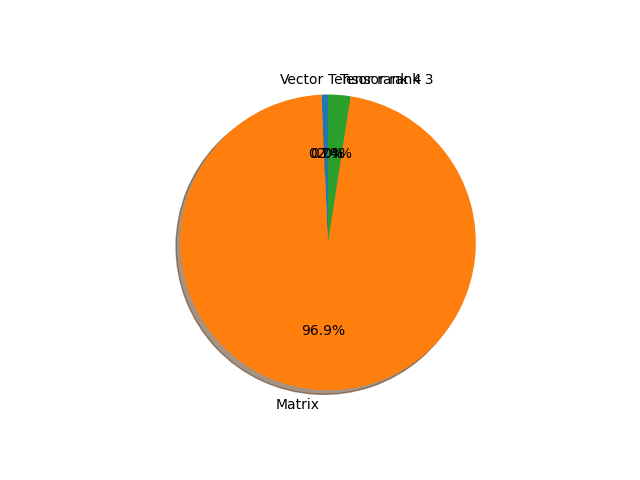

# efficientnet_b5 parameter information

**Number of layers: [ 506 ]**

**Number of parameters: [ 30.39M ]**

**Proportional of each form** (%)

| Vector | Matrix | Tensor rank 3 | Tensor rank 4 | 
|  --- | --- | --- | --- |
| 61.46 | 30.63 | 7.71 | 0.20 | 

**Proportional of parameters by form** (%)

| Vector | Matrix | Tensor rank 3 | Tensor rank 4 | 
|  --- | --- | --- | --- |
| 0.70 | 96.85 | 2.44 | 0.00 | 

**Layer information**

| Name | Shape | Squeezed shape | Number of parameters | Form |
| --- | --- | --- | --- | --- |
| features.0.0.weight | (48, 3, 3, 3) | (48, 3, 3, 3) | 1296 | Tensor rank 4 |
| features.0.1.weight | (48,) | (48,) | 48 | Vector |
| features.0.1.bias | (48,) | (48,) | 48 | Vector |
| features.1.0.block.0.0.weight | (48, 1, 3, 3) | (48, 3, 3) | 432 | Tensor rank 3 |
| features.1.0.block.0.1.weight | (48,) | (48,) | 48 | Vector |
| features.1.0.block.0.1.bias | (48,) | (48,) | 48 | Vector |
| features.1.0.block.1.fc1.weight | (12, 48, 1, 1) | (12, 48) | 576 | Matrix |
| features.1.0.block.1.fc1.bias | (12,) | (12,) | 12 | Vector |
| features.1.0.block.1.fc2.weight | (48, 12, 1, 1) | (48, 12) | 576 | Matrix |
| features.1.0.block.1.fc2.bias | (48,) | (48,) | 48 | Vector |
| features.1.0.block.2.0.weight | (24, 48, 1, 1) | (24, 48) | 1152 | Matrix |
| features.1.0.block.2.1.weight | (24,) | (24,) | 24 | Vector |
| features.1.0.block.2.1.bias | (24,) | (24,) | 24 | Vector |
| features.1.1.block.0.0.weight | (24, 1, 3, 3) | (24, 3, 3) | 216 | Tensor rank 3 |
| features.1.1.block.0.1.weight | (24,) | (24,) | 24 | Vector |
| features.1.1.block.0.1.bias | (24,) | (24,) | 24 | Vector |
| features.1.1.block.1.fc1.weight | (6, 24, 1, 1) | (6, 24) | 144 | Matrix |
| features.1.1.block.1.fc1.bias | (6,) | (6,) | 6 | Vector |
| features.1.1.block.1.fc2.weight | (24, 6, 1, 1) | (24, 6) | 144 | Matrix |
| features.1.1.block.1.fc2.bias | (24,) | (24,) | 24 | Vector |
| features.1.1.block.2.0.weight | (24, 24, 1, 1) | (24, 24) | 576 | Matrix |
| features.1.1.block.2.1.weight | (24,) | (24,) | 24 | Vector |
| features.1.1.block.2.1.bias | (24,) | (24,) | 24 | Vector |
| features.1.2.block.0.0.weight | (24, 1, 3, 3) | (24, 3, 3) | 216 | Tensor rank 3 |
| features.1.2.block.0.1.weight | (24,) | (24,) | 24 | Vector |
| features.1.2.block.0.1.bias | (24,) | (24,) | 24 | Vector |
| features.1.2.block.1.fc1.weight | (6, 24, 1, 1) | (6, 24) | 144 | Matrix |
| features.1.2.block.1.fc1.bias | (6,) | (6,) | 6 | Vector |
| features.1.2.block.1.fc2.weight | (24, 6, 1, 1) | (24, 6) | 144 | Matrix |
| features.1.2.block.1.fc2.bias | (24,) | (24,) | 24 | Vector |
| features.1.2.block.2.0.weight | (24, 24, 1, 1) | (24, 24) | 576 | Matrix |
| features.1.2.block.2.1.weight | (24,) | (24,) | 24 | Vector |
| features.1.2.block.2.1.bias | (24,) | (24,) | 24 | Vector |
| features.2.0.block.0.0.weight | (144, 24, 1, 1) | (144, 24) | 3456 | Matrix |
| features.2.0.block.0.1.weight | (144,) | (144,) | 144 | Vector |
| features.2.0.block.0.1.bias | (144,) | (144,) | 144 | Vector |
| features.2.0.block.1.0.weight | (144, 1, 3, 3) | (144, 3, 3) | 1296 | Tensor rank 3 |
| features.2.0.block.1.1.weight | (144,) | (144,) | 144 | Vector |
| features.2.0.block.1.1.bias | (144,) | (144,) | 144 | Vector |
| features.2.0.block.2.fc1.weight | (6, 144, 1, 1) | (6, 144) | 864 | Matrix |
| features.2.0.block.2.fc1.bias | (6,) | (6,) | 6 | Vector |
| features.2.0.block.2.fc2.weight | (144, 6, 1, 1) | (144, 6) | 864 | Matrix |
| features.2.0.block.2.fc2.bias | (144,) | (144,) | 144 | Vector |
| features.2.0.block.3.0.weight | (40, 144, 1, 1) | (40, 144) | 5760 | Matrix |
| features.2.0.block.3.1.weight | (40,) | (40,) | 40 | Vector |
| features.2.0.block.3.1.bias | (40,) | (40,) | 40 | Vector |
| features.2.1.block.0.0.weight | (240, 40, 1, 1) | (240, 40) | 9600 | Matrix |
| features.2.1.block.0.1.weight | (240,) | (240,) | 240 | Vector |
| features.2.1.block.0.1.bias | (240,) | (240,) | 240 | Vector |
| features.2.1.block.1.0.weight | (240, 1, 3, 3) | (240, 3, 3) | 2160 | Tensor rank 3 |
| features.2.1.block.1.1.weight | (240,) | (240,) | 240 | Vector |
| features.2.1.block.1.1.bias | (240,) | (240,) | 240 | Vector |
| features.2.1.block.2.fc1.weight | (10, 240, 1, 1) | (10, 240) | 2400 | Matrix |
| features.2.1.block.2.fc1.bias | (10,) | (10,) | 10 | Vector |
| features.2.1.block.2.fc2.weight | (240, 10, 1, 1) | (240, 10) | 2400 | Matrix |
| features.2.1.block.2.fc2.bias | (240,) | (240,) | 240 | Vector |
| features.2.1.block.3.0.weight | (40, 240, 1, 1) | (40, 240) | 9600 | Matrix |
| features.2.1.block.3.1.weight | (40,) | (40,) | 40 | Vector |
| features.2.1.block.3.1.bias | (40,) | (40,) | 40 | Vector |
| features.2.2.block.0.0.weight | (240, 40, 1, 1) | (240, 40) | 9600 | Matrix |
| features.2.2.block.0.1.weight | (240,) | (240,) | 240 | Vector |
| features.2.2.block.0.1.bias | (240,) | (240,) | 240 | Vector |
| features.2.2.block.1.0.weight | (240, 1, 3, 3) | (240, 3, 3) | 2160 | Tensor rank 3 |
| features.2.2.block.1.1.weight | (240,) | (240,) | 240 | Vector |
| features.2.2.block.1.1.bias | (240,) | (240,) | 240 | Vector |
| features.2.2.block.2.fc1.weight | (10, 240, 1, 1) | (10, 240) | 2400 | Matrix |
| features.2.2.block.2.fc1.bias | (10,) | (10,) | 10 | Vector |
| features.2.2.block.2.fc2.weight | (240, 10, 1, 1) | (240, 10) | 2400 | Matrix |
| features.2.2.block.2.fc2.bias | (240,) | (240,) | 240 | Vector |
| features.2.2.block.3.0.weight | (40, 240, 1, 1) | (40, 240) | 9600 | Matrix |
| features.2.2.block.3.1.weight | (40,) | (40,) | 40 | Vector |
| features.2.2.block.3.1.bias | (40,) | (40,) | 40 | Vector |
| features.2.3.block.0.0.weight | (240, 40, 1, 1) | (240, 40) | 9600 | Matrix |
| features.2.3.block.0.1.weight | (240,) | (240,) | 240 | Vector |
| features.2.3.block.0.1.bias | (240,) | (240,) | 240 | Vector |
| features.2.3.block.1.0.weight | (240, 1, 3, 3) | (240, 3, 3) | 2160 | Tensor rank 3 |
| features.2.3.block.1.1.weight | (240,) | (240,) | 240 | Vector |
| features.2.3.block.1.1.bias | (240,) | (240,) | 240 | Vector |
| features.2.3.block.2.fc1.weight | (10, 240, 1, 1) | (10, 240) | 2400 | Matrix |
| features.2.3.block.2.fc1.bias | (10,) | (10,) | 10 | Vector |
| features.2.3.block.2.fc2.weight | (240, 10, 1, 1) | (240, 10) | 2400 | Matrix |
| features.2.3.block.2.fc2.bias | (240,) | (240,) | 240 | Vector |
| features.2.3.block.3.0.weight | (40, 240, 1, 1) | (40, 240) | 9600 | Matrix |
| features.2.3.block.3.1.weight | (40,) | (40,) | 40 | Vector |
| features.2.3.block.3.1.bias | (40,) | (40,) | 40 | Vector |
| features.2.4.block.0.0.weight | (240, 40, 1, 1) | (240, 40) | 9600 | Matrix |
| features.2.4.block.0.1.weight | (240,) | (240,) | 240 | Vector |
| features.2.4.block.0.1.bias | (240,) | (240,) | 240 | Vector |
| features.2.4.block.1.0.weight | (240, 1, 3, 3) | (240, 3, 3) | 2160 | Tensor rank 3 |
| features.2.4.block.1.1.weight | (240,) | (240,) | 240 | Vector |
| features.2.4.block.1.1.bias | (240,) | (240,) | 240 | Vector |
| features.2.4.block.2.fc1.weight | (10, 240, 1, 1) | (10, 240) | 2400 | Matrix |
| features.2.4.block.2.fc1.bias | (10,) | (10,) | 10 | Vector |
| features.2.4.block.2.fc2.weight | (240, 10, 1, 1) | (240, 10) | 2400 | Matrix |
| features.2.4.block.2.fc2.bias | (240,) | (240,) | 240 | Vector |
| features.2.4.block.3.0.weight | (40, 240, 1, 1) | (40, 240) | 9600 | Matrix |
| features.2.4.block.3.1.weight | (40,) | (40,) | 40 | Vector |
| features.2.4.block.3.1.bias | (40,) | (40,) | 40 | Vector |
| features.3.0.block.0.0.weight | (240, 40, 1, 1) | (240, 40) | 9600 | Matrix |
| features.3.0.block.0.1.weight | (240,) | (240,) | 240 | Vector |
| features.3.0.block.0.1.bias | (240,) | (240,) | 240 | Vector |
| features.3.0.block.1.0.weight | (240, 1, 5, 5) | (240, 5, 5) | 6000 | Tensor rank 3 |
| features.3.0.block.1.1.weight | (240,) | (240,) | 240 | Vector |
| features.3.0.block.1.1.bias | (240,) | (240,) | 240 | Vector |
| features.3.0.block.2.fc1.weight | (10, 240, 1, 1) | (10, 240) | 2400 | Matrix |
| features.3.0.block.2.fc1.bias | (10,) | (10,) | 10 | Vector |
| features.3.0.block.2.fc2.weight | (240, 10, 1, 1) | (240, 10) | 2400 | Matrix |
| features.3.0.block.2.fc2.bias | (240,) | (240,) | 240 | Vector |
| features.3.0.block.3.0.weight | (64, 240, 1, 1) | (64, 240) | 15360 | Matrix |
| features.3.0.block.3.1.weight | (64,) | (64,) | 64 | Vector |
| features.3.0.block.3.1.bias | (64,) | (64,) | 64 | Vector |
| features.3.1.block.0.0.weight | (384, 64, 1, 1) | (384, 64) | 24576 | Matrix |
| features.3.1.block.0.1.weight | (384,) | (384,) | 384 | Vector |
| features.3.1.block.0.1.bias | (384,) | (384,) | 384 | Vector |
| features.3.1.block.1.0.weight | (384, 1, 5, 5) | (384, 5, 5) | 9600 | Tensor rank 3 |
| features.3.1.block.1.1.weight | (384,) | (384,) | 384 | Vector |
| features.3.1.block.1.1.bias | (384,) | (384,) | 384 | Vector |
| features.3.1.block.2.fc1.weight | (16, 384, 1, 1) | (16, 384) | 6144 | Matrix |
| features.3.1.block.2.fc1.bias | (16,) | (16,) | 16 | Vector |
| features.3.1.block.2.fc2.weight | (384, 16, 1, 1) | (384, 16) | 6144 | Matrix |
| features.3.1.block.2.fc2.bias | (384,) | (384,) | 384 | Vector |
| features.3.1.block.3.0.weight | (64, 384, 1, 1) | (64, 384) | 24576 | Matrix |
| features.3.1.block.3.1.weight | (64,) | (64,) | 64 | Vector |
| features.3.1.block.3.1.bias | (64,) | (64,) | 64 | Vector |
| features.3.2.block.0.0.weight | (384, 64, 1, 1) | (384, 64) | 24576 | Matrix |
| features.3.2.block.0.1.weight | (384,) | (384,) | 384 | Vector |
| features.3.2.block.0.1.bias | (384,) | (384,) | 384 | Vector |
| features.3.2.block.1.0.weight | (384, 1, 5, 5) | (384, 5, 5) | 9600 | Tensor rank 3 |
| features.3.2.block.1.1.weight | (384,) | (384,) | 384 | Vector |
| features.3.2.block.1.1.bias | (384,) | (384,) | 384 | Vector |
| features.3.2.block.2.fc1.weight | (16, 384, 1, 1) | (16, 384) | 6144 | Matrix |
| features.3.2.block.2.fc1.bias | (16,) | (16,) | 16 | Vector |
| features.3.2.block.2.fc2.weight | (384, 16, 1, 1) | (384, 16) | 6144 | Matrix |
| features.3.2.block.2.fc2.bias | (384,) | (384,) | 384 | Vector |
| features.3.2.block.3.0.weight | (64, 384, 1, 1) | (64, 384) | 24576 | Matrix |
| features.3.2.block.3.1.weight | (64,) | (64,) | 64 | Vector |
| features.3.2.block.3.1.bias | (64,) | (64,) | 64 | Vector |
| features.3.3.block.0.0.weight | (384, 64, 1, 1) | (384, 64) | 24576 | Matrix |
| features.3.3.block.0.1.weight | (384,) | (384,) | 384 | Vector |
| features.3.3.block.0.1.bias | (384,) | (384,) | 384 | Vector |
| features.3.3.block.1.0.weight | (384, 1, 5, 5) | (384, 5, 5) | 9600 | Tensor rank 3 |
| features.3.3.block.1.1.weight | (384,) | (384,) | 384 | Vector |
| features.3.3.block.1.1.bias | (384,) | (384,) | 384 | Vector |
| features.3.3.block.2.fc1.weight | (16, 384, 1, 1) | (16, 384) | 6144 | Matrix |
| features.3.3.block.2.fc1.bias | (16,) | (16,) | 16 | Vector |
| features.3.3.block.2.fc2.weight | (384, 16, 1, 1) | (384, 16) | 6144 | Matrix |
| features.3.3.block.2.fc2.bias | (384,) | (384,) | 384 | Vector |
| features.3.3.block.3.0.weight | (64, 384, 1, 1) | (64, 384) | 24576 | Matrix |
| features.3.3.block.3.1.weight | (64,) | (64,) | 64 | Vector |
| features.3.3.block.3.1.bias | (64,) | (64,) | 64 | Vector |
| features.3.4.block.0.0.weight | (384, 64, 1, 1) | (384, 64) | 24576 | Matrix |
| features.3.4.block.0.1.weight | (384,) | (384,) | 384 | Vector |
| features.3.4.block.0.1.bias | (384,) | (384,) | 384 | Vector |
| features.3.4.block.1.0.weight | (384, 1, 5, 5) | (384, 5, 5) | 9600 | Tensor rank 3 |
| features.3.4.block.1.1.weight | (384,) | (384,) | 384 | Vector |
| features.3.4.block.1.1.bias | (384,) | (384,) | 384 | Vector |
| features.3.4.block.2.fc1.weight | (16, 384, 1, 1) | (16, 384) | 6144 | Matrix |
| features.3.4.block.2.fc1.bias | (16,) | (16,) | 16 | Vector |
| features.3.4.block.2.fc2.weight | (384, 16, 1, 1) | (384, 16) | 6144 | Matrix |
| features.3.4.block.2.fc2.bias | (384,) | (384,) | 384 | Vector |
| features.3.4.block.3.0.weight | (64, 384, 1, 1) | (64, 384) | 24576 | Matrix |
| features.3.4.block.3.1.weight | (64,) | (64,) | 64 | Vector |
| features.3.4.block.3.1.bias | (64,) | (64,) | 64 | Vector |
| features.4.0.block.0.0.weight | (384, 64, 1, 1) | (384, 64) | 24576 | Matrix |
| features.4.0.block.0.1.weight | (384,) | (384,) | 384 | Vector |
| features.4.0.block.0.1.bias | (384,) | (384,) | 384 | Vector |
| features.4.0.block.1.0.weight | (384, 1, 3, 3) | (384, 3, 3) | 3456 | Tensor rank 3 |
| features.4.0.block.1.1.weight | (384,) | (384,) | 384 | Vector |
| features.4.0.block.1.1.bias | (384,) | (384,) | 384 | Vector |
| features.4.0.block.2.fc1.weight | (16, 384, 1, 1) | (16, 384) | 6144 | Matrix |
| features.4.0.block.2.fc1.bias | (16,) | (16,) | 16 | Vector |
| features.4.0.block.2.fc2.weight | (384, 16, 1, 1) | (384, 16) | 6144 | Matrix |
| features.4.0.block.2.fc2.bias | (384,) | (384,) | 384 | Vector |
| features.4.0.block.3.0.weight | (128, 384, 1, 1) | (128, 384) | 49152 | Matrix |
| features.4.0.block.3.1.weight | (128,) | (128,) | 128 | Vector |
| features.4.0.block.3.1.bias | (128,) | (128,) | 128 | Vector |
| features.4.1.block.0.0.weight | (768, 128, 1, 1) | (768, 128) | 98304 | Matrix |
| features.4.1.block.0.1.weight | (768,) | (768,) | 768 | Vector |
| features.4.1.block.0.1.bias | (768,) | (768,) | 768 | Vector |
| features.4.1.block.1.0.weight | (768, 1, 3, 3) | (768, 3, 3) | 6912 | Tensor rank 3 |
| features.4.1.block.1.1.weight | (768,) | (768,) | 768 | Vector |
| features.4.1.block.1.1.bias | (768,) | (768,) | 768 | Vector |
| features.4.1.block.2.fc1.weight | (32, 768, 1, 1) | (32, 768) | 24576 | Matrix |
| features.4.1.block.2.fc1.bias | (32,) | (32,) | 32 | Vector |
| features.4.1.block.2.fc2.weight | (768, 32, 1, 1) | (768, 32) | 24576 | Matrix |
| features.4.1.block.2.fc2.bias | (768,) | (768,) | 768 | Vector |
| features.4.1.block.3.0.weight | (128, 768, 1, 1) | (128, 768) | 98304 | Matrix |
| features.4.1.block.3.1.weight | (128,) | (128,) | 128 | Vector |
| features.4.1.block.3.1.bias | (128,) | (128,) | 128 | Vector |
| features.4.2.block.0.0.weight | (768, 128, 1, 1) | (768, 128) | 98304 | Matrix |
| features.4.2.block.0.1.weight | (768,) | (768,) | 768 | Vector |
| features.4.2.block.0.1.bias | (768,) | (768,) | 768 | Vector |
| features.4.2.block.1.0.weight | (768, 1, 3, 3) | (768, 3, 3) | 6912 | Tensor rank 3 |
| features.4.2.block.1.1.weight | (768,) | (768,) | 768 | Vector |
| features.4.2.block.1.1.bias | (768,) | (768,) | 768 | Vector |
| features.4.2.block.2.fc1.weight | (32, 768, 1, 1) | (32, 768) | 24576 | Matrix |
| features.4.2.block.2.fc1.bias | (32,) | (32,) | 32 | Vector |
| features.4.2.block.2.fc2.weight | (768, 32, 1, 1) | (768, 32) | 24576 | Matrix |
| features.4.2.block.2.fc2.bias | (768,) | (768,) | 768 | Vector |
| features.4.2.block.3.0.weight | (128, 768, 1, 1) | (128, 768) | 98304 | Matrix |
| features.4.2.block.3.1.weight | (128,) | (128,) | 128 | Vector |
| features.4.2.block.3.1.bias | (128,) | (128,) | 128 | Vector |
| features.4.3.block.0.0.weight | (768, 128, 1, 1) | (768, 128) | 98304 | Matrix |
| features.4.3.block.0.1.weight | (768,) | (768,) | 768 | Vector |
| features.4.3.block.0.1.bias | (768,) | (768,) | 768 | Vector |
| features.4.3.block.1.0.weight | (768, 1, 3, 3) | (768, 3, 3) | 6912 | Tensor rank 3 |
| features.4.3.block.1.1.weight | (768,) | (768,) | 768 | Vector |
| features.4.3.block.1.1.bias | (768,) | (768,) | 768 | Vector |
| features.4.3.block.2.fc1.weight | (32, 768, 1, 1) | (32, 768) | 24576 | Matrix |
| features.4.3.block.2.fc1.bias | (32,) | (32,) | 32 | Vector |
| features.4.3.block.2.fc2.weight | (768, 32, 1, 1) | (768, 32) | 24576 | Matrix |
| features.4.3.block.2.fc2.bias | (768,) | (768,) | 768 | Vector |
| features.4.3.block.3.0.weight | (128, 768, 1, 1) | (128, 768) | 98304 | Matrix |
| features.4.3.block.3.1.weight | (128,) | (128,) | 128 | Vector |
| features.4.3.block.3.1.bias | (128,) | (128,) | 128 | Vector |
| features.4.4.block.0.0.weight | (768, 128, 1, 1) | (768, 128) | 98304 | Matrix |
| features.4.4.block.0.1.weight | (768,) | (768,) | 768 | Vector |
| features.4.4.block.0.1.bias | (768,) | (768,) | 768 | Vector |
| features.4.4.block.1.0.weight | (768, 1, 3, 3) | (768, 3, 3) | 6912 | Tensor rank 3 |
| features.4.4.block.1.1.weight | (768,) | (768,) | 768 | Vector |
| features.4.4.block.1.1.bias | (768,) | (768,) | 768 | Vector |
| features.4.4.block.2.fc1.weight | (32, 768, 1, 1) | (32, 768) | 24576 | Matrix |
| features.4.4.block.2.fc1.bias | (32,) | (32,) | 32 | Vector |
| features.4.4.block.2.fc2.weight | (768, 32, 1, 1) | (768, 32) | 24576 | Matrix |
| features.4.4.block.2.fc2.bias | (768,) | (768,) | 768 | Vector |
| features.4.4.block.3.0.weight | (128, 768, 1, 1) | (128, 768) | 98304 | Matrix |
| features.4.4.block.3.1.weight | (128,) | (128,) | 128 | Vector |
| features.4.4.block.3.1.bias | (128,) | (128,) | 128 | Vector |
| features.4.5.block.0.0.weight | (768, 128, 1, 1) | (768, 128) | 98304 | Matrix |
| features.4.5.block.0.1.weight | (768,) | (768,) | 768 | Vector |
| features.4.5.block.0.1.bias | (768,) | (768,) | 768 | Vector |
| features.4.5.block.1.0.weight | (768, 1, 3, 3) | (768, 3, 3) | 6912 | Tensor rank 3 |
| features.4.5.block.1.1.weight | (768,) | (768,) | 768 | Vector |
| features.4.5.block.1.1.bias | (768,) | (768,) | 768 | Vector |
| features.4.5.block.2.fc1.weight | (32, 768, 1, 1) | (32, 768) | 24576 | Matrix |
| features.4.5.block.2.fc1.bias | (32,) | (32,) | 32 | Vector |
| features.4.5.block.2.fc2.weight | (768, 32, 1, 1) | (768, 32) | 24576 | Matrix |
| features.4.5.block.2.fc2.bias | (768,) | (768,) | 768 | Vector |
| features.4.5.block.3.0.weight | (128, 768, 1, 1) | (128, 768) | 98304 | Matrix |
| features.4.5.block.3.1.weight | (128,) | (128,) | 128 | Vector |
| features.4.5.block.3.1.bias | (128,) | (128,) | 128 | Vector |
| features.4.6.block.0.0.weight | (768, 128, 1, 1) | (768, 128) | 98304 | Matrix |
| features.4.6.block.0.1.weight | (768,) | (768,) | 768 | Vector |
| features.4.6.block.0.1.bias | (768,) | (768,) | 768 | Vector |
| features.4.6.block.1.0.weight | (768, 1, 3, 3) | (768, 3, 3) | 6912 | Tensor rank 3 |
| features.4.6.block.1.1.weight | (768,) | (768,) | 768 | Vector |
| features.4.6.block.1.1.bias | (768,) | (768,) | 768 | Vector |
| features.4.6.block.2.fc1.weight | (32, 768, 1, 1) | (32, 768) | 24576 | Matrix |
| features.4.6.block.2.fc1.bias | (32,) | (32,) | 32 | Vector |
| features.4.6.block.2.fc2.weight | (768, 32, 1, 1) | (768, 32) | 24576 | Matrix |
| features.4.6.block.2.fc2.bias | (768,) | (768,) | 768 | Vector |
| features.4.6.block.3.0.weight | (128, 768, 1, 1) | (128, 768) | 98304 | Matrix |
| features.4.6.block.3.1.weight | (128,) | (128,) | 128 | Vector |
| features.4.6.block.3.1.bias | (128,) | (128,) | 128 | Vector |
| features.5.0.block.0.0.weight | (768, 128, 1, 1) | (768, 128) | 98304 | Matrix |
| features.5.0.block.0.1.weight | (768,) | (768,) | 768 | Vector |
| features.5.0.block.0.1.bias | (768,) | (768,) | 768 | Vector |
| features.5.0.block.1.0.weight | (768, 1, 5, 5) | (768, 5, 5) | 19200 | Tensor rank 3 |
| features.5.0.block.1.1.weight | (768,) | (768,) | 768 | Vector |
| features.5.0.block.1.1.bias | (768,) | (768,) | 768 | Vector |
| features.5.0.block.2.fc1.weight | (32, 768, 1, 1) | (32, 768) | 24576 | Matrix |
| features.5.0.block.2.fc1.bias | (32,) | (32,) | 32 | Vector |
| features.5.0.block.2.fc2.weight | (768, 32, 1, 1) | (768, 32) | 24576 | Matrix |
| features.5.0.block.2.fc2.bias | (768,) | (768,) | 768 | Vector |
| features.5.0.block.3.0.weight | (176, 768, 1, 1) | (176, 768) | 135168 | Matrix |
| features.5.0.block.3.1.weight | (176,) | (176,) | 176 | Vector |
| features.5.0.block.3.1.bias | (176,) | (176,) | 176 | Vector |
| features.5.1.block.0.0.weight | (1056, 176, 1, 1) | (1056, 176) | 185856 | Matrix |
| features.5.1.block.0.1.weight | (1056,) | (1056,) | 1056 | Vector |
| features.5.1.block.0.1.bias | (1056,) | (1056,) | 1056 | Vector |
| features.5.1.block.1.0.weight | (1056, 1, 5, 5) | (1056, 5, 5) | 26400 | Tensor rank 3 |
| features.5.1.block.1.1.weight | (1056,) | (1056,) | 1056 | Vector |
| features.5.1.block.1.1.bias | (1056,) | (1056,) | 1056 | Vector |
| features.5.1.block.2.fc1.weight | (44, 1056, 1, 1) | (44, 1056) | 46464 | Matrix |
| features.5.1.block.2.fc1.bias | (44,) | (44,) | 44 | Vector |
| features.5.1.block.2.fc2.weight | (1056, 44, 1, 1) | (1056, 44) | 46464 | Matrix |
| features.5.1.block.2.fc2.bias | (1056,) | (1056,) | 1056 | Vector |
| features.5.1.block.3.0.weight | (176, 1056, 1, 1) | (176, 1056) | 185856 | Matrix |
| features.5.1.block.3.1.weight | (176,) | (176,) | 176 | Vector |
| features.5.1.block.3.1.bias | (176,) | (176,) | 176 | Vector |
| features.5.2.block.0.0.weight | (1056, 176, 1, 1) | (1056, 176) | 185856 | Matrix |
| features.5.2.block.0.1.weight | (1056,) | (1056,) | 1056 | Vector |
| features.5.2.block.0.1.bias | (1056,) | (1056,) | 1056 | Vector |
| features.5.2.block.1.0.weight | (1056, 1, 5, 5) | (1056, 5, 5) | 26400 | Tensor rank 3 |
| features.5.2.block.1.1.weight | (1056,) | (1056,) | 1056 | Vector |
| features.5.2.block.1.1.bias | (1056,) | (1056,) | 1056 | Vector |
| features.5.2.block.2.fc1.weight | (44, 1056, 1, 1) | (44, 1056) | 46464 | Matrix |
| features.5.2.block.2.fc1.bias | (44,) | (44,) | 44 | Vector |
| features.5.2.block.2.fc2.weight | (1056, 44, 1, 1) | (1056, 44) | 46464 | Matrix |
| features.5.2.block.2.fc2.bias | (1056,) | (1056,) | 1056 | Vector |
| features.5.2.block.3.0.weight | (176, 1056, 1, 1) | (176, 1056) | 185856 | Matrix |
| features.5.2.block.3.1.weight | (176,) | (176,) | 176 | Vector |
| features.5.2.block.3.1.bias | (176,) | (176,) | 176 | Vector |
| features.5.3.block.0.0.weight | (1056, 176, 1, 1) | (1056, 176) | 185856 | Matrix |
| features.5.3.block.0.1.weight | (1056,) | (1056,) | 1056 | Vector |
| features.5.3.block.0.1.bias | (1056,) | (1056,) | 1056 | Vector |
| features.5.3.block.1.0.weight | (1056, 1, 5, 5) | (1056, 5, 5) | 26400 | Tensor rank 3 |
| features.5.3.block.1.1.weight | (1056,) | (1056,) | 1056 | Vector |
| features.5.3.block.1.1.bias | (1056,) | (1056,) | 1056 | Vector |
| features.5.3.block.2.fc1.weight | (44, 1056, 1, 1) | (44, 1056) | 46464 | Matrix |
| features.5.3.block.2.fc1.bias | (44,) | (44,) | 44 | Vector |
| features.5.3.block.2.fc2.weight | (1056, 44, 1, 1) | (1056, 44) | 46464 | Matrix |
| features.5.3.block.2.fc2.bias | (1056,) | (1056,) | 1056 | Vector |
| features.5.3.block.3.0.weight | (176, 1056, 1, 1) | (176, 1056) | 185856 | Matrix |
| features.5.3.block.3.1.weight | (176,) | (176,) | 176 | Vector |
| features.5.3.block.3.1.bias | (176,) | (176,) | 176 | Vector |
| features.5.4.block.0.0.weight | (1056, 176, 1, 1) | (1056, 176) | 185856 | Matrix |
| features.5.4.block.0.1.weight | (1056,) | (1056,) | 1056 | Vector |
| features.5.4.block.0.1.bias | (1056,) | (1056,) | 1056 | Vector |
| features.5.4.block.1.0.weight | (1056, 1, 5, 5) | (1056, 5, 5) | 26400 | Tensor rank 3 |
| features.5.4.block.1.1.weight | (1056,) | (1056,) | 1056 | Vector |
| features.5.4.block.1.1.bias | (1056,) | (1056,) | 1056 | Vector |
| features.5.4.block.2.fc1.weight | (44, 1056, 1, 1) | (44, 1056) | 46464 | Matrix |
| features.5.4.block.2.fc1.bias | (44,) | (44,) | 44 | Vector |
| features.5.4.block.2.fc2.weight | (1056, 44, 1, 1) | (1056, 44) | 46464 | Matrix |
| features.5.4.block.2.fc2.bias | (1056,) | (1056,) | 1056 | Vector |
| features.5.4.block.3.0.weight | (176, 1056, 1, 1) | (176, 1056) | 185856 | Matrix |
| features.5.4.block.3.1.weight | (176,) | (176,) | 176 | Vector |
| features.5.4.block.3.1.bias | (176,) | (176,) | 176 | Vector |
| features.5.5.block.0.0.weight | (1056, 176, 1, 1) | (1056, 176) | 185856 | Matrix |
| features.5.5.block.0.1.weight | (1056,) | (1056,) | 1056 | Vector |
| features.5.5.block.0.1.bias | (1056,) | (1056,) | 1056 | Vector |
| features.5.5.block.1.0.weight | (1056, 1, 5, 5) | (1056, 5, 5) | 26400 | Tensor rank 3 |
| features.5.5.block.1.1.weight | (1056,) | (1056,) | 1056 | Vector |
| features.5.5.block.1.1.bias | (1056,) | (1056,) | 1056 | Vector |
| features.5.5.block.2.fc1.weight | (44, 1056, 1, 1) | (44, 1056) | 46464 | Matrix |
| features.5.5.block.2.fc1.bias | (44,) | (44,) | 44 | Vector |
| features.5.5.block.2.fc2.weight | (1056, 44, 1, 1) | (1056, 44) | 46464 | Matrix |
| features.5.5.block.2.fc2.bias | (1056,) | (1056,) | 1056 | Vector |
| features.5.5.block.3.0.weight | (176, 1056, 1, 1) | (176, 1056) | 185856 | Matrix |
| features.5.5.block.3.1.weight | (176,) | (176,) | 176 | Vector |
| features.5.5.block.3.1.bias | (176,) | (176,) | 176 | Vector |
| features.5.6.block.0.0.weight | (1056, 176, 1, 1) | (1056, 176) | 185856 | Matrix |
| features.5.6.block.0.1.weight | (1056,) | (1056,) | 1056 | Vector |
| features.5.6.block.0.1.bias | (1056,) | (1056,) | 1056 | Vector |
| features.5.6.block.1.0.weight | (1056, 1, 5, 5) | (1056, 5, 5) | 26400 | Tensor rank 3 |
| features.5.6.block.1.1.weight | (1056,) | (1056,) | 1056 | Vector |
| features.5.6.block.1.1.bias | (1056,) | (1056,) | 1056 | Vector |
| features.5.6.block.2.fc1.weight | (44, 1056, 1, 1) | (44, 1056) | 46464 | Matrix |
| features.5.6.block.2.fc1.bias | (44,) | (44,) | 44 | Vector |
| features.5.6.block.2.fc2.weight | (1056, 44, 1, 1) | (1056, 44) | 46464 | Matrix |
| features.5.6.block.2.fc2.bias | (1056,) | (1056,) | 1056 | Vector |
| features.5.6.block.3.0.weight | (176, 1056, 1, 1) | (176, 1056) | 185856 | Matrix |
| features.5.6.block.3.1.weight | (176,) | (176,) | 176 | Vector |
| features.5.6.block.3.1.bias | (176,) | (176,) | 176 | Vector |
| features.6.0.block.0.0.weight | (1056, 176, 1, 1) | (1056, 176) | 185856 | Matrix |
| features.6.0.block.0.1.weight | (1056,) | (1056,) | 1056 | Vector |
| features.6.0.block.0.1.bias | (1056,) | (1056,) | 1056 | Vector |
| features.6.0.block.1.0.weight | (1056, 1, 5, 5) | (1056, 5, 5) | 26400 | Tensor rank 3 |
| features.6.0.block.1.1.weight | (1056,) | (1056,) | 1056 | Vector |
| features.6.0.block.1.1.bias | (1056,) | (1056,) | 1056 | Vector |
| features.6.0.block.2.fc1.weight | (44, 1056, 1, 1) | (44, 1056) | 46464 | Matrix |
| features.6.0.block.2.fc1.bias | (44,) | (44,) | 44 | Vector |
| features.6.0.block.2.fc2.weight | (1056, 44, 1, 1) | (1056, 44) | 46464 | Matrix |
| features.6.0.block.2.fc2.bias | (1056,) | (1056,) | 1056 | Vector |
| features.6.0.block.3.0.weight | (304, 1056, 1, 1) | (304, 1056) | 321024 | Matrix |
| features.6.0.block.3.1.weight | (304,) | (304,) | 304 | Vector |
| features.6.0.block.3.1.bias | (304,) | (304,) | 304 | Vector |
| features.6.1.block.0.0.weight | (1824, 304, 1, 1) | (1824, 304) | 554496 | Matrix |
| features.6.1.block.0.1.weight | (1824,) | (1824,) | 1824 | Vector |
| features.6.1.block.0.1.bias | (1824,) | (1824,) | 1824 | Vector |
| features.6.1.block.1.0.weight | (1824, 1, 5, 5) | (1824, 5, 5) | 45600 | Tensor rank 3 |
| features.6.1.block.1.1.weight | (1824,) | (1824,) | 1824 | Vector |
| features.6.1.block.1.1.bias | (1824,) | (1824,) | 1824 | Vector |
| features.6.1.block.2.fc1.weight | (76, 1824, 1, 1) | (76, 1824) | 138624 | Matrix |
| features.6.1.block.2.fc1.bias | (76,) | (76,) | 76 | Vector |
| features.6.1.block.2.fc2.weight | (1824, 76, 1, 1) | (1824, 76) | 138624 | Matrix |
| features.6.1.block.2.fc2.bias | (1824,) | (1824,) | 1824 | Vector |
| features.6.1.block.3.0.weight | (304, 1824, 1, 1) | (304, 1824) | 554496 | Matrix |
| features.6.1.block.3.1.weight | (304,) | (304,) | 304 | Vector |
| features.6.1.block.3.1.bias | (304,) | (304,) | 304 | Vector |
| features.6.2.block.0.0.weight | (1824, 304, 1, 1) | (1824, 304) | 554496 | Matrix |
| features.6.2.block.0.1.weight | (1824,) | (1824,) | 1824 | Vector |
| features.6.2.block.0.1.bias | (1824,) | (1824,) | 1824 | Vector |
| features.6.2.block.1.0.weight | (1824, 1, 5, 5) | (1824, 5, 5) | 45600 | Tensor rank 3 |
| features.6.2.block.1.1.weight | (1824,) | (1824,) | 1824 | Vector |
| features.6.2.block.1.1.bias | (1824,) | (1824,) | 1824 | Vector |
| features.6.2.block.2.fc1.weight | (76, 1824, 1, 1) | (76, 1824) | 138624 | Matrix |
| features.6.2.block.2.fc1.bias | (76,) | (76,) | 76 | Vector |
| features.6.2.block.2.fc2.weight | (1824, 76, 1, 1) | (1824, 76) | 138624 | Matrix |
| features.6.2.block.2.fc2.bias | (1824,) | (1824,) | 1824 | Vector |
| features.6.2.block.3.0.weight | (304, 1824, 1, 1) | (304, 1824) | 554496 | Matrix |
| features.6.2.block.3.1.weight | (304,) | (304,) | 304 | Vector |
| features.6.2.block.3.1.bias | (304,) | (304,) | 304 | Vector |
| features.6.3.block.0.0.weight | (1824, 304, 1, 1) | (1824, 304) | 554496 | Matrix |
| features.6.3.block.0.1.weight | (1824,) | (1824,) | 1824 | Vector |
| features.6.3.block.0.1.bias | (1824,) | (1824,) | 1824 | Vector |
| features.6.3.block.1.0.weight | (1824, 1, 5, 5) | (1824, 5, 5) | 45600 | Tensor rank 3 |
| features.6.3.block.1.1.weight | (1824,) | (1824,) | 1824 | Vector |
| features.6.3.block.1.1.bias | (1824,) | (1824,) | 1824 | Vector |
| features.6.3.block.2.fc1.weight | (76, 1824, 1, 1) | (76, 1824) | 138624 | Matrix |
| features.6.3.block.2.fc1.bias | (76,) | (76,) | 76 | Vector |
| features.6.3.block.2.fc2.weight | (1824, 76, 1, 1) | (1824, 76) | 138624 | Matrix |
| features.6.3.block.2.fc2.bias | (1824,) | (1824,) | 1824 | Vector |
| features.6.3.block.3.0.weight | (304, 1824, 1, 1) | (304, 1824) | 554496 | Matrix |
| features.6.3.block.3.1.weight | (304,) | (304,) | 304 | Vector |
| features.6.3.block.3.1.bias | (304,) | (304,) | 304 | Vector |
| features.6.4.block.0.0.weight | (1824, 304, 1, 1) | (1824, 304) | 554496 | Matrix |
| features.6.4.block.0.1.weight | (1824,) | (1824,) | 1824 | Vector |
| features.6.4.block.0.1.bias | (1824,) | (1824,) | 1824 | Vector |
| features.6.4.block.1.0.weight | (1824, 1, 5, 5) | (1824, 5, 5) | 45600 | Tensor rank 3 |
| features.6.4.block.1.1.weight | (1824,) | (1824,) | 1824 | Vector |
| features.6.4.block.1.1.bias | (1824,) | (1824,) | 1824 | Vector |
| features.6.4.block.2.fc1.weight | (76, 1824, 1, 1) | (76, 1824) | 138624 | Matrix |
| features.6.4.block.2.fc1.bias | (76,) | (76,) | 76 | Vector |
| features.6.4.block.2.fc2.weight | (1824, 76, 1, 1) | (1824, 76) | 138624 | Matrix |
| features.6.4.block.2.fc2.bias | (1824,) | (1824,) | 1824 | Vector |
| features.6.4.block.3.0.weight | (304, 1824, 1, 1) | (304, 1824) | 554496 | Matrix |
| features.6.4.block.3.1.weight | (304,) | (304,) | 304 | Vector |
| features.6.4.block.3.1.bias | (304,) | (304,) | 304 | Vector |
| features.6.5.block.0.0.weight | (1824, 304, 1, 1) | (1824, 304) | 554496 | Matrix |
| features.6.5.block.0.1.weight | (1824,) | (1824,) | 1824 | Vector |
| features.6.5.block.0.1.bias | (1824,) | (1824,) | 1824 | Vector |
| features.6.5.block.1.0.weight | (1824, 1, 5, 5) | (1824, 5, 5) | 45600 | Tensor rank 3 |
| features.6.5.block.1.1.weight | (1824,) | (1824,) | 1824 | Vector |
| features.6.5.block.1.1.bias | (1824,) | (1824,) | 1824 | Vector |
| features.6.5.block.2.fc1.weight | (76, 1824, 1, 1) | (76, 1824) | 138624 | Matrix |
| features.6.5.block.2.fc1.bias | (76,) | (76,) | 76 | Vector |
| features.6.5.block.2.fc2.weight | (1824, 76, 1, 1) | (1824, 76) | 138624 | Matrix |
| features.6.5.block.2.fc2.bias | (1824,) | (1824,) | 1824 | Vector |
| features.6.5.block.3.0.weight | (304, 1824, 1, 1) | (304, 1824) | 554496 | Matrix |
| features.6.5.block.3.1.weight | (304,) | (304,) | 304 | Vector |
| features.6.5.block.3.1.bias | (304,) | (304,) | 304 | Vector |
| features.6.6.block.0.0.weight | (1824, 304, 1, 1) | (1824, 304) | 554496 | Matrix |
| features.6.6.block.0.1.weight | (1824,) | (1824,) | 1824 | Vector |
| features.6.6.block.0.1.bias | (1824,) | (1824,) | 1824 | Vector |
| features.6.6.block.1.0.weight | (1824, 1, 5, 5) | (1824, 5, 5) | 45600 | Tensor rank 3 |
| features.6.6.block.1.1.weight | (1824,) | (1824,) | 1824 | Vector |
| features.6.6.block.1.1.bias | (1824,) | (1824,) | 1824 | Vector |
| features.6.6.block.2.fc1.weight | (76, 1824, 1, 1) | (76, 1824) | 138624 | Matrix |
| features.6.6.block.2.fc1.bias | (76,) | (76,) | 76 | Vector |
| features.6.6.block.2.fc2.weight | (1824, 76, 1, 1) | (1824, 76) | 138624 | Matrix |
| features.6.6.block.2.fc2.bias | (1824,) | (1824,) | 1824 | Vector |
| features.6.6.block.3.0.weight | (304, 1824, 1, 1) | (304, 1824) | 554496 | Matrix |
| features.6.6.block.3.1.weight | (304,) | (304,) | 304 | Vector |
| features.6.6.block.3.1.bias | (304,) | (304,) | 304 | Vector |
| features.6.7.block.0.0.weight | (1824, 304, 1, 1) | (1824, 304) | 554496 | Matrix |
| features.6.7.block.0.1.weight | (1824,) | (1824,) | 1824 | Vector |
| features.6.7.block.0.1.bias | (1824,) | (1824,) | 1824 | Vector |
| features.6.7.block.1.0.weight | (1824, 1, 5, 5) | (1824, 5, 5) | 45600 | Tensor rank 3 |
| features.6.7.block.1.1.weight | (1824,) | (1824,) | 1824 | Vector |
| features.6.7.block.1.1.bias | (1824,) | (1824,) | 1824 | Vector |
| features.6.7.block.2.fc1.weight | (76, 1824, 1, 1) | (76, 1824) | 138624 | Matrix |
| features.6.7.block.2.fc1.bias | (76,) | (76,) | 76 | Vector |
| features.6.7.block.2.fc2.weight | (1824, 76, 1, 1) | (1824, 76) | 138624 | Matrix |
| features.6.7.block.2.fc2.bias | (1824,) | (1824,) | 1824 | Vector |
| features.6.7.block.3.0.weight | (304, 1824, 1, 1) | (304, 1824) | 554496 | Matrix |
| features.6.7.block.3.1.weight | (304,) | (304,) | 304 | Vector |
| features.6.7.block.3.1.bias | (304,) | (304,) | 304 | Vector |
| features.6.8.block.0.0.weight | (1824, 304, 1, 1) | (1824, 304) | 554496 | Matrix |
| features.6.8.block.0.1.weight | (1824,) | (1824,) | 1824 | Vector |
| features.6.8.block.0.1.bias | (1824,) | (1824,) | 1824 | Vector |
| features.6.8.block.1.0.weight | (1824, 1, 5, 5) | (1824, 5, 5) | 45600 | Tensor rank 3 |
| features.6.8.block.1.1.weight | (1824,) | (1824,) | 1824 | Vector |
| features.6.8.block.1.1.bias | (1824,) | (1824,) | 1824 | Vector |
| features.6.8.block.2.fc1.weight | (76, 1824, 1, 1) | (76, 1824) | 138624 | Matrix |
| features.6.8.block.2.fc1.bias | (76,) | (76,) | 76 | Vector |
| features.6.8.block.2.fc2.weight | (1824, 76, 1, 1) | (1824, 76) | 138624 | Matrix |
| features.6.8.block.2.fc2.bias | (1824,) | (1824,) | 1824 | Vector |
| features.6.8.block.3.0.weight | (304, 1824, 1, 1) | (304, 1824) | 554496 | Matrix |
| features.6.8.block.3.1.weight | (304,) | (304,) | 304 | Vector |
| features.6.8.block.3.1.bias | (304,) | (304,) | 304 | Vector |
| features.7.0.block.0.0.weight | (1824, 304, 1, 1) | (1824, 304) | 554496 | Matrix |
| features.7.0.block.0.1.weight | (1824,) | (1824,) | 1824 | Vector |
| features.7.0.block.0.1.bias | (1824,) | (1824,) | 1824 | Vector |
| features.7.0.block.1.0.weight | (1824, 1, 3, 3) | (1824, 3, 3) | 16416 | Tensor rank 3 |
| features.7.0.block.1.1.weight | (1824,) | (1824,) | 1824 | Vector |
| features.7.0.block.1.1.bias | (1824,) | (1824,) | 1824 | Vector |
| features.7.0.block.2.fc1.weight | (76, 1824, 1, 1) | (76, 1824) | 138624 | Matrix |
| features.7.0.block.2.fc1.bias | (76,) | (76,) | 76 | Vector |
| features.7.0.block.2.fc2.weight | (1824, 76, 1, 1) | (1824, 76) | 138624 | Matrix |
| features.7.0.block.2.fc2.bias | (1824,) | (1824,) | 1824 | Vector |
| features.7.0.block.3.0.weight | (512, 1824, 1, 1) | (512, 1824) | 933888 | Matrix |
| features.7.0.block.3.1.weight | (512,) | (512,) | 512 | Vector |
| features.7.0.block.3.1.bias | (512,) | (512,) | 512 | Vector |
| features.7.1.block.0.0.weight | (3072, 512, 1, 1) | (3072, 512) | 1572864 | Matrix |
| features.7.1.block.0.1.weight | (3072,) | (3072,) | 3072 | Vector |
| features.7.1.block.0.1.bias | (3072,) | (3072,) | 3072 | Vector |
| features.7.1.block.1.0.weight | (3072, 1, 3, 3) | (3072, 3, 3) | 27648 | Tensor rank 3 |
| features.7.1.block.1.1.weight | (3072,) | (3072,) | 3072 | Vector |
| features.7.1.block.1.1.bias | (3072,) | (3072,) | 3072 | Vector |
| features.7.1.block.2.fc1.weight | (128, 3072, 1, 1) | (128, 3072) | 393216 | Matrix |
| features.7.1.block.2.fc1.bias | (128,) | (128,) | 128 | Vector |
| features.7.1.block.2.fc2.weight | (3072, 128, 1, 1) | (3072, 128) | 393216 | Matrix |
| features.7.1.block.2.fc2.bias | (3072,) | (3072,) | 3072 | Vector |
| features.7.1.block.3.0.weight | (512, 3072, 1, 1) | (512, 3072) | 1572864 | Matrix |
| features.7.1.block.3.1.weight | (512,) | (512,) | 512 | Vector |
| features.7.1.block.3.1.bias | (512,) | (512,) | 512 | Vector |
| features.7.2.block.0.0.weight | (3072, 512, 1, 1) | (3072, 512) | 1572864 | Matrix |
| features.7.2.block.0.1.weight | (3072,) | (3072,) | 3072 | Vector |
| features.7.2.block.0.1.bias | (3072,) | (3072,) | 3072 | Vector |
| features.7.2.block.1.0.weight | (3072, 1, 3, 3) | (3072, 3, 3) | 27648 | Tensor rank 3 |
| features.7.2.block.1.1.weight | (3072,) | (3072,) | 3072 | Vector |
| features.7.2.block.1.1.bias | (3072,) | (3072,) | 3072 | Vector |
| features.7.2.block.2.fc1.weight | (128, 3072, 1, 1) | (128, 3072) | 393216 | Matrix |
| features.7.2.block.2.fc1.bias | (128,) | (128,) | 128 | Vector |
| features.7.2.block.2.fc2.weight | (3072, 128, 1, 1) | (3072, 128) | 393216 | Matrix |
| features.7.2.block.2.fc2.bias | (3072,) | (3072,) | 3072 | Vector |
| features.7.2.block.3.0.weight | (512, 3072, 1, 1) | (512, 3072) | 1572864 | Matrix |
| features.7.2.block.3.1.weight | (512,) | (512,) | 512 | Vector |
| features.7.2.block.3.1.bias | (512,) | (512,) | 512 | Vector |
| features.8.0.weight | (2048, 512, 1, 1) | (2048, 512) | 1048576 | Matrix |
| features.8.1.weight | (2048,) | (2048,) | 2048 | Vector |
| features.8.1.bias | (2048,) | (2048,) | 2048 | Vector |
| classifier.1.weight | (1000, 2048) | (1000, 2048) | 2048000 | Matrix |
| classifier.1.bias | (1000,) | (1000,) | 1000 | Vector |

