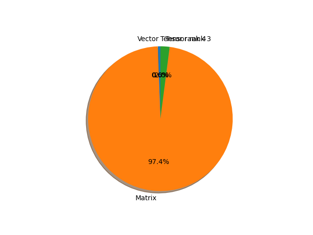

# efficientnet_b7 parameter information

**Number of layers: [ 711 ]**

**Number of parameters: [ 66.35M ]**

**Proportional of each form** (%)

| Vector | Matrix | Tensor rank 3 | Tensor rank 4 | 
|  --- | --- | --- | --- |
| 61.46 | 30.66 | 7.74 | 0.14 | 

**Proportional of parameters by form** (%)

| Vector | Matrix | Tensor rank 3 | Tensor rank 4 | 
|  --- | --- | --- | --- |
| 0.58 | 97.37 | 2.04 | 0.00 | 

**Layer information**

| Name | Shape | Squeezed shape | Number of parameters | Form |
| --- | --- | --- | --- | --- |
| features.0.0.weight | (64, 3, 3, 3) | (64, 3, 3, 3) | 1728 | Tensor rank 4 |
| features.0.1.weight | (64,) | (64,) | 64 | Vector |
| features.0.1.bias | (64,) | (64,) | 64 | Vector |
| features.1.0.block.0.0.weight | (64, 1, 3, 3) | (64, 3, 3) | 576 | Tensor rank 3 |
| features.1.0.block.0.1.weight | (64,) | (64,) | 64 | Vector |
| features.1.0.block.0.1.bias | (64,) | (64,) | 64 | Vector |
| features.1.0.block.1.fc1.weight | (16, 64, 1, 1) | (16, 64) | 1024 | Matrix |
| features.1.0.block.1.fc1.bias | (16,) | (16,) | 16 | Vector |
| features.1.0.block.1.fc2.weight | (64, 16, 1, 1) | (64, 16) | 1024 | Matrix |
| features.1.0.block.1.fc2.bias | (64,) | (64,) | 64 | Vector |
| features.1.0.block.2.0.weight | (32, 64, 1, 1) | (32, 64) | 2048 | Matrix |
| features.1.0.block.2.1.weight | (32,) | (32,) | 32 | Vector |
| features.1.0.block.2.1.bias | (32,) | (32,) | 32 | Vector |
| features.1.1.block.0.0.weight | (32, 1, 3, 3) | (32, 3, 3) | 288 | Tensor rank 3 |
| features.1.1.block.0.1.weight | (32,) | (32,) | 32 | Vector |
| features.1.1.block.0.1.bias | (32,) | (32,) | 32 | Vector |
| features.1.1.block.1.fc1.weight | (8, 32, 1, 1) | (8, 32) | 256 | Matrix |
| features.1.1.block.1.fc1.bias | (8,) | (8,) | 8 | Vector |
| features.1.1.block.1.fc2.weight | (32, 8, 1, 1) | (32, 8) | 256 | Matrix |
| features.1.1.block.1.fc2.bias | (32,) | (32,) | 32 | Vector |
| features.1.1.block.2.0.weight | (32, 32, 1, 1) | (32, 32) | 1024 | Matrix |
| features.1.1.block.2.1.weight | (32,) | (32,) | 32 | Vector |
| features.1.1.block.2.1.bias | (32,) | (32,) | 32 | Vector |
| features.1.2.block.0.0.weight | (32, 1, 3, 3) | (32, 3, 3) | 288 | Tensor rank 3 |
| features.1.2.block.0.1.weight | (32,) | (32,) | 32 | Vector |
| features.1.2.block.0.1.bias | (32,) | (32,) | 32 | Vector |
| features.1.2.block.1.fc1.weight | (8, 32, 1, 1) | (8, 32) | 256 | Matrix |
| features.1.2.block.1.fc1.bias | (8,) | (8,) | 8 | Vector |
| features.1.2.block.1.fc2.weight | (32, 8, 1, 1) | (32, 8) | 256 | Matrix |
| features.1.2.block.1.fc2.bias | (32,) | (32,) | 32 | Vector |
| features.1.2.block.2.0.weight | (32, 32, 1, 1) | (32, 32) | 1024 | Matrix |
| features.1.2.block.2.1.weight | (32,) | (32,) | 32 | Vector |
| features.1.2.block.2.1.bias | (32,) | (32,) | 32 | Vector |
| features.1.3.block.0.0.weight | (32, 1, 3, 3) | (32, 3, 3) | 288 | Tensor rank 3 |
| features.1.3.block.0.1.weight | (32,) | (32,) | 32 | Vector |
| features.1.3.block.0.1.bias | (32,) | (32,) | 32 | Vector |
| features.1.3.block.1.fc1.weight | (8, 32, 1, 1) | (8, 32) | 256 | Matrix |
| features.1.3.block.1.fc1.bias | (8,) | (8,) | 8 | Vector |
| features.1.3.block.1.fc2.weight | (32, 8, 1, 1) | (32, 8) | 256 | Matrix |
| features.1.3.block.1.fc2.bias | (32,) | (32,) | 32 | Vector |
| features.1.3.block.2.0.weight | (32, 32, 1, 1) | (32, 32) | 1024 | Matrix |
| features.1.3.block.2.1.weight | (32,) | (32,) | 32 | Vector |
| features.1.3.block.2.1.bias | (32,) | (32,) | 32 | Vector |
| features.2.0.block.0.0.weight | (192, 32, 1, 1) | (192, 32) | 6144 | Matrix |
| features.2.0.block.0.1.weight | (192,) | (192,) | 192 | Vector |
| features.2.0.block.0.1.bias | (192,) | (192,) | 192 | Vector |
| features.2.0.block.1.0.weight | (192, 1, 3, 3) | (192, 3, 3) | 1728 | Tensor rank 3 |
| features.2.0.block.1.1.weight | (192,) | (192,) | 192 | Vector |
| features.2.0.block.1.1.bias | (192,) | (192,) | 192 | Vector |
| features.2.0.block.2.fc1.weight | (8, 192, 1, 1) | (8, 192) | 1536 | Matrix |
| features.2.0.block.2.fc1.bias | (8,) | (8,) | 8 | Vector |
| features.2.0.block.2.fc2.weight | (192, 8, 1, 1) | (192, 8) | 1536 | Matrix |
| features.2.0.block.2.fc2.bias | (192,) | (192,) | 192 | Vector |
| features.2.0.block.3.0.weight | (48, 192, 1, 1) | (48, 192) | 9216 | Matrix |
| features.2.0.block.3.1.weight | (48,) | (48,) | 48 | Vector |
| features.2.0.block.3.1.bias | (48,) | (48,) | 48 | Vector |
| features.2.1.block.0.0.weight | (288, 48, 1, 1) | (288, 48) | 13824 | Matrix |
| features.2.1.block.0.1.weight | (288,) | (288,) | 288 | Vector |
| features.2.1.block.0.1.bias | (288,) | (288,) | 288 | Vector |
| features.2.1.block.1.0.weight | (288, 1, 3, 3) | (288, 3, 3) | 2592 | Tensor rank 3 |
| features.2.1.block.1.1.weight | (288,) | (288,) | 288 | Vector |
| features.2.1.block.1.1.bias | (288,) | (288,) | 288 | Vector |
| features.2.1.block.2.fc1.weight | (12, 288, 1, 1) | (12, 288) | 3456 | Matrix |
| features.2.1.block.2.fc1.bias | (12,) | (12,) | 12 | Vector |
| features.2.1.block.2.fc2.weight | (288, 12, 1, 1) | (288, 12) | 3456 | Matrix |
| features.2.1.block.2.fc2.bias | (288,) | (288,) | 288 | Vector |
| features.2.1.block.3.0.weight | (48, 288, 1, 1) | (48, 288) | 13824 | Matrix |
| features.2.1.block.3.1.weight | (48,) | (48,) | 48 | Vector |
| features.2.1.block.3.1.bias | (48,) | (48,) | 48 | Vector |
| features.2.2.block.0.0.weight | (288, 48, 1, 1) | (288, 48) | 13824 | Matrix |
| features.2.2.block.0.1.weight | (288,) | (288,) | 288 | Vector |
| features.2.2.block.0.1.bias | (288,) | (288,) | 288 | Vector |
| features.2.2.block.1.0.weight | (288, 1, 3, 3) | (288, 3, 3) | 2592 | Tensor rank 3 |
| features.2.2.block.1.1.weight | (288,) | (288,) | 288 | Vector |
| features.2.2.block.1.1.bias | (288,) | (288,) | 288 | Vector |
| features.2.2.block.2.fc1.weight | (12, 288, 1, 1) | (12, 288) | 3456 | Matrix |
| features.2.2.block.2.fc1.bias | (12,) | (12,) | 12 | Vector |
| features.2.2.block.2.fc2.weight | (288, 12, 1, 1) | (288, 12) | 3456 | Matrix |
| features.2.2.block.2.fc2.bias | (288,) | (288,) | 288 | Vector |
| features.2.2.block.3.0.weight | (48, 288, 1, 1) | (48, 288) | 13824 | Matrix |
| features.2.2.block.3.1.weight | (48,) | (48,) | 48 | Vector |
| features.2.2.block.3.1.bias | (48,) | (48,) | 48 | Vector |
| features.2.3.block.0.0.weight | (288, 48, 1, 1) | (288, 48) | 13824 | Matrix |
| features.2.3.block.0.1.weight | (288,) | (288,) | 288 | Vector |
| features.2.3.block.0.1.bias | (288,) | (288,) | 288 | Vector |
| features.2.3.block.1.0.weight | (288, 1, 3, 3) | (288, 3, 3) | 2592 | Tensor rank 3 |
| features.2.3.block.1.1.weight | (288,) | (288,) | 288 | Vector |
| features.2.3.block.1.1.bias | (288,) | (288,) | 288 | Vector |
| features.2.3.block.2.fc1.weight | (12, 288, 1, 1) | (12, 288) | 3456 | Matrix |
| features.2.3.block.2.fc1.bias | (12,) | (12,) | 12 | Vector |
| features.2.3.block.2.fc2.weight | (288, 12, 1, 1) | (288, 12) | 3456 | Matrix |
| features.2.3.block.2.fc2.bias | (288,) | (288,) | 288 | Vector |
| features.2.3.block.3.0.weight | (48, 288, 1, 1) | (48, 288) | 13824 | Matrix |
| features.2.3.block.3.1.weight | (48,) | (48,) | 48 | Vector |
| features.2.3.block.3.1.bias | (48,) | (48,) | 48 | Vector |
| features.2.4.block.0.0.weight | (288, 48, 1, 1) | (288, 48) | 13824 | Matrix |
| features.2.4.block.0.1.weight | (288,) | (288,) | 288 | Vector |
| features.2.4.block.0.1.bias | (288,) | (288,) | 288 | Vector |
| features.2.4.block.1.0.weight | (288, 1, 3, 3) | (288, 3, 3) | 2592 | Tensor rank 3 |
| features.2.4.block.1.1.weight | (288,) | (288,) | 288 | Vector |
| features.2.4.block.1.1.bias | (288,) | (288,) | 288 | Vector |
| features.2.4.block.2.fc1.weight | (12, 288, 1, 1) | (12, 288) | 3456 | Matrix |
| features.2.4.block.2.fc1.bias | (12,) | (12,) | 12 | Vector |
| features.2.4.block.2.fc2.weight | (288, 12, 1, 1) | (288, 12) | 3456 | Matrix |
| features.2.4.block.2.fc2.bias | (288,) | (288,) | 288 | Vector |
| features.2.4.block.3.0.weight | (48, 288, 1, 1) | (48, 288) | 13824 | Matrix |
| features.2.4.block.3.1.weight | (48,) | (48,) | 48 | Vector |
| features.2.4.block.3.1.bias | (48,) | (48,) | 48 | Vector |
| features.2.5.block.0.0.weight | (288, 48, 1, 1) | (288, 48) | 13824 | Matrix |
| features.2.5.block.0.1.weight | (288,) | (288,) | 288 | Vector |
| features.2.5.block.0.1.bias | (288,) | (288,) | 288 | Vector |
| features.2.5.block.1.0.weight | (288, 1, 3, 3) | (288, 3, 3) | 2592 | Tensor rank 3 |
| features.2.5.block.1.1.weight | (288,) | (288,) | 288 | Vector |
| features.2.5.block.1.1.bias | (288,) | (288,) | 288 | Vector |
| features.2.5.block.2.fc1.weight | (12, 288, 1, 1) | (12, 288) | 3456 | Matrix |
| features.2.5.block.2.fc1.bias | (12,) | (12,) | 12 | Vector |
| features.2.5.block.2.fc2.weight | (288, 12, 1, 1) | (288, 12) | 3456 | Matrix |
| features.2.5.block.2.fc2.bias | (288,) | (288,) | 288 | Vector |
| features.2.5.block.3.0.weight | (48, 288, 1, 1) | (48, 288) | 13824 | Matrix |
| features.2.5.block.3.1.weight | (48,) | (48,) | 48 | Vector |
| features.2.5.block.3.1.bias | (48,) | (48,) | 48 | Vector |
| features.2.6.block.0.0.weight | (288, 48, 1, 1) | (288, 48) | 13824 | Matrix |
| features.2.6.block.0.1.weight | (288,) | (288,) | 288 | Vector |
| features.2.6.block.0.1.bias | (288,) | (288,) | 288 | Vector |
| features.2.6.block.1.0.weight | (288, 1, 3, 3) | (288, 3, 3) | 2592 | Tensor rank 3 |
| features.2.6.block.1.1.weight | (288,) | (288,) | 288 | Vector |
| features.2.6.block.1.1.bias | (288,) | (288,) | 288 | Vector |
| features.2.6.block.2.fc1.weight | (12, 288, 1, 1) | (12, 288) | 3456 | Matrix |
| features.2.6.block.2.fc1.bias | (12,) | (12,) | 12 | Vector |
| features.2.6.block.2.fc2.weight | (288, 12, 1, 1) | (288, 12) | 3456 | Matrix |
| features.2.6.block.2.fc2.bias | (288,) | (288,) | 288 | Vector |
| features.2.6.block.3.0.weight | (48, 288, 1, 1) | (48, 288) | 13824 | Matrix |
| features.2.6.block.3.1.weight | (48,) | (48,) | 48 | Vector |
| features.2.6.block.3.1.bias | (48,) | (48,) | 48 | Vector |
| features.3.0.block.0.0.weight | (288, 48, 1, 1) | (288, 48) | 13824 | Matrix |
| features.3.0.block.0.1.weight | (288,) | (288,) | 288 | Vector |
| features.3.0.block.0.1.bias | (288,) | (288,) | 288 | Vector |
| features.3.0.block.1.0.weight | (288, 1, 5, 5) | (288, 5, 5) | 7200 | Tensor rank 3 |
| features.3.0.block.1.1.weight | (288,) | (288,) | 288 | Vector |
| features.3.0.block.1.1.bias | (288,) | (288,) | 288 | Vector |
| features.3.0.block.2.fc1.weight | (12, 288, 1, 1) | (12, 288) | 3456 | Matrix |
| features.3.0.block.2.fc1.bias | (12,) | (12,) | 12 | Vector |
| features.3.0.block.2.fc2.weight | (288, 12, 1, 1) | (288, 12) | 3456 | Matrix |
| features.3.0.block.2.fc2.bias | (288,) | (288,) | 288 | Vector |
| features.3.0.block.3.0.weight | (80, 288, 1, 1) | (80, 288) | 23040 | Matrix |
| features.3.0.block.3.1.weight | (80,) | (80,) | 80 | Vector |
| features.3.0.block.3.1.bias | (80,) | (80,) | 80 | Vector |
| features.3.1.block.0.0.weight | (480, 80, 1, 1) | (480, 80) | 38400 | Matrix |
| features.3.1.block.0.1.weight | (480,) | (480,) | 480 | Vector |
| features.3.1.block.0.1.bias | (480,) | (480,) | 480 | Vector |
| features.3.1.block.1.0.weight | (480, 1, 5, 5) | (480, 5, 5) | 12000 | Tensor rank 3 |
| features.3.1.block.1.1.weight | (480,) | (480,) | 480 | Vector |
| features.3.1.block.1.1.bias | (480,) | (480,) | 480 | Vector |
| features.3.1.block.2.fc1.weight | (20, 480, 1, 1) | (20, 480) | 9600 | Matrix |
| features.3.1.block.2.fc1.bias | (20,) | (20,) | 20 | Vector |
| features.3.1.block.2.fc2.weight | (480, 20, 1, 1) | (480, 20) | 9600 | Matrix |
| features.3.1.block.2.fc2.bias | (480,) | (480,) | 480 | Vector |
| features.3.1.block.3.0.weight | (80, 480, 1, 1) | (80, 480) | 38400 | Matrix |
| features.3.1.block.3.1.weight | (80,) | (80,) | 80 | Vector |
| features.3.1.block.3.1.bias | (80,) | (80,) | 80 | Vector |
| features.3.2.block.0.0.weight | (480, 80, 1, 1) | (480, 80) | 38400 | Matrix |
| features.3.2.block.0.1.weight | (480,) | (480,) | 480 | Vector |
| features.3.2.block.0.1.bias | (480,) | (480,) | 480 | Vector |
| features.3.2.block.1.0.weight | (480, 1, 5, 5) | (480, 5, 5) | 12000 | Tensor rank 3 |
| features.3.2.block.1.1.weight | (480,) | (480,) | 480 | Vector |
| features.3.2.block.1.1.bias | (480,) | (480,) | 480 | Vector |
| features.3.2.block.2.fc1.weight | (20, 480, 1, 1) | (20, 480) | 9600 | Matrix |
| features.3.2.block.2.fc1.bias | (20,) | (20,) | 20 | Vector |
| features.3.2.block.2.fc2.weight | (480, 20, 1, 1) | (480, 20) | 9600 | Matrix |
| features.3.2.block.2.fc2.bias | (480,) | (480,) | 480 | Vector |
| features.3.2.block.3.0.weight | (80, 480, 1, 1) | (80, 480) | 38400 | Matrix |
| features.3.2.block.3.1.weight | (80,) | (80,) | 80 | Vector |
| features.3.2.block.3.1.bias | (80,) | (80,) | 80 | Vector |
| features.3.3.block.0.0.weight | (480, 80, 1, 1) | (480, 80) | 38400 | Matrix |
| features.3.3.block.0.1.weight | (480,) | (480,) | 480 | Vector |
| features.3.3.block.0.1.bias | (480,) | (480,) | 480 | Vector |
| features.3.3.block.1.0.weight | (480, 1, 5, 5) | (480, 5, 5) | 12000 | Tensor rank 3 |
| features.3.3.block.1.1.weight | (480,) | (480,) | 480 | Vector |
| features.3.3.block.1.1.bias | (480,) | (480,) | 480 | Vector |
| features.3.3.block.2.fc1.weight | (20, 480, 1, 1) | (20, 480) | 9600 | Matrix |
| features.3.3.block.2.fc1.bias | (20,) | (20,) | 20 | Vector |
| features.3.3.block.2.fc2.weight | (480, 20, 1, 1) | (480, 20) | 9600 | Matrix |
| features.3.3.block.2.fc2.bias | (480,) | (480,) | 480 | Vector |
| features.3.3.block.3.0.weight | (80, 480, 1, 1) | (80, 480) | 38400 | Matrix |
| features.3.3.block.3.1.weight | (80,) | (80,) | 80 | Vector |
| features.3.3.block.3.1.bias | (80,) | (80,) | 80 | Vector |
| features.3.4.block.0.0.weight | (480, 80, 1, 1) | (480, 80) | 38400 | Matrix |
| features.3.4.block.0.1.weight | (480,) | (480,) | 480 | Vector |
| features.3.4.block.0.1.bias | (480,) | (480,) | 480 | Vector |
| features.3.4.block.1.0.weight | (480, 1, 5, 5) | (480, 5, 5) | 12000 | Tensor rank 3 |
| features.3.4.block.1.1.weight | (480,) | (480,) | 480 | Vector |
| features.3.4.block.1.1.bias | (480,) | (480,) | 480 | Vector |
| features.3.4.block.2.fc1.weight | (20, 480, 1, 1) | (20, 480) | 9600 | Matrix |
| features.3.4.block.2.fc1.bias | (20,) | (20,) | 20 | Vector |
| features.3.4.block.2.fc2.weight | (480, 20, 1, 1) | (480, 20) | 9600 | Matrix |
| features.3.4.block.2.fc2.bias | (480,) | (480,) | 480 | Vector |
| features.3.4.block.3.0.weight | (80, 480, 1, 1) | (80, 480) | 38400 | Matrix |
| features.3.4.block.3.1.weight | (80,) | (80,) | 80 | Vector |
| features.3.4.block.3.1.bias | (80,) | (80,) | 80 | Vector |
| features.3.5.block.0.0.weight | (480, 80, 1, 1) | (480, 80) | 38400 | Matrix |
| features.3.5.block.0.1.weight | (480,) | (480,) | 480 | Vector |
| features.3.5.block.0.1.bias | (480,) | (480,) | 480 | Vector |
| features.3.5.block.1.0.weight | (480, 1, 5, 5) | (480, 5, 5) | 12000 | Tensor rank 3 |
| features.3.5.block.1.1.weight | (480,) | (480,) | 480 | Vector |
| features.3.5.block.1.1.bias | (480,) | (480,) | 480 | Vector |
| features.3.5.block.2.fc1.weight | (20, 480, 1, 1) | (20, 480) | 9600 | Matrix |
| features.3.5.block.2.fc1.bias | (20,) | (20,) | 20 | Vector |
| features.3.5.block.2.fc2.weight | (480, 20, 1, 1) | (480, 20) | 9600 | Matrix |
| features.3.5.block.2.fc2.bias | (480,) | (480,) | 480 | Vector |
| features.3.5.block.3.0.weight | (80, 480, 1, 1) | (80, 480) | 38400 | Matrix |
| features.3.5.block.3.1.weight | (80,) | (80,) | 80 | Vector |
| features.3.5.block.3.1.bias | (80,) | (80,) | 80 | Vector |
| features.3.6.block.0.0.weight | (480, 80, 1, 1) | (480, 80) | 38400 | Matrix |
| features.3.6.block.0.1.weight | (480,) | (480,) | 480 | Vector |
| features.3.6.block.0.1.bias | (480,) | (480,) | 480 | Vector |
| features.3.6.block.1.0.weight | (480, 1, 5, 5) | (480, 5, 5) | 12000 | Tensor rank 3 |
| features.3.6.block.1.1.weight | (480,) | (480,) | 480 | Vector |
| features.3.6.block.1.1.bias | (480,) | (480,) | 480 | Vector |
| features.3.6.block.2.fc1.weight | (20, 480, 1, 1) | (20, 480) | 9600 | Matrix |
| features.3.6.block.2.fc1.bias | (20,) | (20,) | 20 | Vector |
| features.3.6.block.2.fc2.weight | (480, 20, 1, 1) | (480, 20) | 9600 | Matrix |
| features.3.6.block.2.fc2.bias | (480,) | (480,) | 480 | Vector |
| features.3.6.block.3.0.weight | (80, 480, 1, 1) | (80, 480) | 38400 | Matrix |
| features.3.6.block.3.1.weight | (80,) | (80,) | 80 | Vector |
| features.3.6.block.3.1.bias | (80,) | (80,) | 80 | Vector |
| features.4.0.block.0.0.weight | (480, 80, 1, 1) | (480, 80) | 38400 | Matrix |
| features.4.0.block.0.1.weight | (480,) | (480,) | 480 | Vector |
| features.4.0.block.0.1.bias | (480,) | (480,) | 480 | Vector |
| features.4.0.block.1.0.weight | (480, 1, 3, 3) | (480, 3, 3) | 4320 | Tensor rank 3 |
| features.4.0.block.1.1.weight | (480,) | (480,) | 480 | Vector |
| features.4.0.block.1.1.bias | (480,) | (480,) | 480 | Vector |
| features.4.0.block.2.fc1.weight | (20, 480, 1, 1) | (20, 480) | 9600 | Matrix |
| features.4.0.block.2.fc1.bias | (20,) | (20,) | 20 | Vector |
| features.4.0.block.2.fc2.weight | (480, 20, 1, 1) | (480, 20) | 9600 | Matrix |
| features.4.0.block.2.fc2.bias | (480,) | (480,) | 480 | Vector |
| features.4.0.block.3.0.weight | (160, 480, 1, 1) | (160, 480) | 76800 | Matrix |
| features.4.0.block.3.1.weight | (160,) | (160,) | 160 | Vector |
| features.4.0.block.3.1.bias | (160,) | (160,) | 160 | Vector |
| features.4.1.block.0.0.weight | (960, 160, 1, 1) | (960, 160) | 153600 | Matrix |
| features.4.1.block.0.1.weight | (960,) | (960,) | 960 | Vector |
| features.4.1.block.0.1.bias | (960,) | (960,) | 960 | Vector |
| features.4.1.block.1.0.weight | (960, 1, 3, 3) | (960, 3, 3) | 8640 | Tensor rank 3 |
| features.4.1.block.1.1.weight | (960,) | (960,) | 960 | Vector |
| features.4.1.block.1.1.bias | (960,) | (960,) | 960 | Vector |
| features.4.1.block.2.fc1.weight | (40, 960, 1, 1) | (40, 960) | 38400 | Matrix |
| features.4.1.block.2.fc1.bias | (40,) | (40,) | 40 | Vector |
| features.4.1.block.2.fc2.weight | (960, 40, 1, 1) | (960, 40) | 38400 | Matrix |
| features.4.1.block.2.fc2.bias | (960,) | (960,) | 960 | Vector |
| features.4.1.block.3.0.weight | (160, 960, 1, 1) | (160, 960) | 153600 | Matrix |
| features.4.1.block.3.1.weight | (160,) | (160,) | 160 | Vector |
| features.4.1.block.3.1.bias | (160,) | (160,) | 160 | Vector |
| features.4.2.block.0.0.weight | (960, 160, 1, 1) | (960, 160) | 153600 | Matrix |
| features.4.2.block.0.1.weight | (960,) | (960,) | 960 | Vector |
| features.4.2.block.0.1.bias | (960,) | (960,) | 960 | Vector |
| features.4.2.block.1.0.weight | (960, 1, 3, 3) | (960, 3, 3) | 8640 | Tensor rank 3 |
| features.4.2.block.1.1.weight | (960,) | (960,) | 960 | Vector |
| features.4.2.block.1.1.bias | (960,) | (960,) | 960 | Vector |
| features.4.2.block.2.fc1.weight | (40, 960, 1, 1) | (40, 960) | 38400 | Matrix |
| features.4.2.block.2.fc1.bias | (40,) | (40,) | 40 | Vector |
| features.4.2.block.2.fc2.weight | (960, 40, 1, 1) | (960, 40) | 38400 | Matrix |
| features.4.2.block.2.fc2.bias | (960,) | (960,) | 960 | Vector |
| features.4.2.block.3.0.weight | (160, 960, 1, 1) | (160, 960) | 153600 | Matrix |
| features.4.2.block.3.1.weight | (160,) | (160,) | 160 | Vector |
| features.4.2.block.3.1.bias | (160,) | (160,) | 160 | Vector |
| features.4.3.block.0.0.weight | (960, 160, 1, 1) | (960, 160) | 153600 | Matrix |
| features.4.3.block.0.1.weight | (960,) | (960,) | 960 | Vector |
| features.4.3.block.0.1.bias | (960,) | (960,) | 960 | Vector |
| features.4.3.block.1.0.weight | (960, 1, 3, 3) | (960, 3, 3) | 8640 | Tensor rank 3 |
| features.4.3.block.1.1.weight | (960,) | (960,) | 960 | Vector |
| features.4.3.block.1.1.bias | (960,) | (960,) | 960 | Vector |
| features.4.3.block.2.fc1.weight | (40, 960, 1, 1) | (40, 960) | 38400 | Matrix |
| features.4.3.block.2.fc1.bias | (40,) | (40,) | 40 | Vector |
| features.4.3.block.2.fc2.weight | (960, 40, 1, 1) | (960, 40) | 38400 | Matrix |
| features.4.3.block.2.fc2.bias | (960,) | (960,) | 960 | Vector |
| features.4.3.block.3.0.weight | (160, 960, 1, 1) | (160, 960) | 153600 | Matrix |
| features.4.3.block.3.1.weight | (160,) | (160,) | 160 | Vector |
| features.4.3.block.3.1.bias | (160,) | (160,) | 160 | Vector |
| features.4.4.block.0.0.weight | (960, 160, 1, 1) | (960, 160) | 153600 | Matrix |
| features.4.4.block.0.1.weight | (960,) | (960,) | 960 | Vector |
| features.4.4.block.0.1.bias | (960,) | (960,) | 960 | Vector |
| features.4.4.block.1.0.weight | (960, 1, 3, 3) | (960, 3, 3) | 8640 | Tensor rank 3 |
| features.4.4.block.1.1.weight | (960,) | (960,) | 960 | Vector |
| features.4.4.block.1.1.bias | (960,) | (960,) | 960 | Vector |
| features.4.4.block.2.fc1.weight | (40, 960, 1, 1) | (40, 960) | 38400 | Matrix |
| features.4.4.block.2.fc1.bias | (40,) | (40,) | 40 | Vector |
| features.4.4.block.2.fc2.weight | (960, 40, 1, 1) | (960, 40) | 38400 | Matrix |
| features.4.4.block.2.fc2.bias | (960,) | (960,) | 960 | Vector |
| features.4.4.block.3.0.weight | (160, 960, 1, 1) | (160, 960) | 153600 | Matrix |
| features.4.4.block.3.1.weight | (160,) | (160,) | 160 | Vector |
| features.4.4.block.3.1.bias | (160,) | (160,) | 160 | Vector |
| features.4.5.block.0.0.weight | (960, 160, 1, 1) | (960, 160) | 153600 | Matrix |
| features.4.5.block.0.1.weight | (960,) | (960,) | 960 | Vector |
| features.4.5.block.0.1.bias | (960,) | (960,) | 960 | Vector |
| features.4.5.block.1.0.weight | (960, 1, 3, 3) | (960, 3, 3) | 8640 | Tensor rank 3 |
| features.4.5.block.1.1.weight | (960,) | (960,) | 960 | Vector |
| features.4.5.block.1.1.bias | (960,) | (960,) | 960 | Vector |
| features.4.5.block.2.fc1.weight | (40, 960, 1, 1) | (40, 960) | 38400 | Matrix |
| features.4.5.block.2.fc1.bias | (40,) | (40,) | 40 | Vector |
| features.4.5.block.2.fc2.weight | (960, 40, 1, 1) | (960, 40) | 38400 | Matrix |
| features.4.5.block.2.fc2.bias | (960,) | (960,) | 960 | Vector |
| features.4.5.block.3.0.weight | (160, 960, 1, 1) | (160, 960) | 153600 | Matrix |
| features.4.5.block.3.1.weight | (160,) | (160,) | 160 | Vector |
| features.4.5.block.3.1.bias | (160,) | (160,) | 160 | Vector |
| features.4.6.block.0.0.weight | (960, 160, 1, 1) | (960, 160) | 153600 | Matrix |
| features.4.6.block.0.1.weight | (960,) | (960,) | 960 | Vector |
| features.4.6.block.0.1.bias | (960,) | (960,) | 960 | Vector |
| features.4.6.block.1.0.weight | (960, 1, 3, 3) | (960, 3, 3) | 8640 | Tensor rank 3 |
| features.4.6.block.1.1.weight | (960,) | (960,) | 960 | Vector |
| features.4.6.block.1.1.bias | (960,) | (960,) | 960 | Vector |
| features.4.6.block.2.fc1.weight | (40, 960, 1, 1) | (40, 960) | 38400 | Matrix |
| features.4.6.block.2.fc1.bias | (40,) | (40,) | 40 | Vector |
| features.4.6.block.2.fc2.weight | (960, 40, 1, 1) | (960, 40) | 38400 | Matrix |
| features.4.6.block.2.fc2.bias | (960,) | (960,) | 960 | Vector |
| features.4.6.block.3.0.weight | (160, 960, 1, 1) | (160, 960) | 153600 | Matrix |
| features.4.6.block.3.1.weight | (160,) | (160,) | 160 | Vector |
| features.4.6.block.3.1.bias | (160,) | (160,) | 160 | Vector |
| features.4.7.block.0.0.weight | (960, 160, 1, 1) | (960, 160) | 153600 | Matrix |
| features.4.7.block.0.1.weight | (960,) | (960,) | 960 | Vector |
| features.4.7.block.0.1.bias | (960,) | (960,) | 960 | Vector |
| features.4.7.block.1.0.weight | (960, 1, 3, 3) | (960, 3, 3) | 8640 | Tensor rank 3 |
| features.4.7.block.1.1.weight | (960,) | (960,) | 960 | Vector |
| features.4.7.block.1.1.bias | (960,) | (960,) | 960 | Vector |
| features.4.7.block.2.fc1.weight | (40, 960, 1, 1) | (40, 960) | 38400 | Matrix |
| features.4.7.block.2.fc1.bias | (40,) | (40,) | 40 | Vector |
| features.4.7.block.2.fc2.weight | (960, 40, 1, 1) | (960, 40) | 38400 | Matrix |
| features.4.7.block.2.fc2.bias | (960,) | (960,) | 960 | Vector |
| features.4.7.block.3.0.weight | (160, 960, 1, 1) | (160, 960) | 153600 | Matrix |
| features.4.7.block.3.1.weight | (160,) | (160,) | 160 | Vector |
| features.4.7.block.3.1.bias | (160,) | (160,) | 160 | Vector |
| features.4.8.block.0.0.weight | (960, 160, 1, 1) | (960, 160) | 153600 | Matrix |
| features.4.8.block.0.1.weight | (960,) | (960,) | 960 | Vector |
| features.4.8.block.0.1.bias | (960,) | (960,) | 960 | Vector |
| features.4.8.block.1.0.weight | (960, 1, 3, 3) | (960, 3, 3) | 8640 | Tensor rank 3 |
| features.4.8.block.1.1.weight | (960,) | (960,) | 960 | Vector |
| features.4.8.block.1.1.bias | (960,) | (960,) | 960 | Vector |
| features.4.8.block.2.fc1.weight | (40, 960, 1, 1) | (40, 960) | 38400 | Matrix |
| features.4.8.block.2.fc1.bias | (40,) | (40,) | 40 | Vector |
| features.4.8.block.2.fc2.weight | (960, 40, 1, 1) | (960, 40) | 38400 | Matrix |
| features.4.8.block.2.fc2.bias | (960,) | (960,) | 960 | Vector |
| features.4.8.block.3.0.weight | (160, 960, 1, 1) | (160, 960) | 153600 | Matrix |
| features.4.8.block.3.1.weight | (160,) | (160,) | 160 | Vector |
| features.4.8.block.3.1.bias | (160,) | (160,) | 160 | Vector |
| features.4.9.block.0.0.weight | (960, 160, 1, 1) | (960, 160) | 153600 | Matrix |
| features.4.9.block.0.1.weight | (960,) | (960,) | 960 | Vector |
| features.4.9.block.0.1.bias | (960,) | (960,) | 960 | Vector |
| features.4.9.block.1.0.weight | (960, 1, 3, 3) | (960, 3, 3) | 8640 | Tensor rank 3 |
| features.4.9.block.1.1.weight | (960,) | (960,) | 960 | Vector |
| features.4.9.block.1.1.bias | (960,) | (960,) | 960 | Vector |
| features.4.9.block.2.fc1.weight | (40, 960, 1, 1) | (40, 960) | 38400 | Matrix |
| features.4.9.block.2.fc1.bias | (40,) | (40,) | 40 | Vector |
| features.4.9.block.2.fc2.weight | (960, 40, 1, 1) | (960, 40) | 38400 | Matrix |
| features.4.9.block.2.fc2.bias | (960,) | (960,) | 960 | Vector |
| features.4.9.block.3.0.weight | (160, 960, 1, 1) | (160, 960) | 153600 | Matrix |
| features.4.9.block.3.1.weight | (160,) | (160,) | 160 | Vector |
| features.4.9.block.3.1.bias | (160,) | (160,) | 160 | Vector |
| features.5.0.block.0.0.weight | (960, 160, 1, 1) | (960, 160) | 153600 | Matrix |
| features.5.0.block.0.1.weight | (960,) | (960,) | 960 | Vector |
| features.5.0.block.0.1.bias | (960,) | (960,) | 960 | Vector |
| features.5.0.block.1.0.weight | (960, 1, 5, 5) | (960, 5, 5) | 24000 | Tensor rank 3 |
| features.5.0.block.1.1.weight | (960,) | (960,) | 960 | Vector |
| features.5.0.block.1.1.bias | (960,) | (960,) | 960 | Vector |
| features.5.0.block.2.fc1.weight | (40, 960, 1, 1) | (40, 960) | 38400 | Matrix |
| features.5.0.block.2.fc1.bias | (40,) | (40,) | 40 | Vector |
| features.5.0.block.2.fc2.weight | (960, 40, 1, 1) | (960, 40) | 38400 | Matrix |
| features.5.0.block.2.fc2.bias | (960,) | (960,) | 960 | Vector |
| features.5.0.block.3.0.weight | (224, 960, 1, 1) | (224, 960) | 215040 | Matrix |
| features.5.0.block.3.1.weight | (224,) | (224,) | 224 | Vector |
| features.5.0.block.3.1.bias | (224,) | (224,) | 224 | Vector |
| features.5.1.block.0.0.weight | (1344, 224, 1, 1) | (1344, 224) | 301056 | Matrix |
| features.5.1.block.0.1.weight | (1344,) | (1344,) | 1344 | Vector |
| features.5.1.block.0.1.bias | (1344,) | (1344,) | 1344 | Vector |
| features.5.1.block.1.0.weight | (1344, 1, 5, 5) | (1344, 5, 5) | 33600 | Tensor rank 3 |
| features.5.1.block.1.1.weight | (1344,) | (1344,) | 1344 | Vector |
| features.5.1.block.1.1.bias | (1344,) | (1344,) | 1344 | Vector |
| features.5.1.block.2.fc1.weight | (56, 1344, 1, 1) | (56, 1344) | 75264 | Matrix |
| features.5.1.block.2.fc1.bias | (56,) | (56,) | 56 | Vector |
| features.5.1.block.2.fc2.weight | (1344, 56, 1, 1) | (1344, 56) | 75264 | Matrix |
| features.5.1.block.2.fc2.bias | (1344,) | (1344,) | 1344 | Vector |
| features.5.1.block.3.0.weight | (224, 1344, 1, 1) | (224, 1344) | 301056 | Matrix |
| features.5.1.block.3.1.weight | (224,) | (224,) | 224 | Vector |
| features.5.1.block.3.1.bias | (224,) | (224,) | 224 | Vector |
| features.5.2.block.0.0.weight | (1344, 224, 1, 1) | (1344, 224) | 301056 | Matrix |
| features.5.2.block.0.1.weight | (1344,) | (1344,) | 1344 | Vector |
| features.5.2.block.0.1.bias | (1344,) | (1344,) | 1344 | Vector |
| features.5.2.block.1.0.weight | (1344, 1, 5, 5) | (1344, 5, 5) | 33600 | Tensor rank 3 |
| features.5.2.block.1.1.weight | (1344,) | (1344,) | 1344 | Vector |
| features.5.2.block.1.1.bias | (1344,) | (1344,) | 1344 | Vector |
| features.5.2.block.2.fc1.weight | (56, 1344, 1, 1) | (56, 1344) | 75264 | Matrix |
| features.5.2.block.2.fc1.bias | (56,) | (56,) | 56 | Vector |
| features.5.2.block.2.fc2.weight | (1344, 56, 1, 1) | (1344, 56) | 75264 | Matrix |
| features.5.2.block.2.fc2.bias | (1344,) | (1344,) | 1344 | Vector |
| features.5.2.block.3.0.weight | (224, 1344, 1, 1) | (224, 1344) | 301056 | Matrix |
| features.5.2.block.3.1.weight | (224,) | (224,) | 224 | Vector |
| features.5.2.block.3.1.bias | (224,) | (224,) | 224 | Vector |
| features.5.3.block.0.0.weight | (1344, 224, 1, 1) | (1344, 224) | 301056 | Matrix |
| features.5.3.block.0.1.weight | (1344,) | (1344,) | 1344 | Vector |
| features.5.3.block.0.1.bias | (1344,) | (1344,) | 1344 | Vector |
| features.5.3.block.1.0.weight | (1344, 1, 5, 5) | (1344, 5, 5) | 33600 | Tensor rank 3 |
| features.5.3.block.1.1.weight | (1344,) | (1344,) | 1344 | Vector |
| features.5.3.block.1.1.bias | (1344,) | (1344,) | 1344 | Vector |
| features.5.3.block.2.fc1.weight | (56, 1344, 1, 1) | (56, 1344) | 75264 | Matrix |
| features.5.3.block.2.fc1.bias | (56,) | (56,) | 56 | Vector |
| features.5.3.block.2.fc2.weight | (1344, 56, 1, 1) | (1344, 56) | 75264 | Matrix |
| features.5.3.block.2.fc2.bias | (1344,) | (1344,) | 1344 | Vector |
| features.5.3.block.3.0.weight | (224, 1344, 1, 1) | (224, 1344) | 301056 | Matrix |
| features.5.3.block.3.1.weight | (224,) | (224,) | 224 | Vector |
| features.5.3.block.3.1.bias | (224,) | (224,) | 224 | Vector |
| features.5.4.block.0.0.weight | (1344, 224, 1, 1) | (1344, 224) | 301056 | Matrix |
| features.5.4.block.0.1.weight | (1344,) | (1344,) | 1344 | Vector |
| features.5.4.block.0.1.bias | (1344,) | (1344,) | 1344 | Vector |
| features.5.4.block.1.0.weight | (1344, 1, 5, 5) | (1344, 5, 5) | 33600 | Tensor rank 3 |
| features.5.4.block.1.1.weight | (1344,) | (1344,) | 1344 | Vector |
| features.5.4.block.1.1.bias | (1344,) | (1344,) | 1344 | Vector |
| features.5.4.block.2.fc1.weight | (56, 1344, 1, 1) | (56, 1344) | 75264 | Matrix |
| features.5.4.block.2.fc1.bias | (56,) | (56,) | 56 | Vector |
| features.5.4.block.2.fc2.weight | (1344, 56, 1, 1) | (1344, 56) | 75264 | Matrix |
| features.5.4.block.2.fc2.bias | (1344,) | (1344,) | 1344 | Vector |
| features.5.4.block.3.0.weight | (224, 1344, 1, 1) | (224, 1344) | 301056 | Matrix |
| features.5.4.block.3.1.weight | (224,) | (224,) | 224 | Vector |
| features.5.4.block.3.1.bias | (224,) | (224,) | 224 | Vector |
| features.5.5.block.0.0.weight | (1344, 224, 1, 1) | (1344, 224) | 301056 | Matrix |
| features.5.5.block.0.1.weight | (1344,) | (1344,) | 1344 | Vector |
| features.5.5.block.0.1.bias | (1344,) | (1344,) | 1344 | Vector |
| features.5.5.block.1.0.weight | (1344, 1, 5, 5) | (1344, 5, 5) | 33600 | Tensor rank 3 |
| features.5.5.block.1.1.weight | (1344,) | (1344,) | 1344 | Vector |
| features.5.5.block.1.1.bias | (1344,) | (1344,) | 1344 | Vector |
| features.5.5.block.2.fc1.weight | (56, 1344, 1, 1) | (56, 1344) | 75264 | Matrix |
| features.5.5.block.2.fc1.bias | (56,) | (56,) | 56 | Vector |
| features.5.5.block.2.fc2.weight | (1344, 56, 1, 1) | (1344, 56) | 75264 | Matrix |
| features.5.5.block.2.fc2.bias | (1344,) | (1344,) | 1344 | Vector |
| features.5.5.block.3.0.weight | (224, 1344, 1, 1) | (224, 1344) | 301056 | Matrix |
| features.5.5.block.3.1.weight | (224,) | (224,) | 224 | Vector |
| features.5.5.block.3.1.bias | (224,) | (224,) | 224 | Vector |
| features.5.6.block.0.0.weight | (1344, 224, 1, 1) | (1344, 224) | 301056 | Matrix |
| features.5.6.block.0.1.weight | (1344,) | (1344,) | 1344 | Vector |
| features.5.6.block.0.1.bias | (1344,) | (1344,) | 1344 | Vector |
| features.5.6.block.1.0.weight | (1344, 1, 5, 5) | (1344, 5, 5) | 33600 | Tensor rank 3 |
| features.5.6.block.1.1.weight | (1344,) | (1344,) | 1344 | Vector |
| features.5.6.block.1.1.bias | (1344,) | (1344,) | 1344 | Vector |
| features.5.6.block.2.fc1.weight | (56, 1344, 1, 1) | (56, 1344) | 75264 | Matrix |
| features.5.6.block.2.fc1.bias | (56,) | (56,) | 56 | Vector |
| features.5.6.block.2.fc2.weight | (1344, 56, 1, 1) | (1344, 56) | 75264 | Matrix |
| features.5.6.block.2.fc2.bias | (1344,) | (1344,) | 1344 | Vector |
| features.5.6.block.3.0.weight | (224, 1344, 1, 1) | (224, 1344) | 301056 | Matrix |
| features.5.6.block.3.1.weight | (224,) | (224,) | 224 | Vector |
| features.5.6.block.3.1.bias | (224,) | (224,) | 224 | Vector |
| features.5.7.block.0.0.weight | (1344, 224, 1, 1) | (1344, 224) | 301056 | Matrix |
| features.5.7.block.0.1.weight | (1344,) | (1344,) | 1344 | Vector |
| features.5.7.block.0.1.bias | (1344,) | (1344,) | 1344 | Vector |
| features.5.7.block.1.0.weight | (1344, 1, 5, 5) | (1344, 5, 5) | 33600 | Tensor rank 3 |
| features.5.7.block.1.1.weight | (1344,) | (1344,) | 1344 | Vector |
| features.5.7.block.1.1.bias | (1344,) | (1344,) | 1344 | Vector |
| features.5.7.block.2.fc1.weight | (56, 1344, 1, 1) | (56, 1344) | 75264 | Matrix |
| features.5.7.block.2.fc1.bias | (56,) | (56,) | 56 | Vector |
| features.5.7.block.2.fc2.weight | (1344, 56, 1, 1) | (1344, 56) | 75264 | Matrix |
| features.5.7.block.2.fc2.bias | (1344,) | (1344,) | 1344 | Vector |
| features.5.7.block.3.0.weight | (224, 1344, 1, 1) | (224, 1344) | 301056 | Matrix |
| features.5.7.block.3.1.weight | (224,) | (224,) | 224 | Vector |
| features.5.7.block.3.1.bias | (224,) | (224,) | 224 | Vector |
| features.5.8.block.0.0.weight | (1344, 224, 1, 1) | (1344, 224) | 301056 | Matrix |
| features.5.8.block.0.1.weight | (1344,) | (1344,) | 1344 | Vector |
| features.5.8.block.0.1.bias | (1344,) | (1344,) | 1344 | Vector |
| features.5.8.block.1.0.weight | (1344, 1, 5, 5) | (1344, 5, 5) | 33600 | Tensor rank 3 |
| features.5.8.block.1.1.weight | (1344,) | (1344,) | 1344 | Vector |
| features.5.8.block.1.1.bias | (1344,) | (1344,) | 1344 | Vector |
| features.5.8.block.2.fc1.weight | (56, 1344, 1, 1) | (56, 1344) | 75264 | Matrix |
| features.5.8.block.2.fc1.bias | (56,) | (56,) | 56 | Vector |
| features.5.8.block.2.fc2.weight | (1344, 56, 1, 1) | (1344, 56) | 75264 | Matrix |
| features.5.8.block.2.fc2.bias | (1344,) | (1344,) | 1344 | Vector |
| features.5.8.block.3.0.weight | (224, 1344, 1, 1) | (224, 1344) | 301056 | Matrix |
| features.5.8.block.3.1.weight | (224,) | (224,) | 224 | Vector |
| features.5.8.block.3.1.bias | (224,) | (224,) | 224 | Vector |
| features.5.9.block.0.0.weight | (1344, 224, 1, 1) | (1344, 224) | 301056 | Matrix |
| features.5.9.block.0.1.weight | (1344,) | (1344,) | 1344 | Vector |
| features.5.9.block.0.1.bias | (1344,) | (1344,) | 1344 | Vector |
| features.5.9.block.1.0.weight | (1344, 1, 5, 5) | (1344, 5, 5) | 33600 | Tensor rank 3 |
| features.5.9.block.1.1.weight | (1344,) | (1344,) | 1344 | Vector |
| features.5.9.block.1.1.bias | (1344,) | (1344,) | 1344 | Vector |
| features.5.9.block.2.fc1.weight | (56, 1344, 1, 1) | (56, 1344) | 75264 | Matrix |
| features.5.9.block.2.fc1.bias | (56,) | (56,) | 56 | Vector |
| features.5.9.block.2.fc2.weight | (1344, 56, 1, 1) | (1344, 56) | 75264 | Matrix |
| features.5.9.block.2.fc2.bias | (1344,) | (1344,) | 1344 | Vector |
| features.5.9.block.3.0.weight | (224, 1344, 1, 1) | (224, 1344) | 301056 | Matrix |
| features.5.9.block.3.1.weight | (224,) | (224,) | 224 | Vector |
| features.5.9.block.3.1.bias | (224,) | (224,) | 224 | Vector |
| features.6.0.block.0.0.weight | (1344, 224, 1, 1) | (1344, 224) | 301056 | Matrix |
| features.6.0.block.0.1.weight | (1344,) | (1344,) | 1344 | Vector |
| features.6.0.block.0.1.bias | (1344,) | (1344,) | 1344 | Vector |
| features.6.0.block.1.0.weight | (1344, 1, 5, 5) | (1344, 5, 5) | 33600 | Tensor rank 3 |
| features.6.0.block.1.1.weight | (1344,) | (1344,) | 1344 | Vector |
| features.6.0.block.1.1.bias | (1344,) | (1344,) | 1344 | Vector |
| features.6.0.block.2.fc1.weight | (56, 1344, 1, 1) | (56, 1344) | 75264 | Matrix |
| features.6.0.block.2.fc1.bias | (56,) | (56,) | 56 | Vector |
| features.6.0.block.2.fc2.weight | (1344, 56, 1, 1) | (1344, 56) | 75264 | Matrix |
| features.6.0.block.2.fc2.bias | (1344,) | (1344,) | 1344 | Vector |
| features.6.0.block.3.0.weight | (384, 1344, 1, 1) | (384, 1344) | 516096 | Matrix |
| features.6.0.block.3.1.weight | (384,) | (384,) | 384 | Vector |
| features.6.0.block.3.1.bias | (384,) | (384,) | 384 | Vector |
| features.6.1.block.0.0.weight | (2304, 384, 1, 1) | (2304, 384) | 884736 | Matrix |
| features.6.1.block.0.1.weight | (2304,) | (2304,) | 2304 | Vector |
| features.6.1.block.0.1.bias | (2304,) | (2304,) | 2304 | Vector |
| features.6.1.block.1.0.weight | (2304, 1, 5, 5) | (2304, 5, 5) | 57600 | Tensor rank 3 |
| features.6.1.block.1.1.weight | (2304,) | (2304,) | 2304 | Vector |
| features.6.1.block.1.1.bias | (2304,) | (2304,) | 2304 | Vector |
| features.6.1.block.2.fc1.weight | (96, 2304, 1, 1) | (96, 2304) | 221184 | Matrix |
| features.6.1.block.2.fc1.bias | (96,) | (96,) | 96 | Vector |
| features.6.1.block.2.fc2.weight | (2304, 96, 1, 1) | (2304, 96) | 221184 | Matrix |
| features.6.1.block.2.fc2.bias | (2304,) | (2304,) | 2304 | Vector |
| features.6.1.block.3.0.weight | (384, 2304, 1, 1) | (384, 2304) | 884736 | Matrix |
| features.6.1.block.3.1.weight | (384,) | (384,) | 384 | Vector |
| features.6.1.block.3.1.bias | (384,) | (384,) | 384 | Vector |
| features.6.2.block.0.0.weight | (2304, 384, 1, 1) | (2304, 384) | 884736 | Matrix |
| features.6.2.block.0.1.weight | (2304,) | (2304,) | 2304 | Vector |
| features.6.2.block.0.1.bias | (2304,) | (2304,) | 2304 | Vector |
| features.6.2.block.1.0.weight | (2304, 1, 5, 5) | (2304, 5, 5) | 57600 | Tensor rank 3 |
| features.6.2.block.1.1.weight | (2304,) | (2304,) | 2304 | Vector |
| features.6.2.block.1.1.bias | (2304,) | (2304,) | 2304 | Vector |
| features.6.2.block.2.fc1.weight | (96, 2304, 1, 1) | (96, 2304) | 221184 | Matrix |
| features.6.2.block.2.fc1.bias | (96,) | (96,) | 96 | Vector |
| features.6.2.block.2.fc2.weight | (2304, 96, 1, 1) | (2304, 96) | 221184 | Matrix |
| features.6.2.block.2.fc2.bias | (2304,) | (2304,) | 2304 | Vector |
| features.6.2.block.3.0.weight | (384, 2304, 1, 1) | (384, 2304) | 884736 | Matrix |
| features.6.2.block.3.1.weight | (384,) | (384,) | 384 | Vector |
| features.6.2.block.3.1.bias | (384,) | (384,) | 384 | Vector |
| features.6.3.block.0.0.weight | (2304, 384, 1, 1) | (2304, 384) | 884736 | Matrix |
| features.6.3.block.0.1.weight | (2304,) | (2304,) | 2304 | Vector |
| features.6.3.block.0.1.bias | (2304,) | (2304,) | 2304 | Vector |
| features.6.3.block.1.0.weight | (2304, 1, 5, 5) | (2304, 5, 5) | 57600 | Tensor rank 3 |
| features.6.3.block.1.1.weight | (2304,) | (2304,) | 2304 | Vector |
| features.6.3.block.1.1.bias | (2304,) | (2304,) | 2304 | Vector |
| features.6.3.block.2.fc1.weight | (96, 2304, 1, 1) | (96, 2304) | 221184 | Matrix |
| features.6.3.block.2.fc1.bias | (96,) | (96,) | 96 | Vector |
| features.6.3.block.2.fc2.weight | (2304, 96, 1, 1) | (2304, 96) | 221184 | Matrix |
| features.6.3.block.2.fc2.bias | (2304,) | (2304,) | 2304 | Vector |
| features.6.3.block.3.0.weight | (384, 2304, 1, 1) | (384, 2304) | 884736 | Matrix |
| features.6.3.block.3.1.weight | (384,) | (384,) | 384 | Vector |
| features.6.3.block.3.1.bias | (384,) | (384,) | 384 | Vector |
| features.6.4.block.0.0.weight | (2304, 384, 1, 1) | (2304, 384) | 884736 | Matrix |
| features.6.4.block.0.1.weight | (2304,) | (2304,) | 2304 | Vector |
| features.6.4.block.0.1.bias | (2304,) | (2304,) | 2304 | Vector |
| features.6.4.block.1.0.weight | (2304, 1, 5, 5) | (2304, 5, 5) | 57600 | Tensor rank 3 |
| features.6.4.block.1.1.weight | (2304,) | (2304,) | 2304 | Vector |
| features.6.4.block.1.1.bias | (2304,) | (2304,) | 2304 | Vector |
| features.6.4.block.2.fc1.weight | (96, 2304, 1, 1) | (96, 2304) | 221184 | Matrix |
| features.6.4.block.2.fc1.bias | (96,) | (96,) | 96 | Vector |
| features.6.4.block.2.fc2.weight | (2304, 96, 1, 1) | (2304, 96) | 221184 | Matrix |
| features.6.4.block.2.fc2.bias | (2304,) | (2304,) | 2304 | Vector |
| features.6.4.block.3.0.weight | (384, 2304, 1, 1) | (384, 2304) | 884736 | Matrix |
| features.6.4.block.3.1.weight | (384,) | (384,) | 384 | Vector |
| features.6.4.block.3.1.bias | (384,) | (384,) | 384 | Vector |
| features.6.5.block.0.0.weight | (2304, 384, 1, 1) | (2304, 384) | 884736 | Matrix |
| features.6.5.block.0.1.weight | (2304,) | (2304,) | 2304 | Vector |
| features.6.5.block.0.1.bias | (2304,) | (2304,) | 2304 | Vector |
| features.6.5.block.1.0.weight | (2304, 1, 5, 5) | (2304, 5, 5) | 57600 | Tensor rank 3 |
| features.6.5.block.1.1.weight | (2304,) | (2304,) | 2304 | Vector |
| features.6.5.block.1.1.bias | (2304,) | (2304,) | 2304 | Vector |
| features.6.5.block.2.fc1.weight | (96, 2304, 1, 1) | (96, 2304) | 221184 | Matrix |
| features.6.5.block.2.fc1.bias | (96,) | (96,) | 96 | Vector |
| features.6.5.block.2.fc2.weight | (2304, 96, 1, 1) | (2304, 96) | 221184 | Matrix |
| features.6.5.block.2.fc2.bias | (2304,) | (2304,) | 2304 | Vector |
| features.6.5.block.3.0.weight | (384, 2304, 1, 1) | (384, 2304) | 884736 | Matrix |
| features.6.5.block.3.1.weight | (384,) | (384,) | 384 | Vector |
| features.6.5.block.3.1.bias | (384,) | (384,) | 384 | Vector |
| features.6.6.block.0.0.weight | (2304, 384, 1, 1) | (2304, 384) | 884736 | Matrix |
| features.6.6.block.0.1.weight | (2304,) | (2304,) | 2304 | Vector |
| features.6.6.block.0.1.bias | (2304,) | (2304,) | 2304 | Vector |
| features.6.6.block.1.0.weight | (2304, 1, 5, 5) | (2304, 5, 5) | 57600 | Tensor rank 3 |
| features.6.6.block.1.1.weight | (2304,) | (2304,) | 2304 | Vector |
| features.6.6.block.1.1.bias | (2304,) | (2304,) | 2304 | Vector |
| features.6.6.block.2.fc1.weight | (96, 2304, 1, 1) | (96, 2304) | 221184 | Matrix |
| features.6.6.block.2.fc1.bias | (96,) | (96,) | 96 | Vector |
| features.6.6.block.2.fc2.weight | (2304, 96, 1, 1) | (2304, 96) | 221184 | Matrix |
| features.6.6.block.2.fc2.bias | (2304,) | (2304,) | 2304 | Vector |
| features.6.6.block.3.0.weight | (384, 2304, 1, 1) | (384, 2304) | 884736 | Matrix |
| features.6.6.block.3.1.weight | (384,) | (384,) | 384 | Vector |
| features.6.6.block.3.1.bias | (384,) | (384,) | 384 | Vector |
| features.6.7.block.0.0.weight | (2304, 384, 1, 1) | (2304, 384) | 884736 | Matrix |
| features.6.7.block.0.1.weight | (2304,) | (2304,) | 2304 | Vector |
| features.6.7.block.0.1.bias | (2304,) | (2304,) | 2304 | Vector |
| features.6.7.block.1.0.weight | (2304, 1, 5, 5) | (2304, 5, 5) | 57600 | Tensor rank 3 |
| features.6.7.block.1.1.weight | (2304,) | (2304,) | 2304 | Vector |
| features.6.7.block.1.1.bias | (2304,) | (2304,) | 2304 | Vector |
| features.6.7.block.2.fc1.weight | (96, 2304, 1, 1) | (96, 2304) | 221184 | Matrix |
| features.6.7.block.2.fc1.bias | (96,) | (96,) | 96 | Vector |
| features.6.7.block.2.fc2.weight | (2304, 96, 1, 1) | (2304, 96) | 221184 | Matrix |
| features.6.7.block.2.fc2.bias | (2304,) | (2304,) | 2304 | Vector |
| features.6.7.block.3.0.weight | (384, 2304, 1, 1) | (384, 2304) | 884736 | Matrix |
| features.6.7.block.3.1.weight | (384,) | (384,) | 384 | Vector |
| features.6.7.block.3.1.bias | (384,) | (384,) | 384 | Vector |
| features.6.8.block.0.0.weight | (2304, 384, 1, 1) | (2304, 384) | 884736 | Matrix |
| features.6.8.block.0.1.weight | (2304,) | (2304,) | 2304 | Vector |
| features.6.8.block.0.1.bias | (2304,) | (2304,) | 2304 | Vector |
| features.6.8.block.1.0.weight | (2304, 1, 5, 5) | (2304, 5, 5) | 57600 | Tensor rank 3 |
| features.6.8.block.1.1.weight | (2304,) | (2304,) | 2304 | Vector |
| features.6.8.block.1.1.bias | (2304,) | (2304,) | 2304 | Vector |
| features.6.8.block.2.fc1.weight | (96, 2304, 1, 1) | (96, 2304) | 221184 | Matrix |
| features.6.8.block.2.fc1.bias | (96,) | (96,) | 96 | Vector |
| features.6.8.block.2.fc2.weight | (2304, 96, 1, 1) | (2304, 96) | 221184 | Matrix |
| features.6.8.block.2.fc2.bias | (2304,) | (2304,) | 2304 | Vector |
| features.6.8.block.3.0.weight | (384, 2304, 1, 1) | (384, 2304) | 884736 | Matrix |
| features.6.8.block.3.1.weight | (384,) | (384,) | 384 | Vector |
| features.6.8.block.3.1.bias | (384,) | (384,) | 384 | Vector |
| features.6.9.block.0.0.weight | (2304, 384, 1, 1) | (2304, 384) | 884736 | Matrix |
| features.6.9.block.0.1.weight | (2304,) | (2304,) | 2304 | Vector |
| features.6.9.block.0.1.bias | (2304,) | (2304,) | 2304 | Vector |
| features.6.9.block.1.0.weight | (2304, 1, 5, 5) | (2304, 5, 5) | 57600 | Tensor rank 3 |
| features.6.9.block.1.1.weight | (2304,) | (2304,) | 2304 | Vector |
| features.6.9.block.1.1.bias | (2304,) | (2304,) | 2304 | Vector |
| features.6.9.block.2.fc1.weight | (96, 2304, 1, 1) | (96, 2304) | 221184 | Matrix |
| features.6.9.block.2.fc1.bias | (96,) | (96,) | 96 | Vector |
| features.6.9.block.2.fc2.weight | (2304, 96, 1, 1) | (2304, 96) | 221184 | Matrix |
| features.6.9.block.2.fc2.bias | (2304,) | (2304,) | 2304 | Vector |
| features.6.9.block.3.0.weight | (384, 2304, 1, 1) | (384, 2304) | 884736 | Matrix |
| features.6.9.block.3.1.weight | (384,) | (384,) | 384 | Vector |
| features.6.9.block.3.1.bias | (384,) | (384,) | 384 | Vector |
| features.6.10.block.0.0.weight | (2304, 384, 1, 1) | (2304, 384) | 884736 | Matrix |
| features.6.10.block.0.1.weight | (2304,) | (2304,) | 2304 | Vector |
| features.6.10.block.0.1.bias | (2304,) | (2304,) | 2304 | Vector |
| features.6.10.block.1.0.weight | (2304, 1, 5, 5) | (2304, 5, 5) | 57600 | Tensor rank 3 |
| features.6.10.block.1.1.weight | (2304,) | (2304,) | 2304 | Vector |
| features.6.10.block.1.1.bias | (2304,) | (2304,) | 2304 | Vector |
| features.6.10.block.2.fc1.weight | (96, 2304, 1, 1) | (96, 2304) | 221184 | Matrix |
| features.6.10.block.2.fc1.bias | (96,) | (96,) | 96 | Vector |
| features.6.10.block.2.fc2.weight | (2304, 96, 1, 1) | (2304, 96) | 221184 | Matrix |
| features.6.10.block.2.fc2.bias | (2304,) | (2304,) | 2304 | Vector |
| features.6.10.block.3.0.weight | (384, 2304, 1, 1) | (384, 2304) | 884736 | Matrix |
| features.6.10.block.3.1.weight | (384,) | (384,) | 384 | Vector |
| features.6.10.block.3.1.bias | (384,) | (384,) | 384 | Vector |
| features.6.11.block.0.0.weight | (2304, 384, 1, 1) | (2304, 384) | 884736 | Matrix |
| features.6.11.block.0.1.weight | (2304,) | (2304,) | 2304 | Vector |
| features.6.11.block.0.1.bias | (2304,) | (2304,) | 2304 | Vector |
| features.6.11.block.1.0.weight | (2304, 1, 5, 5) | (2304, 5, 5) | 57600 | Tensor rank 3 |
| features.6.11.block.1.1.weight | (2304,) | (2304,) | 2304 | Vector |
| features.6.11.block.1.1.bias | (2304,) | (2304,) | 2304 | Vector |
| features.6.11.block.2.fc1.weight | (96, 2304, 1, 1) | (96, 2304) | 221184 | Matrix |
| features.6.11.block.2.fc1.bias | (96,) | (96,) | 96 | Vector |
| features.6.11.block.2.fc2.weight | (2304, 96, 1, 1) | (2304, 96) | 221184 | Matrix |
| features.6.11.block.2.fc2.bias | (2304,) | (2304,) | 2304 | Vector |
| features.6.11.block.3.0.weight | (384, 2304, 1, 1) | (384, 2304) | 884736 | Matrix |
| features.6.11.block.3.1.weight | (384,) | (384,) | 384 | Vector |
| features.6.11.block.3.1.bias | (384,) | (384,) | 384 | Vector |
| features.6.12.block.0.0.weight | (2304, 384, 1, 1) | (2304, 384) | 884736 | Matrix |
| features.6.12.block.0.1.weight | (2304,) | (2304,) | 2304 | Vector |
| features.6.12.block.0.1.bias | (2304,) | (2304,) | 2304 | Vector |
| features.6.12.block.1.0.weight | (2304, 1, 5, 5) | (2304, 5, 5) | 57600 | Tensor rank 3 |
| features.6.12.block.1.1.weight | (2304,) | (2304,) | 2304 | Vector |
| features.6.12.block.1.1.bias | (2304,) | (2304,) | 2304 | Vector |
| features.6.12.block.2.fc1.weight | (96, 2304, 1, 1) | (96, 2304) | 221184 | Matrix |
| features.6.12.block.2.fc1.bias | (96,) | (96,) | 96 | Vector |
| features.6.12.block.2.fc2.weight | (2304, 96, 1, 1) | (2304, 96) | 221184 | Matrix |
| features.6.12.block.2.fc2.bias | (2304,) | (2304,) | 2304 | Vector |
| features.6.12.block.3.0.weight | (384, 2304, 1, 1) | (384, 2304) | 884736 | Matrix |
| features.6.12.block.3.1.weight | (384,) | (384,) | 384 | Vector |
| features.6.12.block.3.1.bias | (384,) | (384,) | 384 | Vector |
| features.7.0.block.0.0.weight | (2304, 384, 1, 1) | (2304, 384) | 884736 | Matrix |
| features.7.0.block.0.1.weight | (2304,) | (2304,) | 2304 | Vector |
| features.7.0.block.0.1.bias | (2304,) | (2304,) | 2304 | Vector |
| features.7.0.block.1.0.weight | (2304, 1, 3, 3) | (2304, 3, 3) | 20736 | Tensor rank 3 |
| features.7.0.block.1.1.weight | (2304,) | (2304,) | 2304 | Vector |
| features.7.0.block.1.1.bias | (2304,) | (2304,) | 2304 | Vector |
| features.7.0.block.2.fc1.weight | (96, 2304, 1, 1) | (96, 2304) | 221184 | Matrix |
| features.7.0.block.2.fc1.bias | (96,) | (96,) | 96 | Vector |
| features.7.0.block.2.fc2.weight | (2304, 96, 1, 1) | (2304, 96) | 221184 | Matrix |
| features.7.0.block.2.fc2.bias | (2304,) | (2304,) | 2304 | Vector |
| features.7.0.block.3.0.weight | (640, 2304, 1, 1) | (640, 2304) | 1474560 | Matrix |
| features.7.0.block.3.1.weight | (640,) | (640,) | 640 | Vector |
| features.7.0.block.3.1.bias | (640,) | (640,) | 640 | Vector |
| features.7.1.block.0.0.weight | (3840, 640, 1, 1) | (3840, 640) | 2457600 | Matrix |
| features.7.1.block.0.1.weight | (3840,) | (3840,) | 3840 | Vector |
| features.7.1.block.0.1.bias | (3840,) | (3840,) | 3840 | Vector |
| features.7.1.block.1.0.weight | (3840, 1, 3, 3) | (3840, 3, 3) | 34560 | Tensor rank 3 |
| features.7.1.block.1.1.weight | (3840,) | (3840,) | 3840 | Vector |
| features.7.1.block.1.1.bias | (3840,) | (3840,) | 3840 | Vector |
| features.7.1.block.2.fc1.weight | (160, 3840, 1, 1) | (160, 3840) | 614400 | Matrix |
| features.7.1.block.2.fc1.bias | (160,) | (160,) | 160 | Vector |
| features.7.1.block.2.fc2.weight | (3840, 160, 1, 1) | (3840, 160) | 614400 | Matrix |
| features.7.1.block.2.fc2.bias | (3840,) | (3840,) | 3840 | Vector |
| features.7.1.block.3.0.weight | (640, 3840, 1, 1) | (640, 3840) | 2457600 | Matrix |
| features.7.1.block.3.1.weight | (640,) | (640,) | 640 | Vector |
| features.7.1.block.3.1.bias | (640,) | (640,) | 640 | Vector |
| features.7.2.block.0.0.weight | (3840, 640, 1, 1) | (3840, 640) | 2457600 | Matrix |
| features.7.2.block.0.1.weight | (3840,) | (3840,) | 3840 | Vector |
| features.7.2.block.0.1.bias | (3840,) | (3840,) | 3840 | Vector |
| features.7.2.block.1.0.weight | (3840, 1, 3, 3) | (3840, 3, 3) | 34560 | Tensor rank 3 |
| features.7.2.block.1.1.weight | (3840,) | (3840,) | 3840 | Vector |
| features.7.2.block.1.1.bias | (3840,) | (3840,) | 3840 | Vector |
| features.7.2.block.2.fc1.weight | (160, 3840, 1, 1) | (160, 3840) | 614400 | Matrix |
| features.7.2.block.2.fc1.bias | (160,) | (160,) | 160 | Vector |
| features.7.2.block.2.fc2.weight | (3840, 160, 1, 1) | (3840, 160) | 614400 | Matrix |
| features.7.2.block.2.fc2.bias | (3840,) | (3840,) | 3840 | Vector |
| features.7.2.block.3.0.weight | (640, 3840, 1, 1) | (640, 3840) | 2457600 | Matrix |
| features.7.2.block.3.1.weight | (640,) | (640,) | 640 | Vector |
| features.7.2.block.3.1.bias | (640,) | (640,) | 640 | Vector |
| features.7.3.block.0.0.weight | (3840, 640, 1, 1) | (3840, 640) | 2457600 | Matrix |
| features.7.3.block.0.1.weight | (3840,) | (3840,) | 3840 | Vector |
| features.7.3.block.0.1.bias | (3840,) | (3840,) | 3840 | Vector |
| features.7.3.block.1.0.weight | (3840, 1, 3, 3) | (3840, 3, 3) | 34560 | Tensor rank 3 |
| features.7.3.block.1.1.weight | (3840,) | (3840,) | 3840 | Vector |
| features.7.3.block.1.1.bias | (3840,) | (3840,) | 3840 | Vector |
| features.7.3.block.2.fc1.weight | (160, 3840, 1, 1) | (160, 3840) | 614400 | Matrix |
| features.7.3.block.2.fc1.bias | (160,) | (160,) | 160 | Vector |
| features.7.3.block.2.fc2.weight | (3840, 160, 1, 1) | (3840, 160) | 614400 | Matrix |
| features.7.3.block.2.fc2.bias | (3840,) | (3840,) | 3840 | Vector |
| features.7.3.block.3.0.weight | (640, 3840, 1, 1) | (640, 3840) | 2457600 | Matrix |
| features.7.3.block.3.1.weight | (640,) | (640,) | 640 | Vector |
| features.7.3.block.3.1.bias | (640,) | (640,) | 640 | Vector |
| features.8.0.weight | (2560, 640, 1, 1) | (2560, 640) | 1638400 | Matrix |
| features.8.1.weight | (2560,) | (2560,) | 2560 | Vector |
| features.8.1.bias | (2560,) | (2560,) | 2560 | Vector |
| classifier.1.weight | (1000, 2560) | (1000, 2560) | 2560000 | Matrix |
| classifier.1.bias | (1000,) | (1000,) | 1000 | Vector |

