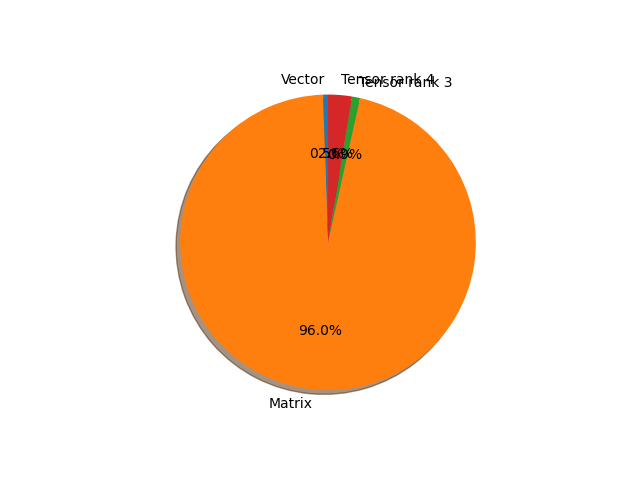

# efficientnet_v2_l parameter information

**Number of layers: [ 897 ]**

**Number of parameters: [ 118.52M ]**

**Proportional of each form** (%)

| Vector | Matrix | Tensor rank 3 | Tensor rank 4 | 
|  --- | --- | --- | --- |
| 62.10 | 28.99 | 6.80 | 2.12 | 

**Proportional of parameters by form** (%)

| Vector | Matrix | Tensor rank 3 | Tensor rank 4 | 
|  --- | --- | --- | --- |
| 0.53 | 95.98 | 0.87 | 2.61 | 

**Layer information**

| Name | Shape | Squeezed shape | Number of parameters | Form |
| --- | --- | --- | --- | --- |
| features.0.0.weight | (32, 3, 3, 3) | (32, 3, 3, 3) | 864 | Tensor rank 4 |
| features.0.1.weight | (32,) | (32,) | 32 | Vector |
| features.0.1.bias | (32,) | (32,) | 32 | Vector |
| features.1.0.block.0.0.weight | (32, 32, 3, 3) | (32, 32, 3, 3) | 9216 | Tensor rank 4 |
| features.1.0.block.0.1.weight | (32,) | (32,) | 32 | Vector |
| features.1.0.block.0.1.bias | (32,) | (32,) | 32 | Vector |
| features.1.1.block.0.0.weight | (32, 32, 3, 3) | (32, 32, 3, 3) | 9216 | Tensor rank 4 |
| features.1.1.block.0.1.weight | (32,) | (32,) | 32 | Vector |
| features.1.1.block.0.1.bias | (32,) | (32,) | 32 | Vector |
| features.1.2.block.0.0.weight | (32, 32, 3, 3) | (32, 32, 3, 3) | 9216 | Tensor rank 4 |
| features.1.2.block.0.1.weight | (32,) | (32,) | 32 | Vector |
| features.1.2.block.0.1.bias | (32,) | (32,) | 32 | Vector |
| features.1.3.block.0.0.weight | (32, 32, 3, 3) | (32, 32, 3, 3) | 9216 | Tensor rank 4 |
| features.1.3.block.0.1.weight | (32,) | (32,) | 32 | Vector |
| features.1.3.block.0.1.bias | (32,) | (32,) | 32 | Vector |
| features.2.0.block.0.0.weight | (128, 32, 3, 3) | (128, 32, 3, 3) | 36864 | Tensor rank 4 |
| features.2.0.block.0.1.weight | (128,) | (128,) | 128 | Vector |
| features.2.0.block.0.1.bias | (128,) | (128,) | 128 | Vector |
| features.2.0.block.1.0.weight | (64, 128, 1, 1) | (64, 128) | 8192 | Matrix |
| features.2.0.block.1.1.weight | (64,) | (64,) | 64 | Vector |
| features.2.0.block.1.1.bias | (64,) | (64,) | 64 | Vector |
| features.2.1.block.0.0.weight | (256, 64, 3, 3) | (256, 64, 3, 3) | 147456 | Tensor rank 4 |
| features.2.1.block.0.1.weight | (256,) | (256,) | 256 | Vector |
| features.2.1.block.0.1.bias | (256,) | (256,) | 256 | Vector |
| features.2.1.block.1.0.weight | (64, 256, 1, 1) | (64, 256) | 16384 | Matrix |
| features.2.1.block.1.1.weight | (64,) | (64,) | 64 | Vector |
| features.2.1.block.1.1.bias | (64,) | (64,) | 64 | Vector |
| features.2.2.block.0.0.weight | (256, 64, 3, 3) | (256, 64, 3, 3) | 147456 | Tensor rank 4 |
| features.2.2.block.0.1.weight | (256,) | (256,) | 256 | Vector |
| features.2.2.block.0.1.bias | (256,) | (256,) | 256 | Vector |
| features.2.2.block.1.0.weight | (64, 256, 1, 1) | (64, 256) | 16384 | Matrix |
| features.2.2.block.1.1.weight | (64,) | (64,) | 64 | Vector |
| features.2.2.block.1.1.bias | (64,) | (64,) | 64 | Vector |
| features.2.3.block.0.0.weight | (256, 64, 3, 3) | (256, 64, 3, 3) | 147456 | Tensor rank 4 |
| features.2.3.block.0.1.weight | (256,) | (256,) | 256 | Vector |
| features.2.3.block.0.1.bias | (256,) | (256,) | 256 | Vector |
| features.2.3.block.1.0.weight | (64, 256, 1, 1) | (64, 256) | 16384 | Matrix |
| features.2.3.block.1.1.weight | (64,) | (64,) | 64 | Vector |
| features.2.3.block.1.1.bias | (64,) | (64,) | 64 | Vector |
| features.2.4.block.0.0.weight | (256, 64, 3, 3) | (256, 64, 3, 3) | 147456 | Tensor rank 4 |
| features.2.4.block.0.1.weight | (256,) | (256,) | 256 | Vector |
| features.2.4.block.0.1.bias | (256,) | (256,) | 256 | Vector |
| features.2.4.block.1.0.weight | (64, 256, 1, 1) | (64, 256) | 16384 | Matrix |
| features.2.4.block.1.1.weight | (64,) | (64,) | 64 | Vector |
| features.2.4.block.1.1.bias | (64,) | (64,) | 64 | Vector |
| features.2.5.block.0.0.weight | (256, 64, 3, 3) | (256, 64, 3, 3) | 147456 | Tensor rank 4 |
| features.2.5.block.0.1.weight | (256,) | (256,) | 256 | Vector |
| features.2.5.block.0.1.bias | (256,) | (256,) | 256 | Vector |
| features.2.5.block.1.0.weight | (64, 256, 1, 1) | (64, 256) | 16384 | Matrix |
| features.2.5.block.1.1.weight | (64,) | (64,) | 64 | Vector |
| features.2.5.block.1.1.bias | (64,) | (64,) | 64 | Vector |
| features.2.6.block.0.0.weight | (256, 64, 3, 3) | (256, 64, 3, 3) | 147456 | Tensor rank 4 |
| features.2.6.block.0.1.weight | (256,) | (256,) | 256 | Vector |
| features.2.6.block.0.1.bias | (256,) | (256,) | 256 | Vector |
| features.2.6.block.1.0.weight | (64, 256, 1, 1) | (64, 256) | 16384 | Matrix |
| features.2.6.block.1.1.weight | (64,) | (64,) | 64 | Vector |
| features.2.6.block.1.1.bias | (64,) | (64,) | 64 | Vector |
| features.3.0.block.0.0.weight | (256, 64, 3, 3) | (256, 64, 3, 3) | 147456 | Tensor rank 4 |
| features.3.0.block.0.1.weight | (256,) | (256,) | 256 | Vector |
| features.3.0.block.0.1.bias | (256,) | (256,) | 256 | Vector |
| features.3.0.block.1.0.weight | (96, 256, 1, 1) | (96, 256) | 24576 | Matrix |
| features.3.0.block.1.1.weight | (96,) | (96,) | 96 | Vector |
| features.3.0.block.1.1.bias | (96,) | (96,) | 96 | Vector |
| features.3.1.block.0.0.weight | (384, 96, 3, 3) | (384, 96, 3, 3) | 331776 | Tensor rank 4 |
| features.3.1.block.0.1.weight | (384,) | (384,) | 384 | Vector |
| features.3.1.block.0.1.bias | (384,) | (384,) | 384 | Vector |
| features.3.1.block.1.0.weight | (96, 384, 1, 1) | (96, 384) | 36864 | Matrix |
| features.3.1.block.1.1.weight | (96,) | (96,) | 96 | Vector |
| features.3.1.block.1.1.bias | (96,) | (96,) | 96 | Vector |
| features.3.2.block.0.0.weight | (384, 96, 3, 3) | (384, 96, 3, 3) | 331776 | Tensor rank 4 |
| features.3.2.block.0.1.weight | (384,) | (384,) | 384 | Vector |
| features.3.2.block.0.1.bias | (384,) | (384,) | 384 | Vector |
| features.3.2.block.1.0.weight | (96, 384, 1, 1) | (96, 384) | 36864 | Matrix |
| features.3.2.block.1.1.weight | (96,) | (96,) | 96 | Vector |
| features.3.2.block.1.1.bias | (96,) | (96,) | 96 | Vector |
| features.3.3.block.0.0.weight | (384, 96, 3, 3) | (384, 96, 3, 3) | 331776 | Tensor rank 4 |
| features.3.3.block.0.1.weight | (384,) | (384,) | 384 | Vector |
| features.3.3.block.0.1.bias | (384,) | (384,) | 384 | Vector |
| features.3.3.block.1.0.weight | (96, 384, 1, 1) | (96, 384) | 36864 | Matrix |
| features.3.3.block.1.1.weight | (96,) | (96,) | 96 | Vector |
| features.3.3.block.1.1.bias | (96,) | (96,) | 96 | Vector |
| features.3.4.block.0.0.weight | (384, 96, 3, 3) | (384, 96, 3, 3) | 331776 | Tensor rank 4 |
| features.3.4.block.0.1.weight | (384,) | (384,) | 384 | Vector |
| features.3.4.block.0.1.bias | (384,) | (384,) | 384 | Vector |
| features.3.4.block.1.0.weight | (96, 384, 1, 1) | (96, 384) | 36864 | Matrix |
| features.3.4.block.1.1.weight | (96,) | (96,) | 96 | Vector |
| features.3.4.block.1.1.bias | (96,) | (96,) | 96 | Vector |
| features.3.5.block.0.0.weight | (384, 96, 3, 3) | (384, 96, 3, 3) | 331776 | Tensor rank 4 |
| features.3.5.block.0.1.weight | (384,) | (384,) | 384 | Vector |
| features.3.5.block.0.1.bias | (384,) | (384,) | 384 | Vector |
| features.3.5.block.1.0.weight | (96, 384, 1, 1) | (96, 384) | 36864 | Matrix |
| features.3.5.block.1.1.weight | (96,) | (96,) | 96 | Vector |
| features.3.5.block.1.1.bias | (96,) | (96,) | 96 | Vector |
| features.3.6.block.0.0.weight | (384, 96, 3, 3) | (384, 96, 3, 3) | 331776 | Tensor rank 4 |
| features.3.6.block.0.1.weight | (384,) | (384,) | 384 | Vector |
| features.3.6.block.0.1.bias | (384,) | (384,) | 384 | Vector |
| features.3.6.block.1.0.weight | (96, 384, 1, 1) | (96, 384) | 36864 | Matrix |
| features.3.6.block.1.1.weight | (96,) | (96,) | 96 | Vector |
| features.3.6.block.1.1.bias | (96,) | (96,) | 96 | Vector |
| features.4.0.block.0.0.weight | (384, 96, 1, 1) | (384, 96) | 36864 | Matrix |
| features.4.0.block.0.1.weight | (384,) | (384,) | 384 | Vector |
| features.4.0.block.0.1.bias | (384,) | (384,) | 384 | Vector |
| features.4.0.block.1.0.weight | (384, 1, 3, 3) | (384, 3, 3) | 3456 | Tensor rank 3 |
| features.4.0.block.1.1.weight | (384,) | (384,) | 384 | Vector |
| features.4.0.block.1.1.bias | (384,) | (384,) | 384 | Vector |
| features.4.0.block.2.fc1.weight | (24, 384, 1, 1) | (24, 384) | 9216 | Matrix |
| features.4.0.block.2.fc1.bias | (24,) | (24,) | 24 | Vector |
| features.4.0.block.2.fc2.weight | (384, 24, 1, 1) | (384, 24) | 9216 | Matrix |
| features.4.0.block.2.fc2.bias | (384,) | (384,) | 384 | Vector |
| features.4.0.block.3.0.weight | (192, 384, 1, 1) | (192, 384) | 73728 | Matrix |
| features.4.0.block.3.1.weight | (192,) | (192,) | 192 | Vector |
| features.4.0.block.3.1.bias | (192,) | (192,) | 192 | Vector |
| features.4.1.block.0.0.weight | (768, 192, 1, 1) | (768, 192) | 147456 | Matrix |
| features.4.1.block.0.1.weight | (768,) | (768,) | 768 | Vector |
| features.4.1.block.0.1.bias | (768,) | (768,) | 768 | Vector |
| features.4.1.block.1.0.weight | (768, 1, 3, 3) | (768, 3, 3) | 6912 | Tensor rank 3 |
| features.4.1.block.1.1.weight | (768,) | (768,) | 768 | Vector |
| features.4.1.block.1.1.bias | (768,) | (768,) | 768 | Vector |
| features.4.1.block.2.fc1.weight | (48, 768, 1, 1) | (48, 768) | 36864 | Matrix |
| features.4.1.block.2.fc1.bias | (48,) | (48,) | 48 | Vector |
| features.4.1.block.2.fc2.weight | (768, 48, 1, 1) | (768, 48) | 36864 | Matrix |
| features.4.1.block.2.fc2.bias | (768,) | (768,) | 768 | Vector |
| features.4.1.block.3.0.weight | (192, 768, 1, 1) | (192, 768) | 147456 | Matrix |
| features.4.1.block.3.1.weight | (192,) | (192,) | 192 | Vector |
| features.4.1.block.3.1.bias | (192,) | (192,) | 192 | Vector |
| features.4.2.block.0.0.weight | (768, 192, 1, 1) | (768, 192) | 147456 | Matrix |
| features.4.2.block.0.1.weight | (768,) | (768,) | 768 | Vector |
| features.4.2.block.0.1.bias | (768,) | (768,) | 768 | Vector |
| features.4.2.block.1.0.weight | (768, 1, 3, 3) | (768, 3, 3) | 6912 | Tensor rank 3 |
| features.4.2.block.1.1.weight | (768,) | (768,) | 768 | Vector |
| features.4.2.block.1.1.bias | (768,) | (768,) | 768 | Vector |
| features.4.2.block.2.fc1.weight | (48, 768, 1, 1) | (48, 768) | 36864 | Matrix |
| features.4.2.block.2.fc1.bias | (48,) | (48,) | 48 | Vector |
| features.4.2.block.2.fc2.weight | (768, 48, 1, 1) | (768, 48) | 36864 | Matrix |
| features.4.2.block.2.fc2.bias | (768,) | (768,) | 768 | Vector |
| features.4.2.block.3.0.weight | (192, 768, 1, 1) | (192, 768) | 147456 | Matrix |
| features.4.2.block.3.1.weight | (192,) | (192,) | 192 | Vector |
| features.4.2.block.3.1.bias | (192,) | (192,) | 192 | Vector |
| features.4.3.block.0.0.weight | (768, 192, 1, 1) | (768, 192) | 147456 | Matrix |
| features.4.3.block.0.1.weight | (768,) | (768,) | 768 | Vector |
| features.4.3.block.0.1.bias | (768,) | (768,) | 768 | Vector |
| features.4.3.block.1.0.weight | (768, 1, 3, 3) | (768, 3, 3) | 6912 | Tensor rank 3 |
| features.4.3.block.1.1.weight | (768,) | (768,) | 768 | Vector |
| features.4.3.block.1.1.bias | (768,) | (768,) | 768 | Vector |
| features.4.3.block.2.fc1.weight | (48, 768, 1, 1) | (48, 768) | 36864 | Matrix |
| features.4.3.block.2.fc1.bias | (48,) | (48,) | 48 | Vector |
| features.4.3.block.2.fc2.weight | (768, 48, 1, 1) | (768, 48) | 36864 | Matrix |
| features.4.3.block.2.fc2.bias | (768,) | (768,) | 768 | Vector |
| features.4.3.block.3.0.weight | (192, 768, 1, 1) | (192, 768) | 147456 | Matrix |
| features.4.3.block.3.1.weight | (192,) | (192,) | 192 | Vector |
| features.4.3.block.3.1.bias | (192,) | (192,) | 192 | Vector |
| features.4.4.block.0.0.weight | (768, 192, 1, 1) | (768, 192) | 147456 | Matrix |
| features.4.4.block.0.1.weight | (768,) | (768,) | 768 | Vector |
| features.4.4.block.0.1.bias | (768,) | (768,) | 768 | Vector |
| features.4.4.block.1.0.weight | (768, 1, 3, 3) | (768, 3, 3) | 6912 | Tensor rank 3 |
| features.4.4.block.1.1.weight | (768,) | (768,) | 768 | Vector |
| features.4.4.block.1.1.bias | (768,) | (768,) | 768 | Vector |
| features.4.4.block.2.fc1.weight | (48, 768, 1, 1) | (48, 768) | 36864 | Matrix |
| features.4.4.block.2.fc1.bias | (48,) | (48,) | 48 | Vector |
| features.4.4.block.2.fc2.weight | (768, 48, 1, 1) | (768, 48) | 36864 | Matrix |
| features.4.4.block.2.fc2.bias | (768,) | (768,) | 768 | Vector |
| features.4.4.block.3.0.weight | (192, 768, 1, 1) | (192, 768) | 147456 | Matrix |
| features.4.4.block.3.1.weight | (192,) | (192,) | 192 | Vector |
| features.4.4.block.3.1.bias | (192,) | (192,) | 192 | Vector |
| features.4.5.block.0.0.weight | (768, 192, 1, 1) | (768, 192) | 147456 | Matrix |
| features.4.5.block.0.1.weight | (768,) | (768,) | 768 | Vector |
| features.4.5.block.0.1.bias | (768,) | (768,) | 768 | Vector |
| features.4.5.block.1.0.weight | (768, 1, 3, 3) | (768, 3, 3) | 6912 | Tensor rank 3 |
| features.4.5.block.1.1.weight | (768,) | (768,) | 768 | Vector |
| features.4.5.block.1.1.bias | (768,) | (768,) | 768 | Vector |
| features.4.5.block.2.fc1.weight | (48, 768, 1, 1) | (48, 768) | 36864 | Matrix |
| features.4.5.block.2.fc1.bias | (48,) | (48,) | 48 | Vector |
| features.4.5.block.2.fc2.weight | (768, 48, 1, 1) | (768, 48) | 36864 | Matrix |
| features.4.5.block.2.fc2.bias | (768,) | (768,) | 768 | Vector |
| features.4.5.block.3.0.weight | (192, 768, 1, 1) | (192, 768) | 147456 | Matrix |
| features.4.5.block.3.1.weight | (192,) | (192,) | 192 | Vector |
| features.4.5.block.3.1.bias | (192,) | (192,) | 192 | Vector |
| features.4.6.block.0.0.weight | (768, 192, 1, 1) | (768, 192) | 147456 | Matrix |
| features.4.6.block.0.1.weight | (768,) | (768,) | 768 | Vector |
| features.4.6.block.0.1.bias | (768,) | (768,) | 768 | Vector |
| features.4.6.block.1.0.weight | (768, 1, 3, 3) | (768, 3, 3) | 6912 | Tensor rank 3 |
| features.4.6.block.1.1.weight | (768,) | (768,) | 768 | Vector |
| features.4.6.block.1.1.bias | (768,) | (768,) | 768 | Vector |
| features.4.6.block.2.fc1.weight | (48, 768, 1, 1) | (48, 768) | 36864 | Matrix |
| features.4.6.block.2.fc1.bias | (48,) | (48,) | 48 | Vector |
| features.4.6.block.2.fc2.weight | (768, 48, 1, 1) | (768, 48) | 36864 | Matrix |
| features.4.6.block.2.fc2.bias | (768,) | (768,) | 768 | Vector |
| features.4.6.block.3.0.weight | (192, 768, 1, 1) | (192, 768) | 147456 | Matrix |
| features.4.6.block.3.1.weight | (192,) | (192,) | 192 | Vector |
| features.4.6.block.3.1.bias | (192,) | (192,) | 192 | Vector |
| features.4.7.block.0.0.weight | (768, 192, 1, 1) | (768, 192) | 147456 | Matrix |
| features.4.7.block.0.1.weight | (768,) | (768,) | 768 | Vector |
| features.4.7.block.0.1.bias | (768,) | (768,) | 768 | Vector |
| features.4.7.block.1.0.weight | (768, 1, 3, 3) | (768, 3, 3) | 6912 | Tensor rank 3 |
| features.4.7.block.1.1.weight | (768,) | (768,) | 768 | Vector |
| features.4.7.block.1.1.bias | (768,) | (768,) | 768 | Vector |
| features.4.7.block.2.fc1.weight | (48, 768, 1, 1) | (48, 768) | 36864 | Matrix |
| features.4.7.block.2.fc1.bias | (48,) | (48,) | 48 | Vector |
| features.4.7.block.2.fc2.weight | (768, 48, 1, 1) | (768, 48) | 36864 | Matrix |
| features.4.7.block.2.fc2.bias | (768,) | (768,) | 768 | Vector |
| features.4.7.block.3.0.weight | (192, 768, 1, 1) | (192, 768) | 147456 | Matrix |
| features.4.7.block.3.1.weight | (192,) | (192,) | 192 | Vector |
| features.4.7.block.3.1.bias | (192,) | (192,) | 192 | Vector |
| features.4.8.block.0.0.weight | (768, 192, 1, 1) | (768, 192) | 147456 | Matrix |
| features.4.8.block.0.1.weight | (768,) | (768,) | 768 | Vector |
| features.4.8.block.0.1.bias | (768,) | (768,) | 768 | Vector |
| features.4.8.block.1.0.weight | (768, 1, 3, 3) | (768, 3, 3) | 6912 | Tensor rank 3 |
| features.4.8.block.1.1.weight | (768,) | (768,) | 768 | Vector |
| features.4.8.block.1.1.bias | (768,) | (768,) | 768 | Vector |
| features.4.8.block.2.fc1.weight | (48, 768, 1, 1) | (48, 768) | 36864 | Matrix |
| features.4.8.block.2.fc1.bias | (48,) | (48,) | 48 | Vector |
| features.4.8.block.2.fc2.weight | (768, 48, 1, 1) | (768, 48) | 36864 | Matrix |
| features.4.8.block.2.fc2.bias | (768,) | (768,) | 768 | Vector |
| features.4.8.block.3.0.weight | (192, 768, 1, 1) | (192, 768) | 147456 | Matrix |
| features.4.8.block.3.1.weight | (192,) | (192,) | 192 | Vector |
| features.4.8.block.3.1.bias | (192,) | (192,) | 192 | Vector |
| features.4.9.block.0.0.weight | (768, 192, 1, 1) | (768, 192) | 147456 | Matrix |
| features.4.9.block.0.1.weight | (768,) | (768,) | 768 | Vector |
| features.4.9.block.0.1.bias | (768,) | (768,) | 768 | Vector |
| features.4.9.block.1.0.weight | (768, 1, 3, 3) | (768, 3, 3) | 6912 | Tensor rank 3 |
| features.4.9.block.1.1.weight | (768,) | (768,) | 768 | Vector |
| features.4.9.block.1.1.bias | (768,) | (768,) | 768 | Vector |
| features.4.9.block.2.fc1.weight | (48, 768, 1, 1) | (48, 768) | 36864 | Matrix |
| features.4.9.block.2.fc1.bias | (48,) | (48,) | 48 | Vector |
| features.4.9.block.2.fc2.weight | (768, 48, 1, 1) | (768, 48) | 36864 | Matrix |
| features.4.9.block.2.fc2.bias | (768,) | (768,) | 768 | Vector |
| features.4.9.block.3.0.weight | (192, 768, 1, 1) | (192, 768) | 147456 | Matrix |
| features.4.9.block.3.1.weight | (192,) | (192,) | 192 | Vector |
| features.4.9.block.3.1.bias | (192,) | (192,) | 192 | Vector |
| features.5.0.block.0.0.weight | (1152, 192, 1, 1) | (1152, 192) | 221184 | Matrix |
| features.5.0.block.0.1.weight | (1152,) | (1152,) | 1152 | Vector |
| features.5.0.block.0.1.bias | (1152,) | (1152,) | 1152 | Vector |
| features.5.0.block.1.0.weight | (1152, 1, 3, 3) | (1152, 3, 3) | 10368 | Tensor rank 3 |
| features.5.0.block.1.1.weight | (1152,) | (1152,) | 1152 | Vector |
| features.5.0.block.1.1.bias | (1152,) | (1152,) | 1152 | Vector |
| features.5.0.block.2.fc1.weight | (48, 1152, 1, 1) | (48, 1152) | 55296 | Matrix |
| features.5.0.block.2.fc1.bias | (48,) | (48,) | 48 | Vector |
| features.5.0.block.2.fc2.weight | (1152, 48, 1, 1) | (1152, 48) | 55296 | Matrix |
| features.5.0.block.2.fc2.bias | (1152,) | (1152,) | 1152 | Vector |
| features.5.0.block.3.0.weight | (224, 1152, 1, 1) | (224, 1152) | 258048 | Matrix |
| features.5.0.block.3.1.weight | (224,) | (224,) | 224 | Vector |
| features.5.0.block.3.1.bias | (224,) | (224,) | 224 | Vector |
| features.5.1.block.0.0.weight | (1344, 224, 1, 1) | (1344, 224) | 301056 | Matrix |
| features.5.1.block.0.1.weight | (1344,) | (1344,) | 1344 | Vector |
| features.5.1.block.0.1.bias | (1344,) | (1344,) | 1344 | Vector |
| features.5.1.block.1.0.weight | (1344, 1, 3, 3) | (1344, 3, 3) | 12096 | Tensor rank 3 |
| features.5.1.block.1.1.weight | (1344,) | (1344,) | 1344 | Vector |
| features.5.1.block.1.1.bias | (1344,) | (1344,) | 1344 | Vector |
| features.5.1.block.2.fc1.weight | (56, 1344, 1, 1) | (56, 1344) | 75264 | Matrix |
| features.5.1.block.2.fc1.bias | (56,) | (56,) | 56 | Vector |
| features.5.1.block.2.fc2.weight | (1344, 56, 1, 1) | (1344, 56) | 75264 | Matrix |
| features.5.1.block.2.fc2.bias | (1344,) | (1344,) | 1344 | Vector |
| features.5.1.block.3.0.weight | (224, 1344, 1, 1) | (224, 1344) | 301056 | Matrix |
| features.5.1.block.3.1.weight | (224,) | (224,) | 224 | Vector |
| features.5.1.block.3.1.bias | (224,) | (224,) | 224 | Vector |
| features.5.2.block.0.0.weight | (1344, 224, 1, 1) | (1344, 224) | 301056 | Matrix |
| features.5.2.block.0.1.weight | (1344,) | (1344,) | 1344 | Vector |
| features.5.2.block.0.1.bias | (1344,) | (1344,) | 1344 | Vector |
| features.5.2.block.1.0.weight | (1344, 1, 3, 3) | (1344, 3, 3) | 12096 | Tensor rank 3 |
| features.5.2.block.1.1.weight | (1344,) | (1344,) | 1344 | Vector |
| features.5.2.block.1.1.bias | (1344,) | (1344,) | 1344 | Vector |
| features.5.2.block.2.fc1.weight | (56, 1344, 1, 1) | (56, 1344) | 75264 | Matrix |
| features.5.2.block.2.fc1.bias | (56,) | (56,) | 56 | Vector |
| features.5.2.block.2.fc2.weight | (1344, 56, 1, 1) | (1344, 56) | 75264 | Matrix |
| features.5.2.block.2.fc2.bias | (1344,) | (1344,) | 1344 | Vector |
| features.5.2.block.3.0.weight | (224, 1344, 1, 1) | (224, 1344) | 301056 | Matrix |
| features.5.2.block.3.1.weight | (224,) | (224,) | 224 | Vector |
| features.5.2.block.3.1.bias | (224,) | (224,) | 224 | Vector |
| features.5.3.block.0.0.weight | (1344, 224, 1, 1) | (1344, 224) | 301056 | Matrix |
| features.5.3.block.0.1.weight | (1344,) | (1344,) | 1344 | Vector |
| features.5.3.block.0.1.bias | (1344,) | (1344,) | 1344 | Vector |
| features.5.3.block.1.0.weight | (1344, 1, 3, 3) | (1344, 3, 3) | 12096 | Tensor rank 3 |
| features.5.3.block.1.1.weight | (1344,) | (1344,) | 1344 | Vector |
| features.5.3.block.1.1.bias | (1344,) | (1344,) | 1344 | Vector |
| features.5.3.block.2.fc1.weight | (56, 1344, 1, 1) | (56, 1344) | 75264 | Matrix |
| features.5.3.block.2.fc1.bias | (56,) | (56,) | 56 | Vector |
| features.5.3.block.2.fc2.weight | (1344, 56, 1, 1) | (1344, 56) | 75264 | Matrix |
| features.5.3.block.2.fc2.bias | (1344,) | (1344,) | 1344 | Vector |
| features.5.3.block.3.0.weight | (224, 1344, 1, 1) | (224, 1344) | 301056 | Matrix |
| features.5.3.block.3.1.weight | (224,) | (224,) | 224 | Vector |
| features.5.3.block.3.1.bias | (224,) | (224,) | 224 | Vector |
| features.5.4.block.0.0.weight | (1344, 224, 1, 1) | (1344, 224) | 301056 | Matrix |
| features.5.4.block.0.1.weight | (1344,) | (1344,) | 1344 | Vector |
| features.5.4.block.0.1.bias | (1344,) | (1344,) | 1344 | Vector |
| features.5.4.block.1.0.weight | (1344, 1, 3, 3) | (1344, 3, 3) | 12096 | Tensor rank 3 |
| features.5.4.block.1.1.weight | (1344,) | (1344,) | 1344 | Vector |
| features.5.4.block.1.1.bias | (1344,) | (1344,) | 1344 | Vector |
| features.5.4.block.2.fc1.weight | (56, 1344, 1, 1) | (56, 1344) | 75264 | Matrix |
| features.5.4.block.2.fc1.bias | (56,) | (56,) | 56 | Vector |
| features.5.4.block.2.fc2.weight | (1344, 56, 1, 1) | (1344, 56) | 75264 | Matrix |
| features.5.4.block.2.fc2.bias | (1344,) | (1344,) | 1344 | Vector |
| features.5.4.block.3.0.weight | (224, 1344, 1, 1) | (224, 1344) | 301056 | Matrix |
| features.5.4.block.3.1.weight | (224,) | (224,) | 224 | Vector |
| features.5.4.block.3.1.bias | (224,) | (224,) | 224 | Vector |
| features.5.5.block.0.0.weight | (1344, 224, 1, 1) | (1344, 224) | 301056 | Matrix |
| features.5.5.block.0.1.weight | (1344,) | (1344,) | 1344 | Vector |
| features.5.5.block.0.1.bias | (1344,) | (1344,) | 1344 | Vector |
| features.5.5.block.1.0.weight | (1344, 1, 3, 3) | (1344, 3, 3) | 12096 | Tensor rank 3 |
| features.5.5.block.1.1.weight | (1344,) | (1344,) | 1344 | Vector |
| features.5.5.block.1.1.bias | (1344,) | (1344,) | 1344 | Vector |
| features.5.5.block.2.fc1.weight | (56, 1344, 1, 1) | (56, 1344) | 75264 | Matrix |
| features.5.5.block.2.fc1.bias | (56,) | (56,) | 56 | Vector |
| features.5.5.block.2.fc2.weight | (1344, 56, 1, 1) | (1344, 56) | 75264 | Matrix |
| features.5.5.block.2.fc2.bias | (1344,) | (1344,) | 1344 | Vector |
| features.5.5.block.3.0.weight | (224, 1344, 1, 1) | (224, 1344) | 301056 | Matrix |
| features.5.5.block.3.1.weight | (224,) | (224,) | 224 | Vector |
| features.5.5.block.3.1.bias | (224,) | (224,) | 224 | Vector |
| features.5.6.block.0.0.weight | (1344, 224, 1, 1) | (1344, 224) | 301056 | Matrix |
| features.5.6.block.0.1.weight | (1344,) | (1344,) | 1344 | Vector |
| features.5.6.block.0.1.bias | (1344,) | (1344,) | 1344 | Vector |
| features.5.6.block.1.0.weight | (1344, 1, 3, 3) | (1344, 3, 3) | 12096 | Tensor rank 3 |
| features.5.6.block.1.1.weight | (1344,) | (1344,) | 1344 | Vector |
| features.5.6.block.1.1.bias | (1344,) | (1344,) | 1344 | Vector |
| features.5.6.block.2.fc1.weight | (56, 1344, 1, 1) | (56, 1344) | 75264 | Matrix |
| features.5.6.block.2.fc1.bias | (56,) | (56,) | 56 | Vector |
| features.5.6.block.2.fc2.weight | (1344, 56, 1, 1) | (1344, 56) | 75264 | Matrix |
| features.5.6.block.2.fc2.bias | (1344,) | (1344,) | 1344 | Vector |
| features.5.6.block.3.0.weight | (224, 1344, 1, 1) | (224, 1344) | 301056 | Matrix |
| features.5.6.block.3.1.weight | (224,) | (224,) | 224 | Vector |
| features.5.6.block.3.1.bias | (224,) | (224,) | 224 | Vector |
| features.5.7.block.0.0.weight | (1344, 224, 1, 1) | (1344, 224) | 301056 | Matrix |
| features.5.7.block.0.1.weight | (1344,) | (1344,) | 1344 | Vector |
| features.5.7.block.0.1.bias | (1344,) | (1344,) | 1344 | Vector |
| features.5.7.block.1.0.weight | (1344, 1, 3, 3) | (1344, 3, 3) | 12096 | Tensor rank 3 |
| features.5.7.block.1.1.weight | (1344,) | (1344,) | 1344 | Vector |
| features.5.7.block.1.1.bias | (1344,) | (1344,) | 1344 | Vector |
| features.5.7.block.2.fc1.weight | (56, 1344, 1, 1) | (56, 1344) | 75264 | Matrix |
| features.5.7.block.2.fc1.bias | (56,) | (56,) | 56 | Vector |
| features.5.7.block.2.fc2.weight | (1344, 56, 1, 1) | (1344, 56) | 75264 | Matrix |
| features.5.7.block.2.fc2.bias | (1344,) | (1344,) | 1344 | Vector |
| features.5.7.block.3.0.weight | (224, 1344, 1, 1) | (224, 1344) | 301056 | Matrix |
| features.5.7.block.3.1.weight | (224,) | (224,) | 224 | Vector |
| features.5.7.block.3.1.bias | (224,) | (224,) | 224 | Vector |
| features.5.8.block.0.0.weight | (1344, 224, 1, 1) | (1344, 224) | 301056 | Matrix |
| features.5.8.block.0.1.weight | (1344,) | (1344,) | 1344 | Vector |
| features.5.8.block.0.1.bias | (1344,) | (1344,) | 1344 | Vector |
| features.5.8.block.1.0.weight | (1344, 1, 3, 3) | (1344, 3, 3) | 12096 | Tensor rank 3 |
| features.5.8.block.1.1.weight | (1344,) | (1344,) | 1344 | Vector |
| features.5.8.block.1.1.bias | (1344,) | (1344,) | 1344 | Vector |
| features.5.8.block.2.fc1.weight | (56, 1344, 1, 1) | (56, 1344) | 75264 | Matrix |
| features.5.8.block.2.fc1.bias | (56,) | (56,) | 56 | Vector |
| features.5.8.block.2.fc2.weight | (1344, 56, 1, 1) | (1344, 56) | 75264 | Matrix |
| features.5.8.block.2.fc2.bias | (1344,) | (1344,) | 1344 | Vector |
| features.5.8.block.3.0.weight | (224, 1344, 1, 1) | (224, 1344) | 301056 | Matrix |
| features.5.8.block.3.1.weight | (224,) | (224,) | 224 | Vector |
| features.5.8.block.3.1.bias | (224,) | (224,) | 224 | Vector |
| features.5.9.block.0.0.weight | (1344, 224, 1, 1) | (1344, 224) | 301056 | Matrix |
| features.5.9.block.0.1.weight | (1344,) | (1344,) | 1344 | Vector |
| features.5.9.block.0.1.bias | (1344,) | (1344,) | 1344 | Vector |
| features.5.9.block.1.0.weight | (1344, 1, 3, 3) | (1344, 3, 3) | 12096 | Tensor rank 3 |
| features.5.9.block.1.1.weight | (1344,) | (1344,) | 1344 | Vector |
| features.5.9.block.1.1.bias | (1344,) | (1344,) | 1344 | Vector |
| features.5.9.block.2.fc1.weight | (56, 1344, 1, 1) | (56, 1344) | 75264 | Matrix |
| features.5.9.block.2.fc1.bias | (56,) | (56,) | 56 | Vector |
| features.5.9.block.2.fc2.weight | (1344, 56, 1, 1) | (1344, 56) | 75264 | Matrix |
| features.5.9.block.2.fc2.bias | (1344,) | (1344,) | 1344 | Vector |
| features.5.9.block.3.0.weight | (224, 1344, 1, 1) | (224, 1344) | 301056 | Matrix |
| features.5.9.block.3.1.weight | (224,) | (224,) | 224 | Vector |
| features.5.9.block.3.1.bias | (224,) | (224,) | 224 | Vector |
| features.5.10.block.0.0.weight | (1344, 224, 1, 1) | (1344, 224) | 301056 | Matrix |
| features.5.10.block.0.1.weight | (1344,) | (1344,) | 1344 | Vector |
| features.5.10.block.0.1.bias | (1344,) | (1344,) | 1344 | Vector |
| features.5.10.block.1.0.weight | (1344, 1, 3, 3) | (1344, 3, 3) | 12096 | Tensor rank 3 |
| features.5.10.block.1.1.weight | (1344,) | (1344,) | 1344 | Vector |
| features.5.10.block.1.1.bias | (1344,) | (1344,) | 1344 | Vector |
| features.5.10.block.2.fc1.weight | (56, 1344, 1, 1) | (56, 1344) | 75264 | Matrix |
| features.5.10.block.2.fc1.bias | (56,) | (56,) | 56 | Vector |
| features.5.10.block.2.fc2.weight | (1344, 56, 1, 1) | (1344, 56) | 75264 | Matrix |
| features.5.10.block.2.fc2.bias | (1344,) | (1344,) | 1344 | Vector |
| features.5.10.block.3.0.weight | (224, 1344, 1, 1) | (224, 1344) | 301056 | Matrix |
| features.5.10.block.3.1.weight | (224,) | (224,) | 224 | Vector |
| features.5.10.block.3.1.bias | (224,) | (224,) | 224 | Vector |
| features.5.11.block.0.0.weight | (1344, 224, 1, 1) | (1344, 224) | 301056 | Matrix |
| features.5.11.block.0.1.weight | (1344,) | (1344,) | 1344 | Vector |
| features.5.11.block.0.1.bias | (1344,) | (1344,) | 1344 | Vector |
| features.5.11.block.1.0.weight | (1344, 1, 3, 3) | (1344, 3, 3) | 12096 | Tensor rank 3 |
| features.5.11.block.1.1.weight | (1344,) | (1344,) | 1344 | Vector |
| features.5.11.block.1.1.bias | (1344,) | (1344,) | 1344 | Vector |
| features.5.11.block.2.fc1.weight | (56, 1344, 1, 1) | (56, 1344) | 75264 | Matrix |
| features.5.11.block.2.fc1.bias | (56,) | (56,) | 56 | Vector |
| features.5.11.block.2.fc2.weight | (1344, 56, 1, 1) | (1344, 56) | 75264 | Matrix |
| features.5.11.block.2.fc2.bias | (1344,) | (1344,) | 1344 | Vector |
| features.5.11.block.3.0.weight | (224, 1344, 1, 1) | (224, 1344) | 301056 | Matrix |
| features.5.11.block.3.1.weight | (224,) | (224,) | 224 | Vector |
| features.5.11.block.3.1.bias | (224,) | (224,) | 224 | Vector |
| features.5.12.block.0.0.weight | (1344, 224, 1, 1) | (1344, 224) | 301056 | Matrix |
| features.5.12.block.0.1.weight | (1344,) | (1344,) | 1344 | Vector |
| features.5.12.block.0.1.bias | (1344,) | (1344,) | 1344 | Vector |
| features.5.12.block.1.0.weight | (1344, 1, 3, 3) | (1344, 3, 3) | 12096 | Tensor rank 3 |
| features.5.12.block.1.1.weight | (1344,) | (1344,) | 1344 | Vector |
| features.5.12.block.1.1.bias | (1344,) | (1344,) | 1344 | Vector |
| features.5.12.block.2.fc1.weight | (56, 1344, 1, 1) | (56, 1344) | 75264 | Matrix |
| features.5.12.block.2.fc1.bias | (56,) | (56,) | 56 | Vector |
| features.5.12.block.2.fc2.weight | (1344, 56, 1, 1) | (1344, 56) | 75264 | Matrix |
| features.5.12.block.2.fc2.bias | (1344,) | (1344,) | 1344 | Vector |
| features.5.12.block.3.0.weight | (224, 1344, 1, 1) | (224, 1344) | 301056 | Matrix |
| features.5.12.block.3.1.weight | (224,) | (224,) | 224 | Vector |
| features.5.12.block.3.1.bias | (224,) | (224,) | 224 | Vector |
| features.5.13.block.0.0.weight | (1344, 224, 1, 1) | (1344, 224) | 301056 | Matrix |
| features.5.13.block.0.1.weight | (1344,) | (1344,) | 1344 | Vector |
| features.5.13.block.0.1.bias | (1344,) | (1344,) | 1344 | Vector |
| features.5.13.block.1.0.weight | (1344, 1, 3, 3) | (1344, 3, 3) | 12096 | Tensor rank 3 |
| features.5.13.block.1.1.weight | (1344,) | (1344,) | 1344 | Vector |
| features.5.13.block.1.1.bias | (1344,) | (1344,) | 1344 | Vector |
| features.5.13.block.2.fc1.weight | (56, 1344, 1, 1) | (56, 1344) | 75264 | Matrix |
| features.5.13.block.2.fc1.bias | (56,) | (56,) | 56 | Vector |
| features.5.13.block.2.fc2.weight | (1344, 56, 1, 1) | (1344, 56) | 75264 | Matrix |
| features.5.13.block.2.fc2.bias | (1344,) | (1344,) | 1344 | Vector |
| features.5.13.block.3.0.weight | (224, 1344, 1, 1) | (224, 1344) | 301056 | Matrix |
| features.5.13.block.3.1.weight | (224,) | (224,) | 224 | Vector |
| features.5.13.block.3.1.bias | (224,) | (224,) | 224 | Vector |
| features.5.14.block.0.0.weight | (1344, 224, 1, 1) | (1344, 224) | 301056 | Matrix |
| features.5.14.block.0.1.weight | (1344,) | (1344,) | 1344 | Vector |
| features.5.14.block.0.1.bias | (1344,) | (1344,) | 1344 | Vector |
| features.5.14.block.1.0.weight | (1344, 1, 3, 3) | (1344, 3, 3) | 12096 | Tensor rank 3 |
| features.5.14.block.1.1.weight | (1344,) | (1344,) | 1344 | Vector |
| features.5.14.block.1.1.bias | (1344,) | (1344,) | 1344 | Vector |
| features.5.14.block.2.fc1.weight | (56, 1344, 1, 1) | (56, 1344) | 75264 | Matrix |
| features.5.14.block.2.fc1.bias | (56,) | (56,) | 56 | Vector |
| features.5.14.block.2.fc2.weight | (1344, 56, 1, 1) | (1344, 56) | 75264 | Matrix |
| features.5.14.block.2.fc2.bias | (1344,) | (1344,) | 1344 | Vector |
| features.5.14.block.3.0.weight | (224, 1344, 1, 1) | (224, 1344) | 301056 | Matrix |
| features.5.14.block.3.1.weight | (224,) | (224,) | 224 | Vector |
| features.5.14.block.3.1.bias | (224,) | (224,) | 224 | Vector |
| features.5.15.block.0.0.weight | (1344, 224, 1, 1) | (1344, 224) | 301056 | Matrix |
| features.5.15.block.0.1.weight | (1344,) | (1344,) | 1344 | Vector |
| features.5.15.block.0.1.bias | (1344,) | (1344,) | 1344 | Vector |
| features.5.15.block.1.0.weight | (1344, 1, 3, 3) | (1344, 3, 3) | 12096 | Tensor rank 3 |
| features.5.15.block.1.1.weight | (1344,) | (1344,) | 1344 | Vector |
| features.5.15.block.1.1.bias | (1344,) | (1344,) | 1344 | Vector |
| features.5.15.block.2.fc1.weight | (56, 1344, 1, 1) | (56, 1344) | 75264 | Matrix |
| features.5.15.block.2.fc1.bias | (56,) | (56,) | 56 | Vector |
| features.5.15.block.2.fc2.weight | (1344, 56, 1, 1) | (1344, 56) | 75264 | Matrix |
| features.5.15.block.2.fc2.bias | (1344,) | (1344,) | 1344 | Vector |
| features.5.15.block.3.0.weight | (224, 1344, 1, 1) | (224, 1344) | 301056 | Matrix |
| features.5.15.block.3.1.weight | (224,) | (224,) | 224 | Vector |
| features.5.15.block.3.1.bias | (224,) | (224,) | 224 | Vector |
| features.5.16.block.0.0.weight | (1344, 224, 1, 1) | (1344, 224) | 301056 | Matrix |
| features.5.16.block.0.1.weight | (1344,) | (1344,) | 1344 | Vector |
| features.5.16.block.0.1.bias | (1344,) | (1344,) | 1344 | Vector |
| features.5.16.block.1.0.weight | (1344, 1, 3, 3) | (1344, 3, 3) | 12096 | Tensor rank 3 |
| features.5.16.block.1.1.weight | (1344,) | (1344,) | 1344 | Vector |
| features.5.16.block.1.1.bias | (1344,) | (1344,) | 1344 | Vector |
| features.5.16.block.2.fc1.weight | (56, 1344, 1, 1) | (56, 1344) | 75264 | Matrix |
| features.5.16.block.2.fc1.bias | (56,) | (56,) | 56 | Vector |
| features.5.16.block.2.fc2.weight | (1344, 56, 1, 1) | (1344, 56) | 75264 | Matrix |
| features.5.16.block.2.fc2.bias | (1344,) | (1344,) | 1344 | Vector |
| features.5.16.block.3.0.weight | (224, 1344, 1, 1) | (224, 1344) | 301056 | Matrix |
| features.5.16.block.3.1.weight | (224,) | (224,) | 224 | Vector |
| features.5.16.block.3.1.bias | (224,) | (224,) | 224 | Vector |
| features.5.17.block.0.0.weight | (1344, 224, 1, 1) | (1344, 224) | 301056 | Matrix |
| features.5.17.block.0.1.weight | (1344,) | (1344,) | 1344 | Vector |
| features.5.17.block.0.1.bias | (1344,) | (1344,) | 1344 | Vector |
| features.5.17.block.1.0.weight | (1344, 1, 3, 3) | (1344, 3, 3) | 12096 | Tensor rank 3 |
| features.5.17.block.1.1.weight | (1344,) | (1344,) | 1344 | Vector |
| features.5.17.block.1.1.bias | (1344,) | (1344,) | 1344 | Vector |
| features.5.17.block.2.fc1.weight | (56, 1344, 1, 1) | (56, 1344) | 75264 | Matrix |
| features.5.17.block.2.fc1.bias | (56,) | (56,) | 56 | Vector |
| features.5.17.block.2.fc2.weight | (1344, 56, 1, 1) | (1344, 56) | 75264 | Matrix |
| features.5.17.block.2.fc2.bias | (1344,) | (1344,) | 1344 | Vector |
| features.5.17.block.3.0.weight | (224, 1344, 1, 1) | (224, 1344) | 301056 | Matrix |
| features.5.17.block.3.1.weight | (224,) | (224,) | 224 | Vector |
| features.5.17.block.3.1.bias | (224,) | (224,) | 224 | Vector |
| features.5.18.block.0.0.weight | (1344, 224, 1, 1) | (1344, 224) | 301056 | Matrix |
| features.5.18.block.0.1.weight | (1344,) | (1344,) | 1344 | Vector |
| features.5.18.block.0.1.bias | (1344,) | (1344,) | 1344 | Vector |
| features.5.18.block.1.0.weight | (1344, 1, 3, 3) | (1344, 3, 3) | 12096 | Tensor rank 3 |
| features.5.18.block.1.1.weight | (1344,) | (1344,) | 1344 | Vector |
| features.5.18.block.1.1.bias | (1344,) | (1344,) | 1344 | Vector |
| features.5.18.block.2.fc1.weight | (56, 1344, 1, 1) | (56, 1344) | 75264 | Matrix |
| features.5.18.block.2.fc1.bias | (56,) | (56,) | 56 | Vector |
| features.5.18.block.2.fc2.weight | (1344, 56, 1, 1) | (1344, 56) | 75264 | Matrix |
| features.5.18.block.2.fc2.bias | (1344,) | (1344,) | 1344 | Vector |
| features.5.18.block.3.0.weight | (224, 1344, 1, 1) | (224, 1344) | 301056 | Matrix |
| features.5.18.block.3.1.weight | (224,) | (224,) | 224 | Vector |
| features.5.18.block.3.1.bias | (224,) | (224,) | 224 | Vector |
| features.6.0.block.0.0.weight | (1344, 224, 1, 1) | (1344, 224) | 301056 | Matrix |
| features.6.0.block.0.1.weight | (1344,) | (1344,) | 1344 | Vector |
| features.6.0.block.0.1.bias | (1344,) | (1344,) | 1344 | Vector |
| features.6.0.block.1.0.weight | (1344, 1, 3, 3) | (1344, 3, 3) | 12096 | Tensor rank 3 |
| features.6.0.block.1.1.weight | (1344,) | (1344,) | 1344 | Vector |
| features.6.0.block.1.1.bias | (1344,) | (1344,) | 1344 | Vector |
| features.6.0.block.2.fc1.weight | (56, 1344, 1, 1) | (56, 1344) | 75264 | Matrix |
| features.6.0.block.2.fc1.bias | (56,) | (56,) | 56 | Vector |
| features.6.0.block.2.fc2.weight | (1344, 56, 1, 1) | (1344, 56) | 75264 | Matrix |
| features.6.0.block.2.fc2.bias | (1344,) | (1344,) | 1344 | Vector |
| features.6.0.block.3.0.weight | (384, 1344, 1, 1) | (384, 1344) | 516096 | Matrix |
| features.6.0.block.3.1.weight | (384,) | (384,) | 384 | Vector |
| features.6.0.block.3.1.bias | (384,) | (384,) | 384 | Vector |
| features.6.1.block.0.0.weight | (2304, 384, 1, 1) | (2304, 384) | 884736 | Matrix |
| features.6.1.block.0.1.weight | (2304,) | (2304,) | 2304 | Vector |
| features.6.1.block.0.1.bias | (2304,) | (2304,) | 2304 | Vector |
| features.6.1.block.1.0.weight | (2304, 1, 3, 3) | (2304, 3, 3) | 20736 | Tensor rank 3 |
| features.6.1.block.1.1.weight | (2304,) | (2304,) | 2304 | Vector |
| features.6.1.block.1.1.bias | (2304,) | (2304,) | 2304 | Vector |
| features.6.1.block.2.fc1.weight | (96, 2304, 1, 1) | (96, 2304) | 221184 | Matrix |
| features.6.1.block.2.fc1.bias | (96,) | (96,) | 96 | Vector |
| features.6.1.block.2.fc2.weight | (2304, 96, 1, 1) | (2304, 96) | 221184 | Matrix |
| features.6.1.block.2.fc2.bias | (2304,) | (2304,) | 2304 | Vector |
| features.6.1.block.3.0.weight | (384, 2304, 1, 1) | (384, 2304) | 884736 | Matrix |
| features.6.1.block.3.1.weight | (384,) | (384,) | 384 | Vector |
| features.6.1.block.3.1.bias | (384,) | (384,) | 384 | Vector |
| features.6.2.block.0.0.weight | (2304, 384, 1, 1) | (2304, 384) | 884736 | Matrix |
| features.6.2.block.0.1.weight | (2304,) | (2304,) | 2304 | Vector |
| features.6.2.block.0.1.bias | (2304,) | (2304,) | 2304 | Vector |
| features.6.2.block.1.0.weight | (2304, 1, 3, 3) | (2304, 3, 3) | 20736 | Tensor rank 3 |
| features.6.2.block.1.1.weight | (2304,) | (2304,) | 2304 | Vector |
| features.6.2.block.1.1.bias | (2304,) | (2304,) | 2304 | Vector |
| features.6.2.block.2.fc1.weight | (96, 2304, 1, 1) | (96, 2304) | 221184 | Matrix |
| features.6.2.block.2.fc1.bias | (96,) | (96,) | 96 | Vector |
| features.6.2.block.2.fc2.weight | (2304, 96, 1, 1) | (2304, 96) | 221184 | Matrix |
| features.6.2.block.2.fc2.bias | (2304,) | (2304,) | 2304 | Vector |
| features.6.2.block.3.0.weight | (384, 2304, 1, 1) | (384, 2304) | 884736 | Matrix |
| features.6.2.block.3.1.weight | (384,) | (384,) | 384 | Vector |
| features.6.2.block.3.1.bias | (384,) | (384,) | 384 | Vector |
| features.6.3.block.0.0.weight | (2304, 384, 1, 1) | (2304, 384) | 884736 | Matrix |
| features.6.3.block.0.1.weight | (2304,) | (2304,) | 2304 | Vector |
| features.6.3.block.0.1.bias | (2304,) | (2304,) | 2304 | Vector |
| features.6.3.block.1.0.weight | (2304, 1, 3, 3) | (2304, 3, 3) | 20736 | Tensor rank 3 |
| features.6.3.block.1.1.weight | (2304,) | (2304,) | 2304 | Vector |
| features.6.3.block.1.1.bias | (2304,) | (2304,) | 2304 | Vector |
| features.6.3.block.2.fc1.weight | (96, 2304, 1, 1) | (96, 2304) | 221184 | Matrix |
| features.6.3.block.2.fc1.bias | (96,) | (96,) | 96 | Vector |
| features.6.3.block.2.fc2.weight | (2304, 96, 1, 1) | (2304, 96) | 221184 | Matrix |
| features.6.3.block.2.fc2.bias | (2304,) | (2304,) | 2304 | Vector |
| features.6.3.block.3.0.weight | (384, 2304, 1, 1) | (384, 2304) | 884736 | Matrix |
| features.6.3.block.3.1.weight | (384,) | (384,) | 384 | Vector |
| features.6.3.block.3.1.bias | (384,) | (384,) | 384 | Vector |
| features.6.4.block.0.0.weight | (2304, 384, 1, 1) | (2304, 384) | 884736 | Matrix |
| features.6.4.block.0.1.weight | (2304,) | (2304,) | 2304 | Vector |
| features.6.4.block.0.1.bias | (2304,) | (2304,) | 2304 | Vector |
| features.6.4.block.1.0.weight | (2304, 1, 3, 3) | (2304, 3, 3) | 20736 | Tensor rank 3 |
| features.6.4.block.1.1.weight | (2304,) | (2304,) | 2304 | Vector |
| features.6.4.block.1.1.bias | (2304,) | (2304,) | 2304 | Vector |
| features.6.4.block.2.fc1.weight | (96, 2304, 1, 1) | (96, 2304) | 221184 | Matrix |
| features.6.4.block.2.fc1.bias | (96,) | (96,) | 96 | Vector |
| features.6.4.block.2.fc2.weight | (2304, 96, 1, 1) | (2304, 96) | 221184 | Matrix |
| features.6.4.block.2.fc2.bias | (2304,) | (2304,) | 2304 | Vector |
| features.6.4.block.3.0.weight | (384, 2304, 1, 1) | (384, 2304) | 884736 | Matrix |
| features.6.4.block.3.1.weight | (384,) | (384,) | 384 | Vector |
| features.6.4.block.3.1.bias | (384,) | (384,) | 384 | Vector |
| features.6.5.block.0.0.weight | (2304, 384, 1, 1) | (2304, 384) | 884736 | Matrix |
| features.6.5.block.0.1.weight | (2304,) | (2304,) | 2304 | Vector |
| features.6.5.block.0.1.bias | (2304,) | (2304,) | 2304 | Vector |
| features.6.5.block.1.0.weight | (2304, 1, 3, 3) | (2304, 3, 3) | 20736 | Tensor rank 3 |
| features.6.5.block.1.1.weight | (2304,) | (2304,) | 2304 | Vector |
| features.6.5.block.1.1.bias | (2304,) | (2304,) | 2304 | Vector |
| features.6.5.block.2.fc1.weight | (96, 2304, 1, 1) | (96, 2304) | 221184 | Matrix |
| features.6.5.block.2.fc1.bias | (96,) | (96,) | 96 | Vector |
| features.6.5.block.2.fc2.weight | (2304, 96, 1, 1) | (2304, 96) | 221184 | Matrix |
| features.6.5.block.2.fc2.bias | (2304,) | (2304,) | 2304 | Vector |
| features.6.5.block.3.0.weight | (384, 2304, 1, 1) | (384, 2304) | 884736 | Matrix |
| features.6.5.block.3.1.weight | (384,) | (384,) | 384 | Vector |
| features.6.5.block.3.1.bias | (384,) | (384,) | 384 | Vector |
| features.6.6.block.0.0.weight | (2304, 384, 1, 1) | (2304, 384) | 884736 | Matrix |
| features.6.6.block.0.1.weight | (2304,) | (2304,) | 2304 | Vector |
| features.6.6.block.0.1.bias | (2304,) | (2304,) | 2304 | Vector |
| features.6.6.block.1.0.weight | (2304, 1, 3, 3) | (2304, 3, 3) | 20736 | Tensor rank 3 |
| features.6.6.block.1.1.weight | (2304,) | (2304,) | 2304 | Vector |
| features.6.6.block.1.1.bias | (2304,) | (2304,) | 2304 | Vector |
| features.6.6.block.2.fc1.weight | (96, 2304, 1, 1) | (96, 2304) | 221184 | Matrix |
| features.6.6.block.2.fc1.bias | (96,) | (96,) | 96 | Vector |
| features.6.6.block.2.fc2.weight | (2304, 96, 1, 1) | (2304, 96) | 221184 | Matrix |
| features.6.6.block.2.fc2.bias | (2304,) | (2304,) | 2304 | Vector |
| features.6.6.block.3.0.weight | (384, 2304, 1, 1) | (384, 2304) | 884736 | Matrix |
| features.6.6.block.3.1.weight | (384,) | (384,) | 384 | Vector |
| features.6.6.block.3.1.bias | (384,) | (384,) | 384 | Vector |
| features.6.7.block.0.0.weight | (2304, 384, 1, 1) | (2304, 384) | 884736 | Matrix |
| features.6.7.block.0.1.weight | (2304,) | (2304,) | 2304 | Vector |
| features.6.7.block.0.1.bias | (2304,) | (2304,) | 2304 | Vector |
| features.6.7.block.1.0.weight | (2304, 1, 3, 3) | (2304, 3, 3) | 20736 | Tensor rank 3 |
| features.6.7.block.1.1.weight | (2304,) | (2304,) | 2304 | Vector |
| features.6.7.block.1.1.bias | (2304,) | (2304,) | 2304 | Vector |
| features.6.7.block.2.fc1.weight | (96, 2304, 1, 1) | (96, 2304) | 221184 | Matrix |
| features.6.7.block.2.fc1.bias | (96,) | (96,) | 96 | Vector |
| features.6.7.block.2.fc2.weight | (2304, 96, 1, 1) | (2304, 96) | 221184 | Matrix |
| features.6.7.block.2.fc2.bias | (2304,) | (2304,) | 2304 | Vector |
| features.6.7.block.3.0.weight | (384, 2304, 1, 1) | (384, 2304) | 884736 | Matrix |
| features.6.7.block.3.1.weight | (384,) | (384,) | 384 | Vector |
| features.6.7.block.3.1.bias | (384,) | (384,) | 384 | Vector |
| features.6.8.block.0.0.weight | (2304, 384, 1, 1) | (2304, 384) | 884736 | Matrix |
| features.6.8.block.0.1.weight | (2304,) | (2304,) | 2304 | Vector |
| features.6.8.block.0.1.bias | (2304,) | (2304,) | 2304 | Vector |
| features.6.8.block.1.0.weight | (2304, 1, 3, 3) | (2304, 3, 3) | 20736 | Tensor rank 3 |
| features.6.8.block.1.1.weight | (2304,) | (2304,) | 2304 | Vector |
| features.6.8.block.1.1.bias | (2304,) | (2304,) | 2304 | Vector |
| features.6.8.block.2.fc1.weight | (96, 2304, 1, 1) | (96, 2304) | 221184 | Matrix |
| features.6.8.block.2.fc1.bias | (96,) | (96,) | 96 | Vector |
| features.6.8.block.2.fc2.weight | (2304, 96, 1, 1) | (2304, 96) | 221184 | Matrix |
| features.6.8.block.2.fc2.bias | (2304,) | (2304,) | 2304 | Vector |
| features.6.8.block.3.0.weight | (384, 2304, 1, 1) | (384, 2304) | 884736 | Matrix |
| features.6.8.block.3.1.weight | (384,) | (384,) | 384 | Vector |
| features.6.8.block.3.1.bias | (384,) | (384,) | 384 | Vector |
| features.6.9.block.0.0.weight | (2304, 384, 1, 1) | (2304, 384) | 884736 | Matrix |
| features.6.9.block.0.1.weight | (2304,) | (2304,) | 2304 | Vector |
| features.6.9.block.0.1.bias | (2304,) | (2304,) | 2304 | Vector |
| features.6.9.block.1.0.weight | (2304, 1, 3, 3) | (2304, 3, 3) | 20736 | Tensor rank 3 |
| features.6.9.block.1.1.weight | (2304,) | (2304,) | 2304 | Vector |
| features.6.9.block.1.1.bias | (2304,) | (2304,) | 2304 | Vector |
| features.6.9.block.2.fc1.weight | (96, 2304, 1, 1) | (96, 2304) | 221184 | Matrix |
| features.6.9.block.2.fc1.bias | (96,) | (96,) | 96 | Vector |
| features.6.9.block.2.fc2.weight | (2304, 96, 1, 1) | (2304, 96) | 221184 | Matrix |
| features.6.9.block.2.fc2.bias | (2304,) | (2304,) | 2304 | Vector |
| features.6.9.block.3.0.weight | (384, 2304, 1, 1) | (384, 2304) | 884736 | Matrix |
| features.6.9.block.3.1.weight | (384,) | (384,) | 384 | Vector |
| features.6.9.block.3.1.bias | (384,) | (384,) | 384 | Vector |
| features.6.10.block.0.0.weight | (2304, 384, 1, 1) | (2304, 384) | 884736 | Matrix |
| features.6.10.block.0.1.weight | (2304,) | (2304,) | 2304 | Vector |
| features.6.10.block.0.1.bias | (2304,) | (2304,) | 2304 | Vector |
| features.6.10.block.1.0.weight | (2304, 1, 3, 3) | (2304, 3, 3) | 20736 | Tensor rank 3 |
| features.6.10.block.1.1.weight | (2304,) | (2304,) | 2304 | Vector |
| features.6.10.block.1.1.bias | (2304,) | (2304,) | 2304 | Vector |
| features.6.10.block.2.fc1.weight | (96, 2304, 1, 1) | (96, 2304) | 221184 | Matrix |
| features.6.10.block.2.fc1.bias | (96,) | (96,) | 96 | Vector |
| features.6.10.block.2.fc2.weight | (2304, 96, 1, 1) | (2304, 96) | 221184 | Matrix |
| features.6.10.block.2.fc2.bias | (2304,) | (2304,) | 2304 | Vector |
| features.6.10.block.3.0.weight | (384, 2304, 1, 1) | (384, 2304) | 884736 | Matrix |
| features.6.10.block.3.1.weight | (384,) | (384,) | 384 | Vector |
| features.6.10.block.3.1.bias | (384,) | (384,) | 384 | Vector |
| features.6.11.block.0.0.weight | (2304, 384, 1, 1) | (2304, 384) | 884736 | Matrix |
| features.6.11.block.0.1.weight | (2304,) | (2304,) | 2304 | Vector |
| features.6.11.block.0.1.bias | (2304,) | (2304,) | 2304 | Vector |
| features.6.11.block.1.0.weight | (2304, 1, 3, 3) | (2304, 3, 3) | 20736 | Tensor rank 3 |
| features.6.11.block.1.1.weight | (2304,) | (2304,) | 2304 | Vector |
| features.6.11.block.1.1.bias | (2304,) | (2304,) | 2304 | Vector |
| features.6.11.block.2.fc1.weight | (96, 2304, 1, 1) | (96, 2304) | 221184 | Matrix |
| features.6.11.block.2.fc1.bias | (96,) | (96,) | 96 | Vector |
| features.6.11.block.2.fc2.weight | (2304, 96, 1, 1) | (2304, 96) | 221184 | Matrix |
| features.6.11.block.2.fc2.bias | (2304,) | (2304,) | 2304 | Vector |
| features.6.11.block.3.0.weight | (384, 2304, 1, 1) | (384, 2304) | 884736 | Matrix |
| features.6.11.block.3.1.weight | (384,) | (384,) | 384 | Vector |
| features.6.11.block.3.1.bias | (384,) | (384,) | 384 | Vector |
| features.6.12.block.0.0.weight | (2304, 384, 1, 1) | (2304, 384) | 884736 | Matrix |
| features.6.12.block.0.1.weight | (2304,) | (2304,) | 2304 | Vector |
| features.6.12.block.0.1.bias | (2304,) | (2304,) | 2304 | Vector |
| features.6.12.block.1.0.weight | (2304, 1, 3, 3) | (2304, 3, 3) | 20736 | Tensor rank 3 |
| features.6.12.block.1.1.weight | (2304,) | (2304,) | 2304 | Vector |
| features.6.12.block.1.1.bias | (2304,) | (2304,) | 2304 | Vector |
| features.6.12.block.2.fc1.weight | (96, 2304, 1, 1) | (96, 2304) | 221184 | Matrix |
| features.6.12.block.2.fc1.bias | (96,) | (96,) | 96 | Vector |
| features.6.12.block.2.fc2.weight | (2304, 96, 1, 1) | (2304, 96) | 221184 | Matrix |
| features.6.12.block.2.fc2.bias | (2304,) | (2304,) | 2304 | Vector |
| features.6.12.block.3.0.weight | (384, 2304, 1, 1) | (384, 2304) | 884736 | Matrix |
| features.6.12.block.3.1.weight | (384,) | (384,) | 384 | Vector |
| features.6.12.block.3.1.bias | (384,) | (384,) | 384 | Vector |
| features.6.13.block.0.0.weight | (2304, 384, 1, 1) | (2304, 384) | 884736 | Matrix |
| features.6.13.block.0.1.weight | (2304,) | (2304,) | 2304 | Vector |
| features.6.13.block.0.1.bias | (2304,) | (2304,) | 2304 | Vector |
| features.6.13.block.1.0.weight | (2304, 1, 3, 3) | (2304, 3, 3) | 20736 | Tensor rank 3 |
| features.6.13.block.1.1.weight | (2304,) | (2304,) | 2304 | Vector |
| features.6.13.block.1.1.bias | (2304,) | (2304,) | 2304 | Vector |
| features.6.13.block.2.fc1.weight | (96, 2304, 1, 1) | (96, 2304) | 221184 | Matrix |
| features.6.13.block.2.fc1.bias | (96,) | (96,) | 96 | Vector |
| features.6.13.block.2.fc2.weight | (2304, 96, 1, 1) | (2304, 96) | 221184 | Matrix |
| features.6.13.block.2.fc2.bias | (2304,) | (2304,) | 2304 | Vector |
| features.6.13.block.3.0.weight | (384, 2304, 1, 1) | (384, 2304) | 884736 | Matrix |
| features.6.13.block.3.1.weight | (384,) | (384,) | 384 | Vector |
| features.6.13.block.3.1.bias | (384,) | (384,) | 384 | Vector |
| features.6.14.block.0.0.weight | (2304, 384, 1, 1) | (2304, 384) | 884736 | Matrix |
| features.6.14.block.0.1.weight | (2304,) | (2304,) | 2304 | Vector |
| features.6.14.block.0.1.bias | (2304,) | (2304,) | 2304 | Vector |
| features.6.14.block.1.0.weight | (2304, 1, 3, 3) | (2304, 3, 3) | 20736 | Tensor rank 3 |
| features.6.14.block.1.1.weight | (2304,) | (2304,) | 2304 | Vector |
| features.6.14.block.1.1.bias | (2304,) | (2304,) | 2304 | Vector |
| features.6.14.block.2.fc1.weight | (96, 2304, 1, 1) | (96, 2304) | 221184 | Matrix |
| features.6.14.block.2.fc1.bias | (96,) | (96,) | 96 | Vector |
| features.6.14.block.2.fc2.weight | (2304, 96, 1, 1) | (2304, 96) | 221184 | Matrix |
| features.6.14.block.2.fc2.bias | (2304,) | (2304,) | 2304 | Vector |
| features.6.14.block.3.0.weight | (384, 2304, 1, 1) | (384, 2304) | 884736 | Matrix |
| features.6.14.block.3.1.weight | (384,) | (384,) | 384 | Vector |
| features.6.14.block.3.1.bias | (384,) | (384,) | 384 | Vector |
| features.6.15.block.0.0.weight | (2304, 384, 1, 1) | (2304, 384) | 884736 | Matrix |
| features.6.15.block.0.1.weight | (2304,) | (2304,) | 2304 | Vector |
| features.6.15.block.0.1.bias | (2304,) | (2304,) | 2304 | Vector |
| features.6.15.block.1.0.weight | (2304, 1, 3, 3) | (2304, 3, 3) | 20736 | Tensor rank 3 |
| features.6.15.block.1.1.weight | (2304,) | (2304,) | 2304 | Vector |
| features.6.15.block.1.1.bias | (2304,) | (2304,) | 2304 | Vector |
| features.6.15.block.2.fc1.weight | (96, 2304, 1, 1) | (96, 2304) | 221184 | Matrix |
| features.6.15.block.2.fc1.bias | (96,) | (96,) | 96 | Vector |
| features.6.15.block.2.fc2.weight | (2304, 96, 1, 1) | (2304, 96) | 221184 | Matrix |
| features.6.15.block.2.fc2.bias | (2304,) | (2304,) | 2304 | Vector |
| features.6.15.block.3.0.weight | (384, 2304, 1, 1) | (384, 2304) | 884736 | Matrix |
| features.6.15.block.3.1.weight | (384,) | (384,) | 384 | Vector |
| features.6.15.block.3.1.bias | (384,) | (384,) | 384 | Vector |
| features.6.16.block.0.0.weight | (2304, 384, 1, 1) | (2304, 384) | 884736 | Matrix |
| features.6.16.block.0.1.weight | (2304,) | (2304,) | 2304 | Vector |
| features.6.16.block.0.1.bias | (2304,) | (2304,) | 2304 | Vector |
| features.6.16.block.1.0.weight | (2304, 1, 3, 3) | (2304, 3, 3) | 20736 | Tensor rank 3 |
| features.6.16.block.1.1.weight | (2304,) | (2304,) | 2304 | Vector |
| features.6.16.block.1.1.bias | (2304,) | (2304,) | 2304 | Vector |
| features.6.16.block.2.fc1.weight | (96, 2304, 1, 1) | (96, 2304) | 221184 | Matrix |
| features.6.16.block.2.fc1.bias | (96,) | (96,) | 96 | Vector |
| features.6.16.block.2.fc2.weight | (2304, 96, 1, 1) | (2304, 96) | 221184 | Matrix |
| features.6.16.block.2.fc2.bias | (2304,) | (2304,) | 2304 | Vector |
| features.6.16.block.3.0.weight | (384, 2304, 1, 1) | (384, 2304) | 884736 | Matrix |
| features.6.16.block.3.1.weight | (384,) | (384,) | 384 | Vector |
| features.6.16.block.3.1.bias | (384,) | (384,) | 384 | Vector |
| features.6.17.block.0.0.weight | (2304, 384, 1, 1) | (2304, 384) | 884736 | Matrix |
| features.6.17.block.0.1.weight | (2304,) | (2304,) | 2304 | Vector |
| features.6.17.block.0.1.bias | (2304,) | (2304,) | 2304 | Vector |
| features.6.17.block.1.0.weight | (2304, 1, 3, 3) | (2304, 3, 3) | 20736 | Tensor rank 3 |
| features.6.17.block.1.1.weight | (2304,) | (2304,) | 2304 | Vector |
| features.6.17.block.1.1.bias | (2304,) | (2304,) | 2304 | Vector |
| features.6.17.block.2.fc1.weight | (96, 2304, 1, 1) | (96, 2304) | 221184 | Matrix |
| features.6.17.block.2.fc1.bias | (96,) | (96,) | 96 | Vector |
| features.6.17.block.2.fc2.weight | (2304, 96, 1, 1) | (2304, 96) | 221184 | Matrix |
| features.6.17.block.2.fc2.bias | (2304,) | (2304,) | 2304 | Vector |
| features.6.17.block.3.0.weight | (384, 2304, 1, 1) | (384, 2304) | 884736 | Matrix |
| features.6.17.block.3.1.weight | (384,) | (384,) | 384 | Vector |
| features.6.17.block.3.1.bias | (384,) | (384,) | 384 | Vector |
| features.6.18.block.0.0.weight | (2304, 384, 1, 1) | (2304, 384) | 884736 | Matrix |
| features.6.18.block.0.1.weight | (2304,) | (2304,) | 2304 | Vector |
| features.6.18.block.0.1.bias | (2304,) | (2304,) | 2304 | Vector |
| features.6.18.block.1.0.weight | (2304, 1, 3, 3) | (2304, 3, 3) | 20736 | Tensor rank 3 |
| features.6.18.block.1.1.weight | (2304,) | (2304,) | 2304 | Vector |
| features.6.18.block.1.1.bias | (2304,) | (2304,) | 2304 | Vector |
| features.6.18.block.2.fc1.weight | (96, 2304, 1, 1) | (96, 2304) | 221184 | Matrix |
| features.6.18.block.2.fc1.bias | (96,) | (96,) | 96 | Vector |
| features.6.18.block.2.fc2.weight | (2304, 96, 1, 1) | (2304, 96) | 221184 | Matrix |
| features.6.18.block.2.fc2.bias | (2304,) | (2304,) | 2304 | Vector |
| features.6.18.block.3.0.weight | (384, 2304, 1, 1) | (384, 2304) | 884736 | Matrix |
| features.6.18.block.3.1.weight | (384,) | (384,) | 384 | Vector |
| features.6.18.block.3.1.bias | (384,) | (384,) | 384 | Vector |
| features.6.19.block.0.0.weight | (2304, 384, 1, 1) | (2304, 384) | 884736 | Matrix |
| features.6.19.block.0.1.weight | (2304,) | (2304,) | 2304 | Vector |
| features.6.19.block.0.1.bias | (2304,) | (2304,) | 2304 | Vector |
| features.6.19.block.1.0.weight | (2304, 1, 3, 3) | (2304, 3, 3) | 20736 | Tensor rank 3 |
| features.6.19.block.1.1.weight | (2304,) | (2304,) | 2304 | Vector |
| features.6.19.block.1.1.bias | (2304,) | (2304,) | 2304 | Vector |
| features.6.19.block.2.fc1.weight | (96, 2304, 1, 1) | (96, 2304) | 221184 | Matrix |
| features.6.19.block.2.fc1.bias | (96,) | (96,) | 96 | Vector |
| features.6.19.block.2.fc2.weight | (2304, 96, 1, 1) | (2304, 96) | 221184 | Matrix |
| features.6.19.block.2.fc2.bias | (2304,) | (2304,) | 2304 | Vector |
| features.6.19.block.3.0.weight | (384, 2304, 1, 1) | (384, 2304) | 884736 | Matrix |
| features.6.19.block.3.1.weight | (384,) | (384,) | 384 | Vector |
| features.6.19.block.3.1.bias | (384,) | (384,) | 384 | Vector |
| features.6.20.block.0.0.weight | (2304, 384, 1, 1) | (2304, 384) | 884736 | Matrix |
| features.6.20.block.0.1.weight | (2304,) | (2304,) | 2304 | Vector |
| features.6.20.block.0.1.bias | (2304,) | (2304,) | 2304 | Vector |
| features.6.20.block.1.0.weight | (2304, 1, 3, 3) | (2304, 3, 3) | 20736 | Tensor rank 3 |
| features.6.20.block.1.1.weight | (2304,) | (2304,) | 2304 | Vector |
| features.6.20.block.1.1.bias | (2304,) | (2304,) | 2304 | Vector |
| features.6.20.block.2.fc1.weight | (96, 2304, 1, 1) | (96, 2304) | 221184 | Matrix |
| features.6.20.block.2.fc1.bias | (96,) | (96,) | 96 | Vector |
| features.6.20.block.2.fc2.weight | (2304, 96, 1, 1) | (2304, 96) | 221184 | Matrix |
| features.6.20.block.2.fc2.bias | (2304,) | (2304,) | 2304 | Vector |
| features.6.20.block.3.0.weight | (384, 2304, 1, 1) | (384, 2304) | 884736 | Matrix |
| features.6.20.block.3.1.weight | (384,) | (384,) | 384 | Vector |
| features.6.20.block.3.1.bias | (384,) | (384,) | 384 | Vector |
| features.6.21.block.0.0.weight | (2304, 384, 1, 1) | (2304, 384) | 884736 | Matrix |
| features.6.21.block.0.1.weight | (2304,) | (2304,) | 2304 | Vector |
| features.6.21.block.0.1.bias | (2304,) | (2304,) | 2304 | Vector |
| features.6.21.block.1.0.weight | (2304, 1, 3, 3) | (2304, 3, 3) | 20736 | Tensor rank 3 |
| features.6.21.block.1.1.weight | (2304,) | (2304,) | 2304 | Vector |
| features.6.21.block.1.1.bias | (2304,) | (2304,) | 2304 | Vector |
| features.6.21.block.2.fc1.weight | (96, 2304, 1, 1) | (96, 2304) | 221184 | Matrix |
| features.6.21.block.2.fc1.bias | (96,) | (96,) | 96 | Vector |
| features.6.21.block.2.fc2.weight | (2304, 96, 1, 1) | (2304, 96) | 221184 | Matrix |
| features.6.21.block.2.fc2.bias | (2304,) | (2304,) | 2304 | Vector |
| features.6.21.block.3.0.weight | (384, 2304, 1, 1) | (384, 2304) | 884736 | Matrix |
| features.6.21.block.3.1.weight | (384,) | (384,) | 384 | Vector |
| features.6.21.block.3.1.bias | (384,) | (384,) | 384 | Vector |
| features.6.22.block.0.0.weight | (2304, 384, 1, 1) | (2304, 384) | 884736 | Matrix |
| features.6.22.block.0.1.weight | (2304,) | (2304,) | 2304 | Vector |
| features.6.22.block.0.1.bias | (2304,) | (2304,) | 2304 | Vector |
| features.6.22.block.1.0.weight | (2304, 1, 3, 3) | (2304, 3, 3) | 20736 | Tensor rank 3 |
| features.6.22.block.1.1.weight | (2304,) | (2304,) | 2304 | Vector |
| features.6.22.block.1.1.bias | (2304,) | (2304,) | 2304 | Vector |
| features.6.22.block.2.fc1.weight | (96, 2304, 1, 1) | (96, 2304) | 221184 | Matrix |
| features.6.22.block.2.fc1.bias | (96,) | (96,) | 96 | Vector |
| features.6.22.block.2.fc2.weight | (2304, 96, 1, 1) | (2304, 96) | 221184 | Matrix |
| features.6.22.block.2.fc2.bias | (2304,) | (2304,) | 2304 | Vector |
| features.6.22.block.3.0.weight | (384, 2304, 1, 1) | (384, 2304) | 884736 | Matrix |
| features.6.22.block.3.1.weight | (384,) | (384,) | 384 | Vector |
| features.6.22.block.3.1.bias | (384,) | (384,) | 384 | Vector |
| features.6.23.block.0.0.weight | (2304, 384, 1, 1) | (2304, 384) | 884736 | Matrix |
| features.6.23.block.0.1.weight | (2304,) | (2304,) | 2304 | Vector |
| features.6.23.block.0.1.bias | (2304,) | (2304,) | 2304 | Vector |
| features.6.23.block.1.0.weight | (2304, 1, 3, 3) | (2304, 3, 3) | 20736 | Tensor rank 3 |
| features.6.23.block.1.1.weight | (2304,) | (2304,) | 2304 | Vector |
| features.6.23.block.1.1.bias | (2304,) | (2304,) | 2304 | Vector |
| features.6.23.block.2.fc1.weight | (96, 2304, 1, 1) | (96, 2304) | 221184 | Matrix |
| features.6.23.block.2.fc1.bias | (96,) | (96,) | 96 | Vector |
| features.6.23.block.2.fc2.weight | (2304, 96, 1, 1) | (2304, 96) | 221184 | Matrix |
| features.6.23.block.2.fc2.bias | (2304,) | (2304,) | 2304 | Vector |
| features.6.23.block.3.0.weight | (384, 2304, 1, 1) | (384, 2304) | 884736 | Matrix |
| features.6.23.block.3.1.weight | (384,) | (384,) | 384 | Vector |
| features.6.23.block.3.1.bias | (384,) | (384,) | 384 | Vector |
| features.6.24.block.0.0.weight | (2304, 384, 1, 1) | (2304, 384) | 884736 | Matrix |
| features.6.24.block.0.1.weight | (2304,) | (2304,) | 2304 | Vector |
| features.6.24.block.0.1.bias | (2304,) | (2304,) | 2304 | Vector |
| features.6.24.block.1.0.weight | (2304, 1, 3, 3) | (2304, 3, 3) | 20736 | Tensor rank 3 |
| features.6.24.block.1.1.weight | (2304,) | (2304,) | 2304 | Vector |
| features.6.24.block.1.1.bias | (2304,) | (2304,) | 2304 | Vector |
| features.6.24.block.2.fc1.weight | (96, 2304, 1, 1) | (96, 2304) | 221184 | Matrix |
| features.6.24.block.2.fc1.bias | (96,) | (96,) | 96 | Vector |
| features.6.24.block.2.fc2.weight | (2304, 96, 1, 1) | (2304, 96) | 221184 | Matrix |
| features.6.24.block.2.fc2.bias | (2304,) | (2304,) | 2304 | Vector |
| features.6.24.block.3.0.weight | (384, 2304, 1, 1) | (384, 2304) | 884736 | Matrix |
| features.6.24.block.3.1.weight | (384,) | (384,) | 384 | Vector |
| features.6.24.block.3.1.bias | (384,) | (384,) | 384 | Vector |
| features.7.0.block.0.0.weight | (2304, 384, 1, 1) | (2304, 384) | 884736 | Matrix |
| features.7.0.block.0.1.weight | (2304,) | (2304,) | 2304 | Vector |
| features.7.0.block.0.1.bias | (2304,) | (2304,) | 2304 | Vector |
| features.7.0.block.1.0.weight | (2304, 1, 3, 3) | (2304, 3, 3) | 20736 | Tensor rank 3 |
| features.7.0.block.1.1.weight | (2304,) | (2304,) | 2304 | Vector |
| features.7.0.block.1.1.bias | (2304,) | (2304,) | 2304 | Vector |
| features.7.0.block.2.fc1.weight | (96, 2304, 1, 1) | (96, 2304) | 221184 | Matrix |
| features.7.0.block.2.fc1.bias | (96,) | (96,) | 96 | Vector |
| features.7.0.block.2.fc2.weight | (2304, 96, 1, 1) | (2304, 96) | 221184 | Matrix |
| features.7.0.block.2.fc2.bias | (2304,) | (2304,) | 2304 | Vector |
| features.7.0.block.3.0.weight | (640, 2304, 1, 1) | (640, 2304) | 1474560 | Matrix |
| features.7.0.block.3.1.weight | (640,) | (640,) | 640 | Vector |
| features.7.0.block.3.1.bias | (640,) | (640,) | 640 | Vector |
| features.7.1.block.0.0.weight | (3840, 640, 1, 1) | (3840, 640) | 2457600 | Matrix |
| features.7.1.block.0.1.weight | (3840,) | (3840,) | 3840 | Vector |
| features.7.1.block.0.1.bias | (3840,) | (3840,) | 3840 | Vector |
| features.7.1.block.1.0.weight | (3840, 1, 3, 3) | (3840, 3, 3) | 34560 | Tensor rank 3 |
| features.7.1.block.1.1.weight | (3840,) | (3840,) | 3840 | Vector |
| features.7.1.block.1.1.bias | (3840,) | (3840,) | 3840 | Vector |
| features.7.1.block.2.fc1.weight | (160, 3840, 1, 1) | (160, 3840) | 614400 | Matrix |
| features.7.1.block.2.fc1.bias | (160,) | (160,) | 160 | Vector |
| features.7.1.block.2.fc2.weight | (3840, 160, 1, 1) | (3840, 160) | 614400 | Matrix |
| features.7.1.block.2.fc2.bias | (3840,) | (3840,) | 3840 | Vector |
| features.7.1.block.3.0.weight | (640, 3840, 1, 1) | (640, 3840) | 2457600 | Matrix |
| features.7.1.block.3.1.weight | (640,) | (640,) | 640 | Vector |
| features.7.1.block.3.1.bias | (640,) | (640,) | 640 | Vector |
| features.7.2.block.0.0.weight | (3840, 640, 1, 1) | (3840, 640) | 2457600 | Matrix |
| features.7.2.block.0.1.weight | (3840,) | (3840,) | 3840 | Vector |
| features.7.2.block.0.1.bias | (3840,) | (3840,) | 3840 | Vector |
| features.7.2.block.1.0.weight | (3840, 1, 3, 3) | (3840, 3, 3) | 34560 | Tensor rank 3 |
| features.7.2.block.1.1.weight | (3840,) | (3840,) | 3840 | Vector |
| features.7.2.block.1.1.bias | (3840,) | (3840,) | 3840 | Vector |
| features.7.2.block.2.fc1.weight | (160, 3840, 1, 1) | (160, 3840) | 614400 | Matrix |
| features.7.2.block.2.fc1.bias | (160,) | (160,) | 160 | Vector |
| features.7.2.block.2.fc2.weight | (3840, 160, 1, 1) | (3840, 160) | 614400 | Matrix |
| features.7.2.block.2.fc2.bias | (3840,) | (3840,) | 3840 | Vector |
| features.7.2.block.3.0.weight | (640, 3840, 1, 1) | (640, 3840) | 2457600 | Matrix |
| features.7.2.block.3.1.weight | (640,) | (640,) | 640 | Vector |
| features.7.2.block.3.1.bias | (640,) | (640,) | 640 | Vector |
| features.7.3.block.0.0.weight | (3840, 640, 1, 1) | (3840, 640) | 2457600 | Matrix |
| features.7.3.block.0.1.weight | (3840,) | (3840,) | 3840 | Vector |
| features.7.3.block.0.1.bias | (3840,) | (3840,) | 3840 | Vector |
| features.7.3.block.1.0.weight | (3840, 1, 3, 3) | (3840, 3, 3) | 34560 | Tensor rank 3 |
| features.7.3.block.1.1.weight | (3840,) | (3840,) | 3840 | Vector |
| features.7.3.block.1.1.bias | (3840,) | (3840,) | 3840 | Vector |
| features.7.3.block.2.fc1.weight | (160, 3840, 1, 1) | (160, 3840) | 614400 | Matrix |
| features.7.3.block.2.fc1.bias | (160,) | (160,) | 160 | Vector |
| features.7.3.block.2.fc2.weight | (3840, 160, 1, 1) | (3840, 160) | 614400 | Matrix |
| features.7.3.block.2.fc2.bias | (3840,) | (3840,) | 3840 | Vector |
| features.7.3.block.3.0.weight | (640, 3840, 1, 1) | (640, 3840) | 2457600 | Matrix |
| features.7.3.block.3.1.weight | (640,) | (640,) | 640 | Vector |
| features.7.3.block.3.1.bias | (640,) | (640,) | 640 | Vector |
| features.7.4.block.0.0.weight | (3840, 640, 1, 1) | (3840, 640) | 2457600 | Matrix |
| features.7.4.block.0.1.weight | (3840,) | (3840,) | 3840 | Vector |
| features.7.4.block.0.1.bias | (3840,) | (3840,) | 3840 | Vector |
| features.7.4.block.1.0.weight | (3840, 1, 3, 3) | (3840, 3, 3) | 34560 | Tensor rank 3 |
| features.7.4.block.1.1.weight | (3840,) | (3840,) | 3840 | Vector |
| features.7.4.block.1.1.bias | (3840,) | (3840,) | 3840 | Vector |
| features.7.4.block.2.fc1.weight | (160, 3840, 1, 1) | (160, 3840) | 614400 | Matrix |
| features.7.4.block.2.fc1.bias | (160,) | (160,) | 160 | Vector |
| features.7.4.block.2.fc2.weight | (3840, 160, 1, 1) | (3840, 160) | 614400 | Matrix |
| features.7.4.block.2.fc2.bias | (3840,) | (3840,) | 3840 | Vector |
| features.7.4.block.3.0.weight | (640, 3840, 1, 1) | (640, 3840) | 2457600 | Matrix |
| features.7.4.block.3.1.weight | (640,) | (640,) | 640 | Vector |
| features.7.4.block.3.1.bias | (640,) | (640,) | 640 | Vector |
| features.7.5.block.0.0.weight | (3840, 640, 1, 1) | (3840, 640) | 2457600 | Matrix |
| features.7.5.block.0.1.weight | (3840,) | (3840,) | 3840 | Vector |
| features.7.5.block.0.1.bias | (3840,) | (3840,) | 3840 | Vector |
| features.7.5.block.1.0.weight | (3840, 1, 3, 3) | (3840, 3, 3) | 34560 | Tensor rank 3 |
| features.7.5.block.1.1.weight | (3840,) | (3840,) | 3840 | Vector |
| features.7.5.block.1.1.bias | (3840,) | (3840,) | 3840 | Vector |
| features.7.5.block.2.fc1.weight | (160, 3840, 1, 1) | (160, 3840) | 614400 | Matrix |
| features.7.5.block.2.fc1.bias | (160,) | (160,) | 160 | Vector |
| features.7.5.block.2.fc2.weight | (3840, 160, 1, 1) | (3840, 160) | 614400 | Matrix |
| features.7.5.block.2.fc2.bias | (3840,) | (3840,) | 3840 | Vector |
| features.7.5.block.3.0.weight | (640, 3840, 1, 1) | (640, 3840) | 2457600 | Matrix |
| features.7.5.block.3.1.weight | (640,) | (640,) | 640 | Vector |
| features.7.5.block.3.1.bias | (640,) | (640,) | 640 | Vector |
| features.7.6.block.0.0.weight | (3840, 640, 1, 1) | (3840, 640) | 2457600 | Matrix |
| features.7.6.block.0.1.weight | (3840,) | (3840,) | 3840 | Vector |
| features.7.6.block.0.1.bias | (3840,) | (3840,) | 3840 | Vector |
| features.7.6.block.1.0.weight | (3840, 1, 3, 3) | (3840, 3, 3) | 34560 | Tensor rank 3 |
| features.7.6.block.1.1.weight | (3840,) | (3840,) | 3840 | Vector |
| features.7.6.block.1.1.bias | (3840,) | (3840,) | 3840 | Vector |
| features.7.6.block.2.fc1.weight | (160, 3840, 1, 1) | (160, 3840) | 614400 | Matrix |
| features.7.6.block.2.fc1.bias | (160,) | (160,) | 160 | Vector |
| features.7.6.block.2.fc2.weight | (3840, 160, 1, 1) | (3840, 160) | 614400 | Matrix |
| features.7.6.block.2.fc2.bias | (3840,) | (3840,) | 3840 | Vector |
| features.7.6.block.3.0.weight | (640, 3840, 1, 1) | (640, 3840) | 2457600 | Matrix |
| features.7.6.block.3.1.weight | (640,) | (640,) | 640 | Vector |
| features.7.6.block.3.1.bias | (640,) | (640,) | 640 | Vector |
| features.8.0.weight | (1280, 640, 1, 1) | (1280, 640) | 819200 | Matrix |
| features.8.1.weight | (1280,) | (1280,) | 1280 | Vector |
| features.8.1.bias | (1280,) | (1280,) | 1280 | Vector |
| classifier.1.weight | (1000, 1280) | (1000, 1280) | 1280000 | Matrix |
| classifier.1.bias | (1000,) | (1000,) | 1000 | Vector |

