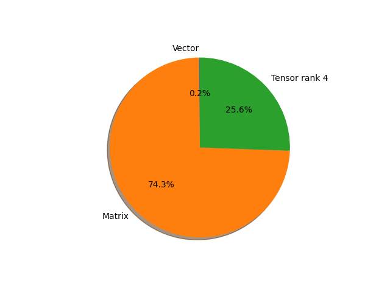

# googlenet parameter information

**Number of layers: [ 187 ]**

**Number of parameters: [ 13.00M ]**

**Proportional of each form** (%)

| Vector | Matrix | Tensor rank 4 | 
|  --- | --- | --- |
| 65.78 | 23.53 | 10.70 | 

**Proportional of parameters by form** (%)

| Vector | Matrix | Tensor rank 4 | 
|  --- | --- | --- |
| 0.15 | 74.28 | 25.57 | 

**Layer information**

| Name | Shape | Squeezed shape | Number of parameters | Form |
| --- | --- | --- | --- | --- |
| conv1.conv.weight | (64, 3, 7, 7) | (64, 3, 7, 7) | 9408 | Tensor rank 4 |
| conv1.bn.weight | (64,) | (64,) | 64 | Vector |
| conv1.bn.bias | (64,) | (64,) | 64 | Vector |
| conv2.conv.weight | (64, 64, 1, 1) | (64, 64) | 4096 | Matrix |
| conv2.bn.weight | (64,) | (64,) | 64 | Vector |
| conv2.bn.bias | (64,) | (64,) | 64 | Vector |
| conv3.conv.weight | (192, 64, 3, 3) | (192, 64, 3, 3) | 110592 | Tensor rank 4 |
| conv3.bn.weight | (192,) | (192,) | 192 | Vector |
| conv3.bn.bias | (192,) | (192,) | 192 | Vector |
| inception3a.branch1.conv.weight | (64, 192, 1, 1) | (64, 192) | 12288 | Matrix |
| inception3a.branch1.bn.weight | (64,) | (64,) | 64 | Vector |
| inception3a.branch1.bn.bias | (64,) | (64,) | 64 | Vector |
| inception3a.branch2.0.conv.weight | (96, 192, 1, 1) | (96, 192) | 18432 | Matrix |
| inception3a.branch2.0.bn.weight | (96,) | (96,) | 96 | Vector |
| inception3a.branch2.0.bn.bias | (96,) | (96,) | 96 | Vector |
| inception3a.branch2.1.conv.weight | (128, 96, 3, 3) | (128, 96, 3, 3) | 110592 | Tensor rank 4 |
| inception3a.branch2.1.bn.weight | (128,) | (128,) | 128 | Vector |
| inception3a.branch2.1.bn.bias | (128,) | (128,) | 128 | Vector |
| inception3a.branch3.0.conv.weight | (16, 192, 1, 1) | (16, 192) | 3072 | Matrix |
| inception3a.branch3.0.bn.weight | (16,) | (16,) | 16 | Vector |
| inception3a.branch3.0.bn.bias | (16,) | (16,) | 16 | Vector |
| inception3a.branch3.1.conv.weight | (32, 16, 3, 3) | (32, 16, 3, 3) | 4608 | Tensor rank 4 |
| inception3a.branch3.1.bn.weight | (32,) | (32,) | 32 | Vector |
| inception3a.branch3.1.bn.bias | (32,) | (32,) | 32 | Vector |
| inception3a.branch4.1.conv.weight | (32, 192, 1, 1) | (32, 192) | 6144 | Matrix |
| inception3a.branch4.1.bn.weight | (32,) | (32,) | 32 | Vector |
| inception3a.branch4.1.bn.bias | (32,) | (32,) | 32 | Vector |
| inception3b.branch1.conv.weight | (128, 256, 1, 1) | (128, 256) | 32768 | Matrix |
| inception3b.branch1.bn.weight | (128,) | (128,) | 128 | Vector |
| inception3b.branch1.bn.bias | (128,) | (128,) | 128 | Vector |
| inception3b.branch2.0.conv.weight | (128, 256, 1, 1) | (128, 256) | 32768 | Matrix |
| inception3b.branch2.0.bn.weight | (128,) | (128,) | 128 | Vector |
| inception3b.branch2.0.bn.bias | (128,) | (128,) | 128 | Vector |
| inception3b.branch2.1.conv.weight | (192, 128, 3, 3) | (192, 128, 3, 3) | 221184 | Tensor rank 4 |
| inception3b.branch2.1.bn.weight | (192,) | (192,) | 192 | Vector |
| inception3b.branch2.1.bn.bias | (192,) | (192,) | 192 | Vector |
| inception3b.branch3.0.conv.weight | (32, 256, 1, 1) | (32, 256) | 8192 | Matrix |
| inception3b.branch3.0.bn.weight | (32,) | (32,) | 32 | Vector |
| inception3b.branch3.0.bn.bias | (32,) | (32,) | 32 | Vector |
| inception3b.branch3.1.conv.weight | (96, 32, 3, 3) | (96, 32, 3, 3) | 27648 | Tensor rank 4 |
| inception3b.branch3.1.bn.weight | (96,) | (96,) | 96 | Vector |
| inception3b.branch3.1.bn.bias | (96,) | (96,) | 96 | Vector |
| inception3b.branch4.1.conv.weight | (64, 256, 1, 1) | (64, 256) | 16384 | Matrix |
| inception3b.branch4.1.bn.weight | (64,) | (64,) | 64 | Vector |
| inception3b.branch4.1.bn.bias | (64,) | (64,) | 64 | Vector |
| inception4a.branch1.conv.weight | (192, 480, 1, 1) | (192, 480) | 92160 | Matrix |
| inception4a.branch1.bn.weight | (192,) | (192,) | 192 | Vector |
| inception4a.branch1.bn.bias | (192,) | (192,) | 192 | Vector |
| inception4a.branch2.0.conv.weight | (96, 480, 1, 1) | (96, 480) | 46080 | Matrix |
| inception4a.branch2.0.bn.weight | (96,) | (96,) | 96 | Vector |
| inception4a.branch2.0.bn.bias | (96,) | (96,) | 96 | Vector |
| inception4a.branch2.1.conv.weight | (208, 96, 3, 3) | (208, 96, 3, 3) | 179712 | Tensor rank 4 |
| inception4a.branch2.1.bn.weight | (208,) | (208,) | 208 | Vector |
| inception4a.branch2.1.bn.bias | (208,) | (208,) | 208 | Vector |
| inception4a.branch3.0.conv.weight | (16, 480, 1, 1) | (16, 480) | 7680 | Matrix |
| inception4a.branch3.0.bn.weight | (16,) | (16,) | 16 | Vector |
| inception4a.branch3.0.bn.bias | (16,) | (16,) | 16 | Vector |
| inception4a.branch3.1.conv.weight | (48, 16, 3, 3) | (48, 16, 3, 3) | 6912 | Tensor rank 4 |
| inception4a.branch3.1.bn.weight | (48,) | (48,) | 48 | Vector |
| inception4a.branch3.1.bn.bias | (48,) | (48,) | 48 | Vector |
| inception4a.branch4.1.conv.weight | (64, 480, 1, 1) | (64, 480) | 30720 | Matrix |
| inception4a.branch4.1.bn.weight | (64,) | (64,) | 64 | Vector |
| inception4a.branch4.1.bn.bias | (64,) | (64,) | 64 | Vector |
| inception4b.branch1.conv.weight | (160, 512, 1, 1) | (160, 512) | 81920 | Matrix |
| inception4b.branch1.bn.weight | (160,) | (160,) | 160 | Vector |
| inception4b.branch1.bn.bias | (160,) | (160,) | 160 | Vector |
| inception4b.branch2.0.conv.weight | (112, 512, 1, 1) | (112, 512) | 57344 | Matrix |
| inception4b.branch2.0.bn.weight | (112,) | (112,) | 112 | Vector |
| inception4b.branch2.0.bn.bias | (112,) | (112,) | 112 | Vector |
| inception4b.branch2.1.conv.weight | (224, 112, 3, 3) | (224, 112, 3, 3) | 225792 | Tensor rank 4 |
| inception4b.branch2.1.bn.weight | (224,) | (224,) | 224 | Vector |
| inception4b.branch2.1.bn.bias | (224,) | (224,) | 224 | Vector |
| inception4b.branch3.0.conv.weight | (24, 512, 1, 1) | (24, 512) | 12288 | Matrix |
| inception4b.branch3.0.bn.weight | (24,) | (24,) | 24 | Vector |
| inception4b.branch3.0.bn.bias | (24,) | (24,) | 24 | Vector |
| inception4b.branch3.1.conv.weight | (64, 24, 3, 3) | (64, 24, 3, 3) | 13824 | Tensor rank 4 |
| inception4b.branch3.1.bn.weight | (64,) | (64,) | 64 | Vector |
| inception4b.branch3.1.bn.bias | (64,) | (64,) | 64 | Vector |
| inception4b.branch4.1.conv.weight | (64, 512, 1, 1) | (64, 512) | 32768 | Matrix |
| inception4b.branch4.1.bn.weight | (64,) | (64,) | 64 | Vector |
| inception4b.branch4.1.bn.bias | (64,) | (64,) | 64 | Vector |
| inception4c.branch1.conv.weight | (128, 512, 1, 1) | (128, 512) | 65536 | Matrix |
| inception4c.branch1.bn.weight | (128,) | (128,) | 128 | Vector |
| inception4c.branch1.bn.bias | (128,) | (128,) | 128 | Vector |
| inception4c.branch2.0.conv.weight | (128, 512, 1, 1) | (128, 512) | 65536 | Matrix |
| inception4c.branch2.0.bn.weight | (128,) | (128,) | 128 | Vector |
| inception4c.branch2.0.bn.bias | (128,) | (128,) | 128 | Vector |
| inception4c.branch2.1.conv.weight | (256, 128, 3, 3) | (256, 128, 3, 3) | 294912 | Tensor rank 4 |
| inception4c.branch2.1.bn.weight | (256,) | (256,) | 256 | Vector |
| inception4c.branch2.1.bn.bias | (256,) | (256,) | 256 | Vector |
| inception4c.branch3.0.conv.weight | (24, 512, 1, 1) | (24, 512) | 12288 | Matrix |
| inception4c.branch3.0.bn.weight | (24,) | (24,) | 24 | Vector |
| inception4c.branch3.0.bn.bias | (24,) | (24,) | 24 | Vector |
| inception4c.branch3.1.conv.weight | (64, 24, 3, 3) | (64, 24, 3, 3) | 13824 | Tensor rank 4 |
| inception4c.branch3.1.bn.weight | (64,) | (64,) | 64 | Vector |
| inception4c.branch3.1.bn.bias | (64,) | (64,) | 64 | Vector |
| inception4c.branch4.1.conv.weight | (64, 512, 1, 1) | (64, 512) | 32768 | Matrix |
| inception4c.branch4.1.bn.weight | (64,) | (64,) | 64 | Vector |
| inception4c.branch4.1.bn.bias | (64,) | (64,) | 64 | Vector |
| inception4d.branch1.conv.weight | (112, 512, 1, 1) | (112, 512) | 57344 | Matrix |
| inception4d.branch1.bn.weight | (112,) | (112,) | 112 | Vector |
| inception4d.branch1.bn.bias | (112,) | (112,) | 112 | Vector |
| inception4d.branch2.0.conv.weight | (144, 512, 1, 1) | (144, 512) | 73728 | Matrix |
| inception4d.branch2.0.bn.weight | (144,) | (144,) | 144 | Vector |
| inception4d.branch2.0.bn.bias | (144,) | (144,) | 144 | Vector |
| inception4d.branch2.1.conv.weight | (288, 144, 3, 3) | (288, 144, 3, 3) | 373248 | Tensor rank 4 |
| inception4d.branch2.1.bn.weight | (288,) | (288,) | 288 | Vector |
| inception4d.branch2.1.bn.bias | (288,) | (288,) | 288 | Vector |
| inception4d.branch3.0.conv.weight | (32, 512, 1, 1) | (32, 512) | 16384 | Matrix |
| inception4d.branch3.0.bn.weight | (32,) | (32,) | 32 | Vector |
| inception4d.branch3.0.bn.bias | (32,) | (32,) | 32 | Vector |
| inception4d.branch3.1.conv.weight | (64, 32, 3, 3) | (64, 32, 3, 3) | 18432 | Tensor rank 4 |
| inception4d.branch3.1.bn.weight | (64,) | (64,) | 64 | Vector |
| inception4d.branch3.1.bn.bias | (64,) | (64,) | 64 | Vector |
| inception4d.branch4.1.conv.weight | (64, 512, 1, 1) | (64, 512) | 32768 | Matrix |
| inception4d.branch4.1.bn.weight | (64,) | (64,) | 64 | Vector |
| inception4d.branch4.1.bn.bias | (64,) | (64,) | 64 | Vector |
| inception4e.branch1.conv.weight | (256, 528, 1, 1) | (256, 528) | 135168 | Matrix |
| inception4e.branch1.bn.weight | (256,) | (256,) | 256 | Vector |
| inception4e.branch1.bn.bias | (256,) | (256,) | 256 | Vector |
| inception4e.branch2.0.conv.weight | (160, 528, 1, 1) | (160, 528) | 84480 | Matrix |
| inception4e.branch2.0.bn.weight | (160,) | (160,) | 160 | Vector |
| inception4e.branch2.0.bn.bias | (160,) | (160,) | 160 | Vector |
| inception4e.branch2.1.conv.weight | (320, 160, 3, 3) | (320, 160, 3, 3) | 460800 | Tensor rank 4 |
| inception4e.branch2.1.bn.weight | (320,) | (320,) | 320 | Vector |
| inception4e.branch2.1.bn.bias | (320,) | (320,) | 320 | Vector |
| inception4e.branch3.0.conv.weight | (32, 528, 1, 1) | (32, 528) | 16896 | Matrix |
| inception4e.branch3.0.bn.weight | (32,) | (32,) | 32 | Vector |
| inception4e.branch3.0.bn.bias | (32,) | (32,) | 32 | Vector |
| inception4e.branch3.1.conv.weight | (128, 32, 3, 3) | (128, 32, 3, 3) | 36864 | Tensor rank 4 |
| inception4e.branch3.1.bn.weight | (128,) | (128,) | 128 | Vector |
| inception4e.branch3.1.bn.bias | (128,) | (128,) | 128 | Vector |
| inception4e.branch4.1.conv.weight | (128, 528, 1, 1) | (128, 528) | 67584 | Matrix |
| inception4e.branch4.1.bn.weight | (128,) | (128,) | 128 | Vector |
| inception4e.branch4.1.bn.bias | (128,) | (128,) | 128 | Vector |
| inception5a.branch1.conv.weight | (256, 832, 1, 1) | (256, 832) | 212992 | Matrix |
| inception5a.branch1.bn.weight | (256,) | (256,) | 256 | Vector |
| inception5a.branch1.bn.bias | (256,) | (256,) | 256 | Vector |
| inception5a.branch2.0.conv.weight | (160, 832, 1, 1) | (160, 832) | 133120 | Matrix |
| inception5a.branch2.0.bn.weight | (160,) | (160,) | 160 | Vector |
| inception5a.branch2.0.bn.bias | (160,) | (160,) | 160 | Vector |
| inception5a.branch2.1.conv.weight | (320, 160, 3, 3) | (320, 160, 3, 3) | 460800 | Tensor rank 4 |
| inception5a.branch2.1.bn.weight | (320,) | (320,) | 320 | Vector |
| inception5a.branch2.1.bn.bias | (320,) | (320,) | 320 | Vector |
| inception5a.branch3.0.conv.weight | (32, 832, 1, 1) | (32, 832) | 26624 | Matrix |
| inception5a.branch3.0.bn.weight | (32,) | (32,) | 32 | Vector |
| inception5a.branch3.0.bn.bias | (32,) | (32,) | 32 | Vector |
| inception5a.branch3.1.conv.weight | (128, 32, 3, 3) | (128, 32, 3, 3) | 36864 | Tensor rank 4 |
| inception5a.branch3.1.bn.weight | (128,) | (128,) | 128 | Vector |
| inception5a.branch3.1.bn.bias | (128,) | (128,) | 128 | Vector |
| inception5a.branch4.1.conv.weight | (128, 832, 1, 1) | (128, 832) | 106496 | Matrix |
| inception5a.branch4.1.bn.weight | (128,) | (128,) | 128 | Vector |
| inception5a.branch4.1.bn.bias | (128,) | (128,) | 128 | Vector |
| inception5b.branch1.conv.weight | (384, 832, 1, 1) | (384, 832) | 319488 | Matrix |
| inception5b.branch1.bn.weight | (384,) | (384,) | 384 | Vector |
| inception5b.branch1.bn.bias | (384,) | (384,) | 384 | Vector |
| inception5b.branch2.0.conv.weight | (192, 832, 1, 1) | (192, 832) | 159744 | Matrix |
| inception5b.branch2.0.bn.weight | (192,) | (192,) | 192 | Vector |
| inception5b.branch2.0.bn.bias | (192,) | (192,) | 192 | Vector |
| inception5b.branch2.1.conv.weight | (384, 192, 3, 3) | (384, 192, 3, 3) | 663552 | Tensor rank 4 |
| inception5b.branch2.1.bn.weight | (384,) | (384,) | 384 | Vector |
| inception5b.branch2.1.bn.bias | (384,) | (384,) | 384 | Vector |
| inception5b.branch3.0.conv.weight | (48, 832, 1, 1) | (48, 832) | 39936 | Matrix |
| inception5b.branch3.0.bn.weight | (48,) | (48,) | 48 | Vector |
| inception5b.branch3.0.bn.bias | (48,) | (48,) | 48 | Vector |
| inception5b.branch3.1.conv.weight | (128, 48, 3, 3) | (128, 48, 3, 3) | 55296 | Tensor rank 4 |
| inception5b.branch3.1.bn.weight | (128,) | (128,) | 128 | Vector |
| inception5b.branch3.1.bn.bias | (128,) | (128,) | 128 | Vector |
| inception5b.branch4.1.conv.weight | (128, 832, 1, 1) | (128, 832) | 106496 | Matrix |
| inception5b.branch4.1.bn.weight | (128,) | (128,) | 128 | Vector |
| inception5b.branch4.1.bn.bias | (128,) | (128,) | 128 | Vector |
| aux1.conv.conv.weight | (128, 512, 1, 1) | (128, 512) | 65536 | Matrix |
| aux1.conv.bn.weight | (128,) | (128,) | 128 | Vector |
| aux1.conv.bn.bias | (128,) | (128,) | 128 | Vector |
| aux1.fc1.weight | (1024, 2048) | (1024, 2048) | 2097152 | Matrix |
| aux1.fc1.bias | (1024,) | (1024,) | 1024 | Vector |
| aux1.fc2.weight | (1000, 1024) | (1000, 1024) | 1024000 | Matrix |
| aux1.fc2.bias | (1000,) | (1000,) | 1000 | Vector |
| aux2.conv.conv.weight | (128, 528, 1, 1) | (128, 528) | 67584 | Matrix |
| aux2.conv.bn.weight | (128,) | (128,) | 128 | Vector |
| aux2.conv.bn.bias | (128,) | (128,) | 128 | Vector |
| aux2.fc1.weight | (1024, 2048) | (1024, 2048) | 2097152 | Matrix |
| aux2.fc1.bias | (1024,) | (1024,) | 1024 | Vector |
| aux2.fc2.weight | (1000, 1024) | (1000, 1024) | 1024000 | Matrix |
| aux2.fc2.bias | (1000,) | (1000,) | 1000 | Vector |
| fc.weight | (1000, 1024) | (1000, 1024) | 1024000 | Matrix |
| fc.bias | (1000,) | (1000,) | 1000 | Vector |

