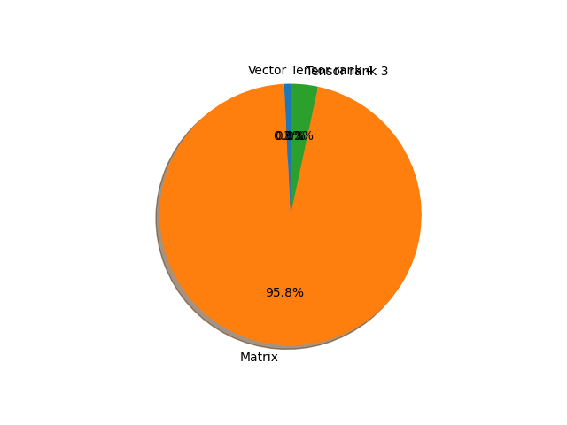

# mnasnet1_3 parameter information

**Number of layers: [ 158 ]**

**Number of parameters: [ 6.28M ]**

**Proportional of each form** (%)

| Vector | Matrix | Tensor rank 3 | Tensor rank 4 | 
|  --- | --- | --- | --- |
| 66.46 | 22.15 | 10.76 | 0.63 | 

**Proportional of parameters by form** (%)

| Vector | Matrix | Tensor rank 3 | Tensor rank 4 | 
|  --- | --- | --- | --- |
| 0.79 | 95.85 | 3.34 | 0.02 | 

**Layer information**

| Name | Shape | Squeezed shape | Number of parameters | Form |
| --- | --- | --- | --- | --- |
| layers.0.weight | (40, 3, 3, 3) | (40, 3, 3, 3) | 1080 | Tensor rank 4 |
| layers.1.weight | (40,) | (40,) | 40 | Vector |
| layers.1.bias | (40,) | (40,) | 40 | Vector |
| layers.3.weight | (40, 1, 3, 3) | (40, 3, 3) | 360 | Tensor rank 3 |
| layers.4.weight | (40,) | (40,) | 40 | Vector |
| layers.4.bias | (40,) | (40,) | 40 | Vector |
| layers.6.weight | (24, 40, 1, 1) | (24, 40) | 960 | Matrix |
| layers.7.weight | (24,) | (24,) | 24 | Vector |
| layers.7.bias | (24,) | (24,) | 24 | Vector |
| layers.8.0.layers.0.weight | (72, 24, 1, 1) | (72, 24) | 1728 | Matrix |
| layers.8.0.layers.1.weight | (72,) | (72,) | 72 | Vector |
| layers.8.0.layers.1.bias | (72,) | (72,) | 72 | Vector |
| layers.8.0.layers.3.weight | (72, 1, 3, 3) | (72, 3, 3) | 648 | Tensor rank 3 |
| layers.8.0.layers.4.weight | (72,) | (72,) | 72 | Vector |
| layers.8.0.layers.4.bias | (72,) | (72,) | 72 | Vector |
| layers.8.0.layers.6.weight | (32, 72, 1, 1) | (32, 72) | 2304 | Matrix |
| layers.8.0.layers.7.weight | (32,) | (32,) | 32 | Vector |
| layers.8.0.layers.7.bias | (32,) | (32,) | 32 | Vector |
| layers.8.1.layers.0.weight | (96, 32, 1, 1) | (96, 32) | 3072 | Matrix |
| layers.8.1.layers.1.weight | (96,) | (96,) | 96 | Vector |
| layers.8.1.layers.1.bias | (96,) | (96,) | 96 | Vector |
| layers.8.1.layers.3.weight | (96, 1, 3, 3) | (96, 3, 3) | 864 | Tensor rank 3 |
| layers.8.1.layers.4.weight | (96,) | (96,) | 96 | Vector |
| layers.8.1.layers.4.bias | (96,) | (96,) | 96 | Vector |
| layers.8.1.layers.6.weight | (32, 96, 1, 1) | (32, 96) | 3072 | Matrix |
| layers.8.1.layers.7.weight | (32,) | (32,) | 32 | Vector |
| layers.8.1.layers.7.bias | (32,) | (32,) | 32 | Vector |
| layers.8.2.layers.0.weight | (96, 32, 1, 1) | (96, 32) | 3072 | Matrix |
| layers.8.2.layers.1.weight | (96,) | (96,) | 96 | Vector |
| layers.8.2.layers.1.bias | (96,) | (96,) | 96 | Vector |
| layers.8.2.layers.3.weight | (96, 1, 3, 3) | (96, 3, 3) | 864 | Tensor rank 3 |
| layers.8.2.layers.4.weight | (96,) | (96,) | 96 | Vector |
| layers.8.2.layers.4.bias | (96,) | (96,) | 96 | Vector |
| layers.8.2.layers.6.weight | (32, 96, 1, 1) | (32, 96) | 3072 | Matrix |
| layers.8.2.layers.7.weight | (32,) | (32,) | 32 | Vector |
| layers.8.2.layers.7.bias | (32,) | (32,) | 32 | Vector |
| layers.9.0.layers.0.weight | (96, 32, 1, 1) | (96, 32) | 3072 | Matrix |
| layers.9.0.layers.1.weight | (96,) | (96,) | 96 | Vector |
| layers.9.0.layers.1.bias | (96,) | (96,) | 96 | Vector |
| layers.9.0.layers.3.weight | (96, 1, 5, 5) | (96, 5, 5) | 2400 | Tensor rank 3 |
| layers.9.0.layers.4.weight | (96,) | (96,) | 96 | Vector |
| layers.9.0.layers.4.bias | (96,) | (96,) | 96 | Vector |
| layers.9.0.layers.6.weight | (56, 96, 1, 1) | (56, 96) | 5376 | Matrix |
| layers.9.0.layers.7.weight | (56,) | (56,) | 56 | Vector |
| layers.9.0.layers.7.bias | (56,) | (56,) | 56 | Vector |
| layers.9.1.layers.0.weight | (168, 56, 1, 1) | (168, 56) | 9408 | Matrix |
| layers.9.1.layers.1.weight | (168,) | (168,) | 168 | Vector |
| layers.9.1.layers.1.bias | (168,) | (168,) | 168 | Vector |
| layers.9.1.layers.3.weight | (168, 1, 5, 5) | (168, 5, 5) | 4200 | Tensor rank 3 |
| layers.9.1.layers.4.weight | (168,) | (168,) | 168 | Vector |
| layers.9.1.layers.4.bias | (168,) | (168,) | 168 | Vector |
| layers.9.1.layers.6.weight | (56, 168, 1, 1) | (56, 168) | 9408 | Matrix |
| layers.9.1.layers.7.weight | (56,) | (56,) | 56 | Vector |
| layers.9.1.layers.7.bias | (56,) | (56,) | 56 | Vector |
| layers.9.2.layers.0.weight | (168, 56, 1, 1) | (168, 56) | 9408 | Matrix |
| layers.9.2.layers.1.weight | (168,) | (168,) | 168 | Vector |
| layers.9.2.layers.1.bias | (168,) | (168,) | 168 | Vector |
| layers.9.2.layers.3.weight | (168, 1, 5, 5) | (168, 5, 5) | 4200 | Tensor rank 3 |
| layers.9.2.layers.4.weight | (168,) | (168,) | 168 | Vector |
| layers.9.2.layers.4.bias | (168,) | (168,) | 168 | Vector |
| layers.9.2.layers.6.weight | (56, 168, 1, 1) | (56, 168) | 9408 | Matrix |
| layers.9.2.layers.7.weight | (56,) | (56,) | 56 | Vector |
| layers.9.2.layers.7.bias | (56,) | (56,) | 56 | Vector |
| layers.10.0.layers.0.weight | (336, 56, 1, 1) | (336, 56) | 18816 | Matrix |
| layers.10.0.layers.1.weight | (336,) | (336,) | 336 | Vector |
| layers.10.0.layers.1.bias | (336,) | (336,) | 336 | Vector |
| layers.10.0.layers.3.weight | (336, 1, 5, 5) | (336, 5, 5) | 8400 | Tensor rank 3 |
| layers.10.0.layers.4.weight | (336,) | (336,) | 336 | Vector |
| layers.10.0.layers.4.bias | (336,) | (336,) | 336 | Vector |
| layers.10.0.layers.6.weight | (104, 336, 1, 1) | (104, 336) | 34944 | Matrix |
| layers.10.0.layers.7.weight | (104,) | (104,) | 104 | Vector |
| layers.10.0.layers.7.bias | (104,) | (104,) | 104 | Vector |
| layers.10.1.layers.0.weight | (624, 104, 1, 1) | (624, 104) | 64896 | Matrix |
| layers.10.1.layers.1.weight | (624,) | (624,) | 624 | Vector |
| layers.10.1.layers.1.bias | (624,) | (624,) | 624 | Vector |
| layers.10.1.layers.3.weight | (624, 1, 5, 5) | (624, 5, 5) | 15600 | Tensor rank 3 |
| layers.10.1.layers.4.weight | (624,) | (624,) | 624 | Vector |
| layers.10.1.layers.4.bias | (624,) | (624,) | 624 | Vector |
| layers.10.1.layers.6.weight | (104, 624, 1, 1) | (104, 624) | 64896 | Matrix |
| layers.10.1.layers.7.weight | (104,) | (104,) | 104 | Vector |
| layers.10.1.layers.7.bias | (104,) | (104,) | 104 | Vector |
| layers.10.2.layers.0.weight | (624, 104, 1, 1) | (624, 104) | 64896 | Matrix |
| layers.10.2.layers.1.weight | (624,) | (624,) | 624 | Vector |
| layers.10.2.layers.1.bias | (624,) | (624,) | 624 | Vector |
| layers.10.2.layers.3.weight | (624, 1, 5, 5) | (624, 5, 5) | 15600 | Tensor rank 3 |
| layers.10.2.layers.4.weight | (624,) | (624,) | 624 | Vector |
| layers.10.2.layers.4.bias | (624,) | (624,) | 624 | Vector |
| layers.10.2.layers.6.weight | (104, 624, 1, 1) | (104, 624) | 64896 | Matrix |
| layers.10.2.layers.7.weight | (104,) | (104,) | 104 | Vector |
| layers.10.2.layers.7.bias | (104,) | (104,) | 104 | Vector |
| layers.11.0.layers.0.weight | (624, 104, 1, 1) | (624, 104) | 64896 | Matrix |
| layers.11.0.layers.1.weight | (624,) | (624,) | 624 | Vector |
| layers.11.0.layers.1.bias | (624,) | (624,) | 624 | Vector |
| layers.11.0.layers.3.weight | (624, 1, 3, 3) | (624, 3, 3) | 5616 | Tensor rank 3 |
| layers.11.0.layers.4.weight | (624,) | (624,) | 624 | Vector |
| layers.11.0.layers.4.bias | (624,) | (624,) | 624 | Vector |
| layers.11.0.layers.6.weight | (128, 624, 1, 1) | (128, 624) | 79872 | Matrix |
| layers.11.0.layers.7.weight | (128,) | (128,) | 128 | Vector |
| layers.11.0.layers.7.bias | (128,) | (128,) | 128 | Vector |
| layers.11.1.layers.0.weight | (768, 128, 1, 1) | (768, 128) | 98304 | Matrix |
| layers.11.1.layers.1.weight | (768,) | (768,) | 768 | Vector |
| layers.11.1.layers.1.bias | (768,) | (768,) | 768 | Vector |
| layers.11.1.layers.3.weight | (768, 1, 3, 3) | (768, 3, 3) | 6912 | Tensor rank 3 |
| layers.11.1.layers.4.weight | (768,) | (768,) | 768 | Vector |
| layers.11.1.layers.4.bias | (768,) | (768,) | 768 | Vector |
| layers.11.1.layers.6.weight | (128, 768, 1, 1) | (128, 768) | 98304 | Matrix |
| layers.11.1.layers.7.weight | (128,) | (128,) | 128 | Vector |
| layers.11.1.layers.7.bias | (128,) | (128,) | 128 | Vector |
| layers.12.0.layers.0.weight | (768, 128, 1, 1) | (768, 128) | 98304 | Matrix |
| layers.12.0.layers.1.weight | (768,) | (768,) | 768 | Vector |
| layers.12.0.layers.1.bias | (768,) | (768,) | 768 | Vector |
| layers.12.0.layers.3.weight | (768, 1, 5, 5) | (768, 5, 5) | 19200 | Tensor rank 3 |
| layers.12.0.layers.4.weight | (768,) | (768,) | 768 | Vector |
| layers.12.0.layers.4.bias | (768,) | (768,) | 768 | Vector |
| layers.12.0.layers.6.weight | (248, 768, 1, 1) | (248, 768) | 190464 | Matrix |
| layers.12.0.layers.7.weight | (248,) | (248,) | 248 | Vector |
| layers.12.0.layers.7.bias | (248,) | (248,) | 248 | Vector |
| layers.12.1.layers.0.weight | (1488, 248, 1, 1) | (1488, 248) | 369024 | Matrix |
| layers.12.1.layers.1.weight | (1488,) | (1488,) | 1488 | Vector |
| layers.12.1.layers.1.bias | (1488,) | (1488,) | 1488 | Vector |
| layers.12.1.layers.3.weight | (1488, 1, 5, 5) | (1488, 5, 5) | 37200 | Tensor rank 3 |
| layers.12.1.layers.4.weight | (1488,) | (1488,) | 1488 | Vector |
| layers.12.1.layers.4.bias | (1488,) | (1488,) | 1488 | Vector |
| layers.12.1.layers.6.weight | (248, 1488, 1, 1) | (248, 1488) | 369024 | Matrix |
| layers.12.1.layers.7.weight | (248,) | (248,) | 248 | Vector |
| layers.12.1.layers.7.bias | (248,) | (248,) | 248 | Vector |
| layers.12.2.layers.0.weight | (1488, 248, 1, 1) | (1488, 248) | 369024 | Matrix |
| layers.12.2.layers.1.weight | (1488,) | (1488,) | 1488 | Vector |
| layers.12.2.layers.1.bias | (1488,) | (1488,) | 1488 | Vector |
| layers.12.2.layers.3.weight | (1488, 1, 5, 5) | (1488, 5, 5) | 37200 | Tensor rank 3 |
| layers.12.2.layers.4.weight | (1488,) | (1488,) | 1488 | Vector |
| layers.12.2.layers.4.bias | (1488,) | (1488,) | 1488 | Vector |
| layers.12.2.layers.6.weight | (248, 1488, 1, 1) | (248, 1488) | 369024 | Matrix |
| layers.12.2.layers.7.weight | (248,) | (248,) | 248 | Vector |
| layers.12.2.layers.7.bias | (248,) | (248,) | 248 | Vector |
| layers.12.3.layers.0.weight | (1488, 248, 1, 1) | (1488, 248) | 369024 | Matrix |
| layers.12.3.layers.1.weight | (1488,) | (1488,) | 1488 | Vector |
| layers.12.3.layers.1.bias | (1488,) | (1488,) | 1488 | Vector |
| layers.12.3.layers.3.weight | (1488, 1, 5, 5) | (1488, 5, 5) | 37200 | Tensor rank 3 |
| layers.12.3.layers.4.weight | (1488,) | (1488,) | 1488 | Vector |
| layers.12.3.layers.4.bias | (1488,) | (1488,) | 1488 | Vector |
| layers.12.3.layers.6.weight | (248, 1488, 1, 1) | (248, 1488) | 369024 | Matrix |
| layers.12.3.layers.7.weight | (248,) | (248,) | 248 | Vector |
| layers.12.3.layers.7.bias | (248,) | (248,) | 248 | Vector |
| layers.13.0.layers.0.weight | (1488, 248, 1, 1) | (1488, 248) | 369024 | Matrix |
| layers.13.0.layers.1.weight | (1488,) | (1488,) | 1488 | Vector |
| layers.13.0.layers.1.bias | (1488,) | (1488,) | 1488 | Vector |
| layers.13.0.layers.3.weight | (1488, 1, 3, 3) | (1488, 3, 3) | 13392 | Tensor rank 3 |
| layers.13.0.layers.4.weight | (1488,) | (1488,) | 1488 | Vector |
| layers.13.0.layers.4.bias | (1488,) | (1488,) | 1488 | Vector |
| layers.13.0.layers.6.weight | (416, 1488, 1, 1) | (416, 1488) | 619008 | Matrix |
| layers.13.0.layers.7.weight | (416,) | (416,) | 416 | Vector |
| layers.13.0.layers.7.bias | (416,) | (416,) | 416 | Vector |
| layers.14.weight | (1280, 416, 1, 1) | (1280, 416) | 532480 | Matrix |
| layers.15.weight | (1280,) | (1280,) | 1280 | Vector |
| layers.15.bias | (1280,) | (1280,) | 1280 | Vector |
| classifier.1.weight | (1000, 1280) | (1000, 1280) | 1280000 | Matrix |
| classifier.1.bias | (1000,) | (1000,) | 1000 | Vector |

