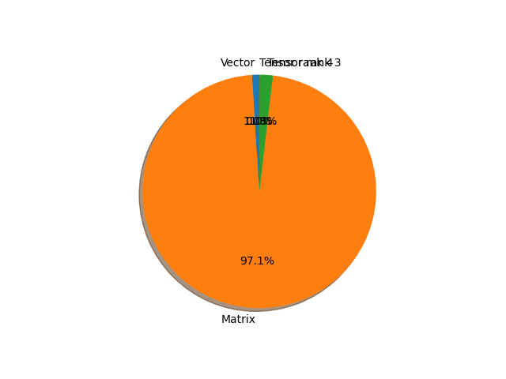

# mobilenet_v2 parameter information

**Number of layers: [ 158 ]**

**Number of parameters: [ 3.50M ]**

**Proportional of each form** (%)

| Vector | Matrix | Tensor rank 3 | Tensor rank 4 | 
|  --- | --- | --- | --- |
| 66.46 | 22.15 | 10.76 | 0.63 | 

**Proportional of parameters by form** (%)

| Vector | Matrix | Tensor rank 3 | Tensor rank 4 | 
|  --- | --- | --- | --- |
| 1.00 | 97.14 | 1.83 | 0.02 | 

**Layer information**

| Name | Shape | Squeezed shape | Number of parameters | Form |
| --- | --- | --- | --- | --- |
| features.0.0.weight | (32, 3, 3, 3) | (32, 3, 3, 3) | 864 | Tensor rank 4 |
| features.0.1.weight | (32,) | (32,) | 32 | Vector |
| features.0.1.bias | (32,) | (32,) | 32 | Vector |
| features.1.conv.0.0.weight | (32, 1, 3, 3) | (32, 3, 3) | 288 | Tensor rank 3 |
| features.1.conv.0.1.weight | (32,) | (32,) | 32 | Vector |
| features.1.conv.0.1.bias | (32,) | (32,) | 32 | Vector |
| features.1.conv.1.weight | (16, 32, 1, 1) | (16, 32) | 512 | Matrix |
| features.1.conv.2.weight | (16,) | (16,) | 16 | Vector |
| features.1.conv.2.bias | (16,) | (16,) | 16 | Vector |
| features.2.conv.0.0.weight | (96, 16, 1, 1) | (96, 16) | 1536 | Matrix |
| features.2.conv.0.1.weight | (96,) | (96,) | 96 | Vector |
| features.2.conv.0.1.bias | (96,) | (96,) | 96 | Vector |
| features.2.conv.1.0.weight | (96, 1, 3, 3) | (96, 3, 3) | 864 | Tensor rank 3 |
| features.2.conv.1.1.weight | (96,) | (96,) | 96 | Vector |
| features.2.conv.1.1.bias | (96,) | (96,) | 96 | Vector |
| features.2.conv.2.weight | (24, 96, 1, 1) | (24, 96) | 2304 | Matrix |
| features.2.conv.3.weight | (24,) | (24,) | 24 | Vector |
| features.2.conv.3.bias | (24,) | (24,) | 24 | Vector |
| features.3.conv.0.0.weight | (144, 24, 1, 1) | (144, 24) | 3456 | Matrix |
| features.3.conv.0.1.weight | (144,) | (144,) | 144 | Vector |
| features.3.conv.0.1.bias | (144,) | (144,) | 144 | Vector |
| features.3.conv.1.0.weight | (144, 1, 3, 3) | (144, 3, 3) | 1296 | Tensor rank 3 |
| features.3.conv.1.1.weight | (144,) | (144,) | 144 | Vector |
| features.3.conv.1.1.bias | (144,) | (144,) | 144 | Vector |
| features.3.conv.2.weight | (24, 144, 1, 1) | (24, 144) | 3456 | Matrix |
| features.3.conv.3.weight | (24,) | (24,) | 24 | Vector |
| features.3.conv.3.bias | (24,) | (24,) | 24 | Vector |
| features.4.conv.0.0.weight | (144, 24, 1, 1) | (144, 24) | 3456 | Matrix |
| features.4.conv.0.1.weight | (144,) | (144,) | 144 | Vector |
| features.4.conv.0.1.bias | (144,) | (144,) | 144 | Vector |
| features.4.conv.1.0.weight | (144, 1, 3, 3) | (144, 3, 3) | 1296 | Tensor rank 3 |
| features.4.conv.1.1.weight | (144,) | (144,) | 144 | Vector |
| features.4.conv.1.1.bias | (144,) | (144,) | 144 | Vector |
| features.4.conv.2.weight | (32, 144, 1, 1) | (32, 144) | 4608 | Matrix |
| features.4.conv.3.weight | (32,) | (32,) | 32 | Vector |
| features.4.conv.3.bias | (32,) | (32,) | 32 | Vector |
| features.5.conv.0.0.weight | (192, 32, 1, 1) | (192, 32) | 6144 | Matrix |
| features.5.conv.0.1.weight | (192,) | (192,) | 192 | Vector |
| features.5.conv.0.1.bias | (192,) | (192,) | 192 | Vector |
| features.5.conv.1.0.weight | (192, 1, 3, 3) | (192, 3, 3) | 1728 | Tensor rank 3 |
| features.5.conv.1.1.weight | (192,) | (192,) | 192 | Vector |
| features.5.conv.1.1.bias | (192,) | (192,) | 192 | Vector |
| features.5.conv.2.weight | (32, 192, 1, 1) | (32, 192) | 6144 | Matrix |
| features.5.conv.3.weight | (32,) | (32,) | 32 | Vector |
| features.5.conv.3.bias | (32,) | (32,) | 32 | Vector |
| features.6.conv.0.0.weight | (192, 32, 1, 1) | (192, 32) | 6144 | Matrix |
| features.6.conv.0.1.weight | (192,) | (192,) | 192 | Vector |
| features.6.conv.0.1.bias | (192,) | (192,) | 192 | Vector |
| features.6.conv.1.0.weight | (192, 1, 3, 3) | (192, 3, 3) | 1728 | Tensor rank 3 |
| features.6.conv.1.1.weight | (192,) | (192,) | 192 | Vector |
| features.6.conv.1.1.bias | (192,) | (192,) | 192 | Vector |
| features.6.conv.2.weight | (32, 192, 1, 1) | (32, 192) | 6144 | Matrix |
| features.6.conv.3.weight | (32,) | (32,) | 32 | Vector |
| features.6.conv.3.bias | (32,) | (32,) | 32 | Vector |
| features.7.conv.0.0.weight | (192, 32, 1, 1) | (192, 32) | 6144 | Matrix |
| features.7.conv.0.1.weight | (192,) | (192,) | 192 | Vector |
| features.7.conv.0.1.bias | (192,) | (192,) | 192 | Vector |
| features.7.conv.1.0.weight | (192, 1, 3, 3) | (192, 3, 3) | 1728 | Tensor rank 3 |
| features.7.conv.1.1.weight | (192,) | (192,) | 192 | Vector |
| features.7.conv.1.1.bias | (192,) | (192,) | 192 | Vector |
| features.7.conv.2.weight | (64, 192, 1, 1) | (64, 192) | 12288 | Matrix |
| features.7.conv.3.weight | (64,) | (64,) | 64 | Vector |
| features.7.conv.3.bias | (64,) | (64,) | 64 | Vector |
| features.8.conv.0.0.weight | (384, 64, 1, 1) | (384, 64) | 24576 | Matrix |
| features.8.conv.0.1.weight | (384,) | (384,) | 384 | Vector |
| features.8.conv.0.1.bias | (384,) | (384,) | 384 | Vector |
| features.8.conv.1.0.weight | (384, 1, 3, 3) | (384, 3, 3) | 3456 | Tensor rank 3 |
| features.8.conv.1.1.weight | (384,) | (384,) | 384 | Vector |
| features.8.conv.1.1.bias | (384,) | (384,) | 384 | Vector |
| features.8.conv.2.weight | (64, 384, 1, 1) | (64, 384) | 24576 | Matrix |
| features.8.conv.3.weight | (64,) | (64,) | 64 | Vector |
| features.8.conv.3.bias | (64,) | (64,) | 64 | Vector |
| features.9.conv.0.0.weight | (384, 64, 1, 1) | (384, 64) | 24576 | Matrix |
| features.9.conv.0.1.weight | (384,) | (384,) | 384 | Vector |
| features.9.conv.0.1.bias | (384,) | (384,) | 384 | Vector |
| features.9.conv.1.0.weight | (384, 1, 3, 3) | (384, 3, 3) | 3456 | Tensor rank 3 |
| features.9.conv.1.1.weight | (384,) | (384,) | 384 | Vector |
| features.9.conv.1.1.bias | (384,) | (384,) | 384 | Vector |
| features.9.conv.2.weight | (64, 384, 1, 1) | (64, 384) | 24576 | Matrix |
| features.9.conv.3.weight | (64,) | (64,) | 64 | Vector |
| features.9.conv.3.bias | (64,) | (64,) | 64 | Vector |
| features.10.conv.0.0.weight | (384, 64, 1, 1) | (384, 64) | 24576 | Matrix |
| features.10.conv.0.1.weight | (384,) | (384,) | 384 | Vector |
| features.10.conv.0.1.bias | (384,) | (384,) | 384 | Vector |
| features.10.conv.1.0.weight | (384, 1, 3, 3) | (384, 3, 3) | 3456 | Tensor rank 3 |
| features.10.conv.1.1.weight | (384,) | (384,) | 384 | Vector |
| features.10.conv.1.1.bias | (384,) | (384,) | 384 | Vector |
| features.10.conv.2.weight | (64, 384, 1, 1) | (64, 384) | 24576 | Matrix |
| features.10.conv.3.weight | (64,) | (64,) | 64 | Vector |
| features.10.conv.3.bias | (64,) | (64,) | 64 | Vector |
| features.11.conv.0.0.weight | (384, 64, 1, 1) | (384, 64) | 24576 | Matrix |
| features.11.conv.0.1.weight | (384,) | (384,) | 384 | Vector |
| features.11.conv.0.1.bias | (384,) | (384,) | 384 | Vector |
| features.11.conv.1.0.weight | (384, 1, 3, 3) | (384, 3, 3) | 3456 | Tensor rank 3 |
| features.11.conv.1.1.weight | (384,) | (384,) | 384 | Vector |
| features.11.conv.1.1.bias | (384,) | (384,) | 384 | Vector |
| features.11.conv.2.weight | (96, 384, 1, 1) | (96, 384) | 36864 | Matrix |
| features.11.conv.3.weight | (96,) | (96,) | 96 | Vector |
| features.11.conv.3.bias | (96,) | (96,) | 96 | Vector |
| features.12.conv.0.0.weight | (576, 96, 1, 1) | (576, 96) | 55296 | Matrix |
| features.12.conv.0.1.weight | (576,) | (576,) | 576 | Vector |
| features.12.conv.0.1.bias | (576,) | (576,) | 576 | Vector |
| features.12.conv.1.0.weight | (576, 1, 3, 3) | (576, 3, 3) | 5184 | Tensor rank 3 |
| features.12.conv.1.1.weight | (576,) | (576,) | 576 | Vector |
| features.12.conv.1.1.bias | (576,) | (576,) | 576 | Vector |
| features.12.conv.2.weight | (96, 576, 1, 1) | (96, 576) | 55296 | Matrix |
| features.12.conv.3.weight | (96,) | (96,) | 96 | Vector |
| features.12.conv.3.bias | (96,) | (96,) | 96 | Vector |
| features.13.conv.0.0.weight | (576, 96, 1, 1) | (576, 96) | 55296 | Matrix |
| features.13.conv.0.1.weight | (576,) | (576,) | 576 | Vector |
| features.13.conv.0.1.bias | (576,) | (576,) | 576 | Vector |
| features.13.conv.1.0.weight | (576, 1, 3, 3) | (576, 3, 3) | 5184 | Tensor rank 3 |
| features.13.conv.1.1.weight | (576,) | (576,) | 576 | Vector |
| features.13.conv.1.1.bias | (576,) | (576,) | 576 | Vector |
| features.13.conv.2.weight | (96, 576, 1, 1) | (96, 576) | 55296 | Matrix |
| features.13.conv.3.weight | (96,) | (96,) | 96 | Vector |
| features.13.conv.3.bias | (96,) | (96,) | 96 | Vector |
| features.14.conv.0.0.weight | (576, 96, 1, 1) | (576, 96) | 55296 | Matrix |
| features.14.conv.0.1.weight | (576,) | (576,) | 576 | Vector |
| features.14.conv.0.1.bias | (576,) | (576,) | 576 | Vector |
| features.14.conv.1.0.weight | (576, 1, 3, 3) | (576, 3, 3) | 5184 | Tensor rank 3 |
| features.14.conv.1.1.weight | (576,) | (576,) | 576 | Vector |
| features.14.conv.1.1.bias | (576,) | (576,) | 576 | Vector |
| features.14.conv.2.weight | (160, 576, 1, 1) | (160, 576) | 92160 | Matrix |
| features.14.conv.3.weight | (160,) | (160,) | 160 | Vector |
| features.14.conv.3.bias | (160,) | (160,) | 160 | Vector |
| features.15.conv.0.0.weight | (960, 160, 1, 1) | (960, 160) | 153600 | Matrix |
| features.15.conv.0.1.weight | (960,) | (960,) | 960 | Vector |
| features.15.conv.0.1.bias | (960,) | (960,) | 960 | Vector |
| features.15.conv.1.0.weight | (960, 1, 3, 3) | (960, 3, 3) | 8640 | Tensor rank 3 |
| features.15.conv.1.1.weight | (960,) | (960,) | 960 | Vector |
| features.15.conv.1.1.bias | (960,) | (960,) | 960 | Vector |
| features.15.conv.2.weight | (160, 960, 1, 1) | (160, 960) | 153600 | Matrix |
| features.15.conv.3.weight | (160,) | (160,) | 160 | Vector |
| features.15.conv.3.bias | (160,) | (160,) | 160 | Vector |
| features.16.conv.0.0.weight | (960, 160, 1, 1) | (960, 160) | 153600 | Matrix |
| features.16.conv.0.1.weight | (960,) | (960,) | 960 | Vector |
| features.16.conv.0.1.bias | (960,) | (960,) | 960 | Vector |
| features.16.conv.1.0.weight | (960, 1, 3, 3) | (960, 3, 3) | 8640 | Tensor rank 3 |
| features.16.conv.1.1.weight | (960,) | (960,) | 960 | Vector |
| features.16.conv.1.1.bias | (960,) | (960,) | 960 | Vector |
| features.16.conv.2.weight | (160, 960, 1, 1) | (160, 960) | 153600 | Matrix |
| features.16.conv.3.weight | (160,) | (160,) | 160 | Vector |
| features.16.conv.3.bias | (160,) | (160,) | 160 | Vector |
| features.17.conv.0.0.weight | (960, 160, 1, 1) | (960, 160) | 153600 | Matrix |
| features.17.conv.0.1.weight | (960,) | (960,) | 960 | Vector |
| features.17.conv.0.1.bias | (960,) | (960,) | 960 | Vector |
| features.17.conv.1.0.weight | (960, 1, 3, 3) | (960, 3, 3) | 8640 | Tensor rank 3 |
| features.17.conv.1.1.weight | (960,) | (960,) | 960 | Vector |
| features.17.conv.1.1.bias | (960,) | (960,) | 960 | Vector |
| features.17.conv.2.weight | (320, 960, 1, 1) | (320, 960) | 307200 | Matrix |
| features.17.conv.3.weight | (320,) | (320,) | 320 | Vector |
| features.17.conv.3.bias | (320,) | (320,) | 320 | Vector |
| features.18.0.weight | (1280, 320, 1, 1) | (1280, 320) | 409600 | Matrix |
| features.18.1.weight | (1280,) | (1280,) | 1280 | Vector |
| features.18.1.bias | (1280,) | (1280,) | 1280 | Vector |
| classifier.1.weight | (1000, 1280) | (1000, 1280) | 1280000 | Matrix |
| classifier.1.bias | (1000,) | (1000,) | 1000 | Vector |

