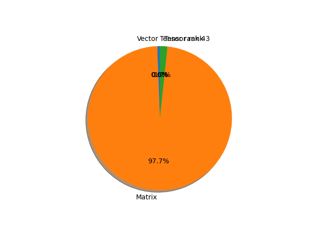

# mobilenet_v3_large parameter information

**Number of layers: [ 174 ]**

**Number of parameters: [ 5.48M ]**

**Proportional of each form** (%)

| Vector | Matrix | Tensor rank 3 | Tensor rank 4 | 
|  --- | --- | --- | --- |
| 63.22 | 27.59 | 8.62 | 0.57 | 

**Proportional of parameters by form** (%)

| Vector | Matrix | Tensor rank 3 | Tensor rank 4 | 
|  --- | --- | --- | --- |
| 0.58 | 97.74 | 1.67 | 0.01 | 

**Layer information**

| Name | Shape | Squeezed shape | Number of parameters | Form |
| --- | --- | --- | --- | --- |
| features.0.0.weight | (16, 3, 3, 3) | (16, 3, 3, 3) | 432 | Tensor rank 4 |
| features.0.1.weight | (16,) | (16,) | 16 | Vector |
| features.0.1.bias | (16,) | (16,) | 16 | Vector |
| features.1.block.0.0.weight | (16, 1, 3, 3) | (16, 3, 3) | 144 | Tensor rank 3 |
| features.1.block.0.1.weight | (16,) | (16,) | 16 | Vector |
| features.1.block.0.1.bias | (16,) | (16,) | 16 | Vector |
| features.1.block.1.0.weight | (16, 16, 1, 1) | (16, 16) | 256 | Matrix |
| features.1.block.1.1.weight | (16,) | (16,) | 16 | Vector |
| features.1.block.1.1.bias | (16,) | (16,) | 16 | Vector |
| features.2.block.0.0.weight | (64, 16, 1, 1) | (64, 16) | 1024 | Matrix |
| features.2.block.0.1.weight | (64,) | (64,) | 64 | Vector |
| features.2.block.0.1.bias | (64,) | (64,) | 64 | Vector |
| features.2.block.1.0.weight | (64, 1, 3, 3) | (64, 3, 3) | 576 | Tensor rank 3 |
| features.2.block.1.1.weight | (64,) | (64,) | 64 | Vector |
| features.2.block.1.1.bias | (64,) | (64,) | 64 | Vector |
| features.2.block.2.0.weight | (24, 64, 1, 1) | (24, 64) | 1536 | Matrix |
| features.2.block.2.1.weight | (24,) | (24,) | 24 | Vector |
| features.2.block.2.1.bias | (24,) | (24,) | 24 | Vector |
| features.3.block.0.0.weight | (72, 24, 1, 1) | (72, 24) | 1728 | Matrix |
| features.3.block.0.1.weight | (72,) | (72,) | 72 | Vector |
| features.3.block.0.1.bias | (72,) | (72,) | 72 | Vector |
| features.3.block.1.0.weight | (72, 1, 3, 3) | (72, 3, 3) | 648 | Tensor rank 3 |
| features.3.block.1.1.weight | (72,) | (72,) | 72 | Vector |
| features.3.block.1.1.bias | (72,) | (72,) | 72 | Vector |
| features.3.block.2.0.weight | (24, 72, 1, 1) | (24, 72) | 1728 | Matrix |
| features.3.block.2.1.weight | (24,) | (24,) | 24 | Vector |
| features.3.block.2.1.bias | (24,) | (24,) | 24 | Vector |
| features.4.block.0.0.weight | (72, 24, 1, 1) | (72, 24) | 1728 | Matrix |
| features.4.block.0.1.weight | (72,) | (72,) | 72 | Vector |
| features.4.block.0.1.bias | (72,) | (72,) | 72 | Vector |
| features.4.block.1.0.weight | (72, 1, 5, 5) | (72, 5, 5) | 1800 | Tensor rank 3 |
| features.4.block.1.1.weight | (72,) | (72,) | 72 | Vector |
| features.4.block.1.1.bias | (72,) | (72,) | 72 | Vector |
| features.4.block.2.fc1.weight | (24, 72, 1, 1) | (24, 72) | 1728 | Matrix |
| features.4.block.2.fc1.bias | (24,) | (24,) | 24 | Vector |
| features.4.block.2.fc2.weight | (72, 24, 1, 1) | (72, 24) | 1728 | Matrix |
| features.4.block.2.fc2.bias | (72,) | (72,) | 72 | Vector |
| features.4.block.3.0.weight | (40, 72, 1, 1) | (40, 72) | 2880 | Matrix |
| features.4.block.3.1.weight | (40,) | (40,) | 40 | Vector |
| features.4.block.3.1.bias | (40,) | (40,) | 40 | Vector |
| features.5.block.0.0.weight | (120, 40, 1, 1) | (120, 40) | 4800 | Matrix |
| features.5.block.0.1.weight | (120,) | (120,) | 120 | Vector |
| features.5.block.0.1.bias | (120,) | (120,) | 120 | Vector |
| features.5.block.1.0.weight | (120, 1, 5, 5) | (120, 5, 5) | 3000 | Tensor rank 3 |
| features.5.block.1.1.weight | (120,) | (120,) | 120 | Vector |
| features.5.block.1.1.bias | (120,) | (120,) | 120 | Vector |
| features.5.block.2.fc1.weight | (32, 120, 1, 1) | (32, 120) | 3840 | Matrix |
| features.5.block.2.fc1.bias | (32,) | (32,) | 32 | Vector |
| features.5.block.2.fc2.weight | (120, 32, 1, 1) | (120, 32) | 3840 | Matrix |
| features.5.block.2.fc2.bias | (120,) | (120,) | 120 | Vector |
| features.5.block.3.0.weight | (40, 120, 1, 1) | (40, 120) | 4800 | Matrix |
| features.5.block.3.1.weight | (40,) | (40,) | 40 | Vector |
| features.5.block.3.1.bias | (40,) | (40,) | 40 | Vector |
| features.6.block.0.0.weight | (120, 40, 1, 1) | (120, 40) | 4800 | Matrix |
| features.6.block.0.1.weight | (120,) | (120,) | 120 | Vector |
| features.6.block.0.1.bias | (120,) | (120,) | 120 | Vector |
| features.6.block.1.0.weight | (120, 1, 5, 5) | (120, 5, 5) | 3000 | Tensor rank 3 |
| features.6.block.1.1.weight | (120,) | (120,) | 120 | Vector |
| features.6.block.1.1.bias | (120,) | (120,) | 120 | Vector |
| features.6.block.2.fc1.weight | (32, 120, 1, 1) | (32, 120) | 3840 | Matrix |
| features.6.block.2.fc1.bias | (32,) | (32,) | 32 | Vector |
| features.6.block.2.fc2.weight | (120, 32, 1, 1) | (120, 32) | 3840 | Matrix |
| features.6.block.2.fc2.bias | (120,) | (120,) | 120 | Vector |
| features.6.block.3.0.weight | (40, 120, 1, 1) | (40, 120) | 4800 | Matrix |
| features.6.block.3.1.weight | (40,) | (40,) | 40 | Vector |
| features.6.block.3.1.bias | (40,) | (40,) | 40 | Vector |
| features.7.block.0.0.weight | (240, 40, 1, 1) | (240, 40) | 9600 | Matrix |
| features.7.block.0.1.weight | (240,) | (240,) | 240 | Vector |
| features.7.block.0.1.bias | (240,) | (240,) | 240 | Vector |
| features.7.block.1.0.weight | (240, 1, 3, 3) | (240, 3, 3) | 2160 | Tensor rank 3 |
| features.7.block.1.1.weight | (240,) | (240,) | 240 | Vector |
| features.7.block.1.1.bias | (240,) | (240,) | 240 | Vector |
| features.7.block.2.0.weight | (80, 240, 1, 1) | (80, 240) | 19200 | Matrix |
| features.7.block.2.1.weight | (80,) | (80,) | 80 | Vector |
| features.7.block.2.1.bias | (80,) | (80,) | 80 | Vector |
| features.8.block.0.0.weight | (200, 80, 1, 1) | (200, 80) | 16000 | Matrix |
| features.8.block.0.1.weight | (200,) | (200,) | 200 | Vector |
| features.8.block.0.1.bias | (200,) | (200,) | 200 | Vector |
| features.8.block.1.0.weight | (200, 1, 3, 3) | (200, 3, 3) | 1800 | Tensor rank 3 |
| features.8.block.1.1.weight | (200,) | (200,) | 200 | Vector |
| features.8.block.1.1.bias | (200,) | (200,) | 200 | Vector |
| features.8.block.2.0.weight | (80, 200, 1, 1) | (80, 200) | 16000 | Matrix |
| features.8.block.2.1.weight | (80,) | (80,) | 80 | Vector |
| features.8.block.2.1.bias | (80,) | (80,) | 80 | Vector |
| features.9.block.0.0.weight | (184, 80, 1, 1) | (184, 80) | 14720 | Matrix |
| features.9.block.0.1.weight | (184,) | (184,) | 184 | Vector |
| features.9.block.0.1.bias | (184,) | (184,) | 184 | Vector |
| features.9.block.1.0.weight | (184, 1, 3, 3) | (184, 3, 3) | 1656 | Tensor rank 3 |
| features.9.block.1.1.weight | (184,) | (184,) | 184 | Vector |
| features.9.block.1.1.bias | (184,) | (184,) | 184 | Vector |
| features.9.block.2.0.weight | (80, 184, 1, 1) | (80, 184) | 14720 | Matrix |
| features.9.block.2.1.weight | (80,) | (80,) | 80 | Vector |
| features.9.block.2.1.bias | (80,) | (80,) | 80 | Vector |
| features.10.block.0.0.weight | (184, 80, 1, 1) | (184, 80) | 14720 | Matrix |
| features.10.block.0.1.weight | (184,) | (184,) | 184 | Vector |
| features.10.block.0.1.bias | (184,) | (184,) | 184 | Vector |
| features.10.block.1.0.weight | (184, 1, 3, 3) | (184, 3, 3) | 1656 | Tensor rank 3 |
| features.10.block.1.1.weight | (184,) | (184,) | 184 | Vector |
| features.10.block.1.1.bias | (184,) | (184,) | 184 | Vector |
| features.10.block.2.0.weight | (80, 184, 1, 1) | (80, 184) | 14720 | Matrix |
| features.10.block.2.1.weight | (80,) | (80,) | 80 | Vector |
| features.10.block.2.1.bias | (80,) | (80,) | 80 | Vector |
| features.11.block.0.0.weight | (480, 80, 1, 1) | (480, 80) | 38400 | Matrix |
| features.11.block.0.1.weight | (480,) | (480,) | 480 | Vector |
| features.11.block.0.1.bias | (480,) | (480,) | 480 | Vector |
| features.11.block.1.0.weight | (480, 1, 3, 3) | (480, 3, 3) | 4320 | Tensor rank 3 |
| features.11.block.1.1.weight | (480,) | (480,) | 480 | Vector |
| features.11.block.1.1.bias | (480,) | (480,) | 480 | Vector |
| features.11.block.2.fc1.weight | (120, 480, 1, 1) | (120, 480) | 57600 | Matrix |
| features.11.block.2.fc1.bias | (120,) | (120,) | 120 | Vector |
| features.11.block.2.fc2.weight | (480, 120, 1, 1) | (480, 120) | 57600 | Matrix |
| features.11.block.2.fc2.bias | (480,) | (480,) | 480 | Vector |
| features.11.block.3.0.weight | (112, 480, 1, 1) | (112, 480) | 53760 | Matrix |
| features.11.block.3.1.weight | (112,) | (112,) | 112 | Vector |
| features.11.block.3.1.bias | (112,) | (112,) | 112 | Vector |
| features.12.block.0.0.weight | (672, 112, 1, 1) | (672, 112) | 75264 | Matrix |
| features.12.block.0.1.weight | (672,) | (672,) | 672 | Vector |
| features.12.block.0.1.bias | (672,) | (672,) | 672 | Vector |
| features.12.block.1.0.weight | (672, 1, 3, 3) | (672, 3, 3) | 6048 | Tensor rank 3 |
| features.12.block.1.1.weight | (672,) | (672,) | 672 | Vector |
| features.12.block.1.1.bias | (672,) | (672,) | 672 | Vector |
| features.12.block.2.fc1.weight | (168, 672, 1, 1) | (168, 672) | 112896 | Matrix |
| features.12.block.2.fc1.bias | (168,) | (168,) | 168 | Vector |
| features.12.block.2.fc2.weight | (672, 168, 1, 1) | (672, 168) | 112896 | Matrix |
| features.12.block.2.fc2.bias | (672,) | (672,) | 672 | Vector |
| features.12.block.3.0.weight | (112, 672, 1, 1) | (112, 672) | 75264 | Matrix |
| features.12.block.3.1.weight | (112,) | (112,) | 112 | Vector |
| features.12.block.3.1.bias | (112,) | (112,) | 112 | Vector |
| features.13.block.0.0.weight | (672, 112, 1, 1) | (672, 112) | 75264 | Matrix |
| features.13.block.0.1.weight | (672,) | (672,) | 672 | Vector |
| features.13.block.0.1.bias | (672,) | (672,) | 672 | Vector |
| features.13.block.1.0.weight | (672, 1, 5, 5) | (672, 5, 5) | 16800 | Tensor rank 3 |
| features.13.block.1.1.weight | (672,) | (672,) | 672 | Vector |
| features.13.block.1.1.bias | (672,) | (672,) | 672 | Vector |
| features.13.block.2.fc1.weight | (168, 672, 1, 1) | (168, 672) | 112896 | Matrix |
| features.13.block.2.fc1.bias | (168,) | (168,) | 168 | Vector |
| features.13.block.2.fc2.weight | (672, 168, 1, 1) | (672, 168) | 112896 | Matrix |
| features.13.block.2.fc2.bias | (672,) | (672,) | 672 | Vector |
| features.13.block.3.0.weight | (160, 672, 1, 1) | (160, 672) | 107520 | Matrix |
| features.13.block.3.1.weight | (160,) | (160,) | 160 | Vector |
| features.13.block.3.1.bias | (160,) | (160,) | 160 | Vector |
| features.14.block.0.0.weight | (960, 160, 1, 1) | (960, 160) | 153600 | Matrix |
| features.14.block.0.1.weight | (960,) | (960,) | 960 | Vector |
| features.14.block.0.1.bias | (960,) | (960,) | 960 | Vector |
| features.14.block.1.0.weight | (960, 1, 5, 5) | (960, 5, 5) | 24000 | Tensor rank 3 |
| features.14.block.1.1.weight | (960,) | (960,) | 960 | Vector |
| features.14.block.1.1.bias | (960,) | (960,) | 960 | Vector |
| features.14.block.2.fc1.weight | (240, 960, 1, 1) | (240, 960) | 230400 | Matrix |
| features.14.block.2.fc1.bias | (240,) | (240,) | 240 | Vector |
| features.14.block.2.fc2.weight | (960, 240, 1, 1) | (960, 240) | 230400 | Matrix |
| features.14.block.2.fc2.bias | (960,) | (960,) | 960 | Vector |
| features.14.block.3.0.weight | (160, 960, 1, 1) | (160, 960) | 153600 | Matrix |
| features.14.block.3.1.weight | (160,) | (160,) | 160 | Vector |
| features.14.block.3.1.bias | (160,) | (160,) | 160 | Vector |
| features.15.block.0.0.weight | (960, 160, 1, 1) | (960, 160) | 153600 | Matrix |
| features.15.block.0.1.weight | (960,) | (960,) | 960 | Vector |
| features.15.block.0.1.bias | (960,) | (960,) | 960 | Vector |
| features.15.block.1.0.weight | (960, 1, 5, 5) | (960, 5, 5) | 24000 | Tensor rank 3 |
| features.15.block.1.1.weight | (960,) | (960,) | 960 | Vector |
| features.15.block.1.1.bias | (960,) | (960,) | 960 | Vector |
| features.15.block.2.fc1.weight | (240, 960, 1, 1) | (240, 960) | 230400 | Matrix |
| features.15.block.2.fc1.bias | (240,) | (240,) | 240 | Vector |
| features.15.block.2.fc2.weight | (960, 240, 1, 1) | (960, 240) | 230400 | Matrix |
| features.15.block.2.fc2.bias | (960,) | (960,) | 960 | Vector |
| features.15.block.3.0.weight | (160, 960, 1, 1) | (160, 960) | 153600 | Matrix |
| features.15.block.3.1.weight | (160,) | (160,) | 160 | Vector |
| features.15.block.3.1.bias | (160,) | (160,) | 160 | Vector |
| features.16.0.weight | (960, 160, 1, 1) | (960, 160) | 153600 | Matrix |
| features.16.1.weight | (960,) | (960,) | 960 | Vector |
| features.16.1.bias | (960,) | (960,) | 960 | Vector |
| classifier.0.weight | (1280, 960) | (1280, 960) | 1228800 | Matrix |
| classifier.0.bias | (1280,) | (1280,) | 1280 | Vector |
| classifier.3.weight | (1000, 1280) | (1000, 1280) | 1280000 | Matrix |
| classifier.3.bias | (1000,) | (1000,) | 1000 | Vector |

