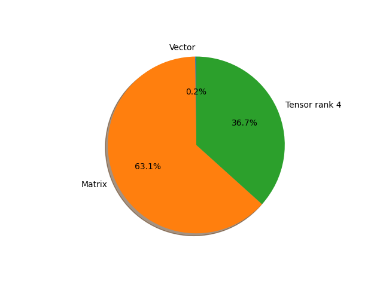

# regnet_x_16gf parameter information

**Number of layers: [ 215 ]**

**Number of parameters: [ 54.28M ]**

**Proportional of each form** (%)

| Vector | Matrix | Tensor rank 4 | 
|  --- | --- | --- |
| 66.51 | 22.79 | 10.70 | 

**Proportional of parameters by form** (%)

| Vector | Matrix | Tensor rank 4 | 
|  --- | --- | --- |
| 0.21 | 63.12 | 36.68 | 

**Layer information**

| Name | Shape | Squeezed shape | Number of parameters | Form |
| --- | --- | --- | --- | --- |
| stem.0.weight | (32, 3, 3, 3) | (32, 3, 3, 3) | 864 | Tensor rank 4 |
| stem.1.weight | (32,) | (32,) | 32 | Vector |
| stem.1.bias | (32,) | (32,) | 32 | Vector |
| trunk_output.block1.block1-0.proj.0.weight | (256, 32, 1, 1) | (256, 32) | 8192 | Matrix |
| trunk_output.block1.block1-0.proj.1.weight | (256,) | (256,) | 256 | Vector |
| trunk_output.block1.block1-0.proj.1.bias | (256,) | (256,) | 256 | Vector |
| trunk_output.block1.block1-0.f.a.0.weight | (256, 32, 1, 1) | (256, 32) | 8192 | Matrix |
| trunk_output.block1.block1-0.f.a.1.weight | (256,) | (256,) | 256 | Vector |
| trunk_output.block1.block1-0.f.a.1.bias | (256,) | (256,) | 256 | Vector |
| trunk_output.block1.block1-0.f.b.0.weight | (256, 128, 3, 3) | (256, 128, 3, 3) | 294912 | Tensor rank 4 |
| trunk_output.block1.block1-0.f.b.1.weight | (256,) | (256,) | 256 | Vector |
| trunk_output.block1.block1-0.f.b.1.bias | (256,) | (256,) | 256 | Vector |
| trunk_output.block1.block1-0.f.c.0.weight | (256, 256, 1, 1) | (256, 256) | 65536 | Matrix |
| trunk_output.block1.block1-0.f.c.1.weight | (256,) | (256,) | 256 | Vector |
| trunk_output.block1.block1-0.f.c.1.bias | (256,) | (256,) | 256 | Vector |
| trunk_output.block1.block1-1.f.a.0.weight | (256, 256, 1, 1) | (256, 256) | 65536 | Matrix |
| trunk_output.block1.block1-1.f.a.1.weight | (256,) | (256,) | 256 | Vector |
| trunk_output.block1.block1-1.f.a.1.bias | (256,) | (256,) | 256 | Vector |
| trunk_output.block1.block1-1.f.b.0.weight | (256, 128, 3, 3) | (256, 128, 3, 3) | 294912 | Tensor rank 4 |
| trunk_output.block1.block1-1.f.b.1.weight | (256,) | (256,) | 256 | Vector |
| trunk_output.block1.block1-1.f.b.1.bias | (256,) | (256,) | 256 | Vector |
| trunk_output.block1.block1-1.f.c.0.weight | (256, 256, 1, 1) | (256, 256) | 65536 | Matrix |
| trunk_output.block1.block1-1.f.c.1.weight | (256,) | (256,) | 256 | Vector |
| trunk_output.block1.block1-1.f.c.1.bias | (256,) | (256,) | 256 | Vector |
| trunk_output.block2.block2-0.proj.0.weight | (512, 256, 1, 1) | (512, 256) | 131072 | Matrix |
| trunk_output.block2.block2-0.proj.1.weight | (512,) | (512,) | 512 | Vector |
| trunk_output.block2.block2-0.proj.1.bias | (512,) | (512,) | 512 | Vector |
| trunk_output.block2.block2-0.f.a.0.weight | (512, 256, 1, 1) | (512, 256) | 131072 | Matrix |
| trunk_output.block2.block2-0.f.a.1.weight | (512,) | (512,) | 512 | Vector |
| trunk_output.block2.block2-0.f.a.1.bias | (512,) | (512,) | 512 | Vector |
| trunk_output.block2.block2-0.f.b.0.weight | (512, 128, 3, 3) | (512, 128, 3, 3) | 589824 | Tensor rank 4 |
| trunk_output.block2.block2-0.f.b.1.weight | (512,) | (512,) | 512 | Vector |
| trunk_output.block2.block2-0.f.b.1.bias | (512,) | (512,) | 512 | Vector |
| trunk_output.block2.block2-0.f.c.0.weight | (512, 512, 1, 1) | (512, 512) | 262144 | Matrix |
| trunk_output.block2.block2-0.f.c.1.weight | (512,) | (512,) | 512 | Vector |
| trunk_output.block2.block2-0.f.c.1.bias | (512,) | (512,) | 512 | Vector |
| trunk_output.block2.block2-1.f.a.0.weight | (512, 512, 1, 1) | (512, 512) | 262144 | Matrix |
| trunk_output.block2.block2-1.f.a.1.weight | (512,) | (512,) | 512 | Vector |
| trunk_output.block2.block2-1.f.a.1.bias | (512,) | (512,) | 512 | Vector |
| trunk_output.block2.block2-1.f.b.0.weight | (512, 128, 3, 3) | (512, 128, 3, 3) | 589824 | Tensor rank 4 |
| trunk_output.block2.block2-1.f.b.1.weight | (512,) | (512,) | 512 | Vector |
| trunk_output.block2.block2-1.f.b.1.bias | (512,) | (512,) | 512 | Vector |
| trunk_output.block2.block2-1.f.c.0.weight | (512, 512, 1, 1) | (512, 512) | 262144 | Matrix |
| trunk_output.block2.block2-1.f.c.1.weight | (512,) | (512,) | 512 | Vector |
| trunk_output.block2.block2-1.f.c.1.bias | (512,) | (512,) | 512 | Vector |
| trunk_output.block2.block2-2.f.a.0.weight | (512, 512, 1, 1) | (512, 512) | 262144 | Matrix |
| trunk_output.block2.block2-2.f.a.1.weight | (512,) | (512,) | 512 | Vector |
| trunk_output.block2.block2-2.f.a.1.bias | (512,) | (512,) | 512 | Vector |
| trunk_output.block2.block2-2.f.b.0.weight | (512, 128, 3, 3) | (512, 128, 3, 3) | 589824 | Tensor rank 4 |
| trunk_output.block2.block2-2.f.b.1.weight | (512,) | (512,) | 512 | Vector |
| trunk_output.block2.block2-2.f.b.1.bias | (512,) | (512,) | 512 | Vector |
| trunk_output.block2.block2-2.f.c.0.weight | (512, 512, 1, 1) | (512, 512) | 262144 | Matrix |
| trunk_output.block2.block2-2.f.c.1.weight | (512,) | (512,) | 512 | Vector |
| trunk_output.block2.block2-2.f.c.1.bias | (512,) | (512,) | 512 | Vector |
| trunk_output.block2.block2-3.f.a.0.weight | (512, 512, 1, 1) | (512, 512) | 262144 | Matrix |
| trunk_output.block2.block2-3.f.a.1.weight | (512,) | (512,) | 512 | Vector |
| trunk_output.block2.block2-3.f.a.1.bias | (512,) | (512,) | 512 | Vector |
| trunk_output.block2.block2-3.f.b.0.weight | (512, 128, 3, 3) | (512, 128, 3, 3) | 589824 | Tensor rank 4 |
| trunk_output.block2.block2-3.f.b.1.weight | (512,) | (512,) | 512 | Vector |
| trunk_output.block2.block2-3.f.b.1.bias | (512,) | (512,) | 512 | Vector |
| trunk_output.block2.block2-3.f.c.0.weight | (512, 512, 1, 1) | (512, 512) | 262144 | Matrix |
| trunk_output.block2.block2-3.f.c.1.weight | (512,) | (512,) | 512 | Vector |
| trunk_output.block2.block2-3.f.c.1.bias | (512,) | (512,) | 512 | Vector |
| trunk_output.block2.block2-4.f.a.0.weight | (512, 512, 1, 1) | (512, 512) | 262144 | Matrix |
| trunk_output.block2.block2-4.f.a.1.weight | (512,) | (512,) | 512 | Vector |
| trunk_output.block2.block2-4.f.a.1.bias | (512,) | (512,) | 512 | Vector |
| trunk_output.block2.block2-4.f.b.0.weight | (512, 128, 3, 3) | (512, 128, 3, 3) | 589824 | Tensor rank 4 |
| trunk_output.block2.block2-4.f.b.1.weight | (512,) | (512,) | 512 | Vector |
| trunk_output.block2.block2-4.f.b.1.bias | (512,) | (512,) | 512 | Vector |
| trunk_output.block2.block2-4.f.c.0.weight | (512, 512, 1, 1) | (512, 512) | 262144 | Matrix |
| trunk_output.block2.block2-4.f.c.1.weight | (512,) | (512,) | 512 | Vector |
| trunk_output.block2.block2-4.f.c.1.bias | (512,) | (512,) | 512 | Vector |
| trunk_output.block2.block2-5.f.a.0.weight | (512, 512, 1, 1) | (512, 512) | 262144 | Matrix |
| trunk_output.block2.block2-5.f.a.1.weight | (512,) | (512,) | 512 | Vector |
| trunk_output.block2.block2-5.f.a.1.bias | (512,) | (512,) | 512 | Vector |
| trunk_output.block2.block2-5.f.b.0.weight | (512, 128, 3, 3) | (512, 128, 3, 3) | 589824 | Tensor rank 4 |
| trunk_output.block2.block2-5.f.b.1.weight | (512,) | (512,) | 512 | Vector |
| trunk_output.block2.block2-5.f.b.1.bias | (512,) | (512,) | 512 | Vector |
| trunk_output.block2.block2-5.f.c.0.weight | (512, 512, 1, 1) | (512, 512) | 262144 | Matrix |
| trunk_output.block2.block2-5.f.c.1.weight | (512,) | (512,) | 512 | Vector |
| trunk_output.block2.block2-5.f.c.1.bias | (512,) | (512,) | 512 | Vector |
| trunk_output.block3.block3-0.proj.0.weight | (896, 512, 1, 1) | (896, 512) | 458752 | Matrix |
| trunk_output.block3.block3-0.proj.1.weight | (896,) | (896,) | 896 | Vector |
| trunk_output.block3.block3-0.proj.1.bias | (896,) | (896,) | 896 | Vector |
| trunk_output.block3.block3-0.f.a.0.weight | (896, 512, 1, 1) | (896, 512) | 458752 | Matrix |
| trunk_output.block3.block3-0.f.a.1.weight | (896,) | (896,) | 896 | Vector |
| trunk_output.block3.block3-0.f.a.1.bias | (896,) | (896,) | 896 | Vector |
| trunk_output.block3.block3-0.f.b.0.weight | (896, 128, 3, 3) | (896, 128, 3, 3) | 1032192 | Tensor rank 4 |
| trunk_output.block3.block3-0.f.b.1.weight | (896,) | (896,) | 896 | Vector |
| trunk_output.block3.block3-0.f.b.1.bias | (896,) | (896,) | 896 | Vector |
| trunk_output.block3.block3-0.f.c.0.weight | (896, 896, 1, 1) | (896, 896) | 802816 | Matrix |
| trunk_output.block3.block3-0.f.c.1.weight | (896,) | (896,) | 896 | Vector |
| trunk_output.block3.block3-0.f.c.1.bias | (896,) | (896,) | 896 | Vector |
| trunk_output.block3.block3-1.f.a.0.weight | (896, 896, 1, 1) | (896, 896) | 802816 | Matrix |
| trunk_output.block3.block3-1.f.a.1.weight | (896,) | (896,) | 896 | Vector |
| trunk_output.block3.block3-1.f.a.1.bias | (896,) | (896,) | 896 | Vector |
| trunk_output.block3.block3-1.f.b.0.weight | (896, 128, 3, 3) | (896, 128, 3, 3) | 1032192 | Tensor rank 4 |
| trunk_output.block3.block3-1.f.b.1.weight | (896,) | (896,) | 896 | Vector |
| trunk_output.block3.block3-1.f.b.1.bias | (896,) | (896,) | 896 | Vector |
| trunk_output.block3.block3-1.f.c.0.weight | (896, 896, 1, 1) | (896, 896) | 802816 | Matrix |
| trunk_output.block3.block3-1.f.c.1.weight | (896,) | (896,) | 896 | Vector |
| trunk_output.block3.block3-1.f.c.1.bias | (896,) | (896,) | 896 | Vector |
| trunk_output.block3.block3-2.f.a.0.weight | (896, 896, 1, 1) | (896, 896) | 802816 | Matrix |
| trunk_output.block3.block3-2.f.a.1.weight | (896,) | (896,) | 896 | Vector |
| trunk_output.block3.block3-2.f.a.1.bias | (896,) | (896,) | 896 | Vector |
| trunk_output.block3.block3-2.f.b.0.weight | (896, 128, 3, 3) | (896, 128, 3, 3) | 1032192 | Tensor rank 4 |
| trunk_output.block3.block3-2.f.b.1.weight | (896,) | (896,) | 896 | Vector |
| trunk_output.block3.block3-2.f.b.1.bias | (896,) | (896,) | 896 | Vector |
| trunk_output.block3.block3-2.f.c.0.weight | (896, 896, 1, 1) | (896, 896) | 802816 | Matrix |
| trunk_output.block3.block3-2.f.c.1.weight | (896,) | (896,) | 896 | Vector |
| trunk_output.block3.block3-2.f.c.1.bias | (896,) | (896,) | 896 | Vector |
| trunk_output.block3.block3-3.f.a.0.weight | (896, 896, 1, 1) | (896, 896) | 802816 | Matrix |
| trunk_output.block3.block3-3.f.a.1.weight | (896,) | (896,) | 896 | Vector |
| trunk_output.block3.block3-3.f.a.1.bias | (896,) | (896,) | 896 | Vector |
| trunk_output.block3.block3-3.f.b.0.weight | (896, 128, 3, 3) | (896, 128, 3, 3) | 1032192 | Tensor rank 4 |
| trunk_output.block3.block3-3.f.b.1.weight | (896,) | (896,) | 896 | Vector |
| trunk_output.block3.block3-3.f.b.1.bias | (896,) | (896,) | 896 | Vector |
| trunk_output.block3.block3-3.f.c.0.weight | (896, 896, 1, 1) | (896, 896) | 802816 | Matrix |
| trunk_output.block3.block3-3.f.c.1.weight | (896,) | (896,) | 896 | Vector |
| trunk_output.block3.block3-3.f.c.1.bias | (896,) | (896,) | 896 | Vector |
| trunk_output.block3.block3-4.f.a.0.weight | (896, 896, 1, 1) | (896, 896) | 802816 | Matrix |
| trunk_output.block3.block3-4.f.a.1.weight | (896,) | (896,) | 896 | Vector |
| trunk_output.block3.block3-4.f.a.1.bias | (896,) | (896,) | 896 | Vector |
| trunk_output.block3.block3-4.f.b.0.weight | (896, 128, 3, 3) | (896, 128, 3, 3) | 1032192 | Tensor rank 4 |
| trunk_output.block3.block3-4.f.b.1.weight | (896,) | (896,) | 896 | Vector |
| trunk_output.block3.block3-4.f.b.1.bias | (896,) | (896,) | 896 | Vector |
| trunk_output.block3.block3-4.f.c.0.weight | (896, 896, 1, 1) | (896, 896) | 802816 | Matrix |
| trunk_output.block3.block3-4.f.c.1.weight | (896,) | (896,) | 896 | Vector |
| trunk_output.block3.block3-4.f.c.1.bias | (896,) | (896,) | 896 | Vector |
| trunk_output.block3.block3-5.f.a.0.weight | (896, 896, 1, 1) | (896, 896) | 802816 | Matrix |
| trunk_output.block3.block3-5.f.a.1.weight | (896,) | (896,) | 896 | Vector |
| trunk_output.block3.block3-5.f.a.1.bias | (896,) | (896,) | 896 | Vector |
| trunk_output.block3.block3-5.f.b.0.weight | (896, 128, 3, 3) | (896, 128, 3, 3) | 1032192 | Tensor rank 4 |
| trunk_output.block3.block3-5.f.b.1.weight | (896,) | (896,) | 896 | Vector |
| trunk_output.block3.block3-5.f.b.1.bias | (896,) | (896,) | 896 | Vector |
| trunk_output.block3.block3-5.f.c.0.weight | (896, 896, 1, 1) | (896, 896) | 802816 | Matrix |
| trunk_output.block3.block3-5.f.c.1.weight | (896,) | (896,) | 896 | Vector |
| trunk_output.block3.block3-5.f.c.1.bias | (896,) | (896,) | 896 | Vector |
| trunk_output.block3.block3-6.f.a.0.weight | (896, 896, 1, 1) | (896, 896) | 802816 | Matrix |
| trunk_output.block3.block3-6.f.a.1.weight | (896,) | (896,) | 896 | Vector |
| trunk_output.block3.block3-6.f.a.1.bias | (896,) | (896,) | 896 | Vector |
| trunk_output.block3.block3-6.f.b.0.weight | (896, 128, 3, 3) | (896, 128, 3, 3) | 1032192 | Tensor rank 4 |
| trunk_output.block3.block3-6.f.b.1.weight | (896,) | (896,) | 896 | Vector |
| trunk_output.block3.block3-6.f.b.1.bias | (896,) | (896,) | 896 | Vector |
| trunk_output.block3.block3-6.f.c.0.weight | (896, 896, 1, 1) | (896, 896) | 802816 | Matrix |
| trunk_output.block3.block3-6.f.c.1.weight | (896,) | (896,) | 896 | Vector |
| trunk_output.block3.block3-6.f.c.1.bias | (896,) | (896,) | 896 | Vector |
| trunk_output.block3.block3-7.f.a.0.weight | (896, 896, 1, 1) | (896, 896) | 802816 | Matrix |
| trunk_output.block3.block3-7.f.a.1.weight | (896,) | (896,) | 896 | Vector |
| trunk_output.block3.block3-7.f.a.1.bias | (896,) | (896,) | 896 | Vector |
| trunk_output.block3.block3-7.f.b.0.weight | (896, 128, 3, 3) | (896, 128, 3, 3) | 1032192 | Tensor rank 4 |
| trunk_output.block3.block3-7.f.b.1.weight | (896,) | (896,) | 896 | Vector |
| trunk_output.block3.block3-7.f.b.1.bias | (896,) | (896,) | 896 | Vector |
| trunk_output.block3.block3-7.f.c.0.weight | (896, 896, 1, 1) | (896, 896) | 802816 | Matrix |
| trunk_output.block3.block3-7.f.c.1.weight | (896,) | (896,) | 896 | Vector |
| trunk_output.block3.block3-7.f.c.1.bias | (896,) | (896,) | 896 | Vector |
| trunk_output.block3.block3-8.f.a.0.weight | (896, 896, 1, 1) | (896, 896) | 802816 | Matrix |
| trunk_output.block3.block3-8.f.a.1.weight | (896,) | (896,) | 896 | Vector |
| trunk_output.block3.block3-8.f.a.1.bias | (896,) | (896,) | 896 | Vector |
| trunk_output.block3.block3-8.f.b.0.weight | (896, 128, 3, 3) | (896, 128, 3, 3) | 1032192 | Tensor rank 4 |
| trunk_output.block3.block3-8.f.b.1.weight | (896,) | (896,) | 896 | Vector |
| trunk_output.block3.block3-8.f.b.1.bias | (896,) | (896,) | 896 | Vector |
| trunk_output.block3.block3-8.f.c.0.weight | (896, 896, 1, 1) | (896, 896) | 802816 | Matrix |
| trunk_output.block3.block3-8.f.c.1.weight | (896,) | (896,) | 896 | Vector |
| trunk_output.block3.block3-8.f.c.1.bias | (896,) | (896,) | 896 | Vector |
| trunk_output.block3.block3-9.f.a.0.weight | (896, 896, 1, 1) | (896, 896) | 802816 | Matrix |
| trunk_output.block3.block3-9.f.a.1.weight | (896,) | (896,) | 896 | Vector |
| trunk_output.block3.block3-9.f.a.1.bias | (896,) | (896,) | 896 | Vector |
| trunk_output.block3.block3-9.f.b.0.weight | (896, 128, 3, 3) | (896, 128, 3, 3) | 1032192 | Tensor rank 4 |
| trunk_output.block3.block3-9.f.b.1.weight | (896,) | (896,) | 896 | Vector |
| trunk_output.block3.block3-9.f.b.1.bias | (896,) | (896,) | 896 | Vector |
| trunk_output.block3.block3-9.f.c.0.weight | (896, 896, 1, 1) | (896, 896) | 802816 | Matrix |
| trunk_output.block3.block3-9.f.c.1.weight | (896,) | (896,) | 896 | Vector |
| trunk_output.block3.block3-9.f.c.1.bias | (896,) | (896,) | 896 | Vector |
| trunk_output.block3.block3-10.f.a.0.weight | (896, 896, 1, 1) | (896, 896) | 802816 | Matrix |
| trunk_output.block3.block3-10.f.a.1.weight | (896,) | (896,) | 896 | Vector |
| trunk_output.block3.block3-10.f.a.1.bias | (896,) | (896,) | 896 | Vector |
| trunk_output.block3.block3-10.f.b.0.weight | (896, 128, 3, 3) | (896, 128, 3, 3) | 1032192 | Tensor rank 4 |
| trunk_output.block3.block3-10.f.b.1.weight | (896,) | (896,) | 896 | Vector |
| trunk_output.block3.block3-10.f.b.1.bias | (896,) | (896,) | 896 | Vector |
| trunk_output.block3.block3-10.f.c.0.weight | (896, 896, 1, 1) | (896, 896) | 802816 | Matrix |
| trunk_output.block3.block3-10.f.c.1.weight | (896,) | (896,) | 896 | Vector |
| trunk_output.block3.block3-10.f.c.1.bias | (896,) | (896,) | 896 | Vector |
| trunk_output.block3.block3-11.f.a.0.weight | (896, 896, 1, 1) | (896, 896) | 802816 | Matrix |
| trunk_output.block3.block3-11.f.a.1.weight | (896,) | (896,) | 896 | Vector |
| trunk_output.block3.block3-11.f.a.1.bias | (896,) | (896,) | 896 | Vector |
| trunk_output.block3.block3-11.f.b.0.weight | (896, 128, 3, 3) | (896, 128, 3, 3) | 1032192 | Tensor rank 4 |
| trunk_output.block3.block3-11.f.b.1.weight | (896,) | (896,) | 896 | Vector |
| trunk_output.block3.block3-11.f.b.1.bias | (896,) | (896,) | 896 | Vector |
| trunk_output.block3.block3-11.f.c.0.weight | (896, 896, 1, 1) | (896, 896) | 802816 | Matrix |
| trunk_output.block3.block3-11.f.c.1.weight | (896,) | (896,) | 896 | Vector |
| trunk_output.block3.block3-11.f.c.1.bias | (896,) | (896,) | 896 | Vector |
| trunk_output.block3.block3-12.f.a.0.weight | (896, 896, 1, 1) | (896, 896) | 802816 | Matrix |
| trunk_output.block3.block3-12.f.a.1.weight | (896,) | (896,) | 896 | Vector |
| trunk_output.block3.block3-12.f.a.1.bias | (896,) | (896,) | 896 | Vector |
| trunk_output.block3.block3-12.f.b.0.weight | (896, 128, 3, 3) | (896, 128, 3, 3) | 1032192 | Tensor rank 4 |
| trunk_output.block3.block3-12.f.b.1.weight | (896,) | (896,) | 896 | Vector |
| trunk_output.block3.block3-12.f.b.1.bias | (896,) | (896,) | 896 | Vector |
| trunk_output.block3.block3-12.f.c.0.weight | (896, 896, 1, 1) | (896, 896) | 802816 | Matrix |
| trunk_output.block3.block3-12.f.c.1.weight | (896,) | (896,) | 896 | Vector |
| trunk_output.block3.block3-12.f.c.1.bias | (896,) | (896,) | 896 | Vector |
| trunk_output.block4.block4-0.proj.0.weight | (2048, 896, 1, 1) | (2048, 896) | 1835008 | Matrix |
| trunk_output.block4.block4-0.proj.1.weight | (2048,) | (2048,) | 2048 | Vector |
| trunk_output.block4.block4-0.proj.1.bias | (2048,) | (2048,) | 2048 | Vector |
| trunk_output.block4.block4-0.f.a.0.weight | (2048, 896, 1, 1) | (2048, 896) | 1835008 | Matrix |
| trunk_output.block4.block4-0.f.a.1.weight | (2048,) | (2048,) | 2048 | Vector |
| trunk_output.block4.block4-0.f.a.1.bias | (2048,) | (2048,) | 2048 | Vector |
| trunk_output.block4.block4-0.f.b.0.weight | (2048, 128, 3, 3) | (2048, 128, 3, 3) | 2359296 | Tensor rank 4 |
| trunk_output.block4.block4-0.f.b.1.weight | (2048,) | (2048,) | 2048 | Vector |
| trunk_output.block4.block4-0.f.b.1.bias | (2048,) | (2048,) | 2048 | Vector |
| trunk_output.block4.block4-0.f.c.0.weight | (2048, 2048, 1, 1) | (2048, 2048) | 4194304 | Matrix |
| trunk_output.block4.block4-0.f.c.1.weight | (2048,) | (2048,) | 2048 | Vector |
| trunk_output.block4.block4-0.f.c.1.bias | (2048,) | (2048,) | 2048 | Vector |
| fc.weight | (1000, 2048) | (1000, 2048) | 2048000 | Matrix |
| fc.bias | (1000,) | (1000,) | 1000 | Vector |

