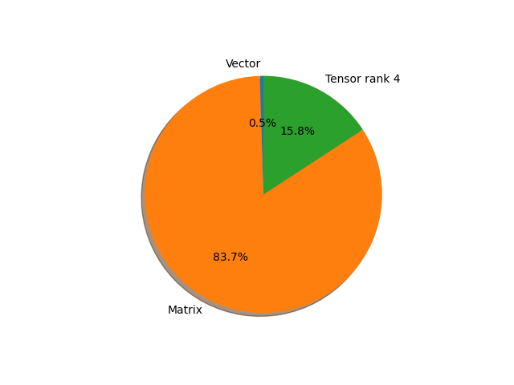

# regnet_x_1_6gf parameter information

**Number of layers: [ 179 ]**

**Number of parameters: [ 9.19M ]**

**Proportional of each form** (%)

| Vector | Matrix | Tensor rank 4 | 
|  --- | --- | --- |
| 66.48 | 22.91 | 10.61 | 

**Proportional of parameters by form** (%)

| Vector | Matrix | Tensor rank 4 | 
|  --- | --- | --- |
| 0.48 | 83.71 | 15.80 | 

**Layer information**

| Name | Shape | Squeezed shape | Number of parameters | Form |
| --- | --- | --- | --- | --- |
| stem.0.weight | (32, 3, 3, 3) | (32, 3, 3, 3) | 864 | Tensor rank 4 |
| stem.1.weight | (32,) | (32,) | 32 | Vector |
| stem.1.bias | (32,) | (32,) | 32 | Vector |
| trunk_output.block1.block1-0.proj.0.weight | (72, 32, 1, 1) | (72, 32) | 2304 | Matrix |
| trunk_output.block1.block1-0.proj.1.weight | (72,) | (72,) | 72 | Vector |
| trunk_output.block1.block1-0.proj.1.bias | (72,) | (72,) | 72 | Vector |
| trunk_output.block1.block1-0.f.a.0.weight | (72, 32, 1, 1) | (72, 32) | 2304 | Matrix |
| trunk_output.block1.block1-0.f.a.1.weight | (72,) | (72,) | 72 | Vector |
| trunk_output.block1.block1-0.f.a.1.bias | (72,) | (72,) | 72 | Vector |
| trunk_output.block1.block1-0.f.b.0.weight | (72, 24, 3, 3) | (72, 24, 3, 3) | 15552 | Tensor rank 4 |
| trunk_output.block1.block1-0.f.b.1.weight | (72,) | (72,) | 72 | Vector |
| trunk_output.block1.block1-0.f.b.1.bias | (72,) | (72,) | 72 | Vector |
| trunk_output.block1.block1-0.f.c.0.weight | (72, 72, 1, 1) | (72, 72) | 5184 | Matrix |
| trunk_output.block1.block1-0.f.c.1.weight | (72,) | (72,) | 72 | Vector |
| trunk_output.block1.block1-0.f.c.1.bias | (72,) | (72,) | 72 | Vector |
| trunk_output.block1.block1-1.f.a.0.weight | (72, 72, 1, 1) | (72, 72) | 5184 | Matrix |
| trunk_output.block1.block1-1.f.a.1.weight | (72,) | (72,) | 72 | Vector |
| trunk_output.block1.block1-1.f.a.1.bias | (72,) | (72,) | 72 | Vector |
| trunk_output.block1.block1-1.f.b.0.weight | (72, 24, 3, 3) | (72, 24, 3, 3) | 15552 | Tensor rank 4 |
| trunk_output.block1.block1-1.f.b.1.weight | (72,) | (72,) | 72 | Vector |
| trunk_output.block1.block1-1.f.b.1.bias | (72,) | (72,) | 72 | Vector |
| trunk_output.block1.block1-1.f.c.0.weight | (72, 72, 1, 1) | (72, 72) | 5184 | Matrix |
| trunk_output.block1.block1-1.f.c.1.weight | (72,) | (72,) | 72 | Vector |
| trunk_output.block1.block1-1.f.c.1.bias | (72,) | (72,) | 72 | Vector |
| trunk_output.block2.block2-0.proj.0.weight | (168, 72, 1, 1) | (168, 72) | 12096 | Matrix |
| trunk_output.block2.block2-0.proj.1.weight | (168,) | (168,) | 168 | Vector |
| trunk_output.block2.block2-0.proj.1.bias | (168,) | (168,) | 168 | Vector |
| trunk_output.block2.block2-0.f.a.0.weight | (168, 72, 1, 1) | (168, 72) | 12096 | Matrix |
| trunk_output.block2.block2-0.f.a.1.weight | (168,) | (168,) | 168 | Vector |
| trunk_output.block2.block2-0.f.a.1.bias | (168,) | (168,) | 168 | Vector |
| trunk_output.block2.block2-0.f.b.0.weight | (168, 24, 3, 3) | (168, 24, 3, 3) | 36288 | Tensor rank 4 |
| trunk_output.block2.block2-0.f.b.1.weight | (168,) | (168,) | 168 | Vector |
| trunk_output.block2.block2-0.f.b.1.bias | (168,) | (168,) | 168 | Vector |
| trunk_output.block2.block2-0.f.c.0.weight | (168, 168, 1, 1) | (168, 168) | 28224 | Matrix |
| trunk_output.block2.block2-0.f.c.1.weight | (168,) | (168,) | 168 | Vector |
| trunk_output.block2.block2-0.f.c.1.bias | (168,) | (168,) | 168 | Vector |
| trunk_output.block2.block2-1.f.a.0.weight | (168, 168, 1, 1) | (168, 168) | 28224 | Matrix |
| trunk_output.block2.block2-1.f.a.1.weight | (168,) | (168,) | 168 | Vector |
| trunk_output.block2.block2-1.f.a.1.bias | (168,) | (168,) | 168 | Vector |
| trunk_output.block2.block2-1.f.b.0.weight | (168, 24, 3, 3) | (168, 24, 3, 3) | 36288 | Tensor rank 4 |
| trunk_output.block2.block2-1.f.b.1.weight | (168,) | (168,) | 168 | Vector |
| trunk_output.block2.block2-1.f.b.1.bias | (168,) | (168,) | 168 | Vector |
| trunk_output.block2.block2-1.f.c.0.weight | (168, 168, 1, 1) | (168, 168) | 28224 | Matrix |
| trunk_output.block2.block2-1.f.c.1.weight | (168,) | (168,) | 168 | Vector |
| trunk_output.block2.block2-1.f.c.1.bias | (168,) | (168,) | 168 | Vector |
| trunk_output.block2.block2-2.f.a.0.weight | (168, 168, 1, 1) | (168, 168) | 28224 | Matrix |
| trunk_output.block2.block2-2.f.a.1.weight | (168,) | (168,) | 168 | Vector |
| trunk_output.block2.block2-2.f.a.1.bias | (168,) | (168,) | 168 | Vector |
| trunk_output.block2.block2-2.f.b.0.weight | (168, 24, 3, 3) | (168, 24, 3, 3) | 36288 | Tensor rank 4 |
| trunk_output.block2.block2-2.f.b.1.weight | (168,) | (168,) | 168 | Vector |
| trunk_output.block2.block2-2.f.b.1.bias | (168,) | (168,) | 168 | Vector |
| trunk_output.block2.block2-2.f.c.0.weight | (168, 168, 1, 1) | (168, 168) | 28224 | Matrix |
| trunk_output.block2.block2-2.f.c.1.weight | (168,) | (168,) | 168 | Vector |
| trunk_output.block2.block2-2.f.c.1.bias | (168,) | (168,) | 168 | Vector |
| trunk_output.block2.block2-3.f.a.0.weight | (168, 168, 1, 1) | (168, 168) | 28224 | Matrix |
| trunk_output.block2.block2-3.f.a.1.weight | (168,) | (168,) | 168 | Vector |
| trunk_output.block2.block2-3.f.a.1.bias | (168,) | (168,) | 168 | Vector |
| trunk_output.block2.block2-3.f.b.0.weight | (168, 24, 3, 3) | (168, 24, 3, 3) | 36288 | Tensor rank 4 |
| trunk_output.block2.block2-3.f.b.1.weight | (168,) | (168,) | 168 | Vector |
| trunk_output.block2.block2-3.f.b.1.bias | (168,) | (168,) | 168 | Vector |
| trunk_output.block2.block2-3.f.c.0.weight | (168, 168, 1, 1) | (168, 168) | 28224 | Matrix |
| trunk_output.block2.block2-3.f.c.1.weight | (168,) | (168,) | 168 | Vector |
| trunk_output.block2.block2-3.f.c.1.bias | (168,) | (168,) | 168 | Vector |
| trunk_output.block3.block3-0.proj.0.weight | (408, 168, 1, 1) | (408, 168) | 68544 | Matrix |
| trunk_output.block3.block3-0.proj.1.weight | (408,) | (408,) | 408 | Vector |
| trunk_output.block3.block3-0.proj.1.bias | (408,) | (408,) | 408 | Vector |
| trunk_output.block3.block3-0.f.a.0.weight | (408, 168, 1, 1) | (408, 168) | 68544 | Matrix |
| trunk_output.block3.block3-0.f.a.1.weight | (408,) | (408,) | 408 | Vector |
| trunk_output.block3.block3-0.f.a.1.bias | (408,) | (408,) | 408 | Vector |
| trunk_output.block3.block3-0.f.b.0.weight | (408, 24, 3, 3) | (408, 24, 3, 3) | 88128 | Tensor rank 4 |
| trunk_output.block3.block3-0.f.b.1.weight | (408,) | (408,) | 408 | Vector |
| trunk_output.block3.block3-0.f.b.1.bias | (408,) | (408,) | 408 | Vector |
| trunk_output.block3.block3-0.f.c.0.weight | (408, 408, 1, 1) | (408, 408) | 166464 | Matrix |
| trunk_output.block3.block3-0.f.c.1.weight | (408,) | (408,) | 408 | Vector |
| trunk_output.block3.block3-0.f.c.1.bias | (408,) | (408,) | 408 | Vector |
| trunk_output.block3.block3-1.f.a.0.weight | (408, 408, 1, 1) | (408, 408) | 166464 | Matrix |
| trunk_output.block3.block3-1.f.a.1.weight | (408,) | (408,) | 408 | Vector |
| trunk_output.block3.block3-1.f.a.1.bias | (408,) | (408,) | 408 | Vector |
| trunk_output.block3.block3-1.f.b.0.weight | (408, 24, 3, 3) | (408, 24, 3, 3) | 88128 | Tensor rank 4 |
| trunk_output.block3.block3-1.f.b.1.weight | (408,) | (408,) | 408 | Vector |
| trunk_output.block3.block3-1.f.b.1.bias | (408,) | (408,) | 408 | Vector |
| trunk_output.block3.block3-1.f.c.0.weight | (408, 408, 1, 1) | (408, 408) | 166464 | Matrix |
| trunk_output.block3.block3-1.f.c.1.weight | (408,) | (408,) | 408 | Vector |
| trunk_output.block3.block3-1.f.c.1.bias | (408,) | (408,) | 408 | Vector |
| trunk_output.block3.block3-2.f.a.0.weight | (408, 408, 1, 1) | (408, 408) | 166464 | Matrix |
| trunk_output.block3.block3-2.f.a.1.weight | (408,) | (408,) | 408 | Vector |
| trunk_output.block3.block3-2.f.a.1.bias | (408,) | (408,) | 408 | Vector |
| trunk_output.block3.block3-2.f.b.0.weight | (408, 24, 3, 3) | (408, 24, 3, 3) | 88128 | Tensor rank 4 |
| trunk_output.block3.block3-2.f.b.1.weight | (408,) | (408,) | 408 | Vector |
| trunk_output.block3.block3-2.f.b.1.bias | (408,) | (408,) | 408 | Vector |
| trunk_output.block3.block3-2.f.c.0.weight | (408, 408, 1, 1) | (408, 408) | 166464 | Matrix |
| trunk_output.block3.block3-2.f.c.1.weight | (408,) | (408,) | 408 | Vector |
| trunk_output.block3.block3-2.f.c.1.bias | (408,) | (408,) | 408 | Vector |
| trunk_output.block3.block3-3.f.a.0.weight | (408, 408, 1, 1) | (408, 408) | 166464 | Matrix |
| trunk_output.block3.block3-3.f.a.1.weight | (408,) | (408,) | 408 | Vector |
| trunk_output.block3.block3-3.f.a.1.bias | (408,) | (408,) | 408 | Vector |
| trunk_output.block3.block3-3.f.b.0.weight | (408, 24, 3, 3) | (408, 24, 3, 3) | 88128 | Tensor rank 4 |
| trunk_output.block3.block3-3.f.b.1.weight | (408,) | (408,) | 408 | Vector |
| trunk_output.block3.block3-3.f.b.1.bias | (408,) | (408,) | 408 | Vector |
| trunk_output.block3.block3-3.f.c.0.weight | (408, 408, 1, 1) | (408, 408) | 166464 | Matrix |
| trunk_output.block3.block3-3.f.c.1.weight | (408,) | (408,) | 408 | Vector |
| trunk_output.block3.block3-3.f.c.1.bias | (408,) | (408,) | 408 | Vector |
| trunk_output.block3.block3-4.f.a.0.weight | (408, 408, 1, 1) | (408, 408) | 166464 | Matrix |
| trunk_output.block3.block3-4.f.a.1.weight | (408,) | (408,) | 408 | Vector |
| trunk_output.block3.block3-4.f.a.1.bias | (408,) | (408,) | 408 | Vector |
| trunk_output.block3.block3-4.f.b.0.weight | (408, 24, 3, 3) | (408, 24, 3, 3) | 88128 | Tensor rank 4 |
| trunk_output.block3.block3-4.f.b.1.weight | (408,) | (408,) | 408 | Vector |
| trunk_output.block3.block3-4.f.b.1.bias | (408,) | (408,) | 408 | Vector |
| trunk_output.block3.block3-4.f.c.0.weight | (408, 408, 1, 1) | (408, 408) | 166464 | Matrix |
| trunk_output.block3.block3-4.f.c.1.weight | (408,) | (408,) | 408 | Vector |
| trunk_output.block3.block3-4.f.c.1.bias | (408,) | (408,) | 408 | Vector |
| trunk_output.block3.block3-5.f.a.0.weight | (408, 408, 1, 1) | (408, 408) | 166464 | Matrix |
| trunk_output.block3.block3-5.f.a.1.weight | (408,) | (408,) | 408 | Vector |
| trunk_output.block3.block3-5.f.a.1.bias | (408,) | (408,) | 408 | Vector |
| trunk_output.block3.block3-5.f.b.0.weight | (408, 24, 3, 3) | (408, 24, 3, 3) | 88128 | Tensor rank 4 |
| trunk_output.block3.block3-5.f.b.1.weight | (408,) | (408,) | 408 | Vector |
| trunk_output.block3.block3-5.f.b.1.bias | (408,) | (408,) | 408 | Vector |
| trunk_output.block3.block3-5.f.c.0.weight | (408, 408, 1, 1) | (408, 408) | 166464 | Matrix |
| trunk_output.block3.block3-5.f.c.1.weight | (408,) | (408,) | 408 | Vector |
| trunk_output.block3.block3-5.f.c.1.bias | (408,) | (408,) | 408 | Vector |
| trunk_output.block3.block3-6.f.a.0.weight | (408, 408, 1, 1) | (408, 408) | 166464 | Matrix |
| trunk_output.block3.block3-6.f.a.1.weight | (408,) | (408,) | 408 | Vector |
| trunk_output.block3.block3-6.f.a.1.bias | (408,) | (408,) | 408 | Vector |
| trunk_output.block3.block3-6.f.b.0.weight | (408, 24, 3, 3) | (408, 24, 3, 3) | 88128 | Tensor rank 4 |
| trunk_output.block3.block3-6.f.b.1.weight | (408,) | (408,) | 408 | Vector |
| trunk_output.block3.block3-6.f.b.1.bias | (408,) | (408,) | 408 | Vector |
| trunk_output.block3.block3-6.f.c.0.weight | (408, 408, 1, 1) | (408, 408) | 166464 | Matrix |
| trunk_output.block3.block3-6.f.c.1.weight | (408,) | (408,) | 408 | Vector |
| trunk_output.block3.block3-6.f.c.1.bias | (408,) | (408,) | 408 | Vector |
| trunk_output.block3.block3-7.f.a.0.weight | (408, 408, 1, 1) | (408, 408) | 166464 | Matrix |
| trunk_output.block3.block3-7.f.a.1.weight | (408,) | (408,) | 408 | Vector |
| trunk_output.block3.block3-7.f.a.1.bias | (408,) | (408,) | 408 | Vector |
| trunk_output.block3.block3-7.f.b.0.weight | (408, 24, 3, 3) | (408, 24, 3, 3) | 88128 | Tensor rank 4 |
| trunk_output.block3.block3-7.f.b.1.weight | (408,) | (408,) | 408 | Vector |
| trunk_output.block3.block3-7.f.b.1.bias | (408,) | (408,) | 408 | Vector |
| trunk_output.block3.block3-7.f.c.0.weight | (408, 408, 1, 1) | (408, 408) | 166464 | Matrix |
| trunk_output.block3.block3-7.f.c.1.weight | (408,) | (408,) | 408 | Vector |
| trunk_output.block3.block3-7.f.c.1.bias | (408,) | (408,) | 408 | Vector |
| trunk_output.block3.block3-8.f.a.0.weight | (408, 408, 1, 1) | (408, 408) | 166464 | Matrix |
| trunk_output.block3.block3-8.f.a.1.weight | (408,) | (408,) | 408 | Vector |
| trunk_output.block3.block3-8.f.a.1.bias | (408,) | (408,) | 408 | Vector |
| trunk_output.block3.block3-8.f.b.0.weight | (408, 24, 3, 3) | (408, 24, 3, 3) | 88128 | Tensor rank 4 |
| trunk_output.block3.block3-8.f.b.1.weight | (408,) | (408,) | 408 | Vector |
| trunk_output.block3.block3-8.f.b.1.bias | (408,) | (408,) | 408 | Vector |
| trunk_output.block3.block3-8.f.c.0.weight | (408, 408, 1, 1) | (408, 408) | 166464 | Matrix |
| trunk_output.block3.block3-8.f.c.1.weight | (408,) | (408,) | 408 | Vector |
| trunk_output.block3.block3-8.f.c.1.bias | (408,) | (408,) | 408 | Vector |
| trunk_output.block3.block3-9.f.a.0.weight | (408, 408, 1, 1) | (408, 408) | 166464 | Matrix |
| trunk_output.block3.block3-9.f.a.1.weight | (408,) | (408,) | 408 | Vector |
| trunk_output.block3.block3-9.f.a.1.bias | (408,) | (408,) | 408 | Vector |
| trunk_output.block3.block3-9.f.b.0.weight | (408, 24, 3, 3) | (408, 24, 3, 3) | 88128 | Tensor rank 4 |
| trunk_output.block3.block3-9.f.b.1.weight | (408,) | (408,) | 408 | Vector |
| trunk_output.block3.block3-9.f.b.1.bias | (408,) | (408,) | 408 | Vector |
| trunk_output.block3.block3-9.f.c.0.weight | (408, 408, 1, 1) | (408, 408) | 166464 | Matrix |
| trunk_output.block3.block3-9.f.c.1.weight | (408,) | (408,) | 408 | Vector |
| trunk_output.block3.block3-9.f.c.1.bias | (408,) | (408,) | 408 | Vector |
| trunk_output.block4.block4-0.proj.0.weight | (912, 408, 1, 1) | (912, 408) | 372096 | Matrix |
| trunk_output.block4.block4-0.proj.1.weight | (912,) | (912,) | 912 | Vector |
| trunk_output.block4.block4-0.proj.1.bias | (912,) | (912,) | 912 | Vector |
| trunk_output.block4.block4-0.f.a.0.weight | (912, 408, 1, 1) | (912, 408) | 372096 | Matrix |
| trunk_output.block4.block4-0.f.a.1.weight | (912,) | (912,) | 912 | Vector |
| trunk_output.block4.block4-0.f.a.1.bias | (912,) | (912,) | 912 | Vector |
| trunk_output.block4.block4-0.f.b.0.weight | (912, 24, 3, 3) | (912, 24, 3, 3) | 196992 | Tensor rank 4 |
| trunk_output.block4.block4-0.f.b.1.weight | (912,) | (912,) | 912 | Vector |
| trunk_output.block4.block4-0.f.b.1.bias | (912,) | (912,) | 912 | Vector |
| trunk_output.block4.block4-0.f.c.0.weight | (912, 912, 1, 1) | (912, 912) | 831744 | Matrix |
| trunk_output.block4.block4-0.f.c.1.weight | (912,) | (912,) | 912 | Vector |
| trunk_output.block4.block4-0.f.c.1.bias | (912,) | (912,) | 912 | Vector |
| trunk_output.block4.block4-1.f.a.0.weight | (912, 912, 1, 1) | (912, 912) | 831744 | Matrix |
| trunk_output.block4.block4-1.f.a.1.weight | (912,) | (912,) | 912 | Vector |
| trunk_output.block4.block4-1.f.a.1.bias | (912,) | (912,) | 912 | Vector |
| trunk_output.block4.block4-1.f.b.0.weight | (912, 24, 3, 3) | (912, 24, 3, 3) | 196992 | Tensor rank 4 |
| trunk_output.block4.block4-1.f.b.1.weight | (912,) | (912,) | 912 | Vector |
| trunk_output.block4.block4-1.f.b.1.bias | (912,) | (912,) | 912 | Vector |
| trunk_output.block4.block4-1.f.c.0.weight | (912, 912, 1, 1) | (912, 912) | 831744 | Matrix |
| trunk_output.block4.block4-1.f.c.1.weight | (912,) | (912,) | 912 | Vector |
| trunk_output.block4.block4-1.f.c.1.bias | (912,) | (912,) | 912 | Vector |
| fc.weight | (1000, 912) | (1000, 912) | 912000 | Matrix |
| fc.bias | (1000,) | (1000,) | 1000 | Vector |

