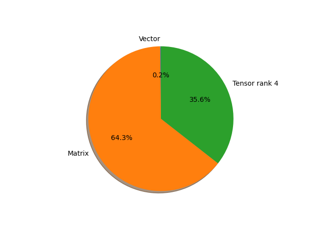

# regnet_x_32gf parameter information

**Number of layers: [ 224 ]**

**Number of parameters: [ 107.81M ]**

**Proportional of each form** (%)

| Vector | Matrix | Tensor rank 4 | 
|  --- | --- | --- |
| 66.52 | 22.77 | 10.71 | 

**Proportional of parameters by form** (%)

| Vector | Matrix | Tensor rank 4 | 
|  --- | --- | --- |
| 0.15 | 64.27 | 35.58 | 

**Layer information**

| Name | Shape | Squeezed shape | Number of parameters | Form |
| --- | --- | --- | --- | --- |
| stem.0.weight | (32, 3, 3, 3) | (32, 3, 3, 3) | 864 | Tensor rank 4 |
| stem.1.weight | (32,) | (32,) | 32 | Vector |
| stem.1.bias | (32,) | (32,) | 32 | Vector |
| trunk_output.block1.block1-0.proj.0.weight | (336, 32, 1, 1) | (336, 32) | 10752 | Matrix |
| trunk_output.block1.block1-0.proj.1.weight | (336,) | (336,) | 336 | Vector |
| trunk_output.block1.block1-0.proj.1.bias | (336,) | (336,) | 336 | Vector |
| trunk_output.block1.block1-0.f.a.0.weight | (336, 32, 1, 1) | (336, 32) | 10752 | Matrix |
| trunk_output.block1.block1-0.f.a.1.weight | (336,) | (336,) | 336 | Vector |
| trunk_output.block1.block1-0.f.a.1.bias | (336,) | (336,) | 336 | Vector |
| trunk_output.block1.block1-0.f.b.0.weight | (336, 168, 3, 3) | (336, 168, 3, 3) | 508032 | Tensor rank 4 |
| trunk_output.block1.block1-0.f.b.1.weight | (336,) | (336,) | 336 | Vector |
| trunk_output.block1.block1-0.f.b.1.bias | (336,) | (336,) | 336 | Vector |
| trunk_output.block1.block1-0.f.c.0.weight | (336, 336, 1, 1) | (336, 336) | 112896 | Matrix |
| trunk_output.block1.block1-0.f.c.1.weight | (336,) | (336,) | 336 | Vector |
| trunk_output.block1.block1-0.f.c.1.bias | (336,) | (336,) | 336 | Vector |
| trunk_output.block1.block1-1.f.a.0.weight | (336, 336, 1, 1) | (336, 336) | 112896 | Matrix |
| trunk_output.block1.block1-1.f.a.1.weight | (336,) | (336,) | 336 | Vector |
| trunk_output.block1.block1-1.f.a.1.bias | (336,) | (336,) | 336 | Vector |
| trunk_output.block1.block1-1.f.b.0.weight | (336, 168, 3, 3) | (336, 168, 3, 3) | 508032 | Tensor rank 4 |
| trunk_output.block1.block1-1.f.b.1.weight | (336,) | (336,) | 336 | Vector |
| trunk_output.block1.block1-1.f.b.1.bias | (336,) | (336,) | 336 | Vector |
| trunk_output.block1.block1-1.f.c.0.weight | (336, 336, 1, 1) | (336, 336) | 112896 | Matrix |
| trunk_output.block1.block1-1.f.c.1.weight | (336,) | (336,) | 336 | Vector |
| trunk_output.block1.block1-1.f.c.1.bias | (336,) | (336,) | 336 | Vector |
| trunk_output.block2.block2-0.proj.0.weight | (672, 336, 1, 1) | (672, 336) | 225792 | Matrix |
| trunk_output.block2.block2-0.proj.1.weight | (672,) | (672,) | 672 | Vector |
| trunk_output.block2.block2-0.proj.1.bias | (672,) | (672,) | 672 | Vector |
| trunk_output.block2.block2-0.f.a.0.weight | (672, 336, 1, 1) | (672, 336) | 225792 | Matrix |
| trunk_output.block2.block2-0.f.a.1.weight | (672,) | (672,) | 672 | Vector |
| trunk_output.block2.block2-0.f.a.1.bias | (672,) | (672,) | 672 | Vector |
| trunk_output.block2.block2-0.f.b.0.weight | (672, 168, 3, 3) | (672, 168, 3, 3) | 1016064 | Tensor rank 4 |
| trunk_output.block2.block2-0.f.b.1.weight | (672,) | (672,) | 672 | Vector |
| trunk_output.block2.block2-0.f.b.1.bias | (672,) | (672,) | 672 | Vector |
| trunk_output.block2.block2-0.f.c.0.weight | (672, 672, 1, 1) | (672, 672) | 451584 | Matrix |
| trunk_output.block2.block2-0.f.c.1.weight | (672,) | (672,) | 672 | Vector |
| trunk_output.block2.block2-0.f.c.1.bias | (672,) | (672,) | 672 | Vector |
| trunk_output.block2.block2-1.f.a.0.weight | (672, 672, 1, 1) | (672, 672) | 451584 | Matrix |
| trunk_output.block2.block2-1.f.a.1.weight | (672,) | (672,) | 672 | Vector |
| trunk_output.block2.block2-1.f.a.1.bias | (672,) | (672,) | 672 | Vector |
| trunk_output.block2.block2-1.f.b.0.weight | (672, 168, 3, 3) | (672, 168, 3, 3) | 1016064 | Tensor rank 4 |
| trunk_output.block2.block2-1.f.b.1.weight | (672,) | (672,) | 672 | Vector |
| trunk_output.block2.block2-1.f.b.1.bias | (672,) | (672,) | 672 | Vector |
| trunk_output.block2.block2-1.f.c.0.weight | (672, 672, 1, 1) | (672, 672) | 451584 | Matrix |
| trunk_output.block2.block2-1.f.c.1.weight | (672,) | (672,) | 672 | Vector |
| trunk_output.block2.block2-1.f.c.1.bias | (672,) | (672,) | 672 | Vector |
| trunk_output.block2.block2-2.f.a.0.weight | (672, 672, 1, 1) | (672, 672) | 451584 | Matrix |
| trunk_output.block2.block2-2.f.a.1.weight | (672,) | (672,) | 672 | Vector |
| trunk_output.block2.block2-2.f.a.1.bias | (672,) | (672,) | 672 | Vector |
| trunk_output.block2.block2-2.f.b.0.weight | (672, 168, 3, 3) | (672, 168, 3, 3) | 1016064 | Tensor rank 4 |
| trunk_output.block2.block2-2.f.b.1.weight | (672,) | (672,) | 672 | Vector |
| trunk_output.block2.block2-2.f.b.1.bias | (672,) | (672,) | 672 | Vector |
| trunk_output.block2.block2-2.f.c.0.weight | (672, 672, 1, 1) | (672, 672) | 451584 | Matrix |
| trunk_output.block2.block2-2.f.c.1.weight | (672,) | (672,) | 672 | Vector |
| trunk_output.block2.block2-2.f.c.1.bias | (672,) | (672,) | 672 | Vector |
| trunk_output.block2.block2-3.f.a.0.weight | (672, 672, 1, 1) | (672, 672) | 451584 | Matrix |
| trunk_output.block2.block2-3.f.a.1.weight | (672,) | (672,) | 672 | Vector |
| trunk_output.block2.block2-3.f.a.1.bias | (672,) | (672,) | 672 | Vector |
| trunk_output.block2.block2-3.f.b.0.weight | (672, 168, 3, 3) | (672, 168, 3, 3) | 1016064 | Tensor rank 4 |
| trunk_output.block2.block2-3.f.b.1.weight | (672,) | (672,) | 672 | Vector |
| trunk_output.block2.block2-3.f.b.1.bias | (672,) | (672,) | 672 | Vector |
| trunk_output.block2.block2-3.f.c.0.weight | (672, 672, 1, 1) | (672, 672) | 451584 | Matrix |
| trunk_output.block2.block2-3.f.c.1.weight | (672,) | (672,) | 672 | Vector |
| trunk_output.block2.block2-3.f.c.1.bias | (672,) | (672,) | 672 | Vector |
| trunk_output.block2.block2-4.f.a.0.weight | (672, 672, 1, 1) | (672, 672) | 451584 | Matrix |
| trunk_output.block2.block2-4.f.a.1.weight | (672,) | (672,) | 672 | Vector |
| trunk_output.block2.block2-4.f.a.1.bias | (672,) | (672,) | 672 | Vector |
| trunk_output.block2.block2-4.f.b.0.weight | (672, 168, 3, 3) | (672, 168, 3, 3) | 1016064 | Tensor rank 4 |
| trunk_output.block2.block2-4.f.b.1.weight | (672,) | (672,) | 672 | Vector |
| trunk_output.block2.block2-4.f.b.1.bias | (672,) | (672,) | 672 | Vector |
| trunk_output.block2.block2-4.f.c.0.weight | (672, 672, 1, 1) | (672, 672) | 451584 | Matrix |
| trunk_output.block2.block2-4.f.c.1.weight | (672,) | (672,) | 672 | Vector |
| trunk_output.block2.block2-4.f.c.1.bias | (672,) | (672,) | 672 | Vector |
| trunk_output.block2.block2-5.f.a.0.weight | (672, 672, 1, 1) | (672, 672) | 451584 | Matrix |
| trunk_output.block2.block2-5.f.a.1.weight | (672,) | (672,) | 672 | Vector |
| trunk_output.block2.block2-5.f.a.1.bias | (672,) | (672,) | 672 | Vector |
| trunk_output.block2.block2-5.f.b.0.weight | (672, 168, 3, 3) | (672, 168, 3, 3) | 1016064 | Tensor rank 4 |
| trunk_output.block2.block2-5.f.b.1.weight | (672,) | (672,) | 672 | Vector |
| trunk_output.block2.block2-5.f.b.1.bias | (672,) | (672,) | 672 | Vector |
| trunk_output.block2.block2-5.f.c.0.weight | (672, 672, 1, 1) | (672, 672) | 451584 | Matrix |
| trunk_output.block2.block2-5.f.c.1.weight | (672,) | (672,) | 672 | Vector |
| trunk_output.block2.block2-5.f.c.1.bias | (672,) | (672,) | 672 | Vector |
| trunk_output.block2.block2-6.f.a.0.weight | (672, 672, 1, 1) | (672, 672) | 451584 | Matrix |
| trunk_output.block2.block2-6.f.a.1.weight | (672,) | (672,) | 672 | Vector |
| trunk_output.block2.block2-6.f.a.1.bias | (672,) | (672,) | 672 | Vector |
| trunk_output.block2.block2-6.f.b.0.weight | (672, 168, 3, 3) | (672, 168, 3, 3) | 1016064 | Tensor rank 4 |
| trunk_output.block2.block2-6.f.b.1.weight | (672,) | (672,) | 672 | Vector |
| trunk_output.block2.block2-6.f.b.1.bias | (672,) | (672,) | 672 | Vector |
| trunk_output.block2.block2-6.f.c.0.weight | (672, 672, 1, 1) | (672, 672) | 451584 | Matrix |
| trunk_output.block2.block2-6.f.c.1.weight | (672,) | (672,) | 672 | Vector |
| trunk_output.block2.block2-6.f.c.1.bias | (672,) | (672,) | 672 | Vector |
| trunk_output.block3.block3-0.proj.0.weight | (1344, 672, 1, 1) | (1344, 672) | 903168 | Matrix |
| trunk_output.block3.block3-0.proj.1.weight | (1344,) | (1344,) | 1344 | Vector |
| trunk_output.block3.block3-0.proj.1.bias | (1344,) | (1344,) | 1344 | Vector |
| trunk_output.block3.block3-0.f.a.0.weight | (1344, 672, 1, 1) | (1344, 672) | 903168 | Matrix |
| trunk_output.block3.block3-0.f.a.1.weight | (1344,) | (1344,) | 1344 | Vector |
| trunk_output.block3.block3-0.f.a.1.bias | (1344,) | (1344,) | 1344 | Vector |
| trunk_output.block3.block3-0.f.b.0.weight | (1344, 168, 3, 3) | (1344, 168, 3, 3) | 2032128 | Tensor rank 4 |
| trunk_output.block3.block3-0.f.b.1.weight | (1344,) | (1344,) | 1344 | Vector |
| trunk_output.block3.block3-0.f.b.1.bias | (1344,) | (1344,) | 1344 | Vector |
| trunk_output.block3.block3-0.f.c.0.weight | (1344, 1344, 1, 1) | (1344, 1344) | 1806336 | Matrix |
| trunk_output.block3.block3-0.f.c.1.weight | (1344,) | (1344,) | 1344 | Vector |
| trunk_output.block3.block3-0.f.c.1.bias | (1344,) | (1344,) | 1344 | Vector |
| trunk_output.block3.block3-1.f.a.0.weight | (1344, 1344, 1, 1) | (1344, 1344) | 1806336 | Matrix |
| trunk_output.block3.block3-1.f.a.1.weight | (1344,) | (1344,) | 1344 | Vector |
| trunk_output.block3.block3-1.f.a.1.bias | (1344,) | (1344,) | 1344 | Vector |
| trunk_output.block3.block3-1.f.b.0.weight | (1344, 168, 3, 3) | (1344, 168, 3, 3) | 2032128 | Tensor rank 4 |
| trunk_output.block3.block3-1.f.b.1.weight | (1344,) | (1344,) | 1344 | Vector |
| trunk_output.block3.block3-1.f.b.1.bias | (1344,) | (1344,) | 1344 | Vector |
| trunk_output.block3.block3-1.f.c.0.weight | (1344, 1344, 1, 1) | (1344, 1344) | 1806336 | Matrix |
| trunk_output.block3.block3-1.f.c.1.weight | (1344,) | (1344,) | 1344 | Vector |
| trunk_output.block3.block3-1.f.c.1.bias | (1344,) | (1344,) | 1344 | Vector |
| trunk_output.block3.block3-2.f.a.0.weight | (1344, 1344, 1, 1) | (1344, 1344) | 1806336 | Matrix |
| trunk_output.block3.block3-2.f.a.1.weight | (1344,) | (1344,) | 1344 | Vector |
| trunk_output.block3.block3-2.f.a.1.bias | (1344,) | (1344,) | 1344 | Vector |
| trunk_output.block3.block3-2.f.b.0.weight | (1344, 168, 3, 3) | (1344, 168, 3, 3) | 2032128 | Tensor rank 4 |
| trunk_output.block3.block3-2.f.b.1.weight | (1344,) | (1344,) | 1344 | Vector |
| trunk_output.block3.block3-2.f.b.1.bias | (1344,) | (1344,) | 1344 | Vector |
| trunk_output.block3.block3-2.f.c.0.weight | (1344, 1344, 1, 1) | (1344, 1344) | 1806336 | Matrix |
| trunk_output.block3.block3-2.f.c.1.weight | (1344,) | (1344,) | 1344 | Vector |
| trunk_output.block3.block3-2.f.c.1.bias | (1344,) | (1344,) | 1344 | Vector |
| trunk_output.block3.block3-3.f.a.0.weight | (1344, 1344, 1, 1) | (1344, 1344) | 1806336 | Matrix |
| trunk_output.block3.block3-3.f.a.1.weight | (1344,) | (1344,) | 1344 | Vector |
| trunk_output.block3.block3-3.f.a.1.bias | (1344,) | (1344,) | 1344 | Vector |
| trunk_output.block3.block3-3.f.b.0.weight | (1344, 168, 3, 3) | (1344, 168, 3, 3) | 2032128 | Tensor rank 4 |
| trunk_output.block3.block3-3.f.b.1.weight | (1344,) | (1344,) | 1344 | Vector |
| trunk_output.block3.block3-3.f.b.1.bias | (1344,) | (1344,) | 1344 | Vector |
| trunk_output.block3.block3-3.f.c.0.weight | (1344, 1344, 1, 1) | (1344, 1344) | 1806336 | Matrix |
| trunk_output.block3.block3-3.f.c.1.weight | (1344,) | (1344,) | 1344 | Vector |
| trunk_output.block3.block3-3.f.c.1.bias | (1344,) | (1344,) | 1344 | Vector |
| trunk_output.block3.block3-4.f.a.0.weight | (1344, 1344, 1, 1) | (1344, 1344) | 1806336 | Matrix |
| trunk_output.block3.block3-4.f.a.1.weight | (1344,) | (1344,) | 1344 | Vector |
| trunk_output.block3.block3-4.f.a.1.bias | (1344,) | (1344,) | 1344 | Vector |
| trunk_output.block3.block3-4.f.b.0.weight | (1344, 168, 3, 3) | (1344, 168, 3, 3) | 2032128 | Tensor rank 4 |
| trunk_output.block3.block3-4.f.b.1.weight | (1344,) | (1344,) | 1344 | Vector |
| trunk_output.block3.block3-4.f.b.1.bias | (1344,) | (1344,) | 1344 | Vector |
| trunk_output.block3.block3-4.f.c.0.weight | (1344, 1344, 1, 1) | (1344, 1344) | 1806336 | Matrix |
| trunk_output.block3.block3-4.f.c.1.weight | (1344,) | (1344,) | 1344 | Vector |
| trunk_output.block3.block3-4.f.c.1.bias | (1344,) | (1344,) | 1344 | Vector |
| trunk_output.block3.block3-5.f.a.0.weight | (1344, 1344, 1, 1) | (1344, 1344) | 1806336 | Matrix |
| trunk_output.block3.block3-5.f.a.1.weight | (1344,) | (1344,) | 1344 | Vector |
| trunk_output.block3.block3-5.f.a.1.bias | (1344,) | (1344,) | 1344 | Vector |
| trunk_output.block3.block3-5.f.b.0.weight | (1344, 168, 3, 3) | (1344, 168, 3, 3) | 2032128 | Tensor rank 4 |
| trunk_output.block3.block3-5.f.b.1.weight | (1344,) | (1344,) | 1344 | Vector |
| trunk_output.block3.block3-5.f.b.1.bias | (1344,) | (1344,) | 1344 | Vector |
| trunk_output.block3.block3-5.f.c.0.weight | (1344, 1344, 1, 1) | (1344, 1344) | 1806336 | Matrix |
| trunk_output.block3.block3-5.f.c.1.weight | (1344,) | (1344,) | 1344 | Vector |
| trunk_output.block3.block3-5.f.c.1.bias | (1344,) | (1344,) | 1344 | Vector |
| trunk_output.block3.block3-6.f.a.0.weight | (1344, 1344, 1, 1) | (1344, 1344) | 1806336 | Matrix |
| trunk_output.block3.block3-6.f.a.1.weight | (1344,) | (1344,) | 1344 | Vector |
| trunk_output.block3.block3-6.f.a.1.bias | (1344,) | (1344,) | 1344 | Vector |
| trunk_output.block3.block3-6.f.b.0.weight | (1344, 168, 3, 3) | (1344, 168, 3, 3) | 2032128 | Tensor rank 4 |
| trunk_output.block3.block3-6.f.b.1.weight | (1344,) | (1344,) | 1344 | Vector |
| trunk_output.block3.block3-6.f.b.1.bias | (1344,) | (1344,) | 1344 | Vector |
| trunk_output.block3.block3-6.f.c.0.weight | (1344, 1344, 1, 1) | (1344, 1344) | 1806336 | Matrix |
| trunk_output.block3.block3-6.f.c.1.weight | (1344,) | (1344,) | 1344 | Vector |
| trunk_output.block3.block3-6.f.c.1.bias | (1344,) | (1344,) | 1344 | Vector |
| trunk_output.block3.block3-7.f.a.0.weight | (1344, 1344, 1, 1) | (1344, 1344) | 1806336 | Matrix |
| trunk_output.block3.block3-7.f.a.1.weight | (1344,) | (1344,) | 1344 | Vector |
| trunk_output.block3.block3-7.f.a.1.bias | (1344,) | (1344,) | 1344 | Vector |
| trunk_output.block3.block3-7.f.b.0.weight | (1344, 168, 3, 3) | (1344, 168, 3, 3) | 2032128 | Tensor rank 4 |
| trunk_output.block3.block3-7.f.b.1.weight | (1344,) | (1344,) | 1344 | Vector |
| trunk_output.block3.block3-7.f.b.1.bias | (1344,) | (1344,) | 1344 | Vector |
| trunk_output.block3.block3-7.f.c.0.weight | (1344, 1344, 1, 1) | (1344, 1344) | 1806336 | Matrix |
| trunk_output.block3.block3-7.f.c.1.weight | (1344,) | (1344,) | 1344 | Vector |
| trunk_output.block3.block3-7.f.c.1.bias | (1344,) | (1344,) | 1344 | Vector |
| trunk_output.block3.block3-8.f.a.0.weight | (1344, 1344, 1, 1) | (1344, 1344) | 1806336 | Matrix |
| trunk_output.block3.block3-8.f.a.1.weight | (1344,) | (1344,) | 1344 | Vector |
| trunk_output.block3.block3-8.f.a.1.bias | (1344,) | (1344,) | 1344 | Vector |
| trunk_output.block3.block3-8.f.b.0.weight | (1344, 168, 3, 3) | (1344, 168, 3, 3) | 2032128 | Tensor rank 4 |
| trunk_output.block3.block3-8.f.b.1.weight | (1344,) | (1344,) | 1344 | Vector |
| trunk_output.block3.block3-8.f.b.1.bias | (1344,) | (1344,) | 1344 | Vector |
| trunk_output.block3.block3-8.f.c.0.weight | (1344, 1344, 1, 1) | (1344, 1344) | 1806336 | Matrix |
| trunk_output.block3.block3-8.f.c.1.weight | (1344,) | (1344,) | 1344 | Vector |
| trunk_output.block3.block3-8.f.c.1.bias | (1344,) | (1344,) | 1344 | Vector |
| trunk_output.block3.block3-9.f.a.0.weight | (1344, 1344, 1, 1) | (1344, 1344) | 1806336 | Matrix |
| trunk_output.block3.block3-9.f.a.1.weight | (1344,) | (1344,) | 1344 | Vector |
| trunk_output.block3.block3-9.f.a.1.bias | (1344,) | (1344,) | 1344 | Vector |
| trunk_output.block3.block3-9.f.b.0.weight | (1344, 168, 3, 3) | (1344, 168, 3, 3) | 2032128 | Tensor rank 4 |
| trunk_output.block3.block3-9.f.b.1.weight | (1344,) | (1344,) | 1344 | Vector |
| trunk_output.block3.block3-9.f.b.1.bias | (1344,) | (1344,) | 1344 | Vector |
| trunk_output.block3.block3-9.f.c.0.weight | (1344, 1344, 1, 1) | (1344, 1344) | 1806336 | Matrix |
| trunk_output.block3.block3-9.f.c.1.weight | (1344,) | (1344,) | 1344 | Vector |
| trunk_output.block3.block3-9.f.c.1.bias | (1344,) | (1344,) | 1344 | Vector |
| trunk_output.block3.block3-10.f.a.0.weight | (1344, 1344, 1, 1) | (1344, 1344) | 1806336 | Matrix |
| trunk_output.block3.block3-10.f.a.1.weight | (1344,) | (1344,) | 1344 | Vector |
| trunk_output.block3.block3-10.f.a.1.bias | (1344,) | (1344,) | 1344 | Vector |
| trunk_output.block3.block3-10.f.b.0.weight | (1344, 168, 3, 3) | (1344, 168, 3, 3) | 2032128 | Tensor rank 4 |
| trunk_output.block3.block3-10.f.b.1.weight | (1344,) | (1344,) | 1344 | Vector |
| trunk_output.block3.block3-10.f.b.1.bias | (1344,) | (1344,) | 1344 | Vector |
| trunk_output.block3.block3-10.f.c.0.weight | (1344, 1344, 1, 1) | (1344, 1344) | 1806336 | Matrix |
| trunk_output.block3.block3-10.f.c.1.weight | (1344,) | (1344,) | 1344 | Vector |
| trunk_output.block3.block3-10.f.c.1.bias | (1344,) | (1344,) | 1344 | Vector |
| trunk_output.block3.block3-11.f.a.0.weight | (1344, 1344, 1, 1) | (1344, 1344) | 1806336 | Matrix |
| trunk_output.block3.block3-11.f.a.1.weight | (1344,) | (1344,) | 1344 | Vector |
| trunk_output.block3.block3-11.f.a.1.bias | (1344,) | (1344,) | 1344 | Vector |
| trunk_output.block3.block3-11.f.b.0.weight | (1344, 168, 3, 3) | (1344, 168, 3, 3) | 2032128 | Tensor rank 4 |
| trunk_output.block3.block3-11.f.b.1.weight | (1344,) | (1344,) | 1344 | Vector |
| trunk_output.block3.block3-11.f.b.1.bias | (1344,) | (1344,) | 1344 | Vector |
| trunk_output.block3.block3-11.f.c.0.weight | (1344, 1344, 1, 1) | (1344, 1344) | 1806336 | Matrix |
| trunk_output.block3.block3-11.f.c.1.weight | (1344,) | (1344,) | 1344 | Vector |
| trunk_output.block3.block3-11.f.c.1.bias | (1344,) | (1344,) | 1344 | Vector |
| trunk_output.block3.block3-12.f.a.0.weight | (1344, 1344, 1, 1) | (1344, 1344) | 1806336 | Matrix |
| trunk_output.block3.block3-12.f.a.1.weight | (1344,) | (1344,) | 1344 | Vector |
| trunk_output.block3.block3-12.f.a.1.bias | (1344,) | (1344,) | 1344 | Vector |
| trunk_output.block3.block3-12.f.b.0.weight | (1344, 168, 3, 3) | (1344, 168, 3, 3) | 2032128 | Tensor rank 4 |
| trunk_output.block3.block3-12.f.b.1.weight | (1344,) | (1344,) | 1344 | Vector |
| trunk_output.block3.block3-12.f.b.1.bias | (1344,) | (1344,) | 1344 | Vector |
| trunk_output.block3.block3-12.f.c.0.weight | (1344, 1344, 1, 1) | (1344, 1344) | 1806336 | Matrix |
| trunk_output.block3.block3-12.f.c.1.weight | (1344,) | (1344,) | 1344 | Vector |
| trunk_output.block3.block3-12.f.c.1.bias | (1344,) | (1344,) | 1344 | Vector |
| trunk_output.block4.block4-0.proj.0.weight | (2520, 1344, 1, 1) | (2520, 1344) | 3386880 | Matrix |
| trunk_output.block4.block4-0.proj.1.weight | (2520,) | (2520,) | 2520 | Vector |
| trunk_output.block4.block4-0.proj.1.bias | (2520,) | (2520,) | 2520 | Vector |
| trunk_output.block4.block4-0.f.a.0.weight | (2520, 1344, 1, 1) | (2520, 1344) | 3386880 | Matrix |
| trunk_output.block4.block4-0.f.a.1.weight | (2520,) | (2520,) | 2520 | Vector |
| trunk_output.block4.block4-0.f.a.1.bias | (2520,) | (2520,) | 2520 | Vector |
| trunk_output.block4.block4-0.f.b.0.weight | (2520, 168, 3, 3) | (2520, 168, 3, 3) | 3810240 | Tensor rank 4 |
| trunk_output.block4.block4-0.f.b.1.weight | (2520,) | (2520,) | 2520 | Vector |
| trunk_output.block4.block4-0.f.b.1.bias | (2520,) | (2520,) | 2520 | Vector |
| trunk_output.block4.block4-0.f.c.0.weight | (2520, 2520, 1, 1) | (2520, 2520) | 6350400 | Matrix |
| trunk_output.block4.block4-0.f.c.1.weight | (2520,) | (2520,) | 2520 | Vector |
| trunk_output.block4.block4-0.f.c.1.bias | (2520,) | (2520,) | 2520 | Vector |
| fc.weight | (1000, 2520) | (1000, 2520) | 2520000 | Matrix |
| fc.bias | (1000,) | (1000,) | 1000 | Vector |

