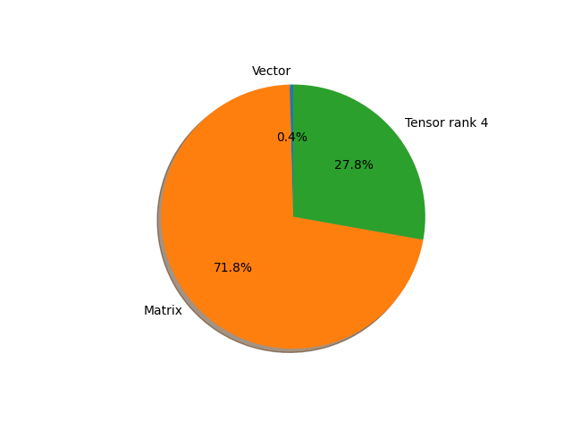

# regnet_x_3_2gf parameter information

**Number of layers: [ 242 ]**

**Number of parameters: [ 15.30M ]**

**Proportional of each form** (%)

| Vector | Matrix | Tensor rank 4 | 
|  --- | --- | --- |
| 66.53 | 22.73 | 10.74 | 

**Proportional of parameters by form** (%)

| Vector | Matrix | Tensor rank 4 | 
|  --- | --- | --- |
| 0.42 | 71.79 | 27.80 | 

**Layer information**

| Name | Shape | Squeezed shape | Number of parameters | Form |
| --- | --- | --- | --- | --- |
| stem.0.weight | (32, 3, 3, 3) | (32, 3, 3, 3) | 864 | Tensor rank 4 |
| stem.1.weight | (32,) | (32,) | 32 | Vector |
| stem.1.bias | (32,) | (32,) | 32 | Vector |
| trunk_output.block1.block1-0.proj.0.weight | (96, 32, 1, 1) | (96, 32) | 3072 | Matrix |
| trunk_output.block1.block1-0.proj.1.weight | (96,) | (96,) | 96 | Vector |
| trunk_output.block1.block1-0.proj.1.bias | (96,) | (96,) | 96 | Vector |
| trunk_output.block1.block1-0.f.a.0.weight | (96, 32, 1, 1) | (96, 32) | 3072 | Matrix |
| trunk_output.block1.block1-0.f.a.1.weight | (96,) | (96,) | 96 | Vector |
| trunk_output.block1.block1-0.f.a.1.bias | (96,) | (96,) | 96 | Vector |
| trunk_output.block1.block1-0.f.b.0.weight | (96, 48, 3, 3) | (96, 48, 3, 3) | 41472 | Tensor rank 4 |
| trunk_output.block1.block1-0.f.b.1.weight | (96,) | (96,) | 96 | Vector |
| trunk_output.block1.block1-0.f.b.1.bias | (96,) | (96,) | 96 | Vector |
| trunk_output.block1.block1-0.f.c.0.weight | (96, 96, 1, 1) | (96, 96) | 9216 | Matrix |
| trunk_output.block1.block1-0.f.c.1.weight | (96,) | (96,) | 96 | Vector |
| trunk_output.block1.block1-0.f.c.1.bias | (96,) | (96,) | 96 | Vector |
| trunk_output.block1.block1-1.f.a.0.weight | (96, 96, 1, 1) | (96, 96) | 9216 | Matrix |
| trunk_output.block1.block1-1.f.a.1.weight | (96,) | (96,) | 96 | Vector |
| trunk_output.block1.block1-1.f.a.1.bias | (96,) | (96,) | 96 | Vector |
| trunk_output.block1.block1-1.f.b.0.weight | (96, 48, 3, 3) | (96, 48, 3, 3) | 41472 | Tensor rank 4 |
| trunk_output.block1.block1-1.f.b.1.weight | (96,) | (96,) | 96 | Vector |
| trunk_output.block1.block1-1.f.b.1.bias | (96,) | (96,) | 96 | Vector |
| trunk_output.block1.block1-1.f.c.0.weight | (96, 96, 1, 1) | (96, 96) | 9216 | Matrix |
| trunk_output.block1.block1-1.f.c.1.weight | (96,) | (96,) | 96 | Vector |
| trunk_output.block1.block1-1.f.c.1.bias | (96,) | (96,) | 96 | Vector |
| trunk_output.block2.block2-0.proj.0.weight | (192, 96, 1, 1) | (192, 96) | 18432 | Matrix |
| trunk_output.block2.block2-0.proj.1.weight | (192,) | (192,) | 192 | Vector |
| trunk_output.block2.block2-0.proj.1.bias | (192,) | (192,) | 192 | Vector |
| trunk_output.block2.block2-0.f.a.0.weight | (192, 96, 1, 1) | (192, 96) | 18432 | Matrix |
| trunk_output.block2.block2-0.f.a.1.weight | (192,) | (192,) | 192 | Vector |
| trunk_output.block2.block2-0.f.a.1.bias | (192,) | (192,) | 192 | Vector |
| trunk_output.block2.block2-0.f.b.0.weight | (192, 48, 3, 3) | (192, 48, 3, 3) | 82944 | Tensor rank 4 |
| trunk_output.block2.block2-0.f.b.1.weight | (192,) | (192,) | 192 | Vector |
| trunk_output.block2.block2-0.f.b.1.bias | (192,) | (192,) | 192 | Vector |
| trunk_output.block2.block2-0.f.c.0.weight | (192, 192, 1, 1) | (192, 192) | 36864 | Matrix |
| trunk_output.block2.block2-0.f.c.1.weight | (192,) | (192,) | 192 | Vector |
| trunk_output.block2.block2-0.f.c.1.bias | (192,) | (192,) | 192 | Vector |
| trunk_output.block2.block2-1.f.a.0.weight | (192, 192, 1, 1) | (192, 192) | 36864 | Matrix |
| trunk_output.block2.block2-1.f.a.1.weight | (192,) | (192,) | 192 | Vector |
| trunk_output.block2.block2-1.f.a.1.bias | (192,) | (192,) | 192 | Vector |
| trunk_output.block2.block2-1.f.b.0.weight | (192, 48, 3, 3) | (192, 48, 3, 3) | 82944 | Tensor rank 4 |
| trunk_output.block2.block2-1.f.b.1.weight | (192,) | (192,) | 192 | Vector |
| trunk_output.block2.block2-1.f.b.1.bias | (192,) | (192,) | 192 | Vector |
| trunk_output.block2.block2-1.f.c.0.weight | (192, 192, 1, 1) | (192, 192) | 36864 | Matrix |
| trunk_output.block2.block2-1.f.c.1.weight | (192,) | (192,) | 192 | Vector |
| trunk_output.block2.block2-1.f.c.1.bias | (192,) | (192,) | 192 | Vector |
| trunk_output.block2.block2-2.f.a.0.weight | (192, 192, 1, 1) | (192, 192) | 36864 | Matrix |
| trunk_output.block2.block2-2.f.a.1.weight | (192,) | (192,) | 192 | Vector |
| trunk_output.block2.block2-2.f.a.1.bias | (192,) | (192,) | 192 | Vector |
| trunk_output.block2.block2-2.f.b.0.weight | (192, 48, 3, 3) | (192, 48, 3, 3) | 82944 | Tensor rank 4 |
| trunk_output.block2.block2-2.f.b.1.weight | (192,) | (192,) | 192 | Vector |
| trunk_output.block2.block2-2.f.b.1.bias | (192,) | (192,) | 192 | Vector |
| trunk_output.block2.block2-2.f.c.0.weight | (192, 192, 1, 1) | (192, 192) | 36864 | Matrix |
| trunk_output.block2.block2-2.f.c.1.weight | (192,) | (192,) | 192 | Vector |
| trunk_output.block2.block2-2.f.c.1.bias | (192,) | (192,) | 192 | Vector |
| trunk_output.block2.block2-3.f.a.0.weight | (192, 192, 1, 1) | (192, 192) | 36864 | Matrix |
| trunk_output.block2.block2-3.f.a.1.weight | (192,) | (192,) | 192 | Vector |
| trunk_output.block2.block2-3.f.a.1.bias | (192,) | (192,) | 192 | Vector |
| trunk_output.block2.block2-3.f.b.0.weight | (192, 48, 3, 3) | (192, 48, 3, 3) | 82944 | Tensor rank 4 |
| trunk_output.block2.block2-3.f.b.1.weight | (192,) | (192,) | 192 | Vector |
| trunk_output.block2.block2-3.f.b.1.bias | (192,) | (192,) | 192 | Vector |
| trunk_output.block2.block2-3.f.c.0.weight | (192, 192, 1, 1) | (192, 192) | 36864 | Matrix |
| trunk_output.block2.block2-3.f.c.1.weight | (192,) | (192,) | 192 | Vector |
| trunk_output.block2.block2-3.f.c.1.bias | (192,) | (192,) | 192 | Vector |
| trunk_output.block2.block2-4.f.a.0.weight | (192, 192, 1, 1) | (192, 192) | 36864 | Matrix |
| trunk_output.block2.block2-4.f.a.1.weight | (192,) | (192,) | 192 | Vector |
| trunk_output.block2.block2-4.f.a.1.bias | (192,) | (192,) | 192 | Vector |
| trunk_output.block2.block2-4.f.b.0.weight | (192, 48, 3, 3) | (192, 48, 3, 3) | 82944 | Tensor rank 4 |
| trunk_output.block2.block2-4.f.b.1.weight | (192,) | (192,) | 192 | Vector |
| trunk_output.block2.block2-4.f.b.1.bias | (192,) | (192,) | 192 | Vector |
| trunk_output.block2.block2-4.f.c.0.weight | (192, 192, 1, 1) | (192, 192) | 36864 | Matrix |
| trunk_output.block2.block2-4.f.c.1.weight | (192,) | (192,) | 192 | Vector |
| trunk_output.block2.block2-4.f.c.1.bias | (192,) | (192,) | 192 | Vector |
| trunk_output.block2.block2-5.f.a.0.weight | (192, 192, 1, 1) | (192, 192) | 36864 | Matrix |
| trunk_output.block2.block2-5.f.a.1.weight | (192,) | (192,) | 192 | Vector |
| trunk_output.block2.block2-5.f.a.1.bias | (192,) | (192,) | 192 | Vector |
| trunk_output.block2.block2-5.f.b.0.weight | (192, 48, 3, 3) | (192, 48, 3, 3) | 82944 | Tensor rank 4 |
| trunk_output.block2.block2-5.f.b.1.weight | (192,) | (192,) | 192 | Vector |
| trunk_output.block2.block2-5.f.b.1.bias | (192,) | (192,) | 192 | Vector |
| trunk_output.block2.block2-5.f.c.0.weight | (192, 192, 1, 1) | (192, 192) | 36864 | Matrix |
| trunk_output.block2.block2-5.f.c.1.weight | (192,) | (192,) | 192 | Vector |
| trunk_output.block2.block2-5.f.c.1.bias | (192,) | (192,) | 192 | Vector |
| trunk_output.block3.block3-0.proj.0.weight | (432, 192, 1, 1) | (432, 192) | 82944 | Matrix |
| trunk_output.block3.block3-0.proj.1.weight | (432,) | (432,) | 432 | Vector |
| trunk_output.block3.block3-0.proj.1.bias | (432,) | (432,) | 432 | Vector |
| trunk_output.block3.block3-0.f.a.0.weight | (432, 192, 1, 1) | (432, 192) | 82944 | Matrix |
| trunk_output.block3.block3-0.f.a.1.weight | (432,) | (432,) | 432 | Vector |
| trunk_output.block3.block3-0.f.a.1.bias | (432,) | (432,) | 432 | Vector |
| trunk_output.block3.block3-0.f.b.0.weight | (432, 48, 3, 3) | (432, 48, 3, 3) | 186624 | Tensor rank 4 |
| trunk_output.block3.block3-0.f.b.1.weight | (432,) | (432,) | 432 | Vector |
| trunk_output.block3.block3-0.f.b.1.bias | (432,) | (432,) | 432 | Vector |
| trunk_output.block3.block3-0.f.c.0.weight | (432, 432, 1, 1) | (432, 432) | 186624 | Matrix |
| trunk_output.block3.block3-0.f.c.1.weight | (432,) | (432,) | 432 | Vector |
| trunk_output.block3.block3-0.f.c.1.bias | (432,) | (432,) | 432 | Vector |
| trunk_output.block3.block3-1.f.a.0.weight | (432, 432, 1, 1) | (432, 432) | 186624 | Matrix |
| trunk_output.block3.block3-1.f.a.1.weight | (432,) | (432,) | 432 | Vector |
| trunk_output.block3.block3-1.f.a.1.bias | (432,) | (432,) | 432 | Vector |
| trunk_output.block3.block3-1.f.b.0.weight | (432, 48, 3, 3) | (432, 48, 3, 3) | 186624 | Tensor rank 4 |
| trunk_output.block3.block3-1.f.b.1.weight | (432,) | (432,) | 432 | Vector |
| trunk_output.block3.block3-1.f.b.1.bias | (432,) | (432,) | 432 | Vector |
| trunk_output.block3.block3-1.f.c.0.weight | (432, 432, 1, 1) | (432, 432) | 186624 | Matrix |
| trunk_output.block3.block3-1.f.c.1.weight | (432,) | (432,) | 432 | Vector |
| trunk_output.block3.block3-1.f.c.1.bias | (432,) | (432,) | 432 | Vector |
| trunk_output.block3.block3-2.f.a.0.weight | (432, 432, 1, 1) | (432, 432) | 186624 | Matrix |
| trunk_output.block3.block3-2.f.a.1.weight | (432,) | (432,) | 432 | Vector |
| trunk_output.block3.block3-2.f.a.1.bias | (432,) | (432,) | 432 | Vector |
| trunk_output.block3.block3-2.f.b.0.weight | (432, 48, 3, 3) | (432, 48, 3, 3) | 186624 | Tensor rank 4 |
| trunk_output.block3.block3-2.f.b.1.weight | (432,) | (432,) | 432 | Vector |
| trunk_output.block3.block3-2.f.b.1.bias | (432,) | (432,) | 432 | Vector |
| trunk_output.block3.block3-2.f.c.0.weight | (432, 432, 1, 1) | (432, 432) | 186624 | Matrix |
| trunk_output.block3.block3-2.f.c.1.weight | (432,) | (432,) | 432 | Vector |
| trunk_output.block3.block3-2.f.c.1.bias | (432,) | (432,) | 432 | Vector |
| trunk_output.block3.block3-3.f.a.0.weight | (432, 432, 1, 1) | (432, 432) | 186624 | Matrix |
| trunk_output.block3.block3-3.f.a.1.weight | (432,) | (432,) | 432 | Vector |
| trunk_output.block3.block3-3.f.a.1.bias | (432,) | (432,) | 432 | Vector |
| trunk_output.block3.block3-3.f.b.0.weight | (432, 48, 3, 3) | (432, 48, 3, 3) | 186624 | Tensor rank 4 |
| trunk_output.block3.block3-3.f.b.1.weight | (432,) | (432,) | 432 | Vector |
| trunk_output.block3.block3-3.f.b.1.bias | (432,) | (432,) | 432 | Vector |
| trunk_output.block3.block3-3.f.c.0.weight | (432, 432, 1, 1) | (432, 432) | 186624 | Matrix |
| trunk_output.block3.block3-3.f.c.1.weight | (432,) | (432,) | 432 | Vector |
| trunk_output.block3.block3-3.f.c.1.bias | (432,) | (432,) | 432 | Vector |
| trunk_output.block3.block3-4.f.a.0.weight | (432, 432, 1, 1) | (432, 432) | 186624 | Matrix |
| trunk_output.block3.block3-4.f.a.1.weight | (432,) | (432,) | 432 | Vector |
| trunk_output.block3.block3-4.f.a.1.bias | (432,) | (432,) | 432 | Vector |
| trunk_output.block3.block3-4.f.b.0.weight | (432, 48, 3, 3) | (432, 48, 3, 3) | 186624 | Tensor rank 4 |
| trunk_output.block3.block3-4.f.b.1.weight | (432,) | (432,) | 432 | Vector |
| trunk_output.block3.block3-4.f.b.1.bias | (432,) | (432,) | 432 | Vector |
| trunk_output.block3.block3-4.f.c.0.weight | (432, 432, 1, 1) | (432, 432) | 186624 | Matrix |
| trunk_output.block3.block3-4.f.c.1.weight | (432,) | (432,) | 432 | Vector |
| trunk_output.block3.block3-4.f.c.1.bias | (432,) | (432,) | 432 | Vector |
| trunk_output.block3.block3-5.f.a.0.weight | (432, 432, 1, 1) | (432, 432) | 186624 | Matrix |
| trunk_output.block3.block3-5.f.a.1.weight | (432,) | (432,) | 432 | Vector |
| trunk_output.block3.block3-5.f.a.1.bias | (432,) | (432,) | 432 | Vector |
| trunk_output.block3.block3-5.f.b.0.weight | (432, 48, 3, 3) | (432, 48, 3, 3) | 186624 | Tensor rank 4 |
| trunk_output.block3.block3-5.f.b.1.weight | (432,) | (432,) | 432 | Vector |
| trunk_output.block3.block3-5.f.b.1.bias | (432,) | (432,) | 432 | Vector |
| trunk_output.block3.block3-5.f.c.0.weight | (432, 432, 1, 1) | (432, 432) | 186624 | Matrix |
| trunk_output.block3.block3-5.f.c.1.weight | (432,) | (432,) | 432 | Vector |
| trunk_output.block3.block3-5.f.c.1.bias | (432,) | (432,) | 432 | Vector |
| trunk_output.block3.block3-6.f.a.0.weight | (432, 432, 1, 1) | (432, 432) | 186624 | Matrix |
| trunk_output.block3.block3-6.f.a.1.weight | (432,) | (432,) | 432 | Vector |
| trunk_output.block3.block3-6.f.a.1.bias | (432,) | (432,) | 432 | Vector |
| trunk_output.block3.block3-6.f.b.0.weight | (432, 48, 3, 3) | (432, 48, 3, 3) | 186624 | Tensor rank 4 |
| trunk_output.block3.block3-6.f.b.1.weight | (432,) | (432,) | 432 | Vector |
| trunk_output.block3.block3-6.f.b.1.bias | (432,) | (432,) | 432 | Vector |
| trunk_output.block3.block3-6.f.c.0.weight | (432, 432, 1, 1) | (432, 432) | 186624 | Matrix |
| trunk_output.block3.block3-6.f.c.1.weight | (432,) | (432,) | 432 | Vector |
| trunk_output.block3.block3-6.f.c.1.bias | (432,) | (432,) | 432 | Vector |
| trunk_output.block3.block3-7.f.a.0.weight | (432, 432, 1, 1) | (432, 432) | 186624 | Matrix |
| trunk_output.block3.block3-7.f.a.1.weight | (432,) | (432,) | 432 | Vector |
| trunk_output.block3.block3-7.f.a.1.bias | (432,) | (432,) | 432 | Vector |
| trunk_output.block3.block3-7.f.b.0.weight | (432, 48, 3, 3) | (432, 48, 3, 3) | 186624 | Tensor rank 4 |
| trunk_output.block3.block3-7.f.b.1.weight | (432,) | (432,) | 432 | Vector |
| trunk_output.block3.block3-7.f.b.1.bias | (432,) | (432,) | 432 | Vector |
| trunk_output.block3.block3-7.f.c.0.weight | (432, 432, 1, 1) | (432, 432) | 186624 | Matrix |
| trunk_output.block3.block3-7.f.c.1.weight | (432,) | (432,) | 432 | Vector |
| trunk_output.block3.block3-7.f.c.1.bias | (432,) | (432,) | 432 | Vector |
| trunk_output.block3.block3-8.f.a.0.weight | (432, 432, 1, 1) | (432, 432) | 186624 | Matrix |
| trunk_output.block3.block3-8.f.a.1.weight | (432,) | (432,) | 432 | Vector |
| trunk_output.block3.block3-8.f.a.1.bias | (432,) | (432,) | 432 | Vector |
| trunk_output.block3.block3-8.f.b.0.weight | (432, 48, 3, 3) | (432, 48, 3, 3) | 186624 | Tensor rank 4 |
| trunk_output.block3.block3-8.f.b.1.weight | (432,) | (432,) | 432 | Vector |
| trunk_output.block3.block3-8.f.b.1.bias | (432,) | (432,) | 432 | Vector |
| trunk_output.block3.block3-8.f.c.0.weight | (432, 432, 1, 1) | (432, 432) | 186624 | Matrix |
| trunk_output.block3.block3-8.f.c.1.weight | (432,) | (432,) | 432 | Vector |
| trunk_output.block3.block3-8.f.c.1.bias | (432,) | (432,) | 432 | Vector |
| trunk_output.block3.block3-9.f.a.0.weight | (432, 432, 1, 1) | (432, 432) | 186624 | Matrix |
| trunk_output.block3.block3-9.f.a.1.weight | (432,) | (432,) | 432 | Vector |
| trunk_output.block3.block3-9.f.a.1.bias | (432,) | (432,) | 432 | Vector |
| trunk_output.block3.block3-9.f.b.0.weight | (432, 48, 3, 3) | (432, 48, 3, 3) | 186624 | Tensor rank 4 |
| trunk_output.block3.block3-9.f.b.1.weight | (432,) | (432,) | 432 | Vector |
| trunk_output.block3.block3-9.f.b.1.bias | (432,) | (432,) | 432 | Vector |
| trunk_output.block3.block3-9.f.c.0.weight | (432, 432, 1, 1) | (432, 432) | 186624 | Matrix |
| trunk_output.block3.block3-9.f.c.1.weight | (432,) | (432,) | 432 | Vector |
| trunk_output.block3.block3-9.f.c.1.bias | (432,) | (432,) | 432 | Vector |
| trunk_output.block3.block3-10.f.a.0.weight | (432, 432, 1, 1) | (432, 432) | 186624 | Matrix |
| trunk_output.block3.block3-10.f.a.1.weight | (432,) | (432,) | 432 | Vector |
| trunk_output.block3.block3-10.f.a.1.bias | (432,) | (432,) | 432 | Vector |
| trunk_output.block3.block3-10.f.b.0.weight | (432, 48, 3, 3) | (432, 48, 3, 3) | 186624 | Tensor rank 4 |
| trunk_output.block3.block3-10.f.b.1.weight | (432,) | (432,) | 432 | Vector |
| trunk_output.block3.block3-10.f.b.1.bias | (432,) | (432,) | 432 | Vector |
| trunk_output.block3.block3-10.f.c.0.weight | (432, 432, 1, 1) | (432, 432) | 186624 | Matrix |
| trunk_output.block3.block3-10.f.c.1.weight | (432,) | (432,) | 432 | Vector |
| trunk_output.block3.block3-10.f.c.1.bias | (432,) | (432,) | 432 | Vector |
| trunk_output.block3.block3-11.f.a.0.weight | (432, 432, 1, 1) | (432, 432) | 186624 | Matrix |
| trunk_output.block3.block3-11.f.a.1.weight | (432,) | (432,) | 432 | Vector |
| trunk_output.block3.block3-11.f.a.1.bias | (432,) | (432,) | 432 | Vector |
| trunk_output.block3.block3-11.f.b.0.weight | (432, 48, 3, 3) | (432, 48, 3, 3) | 186624 | Tensor rank 4 |
| trunk_output.block3.block3-11.f.b.1.weight | (432,) | (432,) | 432 | Vector |
| trunk_output.block3.block3-11.f.b.1.bias | (432,) | (432,) | 432 | Vector |
| trunk_output.block3.block3-11.f.c.0.weight | (432, 432, 1, 1) | (432, 432) | 186624 | Matrix |
| trunk_output.block3.block3-11.f.c.1.weight | (432,) | (432,) | 432 | Vector |
| trunk_output.block3.block3-11.f.c.1.bias | (432,) | (432,) | 432 | Vector |
| trunk_output.block3.block3-12.f.a.0.weight | (432, 432, 1, 1) | (432, 432) | 186624 | Matrix |
| trunk_output.block3.block3-12.f.a.1.weight | (432,) | (432,) | 432 | Vector |
| trunk_output.block3.block3-12.f.a.1.bias | (432,) | (432,) | 432 | Vector |
| trunk_output.block3.block3-12.f.b.0.weight | (432, 48, 3, 3) | (432, 48, 3, 3) | 186624 | Tensor rank 4 |
| trunk_output.block3.block3-12.f.b.1.weight | (432,) | (432,) | 432 | Vector |
| trunk_output.block3.block3-12.f.b.1.bias | (432,) | (432,) | 432 | Vector |
| trunk_output.block3.block3-12.f.c.0.weight | (432, 432, 1, 1) | (432, 432) | 186624 | Matrix |
| trunk_output.block3.block3-12.f.c.1.weight | (432,) | (432,) | 432 | Vector |
| trunk_output.block3.block3-12.f.c.1.bias | (432,) | (432,) | 432 | Vector |
| trunk_output.block3.block3-13.f.a.0.weight | (432, 432, 1, 1) | (432, 432) | 186624 | Matrix |
| trunk_output.block3.block3-13.f.a.1.weight | (432,) | (432,) | 432 | Vector |
| trunk_output.block3.block3-13.f.a.1.bias | (432,) | (432,) | 432 | Vector |
| trunk_output.block3.block3-13.f.b.0.weight | (432, 48, 3, 3) | (432, 48, 3, 3) | 186624 | Tensor rank 4 |
| trunk_output.block3.block3-13.f.b.1.weight | (432,) | (432,) | 432 | Vector |
| trunk_output.block3.block3-13.f.b.1.bias | (432,) | (432,) | 432 | Vector |
| trunk_output.block3.block3-13.f.c.0.weight | (432, 432, 1, 1) | (432, 432) | 186624 | Matrix |
| trunk_output.block3.block3-13.f.c.1.weight | (432,) | (432,) | 432 | Vector |
| trunk_output.block3.block3-13.f.c.1.bias | (432,) | (432,) | 432 | Vector |
| trunk_output.block3.block3-14.f.a.0.weight | (432, 432, 1, 1) | (432, 432) | 186624 | Matrix |
| trunk_output.block3.block3-14.f.a.1.weight | (432,) | (432,) | 432 | Vector |
| trunk_output.block3.block3-14.f.a.1.bias | (432,) | (432,) | 432 | Vector |
| trunk_output.block3.block3-14.f.b.0.weight | (432, 48, 3, 3) | (432, 48, 3, 3) | 186624 | Tensor rank 4 |
| trunk_output.block3.block3-14.f.b.1.weight | (432,) | (432,) | 432 | Vector |
| trunk_output.block3.block3-14.f.b.1.bias | (432,) | (432,) | 432 | Vector |
| trunk_output.block3.block3-14.f.c.0.weight | (432, 432, 1, 1) | (432, 432) | 186624 | Matrix |
| trunk_output.block3.block3-14.f.c.1.weight | (432,) | (432,) | 432 | Vector |
| trunk_output.block3.block3-14.f.c.1.bias | (432,) | (432,) | 432 | Vector |
| trunk_output.block4.block4-0.proj.0.weight | (1008, 432, 1, 1) | (1008, 432) | 435456 | Matrix |
| trunk_output.block4.block4-0.proj.1.weight | (1008,) | (1008,) | 1008 | Vector |
| trunk_output.block4.block4-0.proj.1.bias | (1008,) | (1008,) | 1008 | Vector |
| trunk_output.block4.block4-0.f.a.0.weight | (1008, 432, 1, 1) | (1008, 432) | 435456 | Matrix |
| trunk_output.block4.block4-0.f.a.1.weight | (1008,) | (1008,) | 1008 | Vector |
| trunk_output.block4.block4-0.f.a.1.bias | (1008,) | (1008,) | 1008 | Vector |
| trunk_output.block4.block4-0.f.b.0.weight | (1008, 48, 3, 3) | (1008, 48, 3, 3) | 435456 | Tensor rank 4 |
| trunk_output.block4.block4-0.f.b.1.weight | (1008,) | (1008,) | 1008 | Vector |
| trunk_output.block4.block4-0.f.b.1.bias | (1008,) | (1008,) | 1008 | Vector |
| trunk_output.block4.block4-0.f.c.0.weight | (1008, 1008, 1, 1) | (1008, 1008) | 1016064 | Matrix |
| trunk_output.block4.block4-0.f.c.1.weight | (1008,) | (1008,) | 1008 | Vector |
| trunk_output.block4.block4-0.f.c.1.bias | (1008,) | (1008,) | 1008 | Vector |
| trunk_output.block4.block4-1.f.a.0.weight | (1008, 1008, 1, 1) | (1008, 1008) | 1016064 | Matrix |
| trunk_output.block4.block4-1.f.a.1.weight | (1008,) | (1008,) | 1008 | Vector |
| trunk_output.block4.block4-1.f.a.1.bias | (1008,) | (1008,) | 1008 | Vector |
| trunk_output.block4.block4-1.f.b.0.weight | (1008, 48, 3, 3) | (1008, 48, 3, 3) | 435456 | Tensor rank 4 |
| trunk_output.block4.block4-1.f.b.1.weight | (1008,) | (1008,) | 1008 | Vector |
| trunk_output.block4.block4-1.f.b.1.bias | (1008,) | (1008,) | 1008 | Vector |
| trunk_output.block4.block4-1.f.c.0.weight | (1008, 1008, 1, 1) | (1008, 1008) | 1016064 | Matrix |
| trunk_output.block4.block4-1.f.c.1.weight | (1008,) | (1008,) | 1008 | Vector |
| trunk_output.block4.block4-1.f.c.1.bias | (1008,) | (1008,) | 1008 | Vector |
| fc.weight | (1000, 1008) | (1000, 1008) | 1008000 | Matrix |
| fc.bias | (1000,) | (1000,) | 1000 | Vector |

