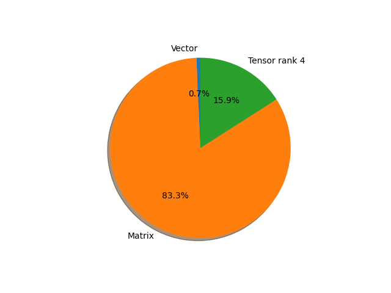

# regnet_x_400mf parameter information

**Number of layers: [ 215 ]**

**Number of parameters: [ 5.50M ]**

**Proportional of each form** (%)

| Vector | Matrix | Tensor rank 4 | 
|  --- | --- | --- |
| 66.51 | 22.79 | 10.70 | 

**Proportional of parameters by form** (%)

| Vector | Matrix | Tensor rank 4 | 
|  --- | --- | --- |
| 0.71 | 83.35 | 15.95 | 

**Layer information**

| Name | Shape | Squeezed shape | Number of parameters | Form |
| --- | --- | --- | --- | --- |
| stem.0.weight | (32, 3, 3, 3) | (32, 3, 3, 3) | 864 | Tensor rank 4 |
| stem.1.weight | (32,) | (32,) | 32 | Vector |
| stem.1.bias | (32,) | (32,) | 32 | Vector |
| trunk_output.block1.block1-0.proj.0.weight | (32, 32, 1, 1) | (32, 32) | 1024 | Matrix |
| trunk_output.block1.block1-0.proj.1.weight | (32,) | (32,) | 32 | Vector |
| trunk_output.block1.block1-0.proj.1.bias | (32,) | (32,) | 32 | Vector |
| trunk_output.block1.block1-0.f.a.0.weight | (32, 32, 1, 1) | (32, 32) | 1024 | Matrix |
| trunk_output.block1.block1-0.f.a.1.weight | (32,) | (32,) | 32 | Vector |
| trunk_output.block1.block1-0.f.a.1.bias | (32,) | (32,) | 32 | Vector |
| trunk_output.block1.block1-0.f.b.0.weight | (32, 16, 3, 3) | (32, 16, 3, 3) | 4608 | Tensor rank 4 |
| trunk_output.block1.block1-0.f.b.1.weight | (32,) | (32,) | 32 | Vector |
| trunk_output.block1.block1-0.f.b.1.bias | (32,) | (32,) | 32 | Vector |
| trunk_output.block1.block1-0.f.c.0.weight | (32, 32, 1, 1) | (32, 32) | 1024 | Matrix |
| trunk_output.block1.block1-0.f.c.1.weight | (32,) | (32,) | 32 | Vector |
| trunk_output.block1.block1-0.f.c.1.bias | (32,) | (32,) | 32 | Vector |
| trunk_output.block2.block2-0.proj.0.weight | (64, 32, 1, 1) | (64, 32) | 2048 | Matrix |
| trunk_output.block2.block2-0.proj.1.weight | (64,) | (64,) | 64 | Vector |
| trunk_output.block2.block2-0.proj.1.bias | (64,) | (64,) | 64 | Vector |
| trunk_output.block2.block2-0.f.a.0.weight | (64, 32, 1, 1) | (64, 32) | 2048 | Matrix |
| trunk_output.block2.block2-0.f.a.1.weight | (64,) | (64,) | 64 | Vector |
| trunk_output.block2.block2-0.f.a.1.bias | (64,) | (64,) | 64 | Vector |
| trunk_output.block2.block2-0.f.b.0.weight | (64, 16, 3, 3) | (64, 16, 3, 3) | 9216 | Tensor rank 4 |
| trunk_output.block2.block2-0.f.b.1.weight | (64,) | (64,) | 64 | Vector |
| trunk_output.block2.block2-0.f.b.1.bias | (64,) | (64,) | 64 | Vector |
| trunk_output.block2.block2-0.f.c.0.weight | (64, 64, 1, 1) | (64, 64) | 4096 | Matrix |
| trunk_output.block2.block2-0.f.c.1.weight | (64,) | (64,) | 64 | Vector |
| trunk_output.block2.block2-0.f.c.1.bias | (64,) | (64,) | 64 | Vector |
| trunk_output.block2.block2-1.f.a.0.weight | (64, 64, 1, 1) | (64, 64) | 4096 | Matrix |
| trunk_output.block2.block2-1.f.a.1.weight | (64,) | (64,) | 64 | Vector |
| trunk_output.block2.block2-1.f.a.1.bias | (64,) | (64,) | 64 | Vector |
| trunk_output.block2.block2-1.f.b.0.weight | (64, 16, 3, 3) | (64, 16, 3, 3) | 9216 | Tensor rank 4 |
| trunk_output.block2.block2-1.f.b.1.weight | (64,) | (64,) | 64 | Vector |
| trunk_output.block2.block2-1.f.b.1.bias | (64,) | (64,) | 64 | Vector |
| trunk_output.block2.block2-1.f.c.0.weight | (64, 64, 1, 1) | (64, 64) | 4096 | Matrix |
| trunk_output.block2.block2-1.f.c.1.weight | (64,) | (64,) | 64 | Vector |
| trunk_output.block2.block2-1.f.c.1.bias | (64,) | (64,) | 64 | Vector |
| trunk_output.block3.block3-0.proj.0.weight | (160, 64, 1, 1) | (160, 64) | 10240 | Matrix |
| trunk_output.block3.block3-0.proj.1.weight | (160,) | (160,) | 160 | Vector |
| trunk_output.block3.block3-0.proj.1.bias | (160,) | (160,) | 160 | Vector |
| trunk_output.block3.block3-0.f.a.0.weight | (160, 64, 1, 1) | (160, 64) | 10240 | Matrix |
| trunk_output.block3.block3-0.f.a.1.weight | (160,) | (160,) | 160 | Vector |
| trunk_output.block3.block3-0.f.a.1.bias | (160,) | (160,) | 160 | Vector |
| trunk_output.block3.block3-0.f.b.0.weight | (160, 16, 3, 3) | (160, 16, 3, 3) | 23040 | Tensor rank 4 |
| trunk_output.block3.block3-0.f.b.1.weight | (160,) | (160,) | 160 | Vector |
| trunk_output.block3.block3-0.f.b.1.bias | (160,) | (160,) | 160 | Vector |
| trunk_output.block3.block3-0.f.c.0.weight | (160, 160, 1, 1) | (160, 160) | 25600 | Matrix |
| trunk_output.block3.block3-0.f.c.1.weight | (160,) | (160,) | 160 | Vector |
| trunk_output.block3.block3-0.f.c.1.bias | (160,) | (160,) | 160 | Vector |
| trunk_output.block3.block3-1.f.a.0.weight | (160, 160, 1, 1) | (160, 160) | 25600 | Matrix |
| trunk_output.block3.block3-1.f.a.1.weight | (160,) | (160,) | 160 | Vector |
| trunk_output.block3.block3-1.f.a.1.bias | (160,) | (160,) | 160 | Vector |
| trunk_output.block3.block3-1.f.b.0.weight | (160, 16, 3, 3) | (160, 16, 3, 3) | 23040 | Tensor rank 4 |
| trunk_output.block3.block3-1.f.b.1.weight | (160,) | (160,) | 160 | Vector |
| trunk_output.block3.block3-1.f.b.1.bias | (160,) | (160,) | 160 | Vector |
| trunk_output.block3.block3-1.f.c.0.weight | (160, 160, 1, 1) | (160, 160) | 25600 | Matrix |
| trunk_output.block3.block3-1.f.c.1.weight | (160,) | (160,) | 160 | Vector |
| trunk_output.block3.block3-1.f.c.1.bias | (160,) | (160,) | 160 | Vector |
| trunk_output.block3.block3-2.f.a.0.weight | (160, 160, 1, 1) | (160, 160) | 25600 | Matrix |
| trunk_output.block3.block3-2.f.a.1.weight | (160,) | (160,) | 160 | Vector |
| trunk_output.block3.block3-2.f.a.1.bias | (160,) | (160,) | 160 | Vector |
| trunk_output.block3.block3-2.f.b.0.weight | (160, 16, 3, 3) | (160, 16, 3, 3) | 23040 | Tensor rank 4 |
| trunk_output.block3.block3-2.f.b.1.weight | (160,) | (160,) | 160 | Vector |
| trunk_output.block3.block3-2.f.b.1.bias | (160,) | (160,) | 160 | Vector |
| trunk_output.block3.block3-2.f.c.0.weight | (160, 160, 1, 1) | (160, 160) | 25600 | Matrix |
| trunk_output.block3.block3-2.f.c.1.weight | (160,) | (160,) | 160 | Vector |
| trunk_output.block3.block3-2.f.c.1.bias | (160,) | (160,) | 160 | Vector |
| trunk_output.block3.block3-3.f.a.0.weight | (160, 160, 1, 1) | (160, 160) | 25600 | Matrix |
| trunk_output.block3.block3-3.f.a.1.weight | (160,) | (160,) | 160 | Vector |
| trunk_output.block3.block3-3.f.a.1.bias | (160,) | (160,) | 160 | Vector |
| trunk_output.block3.block3-3.f.b.0.weight | (160, 16, 3, 3) | (160, 16, 3, 3) | 23040 | Tensor rank 4 |
| trunk_output.block3.block3-3.f.b.1.weight | (160,) | (160,) | 160 | Vector |
| trunk_output.block3.block3-3.f.b.1.bias | (160,) | (160,) | 160 | Vector |
| trunk_output.block3.block3-3.f.c.0.weight | (160, 160, 1, 1) | (160, 160) | 25600 | Matrix |
| trunk_output.block3.block3-3.f.c.1.weight | (160,) | (160,) | 160 | Vector |
| trunk_output.block3.block3-3.f.c.1.bias | (160,) | (160,) | 160 | Vector |
| trunk_output.block3.block3-4.f.a.0.weight | (160, 160, 1, 1) | (160, 160) | 25600 | Matrix |
| trunk_output.block3.block3-4.f.a.1.weight | (160,) | (160,) | 160 | Vector |
| trunk_output.block3.block3-4.f.a.1.bias | (160,) | (160,) | 160 | Vector |
| trunk_output.block3.block3-4.f.b.0.weight | (160, 16, 3, 3) | (160, 16, 3, 3) | 23040 | Tensor rank 4 |
| trunk_output.block3.block3-4.f.b.1.weight | (160,) | (160,) | 160 | Vector |
| trunk_output.block3.block3-4.f.b.1.bias | (160,) | (160,) | 160 | Vector |
| trunk_output.block3.block3-4.f.c.0.weight | (160, 160, 1, 1) | (160, 160) | 25600 | Matrix |
| trunk_output.block3.block3-4.f.c.1.weight | (160,) | (160,) | 160 | Vector |
| trunk_output.block3.block3-4.f.c.1.bias | (160,) | (160,) | 160 | Vector |
| trunk_output.block3.block3-5.f.a.0.weight | (160, 160, 1, 1) | (160, 160) | 25600 | Matrix |
| trunk_output.block3.block3-5.f.a.1.weight | (160,) | (160,) | 160 | Vector |
| trunk_output.block3.block3-5.f.a.1.bias | (160,) | (160,) | 160 | Vector |
| trunk_output.block3.block3-5.f.b.0.weight | (160, 16, 3, 3) | (160, 16, 3, 3) | 23040 | Tensor rank 4 |
| trunk_output.block3.block3-5.f.b.1.weight | (160,) | (160,) | 160 | Vector |
| trunk_output.block3.block3-5.f.b.1.bias | (160,) | (160,) | 160 | Vector |
| trunk_output.block3.block3-5.f.c.0.weight | (160, 160, 1, 1) | (160, 160) | 25600 | Matrix |
| trunk_output.block3.block3-5.f.c.1.weight | (160,) | (160,) | 160 | Vector |
| trunk_output.block3.block3-5.f.c.1.bias | (160,) | (160,) | 160 | Vector |
| trunk_output.block3.block3-6.f.a.0.weight | (160, 160, 1, 1) | (160, 160) | 25600 | Matrix |
| trunk_output.block3.block3-6.f.a.1.weight | (160,) | (160,) | 160 | Vector |
| trunk_output.block3.block3-6.f.a.1.bias | (160,) | (160,) | 160 | Vector |
| trunk_output.block3.block3-6.f.b.0.weight | (160, 16, 3, 3) | (160, 16, 3, 3) | 23040 | Tensor rank 4 |
| trunk_output.block3.block3-6.f.b.1.weight | (160,) | (160,) | 160 | Vector |
| trunk_output.block3.block3-6.f.b.1.bias | (160,) | (160,) | 160 | Vector |
| trunk_output.block3.block3-6.f.c.0.weight | (160, 160, 1, 1) | (160, 160) | 25600 | Matrix |
| trunk_output.block3.block3-6.f.c.1.weight | (160,) | (160,) | 160 | Vector |
| trunk_output.block3.block3-6.f.c.1.bias | (160,) | (160,) | 160 | Vector |
| trunk_output.block4.block4-0.proj.0.weight | (400, 160, 1, 1) | (400, 160) | 64000 | Matrix |
| trunk_output.block4.block4-0.proj.1.weight | (400,) | (400,) | 400 | Vector |
| trunk_output.block4.block4-0.proj.1.bias | (400,) | (400,) | 400 | Vector |
| trunk_output.block4.block4-0.f.a.0.weight | (400, 160, 1, 1) | (400, 160) | 64000 | Matrix |
| trunk_output.block4.block4-0.f.a.1.weight | (400,) | (400,) | 400 | Vector |
| trunk_output.block4.block4-0.f.a.1.bias | (400,) | (400,) | 400 | Vector |
| trunk_output.block4.block4-0.f.b.0.weight | (400, 16, 3, 3) | (400, 16, 3, 3) | 57600 | Tensor rank 4 |
| trunk_output.block4.block4-0.f.b.1.weight | (400,) | (400,) | 400 | Vector |
| trunk_output.block4.block4-0.f.b.1.bias | (400,) | (400,) | 400 | Vector |
| trunk_output.block4.block4-0.f.c.0.weight | (400, 400, 1, 1) | (400, 400) | 160000 | Matrix |
| trunk_output.block4.block4-0.f.c.1.weight | (400,) | (400,) | 400 | Vector |
| trunk_output.block4.block4-0.f.c.1.bias | (400,) | (400,) | 400 | Vector |
| trunk_output.block4.block4-1.f.a.0.weight | (400, 400, 1, 1) | (400, 400) | 160000 | Matrix |
| trunk_output.block4.block4-1.f.a.1.weight | (400,) | (400,) | 400 | Vector |
| trunk_output.block4.block4-1.f.a.1.bias | (400,) | (400,) | 400 | Vector |
| trunk_output.block4.block4-1.f.b.0.weight | (400, 16, 3, 3) | (400, 16, 3, 3) | 57600 | Tensor rank 4 |
| trunk_output.block4.block4-1.f.b.1.weight | (400,) | (400,) | 400 | Vector |
| trunk_output.block4.block4-1.f.b.1.bias | (400,) | (400,) | 400 | Vector |
| trunk_output.block4.block4-1.f.c.0.weight | (400, 400, 1, 1) | (400, 400) | 160000 | Matrix |
| trunk_output.block4.block4-1.f.c.1.weight | (400,) | (400,) | 400 | Vector |
| trunk_output.block4.block4-1.f.c.1.bias | (400,) | (400,) | 400 | Vector |
| trunk_output.block4.block4-2.f.a.0.weight | (400, 400, 1, 1) | (400, 400) | 160000 | Matrix |
| trunk_output.block4.block4-2.f.a.1.weight | (400,) | (400,) | 400 | Vector |
| trunk_output.block4.block4-2.f.a.1.bias | (400,) | (400,) | 400 | Vector |
| trunk_output.block4.block4-2.f.b.0.weight | (400, 16, 3, 3) | (400, 16, 3, 3) | 57600 | Tensor rank 4 |
| trunk_output.block4.block4-2.f.b.1.weight | (400,) | (400,) | 400 | Vector |
| trunk_output.block4.block4-2.f.b.1.bias | (400,) | (400,) | 400 | Vector |
| trunk_output.block4.block4-2.f.c.0.weight | (400, 400, 1, 1) | (400, 400) | 160000 | Matrix |
| trunk_output.block4.block4-2.f.c.1.weight | (400,) | (400,) | 400 | Vector |
| trunk_output.block4.block4-2.f.c.1.bias | (400,) | (400,) | 400 | Vector |
| trunk_output.block4.block4-3.f.a.0.weight | (400, 400, 1, 1) | (400, 400) | 160000 | Matrix |
| trunk_output.block4.block4-3.f.a.1.weight | (400,) | (400,) | 400 | Vector |
| trunk_output.block4.block4-3.f.a.1.bias | (400,) | (400,) | 400 | Vector |
| trunk_output.block4.block4-3.f.b.0.weight | (400, 16, 3, 3) | (400, 16, 3, 3) | 57600 | Tensor rank 4 |
| trunk_output.block4.block4-3.f.b.1.weight | (400,) | (400,) | 400 | Vector |
| trunk_output.block4.block4-3.f.b.1.bias | (400,) | (400,) | 400 | Vector |
| trunk_output.block4.block4-3.f.c.0.weight | (400, 400, 1, 1) | (400, 400) | 160000 | Matrix |
| trunk_output.block4.block4-3.f.c.1.weight | (400,) | (400,) | 400 | Vector |
| trunk_output.block4.block4-3.f.c.1.bias | (400,) | (400,) | 400 | Vector |
| trunk_output.block4.block4-4.f.a.0.weight | (400, 400, 1, 1) | (400, 400) | 160000 | Matrix |
| trunk_output.block4.block4-4.f.a.1.weight | (400,) | (400,) | 400 | Vector |
| trunk_output.block4.block4-4.f.a.1.bias | (400,) | (400,) | 400 | Vector |
| trunk_output.block4.block4-4.f.b.0.weight | (400, 16, 3, 3) | (400, 16, 3, 3) | 57600 | Tensor rank 4 |
| trunk_output.block4.block4-4.f.b.1.weight | (400,) | (400,) | 400 | Vector |
| trunk_output.block4.block4-4.f.b.1.bias | (400,) | (400,) | 400 | Vector |
| trunk_output.block4.block4-4.f.c.0.weight | (400, 400, 1, 1) | (400, 400) | 160000 | Matrix |
| trunk_output.block4.block4-4.f.c.1.weight | (400,) | (400,) | 400 | Vector |
| trunk_output.block4.block4-4.f.c.1.bias | (400,) | (400,) | 400 | Vector |
| trunk_output.block4.block4-5.f.a.0.weight | (400, 400, 1, 1) | (400, 400) | 160000 | Matrix |
| trunk_output.block4.block4-5.f.a.1.weight | (400,) | (400,) | 400 | Vector |
| trunk_output.block4.block4-5.f.a.1.bias | (400,) | (400,) | 400 | Vector |
| trunk_output.block4.block4-5.f.b.0.weight | (400, 16, 3, 3) | (400, 16, 3, 3) | 57600 | Tensor rank 4 |
| trunk_output.block4.block4-5.f.b.1.weight | (400,) | (400,) | 400 | Vector |
| trunk_output.block4.block4-5.f.b.1.bias | (400,) | (400,) | 400 | Vector |
| trunk_output.block4.block4-5.f.c.0.weight | (400, 400, 1, 1) | (400, 400) | 160000 | Matrix |
| trunk_output.block4.block4-5.f.c.1.weight | (400,) | (400,) | 400 | Vector |
| trunk_output.block4.block4-5.f.c.1.bias | (400,) | (400,) | 400 | Vector |
| trunk_output.block4.block4-6.f.a.0.weight | (400, 400, 1, 1) | (400, 400) | 160000 | Matrix |
| trunk_output.block4.block4-6.f.a.1.weight | (400,) | (400,) | 400 | Vector |
| trunk_output.block4.block4-6.f.a.1.bias | (400,) | (400,) | 400 | Vector |
| trunk_output.block4.block4-6.f.b.0.weight | (400, 16, 3, 3) | (400, 16, 3, 3) | 57600 | Tensor rank 4 |
| trunk_output.block4.block4-6.f.b.1.weight | (400,) | (400,) | 400 | Vector |
| trunk_output.block4.block4-6.f.b.1.bias | (400,) | (400,) | 400 | Vector |
| trunk_output.block4.block4-6.f.c.0.weight | (400, 400, 1, 1) | (400, 400) | 160000 | Matrix |
| trunk_output.block4.block4-6.f.c.1.weight | (400,) | (400,) | 400 | Vector |
| trunk_output.block4.block4-6.f.c.1.bias | (400,) | (400,) | 400 | Vector |
| trunk_output.block4.block4-7.f.a.0.weight | (400, 400, 1, 1) | (400, 400) | 160000 | Matrix |
| trunk_output.block4.block4-7.f.a.1.weight | (400,) | (400,) | 400 | Vector |
| trunk_output.block4.block4-7.f.a.1.bias | (400,) | (400,) | 400 | Vector |
| trunk_output.block4.block4-7.f.b.0.weight | (400, 16, 3, 3) | (400, 16, 3, 3) | 57600 | Tensor rank 4 |
| trunk_output.block4.block4-7.f.b.1.weight | (400,) | (400,) | 400 | Vector |
| trunk_output.block4.block4-7.f.b.1.bias | (400,) | (400,) | 400 | Vector |
| trunk_output.block4.block4-7.f.c.0.weight | (400, 400, 1, 1) | (400, 400) | 160000 | Matrix |
| trunk_output.block4.block4-7.f.c.1.weight | (400,) | (400,) | 400 | Vector |
| trunk_output.block4.block4-7.f.c.1.bias | (400,) | (400,) | 400 | Vector |
| trunk_output.block4.block4-8.f.a.0.weight | (400, 400, 1, 1) | (400, 400) | 160000 | Matrix |
| trunk_output.block4.block4-8.f.a.1.weight | (400,) | (400,) | 400 | Vector |
| trunk_output.block4.block4-8.f.a.1.bias | (400,) | (400,) | 400 | Vector |
| trunk_output.block4.block4-8.f.b.0.weight | (400, 16, 3, 3) | (400, 16, 3, 3) | 57600 | Tensor rank 4 |
| trunk_output.block4.block4-8.f.b.1.weight | (400,) | (400,) | 400 | Vector |
| trunk_output.block4.block4-8.f.b.1.bias | (400,) | (400,) | 400 | Vector |
| trunk_output.block4.block4-8.f.c.0.weight | (400, 400, 1, 1) | (400, 400) | 160000 | Matrix |
| trunk_output.block4.block4-8.f.c.1.weight | (400,) | (400,) | 400 | Vector |
| trunk_output.block4.block4-8.f.c.1.bias | (400,) | (400,) | 400 | Vector |
| trunk_output.block4.block4-9.f.a.0.weight | (400, 400, 1, 1) | (400, 400) | 160000 | Matrix |
| trunk_output.block4.block4-9.f.a.1.weight | (400,) | (400,) | 400 | Vector |
| trunk_output.block4.block4-9.f.a.1.bias | (400,) | (400,) | 400 | Vector |
| trunk_output.block4.block4-9.f.b.0.weight | (400, 16, 3, 3) | (400, 16, 3, 3) | 57600 | Tensor rank 4 |
| trunk_output.block4.block4-9.f.b.1.weight | (400,) | (400,) | 400 | Vector |
| trunk_output.block4.block4-9.f.b.1.bias | (400,) | (400,) | 400 | Vector |
| trunk_output.block4.block4-9.f.c.0.weight | (400, 400, 1, 1) | (400, 400) | 160000 | Matrix |
| trunk_output.block4.block4-9.f.c.1.weight | (400,) | (400,) | 400 | Vector |
| trunk_output.block4.block4-9.f.c.1.bias | (400,) | (400,) | 400 | Vector |
| trunk_output.block4.block4-10.f.a.0.weight | (400, 400, 1, 1) | (400, 400) | 160000 | Matrix |
| trunk_output.block4.block4-10.f.a.1.weight | (400,) | (400,) | 400 | Vector |
| trunk_output.block4.block4-10.f.a.1.bias | (400,) | (400,) | 400 | Vector |
| trunk_output.block4.block4-10.f.b.0.weight | (400, 16, 3, 3) | (400, 16, 3, 3) | 57600 | Tensor rank 4 |
| trunk_output.block4.block4-10.f.b.1.weight | (400,) | (400,) | 400 | Vector |
| trunk_output.block4.block4-10.f.b.1.bias | (400,) | (400,) | 400 | Vector |
| trunk_output.block4.block4-10.f.c.0.weight | (400, 400, 1, 1) | (400, 400) | 160000 | Matrix |
| trunk_output.block4.block4-10.f.c.1.weight | (400,) | (400,) | 400 | Vector |
| trunk_output.block4.block4-10.f.c.1.bias | (400,) | (400,) | 400 | Vector |
| trunk_output.block4.block4-11.f.a.0.weight | (400, 400, 1, 1) | (400, 400) | 160000 | Matrix |
| trunk_output.block4.block4-11.f.a.1.weight | (400,) | (400,) | 400 | Vector |
| trunk_output.block4.block4-11.f.a.1.bias | (400,) | (400,) | 400 | Vector |
| trunk_output.block4.block4-11.f.b.0.weight | (400, 16, 3, 3) | (400, 16, 3, 3) | 57600 | Tensor rank 4 |
| trunk_output.block4.block4-11.f.b.1.weight | (400,) | (400,) | 400 | Vector |
| trunk_output.block4.block4-11.f.b.1.bias | (400,) | (400,) | 400 | Vector |
| trunk_output.block4.block4-11.f.c.0.weight | (400, 400, 1, 1) | (400, 400) | 160000 | Matrix |
| trunk_output.block4.block4-11.f.c.1.weight | (400,) | (400,) | 400 | Vector |
| trunk_output.block4.block4-11.f.c.1.bias | (400,) | (400,) | 400 | Vector |
| fc.weight | (1000, 400) | (1000, 400) | 400000 | Matrix |
| fc.bias | (1000,) | (1000,) | 1000 | Vector |

