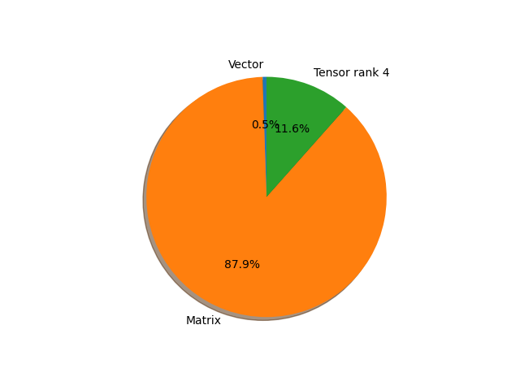

# regnet_x_800mf parameter information

**Number of layers: [ 161 ]**

**Number of parameters: [ 7.26M ]**

**Proportional of each form** (%)

| Vector | Matrix | Tensor rank 4 | 
|  --- | --- | --- |
| 66.46 | 22.98 | 10.56 | 

**Proportional of parameters by form** (%)

| Vector | Matrix | Tensor rank 4 | 
|  --- | --- | --- |
| 0.53 | 87.91 | 11.56 | 

**Layer information**

| Name | Shape | Squeezed shape | Number of parameters | Form |
| --- | --- | --- | --- | --- |
| stem.0.weight | (32, 3, 3, 3) | (32, 3, 3, 3) | 864 | Tensor rank 4 |
| stem.1.weight | (32,) | (32,) | 32 | Vector |
| stem.1.bias | (32,) | (32,) | 32 | Vector |
| trunk_output.block1.block1-0.proj.0.weight | (64, 32, 1, 1) | (64, 32) | 2048 | Matrix |
| trunk_output.block1.block1-0.proj.1.weight | (64,) | (64,) | 64 | Vector |
| trunk_output.block1.block1-0.proj.1.bias | (64,) | (64,) | 64 | Vector |
| trunk_output.block1.block1-0.f.a.0.weight | (64, 32, 1, 1) | (64, 32) | 2048 | Matrix |
| trunk_output.block1.block1-0.f.a.1.weight | (64,) | (64,) | 64 | Vector |
| trunk_output.block1.block1-0.f.a.1.bias | (64,) | (64,) | 64 | Vector |
| trunk_output.block1.block1-0.f.b.0.weight | (64, 16, 3, 3) | (64, 16, 3, 3) | 9216 | Tensor rank 4 |
| trunk_output.block1.block1-0.f.b.1.weight | (64,) | (64,) | 64 | Vector |
| trunk_output.block1.block1-0.f.b.1.bias | (64,) | (64,) | 64 | Vector |
| trunk_output.block1.block1-0.f.c.0.weight | (64, 64, 1, 1) | (64, 64) | 4096 | Matrix |
| trunk_output.block1.block1-0.f.c.1.weight | (64,) | (64,) | 64 | Vector |
| trunk_output.block1.block1-0.f.c.1.bias | (64,) | (64,) | 64 | Vector |
| trunk_output.block2.block2-0.proj.0.weight | (128, 64, 1, 1) | (128, 64) | 8192 | Matrix |
| trunk_output.block2.block2-0.proj.1.weight | (128,) | (128,) | 128 | Vector |
| trunk_output.block2.block2-0.proj.1.bias | (128,) | (128,) | 128 | Vector |
| trunk_output.block2.block2-0.f.a.0.weight | (128, 64, 1, 1) | (128, 64) | 8192 | Matrix |
| trunk_output.block2.block2-0.f.a.1.weight | (128,) | (128,) | 128 | Vector |
| trunk_output.block2.block2-0.f.a.1.bias | (128,) | (128,) | 128 | Vector |
| trunk_output.block2.block2-0.f.b.0.weight | (128, 16, 3, 3) | (128, 16, 3, 3) | 18432 | Tensor rank 4 |
| trunk_output.block2.block2-0.f.b.1.weight | (128,) | (128,) | 128 | Vector |
| trunk_output.block2.block2-0.f.b.1.bias | (128,) | (128,) | 128 | Vector |
| trunk_output.block2.block2-0.f.c.0.weight | (128, 128, 1, 1) | (128, 128) | 16384 | Matrix |
| trunk_output.block2.block2-0.f.c.1.weight | (128,) | (128,) | 128 | Vector |
| trunk_output.block2.block2-0.f.c.1.bias | (128,) | (128,) | 128 | Vector |
| trunk_output.block2.block2-1.f.a.0.weight | (128, 128, 1, 1) | (128, 128) | 16384 | Matrix |
| trunk_output.block2.block2-1.f.a.1.weight | (128,) | (128,) | 128 | Vector |
| trunk_output.block2.block2-1.f.a.1.bias | (128,) | (128,) | 128 | Vector |
| trunk_output.block2.block2-1.f.b.0.weight | (128, 16, 3, 3) | (128, 16, 3, 3) | 18432 | Tensor rank 4 |
| trunk_output.block2.block2-1.f.b.1.weight | (128,) | (128,) | 128 | Vector |
| trunk_output.block2.block2-1.f.b.1.bias | (128,) | (128,) | 128 | Vector |
| trunk_output.block2.block2-1.f.c.0.weight | (128, 128, 1, 1) | (128, 128) | 16384 | Matrix |
| trunk_output.block2.block2-1.f.c.1.weight | (128,) | (128,) | 128 | Vector |
| trunk_output.block2.block2-1.f.c.1.bias | (128,) | (128,) | 128 | Vector |
| trunk_output.block2.block2-2.f.a.0.weight | (128, 128, 1, 1) | (128, 128) | 16384 | Matrix |
| trunk_output.block2.block2-2.f.a.1.weight | (128,) | (128,) | 128 | Vector |
| trunk_output.block2.block2-2.f.a.1.bias | (128,) | (128,) | 128 | Vector |
| trunk_output.block2.block2-2.f.b.0.weight | (128, 16, 3, 3) | (128, 16, 3, 3) | 18432 | Tensor rank 4 |
| trunk_output.block2.block2-2.f.b.1.weight | (128,) | (128,) | 128 | Vector |
| trunk_output.block2.block2-2.f.b.1.bias | (128,) | (128,) | 128 | Vector |
| trunk_output.block2.block2-2.f.c.0.weight | (128, 128, 1, 1) | (128, 128) | 16384 | Matrix |
| trunk_output.block2.block2-2.f.c.1.weight | (128,) | (128,) | 128 | Vector |
| trunk_output.block2.block2-2.f.c.1.bias | (128,) | (128,) | 128 | Vector |
| trunk_output.block3.block3-0.proj.0.weight | (288, 128, 1, 1) | (288, 128) | 36864 | Matrix |
| trunk_output.block3.block3-0.proj.1.weight | (288,) | (288,) | 288 | Vector |
| trunk_output.block3.block3-0.proj.1.bias | (288,) | (288,) | 288 | Vector |
| trunk_output.block3.block3-0.f.a.0.weight | (288, 128, 1, 1) | (288, 128) | 36864 | Matrix |
| trunk_output.block3.block3-0.f.a.1.weight | (288,) | (288,) | 288 | Vector |
| trunk_output.block3.block3-0.f.a.1.bias | (288,) | (288,) | 288 | Vector |
| trunk_output.block3.block3-0.f.b.0.weight | (288, 16, 3, 3) | (288, 16, 3, 3) | 41472 | Tensor rank 4 |
| trunk_output.block3.block3-0.f.b.1.weight | (288,) | (288,) | 288 | Vector |
| trunk_output.block3.block3-0.f.b.1.bias | (288,) | (288,) | 288 | Vector |
| trunk_output.block3.block3-0.f.c.0.weight | (288, 288, 1, 1) | (288, 288) | 82944 | Matrix |
| trunk_output.block3.block3-0.f.c.1.weight | (288,) | (288,) | 288 | Vector |
| trunk_output.block3.block3-0.f.c.1.bias | (288,) | (288,) | 288 | Vector |
| trunk_output.block3.block3-1.f.a.0.weight | (288, 288, 1, 1) | (288, 288) | 82944 | Matrix |
| trunk_output.block3.block3-1.f.a.1.weight | (288,) | (288,) | 288 | Vector |
| trunk_output.block3.block3-1.f.a.1.bias | (288,) | (288,) | 288 | Vector |
| trunk_output.block3.block3-1.f.b.0.weight | (288, 16, 3, 3) | (288, 16, 3, 3) | 41472 | Tensor rank 4 |
| trunk_output.block3.block3-1.f.b.1.weight | (288,) | (288,) | 288 | Vector |
| trunk_output.block3.block3-1.f.b.1.bias | (288,) | (288,) | 288 | Vector |
| trunk_output.block3.block3-1.f.c.0.weight | (288, 288, 1, 1) | (288, 288) | 82944 | Matrix |
| trunk_output.block3.block3-1.f.c.1.weight | (288,) | (288,) | 288 | Vector |
| trunk_output.block3.block3-1.f.c.1.bias | (288,) | (288,) | 288 | Vector |
| trunk_output.block3.block3-2.f.a.0.weight | (288, 288, 1, 1) | (288, 288) | 82944 | Matrix |
| trunk_output.block3.block3-2.f.a.1.weight | (288,) | (288,) | 288 | Vector |
| trunk_output.block3.block3-2.f.a.1.bias | (288,) | (288,) | 288 | Vector |
| trunk_output.block3.block3-2.f.b.0.weight | (288, 16, 3, 3) | (288, 16, 3, 3) | 41472 | Tensor rank 4 |
| trunk_output.block3.block3-2.f.b.1.weight | (288,) | (288,) | 288 | Vector |
| trunk_output.block3.block3-2.f.b.1.bias | (288,) | (288,) | 288 | Vector |
| trunk_output.block3.block3-2.f.c.0.weight | (288, 288, 1, 1) | (288, 288) | 82944 | Matrix |
| trunk_output.block3.block3-2.f.c.1.weight | (288,) | (288,) | 288 | Vector |
| trunk_output.block3.block3-2.f.c.1.bias | (288,) | (288,) | 288 | Vector |
| trunk_output.block3.block3-3.f.a.0.weight | (288, 288, 1, 1) | (288, 288) | 82944 | Matrix |
| trunk_output.block3.block3-3.f.a.1.weight | (288,) | (288,) | 288 | Vector |
| trunk_output.block3.block3-3.f.a.1.bias | (288,) | (288,) | 288 | Vector |
| trunk_output.block3.block3-3.f.b.0.weight | (288, 16, 3, 3) | (288, 16, 3, 3) | 41472 | Tensor rank 4 |
| trunk_output.block3.block3-3.f.b.1.weight | (288,) | (288,) | 288 | Vector |
| trunk_output.block3.block3-3.f.b.1.bias | (288,) | (288,) | 288 | Vector |
| trunk_output.block3.block3-3.f.c.0.weight | (288, 288, 1, 1) | (288, 288) | 82944 | Matrix |
| trunk_output.block3.block3-3.f.c.1.weight | (288,) | (288,) | 288 | Vector |
| trunk_output.block3.block3-3.f.c.1.bias | (288,) | (288,) | 288 | Vector |
| trunk_output.block3.block3-4.f.a.0.weight | (288, 288, 1, 1) | (288, 288) | 82944 | Matrix |
| trunk_output.block3.block3-4.f.a.1.weight | (288,) | (288,) | 288 | Vector |
| trunk_output.block3.block3-4.f.a.1.bias | (288,) | (288,) | 288 | Vector |
| trunk_output.block3.block3-4.f.b.0.weight | (288, 16, 3, 3) | (288, 16, 3, 3) | 41472 | Tensor rank 4 |
| trunk_output.block3.block3-4.f.b.1.weight | (288,) | (288,) | 288 | Vector |
| trunk_output.block3.block3-4.f.b.1.bias | (288,) | (288,) | 288 | Vector |
| trunk_output.block3.block3-4.f.c.0.weight | (288, 288, 1, 1) | (288, 288) | 82944 | Matrix |
| trunk_output.block3.block3-4.f.c.1.weight | (288,) | (288,) | 288 | Vector |
| trunk_output.block3.block3-4.f.c.1.bias | (288,) | (288,) | 288 | Vector |
| trunk_output.block3.block3-5.f.a.0.weight | (288, 288, 1, 1) | (288, 288) | 82944 | Matrix |
| trunk_output.block3.block3-5.f.a.1.weight | (288,) | (288,) | 288 | Vector |
| trunk_output.block3.block3-5.f.a.1.bias | (288,) | (288,) | 288 | Vector |
| trunk_output.block3.block3-5.f.b.0.weight | (288, 16, 3, 3) | (288, 16, 3, 3) | 41472 | Tensor rank 4 |
| trunk_output.block3.block3-5.f.b.1.weight | (288,) | (288,) | 288 | Vector |
| trunk_output.block3.block3-5.f.b.1.bias | (288,) | (288,) | 288 | Vector |
| trunk_output.block3.block3-5.f.c.0.weight | (288, 288, 1, 1) | (288, 288) | 82944 | Matrix |
| trunk_output.block3.block3-5.f.c.1.weight | (288,) | (288,) | 288 | Vector |
| trunk_output.block3.block3-5.f.c.1.bias | (288,) | (288,) | 288 | Vector |
| trunk_output.block3.block3-6.f.a.0.weight | (288, 288, 1, 1) | (288, 288) | 82944 | Matrix |
| trunk_output.block3.block3-6.f.a.1.weight | (288,) | (288,) | 288 | Vector |
| trunk_output.block3.block3-6.f.a.1.bias | (288,) | (288,) | 288 | Vector |
| trunk_output.block3.block3-6.f.b.0.weight | (288, 16, 3, 3) | (288, 16, 3, 3) | 41472 | Tensor rank 4 |
| trunk_output.block3.block3-6.f.b.1.weight | (288,) | (288,) | 288 | Vector |
| trunk_output.block3.block3-6.f.b.1.bias | (288,) | (288,) | 288 | Vector |
| trunk_output.block3.block3-6.f.c.0.weight | (288, 288, 1, 1) | (288, 288) | 82944 | Matrix |
| trunk_output.block3.block3-6.f.c.1.weight | (288,) | (288,) | 288 | Vector |
| trunk_output.block3.block3-6.f.c.1.bias | (288,) | (288,) | 288 | Vector |
| trunk_output.block4.block4-0.proj.0.weight | (672, 288, 1, 1) | (672, 288) | 193536 | Matrix |
| trunk_output.block4.block4-0.proj.1.weight | (672,) | (672,) | 672 | Vector |
| trunk_output.block4.block4-0.proj.1.bias | (672,) | (672,) | 672 | Vector |
| trunk_output.block4.block4-0.f.a.0.weight | (672, 288, 1, 1) | (672, 288) | 193536 | Matrix |
| trunk_output.block4.block4-0.f.a.1.weight | (672,) | (672,) | 672 | Vector |
| trunk_output.block4.block4-0.f.a.1.bias | (672,) | (672,) | 672 | Vector |
| trunk_output.block4.block4-0.f.b.0.weight | (672, 16, 3, 3) | (672, 16, 3, 3) | 96768 | Tensor rank 4 |
| trunk_output.block4.block4-0.f.b.1.weight | (672,) | (672,) | 672 | Vector |
| trunk_output.block4.block4-0.f.b.1.bias | (672,) | (672,) | 672 | Vector |
| trunk_output.block4.block4-0.f.c.0.weight | (672, 672, 1, 1) | (672, 672) | 451584 | Matrix |
| trunk_output.block4.block4-0.f.c.1.weight | (672,) | (672,) | 672 | Vector |
| trunk_output.block4.block4-0.f.c.1.bias | (672,) | (672,) | 672 | Vector |
| trunk_output.block4.block4-1.f.a.0.weight | (672, 672, 1, 1) | (672, 672) | 451584 | Matrix |
| trunk_output.block4.block4-1.f.a.1.weight | (672,) | (672,) | 672 | Vector |
| trunk_output.block4.block4-1.f.a.1.bias | (672,) | (672,) | 672 | Vector |
| trunk_output.block4.block4-1.f.b.0.weight | (672, 16, 3, 3) | (672, 16, 3, 3) | 96768 | Tensor rank 4 |
| trunk_output.block4.block4-1.f.b.1.weight | (672,) | (672,) | 672 | Vector |
| trunk_output.block4.block4-1.f.b.1.bias | (672,) | (672,) | 672 | Vector |
| trunk_output.block4.block4-1.f.c.0.weight | (672, 672, 1, 1) | (672, 672) | 451584 | Matrix |
| trunk_output.block4.block4-1.f.c.1.weight | (672,) | (672,) | 672 | Vector |
| trunk_output.block4.block4-1.f.c.1.bias | (672,) | (672,) | 672 | Vector |
| trunk_output.block4.block4-2.f.a.0.weight | (672, 672, 1, 1) | (672, 672) | 451584 | Matrix |
| trunk_output.block4.block4-2.f.a.1.weight | (672,) | (672,) | 672 | Vector |
| trunk_output.block4.block4-2.f.a.1.bias | (672,) | (672,) | 672 | Vector |
| trunk_output.block4.block4-2.f.b.0.weight | (672, 16, 3, 3) | (672, 16, 3, 3) | 96768 | Tensor rank 4 |
| trunk_output.block4.block4-2.f.b.1.weight | (672,) | (672,) | 672 | Vector |
| trunk_output.block4.block4-2.f.b.1.bias | (672,) | (672,) | 672 | Vector |
| trunk_output.block4.block4-2.f.c.0.weight | (672, 672, 1, 1) | (672, 672) | 451584 | Matrix |
| trunk_output.block4.block4-2.f.c.1.weight | (672,) | (672,) | 672 | Vector |
| trunk_output.block4.block4-2.f.c.1.bias | (672,) | (672,) | 672 | Vector |
| trunk_output.block4.block4-3.f.a.0.weight | (672, 672, 1, 1) | (672, 672) | 451584 | Matrix |
| trunk_output.block4.block4-3.f.a.1.weight | (672,) | (672,) | 672 | Vector |
| trunk_output.block4.block4-3.f.a.1.bias | (672,) | (672,) | 672 | Vector |
| trunk_output.block4.block4-3.f.b.0.weight | (672, 16, 3, 3) | (672, 16, 3, 3) | 96768 | Tensor rank 4 |
| trunk_output.block4.block4-3.f.b.1.weight | (672,) | (672,) | 672 | Vector |
| trunk_output.block4.block4-3.f.b.1.bias | (672,) | (672,) | 672 | Vector |
| trunk_output.block4.block4-3.f.c.0.weight | (672, 672, 1, 1) | (672, 672) | 451584 | Matrix |
| trunk_output.block4.block4-3.f.c.1.weight | (672,) | (672,) | 672 | Vector |
| trunk_output.block4.block4-3.f.c.1.bias | (672,) | (672,) | 672 | Vector |
| trunk_output.block4.block4-4.f.a.0.weight | (672, 672, 1, 1) | (672, 672) | 451584 | Matrix |
| trunk_output.block4.block4-4.f.a.1.weight | (672,) | (672,) | 672 | Vector |
| trunk_output.block4.block4-4.f.a.1.bias | (672,) | (672,) | 672 | Vector |
| trunk_output.block4.block4-4.f.b.0.weight | (672, 16, 3, 3) | (672, 16, 3, 3) | 96768 | Tensor rank 4 |
| trunk_output.block4.block4-4.f.b.1.weight | (672,) | (672,) | 672 | Vector |
| trunk_output.block4.block4-4.f.b.1.bias | (672,) | (672,) | 672 | Vector |
| trunk_output.block4.block4-4.f.c.0.weight | (672, 672, 1, 1) | (672, 672) | 451584 | Matrix |
| trunk_output.block4.block4-4.f.c.1.weight | (672,) | (672,) | 672 | Vector |
| trunk_output.block4.block4-4.f.c.1.bias | (672,) | (672,) | 672 | Vector |
| fc.weight | (1000, 672) | (1000, 672) | 672000 | Matrix |
| fc.bias | (1000,) | (1000,) | 1000 | Vector |

