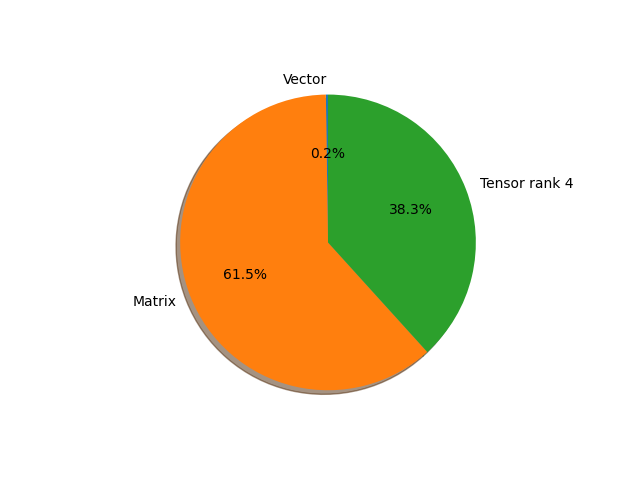

# regnet_x_8gf parameter information

**Number of layers: [ 224 ]**

**Number of parameters: [ 39.57M ]**

**Proportional of each form** (%)

| Vector | Matrix | Tensor rank 4 | 
|  --- | --- | --- |
| 66.52 | 22.77 | 10.71 | 

**Proportional of parameters by form** (%)

| Vector | Matrix | Tensor rank 4 | 
|  --- | --- | --- |
| 0.23 | 61.49 | 38.28 | 

**Layer information**

| Name | Shape | Squeezed shape | Number of parameters | Form |
| --- | --- | --- | --- | --- |
| stem.0.weight | (32, 3, 3, 3) | (32, 3, 3, 3) | 864 | Tensor rank 4 |
| stem.1.weight | (32,) | (32,) | 32 | Vector |
| stem.1.bias | (32,) | (32,) | 32 | Vector |
| trunk_output.block1.block1-0.proj.0.weight | (80, 32, 1, 1) | (80, 32) | 2560 | Matrix |
| trunk_output.block1.block1-0.proj.1.weight | (80,) | (80,) | 80 | Vector |
| trunk_output.block1.block1-0.proj.1.bias | (80,) | (80,) | 80 | Vector |
| trunk_output.block1.block1-0.f.a.0.weight | (80, 32, 1, 1) | (80, 32) | 2560 | Matrix |
| trunk_output.block1.block1-0.f.a.1.weight | (80,) | (80,) | 80 | Vector |
| trunk_output.block1.block1-0.f.a.1.bias | (80,) | (80,) | 80 | Vector |
| trunk_output.block1.block1-0.f.b.0.weight | (80, 80, 3, 3) | (80, 80, 3, 3) | 57600 | Tensor rank 4 |
| trunk_output.block1.block1-0.f.b.1.weight | (80,) | (80,) | 80 | Vector |
| trunk_output.block1.block1-0.f.b.1.bias | (80,) | (80,) | 80 | Vector |
| trunk_output.block1.block1-0.f.c.0.weight | (80, 80, 1, 1) | (80, 80) | 6400 | Matrix |
| trunk_output.block1.block1-0.f.c.1.weight | (80,) | (80,) | 80 | Vector |
| trunk_output.block1.block1-0.f.c.1.bias | (80,) | (80,) | 80 | Vector |
| trunk_output.block1.block1-1.f.a.0.weight | (80, 80, 1, 1) | (80, 80) | 6400 | Matrix |
| trunk_output.block1.block1-1.f.a.1.weight | (80,) | (80,) | 80 | Vector |
| trunk_output.block1.block1-1.f.a.1.bias | (80,) | (80,) | 80 | Vector |
| trunk_output.block1.block1-1.f.b.0.weight | (80, 80, 3, 3) | (80, 80, 3, 3) | 57600 | Tensor rank 4 |
| trunk_output.block1.block1-1.f.b.1.weight | (80,) | (80,) | 80 | Vector |
| trunk_output.block1.block1-1.f.b.1.bias | (80,) | (80,) | 80 | Vector |
| trunk_output.block1.block1-1.f.c.0.weight | (80, 80, 1, 1) | (80, 80) | 6400 | Matrix |
| trunk_output.block1.block1-1.f.c.1.weight | (80,) | (80,) | 80 | Vector |
| trunk_output.block1.block1-1.f.c.1.bias | (80,) | (80,) | 80 | Vector |
| trunk_output.block2.block2-0.proj.0.weight | (240, 80, 1, 1) | (240, 80) | 19200 | Matrix |
| trunk_output.block2.block2-0.proj.1.weight | (240,) | (240,) | 240 | Vector |
| trunk_output.block2.block2-0.proj.1.bias | (240,) | (240,) | 240 | Vector |
| trunk_output.block2.block2-0.f.a.0.weight | (240, 80, 1, 1) | (240, 80) | 19200 | Matrix |
| trunk_output.block2.block2-0.f.a.1.weight | (240,) | (240,) | 240 | Vector |
| trunk_output.block2.block2-0.f.a.1.bias | (240,) | (240,) | 240 | Vector |
| trunk_output.block2.block2-0.f.b.0.weight | (240, 120, 3, 3) | (240, 120, 3, 3) | 259200 | Tensor rank 4 |
| trunk_output.block2.block2-0.f.b.1.weight | (240,) | (240,) | 240 | Vector |
| trunk_output.block2.block2-0.f.b.1.bias | (240,) | (240,) | 240 | Vector |
| trunk_output.block2.block2-0.f.c.0.weight | (240, 240, 1, 1) | (240, 240) | 57600 | Matrix |
| trunk_output.block2.block2-0.f.c.1.weight | (240,) | (240,) | 240 | Vector |
| trunk_output.block2.block2-0.f.c.1.bias | (240,) | (240,) | 240 | Vector |
| trunk_output.block2.block2-1.f.a.0.weight | (240, 240, 1, 1) | (240, 240) | 57600 | Matrix |
| trunk_output.block2.block2-1.f.a.1.weight | (240,) | (240,) | 240 | Vector |
| trunk_output.block2.block2-1.f.a.1.bias | (240,) | (240,) | 240 | Vector |
| trunk_output.block2.block2-1.f.b.0.weight | (240, 120, 3, 3) | (240, 120, 3, 3) | 259200 | Tensor rank 4 |
| trunk_output.block2.block2-1.f.b.1.weight | (240,) | (240,) | 240 | Vector |
| trunk_output.block2.block2-1.f.b.1.bias | (240,) | (240,) | 240 | Vector |
| trunk_output.block2.block2-1.f.c.0.weight | (240, 240, 1, 1) | (240, 240) | 57600 | Matrix |
| trunk_output.block2.block2-1.f.c.1.weight | (240,) | (240,) | 240 | Vector |
| trunk_output.block2.block2-1.f.c.1.bias | (240,) | (240,) | 240 | Vector |
| trunk_output.block2.block2-2.f.a.0.weight | (240, 240, 1, 1) | (240, 240) | 57600 | Matrix |
| trunk_output.block2.block2-2.f.a.1.weight | (240,) | (240,) | 240 | Vector |
| trunk_output.block2.block2-2.f.a.1.bias | (240,) | (240,) | 240 | Vector |
| trunk_output.block2.block2-2.f.b.0.weight | (240, 120, 3, 3) | (240, 120, 3, 3) | 259200 | Tensor rank 4 |
| trunk_output.block2.block2-2.f.b.1.weight | (240,) | (240,) | 240 | Vector |
| trunk_output.block2.block2-2.f.b.1.bias | (240,) | (240,) | 240 | Vector |
| trunk_output.block2.block2-2.f.c.0.weight | (240, 240, 1, 1) | (240, 240) | 57600 | Matrix |
| trunk_output.block2.block2-2.f.c.1.weight | (240,) | (240,) | 240 | Vector |
| trunk_output.block2.block2-2.f.c.1.bias | (240,) | (240,) | 240 | Vector |
| trunk_output.block2.block2-3.f.a.0.weight | (240, 240, 1, 1) | (240, 240) | 57600 | Matrix |
| trunk_output.block2.block2-3.f.a.1.weight | (240,) | (240,) | 240 | Vector |
| trunk_output.block2.block2-3.f.a.1.bias | (240,) | (240,) | 240 | Vector |
| trunk_output.block2.block2-3.f.b.0.weight | (240, 120, 3, 3) | (240, 120, 3, 3) | 259200 | Tensor rank 4 |
| trunk_output.block2.block2-3.f.b.1.weight | (240,) | (240,) | 240 | Vector |
| trunk_output.block2.block2-3.f.b.1.bias | (240,) | (240,) | 240 | Vector |
| trunk_output.block2.block2-3.f.c.0.weight | (240, 240, 1, 1) | (240, 240) | 57600 | Matrix |
| trunk_output.block2.block2-3.f.c.1.weight | (240,) | (240,) | 240 | Vector |
| trunk_output.block2.block2-3.f.c.1.bias | (240,) | (240,) | 240 | Vector |
| trunk_output.block2.block2-4.f.a.0.weight | (240, 240, 1, 1) | (240, 240) | 57600 | Matrix |
| trunk_output.block2.block2-4.f.a.1.weight | (240,) | (240,) | 240 | Vector |
| trunk_output.block2.block2-4.f.a.1.bias | (240,) | (240,) | 240 | Vector |
| trunk_output.block2.block2-4.f.b.0.weight | (240, 120, 3, 3) | (240, 120, 3, 3) | 259200 | Tensor rank 4 |
| trunk_output.block2.block2-4.f.b.1.weight | (240,) | (240,) | 240 | Vector |
| trunk_output.block2.block2-4.f.b.1.bias | (240,) | (240,) | 240 | Vector |
| trunk_output.block2.block2-4.f.c.0.weight | (240, 240, 1, 1) | (240, 240) | 57600 | Matrix |
| trunk_output.block2.block2-4.f.c.1.weight | (240,) | (240,) | 240 | Vector |
| trunk_output.block2.block2-4.f.c.1.bias | (240,) | (240,) | 240 | Vector |
| trunk_output.block3.block3-0.proj.0.weight | (720, 240, 1, 1) | (720, 240) | 172800 | Matrix |
| trunk_output.block3.block3-0.proj.1.weight | (720,) | (720,) | 720 | Vector |
| trunk_output.block3.block3-0.proj.1.bias | (720,) | (720,) | 720 | Vector |
| trunk_output.block3.block3-0.f.a.0.weight | (720, 240, 1, 1) | (720, 240) | 172800 | Matrix |
| trunk_output.block3.block3-0.f.a.1.weight | (720,) | (720,) | 720 | Vector |
| trunk_output.block3.block3-0.f.a.1.bias | (720,) | (720,) | 720 | Vector |
| trunk_output.block3.block3-0.f.b.0.weight | (720, 120, 3, 3) | (720, 120, 3, 3) | 777600 | Tensor rank 4 |
| trunk_output.block3.block3-0.f.b.1.weight | (720,) | (720,) | 720 | Vector |
| trunk_output.block3.block3-0.f.b.1.bias | (720,) | (720,) | 720 | Vector |
| trunk_output.block3.block3-0.f.c.0.weight | (720, 720, 1, 1) | (720, 720) | 518400 | Matrix |
| trunk_output.block3.block3-0.f.c.1.weight | (720,) | (720,) | 720 | Vector |
| trunk_output.block3.block3-0.f.c.1.bias | (720,) | (720,) | 720 | Vector |
| trunk_output.block3.block3-1.f.a.0.weight | (720, 720, 1, 1) | (720, 720) | 518400 | Matrix |
| trunk_output.block3.block3-1.f.a.1.weight | (720,) | (720,) | 720 | Vector |
| trunk_output.block3.block3-1.f.a.1.bias | (720,) | (720,) | 720 | Vector |
| trunk_output.block3.block3-1.f.b.0.weight | (720, 120, 3, 3) | (720, 120, 3, 3) | 777600 | Tensor rank 4 |
| trunk_output.block3.block3-1.f.b.1.weight | (720,) | (720,) | 720 | Vector |
| trunk_output.block3.block3-1.f.b.1.bias | (720,) | (720,) | 720 | Vector |
| trunk_output.block3.block3-1.f.c.0.weight | (720, 720, 1, 1) | (720, 720) | 518400 | Matrix |
| trunk_output.block3.block3-1.f.c.1.weight | (720,) | (720,) | 720 | Vector |
| trunk_output.block3.block3-1.f.c.1.bias | (720,) | (720,) | 720 | Vector |
| trunk_output.block3.block3-2.f.a.0.weight | (720, 720, 1, 1) | (720, 720) | 518400 | Matrix |
| trunk_output.block3.block3-2.f.a.1.weight | (720,) | (720,) | 720 | Vector |
| trunk_output.block3.block3-2.f.a.1.bias | (720,) | (720,) | 720 | Vector |
| trunk_output.block3.block3-2.f.b.0.weight | (720, 120, 3, 3) | (720, 120, 3, 3) | 777600 | Tensor rank 4 |
| trunk_output.block3.block3-2.f.b.1.weight | (720,) | (720,) | 720 | Vector |
| trunk_output.block3.block3-2.f.b.1.bias | (720,) | (720,) | 720 | Vector |
| trunk_output.block3.block3-2.f.c.0.weight | (720, 720, 1, 1) | (720, 720) | 518400 | Matrix |
| trunk_output.block3.block3-2.f.c.1.weight | (720,) | (720,) | 720 | Vector |
| trunk_output.block3.block3-2.f.c.1.bias | (720,) | (720,) | 720 | Vector |
| trunk_output.block3.block3-3.f.a.0.weight | (720, 720, 1, 1) | (720, 720) | 518400 | Matrix |
| trunk_output.block3.block3-3.f.a.1.weight | (720,) | (720,) | 720 | Vector |
| trunk_output.block3.block3-3.f.a.1.bias | (720,) | (720,) | 720 | Vector |
| trunk_output.block3.block3-3.f.b.0.weight | (720, 120, 3, 3) | (720, 120, 3, 3) | 777600 | Tensor rank 4 |
| trunk_output.block3.block3-3.f.b.1.weight | (720,) | (720,) | 720 | Vector |
| trunk_output.block3.block3-3.f.b.1.bias | (720,) | (720,) | 720 | Vector |
| trunk_output.block3.block3-3.f.c.0.weight | (720, 720, 1, 1) | (720, 720) | 518400 | Matrix |
| trunk_output.block3.block3-3.f.c.1.weight | (720,) | (720,) | 720 | Vector |
| trunk_output.block3.block3-3.f.c.1.bias | (720,) | (720,) | 720 | Vector |
| trunk_output.block3.block3-4.f.a.0.weight | (720, 720, 1, 1) | (720, 720) | 518400 | Matrix |
| trunk_output.block3.block3-4.f.a.1.weight | (720,) | (720,) | 720 | Vector |
| trunk_output.block3.block3-4.f.a.1.bias | (720,) | (720,) | 720 | Vector |
| trunk_output.block3.block3-4.f.b.0.weight | (720, 120, 3, 3) | (720, 120, 3, 3) | 777600 | Tensor rank 4 |
| trunk_output.block3.block3-4.f.b.1.weight | (720,) | (720,) | 720 | Vector |
| trunk_output.block3.block3-4.f.b.1.bias | (720,) | (720,) | 720 | Vector |
| trunk_output.block3.block3-4.f.c.0.weight | (720, 720, 1, 1) | (720, 720) | 518400 | Matrix |
| trunk_output.block3.block3-4.f.c.1.weight | (720,) | (720,) | 720 | Vector |
| trunk_output.block3.block3-4.f.c.1.bias | (720,) | (720,) | 720 | Vector |
| trunk_output.block3.block3-5.f.a.0.weight | (720, 720, 1, 1) | (720, 720) | 518400 | Matrix |
| trunk_output.block3.block3-5.f.a.1.weight | (720,) | (720,) | 720 | Vector |
| trunk_output.block3.block3-5.f.a.1.bias | (720,) | (720,) | 720 | Vector |
| trunk_output.block3.block3-5.f.b.0.weight | (720, 120, 3, 3) | (720, 120, 3, 3) | 777600 | Tensor rank 4 |
| trunk_output.block3.block3-5.f.b.1.weight | (720,) | (720,) | 720 | Vector |
| trunk_output.block3.block3-5.f.b.1.bias | (720,) | (720,) | 720 | Vector |
| trunk_output.block3.block3-5.f.c.0.weight | (720, 720, 1, 1) | (720, 720) | 518400 | Matrix |
| trunk_output.block3.block3-5.f.c.1.weight | (720,) | (720,) | 720 | Vector |
| trunk_output.block3.block3-5.f.c.1.bias | (720,) | (720,) | 720 | Vector |
| trunk_output.block3.block3-6.f.a.0.weight | (720, 720, 1, 1) | (720, 720) | 518400 | Matrix |
| trunk_output.block3.block3-6.f.a.1.weight | (720,) | (720,) | 720 | Vector |
| trunk_output.block3.block3-6.f.a.1.bias | (720,) | (720,) | 720 | Vector |
| trunk_output.block3.block3-6.f.b.0.weight | (720, 120, 3, 3) | (720, 120, 3, 3) | 777600 | Tensor rank 4 |
| trunk_output.block3.block3-6.f.b.1.weight | (720,) | (720,) | 720 | Vector |
| trunk_output.block3.block3-6.f.b.1.bias | (720,) | (720,) | 720 | Vector |
| trunk_output.block3.block3-6.f.c.0.weight | (720, 720, 1, 1) | (720, 720) | 518400 | Matrix |
| trunk_output.block3.block3-6.f.c.1.weight | (720,) | (720,) | 720 | Vector |
| trunk_output.block3.block3-6.f.c.1.bias | (720,) | (720,) | 720 | Vector |
| trunk_output.block3.block3-7.f.a.0.weight | (720, 720, 1, 1) | (720, 720) | 518400 | Matrix |
| trunk_output.block3.block3-7.f.a.1.weight | (720,) | (720,) | 720 | Vector |
| trunk_output.block3.block3-7.f.a.1.bias | (720,) | (720,) | 720 | Vector |
| trunk_output.block3.block3-7.f.b.0.weight | (720, 120, 3, 3) | (720, 120, 3, 3) | 777600 | Tensor rank 4 |
| trunk_output.block3.block3-7.f.b.1.weight | (720,) | (720,) | 720 | Vector |
| trunk_output.block3.block3-7.f.b.1.bias | (720,) | (720,) | 720 | Vector |
| trunk_output.block3.block3-7.f.c.0.weight | (720, 720, 1, 1) | (720, 720) | 518400 | Matrix |
| trunk_output.block3.block3-7.f.c.1.weight | (720,) | (720,) | 720 | Vector |
| trunk_output.block3.block3-7.f.c.1.bias | (720,) | (720,) | 720 | Vector |
| trunk_output.block3.block3-8.f.a.0.weight | (720, 720, 1, 1) | (720, 720) | 518400 | Matrix |
| trunk_output.block3.block3-8.f.a.1.weight | (720,) | (720,) | 720 | Vector |
| trunk_output.block3.block3-8.f.a.1.bias | (720,) | (720,) | 720 | Vector |
| trunk_output.block3.block3-8.f.b.0.weight | (720, 120, 3, 3) | (720, 120, 3, 3) | 777600 | Tensor rank 4 |
| trunk_output.block3.block3-8.f.b.1.weight | (720,) | (720,) | 720 | Vector |
| trunk_output.block3.block3-8.f.b.1.bias | (720,) | (720,) | 720 | Vector |
| trunk_output.block3.block3-8.f.c.0.weight | (720, 720, 1, 1) | (720, 720) | 518400 | Matrix |
| trunk_output.block3.block3-8.f.c.1.weight | (720,) | (720,) | 720 | Vector |
| trunk_output.block3.block3-8.f.c.1.bias | (720,) | (720,) | 720 | Vector |
| trunk_output.block3.block3-9.f.a.0.weight | (720, 720, 1, 1) | (720, 720) | 518400 | Matrix |
| trunk_output.block3.block3-9.f.a.1.weight | (720,) | (720,) | 720 | Vector |
| trunk_output.block3.block3-9.f.a.1.bias | (720,) | (720,) | 720 | Vector |
| trunk_output.block3.block3-9.f.b.0.weight | (720, 120, 3, 3) | (720, 120, 3, 3) | 777600 | Tensor rank 4 |
| trunk_output.block3.block3-9.f.b.1.weight | (720,) | (720,) | 720 | Vector |
| trunk_output.block3.block3-9.f.b.1.bias | (720,) | (720,) | 720 | Vector |
| trunk_output.block3.block3-9.f.c.0.weight | (720, 720, 1, 1) | (720, 720) | 518400 | Matrix |
| trunk_output.block3.block3-9.f.c.1.weight | (720,) | (720,) | 720 | Vector |
| trunk_output.block3.block3-9.f.c.1.bias | (720,) | (720,) | 720 | Vector |
| trunk_output.block3.block3-10.f.a.0.weight | (720, 720, 1, 1) | (720, 720) | 518400 | Matrix |
| trunk_output.block3.block3-10.f.a.1.weight | (720,) | (720,) | 720 | Vector |
| trunk_output.block3.block3-10.f.a.1.bias | (720,) | (720,) | 720 | Vector |
| trunk_output.block3.block3-10.f.b.0.weight | (720, 120, 3, 3) | (720, 120, 3, 3) | 777600 | Tensor rank 4 |
| trunk_output.block3.block3-10.f.b.1.weight | (720,) | (720,) | 720 | Vector |
| trunk_output.block3.block3-10.f.b.1.bias | (720,) | (720,) | 720 | Vector |
| trunk_output.block3.block3-10.f.c.0.weight | (720, 720, 1, 1) | (720, 720) | 518400 | Matrix |
| trunk_output.block3.block3-10.f.c.1.weight | (720,) | (720,) | 720 | Vector |
| trunk_output.block3.block3-10.f.c.1.bias | (720,) | (720,) | 720 | Vector |
| trunk_output.block3.block3-11.f.a.0.weight | (720, 720, 1, 1) | (720, 720) | 518400 | Matrix |
| trunk_output.block3.block3-11.f.a.1.weight | (720,) | (720,) | 720 | Vector |
| trunk_output.block3.block3-11.f.a.1.bias | (720,) | (720,) | 720 | Vector |
| trunk_output.block3.block3-11.f.b.0.weight | (720, 120, 3, 3) | (720, 120, 3, 3) | 777600 | Tensor rank 4 |
| trunk_output.block3.block3-11.f.b.1.weight | (720,) | (720,) | 720 | Vector |
| trunk_output.block3.block3-11.f.b.1.bias | (720,) | (720,) | 720 | Vector |
| trunk_output.block3.block3-11.f.c.0.weight | (720, 720, 1, 1) | (720, 720) | 518400 | Matrix |
| trunk_output.block3.block3-11.f.c.1.weight | (720,) | (720,) | 720 | Vector |
| trunk_output.block3.block3-11.f.c.1.bias | (720,) | (720,) | 720 | Vector |
| trunk_output.block3.block3-12.f.a.0.weight | (720, 720, 1, 1) | (720, 720) | 518400 | Matrix |
| trunk_output.block3.block3-12.f.a.1.weight | (720,) | (720,) | 720 | Vector |
| trunk_output.block3.block3-12.f.a.1.bias | (720,) | (720,) | 720 | Vector |
| trunk_output.block3.block3-12.f.b.0.weight | (720, 120, 3, 3) | (720, 120, 3, 3) | 777600 | Tensor rank 4 |
| trunk_output.block3.block3-12.f.b.1.weight | (720,) | (720,) | 720 | Vector |
| trunk_output.block3.block3-12.f.b.1.bias | (720,) | (720,) | 720 | Vector |
| trunk_output.block3.block3-12.f.c.0.weight | (720, 720, 1, 1) | (720, 720) | 518400 | Matrix |
| trunk_output.block3.block3-12.f.c.1.weight | (720,) | (720,) | 720 | Vector |
| trunk_output.block3.block3-12.f.c.1.bias | (720,) | (720,) | 720 | Vector |
| trunk_output.block3.block3-13.f.a.0.weight | (720, 720, 1, 1) | (720, 720) | 518400 | Matrix |
| trunk_output.block3.block3-13.f.a.1.weight | (720,) | (720,) | 720 | Vector |
| trunk_output.block3.block3-13.f.a.1.bias | (720,) | (720,) | 720 | Vector |
| trunk_output.block3.block3-13.f.b.0.weight | (720, 120, 3, 3) | (720, 120, 3, 3) | 777600 | Tensor rank 4 |
| trunk_output.block3.block3-13.f.b.1.weight | (720,) | (720,) | 720 | Vector |
| trunk_output.block3.block3-13.f.b.1.bias | (720,) | (720,) | 720 | Vector |
| trunk_output.block3.block3-13.f.c.0.weight | (720, 720, 1, 1) | (720, 720) | 518400 | Matrix |
| trunk_output.block3.block3-13.f.c.1.weight | (720,) | (720,) | 720 | Vector |
| trunk_output.block3.block3-13.f.c.1.bias | (720,) | (720,) | 720 | Vector |
| trunk_output.block3.block3-14.f.a.0.weight | (720, 720, 1, 1) | (720, 720) | 518400 | Matrix |
| trunk_output.block3.block3-14.f.a.1.weight | (720,) | (720,) | 720 | Vector |
| trunk_output.block3.block3-14.f.a.1.bias | (720,) | (720,) | 720 | Vector |
| trunk_output.block3.block3-14.f.b.0.weight | (720, 120, 3, 3) | (720, 120, 3, 3) | 777600 | Tensor rank 4 |
| trunk_output.block3.block3-14.f.b.1.weight | (720,) | (720,) | 720 | Vector |
| trunk_output.block3.block3-14.f.b.1.bias | (720,) | (720,) | 720 | Vector |
| trunk_output.block3.block3-14.f.c.0.weight | (720, 720, 1, 1) | (720, 720) | 518400 | Matrix |
| trunk_output.block3.block3-14.f.c.1.weight | (720,) | (720,) | 720 | Vector |
| trunk_output.block3.block3-14.f.c.1.bias | (720,) | (720,) | 720 | Vector |
| trunk_output.block4.block4-0.proj.0.weight | (1920, 720, 1, 1) | (1920, 720) | 1382400 | Matrix |
| trunk_output.block4.block4-0.proj.1.weight | (1920,) | (1920,) | 1920 | Vector |
| trunk_output.block4.block4-0.proj.1.bias | (1920,) | (1920,) | 1920 | Vector |
| trunk_output.block4.block4-0.f.a.0.weight | (1920, 720, 1, 1) | (1920, 720) | 1382400 | Matrix |
| trunk_output.block4.block4-0.f.a.1.weight | (1920,) | (1920,) | 1920 | Vector |
| trunk_output.block4.block4-0.f.a.1.bias | (1920,) | (1920,) | 1920 | Vector |
| trunk_output.block4.block4-0.f.b.0.weight | (1920, 120, 3, 3) | (1920, 120, 3, 3) | 2073600 | Tensor rank 4 |
| trunk_output.block4.block4-0.f.b.1.weight | (1920,) | (1920,) | 1920 | Vector |
| trunk_output.block4.block4-0.f.b.1.bias | (1920,) | (1920,) | 1920 | Vector |
| trunk_output.block4.block4-0.f.c.0.weight | (1920, 1920, 1, 1) | (1920, 1920) | 3686400 | Matrix |
| trunk_output.block4.block4-0.f.c.1.weight | (1920,) | (1920,) | 1920 | Vector |
| trunk_output.block4.block4-0.f.c.1.bias | (1920,) | (1920,) | 1920 | Vector |
| fc.weight | (1000, 1920) | (1000, 1920) | 1920000 | Matrix |
| fc.bias | (1000,) | (1000,) | 1000 | Vector |

