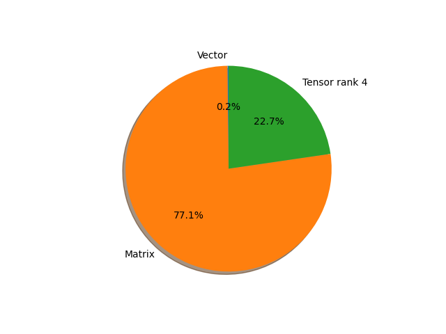

# regnet_y_16gf parameter information

**Number of layers: [ 251 ]**

**Number of parameters: [ 83.59M ]**

**Proportional of each form** (%)

| Vector | Matrix | Tensor rank 4 | 
|  --- | --- | --- |
| 61.75 | 30.68 | 7.57 | 

**Proportional of parameters by form** (%)

| Vector | Matrix | Tensor rank 4 | 
|  --- | --- | --- |
| 0.18 | 77.13 | 22.69 | 

**Layer information**

| Name | Shape | Squeezed shape | Number of parameters | Form |
| --- | --- | --- | --- | --- |
| stem.0.weight | (32, 3, 3, 3) | (32, 3, 3, 3) | 864 | Tensor rank 4 |
| stem.1.weight | (32,) | (32,) | 32 | Vector |
| stem.1.bias | (32,) | (32,) | 32 | Vector |
| trunk_output.block1.block1-0.proj.0.weight | (224, 32, 1, 1) | (224, 32) | 7168 | Matrix |
| trunk_output.block1.block1-0.proj.1.weight | (224,) | (224,) | 224 | Vector |
| trunk_output.block1.block1-0.proj.1.bias | (224,) | (224,) | 224 | Vector |
| trunk_output.block1.block1-0.f.a.0.weight | (224, 32, 1, 1) | (224, 32) | 7168 | Matrix |
| trunk_output.block1.block1-0.f.a.1.weight | (224,) | (224,) | 224 | Vector |
| trunk_output.block1.block1-0.f.a.1.bias | (224,) | (224,) | 224 | Vector |
| trunk_output.block1.block1-0.f.b.0.weight | (224, 112, 3, 3) | (224, 112, 3, 3) | 225792 | Tensor rank 4 |
| trunk_output.block1.block1-0.f.b.1.weight | (224,) | (224,) | 224 | Vector |
| trunk_output.block1.block1-0.f.b.1.bias | (224,) | (224,) | 224 | Vector |
| trunk_output.block1.block1-0.f.se.fc1.weight | (8, 224, 1, 1) | (8, 224) | 1792 | Matrix |
| trunk_output.block1.block1-0.f.se.fc1.bias | (8,) | (8,) | 8 | Vector |
| trunk_output.block1.block1-0.f.se.fc2.weight | (224, 8, 1, 1) | (224, 8) | 1792 | Matrix |
| trunk_output.block1.block1-0.f.se.fc2.bias | (224,) | (224,) | 224 | Vector |
| trunk_output.block1.block1-0.f.c.0.weight | (224, 224, 1, 1) | (224, 224) | 50176 | Matrix |
| trunk_output.block1.block1-0.f.c.1.weight | (224,) | (224,) | 224 | Vector |
| trunk_output.block1.block1-0.f.c.1.bias | (224,) | (224,) | 224 | Vector |
| trunk_output.block1.block1-1.f.a.0.weight | (224, 224, 1, 1) | (224, 224) | 50176 | Matrix |
| trunk_output.block1.block1-1.f.a.1.weight | (224,) | (224,) | 224 | Vector |
| trunk_output.block1.block1-1.f.a.1.bias | (224,) | (224,) | 224 | Vector |
| trunk_output.block1.block1-1.f.b.0.weight | (224, 112, 3, 3) | (224, 112, 3, 3) | 225792 | Tensor rank 4 |
| trunk_output.block1.block1-1.f.b.1.weight | (224,) | (224,) | 224 | Vector |
| trunk_output.block1.block1-1.f.b.1.bias | (224,) | (224,) | 224 | Vector |
| trunk_output.block1.block1-1.f.se.fc1.weight | (56, 224, 1, 1) | (56, 224) | 12544 | Matrix |
| trunk_output.block1.block1-1.f.se.fc1.bias | (56,) | (56,) | 56 | Vector |
| trunk_output.block1.block1-1.f.se.fc2.weight | (224, 56, 1, 1) | (224, 56) | 12544 | Matrix |
| trunk_output.block1.block1-1.f.se.fc2.bias | (224,) | (224,) | 224 | Vector |
| trunk_output.block1.block1-1.f.c.0.weight | (224, 224, 1, 1) | (224, 224) | 50176 | Matrix |
| trunk_output.block1.block1-1.f.c.1.weight | (224,) | (224,) | 224 | Vector |
| trunk_output.block1.block1-1.f.c.1.bias | (224,) | (224,) | 224 | Vector |
| trunk_output.block2.block2-0.proj.0.weight | (448, 224, 1, 1) | (448, 224) | 100352 | Matrix |
| trunk_output.block2.block2-0.proj.1.weight | (448,) | (448,) | 448 | Vector |
| trunk_output.block2.block2-0.proj.1.bias | (448,) | (448,) | 448 | Vector |
| trunk_output.block2.block2-0.f.a.0.weight | (448, 224, 1, 1) | (448, 224) | 100352 | Matrix |
| trunk_output.block2.block2-0.f.a.1.weight | (448,) | (448,) | 448 | Vector |
| trunk_output.block2.block2-0.f.a.1.bias | (448,) | (448,) | 448 | Vector |
| trunk_output.block2.block2-0.f.b.0.weight | (448, 112, 3, 3) | (448, 112, 3, 3) | 451584 | Tensor rank 4 |
| trunk_output.block2.block2-0.f.b.1.weight | (448,) | (448,) | 448 | Vector |
| trunk_output.block2.block2-0.f.b.1.bias | (448,) | (448,) | 448 | Vector |
| trunk_output.block2.block2-0.f.se.fc1.weight | (56, 448, 1, 1) | (56, 448) | 25088 | Matrix |
| trunk_output.block2.block2-0.f.se.fc1.bias | (56,) | (56,) | 56 | Vector |
| trunk_output.block2.block2-0.f.se.fc2.weight | (448, 56, 1, 1) | (448, 56) | 25088 | Matrix |
| trunk_output.block2.block2-0.f.se.fc2.bias | (448,) | (448,) | 448 | Vector |
| trunk_output.block2.block2-0.f.c.0.weight | (448, 448, 1, 1) | (448, 448) | 200704 | Matrix |
| trunk_output.block2.block2-0.f.c.1.weight | (448,) | (448,) | 448 | Vector |
| trunk_output.block2.block2-0.f.c.1.bias | (448,) | (448,) | 448 | Vector |
| trunk_output.block2.block2-1.f.a.0.weight | (448, 448, 1, 1) | (448, 448) | 200704 | Matrix |
| trunk_output.block2.block2-1.f.a.1.weight | (448,) | (448,) | 448 | Vector |
| trunk_output.block2.block2-1.f.a.1.bias | (448,) | (448,) | 448 | Vector |
| trunk_output.block2.block2-1.f.b.0.weight | (448, 112, 3, 3) | (448, 112, 3, 3) | 451584 | Tensor rank 4 |
| trunk_output.block2.block2-1.f.b.1.weight | (448,) | (448,) | 448 | Vector |
| trunk_output.block2.block2-1.f.b.1.bias | (448,) | (448,) | 448 | Vector |
| trunk_output.block2.block2-1.f.se.fc1.weight | (112, 448, 1, 1) | (112, 448) | 50176 | Matrix |
| trunk_output.block2.block2-1.f.se.fc1.bias | (112,) | (112,) | 112 | Vector |
| trunk_output.block2.block2-1.f.se.fc2.weight | (448, 112, 1, 1) | (448, 112) | 50176 | Matrix |
| trunk_output.block2.block2-1.f.se.fc2.bias | (448,) | (448,) | 448 | Vector |
| trunk_output.block2.block2-1.f.c.0.weight | (448, 448, 1, 1) | (448, 448) | 200704 | Matrix |
| trunk_output.block2.block2-1.f.c.1.weight | (448,) | (448,) | 448 | Vector |
| trunk_output.block2.block2-1.f.c.1.bias | (448,) | (448,) | 448 | Vector |
| trunk_output.block2.block2-2.f.a.0.weight | (448, 448, 1, 1) | (448, 448) | 200704 | Matrix |
| trunk_output.block2.block2-2.f.a.1.weight | (448,) | (448,) | 448 | Vector |
| trunk_output.block2.block2-2.f.a.1.bias | (448,) | (448,) | 448 | Vector |
| trunk_output.block2.block2-2.f.b.0.weight | (448, 112, 3, 3) | (448, 112, 3, 3) | 451584 | Tensor rank 4 |
| trunk_output.block2.block2-2.f.b.1.weight | (448,) | (448,) | 448 | Vector |
| trunk_output.block2.block2-2.f.b.1.bias | (448,) | (448,) | 448 | Vector |
| trunk_output.block2.block2-2.f.se.fc1.weight | (112, 448, 1, 1) | (112, 448) | 50176 | Matrix |
| trunk_output.block2.block2-2.f.se.fc1.bias | (112,) | (112,) | 112 | Vector |
| trunk_output.block2.block2-2.f.se.fc2.weight | (448, 112, 1, 1) | (448, 112) | 50176 | Matrix |
| trunk_output.block2.block2-2.f.se.fc2.bias | (448,) | (448,) | 448 | Vector |
| trunk_output.block2.block2-2.f.c.0.weight | (448, 448, 1, 1) | (448, 448) | 200704 | Matrix |
| trunk_output.block2.block2-2.f.c.1.weight | (448,) | (448,) | 448 | Vector |
| trunk_output.block2.block2-2.f.c.1.bias | (448,) | (448,) | 448 | Vector |
| trunk_output.block2.block2-3.f.a.0.weight | (448, 448, 1, 1) | (448, 448) | 200704 | Matrix |
| trunk_output.block2.block2-3.f.a.1.weight | (448,) | (448,) | 448 | Vector |
| trunk_output.block2.block2-3.f.a.1.bias | (448,) | (448,) | 448 | Vector |
| trunk_output.block2.block2-3.f.b.0.weight | (448, 112, 3, 3) | (448, 112, 3, 3) | 451584 | Tensor rank 4 |
| trunk_output.block2.block2-3.f.b.1.weight | (448,) | (448,) | 448 | Vector |
| trunk_output.block2.block2-3.f.b.1.bias | (448,) | (448,) | 448 | Vector |
| trunk_output.block2.block2-3.f.se.fc1.weight | (112, 448, 1, 1) | (112, 448) | 50176 | Matrix |
| trunk_output.block2.block2-3.f.se.fc1.bias | (112,) | (112,) | 112 | Vector |
| trunk_output.block2.block2-3.f.se.fc2.weight | (448, 112, 1, 1) | (448, 112) | 50176 | Matrix |
| trunk_output.block2.block2-3.f.se.fc2.bias | (448,) | (448,) | 448 | Vector |
| trunk_output.block2.block2-3.f.c.0.weight | (448, 448, 1, 1) | (448, 448) | 200704 | Matrix |
| trunk_output.block2.block2-3.f.c.1.weight | (448,) | (448,) | 448 | Vector |
| trunk_output.block2.block2-3.f.c.1.bias | (448,) | (448,) | 448 | Vector |
| trunk_output.block3.block3-0.proj.0.weight | (1232, 448, 1, 1) | (1232, 448) | 551936 | Matrix |
| trunk_output.block3.block3-0.proj.1.weight | (1232,) | (1232,) | 1232 | Vector |
| trunk_output.block3.block3-0.proj.1.bias | (1232,) | (1232,) | 1232 | Vector |
| trunk_output.block3.block3-0.f.a.0.weight | (1232, 448, 1, 1) | (1232, 448) | 551936 | Matrix |
| trunk_output.block3.block3-0.f.a.1.weight | (1232,) | (1232,) | 1232 | Vector |
| trunk_output.block3.block3-0.f.a.1.bias | (1232,) | (1232,) | 1232 | Vector |
| trunk_output.block3.block3-0.f.b.0.weight | (1232, 112, 3, 3) | (1232, 112, 3, 3) | 1241856 | Tensor rank 4 |
| trunk_output.block3.block3-0.f.b.1.weight | (1232,) | (1232,) | 1232 | Vector |
| trunk_output.block3.block3-0.f.b.1.bias | (1232,) | (1232,) | 1232 | Vector |
| trunk_output.block3.block3-0.f.se.fc1.weight | (112, 1232, 1, 1) | (112, 1232) | 137984 | Matrix |
| trunk_output.block3.block3-0.f.se.fc1.bias | (112,) | (112,) | 112 | Vector |
| trunk_output.block3.block3-0.f.se.fc2.weight | (1232, 112, 1, 1) | (1232, 112) | 137984 | Matrix |
| trunk_output.block3.block3-0.f.se.fc2.bias | (1232,) | (1232,) | 1232 | Vector |
| trunk_output.block3.block3-0.f.c.0.weight | (1232, 1232, 1, 1) | (1232, 1232) | 1517824 | Matrix |
| trunk_output.block3.block3-0.f.c.1.weight | (1232,) | (1232,) | 1232 | Vector |
| trunk_output.block3.block3-0.f.c.1.bias | (1232,) | (1232,) | 1232 | Vector |
| trunk_output.block3.block3-1.f.a.0.weight | (1232, 1232, 1, 1) | (1232, 1232) | 1517824 | Matrix |
| trunk_output.block3.block3-1.f.a.1.weight | (1232,) | (1232,) | 1232 | Vector |
| trunk_output.block3.block3-1.f.a.1.bias | (1232,) | (1232,) | 1232 | Vector |
| trunk_output.block3.block3-1.f.b.0.weight | (1232, 112, 3, 3) | (1232, 112, 3, 3) | 1241856 | Tensor rank 4 |
| trunk_output.block3.block3-1.f.b.1.weight | (1232,) | (1232,) | 1232 | Vector |
| trunk_output.block3.block3-1.f.b.1.bias | (1232,) | (1232,) | 1232 | Vector |
| trunk_output.block3.block3-1.f.se.fc1.weight | (308, 1232, 1, 1) | (308, 1232) | 379456 | Matrix |
| trunk_output.block3.block3-1.f.se.fc1.bias | (308,) | (308,) | 308 | Vector |
| trunk_output.block3.block3-1.f.se.fc2.weight | (1232, 308, 1, 1) | (1232, 308) | 379456 | Matrix |
| trunk_output.block3.block3-1.f.se.fc2.bias | (1232,) | (1232,) | 1232 | Vector |
| trunk_output.block3.block3-1.f.c.0.weight | (1232, 1232, 1, 1) | (1232, 1232) | 1517824 | Matrix |
| trunk_output.block3.block3-1.f.c.1.weight | (1232,) | (1232,) | 1232 | Vector |
| trunk_output.block3.block3-1.f.c.1.bias | (1232,) | (1232,) | 1232 | Vector |
| trunk_output.block3.block3-2.f.a.0.weight | (1232, 1232, 1, 1) | (1232, 1232) | 1517824 | Matrix |
| trunk_output.block3.block3-2.f.a.1.weight | (1232,) | (1232,) | 1232 | Vector |
| trunk_output.block3.block3-2.f.a.1.bias | (1232,) | (1232,) | 1232 | Vector |
| trunk_output.block3.block3-2.f.b.0.weight | (1232, 112, 3, 3) | (1232, 112, 3, 3) | 1241856 | Tensor rank 4 |
| trunk_output.block3.block3-2.f.b.1.weight | (1232,) | (1232,) | 1232 | Vector |
| trunk_output.block3.block3-2.f.b.1.bias | (1232,) | (1232,) | 1232 | Vector |
| trunk_output.block3.block3-2.f.se.fc1.weight | (308, 1232, 1, 1) | (308, 1232) | 379456 | Matrix |
| trunk_output.block3.block3-2.f.se.fc1.bias | (308,) | (308,) | 308 | Vector |
| trunk_output.block3.block3-2.f.se.fc2.weight | (1232, 308, 1, 1) | (1232, 308) | 379456 | Matrix |
| trunk_output.block3.block3-2.f.se.fc2.bias | (1232,) | (1232,) | 1232 | Vector |
| trunk_output.block3.block3-2.f.c.0.weight | (1232, 1232, 1, 1) | (1232, 1232) | 1517824 | Matrix |
| trunk_output.block3.block3-2.f.c.1.weight | (1232,) | (1232,) | 1232 | Vector |
| trunk_output.block3.block3-2.f.c.1.bias | (1232,) | (1232,) | 1232 | Vector |
| trunk_output.block3.block3-3.f.a.0.weight | (1232, 1232, 1, 1) | (1232, 1232) | 1517824 | Matrix |
| trunk_output.block3.block3-3.f.a.1.weight | (1232,) | (1232,) | 1232 | Vector |
| trunk_output.block3.block3-3.f.a.1.bias | (1232,) | (1232,) | 1232 | Vector |
| trunk_output.block3.block3-3.f.b.0.weight | (1232, 112, 3, 3) | (1232, 112, 3, 3) | 1241856 | Tensor rank 4 |
| trunk_output.block3.block3-3.f.b.1.weight | (1232,) | (1232,) | 1232 | Vector |
| trunk_output.block3.block3-3.f.b.1.bias | (1232,) | (1232,) | 1232 | Vector |
| trunk_output.block3.block3-3.f.se.fc1.weight | (308, 1232, 1, 1) | (308, 1232) | 379456 | Matrix |
| trunk_output.block3.block3-3.f.se.fc1.bias | (308,) | (308,) | 308 | Vector |
| trunk_output.block3.block3-3.f.se.fc2.weight | (1232, 308, 1, 1) | (1232, 308) | 379456 | Matrix |
| trunk_output.block3.block3-3.f.se.fc2.bias | (1232,) | (1232,) | 1232 | Vector |
| trunk_output.block3.block3-3.f.c.0.weight | (1232, 1232, 1, 1) | (1232, 1232) | 1517824 | Matrix |
| trunk_output.block3.block3-3.f.c.1.weight | (1232,) | (1232,) | 1232 | Vector |
| trunk_output.block3.block3-3.f.c.1.bias | (1232,) | (1232,) | 1232 | Vector |
| trunk_output.block3.block3-4.f.a.0.weight | (1232, 1232, 1, 1) | (1232, 1232) | 1517824 | Matrix |
| trunk_output.block3.block3-4.f.a.1.weight | (1232,) | (1232,) | 1232 | Vector |
| trunk_output.block3.block3-4.f.a.1.bias | (1232,) | (1232,) | 1232 | Vector |
| trunk_output.block3.block3-4.f.b.0.weight | (1232, 112, 3, 3) | (1232, 112, 3, 3) | 1241856 | Tensor rank 4 |
| trunk_output.block3.block3-4.f.b.1.weight | (1232,) | (1232,) | 1232 | Vector |
| trunk_output.block3.block3-4.f.b.1.bias | (1232,) | (1232,) | 1232 | Vector |
| trunk_output.block3.block3-4.f.se.fc1.weight | (308, 1232, 1, 1) | (308, 1232) | 379456 | Matrix |
| trunk_output.block3.block3-4.f.se.fc1.bias | (308,) | (308,) | 308 | Vector |
| trunk_output.block3.block3-4.f.se.fc2.weight | (1232, 308, 1, 1) | (1232, 308) | 379456 | Matrix |
| trunk_output.block3.block3-4.f.se.fc2.bias | (1232,) | (1232,) | 1232 | Vector |
| trunk_output.block3.block3-4.f.c.0.weight | (1232, 1232, 1, 1) | (1232, 1232) | 1517824 | Matrix |
| trunk_output.block3.block3-4.f.c.1.weight | (1232,) | (1232,) | 1232 | Vector |
| trunk_output.block3.block3-4.f.c.1.bias | (1232,) | (1232,) | 1232 | Vector |
| trunk_output.block3.block3-5.f.a.0.weight | (1232, 1232, 1, 1) | (1232, 1232) | 1517824 | Matrix |
| trunk_output.block3.block3-5.f.a.1.weight | (1232,) | (1232,) | 1232 | Vector |
| trunk_output.block3.block3-5.f.a.1.bias | (1232,) | (1232,) | 1232 | Vector |
| trunk_output.block3.block3-5.f.b.0.weight | (1232, 112, 3, 3) | (1232, 112, 3, 3) | 1241856 | Tensor rank 4 |
| trunk_output.block3.block3-5.f.b.1.weight | (1232,) | (1232,) | 1232 | Vector |
| trunk_output.block3.block3-5.f.b.1.bias | (1232,) | (1232,) | 1232 | Vector |
| trunk_output.block3.block3-5.f.se.fc1.weight | (308, 1232, 1, 1) | (308, 1232) | 379456 | Matrix |
| trunk_output.block3.block3-5.f.se.fc1.bias | (308,) | (308,) | 308 | Vector |
| trunk_output.block3.block3-5.f.se.fc2.weight | (1232, 308, 1, 1) | (1232, 308) | 379456 | Matrix |
| trunk_output.block3.block3-5.f.se.fc2.bias | (1232,) | (1232,) | 1232 | Vector |
| trunk_output.block3.block3-5.f.c.0.weight | (1232, 1232, 1, 1) | (1232, 1232) | 1517824 | Matrix |
| trunk_output.block3.block3-5.f.c.1.weight | (1232,) | (1232,) | 1232 | Vector |
| trunk_output.block3.block3-5.f.c.1.bias | (1232,) | (1232,) | 1232 | Vector |
| trunk_output.block3.block3-6.f.a.0.weight | (1232, 1232, 1, 1) | (1232, 1232) | 1517824 | Matrix |
| trunk_output.block3.block3-6.f.a.1.weight | (1232,) | (1232,) | 1232 | Vector |
| trunk_output.block3.block3-6.f.a.1.bias | (1232,) | (1232,) | 1232 | Vector |
| trunk_output.block3.block3-6.f.b.0.weight | (1232, 112, 3, 3) | (1232, 112, 3, 3) | 1241856 | Tensor rank 4 |
| trunk_output.block3.block3-6.f.b.1.weight | (1232,) | (1232,) | 1232 | Vector |
| trunk_output.block3.block3-6.f.b.1.bias | (1232,) | (1232,) | 1232 | Vector |
| trunk_output.block3.block3-6.f.se.fc1.weight | (308, 1232, 1, 1) | (308, 1232) | 379456 | Matrix |
| trunk_output.block3.block3-6.f.se.fc1.bias | (308,) | (308,) | 308 | Vector |
| trunk_output.block3.block3-6.f.se.fc2.weight | (1232, 308, 1, 1) | (1232, 308) | 379456 | Matrix |
| trunk_output.block3.block3-6.f.se.fc2.bias | (1232,) | (1232,) | 1232 | Vector |
| trunk_output.block3.block3-6.f.c.0.weight | (1232, 1232, 1, 1) | (1232, 1232) | 1517824 | Matrix |
| trunk_output.block3.block3-6.f.c.1.weight | (1232,) | (1232,) | 1232 | Vector |
| trunk_output.block3.block3-6.f.c.1.bias | (1232,) | (1232,) | 1232 | Vector |
| trunk_output.block3.block3-7.f.a.0.weight | (1232, 1232, 1, 1) | (1232, 1232) | 1517824 | Matrix |
| trunk_output.block3.block3-7.f.a.1.weight | (1232,) | (1232,) | 1232 | Vector |
| trunk_output.block3.block3-7.f.a.1.bias | (1232,) | (1232,) | 1232 | Vector |
| trunk_output.block3.block3-7.f.b.0.weight | (1232, 112, 3, 3) | (1232, 112, 3, 3) | 1241856 | Tensor rank 4 |
| trunk_output.block3.block3-7.f.b.1.weight | (1232,) | (1232,) | 1232 | Vector |
| trunk_output.block3.block3-7.f.b.1.bias | (1232,) | (1232,) | 1232 | Vector |
| trunk_output.block3.block3-7.f.se.fc1.weight | (308, 1232, 1, 1) | (308, 1232) | 379456 | Matrix |
| trunk_output.block3.block3-7.f.se.fc1.bias | (308,) | (308,) | 308 | Vector |
| trunk_output.block3.block3-7.f.se.fc2.weight | (1232, 308, 1, 1) | (1232, 308) | 379456 | Matrix |
| trunk_output.block3.block3-7.f.se.fc2.bias | (1232,) | (1232,) | 1232 | Vector |
| trunk_output.block3.block3-7.f.c.0.weight | (1232, 1232, 1, 1) | (1232, 1232) | 1517824 | Matrix |
| trunk_output.block3.block3-7.f.c.1.weight | (1232,) | (1232,) | 1232 | Vector |
| trunk_output.block3.block3-7.f.c.1.bias | (1232,) | (1232,) | 1232 | Vector |
| trunk_output.block3.block3-8.f.a.0.weight | (1232, 1232, 1, 1) | (1232, 1232) | 1517824 | Matrix |
| trunk_output.block3.block3-8.f.a.1.weight | (1232,) | (1232,) | 1232 | Vector |
| trunk_output.block3.block3-8.f.a.1.bias | (1232,) | (1232,) | 1232 | Vector |
| trunk_output.block3.block3-8.f.b.0.weight | (1232, 112, 3, 3) | (1232, 112, 3, 3) | 1241856 | Tensor rank 4 |
| trunk_output.block3.block3-8.f.b.1.weight | (1232,) | (1232,) | 1232 | Vector |
| trunk_output.block3.block3-8.f.b.1.bias | (1232,) | (1232,) | 1232 | Vector |
| trunk_output.block3.block3-8.f.se.fc1.weight | (308, 1232, 1, 1) | (308, 1232) | 379456 | Matrix |
| trunk_output.block3.block3-8.f.se.fc1.bias | (308,) | (308,) | 308 | Vector |
| trunk_output.block3.block3-8.f.se.fc2.weight | (1232, 308, 1, 1) | (1232, 308) | 379456 | Matrix |
| trunk_output.block3.block3-8.f.se.fc2.bias | (1232,) | (1232,) | 1232 | Vector |
| trunk_output.block3.block3-8.f.c.0.weight | (1232, 1232, 1, 1) | (1232, 1232) | 1517824 | Matrix |
| trunk_output.block3.block3-8.f.c.1.weight | (1232,) | (1232,) | 1232 | Vector |
| trunk_output.block3.block3-8.f.c.1.bias | (1232,) | (1232,) | 1232 | Vector |
| trunk_output.block3.block3-9.f.a.0.weight | (1232, 1232, 1, 1) | (1232, 1232) | 1517824 | Matrix |
| trunk_output.block3.block3-9.f.a.1.weight | (1232,) | (1232,) | 1232 | Vector |
| trunk_output.block3.block3-9.f.a.1.bias | (1232,) | (1232,) | 1232 | Vector |
| trunk_output.block3.block3-9.f.b.0.weight | (1232, 112, 3, 3) | (1232, 112, 3, 3) | 1241856 | Tensor rank 4 |
| trunk_output.block3.block3-9.f.b.1.weight | (1232,) | (1232,) | 1232 | Vector |
| trunk_output.block3.block3-9.f.b.1.bias | (1232,) | (1232,) | 1232 | Vector |
| trunk_output.block3.block3-9.f.se.fc1.weight | (308, 1232, 1, 1) | (308, 1232) | 379456 | Matrix |
| trunk_output.block3.block3-9.f.se.fc1.bias | (308,) | (308,) | 308 | Vector |
| trunk_output.block3.block3-9.f.se.fc2.weight | (1232, 308, 1, 1) | (1232, 308) | 379456 | Matrix |
| trunk_output.block3.block3-9.f.se.fc2.bias | (1232,) | (1232,) | 1232 | Vector |
| trunk_output.block3.block3-9.f.c.0.weight | (1232, 1232, 1, 1) | (1232, 1232) | 1517824 | Matrix |
| trunk_output.block3.block3-9.f.c.1.weight | (1232,) | (1232,) | 1232 | Vector |
| trunk_output.block3.block3-9.f.c.1.bias | (1232,) | (1232,) | 1232 | Vector |
| trunk_output.block3.block3-10.f.a.0.weight | (1232, 1232, 1, 1) | (1232, 1232) | 1517824 | Matrix |
| trunk_output.block3.block3-10.f.a.1.weight | (1232,) | (1232,) | 1232 | Vector |
| trunk_output.block3.block3-10.f.a.1.bias | (1232,) | (1232,) | 1232 | Vector |
| trunk_output.block3.block3-10.f.b.0.weight | (1232, 112, 3, 3) | (1232, 112, 3, 3) | 1241856 | Tensor rank 4 |
| trunk_output.block3.block3-10.f.b.1.weight | (1232,) | (1232,) | 1232 | Vector |
| trunk_output.block3.block3-10.f.b.1.bias | (1232,) | (1232,) | 1232 | Vector |
| trunk_output.block3.block3-10.f.se.fc1.weight | (308, 1232, 1, 1) | (308, 1232) | 379456 | Matrix |
| trunk_output.block3.block3-10.f.se.fc1.bias | (308,) | (308,) | 308 | Vector |
| trunk_output.block3.block3-10.f.se.fc2.weight | (1232, 308, 1, 1) | (1232, 308) | 379456 | Matrix |
| trunk_output.block3.block3-10.f.se.fc2.bias | (1232,) | (1232,) | 1232 | Vector |
| trunk_output.block3.block3-10.f.c.0.weight | (1232, 1232, 1, 1) | (1232, 1232) | 1517824 | Matrix |
| trunk_output.block3.block3-10.f.c.1.weight | (1232,) | (1232,) | 1232 | Vector |
| trunk_output.block3.block3-10.f.c.1.bias | (1232,) | (1232,) | 1232 | Vector |
| trunk_output.block4.block4-0.proj.0.weight | (3024, 1232, 1, 1) | (3024, 1232) | 3725568 | Matrix |
| trunk_output.block4.block4-0.proj.1.weight | (3024,) | (3024,) | 3024 | Vector |
| trunk_output.block4.block4-0.proj.1.bias | (3024,) | (3024,) | 3024 | Vector |
| trunk_output.block4.block4-0.f.a.0.weight | (3024, 1232, 1, 1) | (3024, 1232) | 3725568 | Matrix |
| trunk_output.block4.block4-0.f.a.1.weight | (3024,) | (3024,) | 3024 | Vector |
| trunk_output.block4.block4-0.f.a.1.bias | (3024,) | (3024,) | 3024 | Vector |
| trunk_output.block4.block4-0.f.b.0.weight | (3024, 112, 3, 3) | (3024, 112, 3, 3) | 3048192 | Tensor rank 4 |
| trunk_output.block4.block4-0.f.b.1.weight | (3024,) | (3024,) | 3024 | Vector |
| trunk_output.block4.block4-0.f.b.1.bias | (3024,) | (3024,) | 3024 | Vector |
| trunk_output.block4.block4-0.f.se.fc1.weight | (308, 3024, 1, 1) | (308, 3024) | 931392 | Matrix |
| trunk_output.block4.block4-0.f.se.fc1.bias | (308,) | (308,) | 308 | Vector |
| trunk_output.block4.block4-0.f.se.fc2.weight | (3024, 308, 1, 1) | (3024, 308) | 931392 | Matrix |
| trunk_output.block4.block4-0.f.se.fc2.bias | (3024,) | (3024,) | 3024 | Vector |
| trunk_output.block4.block4-0.f.c.0.weight | (3024, 3024, 1, 1) | (3024, 3024) | 9144576 | Matrix |
| trunk_output.block4.block4-0.f.c.1.weight | (3024,) | (3024,) | 3024 | Vector |
| trunk_output.block4.block4-0.f.c.1.bias | (3024,) | (3024,) | 3024 | Vector |
| fc.weight | (1000, 3024) | (1000, 3024) | 3024000 | Matrix |
| fc.bias | (1000,) | (1000,) | 1000 | Vector |

